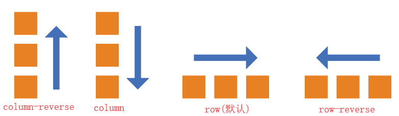
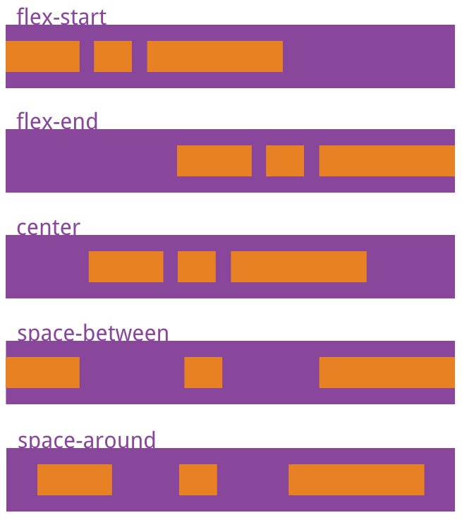
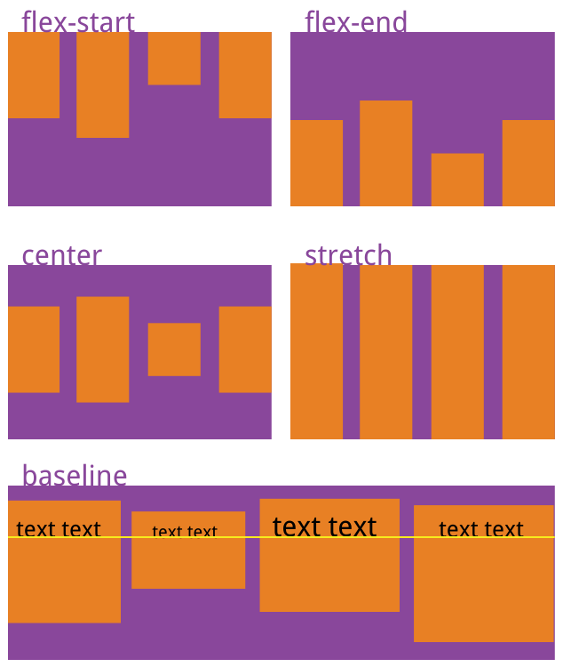

Flex 布局
===

> create by **jsliang** on **2019-3-27 13:36:02**   
> Recently revised in **2019-05-30 21:25:35**

万丈高楼平地起，熟悉 `Flex` 需要先了解 `Flex` 的下面这 `6` 个 `CSS` 属性：

```css
/* 设置 Flex 模式 */
display: flex;

/* 决定元素是横排还是竖着排，要不要倒序 */
flex-direction: column;

/* 决定元素换行格式，一行排不下的时候如何排 */
flex-wrap: wrap;

/* flex-flow = flex-direction + flex-wrap */
flex-flow: column wrap;

/* 同一排下对齐方式，空格如何隔开各个元素 */
justify-content: space-between;

/* 同一排下元素如何对齐，顶部对齐、中部对齐还是其他 */
align-items: center;

/* 多行对齐方式 */
align-content: space-between;
```

下面我们详细分析这些元素的情况：

**知识点 1**. `flex-direction`：决定主轴的方向
  
* `row` - （默认）水平方向，起点在左端
* `row-reverse` - 水平方向，起点在右端 
* `column` - 垂直方向，起点在上沿 
* `column-reverse` - 垂直方向，起点在下沿

```
display: flex;

flex-direction: row | row-reverse | column | column-reverse;
```



**知识点 2**. `flex-wrap`：一条轴线（一行）排不下时如何解决

* `nowrap` - （默认）不换行
* `wrap` - 换行，第一行在上方
* `wrap-reverse` - 换行，第一行在下方

```
display: flex;

flex-wrap: nowrap | wrap | wrap-reverse;  
```


**知识点 3**. `flex-flow`：flex-flow = flex-direction + flex-wrap。即 flex-flow 是这两个属性的合集

* `row nowrap` - （默认）水平方向，起点在左端，不换行

```
display: flex;

flex-flow: <flex-direction> || <flex-wrap>;
```

详解参考 `1` 和 `2`

**知识点 4**. `justify-content`：定义项目在主轴上的对齐方式

* `flex-start` - 左边对齐
* `flex-end` - 右边对齐
* `center` - 居中对齐
* `space-between` - 两端对齐，空格在中间
* `space-around` - 空格环绕

```
display: flex;

justify-content: flex-start | flex-end | center | space-between | space-around;
```



**知识点 5**. `align-items`：定义项目在交叉轴上如何对齐

* `flex-start` - 顶部对齐，即文字图片等顶部同一条线上
* `flex-end` - 底部对其，即文字图片等底部在同一条线上
* `center` - 中间对其，即文字图片不管多高，都拿它们的中间放在同一条线上
* `stretch` - 将文字图片充满整个容器的高度，强制统一
* `baseline` - 将每项的第一行文字做统一在一条线上对齐

```
display: flex;

align-items: flex-start | flex-end | center | stretch | baseline;
```



**知识点 6**. `align-content`：定义多根轴线的对齐方式。如果只有一根轴线（只有一行），该属性不起作用

* `flex-start` - 这几行顶部对齐
* `flex-end` - 这几行底部对齐
* `center` - 这几行居中对齐
* `stretch` - 这几行进行扩展或者缩放，从而填满容器高
* `space-between` - 这几行中间使用空格进行填充
* `space-around` - 这几行两边及中间进行填充

```
display: flex;

align-content: flex-start | flex-end | center | space-between | space-around | stretch;
```


> <a rel="license" href="http://creativecommons.org/licenses/by-nc-sa/4.0/"></a><br /><span xmlns:dct="http://purl.org/dc/terms/" property="dct:title">jsliang 的文档库</span> 由 <a xmlns:cc="http://creativecommons.org/ns#" href="https://github.com/LiangJunrong/document-library" property="cc:attributionName" rel="cc:attributionURL">梁峻荣</a> 采用 <a rel="license" href="http://creativecommons.org/licenses/by-nc-sa/4.0/">知识共享 署名-非商业性使用-相同方式共享 4.0 国际 许可协议</a>进行许可。<br />基于<a xmlns:dct="http://purl.org/dc/terms/" href="https://github.com/LiangJunrong/document-library" rel="dct:source">https://github.com/LiangJunrong/document-library</a>上的作品创作。<br />本许可协议授权之外的使用权限可以从 <a xmlns:cc="http://creativecommons.org/ns#" href="https://creativecommons.org/licenses/by-nc-sa/2.5/cn/" rel="cc:morePermissions">https://creativecommons.org/licenses/by-nc-sa/2.5/cn/</a> 处获得。