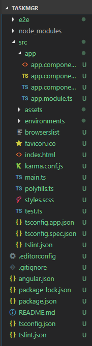
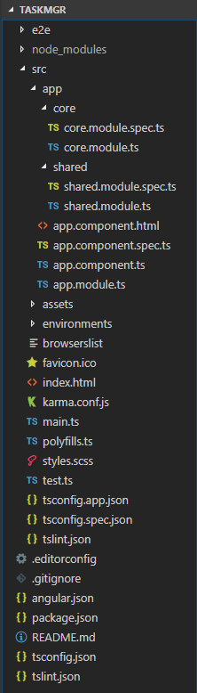

Angular Demo One - 打造企业级协作平台
===

> create by **jsliang** on **2018-9-5 11:56:07**  
> Recently revised in **2019-2-11 10:05:39**

## 目录

| 章节名 | 导航                                |
| ------ | ----------------------------------- |
| 第一章 | [环境搭建](./taskmgr-chapter1.md) |
| 第二章 | [项目工程结构介绍 UI](./taskmgr-chapter2.md) |
| 第三章 | [UI整体布局](./taskmgr-chapter3.md) |
| More... | 已断更！缺乏对应基础，补基础去了！ |

## 第一章 环境搭建

**1. 安装 Angular：**  

`npm i @angular/cli -g`

```
     _                      _                 ____ _     ___
    / \   _ __   __ _ _   _| | __ _ _ __     / ___| |   |_ _|
   / △ \ | '_ \ / _` | | | | |/ _` | '__|   | |   | |    | |
  / ___ \| | | | (_| | |_| | | (_| | |      | |___| |___ | |
 /_/   \_\_| |_|\__, |\__,_|_|\__,_|_|       \____|_____|___|
                |___/


Angular CLI: 6.1.5
Node: 8.11.2
OS: win32 x64
Angular:
...

Package                      Version
------------------------------------------------------
@angular-devkit/architect    0.7.5
@angular-devkit/core         0.7.5
@angular-devkit/schematics   0.7.5
@schematics/angular          0.7.5
@schematics/update           0.7.5
rxjs                         6.3.2
typescript                   2.9.2
```

**2. 安装 VS Code 插件：**  

`Debugger for Chrome`、`Angular 6 Snippets`

**3. 安装开发插件：**  

安装 Chrome 关于 Angular 的开发插件：[点击前往](../../other-library/crx/readMe.md)

**4. 常用命令：**

```
npm i -S —— 软件开发依赖
npm i -D —— 软件生产依赖
ng new  —— 新建 Angular项目
ng build -prod —— 生产环境编译
ng server —— 启动开发服务器
```

**5. Mock Rest API：**

* json-server: 用户快速搭建 REST API 的利器。
* 安装：`npm i json-server -g`，版本为 `0.14.0` 。 
* 启动：`json-server /json 文件位于的目录/*.json`。
* 支持 GET， POST， PUT， PATCH， DELETE 等 REST 命令。

**6. 测试 REST API：**  

* 几种常用的 API 测试工具：
1. 使用 Postman 测试常用的 API：[地址](https://www.getpostman.com/)
2. 使用 VS Code 的 REST Client 插件

> 此刻， **jsliang** 的 `node` 等版本为：  
> `node` : 8.11.2  
> `npm` : 6.3.0  
> `cnpm` : 6.0.0

## 第二章 项目工程结构介绍


### 2.1 文件组织约定

* 目录结构按相对独立的功能划分
* src/app 下第一层子目录中除了模块，还有领域对象、动画和工具文件夹
* 资源存放在 src/assets 目录下

### 2.2 命名约定

* 模块和组件的类文件都使用 index.ts 的命名约定

### 2.3 新建项目

```
ng new taskmgr -si --style=scss —— 新建 angular 项目
// 注： -si === --skip-install
cnpm i —— 安装依赖
ng g m core —— 创建核心模块
ng g m shared —— 创建分享模块
```






### 2.4 添加代码

> taskmgr/src/app/core/core.module.ts

```
// 原代码
import { NgModule } from '@angular/core';
import { CommonModule } from '@angular/common';

@NgModule({
  imports: [
    CommonModule
  ],
  declarations: []
})
export class CoreModule { }
```

```
// 更新后代码
import { NgModule, SkipSelf } from '@angular/core';
import { CommonModule } from '@angular/common';

@NgModule({
  imports: [
    CommonModule
  ],
  declarations: []
})
export class CoreModule { 
  constructor(parent: CoreModule) {
    if(parent) {
      throw new Error("模块已经存在，不能再次加载！");
    }
  }
}
```

> taskmgr/src/app/shared/shared.module.ts

```
// 原代码
import { NgModule } from '@angular/core';
import { CommonModule } from '@angular/common';

@NgModule({
  imports: [
    CommonModule
  ],
  declarations: []
})
export class SharedModule { }

```

```
// 更新后代码
import { NgModule } from '@angular/core';
import { CommonModule } from '@angular/common';

@NgModule({
  imports: [
    CommonModule
  ],
  exports: [
    CommonModule
  ],
  declarations: []
})
export class SharedModule { }

```

> taskmgr/src/app/app.module.ts

```
// 原代码
import { BrowserModule } from '@angular/platform-browser';
import { NgModule } from '@angular/core';

import { AppComponent } from './app.component';

@NgModule({
  declarations: [
    AppComponent
  ],
  imports: [
    BrowserModule
  ],
  providers: [],
  bootstrap: [AppComponent]
})
export class AppModule { }
```

```
// 更新后代码
import { BrowserModule } from '@angular/platform-browser';
import { NgModule } from '@angular/core';

import { CoreModule } from './core/core.module';

import { AppComponent } from './app.component';

@NgModule({
  declarations: [
    AppComponent
  ],
  imports: [
    BrowserModule,
    CoreModule
  ],
  providers: [],
  bootstrap: [AppComponent]
})
export class AppModule { }
```

## 第三章 UI整体布局


### 3.1 修改代码
1. `ng g c core/header --spec=false`
2. `ng g c core/footer --spec=false`
3. `ng g c core/sidebar --spec=false`

> taskmgr/src/app/app.component.html

```
// 源代码
<!--The content below is only a placeholder and can be replaced.-->
<div style="text-align:center">
  <h1>
    Welcome to {{ title }}!
  </h1>
  
</div>
<h2>Here are some links to help you start: </h2>
<ul>
  <li>
    <h2><a target="_blank" rel="noopener" href="https://angular.io/tutorial">Tour of Heroes</a></h2>
  </li>
  <li>
    <h2><a target="_blank" rel="noopener" href="https://github.com/angular/angular-cli/wiki">CLI Documentation</a></h2>
  </li>
  <li>
    <h2><a target="_blank" rel="noopener" href="https://blog.angular.io/">Angular blog</a></h2>
  </li>
</ul>
```

```
// 修改后
<div>
  <header>
    <app-header></app-header>
  </header>
  <main></main>
  <footer>
    <app-footer></app-footer>
  </footer>
</div>
```

> taskmgr/src/app/core/core.module.ts

```
// 源代码

```

```
// 修改后

```

> <a rel="license" href="http://creativecommons.org/licenses/by-nc-sa/4.0/"></a><br /><span xmlns:dct="http://purl.org/dc/terms/" property="dct:title">jsliang的文档库</span> 由 <a xmlns:cc="http://creativecommons.org/ns#" href="https://github.com/LiangJunrong/document-library" property="cc:attributionName" rel="cc:attributionURL">梁峻荣</a> 采用 <a rel="license" href="http://creativecommons.org/licenses/by-nc-sa/4.0/">知识共享 署名-非商业性使用-相同方式共享 4.0 国际 许可协议</a>进行许可。<br />基于<a xmlns:dct="http://purl.org/dc/terms/" href="https://github.com/LiangJunrong/document-library" rel="dct:source">https://github.com/LiangJunrong/document-library</a>上的作品创作。<br />本许可协议授权之外的使用权限可以从 <a xmlns:cc="http://creativecommons.org/ns#" href="https://creativecommons.org/licenses/by-nc-sa/2.5/cn/" rel="cc:morePermissions">https://creativecommons.org/licenses/by-nc-sa/2.5/cn/</a> 处获得。