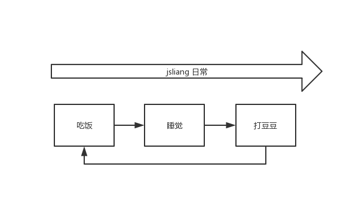
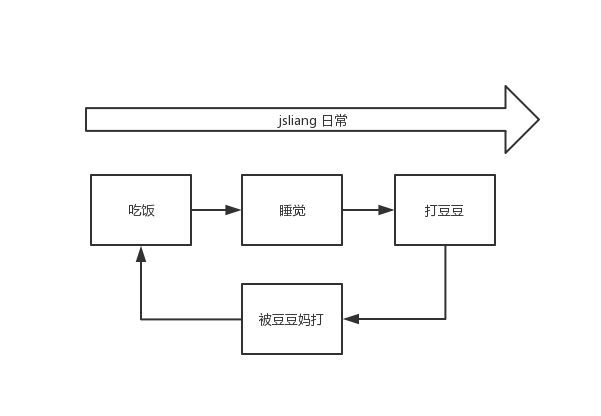
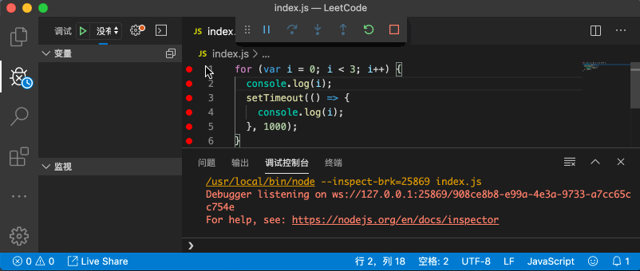

Event Loop
===

> Create by **jsliang** on **2019-12-09 11:34:15**  
> Recently revised in **2019-12-12 19:49:39**

**关注 jsliang 的文档库，了解更多技术、理财、健身文档：https://github.com/LiangJunrong/document-library**

## <a name="chapter-one" id="chapter-one"></a>一 目录

**不折腾的前端，和咸鱼有什么区别**

| 目录 |
| --- | 
| [一 目录](#chapter-one) | 
| <a name="catalog-chapter-two" id="catalog-chapter-two"></a>[二 前言](#chapter-two) |
| <a name="catalog-chapter-three" id="catalog-chapter-three"></a>[三 Event Loop](#chapter-three) |
| <a name="catalog-chapter-four" id="catalog-chapter-four"></a>[四 浏览器 Event Loop](#chapter-four) |
| <a name="catalog-chapter-five" id="catalog-chapter-five"></a>[五 Node.js Event Loop](#chapter-five) |
| <a name="catalog-chapter-six" id="catalog-chapter-six"></a>[六 总结](#chapter-six) |
| <a name="catalog-chapter-seven" id="catalog-chapter-seven"></a>[七 参考文献](#chapter-seven) |

## <a name="chapter-two" id="chapter-two"></a>二 前言

> [返回目录](#chapter-one)

Hello 小伙伴们早上好、中午好、下午好、晚上好、凌晨好~

在日常工作中，你有没有碰到过这种疑惑：

* 疑惑一：为什么这份代码它不按照我的意思走？为啥不是输出 `1 2 3`？

```js
for (var i = 0; i < 3; i++) {
  setTimeout(() => {
    console.log(i);
  }, 1000);
}
// console:
// 3
// 3
// 3
```

* 疑惑二：为什么这份代码它也不按照我的意思走？为啥不是输出 `jsliang`？

```js
let name;

setTimeout(() => {
  name = '梁峻荣';
  console.log(name);
}, 1000);

if (name) {
  name = 'jsliang';
  console.log(name);
}
// console: '梁峻荣'
```

孩子没娘，说来话长。

既然说来话长，**jsliang** 只能尝试长话短说了：

* **本篇文章从 Event Loop 起因说起，通过探讨 浏览器环境 Event Loop 和 Node.js 环境 Event Loop，从而解惑工作中产生的困扰，扩展你面试知识点。**

这么一说，咱也好对文章进行划分了：

* **第三章 Event Loop**：解释 Event Loop 产生原因和代码演示。
* **第四章 浏览器 Event Loop**：解惑工作困扰和扩展必备面试知识点。
* **第五章 Node.js Event Loop**：进一步探索浏览器和 Node.js 中 Event Loop 的不同。

OK，Let's go!

## <a name="chapter-three" id="chapter-three"></a>三 Event Loop

> [返回目录](#chapter-one)

* 问：什么是 Event Loop，为什么需要 Event Loop？

答：

**首先**，我们需要知道的是：JavaScript 是单线程的。

单线程意味着，所有任务都需要排队，前一个任务结束，才会执行后一个任务。

假设 **jsliang** 和 JavaScript 一样一次只能做一件事，那么大概就是如下图所示。



而这种 **主线程从 “任务队列” 中读取执行事件，不断循环重复的过程**，就被称为 **事件循环（Event Loop）**。

**然后**，如果前一个任务耗时很长，后一个任务就不得不一直等着，那么我们肯定要对这种情况做一些特殊处理，毕竟很多时候我们并不是完全希望它如此执行。

所以为了协调事件（event），用户交互（user interaction），脚本（script），渲染（rendering），网络（networking）等，用户代理（user agent）必须使用事件循环（event loops）。

这样，在了解 **浏览器 Event Loop** 和 **Node.js Event Loop** 的情况下，我们就可以了解它的执行过程。

通过自身的了解，来处理一些较为棘手的问题。

为了加深小伙伴们的印象，可以看下图：



**jsliang** 日常中，强制被加上了 “被豆豆妈打”（废话，豆豆那么可爱，你怎么可以打豆豆）。

当然，这个被打的顺序也不一定是在后面，可能打多两次后，“睡觉” 完之后就是 “被豆豆妈打” 了。

通过这个解释，小伙伴们应该知道为啥有 **浏览器 Event Loop** 和 **Node.js Event Loop** 了。

等等，你刚才说到了 **浏览器 Event Loop** 和 **Node.js Event Loop**，为什么都是关于 JavaScript 的，在这两部分都不一样呢？

* 简单来说：**你的页面放到了浏览器去展示，你的数据放到了后台处理（将 Node.js 看成 PHP、Java 等后端语言），这两者能没有区别么？！**

你说了跟没说一样，为什么会这样你没有解释啊！

好的，说得再仔细点：

* **Node.js**：Node.js 的 Event Loop 是基于 libuv。libuv 已经对 Event Loop 作出了实现。
* **浏览器**：浏览器的 Event Loop 是基于 [HTML5 规范](https://html.spec.whatwg.org/multipage/webappapis.html#event-loops)的。而 HTML5 规范中只是定义了浏览器中的 Event Loop 的模型，具体实现留给了浏览器厂商。

> libuv 是一个多平台支持库，主要用于异步 I/O。它最初是为 Node.js 开发的，现在 Luvit、Julia、pyuv 和其他的框架也使用它。[Github - libuv 仓库](https://github.com/libuv/libuv)

恍然大悟，的确是不一样的啊！

所以，咱们得将这两个 Event Loop 区分开来，它们是不一样的东东哈~

**最后**，咱们解疑开头的两个问题，为什么会这样子，有没办法解决？

* 疑惑一：为什么这份代码它不按照我的意思走？为啥不是输出 `1 2 3`？

```js
for (var i = 0; i < 3; i++) {
  setTimeout(() => {
    console.log(i);
  }, 1000);
}
// console:
// 3
// 3
// 3
```

这道题是面试常备题，它是个很有意思的问题，不仅可以让面试官跟你闲聊到 Event Loop，也可以闲聊下 `var let const`。

为此，**jsliang** 特意录制了一个 GIF，希望能帮助小伙伴进一步探索这个机制：



> 软件是 VS Code，调试方式是 Node.js

请仔细观看 GIF 图：

1. 在执行 `for` 遍历的时候，它先执行了和 `setTimeout` 同级的 `console`，然后往下执行，到 `setTimeout` 的时候，跳过了（放到某个位置）`setTimeout`，依次打印了 `0, 1, 2`。
2. 步骤 1 跳过的三次 `setTimeout` 开始执行，但是这时候的 `i` 的值，经过前面的 `i++` 后，变成了 `3`（`for` 中止循环后，`i` 已经是 `3` 了）。所以，再依次打印了 `3 3 3`。

就是说，先走了正常的 `for`，然后碰到 `setTimeout` 时，将 `setTimeout` 依次放到了异次元，最后走完 `for` 后，再将异次元中的的 `setTimeout` 放出，依次将数字给输出了。

这个执行机制，就是 Event Loop 的影响，恍然大悟有木有~

这个问题的精妙之处在于，它不仅可以问你关于 Event Loop 的部分，还可以考察你对于 ES6 的 `let` 和 ES5 的 `var` 的区分，因为它有一个解决方式就是使用了 ES6 的 `let`。

> 解决这个问题之前，不妨思考下下面的输出：

```js
for (var i = 0; i < 3; i++) {

}
for (let j = 0; j < 3; j++) {

}
console.log(i);
console.log(j);
```

如果小伙伴对 ES6 有些许了解，应该不难猜出：

```
3
ReferenceError: j is not defined
```

是不是有些想法，那么咱们再看下下面的解决方法，再进行总结：

```js
for (let i = 0; i < 3; i++) {
  setTimeout(() => {
    console.log(i);
  }, 1000);
}
// console：
// 0
// 1
// 2
```

是的，将 `var i` 改成了 `let i` 后，输出的结果依次是 `0 1 2` 了。

为什么呢？简单回复就是：

**`let` 在 `for` 中形成了独特的作用域块，当前的 `i` 只在本轮循环中有效，然后 `setTimeout` 会找到本轮最接近的 `i`，从而作出了正确的输出。**

而我们通过 `var` 进行的定义，它会污染全局变量，所以在 `for` 外层，还可以看到 `i` 的值。

当然，讲到这里，你可能还是不太清楚更细节的区分，亦或者面试官进一步问你 `var let const` 的区分了，你要怎么更好回答？

看看阮一峰大佬的 ES6 文档吧：http://es6.ruanyifeng.com/#docs/let

这里就不哆嗦了，有空我再将 ES6 这块内容整理到我的文档库中，欢迎持续关注 jsliang 的文档库：https://github.com/LiangJunrong/document-library。

* 疑惑二：为什么这份代码它也不按照我的意思走？为啥不是输出 `梁峻荣`？

```js
let name;

setTimeout(() => {
  name = 'jsliang';
  console.log(name);
}, 1000);

if (name) {
  name = '梁峻荣';
  console.log(name);
}
// console: 'jsliang'
```

当你了解产生疑惑一的原因后，疑惑二也就不破而解了。

我们希望的是 JavaScript 按照我们需要的顺序写，结果它并没有，就是因为受到了 Event Loop 的影响。

JavaScript 在碰到 `setTimeout` 的时候，会将它封印进异次元，只有等所有正常的语句（`if`、`for`……）执行完毕后，才会将它从异次元解封，输出最终结果。

咦，这就有意思了，浏览器的异次元和 Node.js 的异次元都是怎样的呢？我们一起往下看。

## <a name="chapter-four" id="chapter-four"></a>四 浏览器 Event Loop

> [返回目录](#chapter-one)

在讲解浏览器的 Event Loop 前，我们需要先了解一下 JavaScript 的运行机制：

1. 所有同步任务都在主线程上执行，形成一个 **“执行栈”**（execution context stack）。
2. 主线程之外，存在一个 **“任务队列”**（task queue），在走主流程的时候，如果碰到异步任务，那么就在 **“任务队列”** 中放置这个异步任务。
3. 一旦 **“执行栈”** 中所有同步任务执行完毕，系统就会读取 **“任务队列”**，看看里面存在哪些事件。那些对应的异步任务，结束等待状态，进入执行栈，开始执行。
4. 主线程不断重复上面三个步骤。

而 JavaScript 的异步任务，还细分两种任务：

* **宏任务（Macrotask）**：`script`（整体代码）、`setTimeout`、`setInterval`、`XMLHttpRequest.prototype.onload`、`I/O`、UI 渲染
* **微任务（Microtask）**：`Promise`、`MutationObserver`

这么讲是不太容易理解的，咱们上图：


```js
for (var i = 0; i < 3; i++) {

}
console.log(i);
```

## 实例

> 实例 1

```js
setTimeout(function () {
  console.log('timeout1');
}, 0);

console.log('start');

Promise.resolve().then(function () {
  console.log('promise1');
  Promise.resolve().then(function () {
    console.log('promise2');
  });
  setTimeout(function () {
    Promise.resolve().then(function () {
      console.log('promise3');
    });
    console.log('timeout2')
  }, 0);
});

console.log('done');
```

## <a name="chapter-five" id="chapter-five"></a>五 Node.js Event Loop

> [返回目录](#chapter-one)


## <a name="chapter-six" id="chapter-six"></a>六 总结

> [返回目录](#chapter-one)

如果你看到这里，你已经近乎懵逼，那么，给你一个建议：

* **不管 Event Loop 在浏览器亦或者 Node.js 表现机制，最好的操作还是在对应环境中进行尝试。**

你不能完全保证你的记忆力是 OK 的，所以你只需要知道有这个问题，然后在工作中实践解决即可。

enm...所以你看完了一篇水文，唯一的作用是让你面试的时候，能愉快地玩耍一些简单题目~

哈哈，Good luck.

## <a name="chapter-seven" id="chapter-seven"></a>七 参考文献

> [返回目录](#chapter-one)

感谢以下大佬们的文章，让我受益颇多。

并在他们创作的基础上，基于自己的想法，进行了整合。

1. [《Tasks, microtasks, queues and schedules》 - Jake](https://jakearchibald.com/2015/tasks-microtasks-queues-and-schedules/)
2. [《彻底搞懂浏览器 Event-loop》 - 刘小夕](https://juejin.im/post/5c947bca5188257de704121d)
3. [《彻底理解 JS Event Loop（浏览器环境）》 - 93](https://juejin.im/post/5aa3332b518825557c011896)
4. [《彻底弄懂浏览器端的 Event-Loop》 - 长可](https://juejin.im/post/5c303e67518825260b46cbdc)
5. [《什么是浏览器的事件循环（Event Loop）？》 - 鱼子酱](https://segmentfault.com/a/1190000010622146)
6. [《理解event loop（浏览器环境与nodejs环境）》 - sugerpocket](https://imweb.io/topic/5b148768d4c96b9b1b4c4ea1)
7. [《从 event loop 规范探究 JavaScript 异步及浏览器更新渲染时机》 - 杨敬卓](https://github.com/aooy/blog/issues/5)
8. [《跟着 Event loop 规范理解浏览器中的异步机制》 - fi3ework](https://github.com/fi3ework/blog/issues/29)
9. [《不要混淆 nodejs 和浏览器中的 event loop》 - youth7](https://cnodejs.org/topic/5a9108d78d6e16e56bb80882)
10. [《浏览器的 event loop 和 node 的 event loop》 - 金大光](https://juejin.im/post/5b095a1d6fb9a07abc2a5e81)
11. [《浏览器与 Node 的事件循环(Event Loop)有何区别?》 - 浪里行舟](https://juejin.im/post/5c337ae06fb9a049bc4cd218)
12. [《浏览器和 Node 不同的事件循环（Event Loop）》 - toBeTheLight](https://juejin.im/post/5aa5dcabf265da239c7afe1e)
13. [《let 和 const 命令》 - 阮一峰](http://es6.ruanyifeng.com/#docs/let)
14. [《Node.js Event Loop》 - Node.js 官网](https://nodejs.org/zh-cn/docs/guides/event-loop-timers-and-nexttick/)

---

**不折腾的前端，和咸鱼有什么区别！**


**jsliang** 会每天更新一道 LeetCode 题解，从而帮助小伙伴们夯实原生 JS 基础，了解与学习算法与数据结构。

**浪子神剑** 会每天更新面试题，以面试题为驱动来带动大家学习，坚持每天学习与思考，每天进步一点！

扫描上方二维码，关注 **jsliang** 的公众号（左）和 **浪子神剑** 的公众号（右），让我们一起折腾！

> <a rel="license" href="http://creativecommons.org/licenses/by-nc-sa/4.0/"></a><br /><span xmlns:dct="http://purl.org/dc/terms/" property="dct:title">jsliang 的文档库</span> 由 <a xmlns:cc="http://creativecommons.org/ns#" href="https://github.com/LiangJunrong/document-library" property="cc:attributionName" rel="cc:attributionURL">梁峻荣</a> 采用 <a rel="license" href="http://creativecommons.org/licenses/by-nc-sa/4.0/">知识共享 署名-非商业性使用-相同方式共享 4.0 国际 许可协议</a>进行许可。<br />基于<a xmlns:dct="http://purl.org/dc/terms/" href="https://github.com/LiangJunrong/document-library" rel="dct:source">https://github.com/LiangJunrong/document-library</a>上的作品创作。<br />本许可协议授权之外的使用权限可以从 <a xmlns:cc="http://creativecommons.org/ns#" href="https://creativecommons.org/licenses/by-nc-sa/2.5/cn/" rel="cc:morePermissions">https://creativecommons.org/licenses/by-nc-sa/2.5/cn/</a> 处获得。