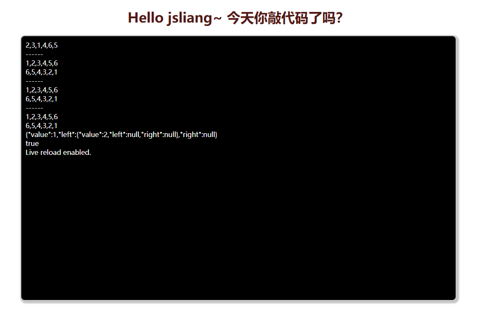

console 那些事
===

> create by **jsliang** on **2020-4-10 08:47:24**  
> Recently revised in **2020-4-10 09:00:21**

## <a name="chapter-one" id="chapter-one">一 目录</a>

**不折腾的前端，和咸鱼有什么区别**

| 目录 |
| --- | 
| [一 目录](#chapter-one) | 
| <a name="catalog-chapter-two" id="catalog-chapter-two"></a>[二 前言](#chapter-two) |
| <a name="catalog-chapter-three" id="catalog-chapter-three"></a>[三 皈依佛门法](#chapter-three) |
| <a name="catalog-chapter-four" id="catalog-chapter-four"></a>[四 原生法](#chapter-four) |
| <a name="catalog-chapter-five" id="catalog-chapter-five"></a>[五 ES6 大法](#chapter-five) |
| <a name="catalog-chapter-six" id="catalog-chapter-six"></a>[六 加减大法](#chapter-six) |
| <a name="catalog-chapter-seven" id="catalog-chapter-seven"></a>[七 参考文献](#chapter-seven) |

## <a name="chapter-two" id="chapter-two">二 前言</a>

> [返回目录](#chapter-one)

今天突发奇想，能不能将 Console 的文字打印到 HTML 中呢？

答案是可以的：



那么，在探索实现的过程中，**jsliang** 做了什么事，咱们一一瞅瞅~

## <a name="chapter-three" id="chapter-three">三 皈依佛门法</a>

> [返回目录](#chapter-one)

先将源码抛出来，方便白嫖的小伙伴可以拿了就跑：

> index.html

```html
<!DOCTYPE html>
<html lang="en">
<head>
  <meta charset="UTF-8">
  <meta name="viewport" content="width=device-width, initial-scale=1.0">
  <meta http-equiv="X-UA-Compatible" content="ie=edge">
  <title>JavaScript - 算法与数据结构</title>
  <link rel="stylesheet" href="./index.css">
  <link rel="stylesheet" href="./rainbow.css">
</head>
<body>
  <div class="container">
    <h1 class="rainbow text-center">
      Hello jsliang~ 今天你敲代码了吗？
      <span data-text="Hello jsliang~ 今天你敲代码了吗？"></span>
    </h1>
    <div class="log" id="log">

    </div>
  </div>
  <script>
    (function() {
      let logger = document.getElementById('log');
      console.log = function(message) {
        if (Object.prototype.toString.call(message).slice(8, -1) === 'Object') {
          logger.innerHTML += JSON.stringify(message) + '<br />';
        } else {
          logger.innerHTML += message + '<br />';
        }
      };
    })();
  </script>
  <script src="./index.js"></script>
</body>
</html>
```

> index.js

```js
const jsliangSort = function() {
  // 用 let，后面需要改造
  let array = [];

  // 打印数组
  this.print = function() {
    console.log(array);
  };

  // 获取数组
  this.getArray = function() {
    return array;
  };

  // 清空数组
  this.clear = function() {
    array = [];
  };

  // 插入元素，支持单个元素或者数组，不支持对象
  this.insert = function(item) {
    if (Object.prototype.toString.call(item).slice(8, -1) === 'Array') {
      array = [...array, ...item];
    } else {
      array.push(item);
    }
    return this;
  };

  // 冒泡排序
  this.bubbleSort = function(type = 'asc') {
    for (let i = 0; i < array.length; i++) {
      // 设置冒泡阻止 flag
      let stopFlag = true;
      for (let j = 0; j < array.length - 1; j++) {
        if (
          (type === 'asc' && array[j] > array[j + 1])
          || (type === 'desc' && array[j] < array[j + 1])
        ) {
          [array[j], array[j + 1]] = [array[j + 1], array[j]];
          stopFlag = false;
        }
      }
      // 如果没有发生冒泡，说明它已完成排序，可以提前结束冒泡
      if (stopFlag) {
        break;
      }
    }
  };

  // 选择排序
  this.selectionSort = function(type = 'asc') {
    let changeIndex;
    for (let i = 0; i < array.length - 1; i++) {
      changeIndex = i;
      for (let j = i + 1; j < array.length; j++) {
        if (
          (type === 'asc' && array[changeIndex] > array[j])
          || (type === 'desc' && array[changeIndex] < array[j])
        ) {
          changeIndex = j;
        }
      }
      if (i !== changeIndex) {
        [array[changeIndex], array[i]] = [array[i], array[changeIndex]];
      }
    }
  };
};

const array = new jsliangSort();

array.insert([2, 3, 1, 4]).insert(6).insert(5);
array.print(); // [2, 3, 1, 4, 6, 5]

console.log('------');
console.time('内置排序');

const asc = array.getArray().sort((a, b) => a - b);
console.log(asc); // [ 1, 2, 3, 4, 5, 6 ]
const desc = array.getArray().sort((a, b) => b - a);
console.log(desc); // [ 6, 5, 4, 3, 2, 1 ]

console.timeEnd('内置排序'); // 内置排序: 0.680ms

array.clear();
array.insert([2, 3, 1, 4]).insert(6).insert(5);

console.log('------');
console.time('冒泡排序');

array.bubbleSort();
array.print(); // [ 1, 2, 3, 4, 5, 6 ]

array.bubbleSort('desc');
array.print(); // [ 6, 5, 4, 3, 2, 1 ]

console.timeEnd('冒泡排序'); // 冒泡排序: 0.244ms

array.clear();
array.insert([2, 3, 1, 4]).insert(6).insert(5);

console.log('------');
// const start = window.performance.now();
console.time('选择排序');

array.selectionSort();
array.print(); // [ 1, 2, 3, 4, 5, 6 ]

array.selectionSort('desc');
array.print(); // [ 6, 5, 4, 3, 2, 1 ]

console.timeEnd('选择排序'); // 选择排序: 0.180ms
// const end = window.performance.now();

array.clear();
array.insert([2, 3, 1, 4]).insert(6).insert(5);

const tree = {
  value: 1,
  left: { value: 2, left: null, right: null },
  right: null,
}
console.log(tree);

console.log(Object.prototype.toString.call(tree).slice(8, -1) === 'Object');


// console.log(start);
// console.log(end);
// console.log(end - start);

console.log(global.per);
```

> index.css

```css
.text-center {
  text-align: center;
}
.log {
  width: 1000px;
  height: 600px;
  overflow: auto;
  margin: 0 auto;
  padding: 10px;
  border: 2px solid #ccc;
  border-radius: 10px;
  box-shadow: 3px 3px 3px 3px #ccc;
  background: black;
  color: #fff;
}
```

> rainbow.css

```css
.rainbow {
	color: transparent;
	font-family: sans-serif;
  position: relative;
  color: black;
}

.rainbow span::before,
.rainbow span::after {
	content: attr(data-text);
	position: absolute;
	top: 0;
  left: 0;
  bottom: 0;
  right: 0;
  margin: auto;
	overflow: hidden;
  animation: animate 2s infinite alternate;
  animation-delay: 1s;
  filter: opacity(0);
}

.rainbow span:nth-child(1)::before {
	color: tomato;
	--n: 1;
}

.rainbow span:nth-child(1)::after {
	color: rgb(250, 74, 74, 0.7);
  --n: 2;
}

@keyframes animate {
	from {
		filter: opacity(0);
	}

	to {
		filter: opacity(1);
	}
}
````

## <a name="chapter-four" id="chapter-four">四 原生法</a>

> [返回目录](#chapter-one)


## <a name="chapter-five" id="chapter-five">五 ES6 大法</a>

> [返回目录](#chapter-one)


## <a name="chapter-six" id="chapter-six">六 加减大法</a>

> [返回目录](#chapter-one)


## <a name="chapter-seven" id="chapter-seven">七 参考文献</a>

> [返回目录](#chapter-one)

* [【博客园】睡着的糖葫芦《Javascript 将 console.log 日志打印到 html 页面中》](https://www.cnblogs.com/loveyouyou616/p/11176647.html)
* [【IT屋】IT屋《如何从JS Console中的console.timeEnd（）获取输出？(How to get the output from console.timeEnd() in JS Console?)》](https://www.it1352.com/1057474.html)
* [【知乎】早乙女瑞穂《node.js 用 console.time 测试性能时的坑》](https://zhuanlan.zhihu.com/p/28978126)
* [【CodePen】Stripy rainbow text effects《彩虹字实现》](https://codepen.io/comehope/pen/ELpRxj?__cf_chl_jschl_tk__=53f1ed0e3427de9df3527acb17063421573fb546-1586478286-0-AZ7GbsdaToOebfm7UK657ujS3VMx00EYVWES3TL41Icoxc2P9kUu-38j_GVz9GrHpSp6y9DbcNBaxZbIcAGj-anqNrbrMAidYgTw5bYL6ME9w-zaWI8moVfUIsf_cpz-RrEEVQXk44wD4MD6pHctrJpgtqPpE1YGv6PQirG_XWZ6qx-0-Y1Vrz5vX-Te-FPbXxJxf0Aji2TrsB7DuwjgwtMPjVR9XrHDFinnxZInbnkMuwB0EFXBk5loAy7UYZjEHedQU09MpvuDbSmxHQaIa4JL_PhfufPsQHiPJfyxokimQW4Ov0VVxWIWfnVf9dLpOHz46A_1NKAbhQQMzmBmvLFYCXPT-TEVCumHfVtb685d)

> <a rel="license" href="http://creativecommons.org/licenses/by-nc-sa/4.0/"></a><br /><span xmlns:dct="http://purl.org/dc/terms/" property="dct:title">jsliang的文档库</span> 由 <a xmlns:cc="http://creativecommons.org/ns#" href="https://github.com/LiangJunrong/document-library" property="cc:attributionName" rel="cc:attributionURL">梁峻荣</a> 采用 <a rel="license" href="http://creativecommons.org/licenses/by-nc-sa/4.0/">知识共享 署名-非商业性使用-相同方式共享 4.0 国际 许可协议</a>进行许可。<br />基于<a xmlns:dct="http://purl.org/dc/terms/" href="https://github.com/LiangJunrong/document-library" rel="dct:source">https://github.com/LiangJunrong/document-library</a>上的作品创作。<br />本许可协议授权之外的使用权限可以从 <a xmlns:cc="http://creativecommons.org/ns#" href="https://creativecommons.org/licenses/by-nc-sa/2.5/cn/" rel="cc:morePermissions">https://creativecommons.org/licenses/by-nc-sa/2.5/cn/</a> 处获得。
