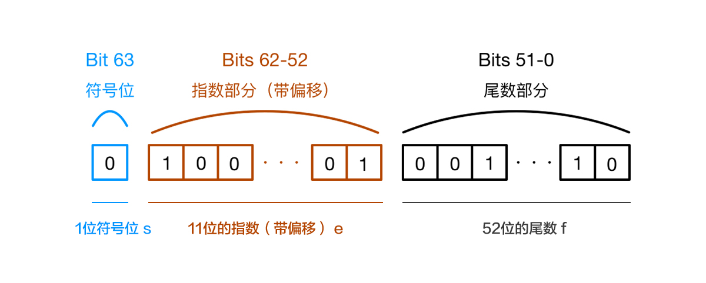

加减危机 —— 为什么会出现这样的结果？
===

> Create by **jsliang** on **2019-11-01 19:48:33**  
> Recently revised in **2019-11-25 09:25:49**

## <a name="chapter-one" id="chapter-one"></a>一 目录

**不折腾的前端，和咸鱼有什么区别**

| 目录 |
| --- | 
| [一 目录](#chapter-one) | 
| <a name="catalog-chapter-two" id="catalog-chapter-two"></a>[二 前言](#chapter-two) |
| <a name="catalog-chapter-three" id="catalog-chapter-three"></a>[三 问题复现](#chapter-three) |
| &emsp;[3.1 IEEE 754 标准](#chapter-three-one) |
| &emsp;[3.2 计算过程](#chapter-three-two) |
| &emsp;[3.3 扩展：数字安全](#chapter-three-three) |
| <a name="catalog-chapter-four" id="catalog-chapter-four"></a>[四 源码实现](#chapter-four) |
| <a name="catalog-chapter-five" id="catalog-chapter-five"></a>[五 现成框架](#chapter-five) |
| <a name="catalog-chapter-six" id="catalog-chapter-six"></a>[六 参考文献](#chapter-six) |

## <a name="chapter-two" id="chapter-two"></a>二 前言

> [返回目录](#chapter-one)

在日常工作计算中，我们如履薄冰，但是 JavaScript 总能给我们这样那样的 surprise~

1. 0.1 + 0.2 = ？
2. 1 - 0.9 = ？

如果小伙伴给出内心的结果：

1. 0.1 + 0.2 = 0.3
2. 1 - 0.9 = 0.1

那么小伙伴会被事实狠狠地扇脸：

```js
console.log(0.1 + 0.2); // 0.30000000000000004
console.log(1 - 0.9); // 0.09999999999999998
```

为什么会出现这种情况呢？咱们一探究竟！

## <a name="chapter-three" id="chapter-three"></a>三 问题复现

> [返回目录](#chapter-one)

下面，我们会通过探讨 IEEE 754 标准，以及 JavaScript 加减的计算过程，来复现问题。

### <a name="chapter-three-one" id="chapter-three-one"></a>3.1 IEEE 754 标准

> [返回目录](#chapter-one)

JavaScript 里面的数字采用 [IEEE 754](https://zh.wikipedia.org/wiki/IEEE_754) 标准的 64 位双精度浮点数。改规范定义了浮点数的格式，对于 64 位的浮点数在内存中表示，最高的 1 位是符号为，接着的 11 位是指数，剩下的 52 位为有效数字，具体：

* 第 0 位：符号位。用 `s` 表示，0 表示为正数，1 表示为负数；
* 第 1 - 11 位：存储指数部分。用 `e` 表示；
* 第 12 - 63 位：存储小数部分（即有效数字）。用 `f` 表示。



符号位决定一个数的正负，指数部分决定数值的大小，小数部分决定数值的精度。

IEEE 754 规定，有效数字第一位默认总是 1，不保存在 64 位浮点数之中。

也就是说，有效数字总是 `1.XX......XX `的形式，其中 `XX......XX` 的部分保存在 64 位浮点数之中，最长可能为 52 位。

因此，JavaScript 提供的有效数字最长为 53 个二进制位（64 位浮点的后 52 位 + 有效数字第一位的 1）。

### <a name="chapter-three-two" id="chapter-three-two"></a>3.2 计算过程

> [返回目录](#chapter-one)

通过 JavaScript 计算 0.1 + 0.2 时，会发生什么？

1、 将 0.1 和 0.2 换成二进制表示：

```
0.1 -> 0.0001100110011001...(无限)
0.2 -> 0.0011001100110011...(无限)
```

> 浮点数用二进制表达式是无穷的

2、 因为 IEEE 754 标准的 64 位双精度浮点数的小数部分最多支持 53 位二进制位，所以两者相加之后得到二进制为：

```
0.0100110011001100110011001100110011001100110011001100
```

因为浮点数小数位的限制，这个二进制数字被截断了，用这个二进制数转换成十进制，就成了 0.30000000000000004，从而在进行算数计算时产生误差。

### <a name="chapter-three-three" id="chapter-three-three"></a>3.3 扩展：数字安全

> [返回目录](#chapter-one)

在看完上面小数的计算不精确后，**jsliang** 觉得有必要再聊聊整数，因为整数精度同样存在问题：

```js
console.log(19571992547450991);
// 19571992547450990

console.log(19571992547450991 === 19571992547450994);
// true
```

是不是很惊奇！

因为 JavaScript 中 `Number` 类型统一按浮点数处理，整数也不能逃避这个问题：

```js
// 最大值
const MaxNumber = Math.pow(2, 53) - 1;
console.log(MaxNumber); // 9007199254740991
console.log(Number.MAX_SAFE_INTEGER); // 9007199254740991

// 最小值
const MinNumber = -(Math.pow(2, 53) - 1);
console.log(MinNumber); // -9007199254740991
console.log(Number.MIN_SAFE_INTEGER); // -9007199254740991
```

即 `[-9007199254740991, 9007199254740991]`。

超过这个范围的，就存在被舍去的精度问题。

当然，这个问题并不仅仅存在于 JavaScript 中，几乎所有采用了 IEEE-745 标准的编程语言，都会有这个问题，只不过在很多其他语言中已经封装好了方法来避免精度的问题。

* [PHP Float 浮点型 - Manual](https://www.php.net/manual/zh/language.types.float.php)
* [Java 您的小数点到哪里去了？ - Brian Goetz](https://www.ibm.com/developerworks/cn/java/j-jtp0114/index.html)

而因为 JavaScript 是一门弱类型的语言，从设计思想上就没有对浮点数有个严格的数据类型，所以精度误差的问题就显得格外突出。

## <a name="chapter-four" id="chapter-four"></a>四 源码实现

> [返回目录](#chapter-one)

下面尝试通过各种方式来解决浮点数问题。

### <a name="chapter-four-one" id="chapter-four-one"></a>4.1 源码实现

> [返回目录](#chapter-one)

```js
/**
 * @name 获取数字中小数点右侧的长度
 * @param {Number} 需要拆分的数字
 */
const getDigitRightLength = (num) => {
  return (String(num).split('.')[1] || '').length;
};

/**
 * @name 把小数转成整数
 * @param {*number} num 输入数
 */
const float2Fixed = (num) => {
  return Number(String(num).replace('.', ''));
}

/**
 * @name 小数加法优化
 * @description 0.1 + 0.2 !== 0.3
 * @param {*} leftNum 参数 1
 * @param {*} rightNum 参数 2
 */
const accAdd = (leftNum, rightNum) => {
  console.log('------\n加法：');
  if (Number.isInteger(leftNum) || Number.isInteger(rightNum)) {
    return leftNum + rightNum;
  }

  const leftNumRightLength = getDigitRightLength(leftNum);
  const rightNumRightLength = getDigitRightLength(rightNum);
  const differenceValue = Math.abs(leftNumRightLength - rightNumRightLength);
  const multiplyingValue = Math.pow(10, Math.max(leftNumRightLength, rightNumRightLength));

  const cm = Math.pow(10, differenceValue);
  if (differenceValue > 0 && leftNumRightLength > rightNumRightLength) {
    leftNum = float2Fixed(leftNum);
    rightNum = float2Fixed(rightNum) * cm;
  } else if(differenceValue > 0 && leftNumRightLength < rightNumRightLength) {
    leftNum = float2Fixed(leftNum) * cm;
    rightNum = float2Fixed(rightNum);
  } else {
    leftNum = float2Fixed(leftNum);
    rightNum = float2Fixed(rightNum);
  }
  return (leftNum + rightNum) / multiplyingValue;
};

console.log(accAdd(1, 2)); // 3
console.log(accAdd(0.1, 0.2)); // 0.30000000000000004 => 0.3
console.log(accAdd(0.123, 0.11)); // 0.23299999999999998 => 0.233
```

## <a name="chapter-five" id="chapter-five"></a>五 现成框架

> [返回目录](#chapter-one)

* [Math.js](https://mathjs.org/)。

Math.js 是一个用于 JavaScript 和 Node.js 的扩展数学库。

它具有支持符号计算的灵活表达式解析器，大量内置函数和常量，并提供了集成的解决方案来处理不同的数据类型，例如数字，大数，复数，分数，单位和矩阵。

强大且易于使用。

* [decimal.js](http://mikemcl.github.io/decimal.js/)

JavaScript 的任意精度的十进制类型。

* [big.js](http://mikemcl.github.io/big.js/)

一个小型，快速，易于使用的库，用于任意精度的十进制算术运算。

## <a name="chapter-six" id="chapter-six"></a>六 参考文献

> [返回目录](#chapter-one)

致敬在各个领域做了贡献的大佬，本篇文章大题采用了以下文章的内容，对其进行了个人尝试和融汇，感谢大佬们的文献：

* [《JavaScript 浮点数陷阱及解法 —— camsong》](https://github.com/camsong/blog/issues/9)
* [《GitHub number-precision —— nefe》](https://github.com/nefe/number-precision/blob/master/src/index.ts)
* [《JS中浮点数精度问题 —— 谢小飞》](https://juejin.im/post/5aa1395c6fb9a028df223516)
* [《JavaScript 浮点数运算的精度问题 —— WEB前端开发》](https://www.html.cn/archives/7340)
* [《PHP Float 浮点型 - Manual》](https://www.php.net/manual/zh/language.types.float.php)
* [《Java 您的小数点到哪里去了？ - Brian Goetz》](https://www.ibm.com/developerworks/cn/java/j-jtp0114/index.html)

---

> **jsliang** 广告推送：  
> 也许小伙伴想了解下云服务器  
> 或者小伙伴想买一台云服务器  
> 或者小伙伴需要续费云服务器  
> 欢迎点击 **[云服务器推广](https://github.com/LiangJunrong/document-library/blob/master/other-library/Monologue/%E7%A8%B3%E9%A3%9F%E8%89%B0%E9%9A%BE.md)** 查看！

[](https://promotion.aliyun.com/ntms/act/qwbk.html?userCode=w7hismrh)
[](https://cloud.tencent.com/redirect.php?redirect=1014&cps_key=49f647c99fce1a9f0b4e1eeb1be484c9&from=console)

> <a rel="license" href="http://creativecommons.org/licenses/by-nc-sa/4.0/"></a><br /><span xmlns:dct="http://purl.org/dc/terms/" property="dct:title">jsliang 的文档库</span> 由 <a xmlns:cc="http://creativecommons.org/ns#" href="https://github.com/LiangJunrong/document-library" property="cc:attributionName" rel="cc:attributionURL">梁峻荣</a> 采用 <a rel="license" href="http://creativecommons.org/licenses/by-nc-sa/4.0/">知识共享 署名-非商业性使用-相同方式共享 4.0 国际 许可协议</a>进行许可。<br />基于<a xmlns:dct="http://purl.org/dc/terms/" href="https://github.com/LiangJunrong/document-library" rel="dct:source">https://github.com/LiangJunrong/document-library</a>上的作品创作。<br />本许可协议授权之外的使用权限可以从 <a xmlns:cc="http://creativecommons.org/ns#" href="https://creativecommons.org/licenses/by-nc-sa/2.5/cn/" rel="cc:morePermissions">https://creativecommons.org/licenses/by-nc-sa/2.5/cn/</a> 处获得。