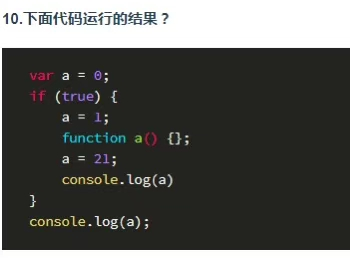
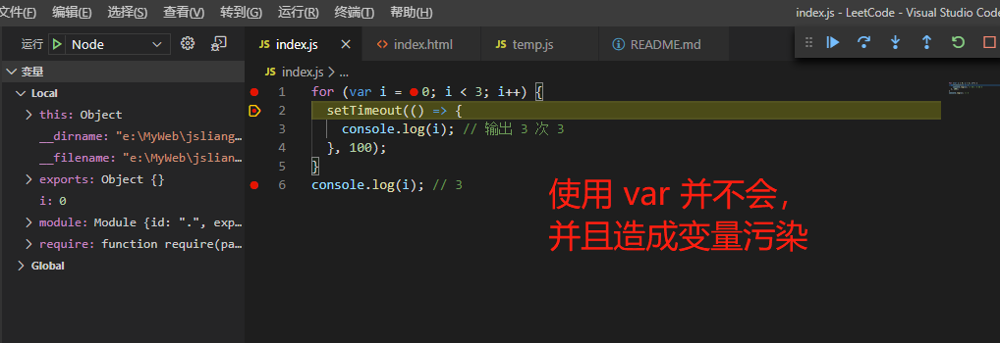
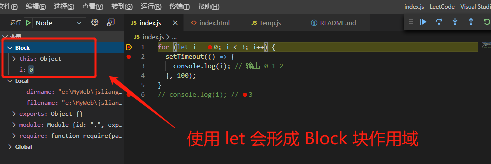
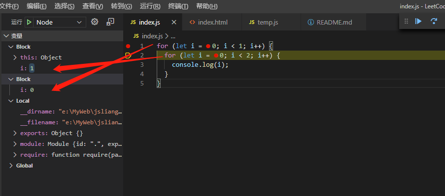

当 if 嵌套了 function
===

> create by **jsliang** on **2020-4-11 00:01:52**  
> Recently revised in **2020-4-11 01:18:02**

## <a name="chapter-one" id="chapter-one">一 目录</a>

**不折腾的前端，和咸鱼有什么区别**

| 目录 |
| --- | 
| [一 目录](#chapter-one) | 
| <a name="catalog-chapter-two" id="catalog-chapter-two"></a>[二 前言](#chapter-two) |
| <a name="catalog-chapter-three" id="catalog-chapter-three"></a>[三 同问题大佬回复](#chapter-three) |
| <a name="catalog-chapter-four" id="catalog-chapter-four"></a>[四 问题变形](#chapter-four) |
| <a name="catalog-chapter-five" id="catalog-chapter-five"></a>[五 总结](#chapter-five) |
| <a name="catalog-chapter-six" id="catalog-chapter-six"></a>[六 参考文献](#chapter-six) |

## <a name="chapter-two" id="chapter-two">二 前言</a>

> [返回目录](#chapter-one)

今天一位朋友咨询我一个问题：



我脑袋瓜一下子宕机：这是什么题，送分还是送命题~

于是脑海里出现答案：

> 错误答案

```
21
21
```

然后回去一尝试：

> index.js

```js
var a = 0;
if (true) {
  a = 1;
  function a() {}
  a = 21;
  console.log(a);
}
console.log(a);
```

> Console 打印

```
21
1
```

哦豁，有问题，你成功引起了 **jsliang** 我的注意~

## <a name="chapter-three" id="chapter-three">三 同问题大佬回复</a>

> [返回目录](#chapter-one)

经过一阵摸索，在 **浪子神剑** 我剑哥的微信群聊【前端学习每日3+1②群】中看到的一个链接提示：

* [【Stack Overflow】confused about function declaration in { }](https://stackoverflow.com/questions/58619924/confused-about-function-declaration-in/58620404#58620404)

然后群里面小伙伴说到一句话引起了我的注意：

* *执行到函数声明那一行，就把当前的 a 赋值到外面的 a*

我也不知道谁说的是对的，于是我决定先把大佬的回复翻译过来先：

> 原文

```
The following happens:

(1) There exist two variable declarations a, one inside the block and one outside of it.

(2) The function declaration gets hoisted, and bound to the inner blocks variable.

(3) a = 5 is reached, which overrides the block variable.

(4) the function declaration is reached, and the block variable is copied to the outer variable. Both are 5 now.

(5) a = 0 is reached, which overrides the block variable. The outer variable is not affected by this.

 var a¹;
 if (true) {
   function a²() {} // hoisted
   a² = 5;
   a¹ = a²; // at the location of the declaration, the variable leaves the block      
   a² = 0;
  console.log(a²)
}
console.log(a¹);
This is actually not really part of the specification, it is part of the web legacy compatibility semantics, so don't declare functions inside blocks and don't rely on this code to behave in this way.

This is also explained here
```

> 翻译

```
发生了以下内容：
（1）存在两个变量 a（a1 和 a2），其中一个在块里面一个在外面。
（2）进入 if，这时候 a2 会进行声明提升，并将其绑定到块内部变量中。
（3）执行 a2 = 5 的时候，块内部变量 a2 被改变（重写）了。
（4）执行到 a1 = a2，这时候 a2 的变量提升被调用到了，所以块内的值被带到了块外面，这时候 a1 和 a2 的值均为 5。
（5）执行 a2 = 0 的时候，块内部变量 a2 被改变（重写）了。

var a1;
if (true) {
  function a2() {};
  a2 = 5;
  a1 = a2;
  a2 = 0;
  console.log(a2);
}
console.log(a1);

这实际上不是规范的一部分，而是 Web 规范的残留（Bug）。

所以不要再块内声明函数，也不要编写这样的代码。
```

OK，这时候我们再看看大佬的代码：

```js
var a1;
if (true) {
  function a2() {};
  a2 = 5;
  a1 = a2;
  a2 = 0;
  console.log(a2);
}
console.log(a1);
```

回顾下上面的解释：

* *执行到函数声明那一行，就把当前的 a 赋值到外面的 a*

我们先强行睡服（说服）自己，用这个定义先~

## <a name="chapter-four" id="chapter-four">四 问题变形</a>

> [返回目录](#chapter-one)

* 问题 1：请输出以下打印内容

```js
var a = 0;
if (true) {
  a = 1;
  function a() {}
  a = 11;
  console.log(a);
  function a() {}
  a = 21;
  console.log(a);
}
console.log(a);
```

答案：11 21 11

我们需要用 ES5 的怪诞行为，来解释为何它输出的是 11 21 11：

1. 先 `a = 1`，再执行 `function a() {}` 的时候，因为 `a()` 的提前声明被调用了，所以这时候会将 `a = 1` 同步到外面去，因此这时候的 `a` 同时为 1。
2. 再 `a = 11`，并打印它，因此第一次输出为 11。
3. 接着 `a = 11`，再执行 `function a() {}` 的时候，因为 `a()` 的提前声明被调用了，所以这时候会将 `a = 11` 同步到外面去，因此这时候的 `a` 同时为 11。
4. 然后 `a = 21`，并打印它，因此第二次输出为 21。
5. 最后你会发现，经过步骤 3 的同步，所以外层 `a` 的输出应该是 11，即第三次输出为 11。

> 知道这种怪诞的方式后，请尝试避免编写这种代码，你好我好大家好，如何避免看下面介绍。

* 问题 2：请输出以下打印内容

```js
let a = 0;
if (true) {
  a = 1;
  function a() {}
  a = 21;
  console.log(a);
}
console.log(a);
```

答案：21 0

解释：

为什么到了这里，`a` 的第二次输出变成 0 了呢？

我们可以先看一个经典问题：

```js
for (var i = 0; i < 3; i++) {
  setTimeout(() => {
    console.log(i); // 输出 3 次 3
  }, 100);
}
console.log(i); // 3
```

抛开宏任务和微任务来说的话，我们的 `var` 没有块作用域概念，会造成变量污染。

> 宏任务和微任务可以看 **jsliang** 写的 Event Loop 文章：https://github.com/LiangJunrong/document-library/blob/master/JavaScript-library/JavaScript/%E5%85%B6%E4%BB%96/Event%20Loop.md



那么，我们当初怎么解决的呢？

1. 用 `let` 替代。
2. 用闭包函数。

这里 **js liang** 仅讲讲 `let` 的作用：

```js
for (let i = 0; i < 3; i++) {
  setTimeout(() => {
    console.log(i); // 输出 0 1 2
  }, 100);
}
// console.log(i);
// 不能这么写，会提示：
// ReferenceError: i is not defined
// 然后就炸了。
```

在加入了 `let` 变量的 `for()` 循环中，会生成独特的 `Block` 块作用域，这样我们就会形成一个独特的环境来解决代码块里面的内容。（乖宝宝 `let`）



如果你还不理解，你可以尝试下使用嵌套循环：

```js
for (let i = 0; i < 1; i++) {
  for (let i = 0; i < 2; i++) {
    console.log(i);
  }
}
// 输出 0 1
```

在打断点中你会发现：



块与块之间是不影响的，所以即便你在里面还是用着 `i`，它们也不会起冲突~

既然如此，在代码中：

```js
let a = 0;
if (true) {
  a = 1;
  function a() {}
  a = 21;
  console.log(a);
}
console.log(a);
```

我们的 `let` 就不会进去已经形成了块级作用域的 `if (true)` 中，从而避免了变量相互影响的问题。

所以，输出结果为 21 和 0。

客官可懂？

懂了看看这道题：

> 送分题 /^_^/ 斜眼笑

```js
var a = 0;
var b;
if (true) {
  a = 1;
  function a() {}
  a = 11;
  console.log(a);
  b = a;
  a = 21;
  console.log(a);
}
console.log(a);
console.log(b);
```

## <a name="chapter-five" id="chapter-five">五 总结</a>

> [返回目录](#chapter-one)

综上所述，**jsliang** 画了几个钟的时间去打断点、搜文章，并且去微信群偷窥答案，希望这个结果对小伙伴有所帮助。

为了避免给他人造成麻烦，请尽可能使用 `let` 定义变量吧~

> **jsliang** 在工作上已经有近一年没使用 `var` 进行变量的定义了，基本使用 `let` 和 `const`，避免了许多业务代码问题。

## <a name="chapter-six" id="chapter-six">六 参考文献</a>

> [返回目录](#chapter-one)

* [【Stack Overflow】confused about function declaration in { }](https://stackoverflow.com/questions/58619924/confused-about-function-declaration-in/58620404#58620404)
* [【汤姆大叔的博客】《深入理解JavaScript系列（2）：揭秘命名函数表达式》](https://www.cnblogs.com/TomXu/archive/2011/12/29/2290308.html)
* [【Segmentfault】Nero_Zzz《JS中在if else 中定义 function 的问题》](https://segmentfault.com/q/1010000000731247/a-1020000000732024)

---

**不折腾的前端，和咸鱼有什么区别！**


**jsliang** 会每天更新一道 LeetCode 题解，从而帮助小伙伴们夯实原生 JS 基础，了解与学习算法与数据结构。

**浪子神剑** 会每天更新面试题，以面试题为驱动来带动大家学习，坚持每天学习与思考，每天进步一点！

扫描上方二维码，关注 **jsliang** 的公众号（左）和 **浪子神剑** 的公众号（右），让我们一起折腾！

> <a rel="license" href="http://creativecommons.org/licenses/by-nc-sa/4.0/"></a><br /><span xmlns:dct="http://purl.org/dc/terms/" property="dct:title">jsliang 的文档库</span> 由 <a xmlns:cc="http://creativecommons.org/ns#" href="https://github.com/LiangJunrong/document-library" property="cc:attributionName" rel="cc:attributionURL">梁峻荣</a> 采用 <a rel="license" href="http://creativecommons.org/licenses/by-nc-sa/4.0/">知识共享 署名-非商业性使用-相同方式共享 4.0 国际 许可协议</a>进行许可。<br />基于<a xmlns:dct="http://purl.org/dc/terms/" href="https://github.com/LiangJunrong/document-library" rel="dct:source">https://github.com/LiangJunrong/document-library</a>上的作品创作。<br />本许可协议授权之外的使用权限可以从 <a xmlns:cc="http://creativecommons.org/ns#" href="https://creativecommons.org/licenses/by-nc-sa/2.5/cn/" rel="cc:morePermissions">https://creativecommons.org/licenses/by-nc-sa/2.5/cn/</a> 处获得。