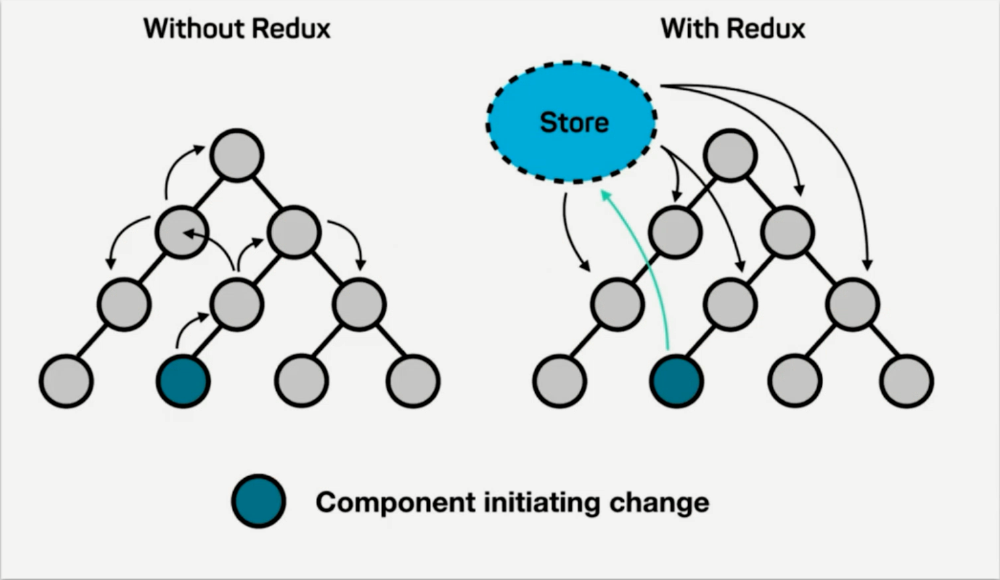

React Redux
===

> Create by **jsliang** on **2019-3-26 08:51:55**  
> Recently revised in **2019-3-26 08:51:59**

**Hello 小伙伴们，如果觉得本文还不错，记得给个 **star** ， 小伙伴们的 **star** 是我持续更新的动力！[GitHub 地址](https://github.com/LiangJunrong/document-library/blob/master/JavaScript-library/React/React-Redux.md)**

* [React 系列源码地址](https://github.com/LiangJunrong/React)

## <a name="chapter-one" id="chapter-one">一 目录</a>

**不折腾的前端，和咸鱼有什么区别**

| 目录 |
| --- | 
| [一 目录](#chapter-one) | 
| [二 前言](#chapter-two) |

## <a name="chapter-two" id="chapter-two">二 前言</a>

> [返回目录](#chapter-one)

在 React 中，如果兄弟组件需要通讯，例如左侧中的深色圆圈发送到底部圆圈，需要兜很多弯子。

而 Redux 的出现，是为了弥补这种麻烦的通讯方式，建立起一个中央机制，方便各组件之间的通讯。

Redux = Reducer + Flux

如上图，即为 Redux 工作机制。

* 蓝色：借书人
* 黄色：借书动作
* 橙色：图书管理员
* 紫色：系统

它的流程可以理解为：借书人走到前台（借书动作）跟图书管理员申请借书，图书管理员帮它查找书籍资料，然后拿到电脑返回信息，告诉他去哪借就行了。

换回正常话，即：当组件（React Components）需要调用数据的时候，它就向创造器（Action Creators）发起请求，创造器通知管理者（Store），管理者就去查找相关资料（Reducers），拿到返回的信息后，再告诉组件。

---

> **jsliang** 广告推送：  
> 也许小伙伴想了解下云服务器  
> 或者小伙伴想买一台云服务器  
> 或者小伙伴需要续费云服务器  
> 欢迎点击 **[云服务器推广](https://github.com/LiangJunrong/document-library/blob/master/other-library/Monologue/%E7%A8%B3%E9%A3%9F%E8%89%B0%E9%9A%BE.md)** 查看！

>  jsliang 的文档库 由 <a xmlns:cc="http://creativecommons.org/ns#" href="https://github.com/LiangJunrong/document-library" property="cc:attributionName" rel="cc:attributionURL">梁峻荣</a> 采用 <a rel="license" href="http://creativecommons.org/licenses/by-nc-sa/4.0/">知识共享 署名-非商业性使用-相同方式共享 4.0 国际 许可协议</a>进行许可。 基于<a xmlns:dct="http://purl.org/dc/terms/" href="https://github.com/LiangJunrong/document-library" rel="dct:source">https://github.com/LiangJunrong/document-library</a>上的作品创作。 本许可协议授权之外的使用权限可以从 <a xmlns:cc="http://creativecommons.org/ns#" href="https://creativecommons.org/licenses/by-nc-sa/2.5/cn/" rel="cc:morePermissions">https://creativecommons.org/licenses/by-nc-sa/2.5/cn/</a> 处获得。