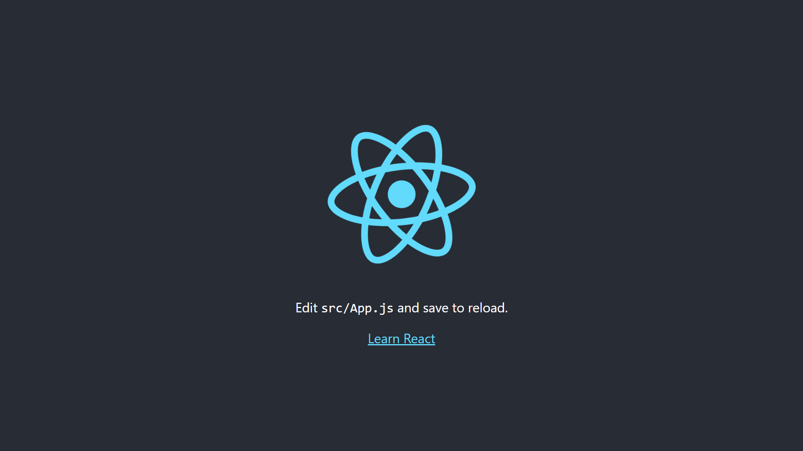
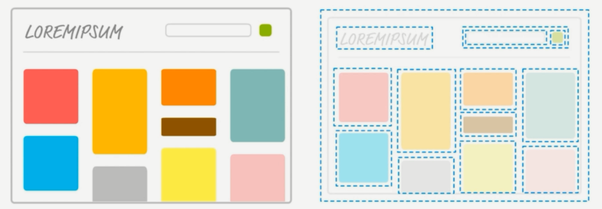
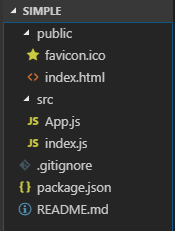
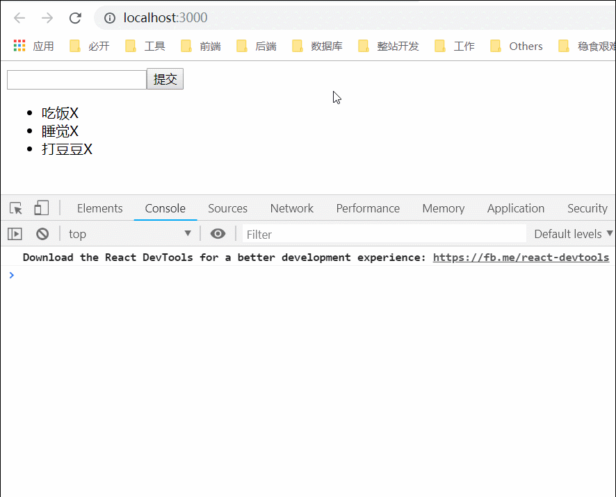
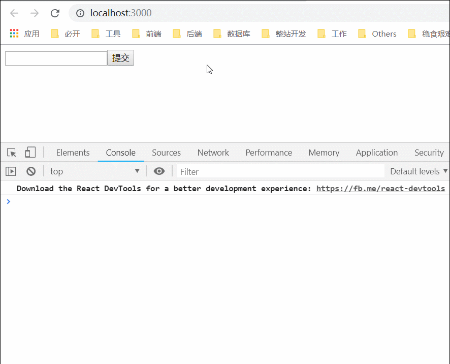

React Demo One - TodoList
===

> Create by **jsliang** on **2019-3-18 08:37:10**  
> Recently revised in **2019-3-22 08:19:39**

**Hello 小伙伴们，如果觉得本文还不错，记得给个 **star** ， 小伙伴们的 **star** 是我持续更新的动力！[GitHub 地址](https://github.com/LiangJunrong/document-library/blob/master/JavaScript-library/React/ReactDemoOne-TodoList.md)**

* [React 系列源码地址](https://github.com/LiangJunrong/React)

## <a name="chapter-one" id="chapter-one">一 目录</a>

**不折腾的前端，和咸鱼有什么区别**

| 目录 |
| --- | 
| [一 目录](#chapter-one) | 
| <a name="catalog-chapter-two" id="catalog-chapter-two"></a>[二 前言](#chapter-two) |
| <a name="catalog-chapter-three" id="catalog-chapter-three"></a>[三 正文](#chapter-three) |
| &emsp;[3.1 新建 React 项目](#chapter-three-one) |
| &emsp;[3.2 项目目录解析](#chapter-three-two) |
| &emsp;[3.3 精简项目结构](#chapter-three-three) |
| &emsp;[3.4 初探组件](#chapter-three-four) |
| &emsp;[3.5 JSX](#chapter-three-five) |
| &emsp;[3.6 事件及双向数据绑定](#chapter-three-six) |
| &emsp;[3.7 优化-抽取 CSS](#chapter-three-seven) |
| &emsp;[3.8 优化-抽取 JS](#chapter-three-eight) |
| &emsp;[3.9 父子组件通讯](#chapter-three-night) |
| <a name="catalog-chapter-four" id="catalog-chapter-four"></a>[四 总结](#chapter-four) |
| <a name="catalog-chapter-five" id="catalog-chapter-five"></a>[五 参考文献](#chapter-five) |

## <a name="chapter-two" id="chapter-two">二 前言</a>

> [返回目录](#chapter-one)

通过编写一个简单的 TodoList 小 Demo，熟悉 React 的开发流程。

## <a name="chapter-three" id="chapter-three">三 正文</a>

> [返回目录](#chapter-one)

Now，开始搞事情。

### <a name="chapter-three-one" id="chapter-three-one">3.1 新建 React 项目</a>

> [返回目录](#chapter-one)

1. 下载 Node.js
2. 安装 React 脚手架：
   1. `npm i create-react-app -g`
3. 开启新项目：
   1. `create-react-app todolist`
   2. `cd todolist`
   3. `npm start`
4. 打开 `localhost:3000` 查看页面



### <a name="chapter-three-two" id="chapter-three-two">3.2 项目目录解析</a>

> [返回目录](#chapter-one)

```shell
- todolist
  + node_modules —————————— 项目依赖的第三方的包
  - public ———————————————— 共用文件
    - favicon.ico        —— 网页标签左上角小图标
    - index.html         —— 网站首页模板
    - mainfest.json      —— 提供 meta 信息给项目，并与 serviceWorker.js 相呼应，进行离线 APP 定义
  - src ——————————————————— 项目主要目录
    - App.css            —— 主组件样式
    - App.js             —— 主组件入口
    - App.test.js        —— 自动化测试文件
    - index.css          —— 全局 css 文件
    - index.js           —— 所有代码的入口
    - logo.svg           —— 页面的动态图
    - serviceWorker.js   —— PWA。帮助开发手机 APP 应用，具有缓存作用
  - .gitignore ——————————— 配置文件。git 上传的时候忽略哪些文件
  - package-lock.json ———— 锁定安装包的版本号，保证其他人在 npm i 的时候使用一致的 node 包
  - package.json ————————— node 包文件，介绍项目以及说明一些依赖包等
  - README.md ———————————— 项目介绍文件
```

### <a name="chapter-three-three" id="chapter-three-three">3.3 精简项目结构</a>

> [返回目录](#chapter-one)

为了方便开发，下面对 creat-react-app 的初始目录进行精简：

```shell
- todolist
  + node_modules —————————— 项目依赖的第三方的包
  - public ———————————————— 共用文件
    - favicon.ico        —— 网页标签左上角小图标
    - index.html         —— 网站首页模板
  - src ——————————————————— 重要的目录
    - App.js             —— 主组件入口
    - index.js           —— 所有代码的入口
  - .gitignore ——————————— 配置文件。git 上传的时候忽略哪些文件
  - package.json ————————— node 包文件，介绍项目以及说明一些依赖包等
  - README.md ———————————— 项目介绍文件
```

`favicon.ico`、`.gitignore`、`README.md` 是我们无需理会的，但是其他文件，我们需要精简下它们的代码：

> 1. index.html

<details>

  <summary>代码详情</summary>

```html
<!DOCTYPE html>
<html lang="en">
  <head>
    <meta charset="utf-8" />
    <link rel="shortcut icon" href="%PUBLIC_URL%/favicon.ico" />
    <meta
      name="viewport"
      content="width=device-width, initial-scale=1, shrink-to-fit=no"
    />
    <title>Todolist</title>
  </head>
  <body>
    <noscript>你需要允许在 APP 中运行 JavaScript</noscript>
    <div id="root"></div>
  </body>
</html>
```

</details>


> 2. App.js

<details>

  <summary>代码详情</summary>

```js
import React, { Component } from 'react';

class App extends Component {
  render() {
    return (
      <div className="App">
        Hello React!
      </div>
    );
  }
}

export default App;
```

</details>

> 3. index.js

<details>

  <summary>代码详情</summary>

```js
import React from 'react';
import ReactDOM from 'react-dom';
import App from './App';

ReactDOM.render(<App />, document.getElementById('root'));
```

</details>

> 4. package.json

<details>

  <summary>代码详情</summary>

```json
{
  "name": "todolist",
  "version": "0.1.0",
  "private": true,
  "dependencies": {
    "react": "^16.8.4",
    "react-dom": "^16.8.4",
    "react-scripts": "2.1.8"
  },
  "scripts": {
    "start": "react-scripts start",
    "build": "react-scripts build",
    "test": "react-scripts test",
    "eject": "react-scripts eject"
  },
  "eslintConfig": {
    "extends": "react-app"
  },
  "browserslist": [
    ">0.2%",
    "not dead",
    "not ie <= 11",
    "not op_mini all"
  ]
}
```

</details>

### <a name="chapter-three-four" id="chapter-three-four">3.4 初探组件</a>

> [返回目录](#chapter-one)



类似于上图，在进行页面开发的时候，我们很容易地使用庖丁解牛的技巧，将页面进行划分，然后一部分一部分地将页面搭建出来。

给个比较官方的说法，就叫页面组件化：将页面切成几个部分，从而有利于页面的拼装以及代码的维护。

在 create-react-app 的默认配置中，App.js 就是一个组件，一起来看：

> App.js

```js
// 1. 引用 React 及其组件
import React, { Component } from 'react';

// 2. 定义一个叫 App 的组件继承于 Component
class App extends Component {
  render() {
    return (
      <div className="App">
        Hello React!
      </div>
    );
  }
}

// 3. 根据 React 实例，在 App 内部编写完毕后，导出这个 App 组件
export default App;
```

在上面，我们引用、定义并导出了这个 App 的组件，然后我们就要使用它：

> index.js

```js
// 1. 引入 React、ReactDOM
import React from 'react';
import ReactDOM from 'react-dom';

// 2. 将 App.js 导入进来
import App from './App';

// 3. 通过 ReactDOM 将 App.js 以虚拟 DOM 的形式渲染/挂载到 root 根节点，该节点在 index.html 中
ReactDOM.render(<App />, document.getElementById('root'));
```

`index.js` 告诉我们，它会通过 ReactDom，将 App.js 这个组件挂载到 `root` 这个节点上，那么，这个 `root` 在哪里呢？我们查看下 index.html：

> index.html

```html
<!DOCTYPE html>
<html lang="en">
  <head>
    <meta charset="utf-8" />
    <link rel="shortc ut icon" href="%PUBLIC_URL%/favicon.ico" />
    <meta
      name="viewport"
      content="width=device-width, initial-scale=1, shrink-to-fit=no"
    />
    <title>Todolist</title>
  </head>
  <body>
    <noscript>你需要允许在 APP 中运行 JavaScript</noscript>
    <div id="root"></div>
  </body>
</html>
```

OK，很容易地我们就捋清楚思路了：我们在 index.html 中定义了个 `root` 根节点，然后我们通过 index.js，将 App.js 以组件形式渲染到了 index.html 中，从而实现了节点的挂载。

> 思维发散：我们知道 index.js 和 App.js 的最终结合是挂载到 `id="root"` 节点上的，如果我们再开一个 index2.js 和 App2.js，挂载到 `id="root2"` 节点上，行不行呢？亦或者我们开一个 `id="root3"` 的节点，我们在其中操作 jQuery，是不是也可行？

### <a name="chapter-three-five" id="chapter-three-five">3.5 JSX</a>

> [返回目录](#chapter-one)

在 create-react-app 的文件中，不管是 index.js 中的：

```js
ReactDOM.render(<App />, document.getElementById('root'));
```

还是 App.js 中的：

```js
class App extends React.Component {
  render() {
    return (
      <div className="App">
        Hello React!
      </div>
    );
  }
}
```

等这些有关 DOM 的渲染，都需要用到 JSX，因此需要引入 React：

```js
import React from 'react';
```

* **JSX 的定义**：

那么，什么是 JSX 呢？

React 的核心机制之一就是可以在内存中创建虚拟的 DOM 元素。React 利用虚拟 DOM 来减少对实际 DOM 的操作从而提升性能。 

JSX 就是 JavaScript 和 XML 结合的一种格式。

React 发明了 JSX，利用 HTML 语法来创建虚拟 DOM。当遇到 `<`，JSX 就当 HTML 解析，遇到 `{` 就当 JavaScript 解析。

* **JSX 的使用**：

在 JSX 语法中，如果我们需要使用自己创建的组件，我们直接使用它的定义名即可，例如：

> index.js

```js
// 1. 引入 React、ReactDOM
import React from 'react';
import ReactDOM from 'react-dom';

// 2. 将 App.js 导入进来
import App from './App';

// 3. 通过 ReactDOM 将 App.js 以虚拟 DOM 的形式渲染/挂载到 root 根节点，该节点在 index.html 中
ReactDOM.render(<App />, document.getElementById('root'));
```

其中第三点即是自定义组件渲染到根节点。

> 提示：在 React 中，如果需要使用自定义组件，那么该组件不能小写开头 ~~app~~，而是使用 `App` 这样的大写开头形式。

### <a name="chapter-three-six" id="chapter-three-six">3.6 事件及双向数据绑定</a>

> [返回目录](#chapter-one)

这是我们精简后的目录结构：



我们修改下目录结构，开始编写 TodoList：


**首先**，我们修改 App.js 为 TodoList.js：

> ~~App.js~~ TodoList.js

```js
import React, { Component } from 'react';

class TodoList extends Component {
  render() {
    return (
      <div className="TodoList">
        Hello React!
      </div>
    );
  }
}

export default TodoList;
```

**然后**，我们修改 index.js 中挂载到 index.html 的组件为 TodoList：

> index.js

```js
import React from 'react';
import ReactDOM from 'react-dom';

import TodoList from './TodoList';

// 3. 通过 ReactDOM 将 App.js 以虚拟 DOM 的形式渲染/挂载到 root 根节点，该节点在 index.html 中
ReactDOM.render(<TodoList />, document.getElementById('root'));
```

修改完毕，小伙伴们可以重启下 3000 端口，查看下我们的 React 是否能正常启动。

> 在此步骤中，我们仅仅修改 App.js 为 TodoList.js，使 index.js 挂载到 `root` 的是 TodoList.js，除此之外没进行其他操作。

**最后**，如果没有问题，那么我们进一步编写 TodoList，获取到 input 输入框的值，并渲染到列表中：

> TodoList.js

<details>

  <summary>代码详情</summary>

```js
// Fragment 是一种占位符形式，类似于 Vue 的 Template
import React, { Component, Fragment } from 'react';

class TodoList extends Component {

  constructor(props) {
    super(props);
    this.state = {
      inputValue: '',
      list: []
    }
  }

  render() {
    return (
      <Fragment>
        <div>
          {/* 单项数据绑定 */}
          <input 
            type="text" 
            value={this.state.inputValue}
            onChange={this.handleInputChange.bind(this)}
          />
          <button>提交</button>
        </div>
        <ul>
          <li>
            <span>吃饭</span>
            <span>X</span>
          </li>
          <li>
            <span>睡觉</span>
            <span>X</span>
          </li>
          <li>
            <span>打豆豆</span>
            <span>X</span>
          </li>
        </ul>
      </Fragment>
    )
  }

  handleInputChange(e) {
    console.log(e.target.value);
    this.setState({
      inputValue: e.target.value
    })
  }

}

export default TodoList;
```

</details>

我们先查看演示：



OK，这样我们在每输入一个字符的时候，我们就能立刻获取到对应的数据，这时候实现了单向数据流：输入框 -> JS 内存。

其中有 3 点需要讲解下：

1. `Fragment` 是 React 提供的一种占位符，它像 `<input>`、`<span>` 等标签一样，但是它在实际渲染的时候是不会出现的。因为 React 的 JSX 首层必须要有标签，然后如果使用 `<div>` 等会占用一个层级，所以，类似于 Vue 的 `Template`，React 使用了 `Fragment` 这种空标签。
2. `constructor` 表示父类的构造方法，在 ES6 中，构造方法 `constructor` 相当于其构造函数，用来新建父类的 `this` 对象，而 `super(props)` 则是用来修正 `this` 指向的。简而言之，我们可以在这里定义数据，并在整个 js 文件中使用。
3. `onChange` 这种写法，是 React 指定的写法，例如 `onClick` 等，在原生 JS 中，使用的是 `onclick`，而在 React 中，为了区别，需要进行半驼峰编写事件名字。同时，绑定的 `handleInputChange`，可以直接在 `render` 下面进行编写。

> 参考文献：[《react 中 constructor() 和 super() 到底是个啥？》](https://www.jianshu.com/p/8f6dd832e57a)

这样，我们就对 React 的数据及事件有了初步理解，下面我们加下按钮点击新增列表事件以及点击 `X` 删除列表事件。

> TodoList.js

<details>

  <summary>代码详情</summary>

```js
// Fragment 是一种占位符形式，类似于 Vue 的 Template
import React, { Component, Fragment } from 'react';

class TodoList extends Component {

  // 构造函数
  constructor(props) {
    super(props);
    // 定义数据
    this.state = {
      inputValue: '',
      list: []
    }
  }

  // 渲染页面
  render() {
    let closeStyle = {
      fontSize: '1.2em',
      color: 'deepskyblue',
      marginLeft: '10px'
    }
    return (
      <Fragment>
        <div>
          {/* 单项数据绑定 */}
          {/* 在 React 中，绑定时间的，一般为半驼峰形式 */}
          <input 
            type="text" 
            value={this.state.inputValue}
            onChange={this.handleInputChange.bind(this)}
          />
          <button onClick={this.handleBtnClick.bind(this)}>提交</button>
        </div>
        <ul>
          {
            this.state.list.map( (item, index) => {
              return <li key={index}>
                <span>{index}. {item}</span>
                <span style={closeStyle} onClick={this.handleItemDelete.bind(this, index)}>X</span>
              </li>
            })
          }
        </ul>
      </Fragment>
    )
  }

  // 方法体 - 输入内容
  handleInputChange(e) {
    this.setState({
      inputValue: e.target.value
    })
  }

  // 方法体 - 点击提交
  handleBtnClick() {
    this.setState({
      list: [...this.state.list, this.state.inputValue],
      inputValue: ''
    })
  }

  // 方法体 - 删除项目
  handleItemDelete(index) {
    const list = [...this.state.list];
    list.splice(index, 1);

    this.setState({
      list: list
    })
  }

}

export default TodoList;
```

</details>



在这一部分，我们需要了解 3 个知识点：

1. 在 `render` 中 `closeStyle` 这个变量，我们用来定义 CSS 属性，然后我们通过 `style={closeStyle}`，直接写了个行内样式（下面我们会抽离出来）
2. 关于 JSX 遍历输出的形式：

```js
{
  this.state.list.map( (item, index) => {
    return <li key={index}>
      <span>{index}. {item}</span>
      <span style={closeStyle} onClick={this.handleItemDelete.bind(this, index)}>X</span>
    </li>
  })
}
```

我们通过 `{}` 里面循环输出 DOM 节点。如果你学过 jQuery，那么可以将它当为拼接字符串；如果你学过 Vue，那么可以将它当成 `v-for` 变了种写法。

在这里我们不用理会为什么这么写，我们先接受这种写法先。

3. 关于改变 `constructor` 中的数据，我们使用：

```js
this.setState({
  list: list
})
```

这种形式。其实，这也是有记忆技巧的，要知道我们在定义数据的时候，使用了：

```js
// 定义数据
this.state = {
  inputValue: '',
  list: []
}
```

即： `this.state`，那么我们需要修改数据，那就是 `this.setState` 了。

至此，我们的简易 TodoList 就实现了，下面我们进一步优化，将 CSS 和 JS 进一步抽取。

### <a name="chapter-three-seven" id="chapter-three-seven">3.7 优化-抽取 CSS</a>

> [返回目录](#chapter-one)

在上面中，我们提到 `closeStyle` 是一种行内的写法，作为一枚 **完美编程者**，我们肯定不能容忍，下面我们开始抽离：

> TodoList.js

```js
import React, { Component, Fragment } from 'react';

import './style.css'

// ... 省略中间代码

<ul>
{
  this.state.list.map( (item, index) => {
    return <li key={index}>
      <span>{index}. {item}</span>
      <span className="icon-close" onClick={this.handleItemDelete.bind(this, index)}>X</span>
    </li>
  })
}
</ul>
```

在这里，我们需要知道：我们可以通过 `import` 的形式，直接将 CSS 文件直接导入，然后，我们命名 `class` 的时候，因为 React 怕 JS 的 `class` 与 HTML 的 `class` 冲突，所以我们需要使用 `className`。

最后我们再编写下 CSS 文件：

```css
.icon-close {
  font-size: 1.2em;
  color: deepskyblue;
  margin-left: 10px;
}
```

如此，我们就实现了 CSS 的抽取。

### <a name="chapter-three-eight" id="chapter-three-eight">3.8 优化-抽取 JS</a>

> [返回目录](#chapter-one)

在第 4 章关于组件的介绍中，我们讲到：一些复杂的 JS 是可以抽取出来，并以组件的形式，嵌入到需要放置的位置的。

那么，我们在 JSX 越写越多的情况下，是不是可以将列表渲染那部分抽取出来，从而精简下 JSX 呢？

答案是可以的，下面我们看下实现：

> TodoList.js

<details>

  <summary>代码详情</summary>

```js
// Fragment 是一种占位符形式，类似于 Vue 的 Template
import React, { Component, Fragment } from 'react';

// 引入组件
import TodoItem from './TodoItem';

// 引用样式
import './style.css';

class TodoList extends Component {

  // 构造函数
  constructor(props) {
    super(props);
    // 定义数据
    this.state = {
      inputValue: '',
      list: []
    }
    this.handleInputChange = this.handleInputChange.bind(this);
    this.handleBtnClick = this.handleBtnClick.bind(this);
    this.handleItemDelete = this.handleItemDelete.bind(this);
  }

  // 渲染页面
  render() {
    return (
      <Fragment>
        <div>
          <label htmlFor="insertArea">输入内容：</label>
          {/* 单项数据绑定 */}
          {/* 在 React 中，绑定时间的，一般为半驼峰形式 */}
          <input 
            id="insertArea"
            type="text" 
            value={this.state.inputValue}
            onChange={this.handleInputChange}
          />
          <button onClick={this.handleBtnClick}>提交</button>
        </div>
        <ul>
          {/* 精简 JSX，将部分抽取出来 */}
          { this.getTodoItem() }
        </ul>
      </Fragment>
    )
  }

  // 获取单独项
  getTodoItem() {
    return this.state.list.map( (item, index) => {
      return (
        <TodoItem 
          key={index}
          item={item} 
          index={index}
          handleItemDelete={this.handleItemDelete}
        />
      )
    })
  }

  // 方法体 - 输入内容
  handleInputChange(e) {
    const value = e.target.value;
    this.setState( () => ({
      inputValue: value
    }))
  }

  // 方法体 - 点击提交
  handleBtnClick() {
    const list = this.state.list,
          inputValue = this.state.inputValue;
    this.setState( () => ({
      list: [...list, inputValue],
      inputValue: ''
    }))
  }

  // 方法体 - 删除项目
  handleItemDelete(index) {
    // immutable - state 不允许做任何改变
    const list = [...this.state.list];
    list.splice(index, 1);

    this.setState( () => ({
      list: list
    }))
  }

}

export default TodoList;
```

</details>

我们关注下 TodoList.js 的改变：

1. 我们在 `constructor` 中，将方法进行了提前定义：

```js
this.handleInputChange = this.handleInputChange.bind(this);
```

这样，我们在下面就不用写 `.bind(this)` 形式了。

2. 我们修改了下 `this.setState()` 的形式：

> 原写法：

```js
this.setState({
  list: list
})
```

> 现写法：

```js
this.setState( () => ({
  list: list
}))
```

因为 React 16 版本进行了更新，使用这种写法比之前的好，至于好在哪，咱先不关心，以后就用这种写法了。

3. 我们引用了组件：

```js
import TodoItem from './TodoItem';
```

并且将组件放到方法体：`this.getTodoItem()` 中，而 `this.getTodoItem()` 的定义是：

```js
// 获取单独项
getTodoItem() {
 return this.state.list.map( (item, index) => {
   return (
     <TodoItem 
       key={index}
       item={item} 
       index={index}
       handleItemDelete={this.handleItemDelete}
     />
   )
 })
}
```

在这里我们可以看到，我们通过自定义值的形式，将数据 `key`、`item`、`index` 传递给了子组件 `TodoItem`。同时，通过 `handleItemDelete`，将自己的方法传递给了子组件，这样子组件就可以调用父组件的方法了：

> TodoItem.js

<details>

  <summary>代码详情</summary>

```js
import React, { Component } from 'react'

class TodoItem extends Component {

  constructor(props) {
    super(props);
    // 这种写法可以节省性能
    this.handleClick = this.handleClick.bind(this);
  }

  render() {
    const { item } = this.props;
    return (
      <li>
        <span>{item}</span>
        <span className="icon-close" onClick={this.handleClick}>X</span>
      </li>
    )
  }

  handleClick() {
    const { handleItemDelete, index } = this.props;
    handleItemDelete(index);
  }

}

export default TodoItem;
```

</details>

这样，我们就完成了组件的抽取，并学会了

* 父组件传递值给子组件
* 子组件调用父组件的方法

由此，我们在接下来就可以编写更丰富健全的项目了。

> 本文代码地址：[React 系列源码地址](https://github.com/LiangJunrong/React)

## <a name="chapter-four" id="chapter-four">四 总结</a>

> [返回目录](#chapter-one)

在我们学习任意一门语言中，大多就是上手 “Hello World！” 编程~

然后做小案例的时候，我们都喜欢来个 TodoList，因为它能讲清楚一些有关基础的知识点。

现在，我们回顾下，我们开发 React 的 TodoList 有啥收获：

1. create-react-app 的安装及开发。
2. 组件化的思想及在 create-react-app 中关于组件化的应用。
3. React 关于数据 data 以及方法 methods 的定义及使用，以及如何进行数据双向绑定。
4. 将大的组件拆分成小组件，并实现父子组件通讯（父组件传递参数给子组件，子组件调用父组件的方法）

至此，**jsliang** 就精通 jQuery、Vue、React 编写 TodoList 了，哈哈！

## <a name="chapter-five" id="chapter-five">五 参考文献</a>

> [返回目录](#chapter-one)

1. [《React.Component 与 React.PureComponent（React之性能优化）》](https://www.cnblogs.com/clover77/p/9394514.html)
2. [《visual studio code + react 开发环境搭建》](https://www.jianshu.com/p/ec7c2bab16cc)
3. [《react 中 constructor() 和 super() 到底是个啥？》](https://www.jianshu.com/p/8f6dd832e57a)

---

> **jsliang** 广告推送：  
> 也许小伙伴想了解下云服务器  
> 或者小伙伴想买一台云服务器  
> 或者小伙伴需要续费云服务器  
> 欢迎点击 **[云服务器推广](https://github.com/LiangJunrong/document-library/blob/master/other-library/Monologue/%E7%A8%B3%E9%A3%9F%E8%89%B0%E9%9A%BE.md)** 查看！

[](https://promotion.aliyun.com/ntms/act/qwbk.html?userCode=w7hismrh)
[](https://cloud.tencent.com/redirect.php?redirect=1014&cps_key=49f647c99fce1a9f0b4e1eeb1be484c9&from=console)

> <a rel="license" href="http://creativecommons.org/licenses/by-nc-sa/4.0/"></a><br /><span xmlns:dct="http://purl.org/dc/terms/" property="dct:title">jsliang 的文档库</span> 由 <a xmlns:cc="http://creativecommons.org/ns#" href="https://github.com/LiangJunrong/document-library" property="cc:attributionName" rel="cc:attributionURL">梁峻荣</a> 采用 <a rel="license" href="http://creativecommons.org/licenses/by-nc-sa/4.0/">知识共享 署名-非商业性使用-相同方式共享 4.0 国际 许可协议</a>进行许可。<br />基于<a xmlns:dct="http://purl.org/dc/terms/" href="https://github.com/LiangJunrong/document-library" rel="dct:source">https://github.com/LiangJunrong/document-library</a>上的作品创作。<br />本许可协议授权之外的使用权限可以从 <a xmlns:cc="http://creativecommons.org/ns#" href="https://creativecommons.org/licenses/by-nc-sa/2.5/cn/" rel="cc:morePermissions">https://creativecommons.org/licenses/by-nc-sa/2.5/cn/</a> 处获得。