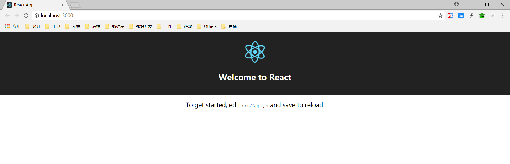
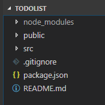
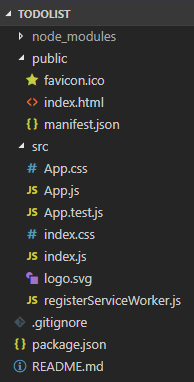
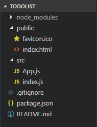
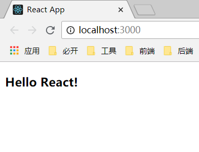
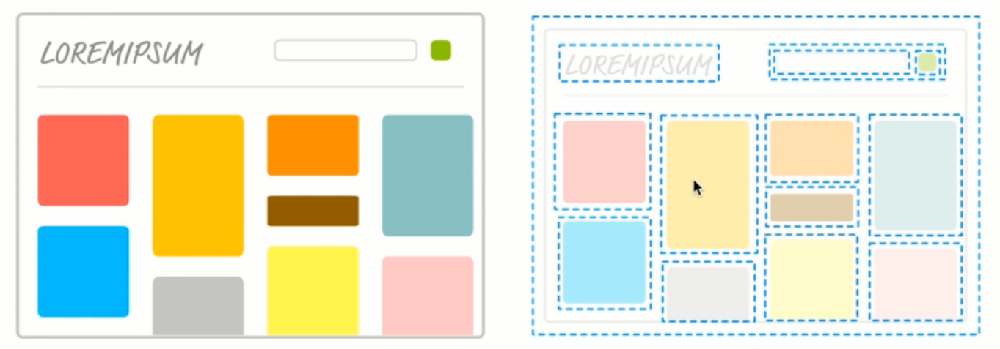

React TodoList
===
 
> create by **jsliang** on **2018-9-5 08:59:31**  
> Recently revised in **2018-10-28 11:37:47**

## 前言 React 介绍

React 是 Facebook 于 2013 年推出的函数式编程，是目前前端框架中使用人数最多的前端框架，其拥有健全的文档与完善的社区。React 16.0 及以上版本，又被成为 React Fiber。

## 引用

1. 引用 .js 文件来使用 React
2. 通过脚手架工具来编程

这里通过官方提供的脚手架工具： create-react-app

```
 npm i create-react-app -g
 create-react-app my-app

 cd my-app
 npm start
```

> 此刻， **jsliang** 的 `node` 等版本为：  
> `node` : 8.11.2  
> `npm` : 6.3.0  
> `cnpm` : 6.0.0  

## 第一章 基础环境搭建

工欲善其事，必先利其器。  

在这里，我们将进行 React 的基础环境的搭建，从而大大增加我们的开发进度。

### 1.1 搭建 React 脚手架

1. 安装 React 脚手架：`npm i create-react-app -g`
2. 安装 React 项目：`create-react-app todolist`
3. 运行 React 项目：`npm run start`

> 步骤 1 结果：返回create-react-app 版本为1.5.2  
> 步骤 2 结果：返回：

```
+ react-dom@16.4.2
+ react@16.4.2
+ react-scripts@1.1.5
added 1326 packages from 810 contributors and audited 12601 packages in 74.682s
found 0 vulnerabilities


Success! Created todolist at E:\MyWeb\jsliang-study\Document-Library\JavaScript-library\React\code\todolist
Inside that directory, you can run several commands:

  npm start
    Starts the development server.

  npm run build
    Bundles the app into static files for production.

  npm test
    Starts the test runner.

  npm run eject
    Removes this tool and copies build dependencies, configuration files
    and scripts into the app directory. If you do this, you can’t go back!

We suggest that you begin by typing:

  cd todolist
  npm start

Happy hacking!
```

> 步骤 3 结果，返回界面（注意，需要 cd 到 todolist 目录）：



### 1.2 项目文件介绍

在这里，我们对前面生成的 todolist 项目的目录进行简要讲解。

> 未展开



> 展开
 


该项目目录介绍：

```
+ node_modules —— node 依赖安装包
    - ... —— 详细安装包文件目录
+ public —— 共用的文件夹
    - favicon.ico —— 网站标签页上的图标
    - index.html —— 网站首页的 html 模板
    - mainfest.json —— 定义缓存的文件，配合 registerServiceWorker.js 来使用
+ src —— 存放项目源代码
    - App.css —— 被嵌入到 App.js 中的 css 文件
    - App.js —— 网站的首页组件
    - App.test.js —— 做自动化测试的时候使用的文件
    - index.css —— 被嵌入到 index.js 中的 css 文件
    - index.js —— 项目的入口文件
    - logo.svg —— App.js 中引用的 svg 文件
    - registerServiceWorker.js —— 通过网页形式写手机应用，具有缓存效果
- .gitignore —— git 忽略提交配置
- package.json —— 定义项目所需要的各种模块，以及项目的配置信息
- README.md —— 类似于“公告”的文件，下载别人项目时首先需要了解该文件
```

### 1.3 简化项目目录

在这里，我们将简化下 todolist 的目录，并对其进行详细讲解：



* React 运行顺序：
  
**1. 访问 index.js ：**

```
import React from 'react';
import ReactDOM from 'react-dom';
import App from './App';

ReactDOM.render(<App />, document.getElementById('root'));
```

在这里，index.js 引用了 `react`、`react-dom` ，其中 `react` 是 react 的核心代码， 而 react 的核心思想是虚拟 dom，所以在操作 dom 的方法上，还需要引用 `react-dom`，从而去打包解压 dom 节点。  

然后，还引用了 App.js 文件，该文件在下面会有介绍。  

最后，使用 `react-dom` 渲染从 App.js 中加载过来的 dom 节点，放到 id 为 root 的 节点上。  

**2. 访问 App.js ：**

```
import React, { Component } from 'react';

class App extends Component {
  render() {
    return (
      <h3>Hello React!</h3>
    );
  }
}

export default App;
```

在这里，App.js 引用了 `react` 及其组件 react.Component。  

然后，继承 react 的组件类，渲染了一个组件 \<h3\>  

最后，将 App 这个类，导出给引用它的 index.js。  

**3. index.html 介绍：**

```
<!DOCTYPE html>
<html lang="en">
  <head>
    <meta charset="utf-8">
    <meta name="viewport" content="width=device-width, initial-scale=1, shrink-to-fit=no">
    <meta name="theme-color" content="#000000">
    <link rel="shortcut icon" href="%PUBLIC_URL%/favicon.ico">
    <title>React App</title>
  </head>
  <body>
    <noscript>
      You need to enable JavaScript to run this app.
    </noscript>
    <div id="root"></div>
  </body>
</html>
```

在这里，提供了 SPA(single page web application) 的渲染界面，index.js 将把渲染的 dom 节点加载到该文件。

**4. favicon.ico 介绍：**[百度百科](https://baike.baidu.com/item/favicon.ico/8944811?fr=aladdin)


**5. .gitignore 文件介绍：**[jsliang见解](https://github.com/LiangJunrong/document-library/blob/master/other-library/git/git.md)

**6. package.json 文件介绍：** [阮一峰见解](http://javascript.ruanyifeng.com/nodejs/packagejson.html)

**7. README.md 文件介绍：** [jsliang见解](https://github.com/LiangJunrong/document-library/blob/master/other-library/markdown/markdown.md)

最后的最后，通过

```
"start": "react-scripts start",
"build": "react-scripts build",
"test": "react-scripts test --env=jsdom",
"eject": "react-scripts eject"
```

这四个命令，进行相关操作。我们使用 `npm run start`，看到改版后的界面变成：



## 第二章 组件

每个网站，是由多个 html 页面组成的，而 html 页面，可以看成是多个组件组成的。  

所谓组件，就是如 “庖丁解牛” 般，将网站划分为多个 “块” ，这里我们使用 index.html 页面进行讲解：



在这里，我们将网站分成了很多 “块” 。网站生成中，我们将不同的组件，纷纷以 dom 的形式，加载到 index.html 文件中，从而就有了我们一个完整的 index.html。  

学过 HTML5 的小伙伴，应该对 \<header\>、\<sidebar\>、\<footer\> 这类标签有很深的感触，那么，react 或者 vue 或者 angular 中出现的组件概念，就跟这些标签一样，起到 “庖丁解牛” 般的作用。

### 2.1 React 组件

在这里，我们以 `第一章` 中的 App.js 进行 react 组件的讲解：

```
import React, { Component } from 'react';

class App extends Component {
  render() {
    return (
      <h3>Hello React!</h3>
    );
  }
}

export default App;
```

在这段代码中，我们就通过 import 引用了 react 的组件： Component，然后在下面定义了 App 这个类来继承 react 的组件类。  
如果我们不使用 `import { Component } from 'react`，那么，我们在 `class App extends Component`中可以改写为 `class App extends React.Component`，一样可以起到相同的作用，但是为了方便，我们通常直接引用 `react` 中的 `Component` 这个类，再使用 `render()` 方法渲染 dom 并导出 App 这个类。  

上面代码可以改写为：

```
import React, { Component } from 'react';

/**
 * import { Component } from 'react';
 * 
 * 等价于
 * 
 * import React from 'react'
 * const Component = React.Component
 */

class App extends React.Component {
  render() {
    return (
      <h3>Hello React!</h3>
    );
  }
}

export default App;
```

### 2.2 导入组件

在上面，我们定义了一个组件 App，那么，该组件是怎么被使用的呢？  

我们先看下 index.js 的内容：

```
import React from 'react';
import ReactDOM from 'react-dom';
import App from './App';

ReactDOM.render(<App />, document.getElementById('root'));
```

在 index.js 中，我们通过 import 从 App.js 中引用了 App 这个类，然后通过 `ReactDOM.render(<App />, document.getElementById('root'));` 这行代码中，我们将组件渲染到了 root 这个节点，从而实现了组件的加载。

## 第三章 JSX 语法

一般我们在 html 中，我们才会用 \<div\> 这些标签。但是，在 React 中，它通过 js ，使用了 \<div\> 这些标签，而只要 \<div\> 出现在 React 中，我们就将它叫做 JSX 。  

在 React 中，使用到了 render() ，一般都涉及到了 JSX 语法：

```
import React, { Component } from 'react';

/**
 * import { Component } from 're act';
 * 
 * 等价于
 * 
 * import React from 'react'
 * const Component = React.Component
 */

class App extends Component {
  // JSX
  render() {
    return (
      <h3>Hello React!</h3>
    );
  }
}

export default App;
```

在 JSX 语法中，如果我们要使用自己创建的组件，那么这个组件名称，首字母必须大写：

```
import React from 'react';
import ReactDOM from 'react-dom';
import App from './App';

ReactDOM.render(<App />, document.getElementById('root'));
```

在 ReactDOM 渲染的组件上， App 这个组件的首字母就是大写的。

> <a rel="license" href="http://creativecommons.org/licenses/by-nc-sa/4.0/"></a><br /><span xmlns:dct="http://purl.org/dc/terms/" property="dct:title">jsliang的文档库</span> 由 <a xmlns:cc="http://creativecommons.org/ns#" href="https://github.com/LiangJunrong/document-library" property="cc:attributionName" rel="cc:attributionURL">梁峻荣</a> 采用 <a rel="license" href="http://creativecommons.org/licenses/by-nc-sa/4.0/">知识共享 署名-非商业性使用-相同方式共享 4.0 国际 许可协议</a>进行许可。<br />基于<a xmlns:dct="http://purl.org/dc/terms/" href="https://github.com/LiangJunrong/document-library" rel="dct:source">https://github.com/LiangJunrong/document-library</a>上的作品创作。<br />本许可协议授权之外的使用权限可以从 <a xmlns:cc="http://creativecommons.org/ns#" href="https://creativecommons.org/licenses/by-nc-sa/2.5/cn/" rel="cc:morePermissions">https://creativecommons.org/licenses/by-nc-sa/2.5/cn/</a> 处获得。
