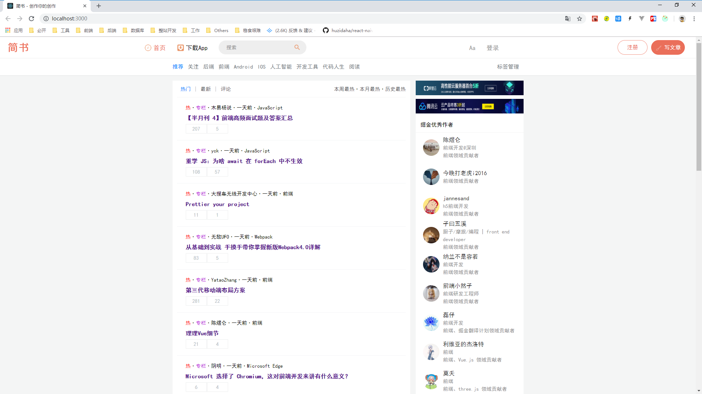

React Demo Three - 简书
===

> Create by **jsliang** on **2019-4-7 19:37:41**  
> Recently revised in **2019-4-7 19:37:37**

**Hello 小伙伴们，如果觉得本文还不错，记得给个 **star** ， 小伙伴们的 **star** 是我持续更新的动力！[GitHub 地址](https://github.com/LiangJunrong/document-library/blob/master/JavaScript-library/React/ReactDemoThree-JianShu.md)**

* [React 系列文章代码地址](https://github.com/LiangJunrong/React)

## <a name="chapter-one" id="chapter-one">一 目录</a>

**不折腾的前端，和咸鱼有什么区别**

| 目录 |
| --- | 
| [一 目录](#chapter-one) | 
| <a name="catalog-chapter-two" id="catalog-chapter-two"></a>[二 前言](#chapter-two) |

## <a name="chapter-two" id="chapter-two">二 前言</a>

> [返回目录](#chapter-one)

## 初始化目录

首先，引入 Simplify 目录的内容到 JianShu 文件夹。或者前往文章 [《React Demo One - TodoList》](https://github.com/LiangJunrong/document-library/blob/master/JavaScript-library/React/ReactDemoOne-TodoList.md#chapter-three-three) 手动进行项目简化

然后，我们通过：

* 安装依赖：`npm i`
* 运行项目：`npm run start`

跑起项目来，运行结果如下所示：



接着，我们在 src 目录下引入 reset.css，去除各种浏览器的差异性影响。

> src/reset.css

<details>

  <summary>代码详情</summary>

```js
/* 
  * reset 的目的不是让默认样式在所有浏览器下一致，而是减少默认样式有可能带来的问题。
  * The purpose of reset is not to allow default styles to be consistent across all browsers, but to reduce the potential problems of default styles.
  * create by jsliang
*/

/** 清除内外边距 - clearance of inner and outer margins **/
body, h1, h2, h3, h4, h5, h6, hr, p, blockquote, /* 结构元素 - structural elements */
dl, dt, dd, ul, ol, li, /* 列表元素 - list elements */
pre, /* 文本格式元素 - text formatting elements */
form, fieldset, legend, button, input, textarea, /* 表单元素 - from elements */
th, td /* 表格元素 - table elements */ {
    margin: 0;
    padding: 0;
}

/** 设置默认字体 - setting the default font **/
body, button, input, select, textarea {
    font: 18px/1.5 '黑体', Helvetica, sans-serif;
}
h1, h2, h3, h4, h5, h6, button, input, select, textarea { font-size: 100%; }

/** 重置列表元素 - reset the list element **/
ul, ol { list-style: none; }

/** 重置文本格式元素 - reset the text format element **/
a, a:hover { text-decoration: none; }

/** 重置表单元素 - reset the form element **/
button { cursor: pointer; }
input { font-size: 18px; outline: none; }

/** 重置表格元素 - reset the table element **/
table { border-collapse: collapse; border-spacing: 0; }

/*
  * 图片自适应 - image responsize 
  * 1. 清空浏览器对图片的设置
  * 2. <div>图片</div> 的情况下，图片会撑高 div，这么设置可以清除该影响
*/
img { border: 0; display: inline-block; width: 100%; max-width: 100%; height: auto; vertical-align: middle; }

/* 
  * 默认box-sizing是content-box，该属性导致padding会撑大div，使用border-box可以解决该问题
  * set border-box for box-sizing when you use div, it solve the problem when you add padding and don't want to make the div width bigger
*/
div, input { box-sizing: border-box; }

/** 清除浮动 - clear float **/
.jsliang-clear:after, .clear:after {
    content: '\20';
    display: block;
    height: 0;
    clear: both;
}
.jsliang-clear, .clear {
    *zoom: 1;
}

/** 设置input的placeholder - set input placeholder **/
input::-webkit-input-placeholder { color: #919191; font-size: 1em } /* Webkit browsers */
input::-moz-placeholder { color: #919191; font-size: 1em } /* Mozilla Firefox */
input::-ms-input-placeholder { color: #919191; font-size: 1em } /* Internet Explorer */
```

</details>

顺带创建一个空的全局样式 index.css 文件。

并在 index.js 中引入 reset.css 和 index.css。

> src/index.js

<details>

  <summary>代码详情</summary>

```js
import React from 'react';
import ReactDOM from 'react-dom';
import App from './App';
import './reset.css';
import './index.css';

ReactDOM.render(<App />, document.getElementById('root'));
```

</details>

## 创建 React 头部组件

首先，我们安装 Ant Design，在开发中减少写样式的时间：`npm i antd -S`

然后，在 src 目录下，新建 common 目录，并在 common 目录下，新建 header 目录，其中的 index.js 内容如下：

> src/common/header/index.js

<details>

  <summary>代码详情</summary>

```js
import React, { Component } from 'react';

class Header extends Component {
  render() {
    return (
      <div>
        <h1>Header</h1>
      </div>
    )
  }
}

export default Header;
```

</details>

接着，我们在 App.js 中引入 header.js：

> src/App.js

<details>

  <summary>代码详情</summary>

```js
import React, { Component } from 'react';
import Header from './common/header';

class App extends Component {
  render() {
    return (
      <div className="App">
        <Header />
      </div>
    );
  }
}

export default App;
```

</details>


---

> **jsliang** 广告推送：  
> 也许小伙伴想了解下云服务器  
> 或者小伙伴想买一台云服务器  
> 或者小伙伴需要续费云服务器  
> 欢迎点击 **[云服务器推广](https://github.com/LiangJunrong/document-library/blob/master/other-library/Monologue/%E7%A8%B3%E9%A3%9F%E8%89%B0%E9%9A%BE.md)** 查看！

[](https://promotion.aliyun.com/ntms/act/qwbk.html?userCode=w7hismrh)
[](https://cloud.tencent.com/redirect.php?redirect=1014&cps_key=49f647c99fce1a9f0b4e1eeb1be484c9&from=console)

> <a rel="license" href="http://creativecommons.org/licenses/by-nc-sa/4.0/"></a><br /><span xmlns:dct="http://purl.org/dc/terms/" property="dct:title">jsliang 的文档库</span> 由 <a xmlns:cc="http://creativecommons.org/ns#" href="https://github.com/LiangJunrong/document-library" property="cc:attributionName" rel="cc:attributionURL">梁峻荣</a> 采用 <a rel="license" href="http://creativecommons.org/licenses/by-nc-sa/4.0/">知识共享 署名-非商业性使用-相同方式共享 4.0 国际 许可协议</a>进行许可。<br />基于<a xmlns:dct="http://purl.org/dc/terms/" href="https://github.com/LiangJunrong/document-library" rel="dct:source">https://github.com/LiangJunrong/document-library</a>上的作品创作。<br />本许可协议授权之外的使用权限可以从 <a xmlns:cc="http://creativecommons.org/ns#" href="https://creativecommons.org/licenses/by-nc-sa/2.5/cn/" rel="cc:morePermissions">https://creativecommons.org/licenses/by-nc-sa/2.5/cn/</a> 处获得。