React Demo Three - 简书
===

> Create by **jsliang** on **2019-4-7 19:37:41**  
> Recently revised in **2019-04-23 09:40:44**

**Hello 小伙伴们，如果觉得本文还不错，记得给个 **star** ， 小伙伴们的 **star** 是我持续更新的动力！[GitHub 地址](https://github.com/LiangJunrong/document-library/blob/master/JavaScript-library/React/ReactDemoThree-JianShu.md)**

* [React 系列文章代码地址](https://github.com/LiangJunrong/React)

本文章最终成果：


> 本来这只是篇纯粹的仿简书首页和文章详情页的文章，但是中间出了点情况（第十九章有提到），所以最终出来的是简书和掘金的混合体~

## <a name="chapter-one" id="chapter-one">一 目录</a>

**不折腾的前端，和咸鱼有什么区别**

| 目录 |
| --- | 
| [一 目录](#chapter-one) | 
| <a name="catalog-chapter-two" id="catalog-chapter-two"></a>[二 前言](#chapter-two) |
| <a name="catalog-chapter-three" id="catalog-chapter-three"></a>[三 初始化项目目录](#chapter-three) |
| <a name="catalog-chapter-four" id="catalog-chapter-four"></a>[四 创建 React 头部组件](#chapter-four) |
| <a name="catalog-chapter-five" id="catalog-chapter-five"></a>[五 编写简书头部导航](#chapter-five) |
| <a name="catalog-chapter-six" id="catalog-chapter-six"></a>[六 设置输入框动画](#chapter-six) |
| <a name="catalog-chapter-seven" id="catalog-chapter-seven"></a>[七 优化代码](#chapter-seven) |
| <a name="catalog-chapter-eight" id="catalog-chapter-eight"></a>[八 使用 redux-devtools-extension 插件](#chapter-eight) |
| <a name="catalog-chapter-night" id="catalog-chapter-night"></a>[九 优化：抽取 reducer.js](#chapter-night) |
| <a name="catalog-chapter-ten" id="catalog-chapter-ten"></a>[十 优化：抽取 action](#chapter-ten) |
| <a name="catalog-chapter-eleven" id="catalog-chapter-eleven"></a>[十一 优化：immutable.js](#chapter-eleven) |
| <a name="catalog-chapter-twelve" id="catalog-chapter-twelve"></a>[十二 优化：redux-immutable](#chapter-twelve) |
| <a name="catalog-chapter-thirteen" id="catalog-chapter-thirteen"></a>[十三 功能实现：热门搜索](#chapter-thirteen) |
| <a name="catalog-chapter-fourteen" id="catalog-chapter-fourteen"></a>[十四 代码优化](#chapter-fourteen) |
| <a name="catalog-chapter-fifteen" id="catalog-chapter-fifteen"></a>[十五 解决历史遗留问题](#chapter-fifteen) |
| <a name="catalog-chapter-sixteen" id="catalog-chapter-sixteen"></a>[十六 功能实现：换一换](#chapter-sixteen) |
| <a name="catalog-chapter-seventeen" id="catalog-chapter-seventeen"></a>[十七 功能优化](#chapter-seventeen) |
| &emsp;[17.1 换一换图标旋转](#chapter-seventeen-one) |
| &emsp;[17.2 避免聚焦重复请求](#chapter-seventeen-two) |
| <a name="catalog-chapter-eighteen" id="catalog-chapter-eighteen"></a>[十八 React 路由](#chapter-eighteen) |
| &emsp;[18.1 路由（一）](#chapter-eighteen-one) |
| &emsp;[18.2 路由（二）](#chapter-eighteen-two) |
| <a name="catalog-chapter-nighteen" id="catalog-chapter-nighteen"></a>[十九 页面实现：二级导航栏](#chapter-nighteen) |
| <a name="catalog-chapter-twenty" id="catalog-chapter-twenty"></a>[二十 页面实现：首页](#chapter-twenty) |
| &emsp;[20.1 多层级组件引用 store](#chapter-twenty-one) |
| &emsp;[20.2 完善整个首页](#chapter-twenty-two) |
| <a name="catalog-chapter-twentyone" id="catalog-chapter-twentyone"></a>[二十一 总结](#chapter-twentyone) |

## <a name="chapter-two" id="chapter-two">二 前言</a>

> [返回目录](#chapter-one)

岁月如梭，光阴荏苒。

既然决定了做某事，那就坚持下去。

**相信，坚持必定有收获，不管它体现在哪个方面。**

React 的学习，迈开 TodoList，进一步前行。

## <a name="chapter-three" id="chapter-three">三 初始化项目目录</a>

> [返回目录](#chapter-one)

**首先**，引入 Simplify 目录的内容到 JianShu 文件夹。或者前往文章 [《React Demo One - TodoList》](https://github.com/LiangJunrong/document-library/blob/master/JavaScript-library/React/ReactDemoOne-TodoList.md#chapter-three-three) 手动进行项目简化。

我们的最终目录如下所示：

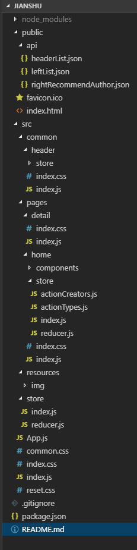

小伙伴们可以自行新建空文件，在后续不会因为不知道该文件放到哪，从而导致思路错乱。

**然后**，我们通过：

* 安装依赖：`npm i`
* 运行项目：`npm run start`

跑起项目来，运行结果如下所示：

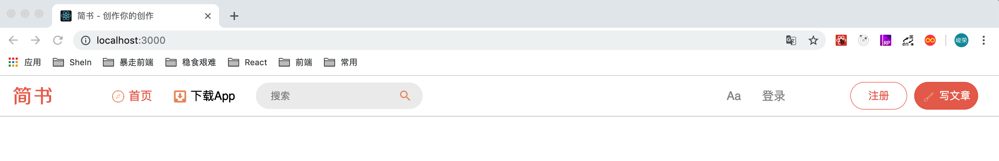

**接着**，我们在 src 目录下引入 reset.css，去除各种浏览器的差异性影响。

> src/reset.css

<details>

  <summary>代码详情</summary>

```js
/* 
  * reset 的目的不是让默认样式在所有浏览器下一致，而是减少默认样式有可能带来的问题。
  * The purpose of reset is not to allow default styles to be consistent across all browsers, but to reduce the potential problems of default styles.
  * create by jsliang
*/

/** 清除内外边距 - clearance of inner and outer margins **/
body, h1, h2, h3, h4, h5, h6, hr, p, blockquote, /* 结构元素 - structural elements */
dl, dt, dd, ul, ol, li, /* 列表元素 - list elements */
pre, /* 文本格式元素 - text formatting elements */
form, fieldset, legend, button, input, textarea, /* 表单元素 - from elements */
th, td /* 表格元素 - table elements */ {
    margin: 0;
    padding: 0;
}

/** 设置默认字体 - setting the default font **/
body, button, input, select, textarea {
    font: 18px/1.5 '黑体', Helvetica, sans-serif;
}
h1, h2, h3, h4, h5, h6, button, input, select, textarea { font-size: 100%; }

/** 重置列表元素 - reset the list element **/
ul, ol { list-style: none; }

/** 重置文本格式元素 - reset the text format element **/
a, a:hover { text-decoration: none; }

/** 重置表单元素 - reset the form element **/
button { cursor: pointer; }
input { font-size: 18px; outline: none; }

/** 重置表格元素 - reset the table element **/
table { border-collapse: collapse; border-spacing: 0; }

/*
  * 图片自适应 - image responsize 
  * 1. 清空浏览器对图片的设置
  * 2. <div>图片</div> 的情况下，图片会撑高 div，这么设置可以清除该影响
*/
img { border: 0; display: inline-block; width: 100%; max-width: 100%; height: auto; vertical-align: middle; }

/* 
  * 默认box-sizing是content-box，该属性导致padding会撑大div，使用border-box可以解决该问题
  * set border-box for box-sizing when you use div, it solve the problem when you add padding and don't want to make the div width bigger
*/
div, input { box-sizing: border-box; }

/** 清除浮动 - clear float **/
.jsliang-clear:after, .clear:after {
    content: '\20';
    display: block;
    height: 0;
    clear: both;
}
.jsliang-clear, .clear {
    *zoom: 1;
}

/** 设置input的placeholder - set input placeholder **/
input::-webkit-input-placeholder { color: #919191; font-size: 1em } /* Webkit browsers */
input::-moz-placeholder { color: #919191; font-size: 1em } /* Mozilla Firefox */
input::-ms-input-placeholder { color: #919191; font-size: 1em } /* Internet Explorer */
```

</details>

顺带创建一个空的全局样式 index.css 文件。

并在 index.js 中引入 reset.css 和 index.css。

> src/index.js

<details>

  <summary>代码详情</summary>

```js
import React from 'react';
import ReactDOM from 'react-dom';
import App from './App';
import './reset.css';
import './index.css';

ReactDOM.render(<App />, document.getElementById('root'));
```

</details>

## <a name="chapter-four" id="chapter-four">四 创建 React 头部组件</a>

> [返回目录](#chapter-one)

**首先**，在 src 目录下，新建 common 目录，并在 common 目录下，新建 header 目录，其中的 index.js 内容如下：

> src/common/header/index.js

<details>

  <summary>代码详情</summary>

```js
import React, { Component } from 'react';

class Header extends Component {
  render() {
    return (
      <div>
        <h1>Header</h1>
      </div>
    )
  }
}

export default Header;
```

</details>

**然后**，我们在 App.js 中引入 header.js：

> src/App.js

<details>

  <summary>代码详情</summary>

```js
import React, { Component } from 'react';
import Header from './common/header';

class App extends Component {
  render() {
    return (
      <div className="App">
        <Header />
      </div>
    );
  }
}

export default App;
```

</details>

最后，页面显示为：

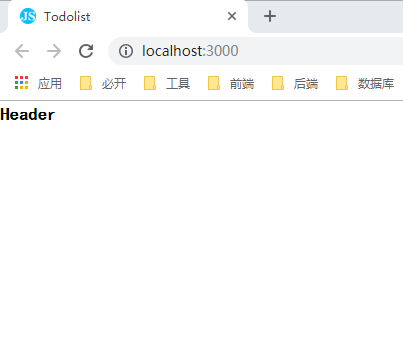

由此，我们完成了 Header 组件的创建。

## <a name="chapter-five" id="chapter-five">五 编写简书头部导航</a>

> [返回目录](#chapter-one)

**首先**，我们编写 src/common/header 下的 index.js：

> src/common/heder/index.js

<details>

  <summary>代码详情</summary>

```js
import React, { Component } from 'react';
import './index.css';

import homeImage from '../../resources/img/header-home.png';
class Header extends Component {

  constructor(props) {
    super(props);
    this.state = {
      inputFocus: true
    }
    this.searchFocusOrBlur = this.searchFocusOrBlur.bind(this);
  }
  
  render() {
    return (
      <header>
        <div className="header_left">
          <a href="/">
            
          </a>
        </div>
        <div className="header_center">
          <div className="header_center-left">
            <div className="nav-item header_center-left-home">
              <i className="icon icon-home"></i>
              <span>首页</span>
            </div>
            <div className="nav-item header_center-left-download">
              <i className="icon icon-download"></i>
              <span>下载App</span>
            </div>
            <div className="nav-item header_center-left-search">
              <input 
                className={this.state.inputFocus ? 'input-nor-active' : 'input-active'}
                placeholder="搜索"
                onFocus={this.searchFocusOrBlur}
                onBlur={this.searchFocusOrBlur}
              />
              <i className={this.state.inputFocus ? 'icon icon-search' : 'icon icon-search icon-active'}></i>
            </div>
          </div>
          <div className="header_center-right">
            <div className="nav-item header_right-center-setting">
              <span>Aa</span>
            </div>
            <div className="nav-item header_right-center-login">
              <span>登录</span>
            </div>
          </div>
        </div>
        <div className="header_right nav-item">
          <span className="header_right-register">注册</span>
          <span className="header_right-write nav-item">
            <i className="icon icon-write"></i>
            <span>写文章</span>
          </span>
        </div>
      </header>
    )
  }

  searchFocusOrBlur(e) {
    const inputFocus = this.state.inputFocus;
    this.setState( () => ({
      inputFocus: !inputFocus
    }))
  }

}

export default Header;
```

</details>

**然后**，我们添加 CSS 样式：

> src/common/heder/index.css

<details>

  <summary>代码详情</summary>

```css
header {
  width: 100%;
  height: 58px;
  display: flex;
  align-items: center;
  border-bottom: 1px solid #ccc;
  font-size: 17px;
}
.headef_left-img {
  width: 100px;
  height: 56px;
}
.header_center {
  width: 1000px;
  margin: 0 auto;
  display: flex;
  justify-content: space-between;
}
.nav-item {
  margin-right: 30px;
  display: flex;
  align-items: center;
}
.header_center-left {
  display: flex;
}
.header_center-left-home {
  color: #ea6f5a;
}
.header_center-left-search {
  position: relative;
}
.header_center-left-search input {
  width: 240px;
  padding: 0 40px 0 20px;
  height: 38px;
  font-size: 14px;
  border: 1px solid #eee;
  border-radius: 40px;
  background: #eee;
}
.header_center-left-search .input-active {
  width: 280px;
}
.header_center-left-search i {
  position: absolute;
  top: 8px;
  right: 10px;
}
.header_center-left-search .icon-active {
  padding: 3px;
  top: 4px;
  border-radius: 15px;
  border: 1px solid #ea6f5a;
}
.header_center-left-search .icon-active:hover {
  cursor: pointer;
}
.header_center-right {
  display: flex;
  color: #969696;
}
.header_right-register, .header_right-write {
  width: 80px;
  text-align: center;
  height: 38px;
  line-height: 38px;
  border: 1px solid rgba(236,97,73,.7);
  border-radius: 20px;
  font-size: 15px;
  color: #ea6f5a;
  background-color: transparent;
}
.header_right-write {
  margin-left: 10px;
  padding-left: 10px;
  margin-right: 0px;
  color: #fff;
  background-color: #ea6f5a;
}
```

</details>

**接着**，由于图标这些，我们可以抽取到公用样式表中，所以我们在 src 目录下添加 common.css：

> src/common.css

<details>

  <summary>代码详情</summary>

```css
.icon {
  display: inline-block;
  width: 20px;
  height: 21px;
  margin-right: 5px;
}
.icon-home {
  background: url('./resources/img/icon-home.png') no-repeat center;
  background-size: 100%;
}
.icon-write {
  background: url('./resources/img/icon-write.png') no-repeat center;
  background-size: 100%;
}
.icon-download {
  background: url('./resources/img/icon-download.png') no-repeat center;
  background-size: 100%;
}
.icon-search {
  background: url('./resources/img/icon-search.png') no-repeat center;
  background-size: 100%;
}
```

</details>

当然，我们需要位置存放图片，所以需要在 src 目录下，新建 recourses 目录，recourses 目录下存放 img 文件夹，该文件夹存放这些图标文件。

**最后**，我们在 src 下的 index.js 中引用 common.css

> src/index.js

<details>

  <summary>代码详情</summary>

```js
import React from 'react';
import ReactDOM from 'react-dom';
import App from './App';
import './reset.css';
import './index.css';
import './common.css';

ReactDOM.render(<App />, document.getElementById('root'));
```

</details>

至此，我们页面展示为：

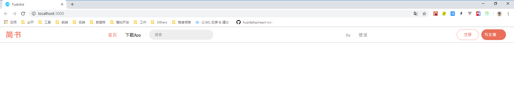

## <a name="chapter-six" id="chapter-six">六 设置输入框动画</a>

> [返回目录](#chapter-one)

> 参考地址：[react-transition-group](https://github.com/reactjs/react-transition-group)

* 安装动画库：`npm i react-transition-group -S`

修改代码：

> src/common/header/index.js

<details>

  <summary>代码详情</summary>

```js
import React, { Component } from 'react';
// 1. 引入动画库
import { CSSTransition } from 'react-transition-group';
import './index.css';

import homeImage from '../../resources/img/header-home.png';

class Header extends Component {

  constructor(props) {
    super(props);
    this.state = {
      inputBlur: true
    }
    this.searchFocusOrBlur = this.searchFocusOrBlur.bind(this);
  }

  render() {
    return (
      <header>
        <div className="header_left">
          <a href="/">
            
          </a>
        </div>
        <div className="header_center">
          <div className="header_center-left">
            <div className="nav-item header_center-left-home">
              <i className="icon icon-home"></i>
              <span>首页</span>
            </div>
            <div className="nav-item header_center-left-download">
              <i className="icon icon-download"></i>
              <span>下载App</span>
            </div>
            <div className="nav-item header_center-left-search">
              {/* 2. 通过 CSSTransition 包裹 input */}
              <CSSTransition
                in={this.state.inputBlur}
                timeout={200}
                classNames="slide"
              >
                <input 
                  className={this.state.inputBlur ? 'input-nor-active' : 'input-active'}
                  placeholder="搜索"
                  onFocus={this.searchFocusOrBlur}
                  onBlur={this.searchFocusOrBlur}
                />
              </CSSTransition>
              <i className={this.state.inputBlur ? 'icon icon-search' : 'icon icon-search icon-active'}></i>
            </div>
          </div>
          <div className="header_center-right">
            <div className="nav-item header_right-center-setting">
              <span>Aa</span>
            </div>
            <div className="nav-item header_right-center-login">
              <span>登录</span>
            </div>
          </div>
        </div>
        <div className="header_right nav-item">
          <span className="header_right-register">注册</span>
          <span className="header_right-write nav-item">
            <i className="icon icon-write"></i>
            <span>写文章</span>
          </span>
        </div>
      </header>
    )
  }

  searchFocusOrBlur(e) {
    const inputBlur = this.state.inputBlur;
    this.setState( () => ({
      inputBlur: !inputBlur
    }))
  }

}

export default Header;
```

</details>

> src/common/header/index.css

<details>

  <summary>代码详情</summary>

```css
header {
  width: 100%;
  height: 58px;
  display: flex;
  align-items: center;
  border-bottom: 1px solid #ccc;
  font-size: 17px;
}
.headef_left-img {
  width: 100px;
  height: 56px;
}
.header_center {
  width: 1000px;
  margin: 0 auto;
  display: flex;
  justify-content: space-between;
}
.nav-item {
  margin-right: 30px;
  display: flex;
  align-items: center;
}
.header_center-left {
  display: flex;
}
.header_center-left-home {
  color: #ea6f5a;
}
.header_center-left-search {
  position: relative;
}
/* 3. 编写对应的 CSS 样式 */
.slide-enter {
  transition: all .2s ease-out;
}
.slide-enter-active {
  width: 280px;
}
.slide-exit {
  transition: all .2s ease-out;
}
.silde-exit-active {
  width: 240px;
}
/* 3. 结束 */
.header_center-left-search input {
  width: 240px;
  padding: 0 40px 0 20px;
  height: 38px;
  font-size: 14px;
  border: 1px solid #eee;
  border-radius: 40px;
  background: #eee;
}
.header_center-left-search .input-active {
  width: 280px;
}
.header_center-left-search i {
  position: absolute;
  top: 8px;
  right: 10px;
}
.header_center-left-search .icon-active {
  padding: 3px;
  top: 4px;
  border-radius: 15px;
  border: 1px solid #ea6f5a;
}
.header_center-left-search .icon-active:hover {
  cursor: pointer;
}
.header_center-right {
  display: flex;
  color: #969696;
}
.header_right-register, .header_right-write {
  width: 80px;
  text-align: center;
  height: 38px;
  line-height: 38px;
  border: 1px solid rgba(236,97,73,.7);
  border-radius: 20px;
  font-size: 15px;
  color: #ea6f5a;
  background-color: transparent;
}
.header_right-write {
  margin-left: 10px;
  padding-left: 10px;
  margin-right: 0px;
  color: #fff;
  background-color: #ea6f5a;
}
```

</details>

这样，经过四个操作步骤：

1. 安装动画库：`npm i react-transition-group -S`
2. 引入动画库
3. 通过 `CSSTransition` 包裹 `input`
4. 编写对应的 CSS 样式

我们就成功实现了 CSS 动画插件的引入及使用，此时页面显示为：

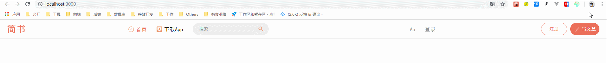

## <a name="chapter-seven" id="chapter-seven">七 优化代码</a>

> [返回目录](#chapter-one)

* 安装 Redux：`npm i redux -S`
* 安装 React-Redux：`npm i react-redux -S`
* 开始在代码中加入 Redux 和 React-Redux

1. **首先**，创建 store 文件夹，并在里面创建 index.js 和 reducer.js：

> src/store/index.js

<details>

  <summary>代码详情</summary>

```js
import { createStore } from 'redux';
import reducer from './reducer';

const store = createStore(reducer);

export default store;
```

</details>

> src/store/reducer.js

<details>

  <summary>代码详情</summary>

```js
const defaultState = {
  inputBlur: true
};

export default (state = defaultState, action) => {
  return state;
}
```

</details>

2. **接着**，在 App.js 中引用 react-redux 以及 store/index.js：

> src/App.js

<details>

  <summary>代码详情</summary>

```js
import React, { Component } from 'react';
import { Provider } from 'react-redux';
import Header from './common/header';
import store from './store';

class App extends Component {
  render() {
    return (
      <Provider store={store} className="App">
        <Header />
      </Provider>
    );
  }
}

export default App;
```

</details>

3. **然后**，修改 src 下 common 中 header 里面 index.js 中的内容：

> src/common/header/index.js

<details>

  <summary>代码详情</summary>

```js
import React, { Component } from 'react';
import { connect } from 'react-redux';
import { CSSTransition } from 'react-transition-group';
import './index.css';

import homeImage from '../../resources/img/header-home.png';

class Header extends Component {
  render() {
    return (
      <header>
        <div className="header_left">
          <a href="/">
            
          </a>
        </div>
        <div className="header_center">
          <div className="header_center-left">
            <div className="nav-item header_center-left-home">
              <i className="icon icon-home"></i>
              <span>首页</span>
            </div>
            <div className="nav-item header_center-left-download">
              <i className="icon icon-download"></i>
              <span>下载App</span>
            </div>
            <div className="nav-item header_center-left-search">
              <CSSTransition
                in={this.props.inputBlur}
                timeout={200}
                classNames="slide"
              >
                <input 
                  className={this.props.inputBlur ? 'input-nor-active' : 'input-active'}
                  placeholder="搜索"
                  onFocus={this.props.searchFocusOrBlur}
                  onBlur={this.props.searchFocusOrBlur}
                />
              </CSSTransition>
              <i className={this.props.inputBlur ? 'icon icon-search' : 'icon icon-search icon-active'}></i>
            </div>
          </div>
          <div className="header_center-right">
            <div className="nav-item header_right-center-setting">
              <span>Aa</span>
            </div>
            <div className="nav-item header_right-center-login">
              <span>登录</span>
            </div>
          </div>
        </div>
        <div className="header_right nav-item">
          <span className="header_right-register">注册</span>
          <span className="header_right-write nav-item">
            <i className="icon icon-write"></i>
            <span>写文章</span>
          </span>
        </div>
      </header>
    )
  }
}

const mapStateToProps = (state) => {
  return {
    inputBlur: state.inputBlur
  }
}

const mapDispathToProps = (dispatch) => {
  return {
    searchFocusOrBlur() {
      const action = {
        type: 'search_focus_or_blur'
      }
      dispatch(action);
    }
  }
}

export default connect(mapStateToProps, mapDispathToProps)(Header);
```

</details>

4. **再来**，我们再修改下 reducer.js，获取并处理 src/index.js 中 `dispatch` 过来的值：

> src/store/reducer.js

<details>

  <summary>代码详情</summary>

```js
const defaultState = {
  inputBlur: true
};

export default (state = defaultState, action) => {
  if(action.type === 'search_focus_or_blur') {
    const newState = JSON.parse(JSON.stringify(state));
    newState.inputBlur = !newState.inputBlur
    return newState;
  }
  return state;
}
```

</details>

5. **此时**，我们完成了修改的步骤。同时，这时候因为 src 下 common 中 header 里面的 index.js 中只有 `render` 方法体，它构成了无状态组件，所以我们将其转换成无状态组件：

> src/common/header/index.js

<details>

  <summary>代码详情</summary>

```js
import React from 'react';
import { connect } from 'react-redux';
import { CSSTransition } from 'react-transition-group';
import './index.css';

import homeImage from '../../resources/img/header-home.png';

const Header = (props) => {
  return (
    <header>
      <div className="header_left">
        <a href="/">
          
        </a>
      </div>
      <div className="header_center">
        <div className="header_center-left">
          <div className="nav-item header_center-left-home">
            <i className="icon icon-home"></i>
            <span>首页</span>
          </div>
          <div className="nav-item header_center-left-download">
            <i className="icon icon-download"></i>
            <span>下载App</span>
          </div>
          <div className="nav-item header_center-left-search">
            <CSSTransition
              in={props.inputBlur}
              timeout={200}
              classNames="slide"
            >
              <input 
                className={props.inputBlur ? 'input-nor-active' : 'input-active'}
                placeholder="搜索"
                onFocus={props.searchFocusOrBlur}
                onBlur={props.searchFocusOrBlur}
              />
            </CSSTransition>
            <i className={props.inputBlur ? 'icon icon-search' : 'icon icon-search icon-active'}></i>
          </div>
        </div>
        <div className="header_center-right">
          <div className="nav-item header_right-center-setting">
            <span>Aa</span>
          </div>
          <div className="nav-item header_right-center-login">
            <span>登录</span>
          </div>
        </div>
      </div>
      <div className="header_right nav-item">
        <span className="header_right-register">注册</span>
        <span className="header_right-write nav-item">
          <i className="icon icon-write"></i>
          <span>写文章</span>
        </span>
      </div>
    </header>
  )
}

const mapStateToProps = (state) => {
  return {
    inputBlur: state.inputBlur
  }
}

const mapDispathToProps = (dispatch) => {
  return {
    searchFocusOrBlur() {
      const action = {
        type: 'search_focus_or_blur'
      }
      dispatch(action);
    }
  }
}

export default connect(mapStateToProps, mapDispathToProps)(Header);
```

</details>

6. **最后**，我们完成了 Redux、React-Redux 的引用及使用，以及对 header/index.js 的无状态组件的升级。

> 由于我们只是将必要的数据存储到 state 中，所以样式和功能无变化，故不贴出效果图。

## <a name="chapter-eight" id="chapter-eight">八 使用 redux-devtools-extension 插件</a>

> [返回目录](#chapter-one)

修改 src/store/index.js 如下：

> src/store/index.js

<details>

  <summary>代码详情</summary>

```js
import { createStore, compose } from 'redux';
import reducer from './reducer';

const composeEnhancers = window.__REDUX_DEVTOOLS_EXTENSION_COMPOSE__ || compose;

const store = createStore(reducer, composeEnhancers())

export default store;
```

</details>

这时候，我们就成功开启之前安装过的 redux-devtools-extension 插件。

使用一下：

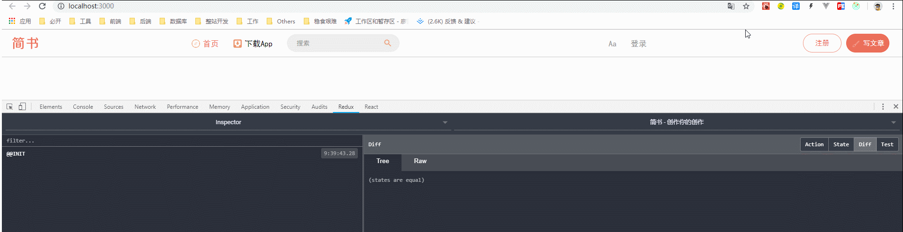

## <a name="chapter-night" id="chapter-night">九 优化：抽取 reducer.js</a>

> [返回目录](#chapter-one)

在项目开发中，我们会发现 reducer.js 随着项目的开发越来越庞大，最后到不可维护的地步。

该视频的慕课讲师也提到：**当你的一个 js 文件代码量超过 300 行，说明它的设计从一开始来说就是不合理的。**

所以，我们要想着进一步优化它。

**首先**，我们在 header 目录下，新建 store，并新建 reducer.js，将 src/store 的 reducer.js 中的内容剪切到 header/store/reducer.js 中：

> src/common/header/store/reducer.js

<details>

  <summary>代码详情</summary>

```js
// 1. 将 reducer.js 转移到 header/store/reducer.js 中
const defaultState = {
  inputBlur: true
};

export default (state = defaultState, action) => {
  if(action.type === 'search_focus_or_blur') {
    const newState = JSON.parse(JSON.stringify(state));
    newState.inputBlur = !newState.inputBlur
    return newState;
  }
  return state;
}
```

</details>

**然后**，我们修改 src/store/reducer.js 的内容为：

> src/store/reducer.js

<details>

  <summary>代码详情</summary>

```js
// 2. 通过 combineReducers 整合多个 reducer.js 文件
import { combineReducers } from 'redux';
import headerReducer from '../common/header/store/reducer';

const reducer =  combineReducers({
  header: headerReducer
})

export default reducer;
```

</details>

**最后**，我们修改 src/common/header/index.js 内容：

> src/common/header/index.js

<details>

  <summary>代码详情</summary>

```js
// 代码省略 。。。
const mapStateToProps = (state) => {
  return {
    // 3. 因为引用的层级变了，所以需要修改 state.inputBlur 为 state.header.inputBlue
    inputBlur: state.header.inputBlur
  }
}
// 代码省略 。。。
```

</details>

在这里，我们需要知道的是：之前我们只有一层目录，所以修改的是 `state.inputBlur`。

但是，因为通过 `combineReducers` 将 reducer.js 进行了整合，所以需要修改为 `state.header.inputBlur`

至此，我们就完成了 reducer.js 的优化。

## <a name="chapter-ten" id="chapter-ten">十 优化：抽取 action</a>

> [返回目录](#chapter-one)

1. **首先**，在 header 的 store 中新建 actionCreators.js 文件：

> src/common/header/store/actionCreators.js

<details>

  <summary>代码详情</summary>

```js
// 1. 定义 actionCreators
export const searchFocusOrBlur = () => ({
  type: 'search_focus_or_blur'
})
```

</details>

2. **然后**，我们在 header 中的 index.js 文件引入 actionCreators.js，并在 `mapDispathToProps` 方法体中将其 `dispatch` 出去：

> src/common/header/index.js

<details>

  <summary>代码详情</summary>

```js
import React from 'react';
import { connect } from 'react-redux';
import { CSSTransition } from 'react-transition-group';
import './index.css';
// 2. 以 actionCreators 的形式将所有 action 引入进来
import * as actionCreators from './store/actionCreators';

import homeImage from '../../resources/img/header-home.png';

const Header = (props) => {
  return (
    <header>
      <div className="header_left">
        <a href="/">
          
        </a>
      </div>
      <div className="header_center">
        <div className="header_center-left">
          <div className="nav-item header_center-left-home">
            <i className="icon icon-home"></i>
            <span>首页</span>
          </div>
          <div className="nav-item header_center-left-download">
            <i className="icon icon-download"></i>
            <span>下载App</span>
          </div>
          <div className="nav-item header_center-left-search">
            <CSSTransition
              in={props.inputBlur}
              timeout={200}
              classNames="slide"
            >
              <input 
                className={props.inputBlur ? 'input-nor-active' : 'input-active'}
                placeholder="搜索"
                onFocus={props.searchFocusOrBlur}
                onBlur={props.searchFocusOrBlur}
              />
            </CSSTransition>
            <i className={props.inputBlur ? 'icon icon-search' : 'icon icon-search icon-active'}></i>
          </div>
        </div>
        <div className="header_center-right">
          <div className="nav-item header_right-center-setting">
            <span>Aa</span>
          </div>
          <div className="nav-item header_right-center-login">
            <span>登录</span>
          </div>
        </div>
      </div>
      <div className="header_right nav-item">
        <span className="header_right-register">注册</span>
        <span className="header_right-write nav-item">
          <i className="icon icon-write"></i>
          <span>写文章</span>
        </span>
      </div>
    </header>
  )
}

const mapStateToProps = (state) => {
  return {
    inputBlur: state.header.inputBlur
  }
}

const mapDispathToProps = (dispatch) => {
  return {
    searchFocusOrBlur() {
      // 3. 使用 actionCreators
      dispatch(actionCreators.searchFocusOrBlur());
    }
  }
}

export default connect(mapStateToProps, mapDispathToProps)(Header);
```

</details>

3. **接着**，因为我们在 actionCreators.js 中使用的 `type` 是字符串，所以我们同样在 store 中创建 actionTypes.js，将其变成常量：

> src/common/header/store/actionTypes.js

<details>

  <summary>代码详情</summary>

```js
export const SEARCH_FOCUS_OR_BLUR = 'search_focus_or_blur';
```

</details>

4. **再然后**，我们在 actionCreators.js 中引入 actionTypes.js：

> src/common/header/store/actionCreators.js

<details>

  <summary>代码详情</summary>

```js
// 4. 引入常量
import { SEARCH_FOCUS_OR_BLUR } from './actionTypes';

// 1. 定义 actionCreators
// 5. 将 action 中的字符串修改为常量
export const searchFocusOrBlur = () => ({
  type: SEARCH_FOCUS_OR_BLUR
})
```

</details>

5. **再接着**，我们修改下 header 目录中 store 下的 reducer.js，因为我们的字符串变成了常量，所以这里也需要做相应变更：

> src/common/header/store/reducer.js

<details>

  <summary>代码详情</summary>

```js
// 6. 引入常量
import * as actionTypes from './actionTypes'

const defaultState = {
  inputBlur: true
};

export default (state = defaultState, action) => {
  // 7. 使用常量
  if(action.type === actionTypes.SEARCH_FOCUS_OR_BLUR) {
    const newState = JSON.parse(JSON.stringify(state));
    newState.inputBlur = !newState.inputBlur
    return newState;
  }
  return state;
}
```

</details>

6. **然后**，我们现在 header/store 目录下有：actionCreators.js、actionTypes.js、reducer.js 三个文件，如果我们每次引入都要一个一个找，那是相当麻烦的，所以我们在 header/store 目录下再新建一个 index.js，通过 index.js 来管理这三个文件，这样我们其他页面需要引入它们的时候，我们只需要引入 store 下的 index.js 即可。

> src/common/header/store/index.js

<details>

  <summary>代码详情</summary>

```js
// 8. 统一管理 store 目录中的文件
import * as actionCreators from './actionCreators';
import * as actionTypes from './actionTypes';
import reducer from './reducer';

export { actionCreators, actionTypes, reducer };
```

</details>

7. **此时**，值得注意的是，这时候我们需要处理下 header/index.js 文件：

<details>

  <summary>代码详情</summary>

```js
import React from 'react';
import { connect } from 'react-redux';
import { CSSTransition } from 'react-transition-group';
import './index.css';
// 2. 以 actionCreators 的形式将所有 action 引入进来
// import * as actionCreators from './store/actionCreators';
// 9. 引入 store/index 文件即可
import { actionCreators } from './store';

import homeImage from '../../resources/img/header-home.png';

// 代码省略
```

</details>

8. **最后**，再处理下 src/store/reducer.js，因为它引用了 common/header/store 中的 reducer.js：

<details>

  <summary>代码详情</summary>

```js
import { combineReducers } from 'redux';
// 10. 修改下引用方式
import { reducer as headerReducer } from '../common/header/store';

const reducer =  combineReducers({
  header: headerReducer
})

export default reducer;
```

</details>

至此，我们就完成了本次的优化抽取。

## <a name="chapter-eleven" id="chapter-eleven">十一 优化；immutable.js</a>

> [返回目录](#chapter-one)

在我们工作的过程中，如果一不小心，就会修改了 reducer.js 中的数据（平时开发的时候，我们会通过 `JSON.parse(JSON.stringify())` 来进行深拷贝，获取一份额外的来进行修改）。

所以，这时候，我们就需要使用 immutable.js，它是由 Facebook 团队开发的，用来帮助我们生产 `immutable` 对象，从而限制 `state` 不可被改变。

* 安装 immutable.js：`npm i immutable -S`。
* 案例 immutable.js：

```js
const { Map } = require('immutable');
const map1 = Map({ a: 1, b: 2, c: 3 });
const map2 = map1.set('b', 50);
map1.get('b') + " vs. " + map2.get('b'); // 2 vs. 50
```

看起来很简单，我们直接在简书 Demo 中使用：

> src/common/header/store/reducer.js

<details>

  <summary>代码详情</summary>

```js
import * as actionTypes from './actionTypes'
// 1. 通过 immutable 引入 fromJS
import { fromJS } from 'immutable';

// 2. 对 defaultState 使用 fromJS
const defaultState = fromJS({
  inputBlur: true
});

export default (state = defaultState, action) => {
  if(action.type === actionTypes.SEARCH_FOCUS_OR_BLUR) {
    // const newState = JSON.parse(JSON.stringify(state));
    // newState.inputBlur = !newState.inputBlur
    // return newState;

    // 4. 通过 immutable 的方法来 set state 的值
    // immutable 对象的 set 方法，会结合之前 immutable 对象的值和设置的值，返回一个全新的对象
    return state.set('inputBlur', !state.get('inputBlur'));
  }
  return state;
}
```

</details>

> src/common/header/index.js

<details>

  <summary>代码详情</summary>

```js
import React from 'react';
import { connect } from 'react-redux';
import { CSSTransition } from 'react-transition-group';
import './index.css';
import { actionCreators } from './store';

import homeImage from '../../resources/img/header-home.png';

const Header = (props) => {
  return (
    <header>
      <div className="header_left">
        <a href="/">
          
        </a>
      </div>
      <div className="header_center">
        <div className="header_center-left">
          <div className="nav-item header_center-left-home">
            <i className="icon icon-home"></i>
            <span>首页</span>
          </div>
          <div className="nav-item header_center-left-download">
            <i className="icon icon-download"></i>
            <span>下载App</span>
          </div>
          <div className="nav-item header_center-left-search">
            <CSSTransition
              in={props.inputBlur}
              timeout={200}
              classNames="slide"
            >
              <input 
                className={props.inputBlur ? 'input-nor-active' : 'input-active'}
                placeholder="搜索"
                onFocus={props.searchFocusOrBlur}
                onBlur={props.searchFocusOrBlur}
              />
            </CSSTransition>
            <i className={props.inputBlur ? 'icon icon-search' : 'icon icon-search icon-active'}></i>
          </div>
        </div>
        <div className="header_center-right">
          <div className="nav-item header_right-center-setting">
            <span>Aa</span>
          </div>
          <div className="nav-item header_right-center-login">
            <span>登录</span>
          </div>
        </div>
      </div>
      <div className="header_right nav-item">
        <span className="header_right-register">注册</span>
        <span className="header_right-write nav-item">
          <i className="icon icon-write"></i>
          <span>写文章</span>
        </span>
      </div>
    </header>
  )
}

const mapStateToProps = (state) => {
  return {
    // 3. 通过 immutable 提供的 get() 方法来获取 inputBlur 属性
    inputBlur: state.header.get('inputBlur')
  }
}

const mapDispathToProps = (dispatch) => {
  return {
    searchFocusOrBlur() {
      dispatch(actionCreators.searchFocusOrBlur());
    }
  }
}

export default connect(mapStateToProps, mapDispathToProps)(Header);
```

</details>

我们大致做了四个步骤，从而完成了 immutable.js 的引用及使用：

1. 通过 `import` `immutable` 引入 `fromJS`
2. 对 `defaultState` 使用 `fromJS`
3. 这时候我们就不能直接修改 `matStateToProps` 中的值了，而是 通过 `immutable` 提供的 `get()` 方法来获取 `inputBlur` 属性
4. 通过 `immutable` 的方法来 `set` `state` 的值。`immutable` 对象的 `set` 方法，会结合之前 `immutable` 对象的值和设置的值，返回一个全新的对象

这样，我们就成功保护了 `state` 的值。

## <a name="chapter-twelve" id="chapter-twelve">十二 优化：redux-immutable</a>

> [返回目录](#chapter-one)

当然，在上面，我们保护了 header 中的 `state`，我们在代码中：

```js
inputBlur: state.header.get('inputBlur')
```

这个 `header` 也是 `state` 的值，所以我们也需要对它进行保护，所以我们就需要 redux-immutable

* 安装 redux-immutable：`npm i redux-immutable -S`
* 使用 redux-immutable：

> src/store/reducer.js

<details>

  <summary>代码详情</summary>

```js
// import { combineReducers } from 'redux';
// 1. 通过 redux-immutable 引入 combineReducers 而非原先的 redux
import { combineReducers } from 'redux-immutable';
import { reducer as headerReducer } from '../common/header/store';

const reducer =  combineReducers({
  header: headerReducer
})

export default reducer;
```

</details>

> src/common/header/index.js

<details>

  <summary>代码详情</summary>

```js
// 代码省略。。。
const mapStateToProps = (state) => {
  return {
    // 2. 通过同样的 get 方法来获取 header
    inputBlur: state.get('header').get('inputBlur')
  }
}
// 代码省略。。。
```

</details>

这样，通过简单的三个步骤，我们就保护了主 `state` 的值：

1. 安装 redux-immutable：`npm i redux-immutable -S`
2. 通过 redux-immutable 引入 `combineReducers` 而非原先的 redux
3. 通过同样的 `get` 方法来获取 `header`

## <a name="chapter-thirteen" id="chapter-thirteen">十三 功能实现：热门搜索</a>

> [返回目录](#chapter-one)

本章节完成三个功能：

1. 写热门搜索显示隐藏
2. 安装 redux-thunk
3. 使用 React 中 Node 提供的作假数据的功能，在 public/api 下写个文件 headerList.json，并做假数据，使用方式为 `axios.get('/api/headerList.json').then()`

**首先**，我们完成热门搜索的显示隐藏：

> src/common.css

<details>

  <summary>代码详情</summary>

```css
.icon {
  display: inline-block;
  width: 20px;
  height: 21px;
  margin-right: 5px;
}
.icon-home {
  background: url('./resources/img/icon-home.png') no-repeat center;
  background-size: 100%;
}
.icon-write {
  background: url('./resources/img/icon-write.png') no-repeat center;
  background-size: 100%;
}
.icon-download {
  background: url('./resources/img/icon-download.png') no-repeat center;
  background-size: 100%;
}
.icon-search {
  background: url('./resources/img/icon-search.png') no-repeat center;
  background-size: 100%;
}
.display-hide {
  display: none;
}
.display-show {
  display: block;
}
```

</details>

> src/common/header/index.css

<details>

  <summary>代码详情</summary>

```css
header {
  width: 100%;
  height: 58px;
  display: flex;
  align-items: center;
  border-bottom: 1px solid #ccc;
  font-size: 17px;
}

/* 头部左边 */
.header_left-img {
  width: 100px;
  height: 56px;
}

/* 头部中间 */
.header_center {
  width: 1000px;
  margin: 0 auto;
  display: flex;
  justify-content: space-between;
}
.nav-item {
  margin-right: 30px;
  display: flex;
  align-items: center;
}

/* 头部中间左部 */
.header_center-left {
  display: flex;
}

/* 头部中间左部 - 首页 */
.header_center-left-home {
  color: #ea6f5a;
}

/* 头部中间左部 - 搜索框 */
.header_center-left-search {
  position: relative;
}
.slide-enter {
  transition: all .2s ease-out;
}
.slide-enter-active {
  width: 280px;
}
.slide-exit {
  transition: all .2s ease-out;
}
.silde-exit-active {
  width: 240px;
}
.header_center-left-search input {
  width: 240px;
  padding: 0 45px 0 20px;
  height: 38px;
  font-size: 14px;
  border: 1px solid #eee;
  border-radius: 40px;
  background: #eee;
}
.header_center-left-search .input-active {
  width: 280px;
}
.header_center-left-search .icon-search {
  position: absolute;
  top: 8px;
  right: 10px;
}
.header_center-left-search .icon-active {
  padding: 3px;
  top: 4px;
  border-radius: 15px;
  border: 1px solid #ea6f5a;
}

/* 头部中间左部 - 热搜 */
.header_center-left-search .icon-active:hover {
  cursor: pointer;
}
.header_center-left-hot-search:before {
  content: "";
  left: 27px;
  width: 10px;
  height: 10px;
  transform: rotate(45deg);
  top: -5px;
  z-index: -1;
  position: absolute;
  background-color: #fff;
  box-shadow: 0 0 8px rgba(0,0,0,.2);
}
.header_center-left-hot-search {
  position: absolute;
  width: 250px;
  left: 0;
  top: 125%;
  padding: 15px;
  font-size: 14px;
  background: #fff;
  border-radius: 4px;
  box-shadow: 0 0 8px rgba(0, 0, 0, 0.2);
}
.header_center-left-hot-search-title {
  display: flex;
  justify-content: space-between;
  color: #969696;
}
.header_center-left-hot-search-change {
  display: flex;
  justify-content: space-between;
  align-items: center;
}
.icon-change {
  display: inline-block;
  width: 20px;
  height: 14px;
  background: url('../../resources/img/icon-change.png') no-repeat center;
  background-size: 100%;
}
.icon-change:hover {
  cursor: pointer;
}
.header_center-left-hot-search-content span {
  display: inline-block;
  margin-top: 10px;
  margin-right: 10px;
  padding: 2px 6px;
  font-size: 12px;
  color: #787878;
  border: 1px solid #ddd;
  border-radius: 3px;
}
.header_center-left-hot-search-content span:hover {
  cursor: pointer;
}

/* 头部中间右部 */
.header_center-right {
  display: flex;
  color: #969696;
}

/* 头部右边 */
.header_right-register, .header_right-write {
  width: 80px;
  text-align: center;
  height: 38px;
  line-height: 38px;
  border: 1px solid rgba(236,97,73,.7);
  border-radius: 20px;
  font-size: 15px;
  color: #ea6f5a;
  background-color: transparent;
}
.header_right-write {
  margin-left: 10px;
  padding-left: 10px;
  margin-right: 0px;
  color: #fff;
  background-color: #ea6f5a;
}
```

</details>


> src/common/header/index.js

<details>

  <summary>代码详情</summary>

```js
import React from 'react';
import { connect } from 'react-redux';
import { CSSTransition } from 'react-transition-group';
import './index.css';
import { actionCreators } from './store';

import homeImage from '../../resources/img/header-home.png';

const Header = (props) => {
  return (
    <header>
      <div className="header_left">
        <a href="/">
          
        </a>
      </div>
      <div className="header_center">
        <div className="header_center-left">
          <div className="nav-item header_center-left-home">
            <i className="icon icon-home"></i>
            <span>首页</span>
          </div>
          <div className="nav-item header_center-left-download">
            <i className="icon icon-download"></i>
            <span>下载App</span>
          </div>
          <div className="nav-item header_center-left-search">
            <CSSTransition
              in={props.inputBlur}
              timeout={200}
              classNames="slide"
            >
              <input 
                className={props.inputBlur ? 'input-nor-active' : 'input-active'}
                placeholder="搜索"
                onFocus={props.searchFocusOrBlur}
                onBlur={props.searchFocusOrBlur}
              />
            </CSSTransition>
            <i className={props.inputBlur ? 'icon icon-search' : 'icon icon-search icon-active'}></i>
            {/* 添加热搜模块 */}
            <div className={props.inputBlur ? 'display-hide header_center-left-hot-search' : 'display-show header_center-left-hot-search'}>
              <div className="header_center-left-hot-search-title">
                <span>热门搜索</span>
                <span>
                  <i className="icon-change"></i>
                  <span>换一批</span>
                </span>
              </div>
              <div className="header_center-left-hot-search-content">
                <span>考研</span>
                <span>慢死人</span>
                <span>悦心</span>
                <span>一致</span>
                <span>是的</span>
                <span>jsliang</span>
              </div>
            </div>
          </div>
        </div>
        <div className="header_center-right">
          <div className="nav-item header_right-center-setting">
            <span>Aa</span>
          </div>
          <div className="nav-item header_right-center-login">
            <span>登录</span>
          </div>
        </div>
      </div>
      <div className="header_right nav-item">
        <span className="header_right-register">注册</span>
        <span className="header_right-write nav-item">
          <i className="icon icon-write"></i>
          <span>写文章</span>
        </span>
      </div>
    </header>
  )
}

const mapStateToProps = (state) => {
  return {
    inputBlur: state.get('header').get('inputBlur')
  }
}

const mapDispathToProps = (dispatch) => {
  return {
    searchFocusOrBlur() {
      dispatch(actionCreators.searchFocusOrBlur());
    }
  }
}

export default connect(mapStateToProps, mapDispathToProps)(Header);
```

</details>

由此，我们完成了热门搜索的显示隐藏：

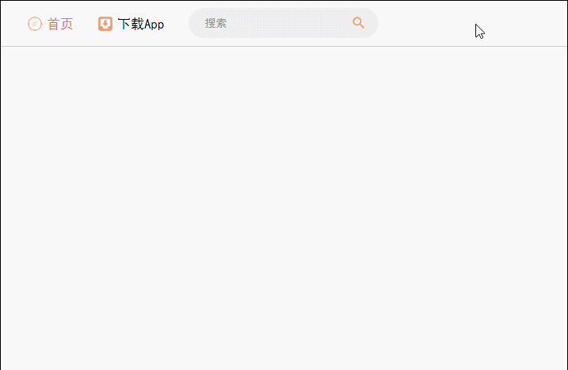

PS：由于页面逐渐增大，所以我们 header 中使用无状态组件已经满足不了我们要求了，我们需要将无状态组件改成正常的组件：

> src/common/header/index.js

<details>

  <summary>代码详情</summary>

```js
import React, { Component } from 'react';
import { connect } from 'react-redux';
import { CSSTransition } from 'react-transition-group';
import './index.css';
import { actionCreators } from './store';

import homeImage from '../../resources/img/header-home.png';

class Header extends Component {
  render() {
    return (
      <header>
        <div className="header_left">
          <a href="/">
            
          </a>
        </div>
        <div className="header_center">
          <div className="header_center-left">
            <div className="nav-item header_center-left-home">
              <i className="icon icon-home"></i>
              <span>首页</span>
            </div>
            <div className="nav-item header_center-left-download">
              <i className="icon icon-download"></i>
              <span>下载App</span>
            </div>
            <div className="nav-item header_center-left-search">
              <CSSTransition
                in={this.props.inputBlur}
                timeout={200}
                classNames="slide"
              >
                <input 
                  className={this.props.inputBlur ? 'input-nor-active' : 'input-active'}
                  placeholder="搜索"
                  onFocus={this.props.searchFocusOrBlur}
                  onBlur={this.props.searchFocusOrBlur}
                />
              </CSSTransition>
              <i className={this.props.inputBlur ? 'icon icon-search' : 'icon icon-search icon-active'}></i>
              <div className={this.props.inputBlur ? 'display-hide header_center-left-hot-search' : 'display-show header_center-left-hot-search'}>
                <div className="header_center-left-hot-search-title">
                  <span>热门搜索</span>
                  <span>
                    <i className="icon-change"></i>
                    <span>换一批</span>
                  </span>
                </div>
                <div className="header_center-left-hot-search-content">
                  <span>考研</span>
                  <span>慢死人</span>
                  <span>悦心</span>
                  <span>一致</span>
                  <span>是的</span>
                  <span>jsliang</span>
                </div>
              </div>
            </div>
          </div>
          <div className="header_center-right">
            <div className="nav-item header_right-center-setting">
              <span>Aa</span>
            </div>
            <div className="nav-item header_right-center-login">
              <span>登录</span>
            </div>
          </div>
        </div>
        <div className="header_right nav-item">
          <span className="header_right-register">注册</span>
          <span className="header_right-write nav-item">
            <i className="icon icon-write"></i>
            <span>写文章</span>
          </span>
        </div>
      </header>
    )
  }
}

const mapStateToProps = (state) => {
  return {
    inputBlur: state.get('header').get('inputBlur')
  }
}

const mapDispathToProps = (dispatch) => {
  return {
    searchFocusOrBlur() {
      dispatch(actionCreators.searchFocusOrBlur());
    }
  }
}

export default connect(mapStateToProps, mapDispathToProps)(Header);
```

</details>

**然后**，由于我们的数据是从接口模拟过来的，而在上一篇文章说过，如果要对接口代码进行管理，最好使用 Redux-Thunk 和 Redux-Saga，这里我们使用 Redux-Thunk：

1. 安装 redux-thunk：`cnpm i redux-thunk -S`
2. 安装 axios：`cnpm i axios -S`

在这里，我们要知道 create-react-app 的配置是包含 Node.js 的，所以我们可以依靠 Node.js 进行开发时候的 Mock 数据。

下面开始开发：

> src/store/index.js

<details>

  <summary>代码详情</summary>

```js
// 2. 引入 redux 的 applyMiddleware，进行多中间件的使用
import { createStore, compose, applyMiddleware } from 'redux';
// 1. 引入 redux-thunk
import thunk from 'redux-thunk';
import reducer from './reducer';

const composeEnhancers = window.__REDUX_DEVTOOLS_EXTENSION_COMPOSE__ || compose;

// 3. 通过 applyMiddleware 同时使用 redux-thunk 和 redux-dev-tools
const store = createStore(reducer, composeEnhancers(
  applyMiddleware(thunk)
));

export default store;
```

</details>

1. 引入 redux-thunk
2. 引入 redux 的 `applyMiddleware`，进行多中间件的使用
3. 通过 `applyMiddleware` 同时使用 redux-thunk 和 redux-dev-tools

这样，我们就可以正常使用 redux-thunk 了。

> 1. src/common/header/index.js

<details>

  <summary>代码详情</summary>

```js
import React, { Component } from 'react';
import { connect } from 'react-redux';
import { CSSTransition } from 'react-transition-group';
import './index.css';
import { actionCreators } from './store';

import homeImage from '../../resources/img/header-home.png';

class Header extends Component {
  render() {
    return (
      <header>
        <div className="header_left">
          <a href="/">
            
          </a>
        </div>
        <div className="header_center">
          <div className="header_center-left">
            <div className="nav-item header_center-left-home">
              <i className="icon icon-home"></i>
              <span>首页</span>
            </div>
            <div className="nav-item header_center-left-download">
              <i className="icon icon-download"></i>
              <span>下载App</span>
            </div>
            <div className="nav-item header_center-left-search">
              <CSSTransition
                in={this.props.inputBlur}
                timeout={200}
                classNames="slide"
              >
                <input 
                  className={this.props.inputBlur ? 'input-nor-active' : 'input-active'}
                  placeholder="搜索"
                  onFocus={this.props.searchFocusOrBlur}
                  onBlur={this.props.searchFocusOrBlur}
                />
              </CSSTransition>
              <i className={this.props.inputBlur ? 'icon icon-search' : 'icon icon-search icon-active'}></i>
              <div className={this.props.inputBlur ? 'display-hide header_center-left-hot-search' : 'display-show header_center-left-hot-search'}>
                <div className="header_center-left-hot-search-title">
                  <span>热门搜索</span>
                  <span>
                    <i className="icon-change"></i>
                    <span>换一批</span>
                  </span>
                </div>
                <div className="header_center-left-hot-search-content">
                  {/* 15. 遍历输出该数据 */}
                  {
                    this.props.list.map((item) => {
                      return <span key={item}>{item}</span>
                    })
                  }
                </div>
              </div>
            </div>
          </div>
          <div className="header_center-right">
            <div className="nav-item header_right-center-setting">
              <span>Aa</span>
            </div>
            <div className="nav-item header_right-center-login">
              <span>登录</span>
            </div>
          </div>
        </div>
        <div className="header_right nav-item">
          <span className="header_right-register">注册</span>
          <span className="header_right-write nav-item">
            <i className="icon icon-write"></i>
            <span>写文章</span>
          </span>
        </div>
      </header>
    )
  }
}

const mapStateToProps = (state) => {
  return {
    inputBlur: state.get('header').get('inputBlur'),
    // 14. 获取 reducer.js 中的 list 数据
    list: state.get('header').get('list')
  }
}

const mapDispathToProps = (dispatch) => {
  return {
    searchFocusOrBlur() {
      // 4. 派发 action 到 actionCreators.js 中的 getList() 方法
      dispatch(actionCreators.getList());
      dispatch(actionCreators.searchFocusOrBlur());
    }
  }
}

export default connect(mapStateToProps, mapDispathToProps)(Header);
```

</details>

> 2. src/common/header/store/actionCreators.js

<details>

  <summary>代码详情</summary>

```js
import * as actionTypes from './actionTypes'
// 7. 引入 axios
import axios from 'axios';
// 11. 引入 immutable 的类型转换
import { fromJS } from 'immutable';

export const searchFocusOrBlur = () => ({
  type: actionTypes.SEARCH_FOCUS_OR_BLUR
})

// 10. 定义 action，接受参数 data，同时因为我们使用了 Immutable，所以需要将获取的数据转换为 immutable 类型
const changeList = (data) => ({
  type: actionTypes.GET_LIST,
  data: fromJS(data)
})

// 5. 编写 getList 的 action，由于需要 actionTypes 中定义，所以前往 actionTypes.js 中新增
export const getList = () => {
  return (dispatch) => {
    // 8. 调用 create-react-app 中提供的 Node 服务器，从而 mock 数据
    axios.get('/api/headerList.json').then( (res) => {
      if(res.data.code === 0) {
        const data = res.data.list;
        // 由于数据太多，我们限制数据量为 15 先
        data.length = 15;
        // 12. 派发 changeList 类型
        dispatch(changeList(data));
      }
    }).catch( (error) => {
      console.log(error);
    });
  }
}
```

</details>

> 3. src/common/header/store/actionTypes.js

<details>

  <summary>代码详情</summary>

```js
export const SEARCH_FOCUS_OR_BLUR = 'header/search_focus_or_blur';
// 6. 新增 actionType
export const GET_LIST = 'header/get_list';
```

</details>

> 4. src/common/header/store/reducer.js

<details>

  <summary>代码详情</summary>

```js
import * as actionTypes from './actionTypes'
import { fromJS } from 'immutable';

const defaultState = fromJS({
  inputBlur: true,
  // 9. 给 header 下的 reducer.js 提供存储数据的地方
  list: []
});

export default (state = defaultState, action) => {
  if(action.type === actionTypes.SEARCH_FOCUS_OR_BLUR) {
    return state.set('inputBlur', !state.get('inputBlur'));
  }
  // 13. 判断 actionTypes 是否为 GET_LIST，如果是则执行该 action
  if(action.type === actionTypes.GET_LIST) {
    return state.set('list', action.data);
  }
  return state;
}
```

</details>

> 5. public/api/headerList.json

<details>

  <summary>代码详情</summary>

```js
{
  "code": 0,
  "list": ["区块链","小程序","vue","毕业","PHP","故事","flutter","理财","美食","投稿","手帐","书法","PPT","穿搭","打碗碗花","简书","姥姥的澎湖湾","设计","创业","交友","籽盐","教育","思维导图","疯哥哥","梅西","时间管理","golang","连载","自律","职场","考研","慢世人","悦欣","一纸vr","spring","eos","足球","程序员","林露含","彩铅","金融","木风杂谈","日更","成长","外婆是方言","docker"]
}
```

</details>

通过下面步骤：

4. 派发 `action` 到 actionCreators.js 中的 `getList()` 方法
5. 编写 `getList` 的 `action`，由于需要 `actionTypes` 中定义，所以前往 actionTypes.js 中新增
6. 新增 actionType
7. 引入 axios
8. 调用 create-react-app 中提供的 Node 服务器，从而 mock 数据
9. 给 header 下的 reducer.js 提供存储数据的地方
10. 定义 `action`，接受参数 `data`，同时因为我们使用了 Immutable，所以需要将获取的数据转换为 `immutable` 类型
11. 引入 Immutable 的类型转换
12. 派发 `changeList` 类型
13. 判断 `actionTypes` 是否为 `GET_LIST`，如果是则执行该 `action`
14. 获取 reducer.js 中的 `list` 数据
15. 遍历输出该数据

这样，我们就成功地获取了 mock 提供的数据：

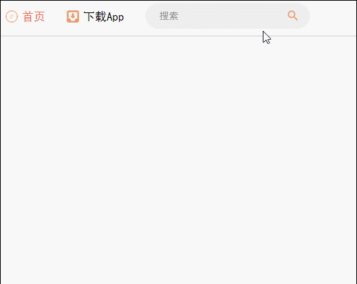

## <a name="chapter-fourteen" id="chapter-fourteen">十四 代码优化</a>

> [返回目录](#chapter-one)

* reducer.js 中使用 `switch...case...` 替换掉 `if...` 语句。

> src/common/header/store/reducer.js

<details>

  <summary>代码详情</summary>

```js
import * as actionTypes from './actionTypes'
import { fromJS } from 'immutable';

const defaultState = fromJS({
  inputBlur: true,
  list: []
});

export default (state = defaultState, action) => {
  switch(action.type) {
    case actionTypes.SEARCH_FOCUS_OR_BLUR:
      return state.set('inputBlur', !state.get('inputBlur'));
    case actionTypes.GET_LIST:
      return state.set('list', action.data);
    default:
      return state;
  }
}
```

</details>

## <a name="chapter-fifteen" id="chapter-fifteen">十五 解决历史遗留问题</a>

> [返回目录](#chapter-one)

在这里，我们解决下历史遗留问题：在我们失焦于输入框的时候，我们的【热门搜索】模块就会消失，从而看不到我们点击【换一换】按钮的效果，所以我们需要修改下代码，在我们鼠标在【热门模块】中时，这个模块不会消失，当我们鼠标失焦且鼠标不在热门模块中时，热门模块才消失。

> 1. src/common/header/store/reducer.js

<details>

  <summary>代码详情</summary>

```js
import * as actionTypes from './actionTypes'
import { fromJS } from 'immutable';

const defaultState = fromJS({
  inputFocus: false,
  // 1. 设置鼠标移动到热门模块为 false
  mouseInHot: false,
  list: [],
});

export default (state = defaultState, action) => {
  switch(action.type) {
    case actionTypes.SEARCH_FOCUS:
      return state.set('inputFocus', true);
    case actionTypes.SEARCH_BLUR:
      return state.set('inputFocus', false);
    case actionTypes.GET_LIST:
      return state.set('list', action.data);
    // 6. 在 reducer.js 中判断这两个 action 执行设置 mouseInHot
    case actionTypes.ON_MOUSE_ENTER_HOT:
      return state.set('mouseInHot', true);
    case actionTypes.ON_MOUSE_LEAVE_HOT:
      return state.set('mouseInHot', false);
    default:
      return state;
  }
}
```

</details>

> 2. src/common/header/index.js

<details>

  <summary>代码详情</summary>

```js
import React, { Component } from 'react';
import { connect } from 'react-redux';
import { CSSTransition } from 'react-transition-group';
import './index.css';
import { actionCreators } from './store';

import homeImage from '../../resources/img/header-home.png';

class Header extends Component {
  render() {
    return (
      <header>
        <div className="header_left">
          <a href="/">
            
          </a>
        </div>
        <div className="header_center">
          <div className="header_center-left">
            <div className="nav-item header_center-left-home">
              <i className="icon icon-home"></i>
              <span>首页</span>
            </div>
            <div className="nav-item header_center-left-download">
              <i className="icon icon-download"></i>
              <span>下载App</span>
            </div>
            <div className="nav-item header_center-left-search">
              <CSSTransition
                in={this.props.inputFocus}
                timeout={200}
                classNames="slide"
              >
                <input 
                  className={this.props.inputFocus ? 'input-active' : 'input-nor-active'}
                  placeholder="搜索"
                  onFocus={this.props.searchFocus}
                  onBlur={this.props.searchBlur}
                />
              </CSSTransition>
              <i className={this.props.inputFocus ? 'icon icon-search icon-active' : 'icon icon-search'}></i>
              {/* 8. 在判断中加多一个 this.props.mouseInHot，这样只要有一个为 true，它就不会消失 */}
              <div 
                className={this.props.inputFocus || this.props.mouseInHot ? 'display-show header_center-left-hot-search' : 'display-hide header_center-left-hot-search'}
                // 2. 设置移入为 onMouseEnterHot，移出为 onMouseLeaveHot
                onMouseEnter={this.props.onMouseEnterHot}
                onMouseLeave={this.props.onMouseLeaveHot}
              >
                <div className="header_center-left-hot-search-title">
                  <span>热门搜索</span>
                  <span>
                    <i className="icon-change"></i>
                    <span>换一批</span>
                  </span>
                </div>
                <div className="header_center-left-hot-search-content">
                  {
                    this.props.list.map((item) => {
                      return <span key={item}>{item}</span>
                    })
                  }
                </div>
              </div>
            </div>
          </div>
          <div className="header_center-right">
            <div className="nav-item header_right-center-setting">
              <span>Aa</span>
            </div>
            <div className="nav-item header_right-center-login">
              <span>登录</span>
            </div>
          </div>
        </div>
        <div className="header_right nav-item">
          <span className="header_right-register">注册</span>
          <span className="header_right-write nav-item">
            <i className="icon icon-write"></i>
            <span>写文章</span>
          </span>
        </div>
      </header>
    )
  }
}

const mapStateToProps = (state) => {
  return {
    inputFocus: state.get('header').get('inputFocus'),
    list: state.get('header').get('list'),
    // 7. 在 index.js 中获取
    mouseInHot: state.get('header').get('mouseInHot'),
  }
}

const mapDispathToProps = (dispatch) => {
  return {
    searchFocus() {
      dispatch(actionCreators.getList());
      dispatch(actionCreators.searchFocus());
    },
    searchBlur() {
      dispatch(actionCreators.searchBlur());
    },
    // 3. 定义 onMouseEnterHot 和 onMouseLeaveHot 方法
    onMouseEnterHot() {
      dispatch(actionCreators.onMouseEnterHot());
    },
    onMouseLeaveHot() {
      dispatch(actionCreators.onMouseLeaveHot());
    },
  }
}

export default connect(mapStateToProps, mapDispathToProps)(Header);
```

</details>

> 3. src/common/header/store/actionCreators.js

<details>

  <summary>代码详情</summary>

```js
import * as actionTypes from './actionTypes'
import axios from 'axios';
import { fromJS } from 'immutable';

export const searchFocus = () => ({
  type: actionTypes.SEARCH_FOCUS
})

export const searchBlur = () => ({
  type: actionTypes.SEARCH_BLUR
})

// 4. 在 actionCreators.js 中定义这两个方法：onMouseEnterHot 和 onMouseLeaveHot
export const onMouseEnterHot = () => ({
  type: actionTypes.ON_MOUSE_ENTER_HOT,
})

export const onMouseLeaveHot = () => ({
  type: actionTypes.ON_MOUSE_LEAVE_HOT,
})

export const getList = () => {
  return (dispatch) => {
    axios.get('/api/headerList.json').then( (res) => {
      if(res.data.code === 0) {
        const data = res.data.list;
        // 由于数据太多，我们限制数据量为 15 先
        data.length = 15;
        dispatch(changeList(data));
      }
    }).catch( (error) => {
      console.log(error);
    });
  }
}

const changeList = (data) => ({
  type: actionTypes.GET_LIST,
  data: fromJS(data)
})
```

</details>

> 4. src/common/header/store/actionTypes.js

<details>

  <summary>代码详情</summary>

```js
export const SEARCH_FOCUS = 'header/search_focus';
export const SEARCH_BLUR = 'header/search_blur';
export const GET_LIST = 'header/get_list';
// 5. 在 actionTypes.js 中新增 action 类型
export const ON_MOUSE_ENTER_HOT = 'header/on_mouse_enter_hot';
export const ON_MOUSE_LEAVE_HOT = 'header/on_mouse_leave_hot';
```

</details>

我们先看实现：

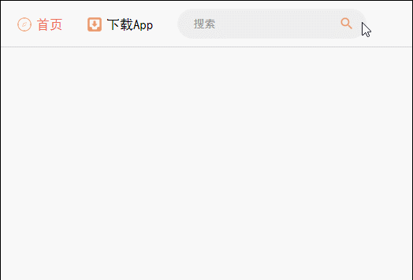

然后我们看看实现逻辑：

1. 在 reducer.js 中设置鼠标移动到热门模块为 `false`
2. 在 index.js 中设置移入为 `onMouseEnterHot`，移出为 `onMouseLeaveHot`
3. 在 index.js 中 `mapDispathToProps` 定义 `onMouseEnterHot` 和 `onMouseLeaveHot` 方法
4. 在 actionCreators.js 中定义这两个方法：`onMouseEnterHot` 和 `onMouseLeaveHot`
5. 在 actionTypes.js 中新增 `action` 类型
6. 在 reducer.js 中判断这两个 `action` 执行设置 `mouseInHot`
7. 在 index.js 中 `mapStateToProps` 获取 `mouseInHot`
8. 在 index.js 中的判断中加多一个 `this.props.mouseInHot`，这样只要有一个为 `true`，它就不会消失

> 注意：由于之前设置的 `this.props.inputFoucsOrBlur` 会造成聚焦和失焦都会调用一次接口，而且逻辑比较复杂，容易出错，所以这里我们进行了修改，将其分为聚焦和失焦两部分。

## <a name="chapter-sixteen" id="chapter-sixteen">十六 功能实现：换一换</a>

> [返回目录](#chapter-one)

下面我们开始做换一换功能：

> 1. src/common/header/store/reducer.js

<details>

  <summary>代码详情</summary>

```js
import * as actionTypes from './actionTypes'
import { fromJS } from 'immutable';

const defaultState = fromJS({
  inputFocus: false,
  mouseInHot: false,
  list: [],
  // 1. 在 reducer.js 中设置页数和总页数
  page: 1,
  totalPage: 1,
});

export default (state = defaultState, action) => {
  switch(action.type) {
    case actionTypes.SEARCH_FOCUS:
      return state.set('inputFocus', true);
    case actionTypes.SEARCH_BLUR:
      return state.set('inputFocus', false);
    case actionTypes.GET_LIST:
      // 4. 我们通过 merge 方法同时设置多个 state 值
      return state.merge({
        list: action.data,
        totalPage: action.totalPage
      });
    case actionTypes.ON_MOUSE_ENTER_HOT:
      return state.set('mouseInHot', true);
    case actionTypes.ON_MOUSE_LEAVE_HOT:
      return state.set('mouseInHot', false);
    // 11. 判断 action 类型，并进行设置
    case actionTypes.CHANGE_PAGE:
      return state.set('page', action.page + 1);
    default:
      return state;
  }
}
```

</details>

> 2. src/common/header/store/actionCreators.js

<details>

  <summary>代码详情</summary>

```js
import * as actionTypes from './actionTypes'
import axios from 'axios';
import { fromJS } from 'immutable';

export const searchFocus = () => ({
  type: actionTypes.SEARCH_FOCUS
})

export const searchBlur = () => ({
  type: actionTypes.SEARCH_BLUR
})

export const onMouseEnterHot = () => ({
  type: actionTypes.ON_MOUSE_ENTER_HOT,
})

export const onMouseLeaveHot = () => ({
  type: actionTypes.ON_MOUSE_LEAVE_HOT,
})

export const getList = () => {
  return (dispatch) => {
    axios.get('/api/headerList.json').then( (res) => {
      if(res.data.code === 0) {
        const data = res.data.list;
        // 2. 由于数据太多，我们之前限制数据量为 15，这里我们去掉该行代码
        // data.length = 15;
        dispatch(changeList(data));
      }
    }).catch( (error) => {
      console.log(error);
    });
  }
}

const changeList = (data) => ({
  type: actionTypes.GET_LIST,
  data: fromJS(data),
  // 3. 我们在这里计算总页数
  totalPage: Math.ceil(data.length / 10)
})

// 9. 定义 changePage 方法
export const changePage = (page) => ({
  type: actionTypes.CHANGE_PAGE,
  page: page,
})
```

</details>

> 3. src/common/header/index.js

<details>

  <summary>代码详情</summary>

```js
import React, { Component } from 'react';
import { connect } from 'react-redux';
import { CSSTransition } from 'react-transition-group';
import './index.css';
import { actionCreators } from './store';

import homeImage from '../../resources/img/header-home.png';

class Header extends Component {
  render() {
    return (
      <header>
        <div className="header_left">
          <a href="/">
            
          </a>
        </div>
        <div className="header_center">
          <div className="header_center-left">
            <div className="nav-item header_center-left-home">
              <i className="icon icon-home"></i>
              <span>首页</span>
            </div>
            <div className="nav-item header_center-left-download">
              <i className="icon icon-download"></i>
              <span>下载App</span>
            </div>
            <div className="nav-item header_center-left-search">
              <CSSTransition
                in={this.props.inputFocus}
                timeout={200}
                classNames="slide"
              >
                <input 
                  className={this.props.inputFocus ? 'input-active' : 'input-nor-active'}
                  placeholder="搜索"
                  onFocus={this.props.searchFocus}
                  onBlur={this.props.searchBlur}
                />
              </CSSTransition>
              <i className={this.props.inputFocus ? 'icon icon-search icon-active' : 'icon icon-search'}></i>
              <div 
                className={this.props.inputFocus || this.props.mouseInHot ? 'display-show header_center-left-hot-search' : 'display-hide header_center-left-hot-search'}
                onMouseEnter={this.props.onMouseEnterHot}
                onMouseLeave={this.props.onMouseLeaveHot}
              >
                <div className="header_center-left-hot-search-title">
                  <span>热门搜索</span>
                  {/* 7. 进行换页功能实现，传递参数 page 和 totalPage */}
                  <span onClick={() => this.props.changePage(this.props.page, this.props.totalPage)}>
                    <i className="icon-change"></i>
                    <span className="span-change">换一批</span>
                  </span>
                </div>
                <div className="header_center-left-hot-search-content">
                  {
                    // 6. 在 index.js 中进行计算：
                    // 一开始显示 0-9 共 10 条，换页的时候显示 10-19 ……以此类推
                    this.props.list.map((item, index) => {
                      if(index >= (this.props.page - 1) * 10 && index < this.props.page * 10) {
                        return <span key={item}>{item}</span>
                      } else {
                        return '';
                      }
                    })
                  }
                </div>
              </div>
            </div>
          </div>
          <div className="header_center-right">
            <div className="nav-item header_right-center-setting">
              <span>Aa</span>
            </div>
            <div className="nav-item header_right-center-login">
              <span>登录</span>
            </div>
          </div>
        </div>
        <div className="header_right nav-item">
          <span className="header_right-register">注册</span>
          <span className="header_right-write nav-item">
            <i className="icon icon-write"></i>
            <span>写文章</span>
          </span>
        </div>
      </header>
    )
  }
}

const mapStateToProps = (state) => {
  return {
    inputFocus: state.get('header').get('inputFocus'),
    list: state.get('header').get('list'),
    mouseInHot: state.get('header').get('mouseInHot'),
    // 5. 在 index.js 中 mapStateToProps 获取数据
    page: state.get('header').get('page'),
    totalPage: state.get('header').get('totalPage'),
  }
}

const mapDispathToProps = (dispatch) => {
  return {
    searchFocus() {
      dispatch(actionCreators.getList());
      dispatch(actionCreators.searchFocus());
    },
    searchBlur() {
      dispatch(actionCreators.searchBlur());
    },
    onMouseEnterHot() {
      dispatch(actionCreators.onMouseEnterHot());
    },
    onMouseLeaveHot() {
      dispatch(actionCreators.onMouseLeaveHot());
    },
    // 8. 调用 changePage 方法
    changePage(page, totalPage) {
      if(page === totalPage) {
        page = 1;
        dispatch(actionCreators.changePage(page));
      } else {
        dispatch(actionCreators.changePage(page));
      }
    }
  }
}

export default connect(mapStateToProps, mapDispathToProps)(Header);
```

</details>

> 4. src/common/header/store/actionTypes.js

<details>

  <summary>代码详情</summary>

```js
export const SEARCH_FOCUS = 'header/search_focus';
export const SEARCH_BLUR = 'header/search_blur';
export const GET_LIST = 'header/get_list';
export const ON_MOUSE_ENTER_HOT = 'header/on_mouse_enter_hot';
export const ON_MOUSE_LEAVE_HOT = 'header/on_mouse_leave_hot';
// 10. 定义 action 
export const CHANGE_PAGE = 'header/change_page';
```

</details>

此时我们代码思路是：

1. 在 reducer.js 中设置页数 `page` 和总页数 `totalPage`
2. 在 actionCreators.js 中，之前由于数据太多，我们之前限制数据量为 15，这里我们去掉该行代码
3. 在 actionCreators.js 这里计算总页数
4. 在 reducer.js 中通过 `merge` 方法同时设置多个 `state` 值
5. 在 index.js 中 `mapStateToProps` 获取数据
6. 在 index.js 中进行计算：一开始显示 0-9 共 10 条，换页的时候显示 10-19 ……以此类推
7. 在 index.js 中进行换页功能实现，传递参数 `page` 和 `totalPage`
8. 在 index.js 调用 `changePage` 方法，进行是否重置为第一页判断，并 `dispatch` 方法
9. 在 actionCreators.js 中定义 `changePage` 方法
10. 在 actionTypes.js 中定义 `action` 
11. 在 reducer.js 中判断 `action` 类型，并进行设置

如此，我们就实现了换一换功能：

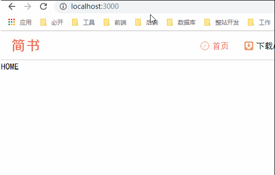

## <a name="chapter-seventeen" id="chapter-seventeen">十七 功能优化</a>

> [返回目录](#chapter-one)

### <a name="chapter-seventeen-one" id="chapter-seventeen-one">17.1 换一换图标旋转</a>

> [返回目录](#chapter-one)

> src/common/header/index.css

<details>

  <summary>代码详情</summary>

```css
header {
  width: 100%;
  height: 58px;
  display: flex;
  align-items: center;
  border-bottom: 1px solid #ccc;
  font-size: 17px;
}

/* 头部左边 */
.header_left-img {
  width: 100px;
  height: 56px;
}

/* 头部中间 */
.header_center {
  width: 1000px;
  margin: 0 auto;
  display: flex;
  justify-content: space-between;
}
.nav-item {
  margin-right: 30px;
  display: flex;
  align-items: center;
}

/* 头部中间左部 */
.header_center-left {
  display: flex;
}

/* 头部中间左部 - 首页 */
.header_center-left-home {
  color: #ea6f5a;
}

/* 头部中间左部 - 搜索框 */
.header_center-left-search {
  position: relative;
}
.slide-enter {
  transition: all .2s ease-out;
}
.slide-enter-active {
  width: 280px;
}
.slide-exit {
  transition: all .2s ease-out;
}
.silde-exit-active {
  width: 240px;
}
.header_center-left-search input {
  width: 240px;
  padding: 0 45px 0 20px;
  height: 38px;
  font-size: 14px;
  border: 1px solid #eee;
  border-radius: 40px;
  background: #eee;
}
.header_center-left-search .input-active {
  width: 280px;
}
.header_center-left-search .icon-search {
  position: absolute;
  top: 8px;
  right: 10px;
}
.header_center-left-search .icon-active {
  padding: 3px;
  top: 4px;
  border-radius: 15px;
  border: 1px solid #ea6f5a;
}

/* 头部中间左部 - 热搜 */
.header_center-left-search .icon-active:hover {
  cursor: pointer;
}
.header_center-left-hot-search:before {
  content: "";
  left: 27px;
  width: 10px;
  height: 10px;
  transform: rotate(45deg);
  top: -5px;
  z-index: -1;
  position: absolute;
  background-color: #fff;
  box-shadow: 0 0 8px rgba(0,0,0,.2);
}
.header_center-left-hot-search {
  position: absolute;
  width: 250px;
  left: 0;
  top: 125%;
  padding: 15px;
  font-size: 14px;
  background: #fff;
  border-radius: 4px;
  box-shadow: 0 0 8px rgba(0, 0, 0, 0.2);
}
.header_center-left-hot-search-title {
  display: flex;
  justify-content: space-between;
  color: #969696;
}
.header_center-left-hot-search-change {
  display: flex;
  justify-content: space-between;
  align-items: center;
}
.icon-change {
  display: inline-block;
  width: 20px;
  height: 14px;
  background: url('../../resources/img/icon-change.png') no-repeat center;
  background-size: 100%;
  /* 1. 在 index.css 中添加动画 */
  transition: all .2s ease-in;
  transform-origin: center center;
}
.icon-change:hover {
  cursor: pointer;
}
.span-change:hover {
  cursor: pointer;
}
.header_center-left-hot-search-content span {
  display: inline-block;
  margin-top: 10px;
  margin-right: 10px;
  padding: 2px 6px;
  font-size: 12px;
  color: #787878;
  border: 1px solid #ddd;
  border-radius: 3px;
}
.header_center-left-hot-search-content span:hover {
  cursor: pointer;
}

/* 头部中间右部 */
.header_center-right {
  display: flex;
  color: #969696;
}

/* 头部右边 */
.header_right-register, .header_right-write {
  width: 80px;
  text-align: center;
  height: 38px;
  line-height: 38px;
  border: 1px solid rgba(236,97,73,.7);
  border-radius: 20px;
  font-size: 15px;
  color: #ea6f5a;
  background-color: transparent;
}
.header_right-write {
  margin-left: 10px;
  padding-left: 10px;
  margin-right: 0px;
  color: #fff;
  background-color: #ea6f5a;
}
```

</details>

> src/common/header/index.js

<details>

  <summary>代码详情</summary>

```js
import React, { Component } from 'react';
import { connect } from 'react-redux';
import { CSSTransition } from 'react-transition-group';
import './index.css';
import { actionCreators } from './store';

import homeImage from '../../resources/img/header-home.png';

class Header extends Component {
  render() {
    return (
      <header>
        <div className="header_left">
          <a href="/">
            
          </a>
        </div>
        <div className="header_center">
          <div className="header_center-left">
            <div className="nav-item header_center-left-home">
              <i className="icon icon-home"></i>
              <span>首页</span>
            </div>
            <div className="nav-item header_center-left-download">
              <i className="icon icon-download"></i>
              <span>下载App</span>
            </div>
            <div className="nav-item header_center-left-search">
              <CSSTransition
                in={this.props.inputFocus}
                timeout={200}
                classNames="slide"
              >
                <input 
                  className={this.props.inputFocus ? 'input-active' : 'input-nor-active'}
                  placeholder="搜索"
                  onFocus={this.props.searchFocus}
                  onBlur={this.props.searchBlur}
                />
              </CSSTransition>
              <i className={this.props.inputFocus ? 'icon icon-search icon-active' : 'icon icon-search'}></i>
              <div 
                className={this.props.inputFocus || this.props.mouseInHot ? 'display-show header_center-left-hot-search' : 'display-hide header_center-left-hot-search'}
                onMouseEnter={this.props.onMouseEnterHot}
                onMouseLeave={this.props.onMouseLeaveHot}
              >
                <div className="header_center-left-hot-search-title">
                  <span>热门搜索</span>
                  {/* 2. 在 index.js 中给 i 标签添加 ref，并通过 changePage 方法传递过去 */}
                  <span onClick={() => this.props.changePage(this.props.page, this.props.totalPage, this.spinIcon)}>
                    <i className="icon-change" ref={(icon) => {this.spinIcon = icon}}></i>
                    <span className="span-change">换一批</span>
                  </span>
                </div>
                <div className="header_center-left-hot-search-content">
                  {
                    this.props.list.map((item, index) => {
                      if(index >= (this.props.page - 1) * 10 && index < this.props.page * 10) {
                        return <span key={item}>{item}</span>
                      } else {
                        return '';
                      }
                    })
                  }
                </div>
              </div>
            </div>
          </div>
          <div className="header_center-right">
            <div className="nav-item header_right-center-setting">
              <span>Aa</span>
            </div>
            <div className="nav-item header_right-center-login">
              <span>登录</span>
            </div>
          </div>
        </div>
        <div className="header_right nav-item">
          <span className="header_right-register">注册</span>
          <span className="header_right-write nav-item">
            <i className="icon icon-write"></i>
            <span>写文章</span>
          </span>
        </div>
      </header>
    )
  }
}

const mapStateToProps = (state) => {
  return {
    inputFocus: state.get('header').get('inputFocus'),
    list: state.get('header').get('list'),
    mouseInHot: state.get('header').get('mouseInHot'),
    page: state.get('header').get('page'),
    totalPage: state.get('header').get('totalPage'),
  }
}

const mapDispathToProps = (dispatch) => {
  return {
    searchFocus() {
      dispatch(actionCreators.getList());
      dispatch(actionCreators.searchFocus());
    },
    searchBlur() {
      dispatch(actionCreators.searchBlur());
    },
    onMouseEnterHot() {
      dispatch(actionCreators.onMouseEnterHot());
    },
    onMouseLeaveHot() {
      dispatch(actionCreators.onMouseLeaveHot());
    },
    changePage(page, totalPage, spinIcon) {
      // 3. 在 index.js 中设置它原生 DOM 的 CSS 属性
      if(spinIcon.style.transform === 'rotate(360deg)') {
        spinIcon.style.transform = 'rotate(0deg)';
      } else {
        spinIcon.style.transform = 'rotate(360deg)';
      }
      if(page === totalPage) {
        page = 1;
        dispatch(actionCreators.changePage(page));
      } else {
        dispatch(actionCreators.changePage(page));
      }
    }
  }
}

export default connect(mapStateToProps, mapDispathToProps)(Header);

```

</details>

这里我们通过三个步骤实现了图标旋转：

1. 在 index.css 中添加动画
2. 在 index.js 中给 `i` 标签添加 `ref`，并通过 `changePage` 方法传递过去
3. 在 index.js 中设置它原生 DOM 的 CSS 属性

实现效果如下：


### <a name="chapter-seventeen-two" id="chapter-seventeen-two">17.2 避免聚焦重复请求</a>

> [返回目录](#chapter-one)

在代码中，我们每次聚焦，都会请求数据，所以我们需要根据 `list` 的值来判断是否请求数据：

> src/common/header/index.js

<details>

  <summary>代码详情</summary>

```js
import React, { Component } from 'react';
import { connect } from 'react-redux';
import { CSSTransition } from 'react-transition-group';
import './index.css';
import { actionCreators } from './store';

import homeImage from '../../resources/img/header-home.png';

class Header extends Component {
  render() {
    return (
      <header>
        <div className="header_left">
          <a href="/">
            
          </a>
        </div>
        <div className="header_center">
          <div className="header_center-left">
            <div className="nav-item header_center-left-home">
              <i className="icon icon-home"></i>
              <span>首页</span>
            </div>
            <div className="nav-item header_center-left-download">
              <i className="icon icon-download"></i>
              <span>下载App</span>
            </div>
            <div className="nav-item header_center-left-search">
              <CSSTransition
                in={this.props.inputFocus}
                timeout={200}
                classNames="slide"
              >
                <input 
                  className={this.props.inputFocus ? 'input-active' : 'input-nor-active'}
                  placeholder="搜索"
                  // 1. 给 searchFocus 传递 list
                  onFocus={() => this.props.searchFocus(this.props.list)}
                  onBlur={this.props.searchBlur}
                />
              </CSSTransition>
              <i className={this.props.inputFocus ? 'icon icon-search icon-active' : 'icon icon-search'}></i>
              <div 
                className={this.props.inputFocus || this.props.mouseInHot ? 'display-show header_center-left-hot-search' : 'display-hide header_center-left-hot-search'}
                onMouseEnter={this.props.onMouseEnterHot}
                onMouseLeave={this.props.onMouseLeaveHot}
              >
                <div className="header_center-left-hot-search-title">
                  <span>热门搜索</span>
                  <span onClick={() => this.props.changePage(this.props.page, this.props.totalPage, this.spinIcon)}>
                    <i className="icon-change" ref={(icon) => {this.spinIcon = icon}}></i>
                    <span className="span-change">换一批</span>
                  </span>
                </div>
                <div className="header_center-left-hot-search-content">
                  {
                    this.props.list.map((item, index) => {
                      if(index >= (this.props.page - 1) * 10 && index < this.props.page * 10) {
                        return <span key={item}>{item}</span>
                      } else {
                        return '';
                      }
                    })
                  }
                </div>
              </div>
            </div>
          </div>
          <div className="header_center-right">
            <div className="nav-item header_right-center-setting">
              <span>Aa</span>
            </div>
            <div className="nav-item header_right-center-login">
              <span>登录</span>
            </div>
          </div>
        </div>
        <div className="header_right nav-item">
          <span className="header_right-register">注册</span>
          <span className="header_right-write nav-item">
            <i className="icon icon-write"></i>
            <span>写文章</span>
          </span>
        </div>
      </header>
    )
  }
}

const mapStateToProps = (state) => {
  return {
    inputFocus: state.get('header').get('inputFocus'),
    list: state.get('header').get('list'),
    mouseInHot: state.get('header').get('mouseInHot'),
    page: state.get('header').get('page'),
    totalPage: state.get('header').get('totalPage'),
  }
}

const mapDispathToProps = (dispatch) => {
  return {
    searchFocus(list) {
      // 2. 判断 list 的 size 是不是等于 0，是的话才请求数据（第一次），不是的话则不请求
      if(list.size === 0) {
        dispatch(actionCreators.getList());
      }
      dispatch(actionCreators.searchFocus());
    },
    searchBlur() {
      dispatch(actionCreators.searchBlur());
    },
    onMouseEnterHot() {
      dispatch(actionCreators.onMouseEnterHot());
    },
    onMouseLeaveHot() {
      dispatch(actionCreators.onMouseLeaveHot());
    },
    changePage(page, totalPage, spinIcon) {
      if(spinIcon.style.transform === 'rotate(360deg)') {
        spinIcon.style.transform = 'rotate(0deg)';
      } else {
        spinIcon.style.transform = 'rotate(360deg)';
      }
      if(page === totalPage) {
        page = 1;
        dispatch(actionCreators.changePage(page));
      } else {
        dispatch(actionCreators.changePage(page));
      }
    }
  }
}

export default connect(mapStateToProps, mapDispathToProps)(Header);

```

</details>

在这里，我们做了两个步骤：

1. 给 `searchFocus` 传递 `list`
2. 在 `searchFocus` 中判断 `list` 的 `size` 是不是等于 0，是的话才请求数据（第一次），不是的话则不请求

这样，我们就成功避免聚焦重复请求。

## <a name="chapter-eighteen" id="chapter-eighteen">十八 React 路由</a>

> [返回目录](#chapter-one)

### <a name="chapter-eighteen-one" id="chapter-eighteen-one">18.1 路由（一）</a>

> [返回目录](#chapter-one)

* 什么是路由？

前端路由就是根据 URL 的不同，显示不同的内容。

* 安装 React 的路由：`npm i react-router-dom -S`

安装完毕之后，我们只需要修改下 `src/App.js`，就可以体验到路由：

> src/App.js

<details>

  <summary>代码详情</summary>

```js
import React, { Component } from 'react';
import { Provider } from 'react-redux';
import Header from './common/header';
import store from './store';
// 1. 引入 React 路由的 BrowserRouter 和 Route
import { BrowserRouter, Route } from 'react-router-dom';

class App extends Component {
  render() {
    return (
      <Provider store={store} className="App">
        <Header />
        {/* 2. 在页面中使用 React 路由 */}
        <BrowserRouter>
          <Route path="/" exact render={() => <div>HOME</div>}></Route>
          <Route path="/detail" exact render={() => <div>DETAIL</div>}></Route>
        </BrowserRouter>
      </Provider>
    );
  }
}

export default App;
```

</details>

在这里我们仅需要做两个步骤：

1. 引入 React 路由的 `BrowserRouter` 和 `Route`
2. 在页面中使用 React 路由

这样，我们就实现了路由：


### <a name="chapter-eighteen-two" id="chapter-eighteen-two">18.2 路由（二）</a>

> [返回目录](#chapter-one)

1. 在 src 下新建 pages 文件夹，然后在该文件夹下新建文件夹和文件：
   1. src/pages/detail/index.js
   2. src/pages/home/index.js
2. 它们的内容如下：

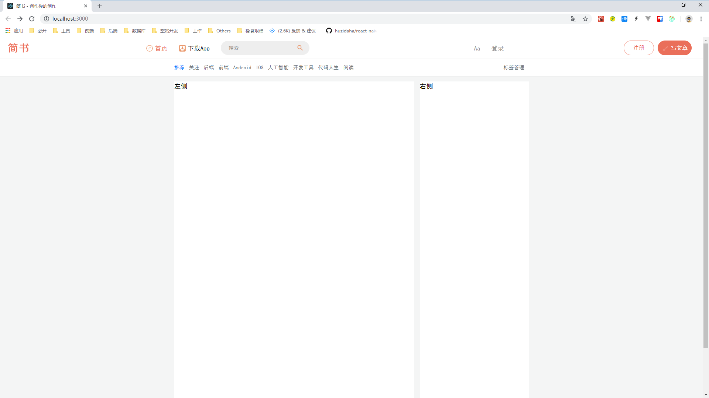

> src/pages/detail/index.js

<details>

  <summary>代码详情</summary>

```js
import React, { Component } from 'react'

class Detail extends Component {
  render() {
    return (
      <div>Detail</div>
    )
  }
}

export default Detail;
```

</details>

> src/pages/home/index.js

<details>

  <summary>代码详情</summary>

```js
import React, { Component } from 'react'

class Home extends Component {
  render() {
    return (
      <div>Home</div>
    )
  }
}

export default Home;
```

</details>

在有 header 的经验下，我们应该知道，我们希望在 URL 输入路径 `localhost:3000` 的时候，访问 home 组件；在输入 `localhost:3000/detail` 的时候，访问 detail 组件。

3. 到这步，我们仅需要修改下 `src/App.js`，就可以实现目标：

> src/App.js

<details>

  <summary>代码详情</summary>

```js
import React, { Component } from 'react';
import { Provider } from 'react-redux';
import Header from './common/header';
import store from './store';
import { BrowserRouter, Route } from 'react-router-dom';
// 1. 引入 Home、Detail 组件
import Home from './pages/home';
import Detail from './pages/detail';

class App extends Component {
  render() {
    return (
      <Provider store={store} className="App">
        <Header />
        <BrowserRouter>
          {/* 2. 在页面中引用组件 */}
          <Route path="/" exact component={Home}></Route>
          <Route path="/detail" exact component={Detail}></Route>
        </BrowserRouter>
      </Provider>
    );
  }
}

export default App;
```

</details>

现在，我们切换下路由，就可以看到不用的页面，这些页面我们也可以通过编辑对应的 index.js 来修改了。


## <a name="chapter-nighteen" id="chapter-nighteen">十九 页面实现：二级导航栏</a>

> [返回目录](#chapter-one)

由于前面有过编程经验了，所以在这里我们就不多说废话，直接进行实现。

> 「简书」因违反《网络安全法》《互联网信息服务管理办法》《互联网新闻信息服务管理规定》等相关法律法规，严重危害互联网信息传播秩序，根据网信主管部门要求，从 2019 年 4 月 13 日 0 时至 4 月 19 日 0 时，暂停更新 PC 端上的内容，并对所有平台上的内容进行全面彻底的整改。

没法，本来想根据简书的首页继续编写的，但是恰巧碰到简书出问题了，只好拿掘金的首页和详情页来实现了。


我们将掘金首页划分为 3 个模块：顶部 TopNav、左侧 LeftList、右侧 RightRecommend。所以我们在 home 下面新建个 components 目录，用来存放这三个组件。同时，在开发 common/header 的时候，我们也知道，还需要一个 store 文件夹，用来存放 reducer.js 等：

```shell
- pages
  - detail
    - index.js
  - home
    - components
      - LeftList.js
      - RightRecommend.js
      - TopNav.js
    - store
      - actionCreators.js
      - actionTypes.js
      - index.js
      - reducer.js
    - index.css
    - index.js
```

> 1. src/index.css

<details>

  <summary>代码详情</summary>

```css
body {
  background: #f4f5f5;
}
```

</details>

> 2. src/App.js

<details>

  <summary>代码详情</summary>

```js
import React, { Component } from 'react';
import { Provider } from 'react-redux';
import Header from './common/header';
import store from './store';
import { BrowserRouter, Route } from 'react-router-dom';
import Home from './pages/home';
import Detail from './pages/detail';

class App extends Component {
  render() {
    return (
      <Provider store={store} className="App">
        <Header />
        <BrowserRouter>
          <Route path="/" exact component={Home}></Route>
          <Route path="/detail" exact component={Detail}></Route>
        </BrowserRouter>
      </Provider>
    );
  }
}

export default App;
```

</details>

> 3. src/common/header/index.css

<details>

  <summary>代码详情</summary>

```css
header {
  position: fixed;
  top: 0;
  left: 0;
  width: 100%;
  height: 58px;
  display: flex;
  align-items: center;
  border-bottom: 1px solid #f1f1f1;
  font-size: 17px;
  background: #fff;
}

/* 头部左边 */
.header_left-img {
  width: 100px;
  height: 56px;
}

/* 头部中间 */
.header_center {
  width: 1000px;
  margin: 0 auto;
  display: flex;
  justify-content: space-between;
}
.nav-item {
  margin-right: 30px;
  display: flex;
  align-items: center;
}

/* 头部中间左部 */
.header_center-left {
  display: flex;
}

/* 头部中间左部 - 首页 */
.header_center-left-home {
  color: #ea6f5a;
}

/* 头部中间左部 - 搜索框 */
.header_center-left-search {
  position: relative;
}
.slide-enter {
  transition: all .2s ease-out;
}
.slide-enter-active {
  width: 280px;
}
.slide-exit {
  transition: all .2s ease-out;
}
.silde-exit-active {
  width: 240px;
}
.header_center-left-search {
  z-index: 999;
}
.header_center-left-search input {
  width: 240px;
  padding: 0 45px 0 20px;
  height: 38px;
  font-size: 14px;
  border: 1px solid #eee;
  border-radius: 40px;
  background: #eee;
}
.header_center-left-search .input-active {
  width: 280px;
}
.header_center-left-search .icon-search {
  position: absolute;
  top: 8px;
  right: 10px;
}
.header_center-left-search .icon-active {
  padding: 3px;
  top: 4px;
  border-radius: 15px;
  border: 1px solid #ea6f5a;
}

/* 头部中间左部 - 热搜 */
.header_center-left-search .icon-active:hover {
  cursor: pointer;
}
.header_center-left-hot-search:before {
  content: "";
  left: 27px;
  width: 10px;
  height: 10px;
  transform: rotate(45deg);
  top: -5px;
  z-index: -1;
  position: absolute;
  background-color: #fff;
  box-shadow: 0 0 8px rgba(0,0,0,.2);
}
.header_center-left-hot-search {
  position: absolute;
  width: 250px;
  left: 0;
  top: 125%;
  padding: 15px;
  font-size: 14px;
  background: #fff;
  border-radius: 4px;
  box-shadow: 0 0 8px rgba(0, 0, 0, 0.2);
}
.header_center-left-hot-search-title {
  display: flex;
  justify-content: space-between;
  color: #969696;
}
.header_center-left-hot-search-change {
  display: flex;
  justify-content: space-between;
  align-items: center;
}
.icon-change {
  display: inline-block;
  width: 20px;
  height: 14px;
  background: url('../../resources/img/icon-change.png') no-repeat center;
  background-size: 100%;
  transition: all .2s ease-in;
  transform-origin: center center;
}
.icon-change:hover {
  cursor: pointer;
}
.span-change:hover {
  cursor: pointer;
}
.header_center-left-hot-search-content span {
  display: inline-block;
  margin-top: 10px;
  margin-right: 10px;
  padding: 2px 6px;
  font-size: 12px;
  color: #787878;
  border: 1px solid #ddd;
  border-radius: 3px;
}
.header_center-left-hot-search-content span:hover {
  cursor: pointer;
}

/* 头部中间右部 */
.header_center-right {
  display: flex;
  color: #969696;
}

/* 头部右边 */
.header_right-register, .header_right-write {
  width: 80px;
  text-align: center;
  height: 38px;
  line-height: 38px;
  border: 1px solid rgba(236,97,73,.7);
  border-radius: 20px;
  font-size: 15px;
  color: #ea6f5a;
  background-color: transparent;
}
.header_right-write {
  margin-left: 10px;
  padding-left: 10px;
  margin-right: 0px;
  color: #fff;
  background-color: #ea6f5a;
}

```

</details>

> 4. src/pages/home/index.js

<details>

  <summary>代码详情</summary>

```js
import React, { Component } from 'react';
import LeftList from './components/LeftList';
import RightRecommend from './components/RightRecommend';
import TopNav from './components/TopNav';
import './index.css';

class Home extends Component {
  render() {
    return (
      <div className="container">
        <TopNav />
        <div className="main-container">
          <LeftList />
          <RightRecommend />
        </div>
      </div>
    )
  }
}

export default Home;
```

</details>

> 5. src/pages/home/index.css

<details>

  <summary>代码详情</summary>

```css
/* 主体 */
.container {
  width: 960px;
  margin: 0 auto;
}
.main-container {
  display: flex;
}

/* 顶部 */
.top-nav {
  position: fixed;
  left: 0;
  top: 59px;
  width: 100%;
  height: 46px;
  line-height: 46px;
  z-index: 100;
  box-shadow: 0 1px 2px 0 rgba(0,0,0,.05);
  font-size: 14px;
  background: #fff;
}
.top-nav-list {
  display: flex;
  width: 960px;
  margin: auto;
  position: relative;
}
.top-nav-list-item a {
  height: 100%;
  align-items: center;
  display: flex;
  flex-shrink: 0;
  color: #71777c;
  padding-right: 12px;
}
.active a {
  color: #007fff;
}
.top-nav-list-right {
  position: absolute;
  top: 0;
  right: 0;
}

/* 主内容 */
.main-container {
  margin-top: 120px;
}

/* 左侧 */
.left-list {
  width: 650px;
  height: 1000px;
  background: #fff;
}

/* 右侧 */
.right-recommend {
  width: 295px;
  height: 1000px;
  margin-left: 15px;
  background: #fff;
}
```

</details>

> 6. src/pages/home/components/TopNav.js

<details>

  <summary>代码详情</summary>

```js
import React, { Component } from 'react';
import { Link } from 'react-router-dom';

class TopNav extends Component {
  render() {
    return (
      <div className="top-nav">
        <ul className="top-nav-list">
          <li className="top-nav-list-item active">
            <Link to="tuijian">推荐</Link>
          </li>
          <li className="top-nav-list-item">
            <Link to="guanzhu">关注</Link>
          </li>
          <li className="top-nav-list-item">
            <Link to="houduan">后端</Link>
          </li>
          <li className="top-nav-list-item">
            <Link to="qianduan">前端</Link>
          </li>
          <li className="top-nav-list-item">
            <Link to="anzhuo">Android</Link>
          </li>
          <li className="top-nav-list-item">
            <Link to="ios">IOS</Link>
          </li>
          <li className="top-nav-list-item">
            <Link to="rengongzhineng">人工智能</Link>
          </li>
          <li className="top-nav-list-item">
            <Link to="kaifagongju">开发工具</Link>
          </li>
          <li className="top-nav-list-item">
            <Link to="daimarensheng">代码人生</Link>
          </li>
          <li className="top-nav-list-item">
            <Link to="yuedu">阅读</Link>
          </li>
          <li className="top-nav-list-item top-nav-list-right">
            <Link to="biaoqianguanli">标签管理</Link>
          </li>
        </ul>
      </div>
    )
  }
}

export default TopNav;
```

</details>

> 7. src/pages/home/components/LeftList.js

<details>

  <summary>代码详情</summary>

```js
import React, { Component } from 'react'

class LeftList extends Component {
  render() {
    return (
      <div className="left-list">
        左侧
      </div>
    )
  }
}

export default LeftList;
```

</details>

> 8. src/pages/home/components/RightRecommend.js

<details>

  <summary>代码详情</summary>

```js
import React, { Component } from 'react'

class RightRecommend extends Component {
  render() {
    return (
      <div className="right-recommend">
        右侧
      </div>
    )
  }
}

export default RightRecommend;
```

</details>

此时，页面显示为：


## <a name="chapter-twenty" id="chapter-twenty">二十 页面实现：首页</a>

> [返回目录](#chapter-one)

### <a name="chapter-twenty-one" id="chapter-twenty-one">20.1 多层级组件引用 store</a>

> [返回目录](#chapter-one)

在我们规划中，App 是主组件，下面有 header | home | detail，然后 home 下面有 LeftList | RightRecommend，那么 App/home/leftList 如何引用 store 呢？

> src/pages/home/components/LeftList.js

<details>

  <summary>代码详情</summary>

```js
import React, { Component } from 'react';
import { Link } from 'react-router-dom';
// 1. 在 LeftList 中引入 react-redux 的 connect
import { connect } from 'react-redux';
import { actionCreators } from '../store';

class LeftList extends Component {
  render() {
    return (
      <div className="left-list">
        <div className="left-list-top">
          <ul className="left-list-top-left">
            <li className="active">
              <Link to='remen'>热门</Link>
            </li>
            <span>|</span>
            <li>
              <Link to='zuixin'>最新</Link>
            </li>
            <span>|</span>
            <li>
              <Link to='pinglun'>评论</Link>
            </li>
          </ul>
          <ul className="left-list-top-right">
            <li>
              <Link to='benzhouzuire'>本周最热</Link>
            </li>
            ·
            <li>
              <Link to='benyuezuire'>本月最热</Link>
            </li>
            ·
            <li>
              <Link to='lishizuire'>历史最热</Link>
            </li>
          </ul>
        </div>
        <div className="left-list-container">
          {/* 5. 循环输出 props 里面的数据 */}
          {
            this.props.list.map((item) => {
              return (
                <div className="left-list-item" key={item.get('id')}>
                  <div className="left-list-item-tag">
                    <span className="hot">热</span>·
                    <span className="special">专栏</span>·
                    <span>
                      {
                        item.get('user').get('username')
                      }
                    </span>·
                    <span>一天前</span>·
                    <span>
                      {
                        item.get('tags').map((tagsItem, index) => {
                          if (index === 0) {
                            return tagsItem.get('title');
                          } else {
                            return null;
                          }
                        })
                      }
                    </span>
                  </div>
                  <h3 className="left-list-item-title">
                    <Link to="detail">{item.get('title')}</Link>
                  </h3>
                  <div className="left-list-item-interactive">
                    <span>{item.get('likeCount')}</span>
                    <span>{item.get('commentsCount')}</span>
                  </div>
                </div>
              )
            })
          }
        </div>
      </div>
    )
  }

  componentDidMount() {
    this.props.getLeftList();
  }
}

// 3. 在 LeftList 中定义 mapStateToProps
const mapStateToProps = (state) => {
  return {
    list: state.get('home').get('leftNav')
  }
};

// 4. 在 LeftList 中定义 mapDispathToProps
const mapDispathToProps = (dispatch) => {
  return {
    getLeftList() {
      dispatch(actionCreators.getLeftList());
    }
  }
};

// 2. 在 LeftList 中使用 connect
export default connect(mapStateToProps, mapDispathToProps)(LeftList);
```

</details>

### <a name="chapter-twenty-two" id="chapter-twenty-two">20.2 完善整个首页</a>

> [返回目录](#chapter-one)

当然，如果仅仅是运行上面的代码，你会发现它是报错的。

是的，因为它只是全部代码的一部分，所以需要你去完善它。当然，你也可以直接获取全部代码：

* [React 系列文章代码地址](https://github.com/LiangJunrong/React)

不管如何，你实现的最终成果如下所示：


## <a name="chapter-twentyone" id="chapter-twentyone">二十一 总结</a>

> [返回目录](#chapter-one)

写到这里，我们已经完成了一个首页的开发。

在这个开发中，我们学习到了非常多。

当然，后面 **jsliang** 自己也是偷懒了，慕课原视频中还有：

1. 加载更多功能实现
2. 跳转到顶部功能实现
3. 详情页开发
4. 登录页开发
5. 登录鉴权功能实现
6. 单页面异步加载组件（react-loadable）
7. ……

这里不一一列举了，因为 **jsliang** 感觉它们重复性很大，我们只需要在下一个项目中去实践，相信能获得更清晰的印象。（当然，前提是你跟 **jsliang** 一样有动力深入学习）

那么，到这里我们就宣布结束啦，我们下篇文章见！

---

> **jsliang** 广告推送：  
> 也许小伙伴想了解下云服务器  
> 或者小伙伴想买一台云服务器  
> 或者小伙伴需要续费云服务器  
> 欢迎点击 **[云服务器推广](https://github.com/LiangJunrong/document-library/blob/master/other-library/Monologue/%E7%A8%B3%E9%A3%9F%E8%89%B0%E9%9A%BE.md)** 查看！

[](https://promotion.aliyun.com/ntms/act/qwbk.html?userCode=w7hismrh)
[](https://cloud.tencent.com/redirect.php?redirect=1014&cps_key=49f647c99fce1a9f0b4e1eeb1be484c9&from=console)

> <a rel="license" href="http://creativecommons.org/licenses/by-nc-sa/4.0/"></a><br /><span xmlns:dct="http://purl.org/dc/terms/" property="dct:title">jsliang 的文档库</span> 由 <a xmlns:cc="http://creativecommons.org/ns#" href="https://github.com/LiangJunrong/document-library" property="cc:attributionName" rel="cc:attributionURL">梁峻荣</a> 采用 <a rel="license" href="http://creativecommons.org/licenses/by-nc-sa/4.0/">知识共享 署名-非商业性使用-相同方式共享 4.0 国际 许可协议</a>进行许可。<br />基于<a xmlns:dct="http://purl.org/dc/terms/" href="https://github.com/LiangJunrong/document-library" rel="dct:source">https://github.com/LiangJunrong/document-library</a>上的作品创作。<br />本许可协议授权之外的使用权限可以从 <a xmlns:cc="http://creativecommons.org/ns#" href="https://creativecommons.org/licenses/by-nc-sa/2.5/cn/" rel="cc:morePermissions">https://creativecommons.org/licenses/by-nc-sa/2.5/cn/</a> 处获得。