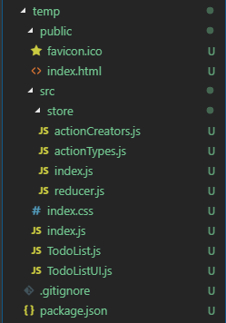
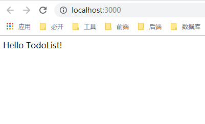
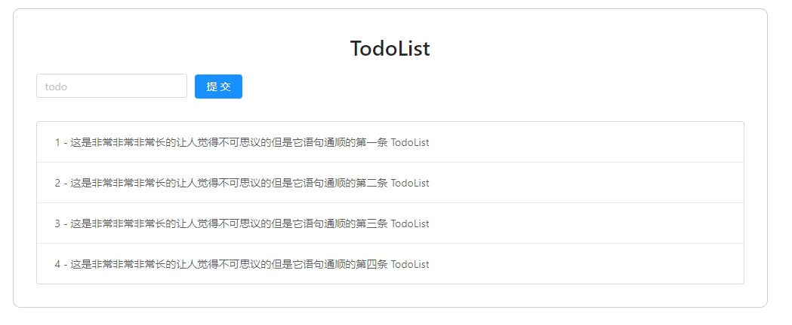
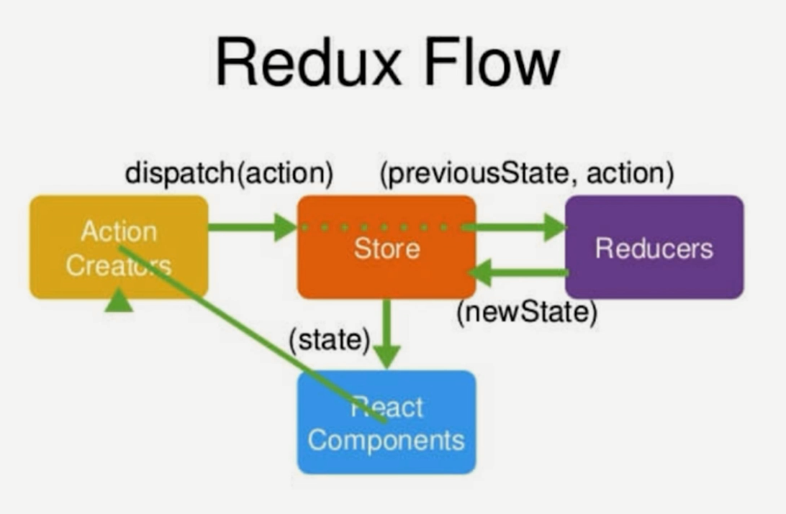
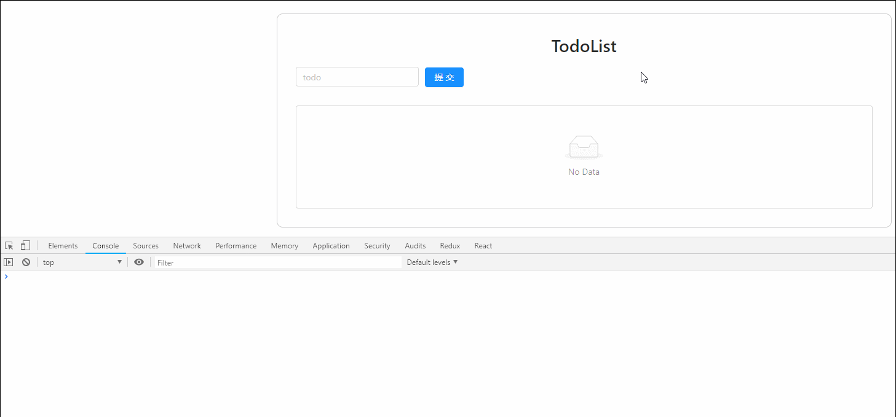
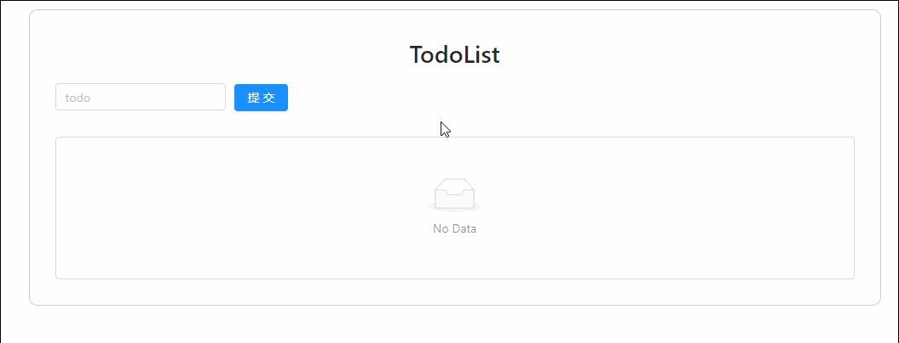
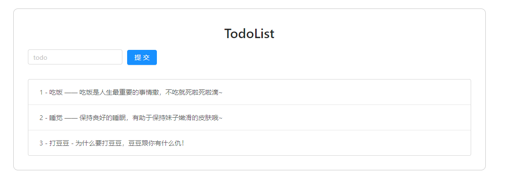
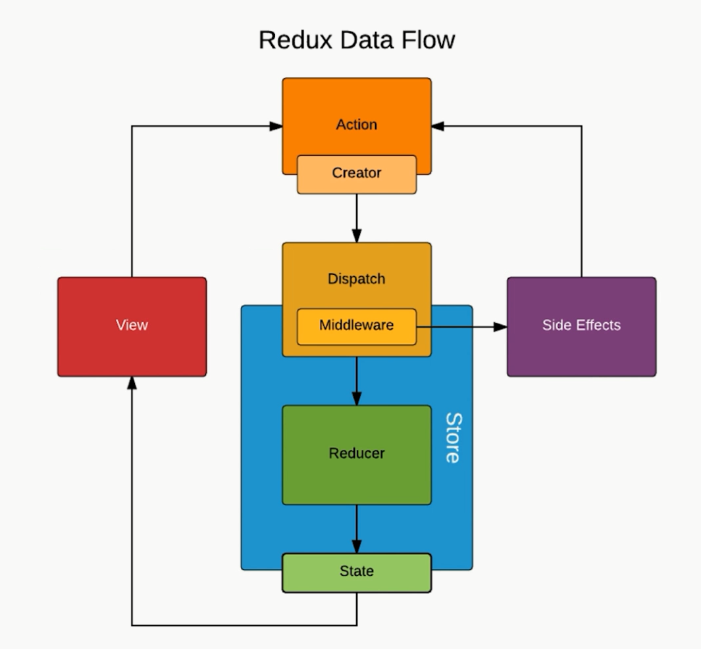

React Demo Two - TodoList 升级
===

> create by **jsliang** on **2019-3-26 09:26:53**   
> Recently revised in **2019-4-7 02:31:29**

**Hello 小伙伴们，如果觉得本文还不错，记得给个 **star** ， 小伙伴们的 **star** 是我持续更新的动力！[GitHub 地址](https://github.com/LiangJunrong/document-library/blob/master/JavaScript-library/React/ReactDemoTwo-TodoListUpgrade.md)**

* [React 系列文章代码地址](https://github.com/LiangJunrong/React)

## <a name="chapter-one" id="chapter-one">一 目录</a>

**不折腾的前端，和咸鱼有什么区别**

| 目录 |
| --- | 
| [一 目录](#chapter-one) | 
| <a name="catalog-chapter-two" id="catalog-chapter-two"></a>[二 前言](#chapter-two) |
| <a name="catalog-chapter-three" id="catalog-chapter-three"></a>[三 初始化项目](#chapter-three) |
| <a name="catalog-chapter-four" id="catalog-chapter-four"></a>[四 使用 Ant Design](#chapter-four) |
| <a name="catalog-chapter-five" id="catalog-chapter-five"></a>[五 使用 Redux](#chapter-five) |
| <a name="catalog-chapter-six" id="catalog-chapter-six"></a>[六 Redux 探索](#chapter-six) |
| &emsp;[6.1 Redux 插件](#chapter-six-one) |
| &emsp;[6.2 Redux 知识点讲解](#chapter-six-two) |
| <a name="catalog-chapter-seven" id="catalog-chapter-seven"></a>[七 Redux 探索](#chapter-seven) |
| &emsp;[7.1 Input 输入数据](#chapter-seven-one) |
| &emsp;[7.2 Button 提交数据](#chapter-seven-two) |
| &emsp;[7.3 删除 TodoItem 列表项](#chapter-seven-three) |
| <a name="catalog-chapter-eight" id="catalog-chapter-eight"></a>[八 优化：抽取 ActionType](#chapter-eight) |
| <a name="catalog-chapter-night" id="catalog-chapter-night"></a>[九 优化：抽取整个 action](#chapter-night) |
| <a name="catalog-chapter-ten" id="catalog-chapter-ten"></a>[十 优化：UI 组件和容器组件](#chapter-ten) |
| <a name="catalog-chapter-eleven" id="catalog-chapter-eleven"></a>[十一 优化：无状态组件](#chapter-eleven) |
| <a name="catalog-chapter-twelve" id="catalog-chapter-twelve"></a>[十二 结尾：调用 Axios，Redux-Base 完成](#chapter-twelve) |
| <a name="catalog-chapter-thirteen" id="catalog-chapter-thirteen"></a>[十三 进阶：Redux 中间件](#chapter-thirteen) |
| <a name="catalog-chapter-fourteen" id="catalog-chapter-fourteen"></a>[十四 进阶：Redux-Thunk 中间件进行 ajax 请求管理](#chapter-fourteen) |
| <a name="catalog-chapter-fifteen" id="catalog-chapter-fifteen"></a>[十五 进阶：Redux-Saga 中间件进行 Ajax 请求管理](#chapter-fifteen) |
| <a name="catalog-chapter-sixteen" id="catalog-chapter-sixteen"></a>[十六 进阶：React-Redux](#chapter-sixteen) |
| <a name="catalog-chapter-seventeen" id="catalog-chapter-seventeen"></a>[十七 总结](#chapter-seventeen) |

## <a name="chapter-two" id="chapter-two">二 前言</a>

> [返回目录](#chapter-one)

**声明：该系列文章主要参考慕课网的 React 实战视频，并结合个人理解进行编写：**

* [《React 16.4 开发简书项目从零基础入门到实战》](https://coding.imooc.com/class/229.html)

本次 Demo 基于 ReactDemoOne 进行了 Redux 的升级，同时会讲解到中间件 Redux-Thunk 以及 Redux-Saga，最终会使用 React-Redux 进行项目重构。

所以，没有看第一篇的小伙伴可以查看：

* [React Demo One - TodoList](https://github.com/LiangJunrong/document-library/blob/master/JavaScript-library/React/ReactDemoOne-TodoList.md)

如果小伙伴想对照这源码一起看文章，可以前往下面地址下载：

* [React 系列源码地址](https://github.com/LiangJunrong/React)

注意，本文代码在 TodoListUpgrade 目录，并且它四个文件夹，分别对应：

* Redux-Base —— 记录 Redux 基础内容
* Redux-Thunk —— 在 Redux-Base 基础上进行 `redux-thunk` 的中间件配置
* Redux-Saga —— 在 Redux-Base 基础上进行 `redux-saga` 的中间件配置
* React-Redux —— 对 TodoList 进行 `react-redux` 重新改造

Redux-Base 项目最终目录如下，小伙伴可以先创建空文件放着，后续将使用到：



## <a name="chapter-three" id="chapter-three">三 初始化项目</a>

> [返回目录](#chapter-one)

获取 [React 系列](https://github.com/LiangJunrong/React) 中 Simpify 目录中的代码，将其 Copy 到 Redux-Base 中，并将 App 修改为 TodoList，进行 TodoList 小改造。

下面我们开始修改：

> 1. src/index.js

<details>

  <summary>代码详情</summary>

```js
import React from 'react';
import ReactDOM from 'react-dom';
import TodoList from './TodoList';

ReactDOM.render(<TodoList />, document.getElementById('root'));
```

</details>

> 2. src/~~App.js~~ TodoList.js

<details>

  <summary>代码详情</summary>

```js
import React, { Component } from 'react';
import './index.css';

class TodoList extends Component {
  render() {
    return (
      <div className="App">
        Hello TodoList!
      </div>
    );
  }
}

export default TodoList;
```

</details>

> 3. src/index.css

<details>

  <summary>代码详情</summary>

```css
/* 尚未进行编写 */
```

</details>

此时我们在终端运行 `npm run start`，显示结果为：



## <a name="chapter-four" id="chapter-four">四 使用 Ant Design</a>

> [返回目录](#chapter-one)

* Ant Design 官网：https://ant.design/index-cn

下面开始在 TodoList 项目中使用 Ant Design：

* 安装：`npm i antd -S`
* 使用：

> 1. src/TodoList.js

<details>

  <summary>代码详情</summary>

```js
import React, { Component } from 'react'; // 引入 React 及其 Component
import './index.css'; // 引入 index.css
import { Input, Button, List } from 'antd'; // 1. 引入 antd 的列表
import 'antd/dist/antd.css'; // 2. 引入 antd 的样式

// 3. 定义数据
const data = [
  '这是非常非常非常长的让人觉得不可思议的但是它语句通顺的第一条 TodoList',
  '这是非常非常非常长的让人觉得不可思议的但是它语句通顺的第二条 TodoList',
  '这是非常非常非常长的让人觉得不可思议的但是它语句通顺的第三条 TodoList',
  '这是非常非常非常长的让人觉得不可思议的但是它语句通顺的第四条 TodoList',
];

class TodoList extends Component {
  render() {
    return (
      <div className="todo">
        <div className="todo-title">
          <h1>TodoList</h1>
        </div>
        {/* 4. 使用 Input、Button 组件 */}
        <div className="todo-action">
          <Input placeholder='todo' className="todo-input" />
          <Button type="primary" className="todo-submit">提交</Button>
        </div>
        {/* 5. 使用 List 组件 */}
        <div className="todo-list">
          <List
            size="large"
            bordered
            dataSource={data}
            renderItem={(item, index) => (<List.Item>{index + 1} - {item}</List.Item>)}
          />
        </div>
      </div>
    );
  }
}

export default TodoList;
```

</details>

> 2. src/index.css

<details>

  <summary>代码详情</summary>

```css
.todo {
  width: 1000px;
  margin: 20px auto 0;
  padding: 30px;
  border: 1px solid #ccc;
  border-radius: 10px;
}
.todo-title {
  text-align: center;
}
.todo-action .todo-input {
  width: 200px;
}
.todo-action .todo-submit {
  margin-left: 10px;
}
.todo-list {
  margin-top: 30px;
}
```

</details>

在这里，我们引用 Ant Design 的步骤大致为：

1. 引入 antd 的 Input、Button、List 组件
2. 引入 antd 的样式
3. 定义数据
4. 使用 Input、Button 组件
5. 使用 List 组件

此时页面显示为：



## <a name="chapter-five" id="chapter-five">五 使用 Redux</a>

> [返回目录](#chapter-one)

我觉得有必要在讲解 Redux 之前，我们先使用 Redux 体验一下：

* 安装 Redux：`npm i redux -S`
* 下面我们按照 Redux 的使用方法先试试：

> 在 src 目录下创建 store 目录用来存储 Redux 数据，该目录下有 reducer.js 以及 index.js 两个文件

**首先**，我们编写 reducer.js 文件，该文件的作用是定义并处理数据：

> 1. src/store/reducer.js

<details>

  <summary>代码详情</summary>

```js
// 1. 我们定义一个数据 defaultState
const defaultState = {
  inputValue: '',
  todoList: [
    '这是非常非常非常长的让人觉得不可思议的但是它语句通顺的第一条 TodoList',
    '这是非常非常非常长的让人觉得不可思议的但是它语句通顺的第二条 TodoList',
    '这是非常非常非常长的让人觉得不可思议的但是它语句通顺的第三条 TodoList',
    '这是非常非常非常长的让人觉得不可思议的但是它语句通顺的第四条 TodoList',
  ]
}

// 2. 我们将数据 defaultState 最终以 state 形式导出去
export default (state = defaultState, action) => {
  return state;
}
```

</details>

**然后**，我们编写 index.js 文件，该文件的作用是通过 createStore 方法创建数据仓库并导出去给 TodoList.js 使用。

> 2. src/store/index.js

<details>

  <summary>代码详情</summary>

```js
import { createStore } from 'redux'; // 3. 我们引用 redux 这个库中的 createStore
import reducer from './reducer'; // 4. 我们引用 reducer.js 中导出的数据

// 5. 我们通过 redux 提供的方法 reducer 来构建一个数据存储仓库
const store = createStore(reducer);

// 6. 我们将 store 导出去
export default store;
```

</details>

**最后**，我们在 TodoList.js 中引用 store/index.js 并到列表中进行使用，以及打印出来 store 传递给我们的数据：

> 3. src/TodoList.js

<details>

  <summary>代码详情</summary>

```js
import React, { Component } from 'react'; // 引入 React 及其 Component
import './index.css'; // 引入 index.css
import { Input, Button, List } from 'antd'; // 引入 antd 的组件
import 'antd/dist/antd.css'; // 引入 antd 的样式
import store from './store'; // 7. 引入 store，你可以理解为 store 提供数据。./store 是 ./store/index.js 的缩写

class TodoList extends Component {

  // 8. 在 constructor 中通过 store.getState() 方法来获取数据，并赋值为 state
  constructor(props) {
    super(props);
    // 9. 我们尝试在 Console 中打印 store.getState()
    console.log(store.getState());
    this.state = store.getState();
  }

  render() {
    return (
      <div className="todo">
        <div className="todo-title">
          <h1>TodoList</h1>
        </div>
        {/* 使用 Input、Button 组件 */}
        <div className="todo-action">
          <Input placeholder='todo' className="todo-input" />
          <Button type="primary" className="todo-submit">提交</Button>
        </div>
        {/* 使用 List 组件 */}
        {/* 10. 将原先的 data 换成 state 中的 todoList */}
        <div className="todo-list">
          <List
            size="large"
            bordered
            dataSource={this.state.todoList}
            renderItem={(item, index) => (<List.Item>{index + 1} - {item}</List.Item>)}
          />
        </div>
      </div>
    );
  }
}

export default TodoList;
```

</details>

这时候，我们查看 Chrome 控制台和页面，发现它的确起作用了：


这样我们就完成了 Redux 中数据的【查询】，那么我们如何【修改】 Redux 中的数据，以及 Redux 是什么呢？我们一一道来。

## <a name="chapter-six" id="chapter-six">六 Redux 探索</a>

> [返回目录](#chapter-one)

* **Redux 官网**：[链接](https://redux.js.org/)
* **Redux 中文小册**：[链接](https://www.redux.org.cn/)

> 如果小伙伴觉得自己看小册或者官网理解比较通透，请自行查阅，下面观点仅供参考。

### <a name="chapter-six-one" id="chapter-six-one">6.1 Redux 插件</a>

> [返回目录](#chapter-one)

1. 安装：科学上网找到对应的 Chrome 插件，或者百度下载一个，或者通过 `npm install --save-dev redux-devtools` 安装它的开发者工具。
2. 使用：
   1. 关闭浏览器，并重新打开，再打开控制台（F12），进入 Redux 栏，提示你尚未安装代码
   2. 前往 index.js 安装代码。
   3. 查看 state 中发现存有数据，此时 Redux 插件安装完毕。

> src/store/index.js

<details>

  <summary>代码详情</summary>

```js
import { createStore } from 'redux';
import reducer from './reducer';

// 如果安装了 Redux 工具，则在这里可以直接使用该工具
const store = createStore(
  reducer,
  window.__REDUX_DEVTOOLS_EXTENSION__ && window.__REDUX_DEVTOOLS_EXTENSION__()
);

export default store;
```

</details>

### <a name="chapter-six-two" id="chapter-six-two">6.2 Redux 知识点讲解</a>

> [返回目录](#chapter-one)


由于 React 关于自身的定义：“用于构建用户界面的 JavaScript 库”。

所以，当我们在 React 中，如果兄弟组件需要通讯，例如上图中左侧的深色圆圈发送数据到顶部（第一排）的圆圈，我们就需要兜很多弯子，导致数据通讯非常麻烦。

而 Redux 的出现，是为了弥补这种麻烦的通讯方式：建立起一个中央机制，方便各组件之间的通讯。从而就有了上图中右侧的调度方式。

那么，Redux 是怎么个运行/工作机制呢？我们通过下面图片进行分析：



在上面图中，我们假设：

* 蓝色（React Component）：借书人
* 黄色（Action Creators）：借书动作
* 橙色（Store）：图书管理员
* 紫色（Reducers）：系统

它的流程可以理解为：首先借书人走到前台（借书动作）跟图书管理员申请借书，图书管理员帮它在系统中查找书籍资料，然后拿到电脑返回信息，最后告诉他去哪借/怎么使用。

换回正常话，即：当组件（React Components）需要调用数据的时候，它就向创造器（Action Creators）发起请求，创造器通知管理者（Store），管理者就去查找相关资料（Reducers），拿到返回的信息后，再告诉组件。

而在这过程中，我们会使用到 Redux 的一些常用/核心 API：

1. `createStore`：创建 store
2. `store.dispatch`：派发 action
3. `store.getState`：获取 store 所有数据内容
4. `store.subscribe`：监控 store 改变，store 改变了该方法就会被执行

下面我们通过 Input 输入数据、Button 提交数据以及删除 TodoItem 列表项进一步讲解上面知识点。

## <a name="chapter-seven" id="chapter-seven">七 Redux 数据修改</a>

> [返回目录](#chapter-one)

现在开始通过 Input 输入数据、Button 提交数据以及删除 TodoItem 列表项讲解 Redux 数据修改。

### <a name="chapter-seven-one" id="chapter-seven-one">7.1 Input 输入数据</a>

> [返回目录](#chapter-one)

> 1. src/TodoList.js

<details>

  <summary>代码详情</summary>

```js
import React, { Component } from 'react'; // 引入 React 及其 Component
import './index.css'; // 引入 index.css
import { Input, Button, List } from 'antd'; // 引入 antd 的组件
import 'antd/dist/antd.css'; // 引入 antd 的样式
import store from './store'; // 引入 store，你可以理解为 store 提供数据。./store 是 ./store/index.js 的缩写

class TodoList extends Component {

  // 在 constructor 中通过 store.getState() 方法来获取数据，并赋值为 state
  constructor(props) {
    super(props);
    // 我们尝试在 Console 中打印 store.getState()
    // console.log(store.getState());
    this.state = store.getState();
    
    // 2. 定义 handleInputChange
    this.handleInputChange = this.handleInputChange.bind(this);

    // 7. 绑定方法 handleStoreChange 来处理 Redux 返回回来的数据
    this.handleStoreChange = this.handleStoreChange.bind(this);
    store.subscribe(this.handleStoreChange);
  }

  render() {
    return (
      <div className="todo">
        <div className="todo-title">
          <h1>TodoList</h1>
        </div>
        {/* 使用 Input、Button 组件 */}
        <div className="todo-action">
          {/* 1. Input 绑定 handleInputChange 事件 */}
          <Input 
            placeholder='todo' 
            className="todo-input" 
            value={this.state.inputValue}
            onChange={this.handleInputChange}
          />
          <Button 
            type="primary" 
            className="todo-submit"
          >
            提交
          </Button>
        </div>
        {/* 使用 List 组件 */}
        {/* 将原先的 data 换成 state 中的 todoList */}
        <div className="todo-list">
          <List
            size="large"
            bordered
            dataSource={this.state.todoList}
            renderItem={(item, index) => (<List.Item>{index + 1} - {item}</List.Item>)}
          />
        </div>
      </div>
    );
  }

  // 3. 编写 handleInputChange
  handleInputChange(e) {
    // 4. 通过 action，将数据传递给 store
    const action = {
      type: 'change_input_value',
      value: e.target.value
    }
    store.dispatch(action);
  }

  // 8. 在 handleStoreChange 中处理数据
  handleStoreChange() {
    this.setState(store.getState());
  }

}

export default TodoList;
```

</details>

> 2. src/store/reducer.js

<details>

  <summary>代码详情</summary>

```js
// 定义一个数据 defaultState
const defaultState = {
  inputValue: '',
  todoList: [
    // '这是非常非常非常长的让人觉得不可思议的但是它语句通顺的第一条 TodoList',
    // '这是非常非常非常长的让人觉得不可思议的但是它语句通顺的第二条 TodoList',
    // '这是非常非常非常长的让人觉得不可思议的但是它语句通顺的第三条 TodoList',
    // '这是非常非常非常长的让人觉得不可思议的但是它语句通顺的第四条 TodoList',
  ]
}

// 将数据 defaultState 最终以 state 形式导出去
export default (state = defaultState, action) => {
  // 5. 打印 state 和 action
  console.log(state);
  console.log(action);

  // 6. 在 reducer.js 中获取数据，并 return 回去处理结果
  if(action.type === 'change_input_value') {
    const newState = JSON.parse(JSON.stringify(state));
    newState.inputValue = action.value;
    return newState
  }
  
  return state;
}
```

</details>

此时，我们打开控制台，一边在 Input 输入框输入内容，一边查看 Console 输出，会发现：



现在我们来分析下（或者小伙伴看着代码的备注理解下），我们修改代码的时候做了什么：

1. 在 Input 组件中，我们为其 `onChange` 时绑定 `handleInputChange` 事件。
2. 定义 `handleInputChange` 方法。
3. 编写 `handleInputChange` 方法。
4. 我们在 `handleInputChange` 中编写 `action`，通过 `dispatch` 将 `action` 从 TodoList.js 传递给 Redux 中的 reducer.js。
5. 在 reducer.js 中打印 `state` 和 `action`。
6. Redux 在 reducer.js 中接收到 `state` 和 `action`，然后我们将新的 `newState` 返回回去（先返回到 src/store/index.js，再返回到 src/TodoList.js），期望 TodoList.js 能接受到反馈。
7. 在 TodoList 的 `constructor` 中通过 `store.subscribe` 绑定处理 Redux 传回来的数据的处理方法 `handleStoreChange`。
8. 在 `handleStoreChange` 中，我们直接 `setState` Redux 返回的 state，即 `store.getState()`。

这时候，我们再查看章节 6.2 的 Redux 知识点讲解，就会发现知识点通畅了。

* 前往：[6.2 Redux 知识点讲解](#chapter-six-two)

> 参考：计数器

<details>

  <summary>代码详情</summary>

```js
import { createStore } from 'redux';

/**
 * 这是一个 reducer，形式为 (state, action) => state 的纯函数。
 * 描述了 action 如何把 state 转变成下一个 state。
 *
 * state 的形式取决于你，可以是基本类型、数组、对象、
 * 甚至是 Immutable.js 生成的数据结构。惟一的要点是
 * 当 state 变化时需要返回全新的对象，而不是修改传入的参数。
 *
 * 下面例子使用 `switch` 语句和字符串来做判断，但你可以写帮助类(helper)
 * 根据不同的约定（如方法映射）来判断，只要适用你的项目即可。
 */
function counter(state = 0, action) {
  switch (action.type) {
  case 'INCREMENT':
    return state + 1;
  case 'DECREMENT':
    return state - 1;
  default:
    return state;
  }
}

// 创建 Redux store 来存放应用的状态。
// API 是 { subscribe, dispatch, getState }。
let store = createStore(counter);

// 可以手动订阅更新，也可以事件绑定到视图层。
store.subscribe(() =>
  console.log(store.getState())
);

// 改变内部 state 惟一方法是 dispatch 一个 action。
// action 可以被序列化，用日记记录和储存下来，后期还可以以回放的方式执行
store.dispatch({ type: 'INCREMENT' });
// 1
store.dispatch({ type: 'INCREMENT' });
// 2
store.dispatch({ type: 'DECREMENT' });
// 1
```

</details>

### <a name="chapter-seven-two" id="chapter-seven-two">7.2 Button 提交数据</a>

> [返回目录](#chapter-one)

下面，我们为 Input 提供回车事件，以及使用 Button 的提交事件，小伙伴们可以参照 Input 的输入事件，先自行编写，写完再查看这个章节收获会更大。

> src/TodoList.js

<details>

  <summary>代码详情</summary>

```js
import React, { Component } from 'react'; // 引入 React 及其 Component
import './index.css'; // 引入 index.css
import { Input, Button, List } from 'antd'; // 引入 antd 的组件
import 'antd/dist/antd.css'; // 引入 antd 的样式
import store from './store'; // 引入 store，你可以理解为 store 提供数据。./store 是 ./store/index.js 的缩写

class TodoList extends Component {

  // 在 constructor 中通过 store.getState() 方法来获取数据，并赋值为 state
  constructor(props) {
    super(props);
    // 我们尝试在 Console 中打印 store.getState()
    // console.log(store.getState());
    this.state = store.getState();
    
    // 处理 handleInputChange 方法
    this.handleInputChange = this.handleInputChange.bind(this);

    // 绑定方法 handleStoreChange 来处理 Redux 返回回来的数据
    this.handleStoreChange = this.handleStoreChange.bind(this);
    store.subscribe(this.handleStoreChange);

    // 2. 处理 handleAddItem 方法
    this.handleAddItem = this.handleAddItem.bind(this);

    // 7. 处理 handleInputKeyUp 方法
    this.handleInputKeyUp = this.handleInputKeyUp.bind(this);
  }

  render() {
    return (
      <div className="todo">
        <div className="todo-title">
          <h1>TodoList</h1>
        </div>
        {/* 使用 Input、Button 组件 */}
        <div className="todo-action">
          {/* Input 绑定 handleInputChange 事件 */}
          {/* 6. Input 绑定回车事件：handleInputKeyUp */}
          <Input 
            placeholder='todo' 
            className="todo-input" 
            value={this.state.inputValue}
            onChange={this.handleInputChange}
            onKeyUp={this.handleInputKeyUp}
          />
          {/* 1. 为 Button 定义点击执行 handleAddItem 方法 */}
          <Button 
            type="primary" 
            className="todo-submit"
            onClick={this.handleAddItem}
          >
            提交
          </Button>
        </div>
        {/* 使用 List 组件 */}
        {/* 将原先的 data 换成 state 中的 todoList */}
        <div className="todo-list">
          <List
            size="large"
            bordered
            dataSource={this.state.todoList}
            renderItem={(item, index) => (<List.Item>{index + 1} - {item}</List.Item>)}
          />
        </div>
      </div>
    );
  }

  // 编写 handleInputChange 方法
  handleInputChange(e) {
    // 通过 dispatch(action)，将数据传递给 store
    const action = {
      type: 'change_input_value',
      value: e.target.value
    }
    store.dispatch(action);
  }

  // 在 handleStoreChange 中处理数据
  handleStoreChange() {
    this.setState(store.getState());
  }

  // 3. 编写 handleAddItem 方法
  handleAddItem() {
    // 4. 通过 dispatch(action)，将数据传递给 store
    const action = {
      type: 'add_todo_item'
    }
    store.dispatch(action);
  }

  // 8. 为 Input 的 keyUp 方法 handleInputKeyUp 绑定 handleAddItem
  handleInputKeyUp(e) {
    if(e.keyCode === 13) {
      this.handleAddItem();
    }
  }

}

export default TodoList;
```

</details>

> src/store/reducer.js

<details>

  <summary>代码详情</summary>

```js
// 定义一个数据 defaultState
const defaultState = {
  inputValue: '',
  todoList: [
    // '这是非常非常非常长的让人觉得不可思议的但是它语句通顺的第一条 TodoList',
    // '这是非常非常非常长的让人觉得不可思议的但是它语句通顺的第二条 TodoList',
    // '这是非常非常非常长的让人觉得不可思议的但是它语句通顺的第三条 TodoList',
    // '这是非常非常非常长的让人觉得不可思议的但是它语句通顺的第四条 TodoList',
  ]
}

// 将数据 defaultState 最终以 state 形式导出去
export default (state = defaultState, action) => {
  // 打印 state 和 action
  // console.log(state);
  // console.log(action);

  // 在 reducer.js 中获取数据，并 return 回去处理结果
  if(action.type === 'change_input_value') {
    const newState = JSON.parse(JSON.stringify(state));
    newState.inputValue = action.value;
    return newState;
  }

  // 5. 在 reducer.js 中获取数据，并 return 回去处理结果
  if(action.type === 'add_todo_item') {
    const newState = JSON.parse(JSON.stringify(state));
    newState.todoList.push(newState.inputValue);
    newState.inputValue = '';
    return newState;
  }

  return state;
}
```

</details>

这时候，我们的 Button 提交事件都处理完毕了，此时页面的功能实现：



OK，我们再来梳理一遍流程：

1. 为 Button 定义点击执行 `handleAddItem` 方法
2. 处理 `handleAddItem` 方法
3. 编写 `handleAddItem` 方法
4. 通过 `dispatch(action)`，将数据传递给 `store`
5. 在 reducer.js 中获取数据，并 return 回去处理结果
6. Input 绑定回车事件：`handleInputKeyUp`
7. 处理 `handleInputKeyUp` 方法
8. 为 Input 的 keyUp 方法 `handleInputKeyUp` 绑定 `handleAddItem`

值得注意的是，我们在 Input 的时候，就做过 `handleStoreChange` 的处理，所以我们就没有再写 `store.subscribe()` 来监控数据的改变，所以小伙伴们要注意整体流程。

### <a name="chapter-seven-three" id="chapter-seven-three">7.3 删除 TodoItem 列表项</a>

> [返回目录](#chapter-one)

那么接下来，我们再给列表项点击添加删除事件。

> src/TodoList.js

<details>

  <summary>代码详情</summary>

```js
import React, { Component } from 'react'; // 引入 React 及其 Component
import './index.css'; // 引入 index.css
import { Input, Button, List } from 'antd'; // 引入 antd 的组件
import 'antd/dist/antd.css'; // 引入 antd 的样式
import store from './store'; // 引入 store，你可以理解为 store 提供数据。./store 是 ./store/index.js 的缩写

class TodoList extends Component {

  // 在 constructor 中通过 store.getState() 方法来获取数据，并赋值为 state
  constructor(props) {
    super(props);
    // 我们尝试在 Console 中打印 store.getState()
    // console.log(store.getState());
    this.state = store.getState();
    
    // 处理 handleInputChange 方法
    this.handleInputChange = this.handleInputChange.bind(this);

    // 绑定方法 handleStoreChange 来处理 Redux 返回回来的数据
    this.handleStoreChange = this.handleStoreChange.bind(this);
    store.subscribe(this.handleStoreChange);

    // 处理 handleAddItem 方法
    this.handleAddItem = this.handleAddItem.bind(this);

    // 处理 handleInputKeyUp 方法
    this.handleInputKeyUp = this.handleInputKeyUp.bind(this);
  }

  render() {
    return (
      <div className="todo">
        <div className="todo-title">
          <h1>TodoList</h1>
        </div>
        {/* 使用 Input、Button 组件 */}
        <div className="todo-action">
          {/* Input 绑定 handleInputChange 事件 */}
          {/* Input 绑定回车事件：handleInputKeyUp */}
          <Input 
            placeholder='todo' 
            className="todo-input" 
            value={this.state.inputValue}
            onChange={this.handleInputChange}
            onKeyUp={this.handleInputKeyUp}
          />
          {/* 为 Button 定义点击执行 handleAddItem 方法 */}
          <Button 
            type="primary" 
            className="todo-submit"
            onClick={this.handleAddItem}
          >
            提交
          </Button>
        </div>
        {/* 使用 List 组件 */}
        {/* 将原先的 data 换成 state 中的 todoList */}
        {/* 1. 列表点击事件绑定 handleDeleteItem 方法 */}
        <div className="todo-list">
          <List
            size="large"
            bordered
            dataSource={this.state.todoList}
            renderItem={(item, index) => (
              <List.Item onClick={this.handleDeleteItem.bind(this, index)}>{index + 1} - {item}</List.Item>
            )}
          />
        </div>
      </div>
    );
  }

  // 编写 handleInputChange 方法
  handleInputChange(e) {
    // 通过 dispatch(action)，将数据传递给 store
    const action = {
      type: 'change_input_value',
      value: e.target.value
    }
    store.dispatch(action);
  }

  // 在 handleStoreChange 中处理数据
  handleStoreChange() {
    this.setState(store.getState());
  }

  // 编写 handleAddItem 方法
  handleAddItem() {
    // 通过 dispatch(action)，将数据传递给 store
    const action = {
      type: 'add_todo_item'
    }
    store.dispatch(action);
  }

  // 为 Input 的 keyUp 方法 handleInputKeyUp 绑定 handleAddItem
  handleInputKeyUp(e) {
    if(e.keyCode === 13) {
      this.handleAddItem();
    }
  }

  // 2. 编写 handleDeleteItem 方法
  handleDeleteItem(index) {
    console.log(index);
    // 3. 通过 dispatch(action)，将数据传递给 store
    const action = {
      type: 'delete_todo_item',
      index
    }
    store.dispatch(action);
  }

}

export default TodoList;
```

</details>

> src/store/reducer.js

<details>

  <summary>代码详情</summary>

```js
// 定义一个数据 defaultState
const defaultState = {
  inputValue: '',
  todoList: [
    // '这是非常非常非常长的让人觉得不可思议的但是它语句通顺的第一条 TodoList',
    // '这是非常非常非常长的让人觉得不可思议的但是它语句通顺的第二条 TodoList',
    // '这是非常非常非常长的让人觉得不可思议的但是它语句通顺的第三条 TodoList',
    // '这是非常非常非常长的让人觉得不可思议的但是它语句通顺的第四条 TodoList',
  ]
}

// 将数据 defaultState 最终以 state 形式导出去
export default (state = defaultState, action) => {
  // 打印 state 和 action
  // console.log(state);
  // console.log(action);

  // 在 reducer.js 中获取数据，并 return 回去处理结果
  if(action.type === 'change_input_value') {
    const newState = JSON.parse(JSON.stringify(state));
    newState.inputValue = action.value;
    return newState;
  }

  // 在 reducer.js 中获取数据，并 return 回去处理结果
  if(action.type === 'add_todo_item') {
    const newState = JSON.parse(JSON.stringify(state));
    newState.todoList.push(newState.inputValue);
    newState.inputValue = '';
    return newState;
  }

  // 4. 在 reducer.js 中获取数据，并 return 回去处理结果
  if(action.type === 'delete_todo_item') {
    const newState = JSON.parse(JSON.stringify(state));
    newState.todoList.splice(action.index, 1);
    return newState;
  }

  return state;
}
```

</details>

现在我们先进行功能演示：


再来查看下我们的编程思路：

1. 列表点击事件绑定 handleDeleteItem 方法。此时，由于需要绑定 `this`，并且传递值 `index`，即两个值，所以我们直接在代码中：`this.handleDeleteItem.bind(this, index)`
2. 编写 handleDeleteItem 方法
3. 通过 dispatch(action)，将数据传递给 store
4. 在 reducer.js 中获取数据，并 return 回去处理结果

这样，我们就完成了列表项的删除。

至此，我们就熟悉了 Reudx 的数据获取以及修改方法。

## <a name="chapter-eight" id="chapter-eight">八 优化：抽取 action 中的 type</a>

> [返回目录](#chapter-one)

在上面章节中，我们已经完成了 TodoList 的建设，可以说我们已经搞定了。

但是，你懂的，本篇文章名为：【React Demo Two - TodoList 升级】

就是说，我们不仅要升级到 Redux，还要进一步地升级，为大型项目的开发做铺垫。

所以，本章节开始进行优化处理。

在上面代码中，我们有没有发现我们 `action` 的 `type` 是写到 TodoList.js 中的，多了后不好处理？

* `change_input_value`
* `add_todo_item`
* `delete_todo_item`

所以我们需要进行下 type 的处理，我们在 store 目录下新增一个 actionTypes.js：

> src/store/actionTypes.js

<details>

  <summary>代码详情</summary>

```js
// 1. 定义 actionTypes
export const CHANGE_INPUT_VALUE = 'change_input_value';
export const ADD_TODO_ITEM =  'add_todo_item';
export const DELETE_TODO_ITEM = 'delete_todo_item';
```

</details>

然后在 TodoList.js 和 reducer.js 中使用：

> src/TodoList.js

<details>

  <summary>代码详情</summary>

```js
import React, { Component } from 'react'; // 引入 React 及其 Component
import './index.css'; // 引入 index.css
import { Input, Button, List } from 'antd'; // 引入 antd 的组件
import 'antd/dist/antd.css'; // 引入 antd 的样式
import store from './store'; // 引入 store，你可以理解为 store 提供数据。./store 是 ./store/index.js 的缩写
import { CHANGE_INPUT_VALUE, ADD_TODO_ITEM, DELETE_TODO_ITEM } from './actionTypes'; // 2. 引用 actionTypes

class TodoList extends Component {

  // 在 constructor 中通过 store.getState() 方法来获取数据，并赋值为 state
  constructor(props) {
    super(props);
    // 我们尝试在 Console 中打印 store.getState()
    // console.log(store.getState());
    this.state = store.getState();
    
    // 处理 handleInputChange 方法
    this.handleInputChange = this.handleInputChange.bind(this);

    // 绑定方法 handleStoreChange 来处理 Redux 返回回来的数据
    this.handleStoreChange = this.handleStoreChange.bind(this);
    store.subscribe(this.handleStoreChange);

    // 处理 handleAddItem 方法
    this.handleAddItem = this.handleAddItem.bind(this);

    // 处理 handleInputKeyUp 方法
    this.handleInputKeyUp = this.handleInputKeyUp.bind(this);
  }

  render() {
    return (
      <div className="todo">
        <div className="todo-title">
          <h1>TodoList</h1>
        </div>
        {/* 使用 Input、Button 组件 */}
        <div className="todo-action">
          {/* Input 绑定 handleInputChange 事件 */}
          {/* Input 绑定回车事件：handleInputKeyUp */}
          <Input 
            placeholder='todo' 
            className="todo-input" 
            value={this.state.inputValue}
            onChange={this.handleInputChange}
            onKeyUp={this.handleInputKeyUp}
          />
          {/* 为 Button 定义点击执行 handleAddItem 方法 */}
          <Button 
            type="primary" 
            className="todo-submit"
            onClick={this.handleAddItem}
          >
            提交
          </Button>
        </div>
        {/* 使用 List 组件 */}
        {/* 将原先的 data 换成 state 中的 todoList */}
        {/* 列表点击事件绑定 handleDeleteItem 方法 */}
        <div className="todo-list">
          <List
            size="large"
            bordered
            dataSource={this.state.todoList}
            renderItem={(item, index) => (
              <List.Item onClick={this.handleDeleteItem.bind(this, index)}>{index + 1} - {item}</List.Item>
            )}
          />
        </div>
      </div>
    );
  }

  // 编写 handleInputChange 方法
  handleInputChange(e) {
    // 通过 dispatch(action)，将数据传递给 store
    // 3. 使用 actionTypes
    const action = {
      type: CHANGE_INPUT_VALUE,
      value: e.target.value
    }
    store.dispatch(action);
  }

  // 在 handleStoreChange 中处理数据
  handleStoreChange() {
    this.setState(store.getState());
  }

  // 编写 handleAddItem 方法
  handleAddItem() {
    // 通过 dispatch(action)，将数据传递给 store
    // 3. 使用 actionTypes
    const action = {
      type: ADD_TODO_ITEM
    }
    store.dispatch(action);
  }

  // 为 Input 的 keyUp 方法 handleInputKeyUp 绑定 handleAddItem
  handleInputKeyUp(e) {
    if(e.keyCode === 13) {
      this.handleAddItem();
    }
  }

  // 编写 handleDeleteItem 方法
  handleDeleteItem(index) {
    console.log(index);
    // 通过 dispatch(action)，将数据传递给 store
    // 3. 使用 actionTypes
    const action = {
      type: DELETE_TODO_ITEM,
      index
    }
    store.dispatch(action);
  }

}

export default TodoList;
```

</details>

> src/store/reducer.js

<details>

  <summary>代码详情</summary>

```js
import { CHANGE_INPUT_VALUE, ADD_TODO_ITEM, DELETE_TODO_ITEM } from './actionTypes'; // 2. 引用 actionTypes

// 定义一个数据 defaultState
const defaultState = {
  inputValue: '',
  todoList: [
    // '这是非常非常非常长的让人觉得不可思议的但是它语句通顺的第一条 TodoList',
    // '这是非常非常非常长的让人觉得不可思议的但是它语句通顺的第二条 TodoList',
    // '这是非常非常非常长的让人觉得不可思议的但是它语句通顺的第三条 TodoList',
    // '这是非常非常非常长的让人觉得不可思议的但是它语句通顺的第四条 TodoList',
  ]
}

// 将数据 defaultState 最终以 state 形式导出去
export default (state = defaultState, action) => {
  // 打印 state 和 action
  // console.log(state);
  // console.log(action);

  // 在 reducer.js 中获取数据，并 return 回去处理结果
  // 3. 使用 actionTypes
  if(action.type === CHANGE_INPUT_VALUE) {
    const newState = JSON.parse(JSON.stringify(state));
    newState.inputValue = action.value;
    return newState;
  }

  // 在 reducer.js 中获取数据，并 return 回去处理结果
  // 3. 使用 actionTypes
  if(action.type === ADD_TODO_ITEM) {
    const newState = JSON.parse(JSON.stringify(state));
    newState.todoList.push(newState.inputValue);
    newState.inputValue = '';
    return newState;
  }

  // 在 reducer.js 中获取数据，并 return 回去处理结果
  // 3. 使用 actionTypes
  if(action.type === DELETE_TODO_ITEM) {
    const newState = JSON.parse(JSON.stringify(state));
    newState.todoList.splice(action.index, 1);
    return newState;
  }

  return state;
}
```

</details>

另外，抽取 actionTypes.js 的意义在于，固定 action.type 值，从而不会因为在两处不同地方使用，导致报错。

## <a name="chapter-night" id="chapter-night">九 优化：抽取整个 action</a>

> [返回目录](#chapter-one)

随着代码量的增多，我们发现注释逐渐增长，所以在这里，我们先去掉所有注释，请小伙伴们自行熟悉上面章节的代码流程。

清除完毕后，我们可以发现：虽然 actionType 抽取出来了，但是当页面足够复杂的时候，我们的 `action` 管理起来还是非常复杂，所以我们尝试将整个 `action` 抽取出来。

我们在 store 目录中新建一个 actionCreators.js：

> src/store/actionCreators.js

<details>

  <summary>代码详情</summary>

```js
// 1. 引入 actionTypes
import { CHANGE_INPUT_VALUE, ADD_TODO_ITEM, DELETE_TODO_ITEM } from './actionTypes'

// 2. 导出相应 action
export const getInputChangeAction = (value) => ({
  type: CHANGE_INPUT_VALUE,
  value
})

export const getAddItemAction = () => ({
  type: ADD_TODO_ITEM
})

export const getItemDeleteAction = (index) => ({
  type: DELETE_TODO_ITEM,
  index
})
```

</details>

机智的小伙伴，看到这里，应该就明白我们的意图了，所以，我们再修改下 TodoList.js 即可：

> src/TodoList.js

<details>

  <summary>代码详情</summary>

```js
import React, { Component } from 'react';
import './index.css';
import { Input, Button, List } from 'antd';
import 'antd/dist/antd.css';
import store from './store';
import { getChangeInputValue, getAddTodoItem, getDeleteTodoItem } from './store/actionCreators'; // 3. 引入 actionCreators

class TodoList extends Component {

  constructor(props) {
    super(props);
    this.state = store.getState();
    this.handleInputChange = this.handleInputChange.bind(this);
    this.handleStoreChange = this.handleStoreChange.bind(this);
    store.subscribe(this.handleStoreChange);
    this.handleAddItem = this.handleAddItem.bind(this);
    this.handleInputKeyUp = this.handleInputKeyUp.bind(this);
  }

  render() {
    return (
      <div className="todo">
        <div className="todo-title">
          <h1>TodoList</h1>
        </div>
        <div className="todo-action">
          <Input 
            placeholder='todo' 
            className="todo-input" 
            value={this.state.inputValue}
            onChange={this.handleInputChange}
            onKeyUp={this.handleInputKeyUp}
          />
          <Button 
            type="primary" 
            className="todo-submit"
            onClick={this.handleAddItem}
          >
            提交
          </Button>
        </div>
        <div className="todo-list">
          <List
            size="large"
            bordered
            dataSource={this.state.todoList}
            renderItem={(item, index) => (
              <List.Item onClick={this.handleDeleteItem.bind(this, index)}>{index + 1} - {item}</List.Item>
            )}
          />
        </div>
      </div>
    );
  }

  handleInputChange(e) {
    // 4. 使用 actionCreators 中的 getChangeInputValue
    const action = getChangeInputValue(e.target.value);
    store.dispatch(action);
  }

  handleStoreChange() {
    this.setState(store.getState());
  }

  handleAddItem() {
    // 4. 使用 actionCreators 中的 getAddTodoItem
    const action = getAddTodoItem();
    store.dispatch(action);
  }

  handleInputKeyUp(e) {
    if(e.keyCode === 13) {
      this.handleAddItem();
    }
  }

  handleDeleteItem(index) {
    // 4. 使用 actionCreators 中的 getAddTodoItem
    const action = getDeleteTodoItem(index);
    store.dispatch(action);
  }

}

export default TodoList;
```

</details>

这样，我们就把整个 `action` 抽取出来了，在大型项目中，对我们的工作会非常方便。

## <a name="chapter-ten" id="chapter-ten">十 优化：UI 组件和容器组件</a>

> [返回目录](#chapter-one)

现在，先抛出两个定义：

* UI 组件 —— 傻瓜组件，做页面的渲染
* 容器组件 —— 聪明组件，做页面的逻辑

我们先不多解释，进行代码拆分，再来讲解为什么会有这两个定义。

在这里，我们进行组件的拆分：

> src/TodoList.js

<details>

  <summary>代码详情</summary>

```js
import React, { Component } from 'react';
import './index.css';
import 'antd/dist/antd.css';
import store from './store';
import { getChangeInputValue, getAddTodoItem, getDeleteTodoItem } from './store/actionCreators';
// 1. 将 Input 等 antd 的组件引入迁移到 TodoListUI，并引入 TodoListUI
import TodoListUI from './TodoListUI';

class TodoList extends Component {

  constructor(props) {
    super(props);
    this.state = store.getState();
    this.handleInputChange = this.handleInputChange.bind(this);
    this.handleAddItem = this.handleAddItem.bind(this);
    this.handleInputKeyUp = this.handleInputKeyUp.bind(this);
    this.handleDeleteItem = this.handleDeleteItem.bind(this);

    this.handleStoreChange = this.handleStoreChange.bind(this);
    store.subscribe(this.handleStoreChange);
  }

  render() {
    return (
      // 2. 编写 TodoListUI，传递参数到 TodoListUI 中
      <TodoListUI
        inputValue={this.state.inputValue}
        todoList={this.state.todoList}
        handleInputChange={this.handleInputChange}
        handleInputKeyUp={this.handleInputKeyUp}
        handleAddItem={this.handleAddItem}
        handleDeleteItem={this.handleDeleteItem}
      />
    );
  }

  handleInputChange(e) {
    // 解决 Antd 中的 bug
    e.persist();
    const action = getChangeInputValue(e.target.value);
    store.dispatch(action);
  }

  handleStoreChange() {
    this.setState(store.getState());
  }

  handleAddItem() {
    const action = getAddTodoItem();
    store.dispatch(action);
  }

  handleInputKeyUp(e) {
    // 解决 Antd 中的 bug
    e.persist();
    if(e.keyCode === 13) {
      this.handleAddItem();
    }
  }

  handleDeleteItem(index) {
    // 解决 Antd 中的 bug
    index.persist();
    const action = getDeleteTodoItem(index);
    store.dispatch(action);
  }

}

export default TodoList;
```

</details>

在这里，我们将 render 中的内容抽取到子组件，该子组件在 src 目录下，叫 TodoListUI，我们将 TodoList.js 当成容器组件中，只需要将数据传递给 TodoListUI 就行了，然后我们编写 UI 组件内容：

> src/TodoListUI.js
 
<details>

  <summary>代码详情</summary>

```js
// 3. 引入 Input 等组件
import React, { Component } from 'react';
import { Input, Button, List } from 'antd';

class TodoListUI extends Component {
  render() {
    return (
      // 4. 接收 TodoList.js 中传递的数据
      <div className="todo">
        <div className="todo-title">
          <h1>TodoList</h1>
        </div>
        <div className="todo-action">
          <Input 
            placeholder='todo' 
            className="todo-input" 
            value={this.props.inputValue}
            onChange={this.props.handleInputChange}
            onKeyUp={this.props.handleInputKeyUp}
          />
          <Button 
            type="primary" 
            className="todo-submit"
            onClick={this.props.handleAddItem}
          >
            提交
          </Button>
        </div>
        <div className="todo-list">
        {/* 5. 在处理 handleDeleteItem 的时候需要注意，index 的值需要再进行处理 */}
          <List
            size="large"
            bordered
            dataSource={this.props.todoList}
            renderItem={(item, index) => (
              <List.Item onClick={() => {this.props.handleDeleteItem(index)}}>
                {index + 1} - {item}
              </List.Item>
            )}
          />
        </div>
      </div>
    );
  }
}

export default TodoListUI;
```

</details>

这样，我们就完成了 UI 组件和容器组件的拆分。

我们所做的内容有：

1. 将 Input 等 antd 的组件引入迁移到 TodoListUI，并引入 TodoListUI
2. 编写 TodoListUI，传递参数到 TodoListUI 中
3. 引入 Input 等组件
4. 接收 TodoList.js 中传递的数据
5. 在处理 handleDeleteItem 的时候需要注意，index 的值需要再进行处理

这样，我们就完成了页面的抽取，当我们页面过多的时候，我们就将内容独立到 UI 组件中。而容器组件，则可以包含无数个 UI 组件。所以：

容器组件是聪明组件，它对整体进行了一个把控；而 UI 组件是傻瓜组件，只需要执行容器组件传递过来的事件并渲染页面即可。

## <a name="chapter-eleven" id="chapter-eleven">十一 优化：无状态组件</a>

> [返回目录](#chapter-one)

当一个组件中，只有 render() 函数，而不做其他事情的时候，我们就把它叫做无状态组件。

在 TodoList 这个项目中，我们的 TodoListUI 就只做了 render() 工作，所以可以将 TodoListUI 作为一个无状态组件：

> src/TodoListUI

<details>

  <summary>代码详情</summary>

```js
// 1. 我们不需要 react 中的 Component 了
import React from 'react';
import { Input, Button, List } from 'antd';

// class TodoListUI extends Component {

// 2. 进行无状态组件定义，然后父组件传递过来的数据，通过 props 获取
const TodoListUI = (props) => {
  // 3. 我们不需要进行 render 了，直接 return 就可以了
  return (
    // 4. 接收 TodoList.js 中传递的数据
    <div className="todo">
      <div className="todo-title">
        <h1>TodoList</h1>
      </div>
      <div className="todo-action">
        {/* 5. 我们修改 this.props 为 props */}
        <Input 
          placeholder='todo' 
          className="todo-input" 
          value={props.inputValue}
          onChange={props.handleInputChange}
          onKeyUp={props.handleInputKeyUp}
        />
        <Button 
          type="primary" 
          className="todo-submit"
          onClick={props.handleAddItem}
        >
          提交
        </Button>
      </div>
      <div className="todo-list">
        <List
          size="large"
          bordered
          dataSource={props.todoList}
          renderItem={(item, index) => (
            <List.Item onClick={() => {props.handleDeleteItem(index)}}>
              {index + 1} - {item}
            </List.Item>
          )}
        />
      </div>
    </div>
  );
}

export default TodoListUI;
```

</details>

在这里，大致做了 5 项工作：

1. 我们不需要 react 中的 `Component` 了，所以我们去掉了 `Component`
2. 进行无状态组件定义，然后父组件传递过来的数据，通过 props 获取
3. 我们不需要进行 render 了，直接 return 就可以了
4. 接收 TodoList.js 中传递的数据
5. 我们修改 this.props 为 props

## <a name="chapter-twelve" id="chapter-twelve">十二 结尾：调用 Axios，Redux-Base 完成</a>

> [返回目录](#chapter-one)

终于来到最终环节，我们需要获取后端提供的接口，来进一步开发。

* 引入 Axios：`cnpm i axios -S`
* 在 `componentDidMount` 中获取接口数据，并走流程，最终渲染到页面上：

> TodoList.js

<details>

  <summary>代码详情</summary>

```js
import React, { Component } from 'react';
import './index.css';
import 'antd/dist/antd.css';
import store from './store';
// 7. 从 actionCreators 中引入 initListAction
import { getChangeInputValue, getAddTodoItem, getDeleteTodoItem, initListAction } from './store/actionCreators';
import TodoListUI from './TodoListUI';
import axios from 'axios'; // 1. 引入 axios

class TodoList extends Component {

  constructor(props) {
    super(props);
    this.state = store.getState();
    this.handleInputChange = this.handleInputChange.bind(this);
    this.handleAddItem = this.handleAddItem.bind(this);
    this.handleInputKeyUp = this.handleInputKeyUp.bind(this);
    this.handleDeleteItem = this.handleDeleteItem.bind(this);

    this.handleStoreChange = this.handleStoreChange.bind(this);
    store.subscribe(this.handleStoreChange);
  }

  render() {
    return (
      <TodoListUI
        inputValue={this.state.inputValue}
        todoList={this.state.todoList}
        handleInputChange={this.handleInputChange}
        handleInputKeyUp={this.handleInputKeyUp}
        handleAddItem={this.handleAddItem}
        handleDeleteItem={this.handleDeleteItem}
      />
    );
  }

  // 2. 在 componentDidMount() 中进行 axios 接口调用
  componentDidMount() {
    axios.get('https://www.easy-mock.com/mock/5ca803587e5a246db3d100cb/todolist').then( (res) => {
      console.log(res.data.todolist);
      // 3. 将接口数据 dispatch 到 action 中，所以需要先前往 actionCreators.js 中创建 action
      // 8. 创建 action 并 dispatch 到 reducer.js 中
      const action = initListAction(res.data.todolist);
      store.dispatch(action);
    })
  }

  handleInputChange(e) {
    // 解决 Antd 中的 bug
    e.persist();
    const action = getChangeInputValue(e.target.value);
    store.dispatch(action);
  }

  handleStoreChange() {
    this.setState(store.getState());
  }

  handleAddItem() {
    const action = getAddTodoItem();
    store.dispatch(action);
  }

  handleInputKeyUp(e) {
    // 解决 Antd 中的 bug
    e.persist();
    if(e.keyCode === 13) {
      this.handleAddItem();
    }
  }

  handleDeleteItem(index) {
    // 解决 Antd 中的 bug
    index.persist();
    const action = getDeleteTodoItem(index);
    store.dispatch(action);
  }

}

export default TodoList;
```

</details>

> actionCreators.js

<details>

  <summary>代码详情</summary>

```js
// 5. 从 actionTypes 引入 INIT_LIST_ACTION
import { CHANGE_INPUT_VALUE, ADD_TODO_ITEM, DELETE_TODO_ITEM, INIT_LIST_ACTION } from './actionTypes';

export const getChangeInputValue = (value) => ({
  type: CHANGE_INPUT_VALUE,
  value
})

export const getAddTodoItem = () => ({
  type: ADD_TODO_ITEM
})

export const getDeleteTodoItem = (index) => ({
  type: DELETE_TODO_ITEM,
  index
})

// 4. 编写导出的 initListAction，所以需要先在 actionTypes 中引入 INIT_LIST_ACTION
export const initListAction = (data) => ({
  type: INIT_LIST_ACTION,
  data
})
```

</details>

> actionTypes.js

<details>

  <summary>代码详情</summary>

```js
export const CHANGE_INPUT_VALUE = 'change_input_value';
export const ADD_TODO_ITEM =  'add_todo_item';
export const DELETE_TODO_ITEM = 'delete_todo_item';
// 6. 导出 INIT_LIST_ACTION
export const INIT_LIST_ACTION = 'init_list_action';
```

</details>

> reducer.js

<details>

  <summary>代码详情</summary>

```js
// 9. 从 actionTypes 引用 INIT_LIST_ACTION
import { CHANGE_INPUT_VALUE, ADD_TODO_ITEM, DELETE_TODO_ITEM, INIT_LIST_ACTION } from './actionTypes';

const defaultState = {
  inputValue: '',
  todoList: []
}

export default (state = defaultState, action) => {

  if(action.type === CHANGE_INPUT_VALUE) {
    const newState = JSON.parse(JSON.stringify(state));
    newState.inputValue = action.value;
    return newState;
  }

  if(action.type === ADD_TODO_ITEM) {
    const newState = JSON.parse(JSON.stringify(state));
    newState.todoList.push(newState.inputValue);
    newState.inputValue = '';
    return newState;
  }

  if(action.type === DELETE_TODO_ITEM) {
    const newState = JSON.parse(JSON.stringify(state));
    newState.todoList.splice(action.index, 1);
    return newState;
  }

  // 10. 接受 TodoList 传递过来的数据，并进行处理与返回
  if(action.type === INIT_LIST_ACTION) {
    const newState = JSON.parse(JSON.stringify(state));
    newState.todoList = action.data;
    return newState;
  }

  return state;
}
```

</details>

这样，我们就完成了 axios 的调用，并渲染到页面上，整理出来，思路为：

1. TodoList.js —— 引入 `axios`
2. TodoList.js —— 在 componentDidMount() 中进行 `axios` 接口调用
3. TodoList.js —— 将接口数据 `dispatch` 到 `action` 中，所以需要先前往 actionCreators.js 中创建 `action`
4. actionCreators.js —— 编写导出的 `initListAction`，所以需要先在 actionTypes 中引入 `INIT_LIST_ACTION`
5. actionCreators.js —— 从 actionTypes 引入 `INIT_LIST_ACTION`
6. actionTypes.js —— 导出 `INIT_LIST_ACTION` 到 actionCreators
7. TodoList.js —— 从 actionCreators 中引入 `initListAction`
8. TodoList.js —— 创建 `action` 并 `dispatch` 到 reducer.js 中
9. reducer.js —— 从 actionTypes 引用 `INIT_LIST_ACTION`
10. reducer.js —— 接受 TodoList 传递过来的数据，并进行处理与返回

如此，我们就完成了接口的调用，此时页面显示如下：



到此，我们就完成了 Redux-Base。

但是，这只是简单的 Redux 的使用，我们可以感受到，仅仅使用 Redux 对于项目来说还是复杂的，所以我们需要 Redux 的中间件 Redux-Thunk 以及 Redux-Saga。并在最后尝试使用下 React-Redux。

## <a name="chapter-thirteen" id="chapter-thirteen">十三 进阶：Redux 中间件</a>

> [返回目录](#chapter-one)

* 什么是中间件？

中间件即是安排在谁与谁之间的插件。

* 什么是 Redux 中间件？

看图：



在上面图中我们可以看出，我们通过 Dispatch 将 Action 派发到 Store 的时候，我们在 Dispatch 中引用了中间件做处理。它对 Dispatch 做了封装升级，从而使得我们不仅可以在 Dispatch 使用对象，而且可以使用方法函数。

这样，当我们传递给 Dispatch 一个对象的时候，跟我们正常使用 redux 没区别。但是，当我们传递给 Dispatch 一个函数的时候，如果我们使用了 Redux-Thunk 或者 Redux-Saga 的时候，它们就会对此进行处理，从而让我们也可以调用函数。

因此，简单来说，Redux 的中间件，就是对 Dispatch 的封装升级。

## <a name="chapter-fourteen" id="chapter-fourteen">十四 进阶：Redux-Thunk 中间件进行 ajax 请求管理</a>

> [返回目录](#chapter-one)

在第十二章节中，我们在 TodoList 中进行了 Ajax 请求，这是可以的。

但是，随着 Ajax 请求越来越多，如果我们都在页面中编写，那么就会让页面显得臃肿。

这时候，就需要 Redux-Thunk 了。Redux-Thunk 可以把异步请求及复杂业务逻辑抽取到其他地方处理。

我们拷贝一份 Redux-Base 代码到 Redux-Thunk 目录中，并执行：

> 注意：不需要拷贝 node_modules 文件夹

* 安装依赖：`npm i`
* 运行项目：`npm run start`

然后，我们开始引用 Redux-Thunk：

* Redux Thunk：[Github 地址](https://github.com/reduxjs/redux-thunk)
* 安装：`npm i redux-thunk -S`
* 教程小例子：

> test.js

<details>

  <summary>代码详情</summary>

```js
import { createStore, applyMiddleware } from 'redux';
import thunk from 'redux-thunk';
import rootReducer from './reducers/index';

const store = createStore(
  rootReducer,
  applyMiddleware(thunk)
)
```

</details>

很好看上去非常 easy 有木有，那么我们在项目中尝试一下。

> src/store/index.js

<details>

  <summary>代码详情</summary>

```js
// 2. 从 redux 中引入 applyMiddleware，applyMiddleware 的作用是应用 redux 中间件
// 3. 引入 compose 函数，因为我们用到了两个中间件：redux-thunk 以及 redux-devtools-extension，需要 compose 辅助
import { createStore, applyMiddleware, compose } from 'redux';
import reducer from './reducer';
// 1. 从 redux-thunk 中引入 thunk
import thunk from 'redux-thunk';

// 3. 使用 redux-devtools-extension 中间件
const composeEnhancers = window.__REDUX_DEVTOOLS_EXTENSION_COMPOSE__ ? window.__REDUX_DEVTOOLS_EXTENSION_COMPOSE__({}) : compose;

// 4. 使用 applyMiddleware 对此进行扩展
const enhancer = composeEnhancers(
  applyMiddleware(thunk),
);

// 5. 在 createStore 进行 enhancer 调用
const store = createStore(
  reducer,
  enhancer
);

export default store;
```

</details>

在这里，我们做了几件事：

1. 从 `redux-thunk` 中引入 `thunk`
2. 从 `redux` 中引入 `applyMiddleware`，`applyMiddleware` 的作用是应用多个 redux 中间件
3. 引入 `compose` 函数，因为我们用到了两个中间件：`redux-thunk` 以及 `redux-devtools-extension`，需要 `compose` 辅助
4. 使用 `redux-devtools-extension` 中间件
5. 使用 `applyMiddleware` 对此进行扩展，即 `redux-thunk` 中间件加上 `redux-devtools-extension` 中间件
6. 在 `createStore` 进行 `enhancer` 调用

这样，我们就同时在一个项目中使用了 `redux-thunk` 中间件加上 `redux-devtools-extension` 中间件，从而做到了 `redux-thunk` 的引用。

接下来，我们就要使用 `redux-thunk` 了

> src/store/actionCreators.js

<details>

  <summary>代码详情</summary>

```js
import { CHANGE_INPUT_VALUE, ADD_TODO_ITEM, DELETE_TODO_ITEM, INIT_LIST_ACTION } from './actionTypes';
// 1. 把 axios 从 TodoList.js 中剪切到 actionCreators.js 中
import axios from 'axios';

export const getChangeInputValue = (value) => ({
  type: CHANGE_INPUT_VALUE,
  value
})

export const getAddTodoItem = () => ({
  type: ADD_TODO_ITEM
})

export const getDeleteTodoItem = (index) => ({
  type: DELETE_TODO_ITEM,
  index
})

export const initListAction = (data) => ({
  type: INIT_LIST_ACTION,
  data
})

// 2. 把 TodoList 文件中 componentDidMount() 的 axios.get() 挪到 actionCreators.js 中
// 3. 在没使用 redux-thunk 之前，我们仅可以在 actionCreators.js 中使用对象，现在我们也可以使用函数了。
export const getTodoList = () => {
  // 7. 当我们使用 getTodoList 的时候，我们也能传递 store 的 dispatch，从而在下面代码中使用
  return (dispatch) => {
    axios.get('https://www.easy-mock.com/mock/5ca803587e5a246db3d100cb/todolist').then( (res) => {
      // 8. 直接使用 actionCreators.js 中的 initListAction方法，并 dispatch 该 action
      const action = initListAction(res.data.todolist);
      dispatch(action);
    })
  }
}
```

</details>

> src/TodoList.js

<details>

  <summary>代码详情</summary>

```js
import React, { Component } from 'react';
import './index.css';
import 'antd/dist/antd.css';
import store from './store';
// 4. 在 TodoList.js 中引用 actionCreators.js 中的 getTodoList
import { getChangeInputValue, getAddTodoItem, getDeleteTodoItem, getTodoList } from './store/actionCreators';
import TodoListUI from './TodoListUI';

class TodoList extends Component {

  constructor(props) {
    super(props);
    this.state = store.getState();
    this.handleInputChange = this.handleInputChange.bind(this);
    this.handleAddItem = this.handleAddItem.bind(this);
    this.handleInputKeyUp = this.handleInputKeyUp.bind(this);
    this.handleDeleteItem = this.handleDeleteItem.bind(this);

    this.handleStoreChange = this.handleStoreChange.bind(this);
    store.subscribe(this.handleStoreChange);
  }

  render() {
    return (
      <TodoListUI
        inputValue={this.state.inputValue}
        todoList={this.state.todoList}
        handleInputChange={this.handleInputChange}
        handleInputKeyUp={this.handleInputKeyUp}
        handleAddItem={this.handleAddItem}
        handleDeleteItem={this.handleDeleteItem}
      />
    );
  }

  componentDidMount() {
    // 5. 在 componentDidMount 中调用 getTodoList。如果我们没使用 redux-thunk，我们只能使用对象，但是现在我们可以使用函数了。
    const action = getTodoList();
    // 6. 当我们 dispatch 了 action 的时候，我们就调用了步骤 1 的 getTodoList()，从而获取了数据
    store.dispatch(action);
  }

  handleInputChange(e) {
    const action = getChangeInputValue(e.target.value);
    store.dispatch(action);
  }

  handleStoreChange() {
    this.setState(store.getState());
  }

  handleAddItem() {
    const action = getAddTodoItem();
    store.dispatch(action);
  }

  handleInputKeyUp(e) {
    if(e.keyCode === 13) {
      this.handleAddItem();
    }
  }

  handleDeleteItem(index) {
    const action = getDeleteTodoItem(index);
    store.dispatch(action);
  }

}

export default TodoList;
```

</details>

看到这里，我们或许已经懵逼，所以先瞅瞅思路：

1. 把 `axios` 从 TodoList.js 中剪切到 actionCreators.js 中
2. 把 TodoList 文件中 `componentDidMount()` 的 `axios.get()` 挪到 actionCreators.js 中
3. 在没使用 `redux-thunk` 之前，我们仅可以在 actionCreators.js 中使用对象，现在我们也可以使用函数了。
4. 在 TodoList.js 中引用 actionCreators.js 中的 `getTodoList()`，并去除没再引用的 `initListAction`
5. 在 `componentDidMount()` 中调用 `getTodoList()`。如果我们没使用 `redux-thunk`，我们只能使用对象，但是现在我们可以使用函数了。
6. 当我们 `dispatch` 了 `action` 的时候，我们就调用了步骤 1 的 `getTodoList()`，从而获取了数据
7. 当我们使用 `getTodoList()` 的时候，我们也能传递 `store` 的 `dispatch`，从而在下面代码中使用
8. 直接使用 actionCreators.js 中的 `initListAction` 方法，并 `dispatch` 该 `action`

如此，我们就通过 `redux-thunk`，将 `axios` 的接口调用抽取到了 actionCreators.js 中了。

为什么我们原本在 TodoList.js 中用的好好的，到了这里要走那么多步骤把它抽取出来？

其实我们需要知道的是，当页面足够复杂，项目足够大，代码越来越多的时候，如果我们的接口调用都在容器组件中，我们就不方便对接口进行管理，最后如果我们需要改动某个接口，我们就要在页面中慢慢查找。

通过 `redux-thunk` 的调用，我们就把接口代码从容器组件中抽取出来，从而做到：接口代码逻辑是接口代码逻辑，业务代码逻辑是业务代码逻辑。

而且，通过 `redux-thunk` 的抽取，可以方便我们的自动化测试。当然，自动化测试长啥样子，我们还不清楚，但是我们可以安慰自己的是：这样子始终是有道理的。

总结：至此，我们就完成了 Redux-Thunk 的引用及其使用，小伙伴们可以多进行尝试，进一步熟悉 Redux-Thunk。

## <a name="chapter-fifteen" id="chapter-fifteen">十五 进阶：Redux-Saga 中间件进行 Ajax 请求管理</a>

> [返回目录](#chapter-one)

有了 Redux-Thunk 的经验，我们也可以了解下 Redux-Saga 了。

首先我们还是从 Redux-Base 中拷贝一份文件到 Redux-Saga 目录中。

> 注意：不需要拷贝 node_modules 文件夹

* 安装依赖：`npm i`
* 运行项目：`npm run start`

然后，我们开始引用 Redux-Saga：

* Redux Saga：[Github 地址](https://github.com/redux-saga/redux-saga)
* 安装：`npm i redux-saga -S`
* 教程小例子：

> test.js

<details>

  <summary>代码详情</summary>

```js
import { createStore, applyMiddleware } from 'redux'
import createSagaMiddleware from 'redux-saga'

import reducer from './reducers'
import mySaga from './sagas'

// create the saga middleware
const sagaMiddleware = createSagaMiddleware()
// mount it on the Store
const store = createStore(
  reducer,
  applyMiddleware(sagaMiddleware)
)

// then run the saga
sagaMiddleware.run(mySaga)

// render the application
```

</details>

噗呲，可以看出，Redux-Saga 的引用方式跟 Redux-Thunk 一样简单。但是，请抱着接受一定复杂性的形式继续学习。

下面我们操作 store 目录下的 index.js 文件，进行 Redux-Saga 的引用：

> src/store/index.js

<details>

  <summary>代码详情</summary>

```js
// 1. 引入 applyMiddleware 和 compose 进行多个中间件的处理
import { createStore, applyMiddleware, compose } from 'redux';
import reducer from './reducer';
// 2. 引入 redux-saga 的 createSagaMiddleware
import createSagaMiddleware from 'redux-saga';
// 6. 创建并引用 store 下的 sagas.js 文件
import todoSaga from './sagas';

// 3. 调用 createSagaMiddleware 方法
const sagaMiddleware = createSagaMiddleware();

// 4. 定义 composeEnhancers
const composeEnhancers = window.__REDUX_DEVTOOLS_EXTENSION_COMPOSE__ ? window.__REDUX_DEVTOOLS_EXTENSION_COMPOSE__({}) : compose;

// 5. 调用 composeEnhancers 进行多中间件处理
const enhancer = composeEnhancers(
  applyMiddleware(sagaMiddleware),
);

const store = createStore(
  reducer,
  enhancer
);

// 7. 使用 todoSaga
sagaMiddleware.run(todoSaga);

export default store;
```

</details>

> src/store/sagas.js

<details>

  <summary>代码详情</summary>

```js
// 8. 使用 generator 函数定义 todoSaga
function* todoSaga() {

}

// 9. 将 generator 函数导出去
export default todoSaga;
```

</details>

如此，我们就完成了 Redux-Saga 的引用，大致做了如下步骤：

1. 引入 `applyMiddleware` 和 `compose` 进行多个中间件的处理
2. 引入 `redux-saga` 的 `createSagaMiddleware`
3. 调用 `createSagaMiddleware` 方法
4. 定义 `composeEnhancers`
5. 调用 `composeEnhancers` 进行多中间件处理
6. 创建并引用 `store` 下的 sagas.js 文件的 `todoSaga`
7. 通过 `sagaMiddleware` 使用 `todoSaga`
8. 使用 `generator` 函数定义 sagas.js 文件
9. 将 `generator` 函数导出去

同时我们观察下页面，也不存在报错，说明我们引用对了。

下面我们将 `componentDidMount()` 方法中的 `axios.get()` 这些异步接口提取到 `src/store/sagas.js` 中进行处理：

> 1. src/TodoList.js

<details>

  <summary>代码详情</summary>

```js
import React, { Component } from 'react';
import './index.css';
import 'antd/dist/antd.css';
import store from './store';
// 1. 删除 initListAction 以及下面的 axios，并引入 actionCreators.js 中的 getInitList
import { getChangeInputValue, getAddTodoItem, getDeleteTodoItem, getInitList } from './store/actionCreators';
import TodoListUI from './TodoListUI';

class TodoList extends Component {

  constructor(props) {
    super(props);
    this.state = store.getState();
    this.handleInputChange = this.handleInputChange.bind(this);
    this.handleAddItem = this.handleAddItem.bind(this);
    this.handleInputKeyUp = this.handleInputKeyUp.bind(this);
    this.handleDeleteItem = this.handleDeleteItem.bind(this);

    this.handleStoreChange = this.handleStoreChange.bind(this);
    store.subscribe(this.handleStoreChange);
  }

  render() {
    return (
      <TodoListUI
        inputValue={this.state.inputValue}
        todoList={this.state.todoList}
        handleInputChange={this.handleInputChange}
        handleInputKeyUp={this.handleInputKeyUp}
        handleAddItem={this.handleAddItem}
        handleDeleteItem={this.handleDeleteItem}
      />
    );
  }

  componentDidMount() {
    // 5. 调用 getInitList，并使用 dispatch 将 action 派发出去。这时候不仅 reducer.js 可以接收到这个 action，我们的 sagas.js 也可以接收到这个 action。
    const action = getInitList();
    store.dispatch(action);
  }

  handleInputChange(e) {
    const action = getChangeInputValue(e.target.value);
    store.dispatch(action);
  }

  handleStoreChange() {
    this.setState(store.getState());
  }

  handleAddItem() {
    const action = getAddTodoItem();
    store.dispatch(action);
  }

  handleInputKeyUp(e) {
    if(e.keyCode === 13) {
      this.handleAddItem();
    }
  }

  handleDeleteItem(index) {
    const action = getDeleteTodoItem(index);
    store.dispatch(action);
  }

}

export default TodoList;
```

</details>

> 2. src/store/actionCreators.js

<details>

  <summary>代码详情</summary>

```js
// 2. 导入 actionTypes.js 中的 GET_INIT_LIST
import { CHANGE_INPUT_VALUE, ADD_TODO_ITEM, DELETE_TODO_ITEM, INIT_LIST_ACTION, GET_INIT_LIST } from './actionTypes';

export const getChangeInputValue = (value) => ({
  type: CHANGE_INPUT_VALUE,
  value
})

export const getAddTodoItem = () => ({
  type: ADD_TODO_ITEM
})

export const getDeleteTodoItem = (index) => ({
  type: DELETE_TODO_ITEM,
  index
})

export const initListAction = (data) => ({
  type: INIT_LIST_ACTION,
  data
})

// 3. 使用 GET_INIT_LIST
export const getInitList = () => ({
  type: GET_INIT_LIST
});
```

</details>

> 3. src/store/actionTypes.js

<details>

  <summary>代码详情</summary>

```js
export const CHANGE_INPUT_VALUE = 'change_input_value';
export const ADD_TODO_ITEM =  'add_todo_item';
export const DELETE_TODO_ITEM = 'delete_todo_item';
export const INIT_LIST_ACTION = 'init_list_action';
// 4. 定义 GET_INIT_LIST 并导出给 actionTypes.js 使用
export const GET_INIT_LIST = 'get_init_list';
```

</details>

> 4. src/store/sagas.js

<details>

  <summary>代码详情</summary>

```js
// 6. 引用 redux-saga/effets 中的 takeEvery
// 13. 由于我们在 sagas.js 中没有引用到 store，所以不能使用 store.dispatch()，但是 redux-saga 给我们提供了 put 方法来代替 store.dispatch() 方法
import { takeEvery, put } from 'redux-saga/effects';
// 7. 引入 GET_INIT_LIST 类型
import { GET_INIT_LIST } from './actionTypes';
// 11. 将 TodoList.js 的 axios 引入迁移到 sagas.js 中
import axios from 'axios';
// 12. 引入 actionCreator.js 中的 initListAction
import { initListAction } from './actionCreators'

// 8. 使用 generator 函数
function* todoSaga() {
  // 9. 这行代码表示，只要我们接收到 GET_INIT_LIST 的类型，我们就执行 getInitList 方法
  yield takeEvery(GET_INIT_LIST, getInitList);
}

// 10. 定义 getInitList 方法
function* getInitList() {
  try {
    // 14. 在 sagas.js 中处理异步函数
    const res = yield axios.get('https://www.easy-mock.com/mock/5ca803587e5a246db3d100cb/todolis');
    const action = initListAction(res.data.todolist);
    // 15. 等 action 处理完之后，在执行 put 方法
    yield put(action);
  } catch (error) {
    console.log("接口请求失败，请检查 todolist 接口。");
  }
  
}

export default todoSaga;
```

</details>

这样，我们就把调用接口的异步请求函数，抽取到了 sagas.js 文件中，期间我们做了：

1. TodoList.js —— 删除 `initListAction` 以及下面的 `axios`，并引入 actionCreators.js 中的 getInitList
2. actionCreators.js —— 导入 actionTypes.js 中的 `GET_INIT_LIST`
3. actionTypes.js —— 使用 `GET_INIT_LIST`
4. actionTypes.js —— 定义 `GET_INIT_LIST` 并导出给 actionTypes.js 使用
5. TodoList.js —— 调用 `getInitList`，并使用 `dispatch` 将 `action` 派发出去。这时候不仅 reducer.js 可以接收到这个 `action`，我们的 sagas.js 也可以接收到这个 `action`。
6. 引用 `redux-saga/effets` 中的 `takeEvery`
7. 引入 `GET_INIT_LIST` 类型
8. 使用 `generator` 函数
9. 通过 `takeEvery`，表示只要我们接收到 `GET_INIT_LIST` 的类型，我们就执行 `getInitList` 方法
10. 定义 `getInitList` 方法
11. 将 TodoList.js 的 `axios` 引入迁移到 sagas.js 中
12. 引入 actionCreator.js 中的 `initListAction`
13. 由于我们在 sagas.js 中没有引用到 `store`，所以不能使用 `store.dispatch()`，但是 `redux-saga` 给我们提供了 `put` 方法来代替 `store.dispatch()` 方法，所以我们引用 `put` 方法。
14. 在 sagas.js 中处理异步函数
15. 等 `action` 处理完之后，在执行 `put` 方法：`yield put(action)`

如此，我们就成功将 TodoList 中异步请求接口抽取到了 sagas.js 中，从而对接口进行统一管理。

> 在 `src/store/sagas.js` 中，我们还通过 `try...catch...` 方法，对接口进行处理，当接口不存在或者请求异常的时候，我们将知道该接口出错了。

总结：至此，我们就完成了 Redux-Saga 的引用及其使用，小伙伴们可以多进行尝试，进一步熟悉 Redux-Saga。
 
* 参考文献：[generator - 廖雪峰](https://www.liaoxuefeng.com/wiki/001434446689867b27157e896e74d51a89c25cc8b43bdb3000/00143450083887673122b45a4414333ac366c3c935125e7000)

## <a name="chapter-sixteen" id="chapter-sixteen">十六 进阶：React-Redux</a>

> [返回目录](#chapter-one)

在之前的章节中，我们使用了 React，也使用了 Redux，以及接触了 Redux 的中间件：Redux-Thunk 和 Redux-Saga。

那么，本章节讲解下 React-Redux。

* 什么是 React-Redux。

它是一个第三方模块，更方便我们在 React 中使用 Redux。 

在这里，由于 React-Base 目录是 React 与 Redux 分开的，所以我们复制一份 Simplify 目录的基础代码到 React-Redux 目录中，并进行 TodoList 改造，从而开始我们的 React-Redux 之旅。

> 将 Simplify 改造成 TodoList 的方法可参考 [第三章 初始化项目](#chapter-three)、[第四章 使用 Ant Design](#chapter-four) 以及 [第五章 使用 Redux](#chapter-five)。

下面 **jsliang** 贴出自己的初始化后的代码：

> 1. src/index.js

<details>

  <summary>代码详情</summary>

```js
import React from 'react';
import ReactDOM from 'react-dom';
import TodoList from './TodoList';

ReactDOM.render(<TodoList />, document.getElementById('root'));
```

</details>

> 2. src/TodoList.js

<details>

  <summary>代码详情</summary>

```js
import React, { Component } from 'react';
import './index.css';
import { Input, Button, List } from 'antd';
import 'antd/dist/antd.css';
import store from './store';

class TodoList extends Component {

  constructor(props) {
    super(props);
    this.state = store.getState();
  }

  render() {
    return (
      <div className="todo">
        <div className="todo-title">
          <h1>TodoList</h1>
        </div>
        <div className="todo-action">
          <Input placeholder='todo' className="todo-input" />
          <Button type="primary" className="todo-submit">提交</Button>
        </div>
        <div className="todo-list">
          <List
            size="large"
            bordered
            dataSource={this.state.list}
            renderItem={(item, index) => (<List.Item>{index + 1} - {item}</List.Item>)}
          />
        </div>
      </div>
    );
  }
}

export default TodoList;
```

</details>

> 3. src/index.css

<details>

  <summary>代码详情</summary>

```css
.todo {
  width: 1000px;
  margin: 20px auto 0;
  padding: 30px;
  border: 1px solid #ccc;
  border-radius: 10px;
}
.todo-title {
  text-align: center;
}
.todo-action .todo-input {
  width: 200px;
}
.todo-action .todo-submit {
  margin-left: 10px;
}
.todo-list {
  margin-top: 30px;
}
```

</details>

> 4. src/store/index.js

<details>

  <summary>代码详情</summary>

```js
import { createStore } from 'redux';
import reducer from './reducer';

const store = createStore(reducer);

export default store;
```

</details>

> 5. src/store/reducer.js

<details>

  <summary>代码详情</summary>

```js
const defaultState = {
  inputValue: '',
  list: [
    '这是非常非常非常长的让人觉得不可思议的但是它语句通顺的第一条 TodoList',
    '这是非常非常非常长的让人觉得不可思议的但是它语句通顺的第二条 TodoList',
    '这是非常非常非常长的让人觉得不可思议的但是它语句通顺的第三条 TodoList',
    '这是非常非常非常长的让人觉得不可思议的但是它语句通顺的第四条 TodoList',
  ]
}

export default (state = defaultState, action) => {
  return state;
}
```

</details>

此时页面展示为第四章最后的页面样子：


* React Redux：[GitHub 地址](https://github.com/reduxjs/react-redux)
* 安装 `react-redux`：`npm i react-redux -S`

是时候展现真正的技术了！

我们在 `src/index.js` 中引用 `react-redux`：

> src/index.js

<details>

  <summary>代码详情</summary>

```js
import React from 'react';
import ReactDOM from 'react-dom';
import TodoList from './TodoList';
// 1. 引入 react-redux 的 Provider
import { Provider } from 'react-redux';
// 3. 引入 store
import store from './store';

// 2. 使用 Provider 重新定义 App
const App = (
  // 4. Provider 连接了 store，那么 Provider 里面的组件，都可以获取和使用 store 中的内容
  <Provider store={store}>
    <TodoList />
  </Provider>
)

// 5. 直接渲染 App
ReactDOM.render(App, document.getElementById('root'));
```

</details>

接着可以在 `src/TodoList.js` 中使用：

> src/TodoList.js

<details>

  <summary>代码详情</summary>

```js
import React, { Component } from 'react';
import './index.css';
import { Input, Button, List } from 'antd';
import 'antd/dist/antd.css';
// 6. 在 TodoList 中，我们就不需要使用 import store from store 以及定义 constructor 获取 store 了，而是通过 react-redux 的 connect 来获取
import { connect } from 'react-redux';

class TodoList extends Component {
  render() {
    return (
      <div className="todo">
        <div className="todo-title">
          <h1>TodoList</h1>
        </div>
        <div className="todo-action">
          {/* 10. 使用 inputValue */}
          <Input 
            placeholder='todo' 
            className="todo-input" 
            value={this.props.inputValue}
          />
          <Button type="primary" className="todo-submit">提交</Button>
        </div>
        <div className="todo-list">
          {/* 12. 使用 list */}
          <List
            size="large"
            bordered
            dataSource={this.props.list}
            renderItem={(item, index) => (<List.Item>{index + 1} - {item}</List.Item>)}
          />
        </div>
      </div>
    );
  }
}

// 8. 定义 mapStateToProps 方法，把 store 里面的数据，映射成组件里面的 props，其中参数 state 就是 store 里面的数据
const mapStateToProps = (state) => {
  return {
    // 9. 定义 inputValue
    inputValue: state.inputValue,
    // 11. 定义 list
    list: state.list
  }
}

// 7. 导出 connect 方法，让 TodoList 和 store 做连接，需要对应两个规则，即：mapStateToProps 和
export default connect(mapStateToProps, null)(TodoList);
```

</details>

现在，我们发现代码仍能正常运行，我们分析下我们做了什么步骤：

1. 引入 `react-redux` 的 `Provider`
2. 使用 `Provider` 重新定义 `App`
3. 引入 `store`
4. `Provider` 连接了 `store`，那么 `Provider` 里面的组件，都可以获取和使用 `store` 中的内容
5. 直接渲染 `App`
6. 在 TodoList.js 中，我们就不需要使用 `import store from store` 以及定义 `constructor` 获取 `store` 了，而是通过 `react-redux` 的 `connect` 来获取
7. 导出 `connect` 方法，让 TodoList.js 和 `store` 做连接，需要对应两个规则，即：`mapStateToProps` 和 **
8. 定义 `mapStateToProps` 方法，把 `store` 里面的数据，映射成组件里面的 `props`，其中参数 `state` 就是 `store` 里面的数据
9. 定义 `inputValue`
10. 使用 `inputValue`
11. 定义 `list`
12. 使用 `list`

如此，我们就完成了 `store` 通过 `react-redux` 在 `TodoList.js` 中的引用。

下面我们再试试修改 `store` 的值：

> src/TodoList.js

<details>

  <summary>代码详情</summary>

```js
import React, { Component } from 'react';
import './index.css';
import { Input, Button, List } from 'antd';
import 'antd/dist/antd.css';
import { connect } from 'react-redux';

class TodoList extends Component {
  render() {
    return (
      <div className="todo">
        <div className="todo-title">
          <h1>TodoList</h1>
        </div>
        <div className="todo-action">
          {/* 3. 给 Input 绑定 onChange 事件 handleInputChange，此时我们通过 this.props 来绑定方法 */}
          <Input 
            placeholder='todo' 
            className="todo-input" 
            value={this.props.inputValue}
            onChange={this.props.handleInputChange}
          />
          <Button type="primary" className="todo-submit">提交</Button>
        </div>
        <div className="todo-list">
          <List
            size="large"
            bordered
            dataSource={this.props.list}
            renderItem={(item, index) => (<List.Item>{index + 1} - {item}</List.Item>)}
          />
        </div>
      </div>
    );
  }
}

const mapStateToProps = (state) => {
  return {
    inputValue: state.inputValue,
    list: state.list
  }
}

// 2. 定义 mapDispatchToProps 方法，该方法即是 TodoList.js 将 store.dispatch 方法映射到 props 上，所以我们就可以通过 this.props 来定义方法
// 4. 这里我们传递了 dispatch，所以就可以使用 store.dispatch 方法
const mapDispatchToProps = (dispatch) => {
  return {
    // 5. 定义 handleInputChange 方法
    handleInputChange(e) {
      const action = {
        type: 'change_input_value',
        value: e.target.value
      }
      // 6. 将 action 派发到 reducer.js
      dispatch(action);
    }
  }
}

// 1. 使用 mapDispatchToProps 方法
export default connect(mapStateToProps, mapDispatchToProps)(TodoList);
```

</details>

在修改 `src/reducer.js`：

> src/reducer.js

<details>

  <summary>代码详情</summary>

```js
const defaultState = {
  inputValue: '',
  list: [
    '这是非常非常非常长的让人觉得不可思议的但是它语句通顺的第一条 TodoList',
    '这是非常非常非常长的让人觉得不可思议的但是它语句通顺的第二条 TodoList',
    '这是非常非常非常长的让人觉得不可思议的但是它语句通顺的第三条 TodoList',
    '这是非常非常非常长的让人觉得不可思议的但是它语句通顺的第四条 TodoList',
  ]
}

export default (state = defaultState, action) => {
  // 7. 判断传递过来的 action.type 是哪个，进行深拷贝，获取 action.value 的值，并返回 newState
  if(action.type === 'change_input_value') {
    const newState = JSON.parse(JSON.stringify(state));
    newState.inputValue = action.value;
    return newState;
  }

  return state;
}
```

</details>

这时候，我们做了 7 个步骤：

1. 在 TodoList.js 中使用了 `mapDispatchToProps` 方法
2. 定义 `mapDispatchToProps` 方法，该方法即是 TodoList.js 将 `store.dispatch` 方法映射到 `props` 上，所以我们就可以通过 `this.props` 来定义方法
3. 给 `Input` 绑定 `onChange` 事件 `handleInputChange`，此时我们通过 `this.props` 来绑定方法
4. 在 `mapDispatchToProps` 中我们传递了 `dispatch`，所以就可以使用 `store.dispatch` 方法
5. 定义 `handleInputChange` 方法
6. 将 `action` 派发到 reducer.js
7. 判断传递过来的 `action.type` 是哪个，进行深拷贝，获取 `action.value` 的值，并返回 `newState`

至此，我们就简单过了一遍 React-Redux 的使用，下面我们的 Button 按钮点击提交，以及点击 Item 项进行 TodoList 的 `list` 项删除功能，我们就不一一讲解了，感兴趣的小伙伴可以自行实现下，并通过下载 **jsliang** 的代码进行参照：

* [React 系列文章代码地址](https://github.com/LiangJunrong/React)

## <a name="chapter-seventeen" id="chapter-seventeen">十七 总结</a>

> [返回目录](#chapter-one)

现在，我们完成了所有的知识点、代码及其讲解，是时候可以放松聊聊了：这篇文章中我们学会了啥：

1. Ant Design 的使用
2. Redux 的引入及使用
3. UI 组件、容器组件、无状态组件以及为了一些大型项目进行的代码抽取封装
4. Axios 在 React 中的使用
5. 为了方便管理 Axios 接口代码，我们使用了 Redux 的中间件 Redux-Thunk 和 Redux-Thunk
6. 使用 React-Redux 再过了遍 Redux 的使用，并学习 React-Redux 的使用

至此，我们就成功完结这篇文章，进入到 React 下个环节的升级进阶了。

如果小伙伴们感觉 **jsliang** 写得不错，记得给个 【赞】 或者给 **jsliang** 的文档库点个 【star】，你们的 【赞】 或者 【star】 是我满满的动力，哈哈，React 系列下篇再见！

---

> **jsliang** 广告推送：  
> 也许小伙伴想了解下云服务器  
> 或者小伙伴想买一台云服务器  
> 或者小伙伴需要续费云服务器  
> 欢迎点击 **[云服务器推广](https://github.com/LiangJunrong/document-library/blob/master/other-library/Monologue/%E7%A8%B3%E9%A3%9F%E8%89%B0%E9%9A%BE.md)** 查看！

[](https://promotion.aliyun.com/ntms/act/qwbk.html?userCode=w7hismrh)
[](https://cloud.tencent.com/redirect.php?redirect=1014&cps_key=49f647c99fce1a9f0b4e1eeb1be484c9&from=console)

> <a rel="license" href="http://creativecommons.org/licenses/by-nc-sa/4.0/"></a><br /><span xmlns:dct="http://purl.org/dc/terms/" property="dct:title">jsliang 的文档库</span> 由 <a xmlns:cc="http://creativecommons.org/ns#" href="https://github.com/LiangJunrong/document-library" property="cc:attributionName" rel="cc:attributionURL">梁峻荣</a> 采用 <a rel="license" href="http://creativecommons.org/licenses/by-nc-sa/4.0/">知识共享 署名-非商业性使用-相同方式共享 4.0 国际 许可协议</a>进行许可。<br />基于<a xmlns:dct="http://purl.org/dc/terms/" href="https://github.com/LiangJunrong/document-library" rel="dct:source">https://github.com/LiangJunrong/document-library</a>上的作品创作。<br />本许可协议授权之外的使用权限可以从 <a xmlns:cc="http://creativecommons.org/ns#" href="https://creativecommons.org/licenses/by-nc-sa/2.5/cn/" rel="cc:morePermissions">https://creativecommons.org/licenses/by-nc-sa/2.5/cn/</a> 处获得。