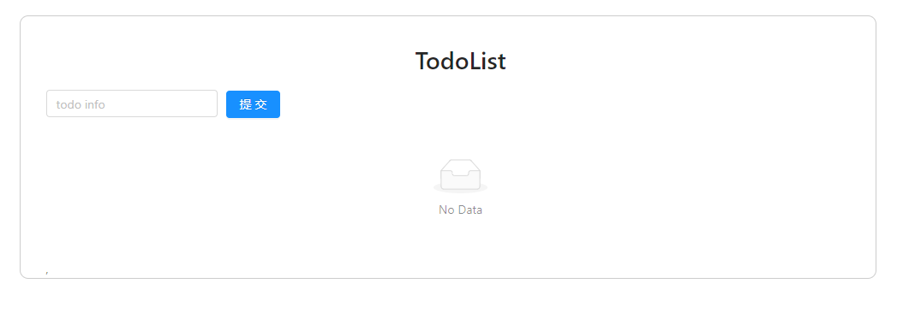

React Demo Two - TodoList 升级
===

> create by **jsliang** on **2019-3-26 09:26:53**   
> Recently revised in **2019-4-4 07:26:55**

## 一 初始化项目

1. 获取 Simpify 目录，修改 App 为 TodoList

## 二 Ant Design of React

1. 安装：`cnpm i antd -S`
2. 使用：

> TodoList.js

```js
import React, { Component } from 'react';

import 'antd/dist/antd.css';

import './index.css';

import { Input, Button, List, Avatar } from 'antd';

const data = [
  { title: '第一条标题', description: '这是非常非常非常长的让人觉得不可思议的但是它语句通顺的第一条描述', },
  { title: '第二条标题', description: '这是非常非常非常长的让人觉得不可思议的但是它语句通顺的第二条描述', },
  { title: '第三条标题', description: '这是非常非常非常长的让人觉得不可思议的但是它语句通顺的第三条描述', },
  { title: '第四条标题', description: '这是非常非常非常长的让人觉得不可思议的但是它语句通顺的第四条描述', },
];
class TodoList extends Component {
  render() {
    return (
      <div className="todo">
        <div className="todo-title">
          <h1>TodoList</h1>
        </div>
        <div className="todo-action">
          <Input placeholder='todo info' className="todo-input" />
          <Button type="primary" className="todo-submit">提交</Button>
        </div>
        <div className="todo-list">
          <List
            itemLayout="horizontal"
            dataSource={data}
            renderItem={item => (
              <List.Item>
                <List.Item.Meta
                  avatar={<Avatar src="https://zos.alipayobjects.com/rmsportal/ODTLcjxAfvqbxHnVXCYX.png" />}
                  title={<a href="http://jsliang.top">{item.title}</a>}
                  description={item.description}
                />
              </List.Item>
            )}
          />,
        </div>
      </div>
    );
  }
}

export default TodoList;
```

> index.css

```css
.todo {
  width: 1000px;
  margin: 20px auto 0;
  padding: 30px;
  border: 1px solid #ccc;
  border-radius: 10px;
}
.todo-title {
  text-align: center;
}
.todo-input {
  width: 200px;
}
.todo-submit {
  margin-left: 10px;
}
```

此时页面显示为：


## 三 Redux

1. 安装 Redux：`npm i redux -S`
2. 使用：

> src/store/reducer.js

```js
const defaultState = {
  inputValue: '',
  list: []
}

export default (state = defaultState, action) => {
  return state;
}
```

> src/store/index.js

```js
import { createStore } from 'redux';
import reducer from './reducer';

const store = createStore(reducer);

export default store;
```

这时候我们就可以在 TodoList.js 中引用并打印出来：

> TodoList.js

```js
// 引用 React 及其组件
import React, { Component } from 'react';
// 引用 Antd
import 'antd/dist/antd.css';
// 引用主 CSS 文件
import './index.css';
// 引入 输入框、按钮、列表、头像
import { Input, Button, List, Avatar } from 'antd';
// 引入 redux（如果不写目录下的文件，默认引用 index.js）
import store from './store';

class TodoList extends Component {

  constructor(props) {
    super(props);
    console.log(store.getState());
    this.state = store.getState();
  }

  render() {
    return (
      <div className="todo">
        <div className="todo-title">
          <h1>TodoList</h1>
        </div>
        <div className="todo-action">
          <Input placeholder='todo info' className="todo-input" value={this.state.inputValue} />
          <Button type="primary" className="todo-submit">提交</Button>
        </div>
        <div className="todo-list">
          <List
            itemLayout="horizontal"
            dataSource={this.state.list}
            renderItem={item => (
              <List.Item>
                <List.Item.Meta
                  avatar={<Avatar src="https://zos.alipayobjects.com/rmsportal/ODTLcjxAfvqbxHnVXCYX.png" />}
                  title={<a href="http://jsliang.top">{item.title}</a>}
                  description={item.description}
                />
              </List.Item>
            )}
          />,
        </div>
      </div>
    );
  }
}

export default TodoList;
```

查看 Chrome 控制台，发现它的确输出了：

```Console
{inputValue: "", list: Array(0)}
```

这样我们就完成了 redux 的引用。

现在页面显示为；



## 四 Redux 插件

1. 安装：科学上网的 Chrome 插件，或者百度下载一个
2. 使用：
   1. 关闭浏览器，并重新打开，再打开控制台（F12），进入 Redux 栏，提示你尚未安装代码
   2. 前往 index.js 安装代码。
   3. 查看 state 中发现存有数据，此时 Redux 插件安装完毕。

> index.js

```js
import { createStore } from 'redux';
import reducer from './reducer';

// 如果安装了 Redux 工具，则使用该工具
const store = createStore(
  reducer,
  window.__REDUX_DEVTOOLS_EXTENSION__ && window.__REDUX_DEVTOOLS_EXTENSION__()
);

export default store;
```

## 五 Redux 整体流程

### 5.1 Input 输入数据

> TodoList.js

```js
// 引用 React 及其组件
import React, { Component } from 'react';
// 引用 Antd
import 'antd/dist/antd.css';
// 引用主 CSS 文件
import './index.css';
// 引入 输入框、按钮、列表、头像
import { Input, Button, List, Avatar } from 'antd';
// 引入 redux（如果不写目录下的文件，默认引用 index.js）
import store from './store';

class TodoList extends Component {

  constructor(props) {
    super(props);
    console.log(store.getState());
    this.state = store.getState();
    this.handleInputChange = this.handleInputChange.bind(this);

    // 3. 绑定处理 redux 返回回来的数据
    this.handleStoreChange = this.handleStoreChange.bind(this);
    store.subscribe(this.handleStoreChange);
  }

  render() {
    return (
      <div className="todo">
        <div className="todo-title">
          <h1>TodoList</h1>
        </div>
        <div className="todo-action">
          <Input 
            placeholder='todo info' 
            className="todo-input" 
            value={this.state.inputValue} 
            onChange={this.handleInputChange}
          />
          <Button type="primary" className="todo-submit">提交</Button>
        </div>
        <div className="todo-list">
          <List
            itemLayout="horizontal"
            dataSource={this.state.list}
            renderItem={item => (
              <List.Item>
                <List.Item.Meta
                  avatar={<Avatar src="https://zos.alipayobjects.com/rmsportal/ODTLcjxAfvqbxHnVXCYX.png" />}
                  title={<a href="http://jsliang.top">{item.title}</a>}
                  description={item.description}
                />
              </List.Item>
            )}
          />,
        </div>
      </div>
    );
  }

  handleInputChange(e) {
    // 1. 通过 Action，将数据传给 Store
    const action = {
      type: 'change_input_value',
      value: e.target.value
    }
    store.dispatch(action);
  }

  // 4. 绑定的方法
  handleStoreChange() {
    this.setState(store.getState());
  }

}

export default TodoList;
```

> redux.js

```js
const defaultState = {
  inputValue: '',
  list: [
    // { title: '第一条标题', description: '这是非常非常非常长的让人觉得不可思议的但是它语句通顺的第一条描述', },
  ]
}

// reducer 可以接收 state，但是绝不能修改 state
export default (state = defaultState, action) => {
  console.log(state);
  console.log(action);
  // 2. 在 reducer.js 中获取数据，并 return 返回回去
  if(action.type === 'change_input_value') {
    const newState = JSON.parse(JSON.stringify(state));
    newState.inputValue = action.value;
    return newState;
  }
  return state;
}
```

修改完这两个文件后，我们的输入框可以输入数字了。


下面分析下思路：

1. 我们在 `handleInputChange` 中编写 `action`，通过 `dispatch` 将 `action` 从 TodoList.js 传递给 Redux 中的 reducer.js。
2. Redux 在 reducer.js 中接收到 `state` 和 `action`，然后我们将新的 `newState` 返回回去，期望 TodoList.js 能接受到反馈
3. 在 TodoList 的 `constructor` 中通过 `store.subscribe` 绑定处理 Redux 传回来的数据的处理方法 `handleStoreChange`
4. 在 `handleStoreChange` 中，我们直接 `setState` Redux 返回的 state，即 `store.getState()`

如此，我们就做到了数据在 React -> Redux 中的流通，可参考下面图或者参考一个计数器的代码：


> 计数器

```js
import { createStore } from 'redux';

/**
 * 这是一个 reducer，形式为 (state, action) => state 的纯函数。
 * 描述了 action 如何把 state 转变成下一个 state。
 *
 * state 的形式取决于你，可以是基本类型、数组、对象、
 * 甚至是 Immutable.js 生成的数据结构。惟一的要点是
 * 当 state 变化时需要返回全新的对象，而不是修改传入的参数。
 *
 * 下面例子使用 `switch` 语句和字符串来做判断，但你可以写帮助类(helper)
 * 根据不同的约定（如方法映射）来判断，只要适用你的项目即可。
 */
function counter(state = 0, action) {
  switch (action.type) {
  case 'INCREMENT':
    return state + 1;
  case 'DECREMENT':
    return state - 1;
  default:
    return state;
  }
}

// 创建 Redux store 来存放应用的状态。
// API 是 { subscribe, dispatch, getState }。
let store = createStore(counter);

// 可以手动订阅更新，也可以事件绑定到视图层。
store.subscribe(() =>
  console.log(store.getState())
);

// 改变内部 state 惟一方法是 dispatch 一个 action。
// action 可以被序列化，用日记记录和储存下来，后期还可以以回放的方式执行
store.dispatch({ type: 'INCREMENT' });
// 1
store.dispatch({ type: 'INCREMENT' });
// 2
store.dispatch({ type: 'DECREMENT' });
// 1
```

### 5.2 Button 提交数据

> TodoList.js

```js
// 引用 React 及其组件
import React, { Component } from 'react';
// 引用 Antd
import 'antd/dist/antd.css';
// 引用主 CSS 文件
import './index.css';
// 引入 输入框、按钮、列表、头像
import { Input, Button, List, Avatar } from 'antd';
// 引入 redux（如果不写目录下的文件，默认引用 index.js）
import store from './store';

class TodoList extends Component {

  constructor(props) {
    super(props);
    console.log(store.getState());
    this.state = store.getState();
    this.handleInputChange = this.handleInputChange.bind(this);

    // 3. 绑定处理 redux 返回回来的数据
    this.handleStoreChange = this.handleStoreChange.bind(this);
    store.subscribe(this.handleStoreChange);

    this.handleButtonClick = this.handleButtonClick.bind(this);
  }

  render() {
    return (
      <div className="todo">
        <div className="todo-title">
          <h1>TodoList</h1>
        </div>
        <div className="todo-action">
          <Input 
            placeholder='todo info' 
            className="todo-input" 
            value={this.state.inputValue} 
            onChange={this.handleInputChange}
          />
          <Button 
            type="primary" 
            className="todo-submit"
            onClick={this.handleButtonClick}
          >
            提交
          </Button>
        </div>
        <div className="todo-list">
          <List
            itemLayout="horizontal"
            dataSource={this.state.list}
            renderItem={item => (
              <List.Item>
                <List.Item.Meta
                  avatar={<Avatar src="https://zos.alipayobjects.com/rmsportal/ODTLcjxAfvqbxHnVXCYX.png" />}
                  title={<a href="http://jsliang.top">{item.title}</a>}
                  description={item.description}
                />
              </List.Item>
            )}
          />,
        </div>
      </div>
    );
  }

  handleInputChange(e) {
    // 1. 通过 Action，将数据传给 Store
    const action = {
      type: 'change_input_value',
      value: e.target.value
    }
    store.dispatch(action);
  }

  // 4. 绑定的方法
  handleStoreChange() {
    this.setState(store.getState());
  }

  handleButtonClick(e) {
    // 5. 执行 Button 点击的流程
    const action = {
      type: 'add_todo_item'
    };
    store.dispatch(action);
  }

}

export default TodoList;
```

> reducer.js

```js
const defaultState = {
  inputValue: '',
  list: [
    // { title: '第一条标题', description: '这是非常非常非常长的让人觉得不可思议的但是它语句通顺的第一条描述', },
  ]
}

// reducer 可以接收 state，但是绝不能修改 state
export default (state = defaultState, action) => {
  console.log(state);
  console.log(action);
  // 2. 在 reducer.js 中获取数据，并 return 返回回去
  if(action.type === 'change_input_value') {
    const newState = JSON.parse(JSON.stringify(state));
    newState.inputValue = action.value;
    return newState;
  }
  // 6. 接收 TodoList 传递过来的数据，并进行处理与返回
  if(action.type === 'add_todo_item') {
    const newState = JSON.parse(JSON.stringify(state));
    newState.list.push(newState.inputValue);
    newState.inputValue = '';
    return newState;
  }
  return state;
}
```

同 Input 一样，我们处理下 React -> Redux 的数据流，这样我们就可以完成输入的操作。

> 因为数据问题，这里我们没有做到文字实时的更新，需要去掉 `title` 和 `description` 的分类。

### 5.3 点击删除列表项

> TodoList.js

```js
// 引用 React 及其组件
import React, { Component } from 'react';
// 引用 Antd
import 'antd/dist/antd.css';
// 引用主 CSS 文件
import './index.css';
// 引入 输入框、按钮、列表、头像
import { Input, Button, List, Avatar } from 'antd';
// 引入 Redux（如果不写目录下的文件，默认引用 index.js）
import store from './store';

class TodoList extends Component {

  constructor(props) {
    super(props);
    this.state = store.getState();
    this.handleInputChange = this.handleInputChange.bind(this);

    // 3. 绑定处理 redux 返回回来的数据
    this.handleStoreChange = this.handleStoreChange.bind(this);
    store.subscribe(this.handleStoreChange);

    this.handleButtonClick = this.handleButtonClick.bind(this);
    this.handleInputKeyUp = this.handleInputKeyUp.bind(this);
  }

  render() {
    return (
      <div className="todo">
        <div className="todo-title">
          <h1>TodoList</h1>
        </div>
        <div className="todo-action">
          <Input 
            placeholder='todo info' 
            className="todo-input" 
            value={this.state.inputValue} 
            onChange={this.handleInputChange}
            onKeyUp={this.handleInputKeyUp}
          />
          <Button 
            type="primary" 
            className="todo-submit"
            onClick={this.handleButtonClick}
          >
            提交
          </Button>
        </div>
        <div className="todo-list">
          <List
            itemLayout="horizontal"
            dataSource={this.state.list}
            renderItem={(item, index) => (
              <List.Item onClick={this.handleItemDelete.bind(this, index)}>
                <List.Item.Meta
                  avatar={<Avatar src="https://zos.alipayobjects.com/rmsportal/ODTLcjxAfvqbxHnVXCYX.png" />}
                  title={<a href="http://jsliang.top">{item.title}</a>}
                  description={item.description}
                />
              </List.Item>
            )}
          />
        </div>
      </div>
    );
  }

  handleInputChange(e) {
    // 1. 通过 Action，将数据传给 Store
    const action = {
      type: 'change_input_value',
      value: e.target.value
    }
    store.dispatch(action);
  }

  // 4. 绑定的方法
  handleStoreChange() {
    this.setState(store.getState());
  }

  handleButtonClick(e) {
    // 5. 执行 Button 点击的流程
    const action = {
      type: 'add_todo_item'
    };
    store.dispatch(action);
  }

  handleInputKeyUp(e) {
    if(e.keyCode === 13) {
      this.handleButtonClick();
    }
  }

  handleItemDelete(index) {
    const action = {
      type: 'delete_todo_item',
      index
    }
    store.dispatch(action);
  }

}

export default TodoList;
```

> reducer.js

```js
const defaultState = {
  inputValue: '',
  list: [
    // { title: '第一条标题', description: '这是非常非常非常长的让人觉得不可思议的但是它语句通顺的第一条描述', },
  ]
}

// reducer 可以接收 state，但是绝不能修改 state
export default (state = defaultState, action) => {
  // 2. 在 reducer.js 中获取数据，并 return 返回回去
  if(action.type === 'change_input_value') {
    const newState = JSON.parse(JSON.stringify(state));
    newState.inputValue = action.value;
    return newState;
  }
  // 6. 接收 TodoList 传递过来的数据，并进行处理与返回
  if(action.type === 'add_todo_item') {
    const newState = JSON.parse(JSON.stringify(state));
    let newList = {
      title: newState.inputValue,
      description: '这是非常非常非常长的让人觉得不可思议的但是它语句通顺的第 n 条描述'
    };
    newState.list.push(newList);
    newState.inputValue = '';
    return newState;
  }
  if(action.type === 'delete_todo_item') {
    const newState = JSON.parse(JSON.stringify(state));
    newState.list.splice(action.index, 1);
    return newState;
  }
  return state;
}
```

### 5.4 抽取 ActionType

在 store 目录下新增一个 actionTypes.js：

> 项目/src/store/actionTypes.js

```js
export const CHANGE_INPUT_VALUE = 'change_input_value';
export const ADD_TODO_ITEM = 'add_todo_item';
export const DELETE_TODO_ITEM = 'delete_todo_item';
```

然后在 TodoList.js 和 reducer.js 中使用：

> TodoList.js

```js
// 引用 React 及其组件
import React, { Component } from 'react';
// 引用 Antd
import 'antd/dist/antd.css';
// 引用主 CSS 文件
import './index.css';
// 引入 输入框、按钮、列表、头像
import { Input, Button, List, Avatar } from 'antd';
// 引入 Redux（如果不写目录下的文件，默认引用 index.js）
import store from './store';
// 引入 actionTypes
import { CHANGE_INPUT_VALUE, ADD_TODO_ITEM, DELETE_TODO_ITEM } from './store/actionTypes'

class TodoList extends Component {

  constructor(props) {
    super(props);
    this.state = store.getState();
    this.handleInputChange = this.handleInputChange.bind(this);

    // 3. 绑定处理 redux 返回回来的数据
    this.handleStoreChange = this.handleStoreChange.bind(this);
    store.subscribe(this.handleStoreChange);

    this.handleButtonClick = this.handleButtonClick.bind(this);
    this.handleInputKeyUp = this.handleInputKeyUp.bind(this);
  }

  render() {
    return (
      <div className="todo">
        <div className="todo-title">
          <h1>TodoList</h1>
        </div>
        <div className="todo-action">
          <Input 
            placeholder='todo info' 
            className="todo-input" 
            value={this.state.inputValue} 
            onChange={this.handleInputChange}
            onKeyUp={this.handleInputKeyUp}
          />
          <Button 
            type="primary" 
            className="todo-submit"
            onClick={this.handleButtonClick}
          >
            提交
          </Button>
        </div>
        <div className="todo-list">
          <List
            itemLayout="horizontal"
            dataSource={this.state.list}
            renderItem={(item, index) => (
              <List.Item onClick={this.handleItemDelete.bind(this, index)}>
                <List.Item.Meta
                  avatar={<Avatar src="https://zos.alipayobjects.com/rmsportal/ODTLcjxAfvqbxHnVXCYX.png" />}
                  title={<a href="http://jsliang.top">{item.title}</a>}
                  description={item.description}
                />
              </List.Item>
            )}
          />
        </div>
      </div>
    );
  }

  handleInputChange(e) {
    // 1. 通过 Action，将数据传给 Store
    const action = {
      type: CHANGE_INPUT_VALUE,
      value: e.target.value
    }
    store.dispatch(action);
  }

  // 4. 绑定的方法
  handleStoreChange() {
    this.setState(store.getState());
  }

  handleButtonClick(e) {
    // 5. 执行 Button 点击的流程
    const action = {
      type: ADD_TODO_ITEM
    };
    store.dispatch(action);
  }

  handleInputKeyUp(e) {
    if(e.keyCode === 13) {
      this.handleButtonClick();
    }
  }

  handleItemDelete(index) {
    const action = {
      type: DELETE_TODO_ITEM,
      index
    }
    store.dispatch(action);
  }

}

export default TodoList;
```

> reducer.js

```js
// 引入 actionTypes
import { CHANGE_INPUT_VALUE, ADD_TODO_ITEM, DELETE_TODO_ITEM } from './actionTypes'

const defaultState = {
  inputValue: '',
  list: [
    // { title: '第一条标题', description: '这是非常非常非常长的让人觉得不可思议的但是它语句通顺的第一条描述', },
  ]
}

// reducer 可以接收 state，但是绝不能修改 state
export default (state = defaultState, action) => {
  // 2. 在 reducer.js 中获取数据，并 return 返回回去
  if(action.type === CHANGE_INPUT_VALUE) {
    const newState = JSON.parse(JSON.stringify(state));
    newState.inputValue = action.value;
    return newState;
  }
  // 6. 接收 TodoList 传递过来的数据，并进行处理与返回
  if(action.type === ADD_TODO_ITEM) {
    const newState = JSON.parse(JSON.stringify(state));
    let newList = {
      title: newState.inputValue,
      description: '这是非常非常非常长的让人觉得不可思议的但是它语句通顺的第 n 条描述'
    };
    newState.list.push(newList);
    newState.inputValue = '';
    return newState;
  }
  if(action.type === DELETE_TODO_ITEM) {
    const newState = JSON.parse(JSON.stringify(state));
    newState.list.splice(action.index, 1);
    return newState;
  }
  return state;
}
```

抽取 actionTypes.js 的意义在于，固定 action.type 值，从而不会因为在两处不同地方使用，导致报错。

### 5.5 抽取整个 action

在上面工作中，我们将 actionType 抽取出来了。但是，当页面足够复杂的时候，我们的 action 管理起来就非常复杂了，所以我们尝试将整个 action 抽取出来。

我们在 store 目录中新建一个 actionCreators.js：

> 项目/src/store/actionCreators.js

```js
// 引入 actionTypes
import { CHANGE_INPUT_VALUE, ADD_TODO_ITEM, DELETE_TODO_ITEM } from './actionTypes'

export const getInputChangeAction = (value) => ({
  type: CHANGE_INPUT_VALUE,
  value
})

export const getAddItemAction = () => ({
  type: ADD_TODO_ITEM
})

export const getItemDeleteAction = (index) => ({
  type: DELETE_TODO_ITEM,
  index
})
```

机智的小伙伴，看到这里，应该就明白我们的意图了，所以，我们再修改下 TodoList.js 即可：

> src/TodoList.js

```js
// 引用 React 及其组件
import React, { Component } from 'react';
// 引用 Antd
import 'antd/dist/antd.css';
// 引用主 CSS 文件
import './index.css';
// 引入 输入框、按钮、列表、头像
import { Input, Button, List, Avatar } from 'antd';
// 引入 Redux（如果不写目录下的文件，默认引用 index.js）
import store from './store';
// 引入 actionCreators.js
import { getInputChangeAction, getAddItemAction, getItemDeleteAction } from './store/actionCreators'

class TodoList extends Component {

  constructor(props) {
    super(props);
    this.state = store.getState();
    this.handleInputChange = this.handleInputChange.bind(this);

    // 3. 绑定处理 redux 返回回来的数据
    this.handleStoreChange = this.handleStoreChange.bind(this);
    store.subscribe(this.handleStoreChange);

    this.handleAddItem = this.handleAddItem.bind(this);
    this.handleInputKeyUp = this.handleInputKeyUp.bind(this);
  }

  render() {
    return (
      <div className="todo">
        <div className="todo-title">
          <h1>TodoList</h1>
        </div>
        <div className="todo-action">
          <Input 
            placeholder='todo info' 
            className="todo-input" 
            value={this.state.inputValue} 
            onChange={this.handleInputChange}
            onKeyUp={this.handleInputKeyUp}
          />
          <Button 
            type="primary" 
            className="todo-submit"
            onClick={this.handleAddItem}
          >
            提交
          </Button>
        </div>
        <div className="todo-list">
          <List
            itemLayout="horizontal"
            dataSource={this.state.list}
            renderItem={(item, index) => (
              <List.Item onClick={this.handleItemDelete.bind(this, index)}>
                <List.Item.Meta
                  avatar={<Avatar src="https://zos.alipayobjects.com/rmsportal/ODTLcjxAfvqbxHnVXCYX.png" />}
                  title={<a href="http://jsliang.top">{item.title}</a>}
                  description={item.description}
                />
              </List.Item>
            )}
          />
        </div>
      </div>
    );
  }

  handleInputChange(e) {
    // 1. 通过 Action，将数据传给 Store
    const action = getInputChangeAction(e.target.value);
    store.dispatch(action);
  }

  // 4. 绑定的方法
  handleStoreChange() {
    this.setState(store.getState());
  }

  handleAddItem(e) {
    // 5. 执行 Button 点击的流程
    const action = getAddItemAction();
    store.dispatch(action);
  }

  handleInputKeyUp(e) {
    if(e.keyCode === 13) {
      this.handleAddItem();
    }
  }

  handleItemDelete(index) {
    const action = getItemDeleteAction(index);
    store.dispatch(action);
  }

}

export default TodoList;
```

这样，我们就把 action 抽取出来了，在大型项目中，对我们的工作会非常方便。

### 5.6 UI 组件和容器组件

* UI 组件 —— 傻瓜组件，做页面的渲染
* 容器组件 —— 聪明组件，做页面的逻辑

在这里，我们进行组件的拆分：

> src/TodoList.js

```js
import React, { Component } from 'react'; // 引用 React 及其组件
import 'antd/dist/antd.css'; // 引用 Antd
import './index.css'; // 引用主 CSS 文件
import store from './store'; // 引入 Redux（如果不写目录下的文件，默认引用 index.js）
import { getInputChangeAction, getAddItemAction, getItemDeleteAction } from './store/actionCreators' // 引入 actionCreators.js
// 1. 引入 TodoListUI
import TodoListUI from './TodoListUI';

class TodoList extends Component {

  constructor(props) {
    super(props);
    this.state = store.getState(); // 获取 store 数据
    this.handleInputChange = this.handleInputChange.bind(this); // 输入内容改变
    this.handleInputKeyUp = this.handleInputKeyUp.bind(this); // 回车添加项
    this.handleAddItem = this.handleAddItem.bind(this); // 按钮添加项
    this.handleItemDelete = this.handleItemDelete.bind(this)
    this.handleStoreChange = this.handleStoreChange.bind(this); // store 数据改变
    store.subscribe(this.handleStoreChange); // 监听 store 改变，改变就执行 handleStoreChange 方法
  }

  render() {
    return (
      <TodoListUI
        inputValue = {this.state.inputValue}
        list = {this.state.list}
        handleInputChange = {this.handleInputChange}
        handleInputKeyUp = {this.handleInputKeyUp}
        handleAddItem = {this.handleAddItem}
        handleItemDelete = {this.handleItemDelete}
      />
    );
  }

  handleInputChange(e) { // input 输入数据
    const action = getInputChangeAction(e.target.value);
    store.dispatch(action);
  }

  handleStoreChange() { // 监听 store 数据改变
    this.setState(store.getState());
  }

  handleAddItem() { // 添加数据
    const action = getAddItemAction();
    store.dispatch(action);
  }

  handleInputKeyUp(e) { // 回车添加数据
    if(e.keyCode === 13) {
      this.handleAddItem();
    }
  }

  handleItemDelete(index) { // 删除数据
    const action = getItemDeleteAction(index);
    store.dispatch(action);
  }

}

export default TodoList;
```

在这里，我们将 render 中的内容抽取到子组件，该子组件在 src 目录下，叫 TodoListUI，脏活累活让他做，我们只需要将数据传递给它就行了，然后我们编写子组件内容：

> src/TodoListUI.js
 
```js
import React, { Component } from 'react'; // 引用 React 及其组件
import { Input, Button, List, Avatar } from 'antd'; // 引入 输入框、按钮、列表、头像

class TodoListUI extends Component {
  render() {
    return (
      <div className="todo">
        <div className="todo-title">
          <h1>TodoList</h1>
        </div>
        <div className="todo-action">
          <Input 
            placeholder='todo info' 
            className="todo-input" 
            value={this.props.inputValue} 
            onChange={this.props.handleInputChange}
            onKeyUp={this.props.handleInputKeyUp}
          />
          <Button 
            type="primary" 
            className="todo-submit"
            onClick={this.props.handleAddItem}
          >
            提交
          </Button>
        </div>
        <div className="todo-list">
          <List
            itemLayout="horizontal"
            dataSource={this.props.list}
            renderItem={(item, index) => (
              <List.Item onClick={(index) => {this.props.handleItemDelete(index)}}>
                <List.Item.Meta
                  avatar={<Avatar src="https://zos.alipayobjects.com/rmsportal/ODTLcjxAfvqbxHnVXCYX.png" />}
                  title={<a href="http://jsliang.top">{item.title}</a>}
                  description={item.description}
                />
              </List.Item>
            )}
          />
        </div>
      </div>
    );
  }
}

export default TodoListUI;
```

这样，我们就完成了 UI 组件和容器组件的拆分。

### 5.7 无状态组件

当一个组件中，只有 render() 函数，而不做其他事情的时候，我们就把它叫做无状态组件。

在 TodoList 这个项目中，我们可以在 TodoListUI 进行一个无状态组件的定义：

> src/TodoListUI

```js
import React from 'react'; // 引用 React 及其组件
import { Input, Button, List, Avatar } from 'antd'; // 引入 输入框、按钮、列表、头像

const TodoListUI = (props) => {
  return (
    <div className="todo">
      <div className="todo-title">
        <h1>TodoList</h1>
      </div>
      <div className="todo-action">
        <Input 
          placeholder='todo info' 
          className="todo-input" 
          value={props.inputValue} 
          onChange={props.handleInputChange}
          onKeyUp={props.handleInputKeyUp}
        />
        <Button 
          type="primary" 
          className="todo-submit"
          onClick={props.handleAddItem}
        >
          提交
        </Button>
      </div>
      <div className="todo-list">
        <List
          itemLayout="horizontal"
          dataSource={props.list}
          renderItem={(item, index) => (
            <List.Item onClick={(index) => {props.handleItemDelete(index)}}>
              <List.Item.Meta
                avatar={<Avatar src="https://zos.alipayobjects.com/rmsportal/ODTLcjxAfvqbxHnVXCYX.png" />}
                title={<a href="http://jsliang.top">{item.title}</a>}
                description={item.description}
              />
            </List.Item>
          )}
        />
      </div>
    </div>
  )
}

export default TodoListUI;
```

在这里，由于我们没有使用 Component 了，所以我们在第一行去掉了 Component 的引用。

同时，我们规定传入到项目中的参数为 props，于是我们就不需要 this.props.** 的形式来引用父组件传递过来的数据，而是直接使用 props 就行了。

### 5.8 Redux 中发送异步请求获取数据


### 5.9 Redux-Thunk 中间件进行 ajax 请求发送

在上章节，我们在 TodoList 中进行了 Ajax 请求，这是可以的。

但是，随着 Ajax 请求越来越多，如果我们都在页面中编写，那么就会让页面显得臃肿。

这时候，就需要 Redux-thunk 了。Redux-thunk 可以把异步请求及复杂业务逻辑抽取到其他地方处理。

* Redux Thunk：[Github 地址](https://github.com/reduxjs/redux-thunk)
* 安装：`npm i redux-thunk -S`
* 使用：

```js
import { createStore, applyMiddleware } from 'redux';
import thunk from 'redux-thunk';
import rootReducer from './reducers/index';

const store = createStore(
  rootReducer,
  applyMiddleware(thunk)
)
```

### 5.10 Redux-Saga 中间件进行 Ajax 请求发送

* Redux Saga：[Github 地址](https://github.com/redux-saga/redux-saga)
* 安装：`npm i redux-saga -S`
* 使用：

### 5.11 React-Redux 的使用

* React Redux：[GitHub 地址](https://github.com/reduxjs/react-redux)
* 安装：`npm i react-redux -S`
* 使用：

---

> **jsliang** 广告推送：  
> 也许小伙伴想了解下云服务器  
> 或者小伙伴想买一台云服务器  
> 或者小伙伴需要续费云服务器  
> 欢迎点击 **[云服务器推广](https://github.com/LiangJunrong/document-library/blob/master/other-library/Monologue/%E7%A8%B3%E9%A3%9F%E8%89%B0%E9%9A%BE.md)** 查看！

[](https://promotion.aliyun.com/ntms/act/qwbk.html?userCode=w7hismrh)
[](https://cloud.tencent.com/redirect.php?redirect=1014&cps_key=49f647c99fce1a9f0b4e1eeb1be484c9&from=console)

> <a rel="license" href="http://creativecommons.org/licenses/by-nc-sa/4.0/"></a><br /><span xmlns:dct="http://purl.org/dc/terms/" property="dct:title">jsliang 的文档库</span> 由 <a xmlns:cc="http://creativecommons.org/ns#" href="https://github.com/LiangJunrong/document-library" property="cc:attributionName" rel="cc:attributionURL">梁峻荣</a> 采用 <a rel="license" href="http://creativecommons.org/licenses/by-nc-sa/4.0/">知识共享 署名-非商业性使用-相同方式共享 4.0 国际 许可协议</a>进行许可。<br />基于<a xmlns:dct="http://purl.org/dc/terms/" href="https://github.com/LiangJunrong/document-library" rel="dct:source">https://github.com/LiangJunrong/document-library</a>上的作品创作。<br />本许可协议授权之外的使用权限可以从 <a xmlns:cc="http://creativecommons.org/ns#" href="https://creativecommons.org/licenses/by-nc-sa/2.5/cn/" rel="cc:morePermissions">https://creativecommons.org/licenses/by-nc-sa/2.5/cn/</a> 处获得。