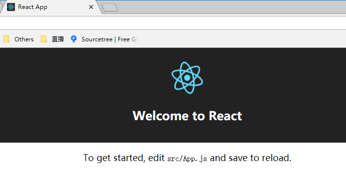
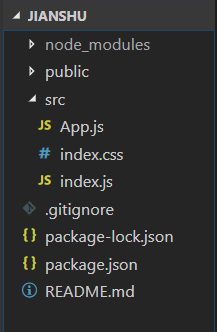
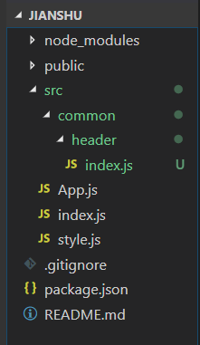
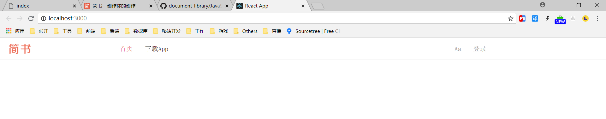
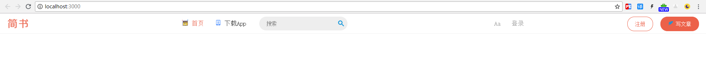
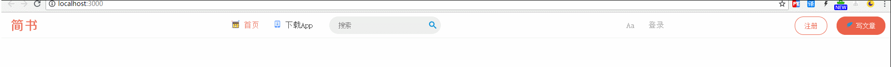
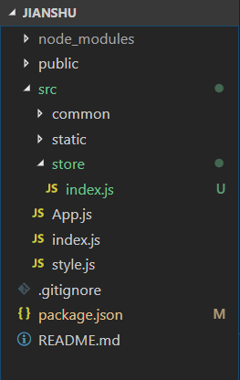

仿简书项目
===

> create by **jsliang** on **2018-9-10 14:35:03**  
> Recently revised in **2019-2-11 11:31:03**
 
## 第一章 基础环境搭建

### 1.1 搭建 React 脚手架

* 安装 React 脚手架：`npm i create-react-app -g`
* 新建 React 项目：`create-react-app jianshu`
* 启动 React 项目：`npm start`



如上，搭建起了一个新的 React 项目。

### 1.2 精支简干

删除项目文件至如下图：



> **index.html**

```
<!DOCTYPE html>
<html lang="en">
  <head>
    <meta charset="utf-8">
    <meta name="viewport" content="width=device-width, initial-scale=1, shrink-to-fit=no">
    <title>React App</title>
  </head>
  <body>
    <noscript>
      You need to enable JavaScript to run this app.
    </noscript>
    <div id="root"></div>
  </body>
</html>
```

> **App.js**

```
import React, { Component } from 'react';

class App extends Component {
  render() {
    return (
      <div>
        Hello World!
      </div>
    );
  }
}

export default App;
```

> **index.css**

```
body {
  margin: 0;
  padding: 0;
  font-family: sans-serif;
}
```

> **.gitignore**

```
# See https://help.github.com/ignore-files/ for more about ignoring files.

# dependencies
/node_modules

# testing
/coverage

# production
/build

# misc
.DS_Store
.env.local
.env.development.local
.env.test.local
.env.production.local

npm-debug.log*
yarn-debug.log*
yarn-error.log*
```

> **package.json**

```
{
  "name": "jianshu",
  "version": "0.1.0",
  "private": true,
  "dependencies": {
    "react": "^16.5.0",
    "react-dom": "^16.5.0",
    "react-scripts": "1.1.5"
  },
  "scripts": {
    "start": "react-scripts start",
    "build": "react-scripts build",
    "test": "react-scripts test --env=jsdom",
    "eject": "react-scripts eject"
  }
}
```

> **README.md**

```
# 仿简书项目

* 安装依赖：`npm i`
* 在线运行：`npm start`
* 打包部署：`npm build`
```

### 1.3 编写样式

* 安装 styled-components ：`npm i styled-components`
* 修改 `index.css` 变为 `style.js`
* 修改 `index.js` 的引用：

```
import React from 'react';
import ReactDOM from 'react-dom';
import './style.js';
import App from './App';

ReactDOM.render(<App />, document.getElementById('root'));
```

* 修改 `style.js` 的内容，从：

```
body {
  margin: 0;
  padding: 0;
  font-family: sans-serif;
}
.jsliang {
  background: red;
}
```

变为：

```
import { injectGlobal } from 'styled-components';

injectGlobal`
  body {
    margin: 0;
    padding: 0;
    font-family: sans-serif;
  }
  .jsliang {
    background: red;
  }
`
```

* 引入 `reset.css`：

```
  /* 
      * reset 的目的不是让默认样式在所有浏览器下一致，而是减少默认样式有可能带来的问题。
      * The purpose of reset is not to allow default styles to be consistent across all browsers, but to reduce the potential problems of default styles.
      * create by jsliang
  */

  /** 清除内外边距 - clearance of inner and outer margins **/
  body, h1, h2, h3, h4, h5, h6, hr, p, blockquote, /* 结构元素 - structural elements */
  dl, dt, dd, ul, ol, li, /* 列表元素 - list elements */
  pre, /* 文本格式元素 - text formatting elements */
  form, fieldset, legend, button, input, textarea, /* 表单元素 - from elements */
  th, td /* 表格元素 - table elements */ {
      margin: 0;
      padding: 0;
  }

  /** 设置默认字体 - setting the default font **/
  body, button, input, select, textarea {
      font: 18px/1.5 '楷体', Helvetica, sans-serif;
  }
  h1, h2, h3, h4, h5, h6, button, input, select, textarea { font-size: 100%; }

  /** 重置列表元素 - reset the list element **/
  ul, ol { list-style: none; }

  /** 重置文本格式元素 - reset the text format element **/
  a, a:hover { text-decoration: none; }

  /** 重置表单元素 - reset the form element **/
  button { cursor: pointer; }
  input { font-size: 18px; outline: none; }

  /** 重置表格元素 - reset the table element **/
  table { border-collapse: collapse; border-spacing: 0; }

  /** 图片自适应 - image responsize **/
  img { border: 0; display: inline-block; width: 100%; max-width: 100%; height: auto; }

  /* 
      * 默认box-sizing是content-box，该属性导致padding会撑大div，使用border-box可以解决该问题
      * set border-box for box-sizing when you use div, it solve the problem when you add padding and don't want to make the div width bigger
  */
  div, input { box-sizing: border-box; }

  /** 清除浮动 - clear float **/
  .jsliang-clear:after, .clear:after {
      content: " ";
      display: block;
      height: 0;
      clear: both;
  }
  .jsliang-clear, .clear {
      *zoom: 1;
  }

  /** 设置input的placeholder - set input placeholder **/
  input::-webkit-input-placeholder { color: #727272; } /* Webkit browsers */
  input::-moz-placeholder { color: #727272; } /* Mozilla Firefox */
  input::-ms-input-placeholder { color: #727272; } /* Internet Explorer */
```

此时 `style.js` 内容为：

```
import { injectGlobal } from 'styled-components';

injectGlobal`
  /* 
      * reset 的目的不是让默认样式在所有浏览器下一致，而是减少默认样式有可能带来的问题。
      * The purpose of reset is not to allow default styles to be consistent across all browsers, but to reduce the potential problems of default styles.
      * create by jsliang
  */

  /** 清除内外边距 - clearance of inner and outer margins **/
  body, h1, h2, h3, h4, h5, h6, hr, p, blockquote, /* 结构元素 - structural elements */
  dl, dt, dd, ul, ol, li, /* 列表元素 - list elements */
  pre, /* 文本格式元素 - text formatting elements */
  form, fieldset, legend, button, input, textarea, /* 表单元素 - from elements */
  th, td /* 表格元素 - table elements */ {
      margin: 0;
      padding: 0;
  }

  /** 设置默认字体 - setting the default font **/
  body, button, input, select, textarea {
      font: 18px/1.5 '宋体', Helvetica, sans-serif;
  }
  h1, h2, h3, h4, h5, h6, button, input, select, textarea { font-size: 100%; }

  /** 重置列表元素 - reset the list element **/
  ul, ol { list-style: none; }

  /** 重置文本格式元素 - reset the text format element **/
  a, a:hover { text-decoration: none; }

  /** 重置表单元素 - reset the form element **/
  button { cursor: pointer; }
  input { font-size: 18px; outline: none; }

  /** 重置表格元素 - reset the table element **/
  table { border-collapse: collapse; border-spacing: 0; }

  /** 图片自适应 - image responsize **/
  img { border: 0; display: inline-block; width: 100%; max-width: 100%; height: auto; }

  /* 
      * 默认box-sizing是content-box，该属性导致padding会撑大div，使用border-box可以解决该问题
      * set border-box for box-sizing when you use div, it solve the problem when you add padding and don't want to make the div width bigger
  */
  div, input { box-sizing: border-box; }

  /** 清除浮动 - clear float **/
  .jsliang-clear:after, .clear:after {
      content: " ";
      display: block;
      height: 0;
      clear: both;
  }
  .jsliang-clear, .clear {
      *zoom: 1;
  }

  /** 设置input的placeholder - set input placeholder **/
  input::-webkit-input-placeholder { color: #727272; } /* Webkit browsers */
  input::-moz-placeholder { color: #727272; } /* Mozilla Firefox */
  input::-ms-input-placeholder { color: #727272; } /* Internet Explorer */
`
```

至此，基础环境搭建完毕。

> 注：引用了 styled-components 后，&.className 为同级样式，.className 为下级样式

## 第二章 导航栏编写

<br>

### 2.1 创建公共组件



1. 新建 `common` 文件夹
2. 新建 `header` 文件夹
3. 新建 `index.js` 文件

> **index.js**
```
import React, { Component } from 'react';
import {
    HeaderWrapper, Logo, Nav, NavItem, NavSearch, Addition, Button
} from './style'

class Header extends Component {
    render() {
        return (
            <HeaderWrapper>
                <Logo/>
                <Nav>
                    <NavItem className="left active">首页</NavItem>
                    <NavItem className="left">下载App</NavItem>
                    <NavItem className="right">登录</NavItem>
                    <NavItem className="right">Aa</NavItem>
                    <NavSearch></NavSearch>
                </Nav>
                <Addition>
                    <Button className="writting">写文章</Button>
                    <Button className="reg">注册</Button>
                </Addition>
            </HeaderWrapper>
        )
    }
}

export default Header;
```
4. 下载 logo：


5. 新建 `style.js` 文件
> **style.js**
```
import styled from 'styled-components';
import logoPic from '../../static/logo.png';

export const HeaderWrapper = styled.div`
    position: relative;
    height: 56px;
    border-bottom: 1px solid #f0f0f0;
`;

export const Logo = styled.a.attrs({
    href: '/'
})`
    position: absolute;
    top: 0;
    left: 0;
    display: block;
    width: 100px;
    height: 56px;
    background: url(${logoPic});
    background-size: contain;
`;

export const Nav = styled.div`
    width: 960px;
    height: 100%;
    margin: 0 auto;
`;

export const NavItem = styled.div`
    line-height: 56px;
    padding: 0 15px;
    font-size: 17px;
    color: #333;
    &.left {
        float: left;
    }
    &.right {
        float: right;
        color: #969696;
    }
    &.active {
        color: #ea6f5a;
    }
`;

export const NavSearch = styled.input.attrs({
    placeholder: '搜索'
})`
    width: 160px;
    height: 38px;
    padding: 0 20px;
    margin-top: 9px;
    margin-left: 20px;
    border: none;
    outline: none;
    border-radius: 19px;
    background: #eee;
    font-size: 14px;
`;

export const Addition = styled.div`
    position: absolute;
    right: 0;
    top: 0;
    height: 56px;
`;

export const Button = styled.div`
    float: right;
    margin-top: 9px;
    margin-right: 20px;
    padding: 0 20px;
    line-height: 38px; 
    border-radius: 19px;
    border: 1px solid #ec6149;
    font-size: 14px;
    &.reg {
        color: #ec6149;
    }
    &.writting {
        color: #fff;
        background: #ec6149;
    }
`;
```
6. 此时项目效果（localhost:3000）如下图所示：


<br>

### 2.2 添加 IconFont 图标
1. 登录 [阿里巴巴矢量图](http://www.iconfont.cn) 下载图标库
2. 在 src 下的 `index.js` 中引用 [iconfont.js](./code/jianshu/src/static/iconfont/iconfont.js)
> index.js
```
import React from 'react';
import ReactDOM from 'react-dom';
import App from './App';
import './style.js';
import './static/iconfont/iconfont';

ReactDOM.render(<App />, document.getElementById('root'));
```
3. 往 src 下的 `style.js` 中引用样式：
> style.js
```
    /** 引入 iconfont **/
    .icon {
        width: 1em;
        height: 1em;
        vertical-alian: -.15em;
        fill: currentColor;
        overflow: hidden;
    }
```
4. 在导航条 header 中的 `index.js` 中引用iconfont：
> index.js
```
import React, { Component } from 'react';
import {
    HeaderWrapper, Logo, Nav, NavItem, NavSearch, Addition, Button, SearchWrapper
} from './style'

class Header extends Component {
    render() {
        return (
            <HeaderWrapper>
                <Logo/>
                <Nav>
                    <NavItem className="left active">
                        <svg className="icon" aria-hidden="true">
                            <use xlinkHref="#icon-shouye"></use>
                        </svg>
                        <span> 首页</span>
                    </NavItem>
                    <NavItem className="left">
                        <svg className="icon" aria-hidden="true">
                            <use xlinkHref="#icon-xiazaiAPP"></use>
                        </svg>
                        <span> 下载App</span>
                    </NavItem>
                    <NavItem className="right">登录</NavItem>
                    <NavItem className="right">Aa</NavItem>
                    <SearchWrapper>
                        <NavSearch></NavSearch>
                        <div className="icon-search">
                            <svg className="icon" aria-hidden="true">
                                <use xlinkHref="#icon-icon_search"></use>
                            </svg>
                        </div>
                    </SearchWrapper>
                </Nav>
                <Addition>
                    <Button className="writting">
                        <svg className="icon" aria-hidden="true">
                            <use xlinkHref="#icon-yumao"></use>
                        </svg>
                        <span> 写文章</span>
                    </Button>
                    <Button className="reg">注册</Button>
                </Addition>
            </HeaderWrapper>
        )
    }
}

export default Header;
```
5. 修改下 header 中的 `style.js` 样式：
```
import styled from 'styled-components';
import logoPic from '../../static/logo.png';

export const HeaderWrapper = styled.div`
    position: relative;
    height: 56px;
    border-bottom: 1px solid #f0f0f0;
`;

export const Logo = styled.a.attrs({
    href: '/'
})`
    position: absolute;
    top: 0;
    left: 0;
    display: block;
    width: 100px;
    height: 56px;
    background: url(${logoPic});
    background-size: contain;
`;

export const Nav = styled.div`
    width: 960px;
    height: 100%;
    margin: 0 auto;
    font-size: 17px;
`;

export const NavItem = styled.div`
    line-height: 56px;
    padding: 0 15px;
    font-size: 17px;
    color: #333;
    &.left {
        float: left;
    }
    &.right {
        float: right;
        color: #969696;
    }
    &.active {
        color: #ea6f5a;
    }
`;

export const SearchWrapper = styled.div`
    position: relative;
    float: left;
    .icon-search {
        position: absolute;
        right: 5px;
        bottom: 5px;
        width: 24px;
        line-height: 24px;
        border-radius: 13px;
        text-align: center;
    }
`;

export const NavSearch = styled.input.attrs({
    placeholder: '搜索'
})`
    float: left;
    width: 240px;
    height: 38px;
    padding: 0 35px 0 20px;
    margin-top: 9px;
    margin-left: 20px;
    border: none;
    outline: none;
    border-radius: 19px;
    background: #eee;
    font-size: 14px;
`;

export const Addition = styled.div`
    position: absolute;
    right: 0;
    top: 0;
    height: 56px;
`;

export const Button = styled.div`
    float: right;
    margin-top: 9px;
    margin-right: 20px;
    padding: 0 20px;
    line-height: 38px; 
    border-radius: 19px;
    border: 1px solid #ec6149;
    font-size: 14px;
    &.reg {
        color: #ec6149;
    }
    &.writting {
        color: #fff;
        background: #ec6149;
    }
`;
```
6. 此刻项目样子为：  
&emsp;浏览器：



&emsp;项目目录：


### 2.3 搜索框动画
1. 在 header 组件下的 `index.js` 中，添加或者修改下面代码：
> index.js
```
    constructor(props) {
        super(props);
        this.state = {
            focused: true
        }
    }
    <SearchWrapper>
        <NavSearch
            className={this.state.focused ? 'focused' : ''}
        ></NavSearch>
        <div className={this.state.focused ? 'focused icon-search' : 'icon-search'}>
            <svg className="icon" aria-hidden="true">
                <use xlinkHref="#icon-icon_search"></use>
            </svg>
        </div>
    </SearchWrapper>
```
2. 在 header 组件下的 `style.js` 中，添加或者修改下面代码：
```
export const SearchWrapper = styled.div`
    position: relative;
    float: left;
    .icon-search {
        position: absolute;
        right: 5px;
        bottom: 5px;
        width: 24px;
        line-height: 24px;
        text-align: center;
        &.focused {
            background: #fff;
            width: 30px;
            height: 30px;
            line-height: 35px;
            border-radius: 15px;
        }
    }
`;

export const NavSearch = styled.input.attrs({
    placeholder: '搜索'
})`
    float: left;
    width: 240px;
    height: 38px;
    padding: 0 35px 0 20px;
    margin-top: 9px;
    margin-left: 20px;
    border: none;
    outline: none;
    border-radius: 19px;
    background: #eee;
    font-size: 14px;
    &.focused {
        width: 300px;
    }
`;
```
3. 在这里，我们通过设置 constructor 中的 focused 状态为 true 或者 false，来设置动画前后的样式。
4. 编写事件：
> index.js
```
    constructor(props) {
        super(props);
        this.state = {
            focused: false
        }
        this.handleInputFocus = this.handleInputFocus.bind(this);
        this.handleInputBlur = this.handleInputBlur.bind(this);
    }

    <SearchWrapper>
        <NavSearch
            className={this.state.focused ? 'focused' : ''} 
            onFocus={this.handleInputFocus}
            onBlur={this.handleInputBlur}
        ></NavSearch>
        <div className={this.state.focused ? 'focused icon-search' : 'icon-search'}>
            <svg className="icon" aria-hidden="true">
                <use xlinkHref="#icon-icon_search"></use>
            </svg>
        </div>
    </SearchWrapper>

    handleInputFocus() {
        this.setState({
            focused: true
        })
    }

    handleInputBlur() {
        this.setState({
            focused: false
        })
    }
```
5. 安装 `react-transition-group`：`npm i react-transition-group -D`
6. 引用 `react-transition-group`：
> index.js
```
import { CSSTransition } from 'react-transition-group';

<SearchWrapper>
    <CSSTransition
        in={this.state.focused}
        timeout={500}
        classNames="slide"
    >
    <NavSearch
        className={this.state.focused ? 'focused' : ''} 
        onFocus={this.handleInputFocus}
        onBlur={this.handleInputBlur}
    ></NavSearch>
    </CSSTransition>
    <div className={this.state.focused ? 'focused icon-search' : 'icon-search'}>
        <svg className="icon" aria-hidden="true">
            <use xlinkHref="#icon-icon_search"></use>
        </svg>
    </div>
</SearchWrapper>
```

&emsp;同时，往 `style.js` 添加样式：
```
export const SearchWrapper = styled.div`
    position: relative;
    float: left;
    .slide-enter {
        transition: all .5s ease-out;
    }
    .slide-enter-active {
        width: 300px;
    }
    .slide-exit {
        transition: all .5s ease-out;
    }
    .slide-exit-active {
        width: 240px;
    }
    .icon-search {
        position: absolute;
        right: 5px;
        bottom: 5px;
        width: 24px;
        line-height: 24px;
        text-align: center;
        &.focused {
            background: #fff;
            width: 30px;
            height: 30px;
            line-height: 35px;
            border-radius: 15px;
        }
    }
`;
```
7. 这时候，我们可以查看到详细效果：


## 第三章 Redux 数据管理

<br>

### 3.1 Redux
1. 安装 `redux`： `npm i redux -D`
2. 安装 `react-redux`：`npm i react-redux -D`
3. 创建 `store` 文件夹
4. 创建 `index.js` 文件
5. 此时目录如下：



6. 修改下面的文件：
> App.js
```
import React, { Component } from 'react';
import { Provider } from 'react-redux';
import Header from './common/header';
import store from './store';

class App extends Component {
  render() {
    return (
      <Provider store={store}>
        <Header />
      </Provider>
    );
  }
}

export default App;
```

> store/index.js
```
import { createStore } from 'redux';
import reducer from './reducer';

const store = createStore(reducer);

export default store;
```

> store/reducer.js
```
const defaultState = {
    focused: false
};

export default (state = defaultState, action) => {
    return state;
}
```

> common/header/index.js
```
import React, { Component } from 'react';
import { connect } from 'react-redux';
import { CSSTransition } from 'react-transition-group';
import {
    HeaderWrapper, Logo, Nav, NavItem, NavSearch, Addition, Button, SearchWrapper
} from './style'

class Header extends Component {
    constructor(props) {
        super(props);
        this.handleInputFocus = this.handleInputFocus.bind(this);
        this.handleInputBlur = this.handleInputBlur.bind(this);
    }

    render() {
        return (
            <HeaderWrapper>
                <Logo/>
                <Nav>
                    <NavItem className="left active">
                        <svg className="icon" aria-hidden="true">
                            <use xlinkHref="#icon-shouye"></use>
                        </svg>
                        <span> 首页</span>
                    </NavItem>
                    <NavItem className="left">
                        <svg className="icon" aria-hidden="true">
                            <use xlinkHref="#icon-xiazaiAPP"></use>
                        </svg>
                        <span> 下载App</span>
                    </NavItem>
                    <NavItem className="right">登录</NavItem>
                    <NavItem className="right">Aa</NavItem>
                    <SearchWrapper>
                        <CSSTransition
                            in={this.props.focused}
                            timeout={500}
                            classNames="slide"
                        >
                        <NavSearch
                            className={this.props.focused ? 'focused' : ''} 
                            onFocus={this.handleInputFocus}
                            onBlur={this.handleInputBlur}
                        ></NavSearch>
                        </CSSTransition>
                        <div className={this.props.focused ? 'focused icon-search' : 'icon-search'}>
                            <svg className="icon" aria-hidden="true">
                                <use xlinkHref="#icon-icon_search"></use>
                            </svg>
                        </div>
                    </SearchWrapper>
                </Nav>
                <Addition>
                    <Button className="writting">
                        <svg className="icon" aria-hidden="true">
                            <use xlinkHref="#icon-yumao"></use>
                        </svg>
                        <span> 写文章</span>
                    </Button>
                    <Button className="reg">注册</Button>
                </Addition>
            </HeaderWrapper>
        )
    }

    handleInputFocus() {
        this.setState({
            focused: true
        })
    }

    handleInputBlur() {
        this.setState({
            focused: false
        })
    }
}

const mapStateToProps = (state) => {
    return {
        focused: state.focused
    }
}

const mapDispathToProps = (dispatch) => {
    return {

    }
}

export default connect(mapStateToProps, mapDispathToProps)(Header);
```
7. 修改 common/header/`index.js` 以及 src/store/`reducer.js` 这两个文件：
> common/header/index.js
```
import React from 'react';
import { connect } from 'react-redux';
import { CSSTransition } from 'react-transition-group';
import {
    HeaderWrapper, Logo, Nav, NavItem, NavSearch, Addition, Button, SearchWrapper
} from './style'

const Header = (props) => {
    return (
        <HeaderWrapper>
            <Logo/>
            <Nav>
                <NavItem className="left active">
                    <svg className="icon" aria-hidden="true">
                        <use xlinkHref="#icon-shouye"></use>
                    </svg>
                    <span> 首页</span>
                </NavItem>
                <NavItem className="left">
                    <svg className="icon" aria-hidden="true">
                        <use xlinkHref="#icon-xiazaiAPP"></use>
                    </svg>
                    <span> 下载App</span>
                </NavItem>
                <NavItem className="right">登录</NavItem>
                <NavItem className="right">Aa</NavItem>
                <SearchWrapper>
                    <CSSTransition
                        in={props.focused}
                        timeout={500}
                        classNames="slide"
                    >
                    <NavSearch
                        className={props.focused ? 'focused' : ''} 
                        onFocus={props.handleInputFocus}
                        onBlur={props.handleInputBlur}
                    ></NavSearch>
                    </CSSTransition>
                    <div className={props.focused ? 'focused icon-search' : 'icon-search'}>
                        <svg className="icon" aria-hidden="true">
                            <use xlinkHref="#icon-icon_search"></use>
                        </svg>
                    </div>
                </SearchWrapper>
            </Nav>
            <Addition>
                <Button className="writting">
                    <svg className="icon" aria-hidden="true">
                        <use xlinkHref="#icon-yumao"></use>
                    </svg>
                    <span> 写文章</span>
                </Button>
                <Button className="reg">注册</Button>
            </Addition>
        </HeaderWrapper>
    )
}

const mapStateToProps = (state) => {
    return {
        focused: state.focused
    }
}

const mapDispathToProps = (dispatch) => {
    return {
        handleInputFocus() {
            const action = {
                type: 'search_focus'
            };
            dispatch(action);
        },
        handleInputBlur() {
            const action = {
                type: 'search_blur'
            };
            dispatch(action);
        }
    }
}

export default connect(mapStateToProps, mapDispathToProps)(Header);
```

> src/store/reducer.js
```
const defaultState = {
    focused: false
};

export default (state = defaultState, action) => {
    if(action.type === 'search_focus') {
        return {
            focused: true
        }
    }
    if(action.type === 'search_blur') {
        return {
            focused: false
        }
    }
    return state;
}
```
8. 新建 `store` 文件夹
9. 新建 `index.js` 文件
10. 新建 `reducer.js` 文件
11. 以此对 redux 进行拆分：
> common/header/store/index.js
```
import reducer from './reducer';

export { reducer };
```

> common/header/store/reducer.js
```
const defaultState = {
    focused: false
};

export default (state = defaultState, action) => {
    if(action.type === 'search_focus') {
        return {
            focused: true
        }
    }
    if(action.type === 'search_blur') {
        return {
            focused: false
        }
    }
    return state;
}
```

> common/header/index.js
```
const mapStateToProps = (state) => {
    return {
        focused: state.header.focused
    }
}
```

> src/store/reducer.js
```
import { combineReducers } from 'redux';
import { reducer as headerReducer } from '../common/header/store';

const reducer = combineReducers({
    header: headerReducer
});

export default reducer;
```

12. 新建 common/header/store/`actionCreators.js`：
> actionCreators.js
```
export const searchFocus = () => ({
    type: 'search_focus'
});

export const searchBlur = () => ({
    type: 'search_blur'
});
```
13. 修改 common/header/index.js：
> index.js
```
import * as actionCreators from './store/actionCreators';

const mapDispathToProps = (dispatch) => {
    return {
        handleInputFocus() {
            dispatch(actionCreators.searchFocus());
        },
        handleInputBlur() {
            dispatch(actionCreators.searchBlur())
        }
    }
}
```
14. 新建 common/header/store/`actionTypes.js`：
> actionTypes.js
```
export const SEARCH_FOCUS = 'header/SEARCH_FOCUS';
export const SEARCH_BLUR = 'header/SEARCH_BLUR';
```
15. 在 `actionCreators.js` 中引用该常量拆分组件：
> actionCreators.js
```
import * as actionTypes from './actionTypes';

export const searchFocus = () => ({
    type: actionTypes.SEARCH_FOCUS
});

export const searchBlur = () => ({
    type: actionTypes.SEARCH_BLUR
});
```
16. 修改 header/store/`reducer.js`：
> reducer.js
```
import * as actionTypes from './actionTypes';

const defaultState = {
    focused: false
};

export default (state = defaultState, action) => {
    if(action.type === actionTypes.SEARCH_FOCUS) {
        return {
            focused: true
        }
    }
    if(action.type === actionTypes.SEARCH_BLUR) {
        return {
            focused: false
        }
    }
    return state;
}
```
17. 修改 common/header/store/`index.js`：
> index.js
```
import reducer from './reducer';
import * as actionCreators from './actionCreators';
import * as actionTypes from './actionTypes';

export { reducer, actionCreators, actionTypes };
```
18. 修改 common/header/`index.js`：
```
import { actionCreators } from './store';
```
19. 安装 `immutable`：`npm i immutable -D`
20. 修改 common/header/store/`reducer.js`：
> reducer.js
```
import * as actionTypes from './actionTypes';
import { fromJS } from 'immutable';

const defaultState = fromJS({
    focused: false
});

export default (state = defaultState, action) => {
    if(action.type === actionTypes.SEARCH_FOCUS) {
        return state.set('focused', true);
    }
    if(action.type === actionTypes.SEARCH_BLUR) {
        return state.set('focused', false);
    }
    return state;
}
```
21. 修改 common/header/`index.js`：
> index.js
```
const mapStateToProps = (state) => {
    return {
        focused: state.header.get('focused')
    }
}
```

> <a rel="license" href="http://creativecommons.org/licenses/by-nc-sa/4.0/"></a><br /><span xmlns:dct="http://purl.org/dc/terms/" property="dct:title">jsliang的文档库</span> 由 <a xmlns:cc="http://creativecommons.org/ns#" href="https://github.com/LiangJunrong/document-library" property="cc:attributionName" rel="cc:attributionURL">梁峻荣</a> 采用 <a rel="license" href="http://creativecommons.org/licenses/by-nc-sa/4.0/">知识共享 署名-非商业性使用-相同方式共享 4.0 国际 许可协议</a>进行许可。<br />基于<a xmlns:dct="http://purl.org/dc/terms/" href="https://github.com/LiangJunrong/document-library" rel="dct:source">https://github.com/LiangJunrong/document-library</a>上的作品创作。<br />本许可协议授权之外的使用权限可以从 <a xmlns:cc="http://creativecommons.org/ns#" href="https://creativecommons.org/licenses/by-nc-sa/2.5/cn/" rel="cc:morePermissions">https://creativecommons.org/licenses/by-nc-sa/2.5/cn/</a> 处获得。
