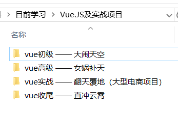
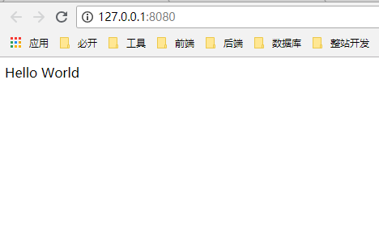
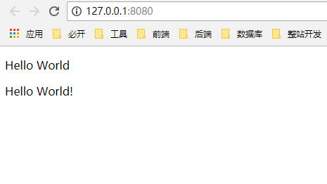
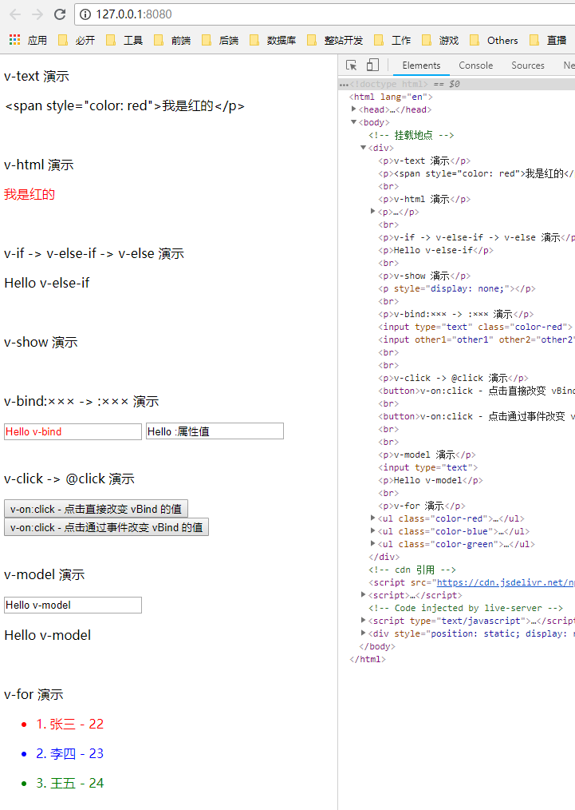

Vue
===

> Create by **jsliang** on **2018-10-29 11:48:55**  
> Recently revised in **2018-10-31 08:46:05**

<br>

&emsp;**记录下关于 Vue 框架的系统学习旅途：Vue 基础 -> 深入 Vue 套餐 -> Vue 源码剖析。**

&emsp;**参考文档：**

1. [Vue.js 官方文档](https://cn.vuejs.org/v2/guide/) 
  
&emsp;关于学习 Vue 方面，最佳推荐还是官方文档，因为不管是其他文字还是视频教程，都是基于 Vue 的官方文档或者 GitHub 进行学习编写的。   

<br>

&emsp;**参考视频：**

1. **开课吧** - [Vue.js 及项目实战(2018/06)](https://www.kaikeba.com/)  

&emsp;在这里偶然发现一套来自 **开课吧** 的教学视频，然后发现它是今年 6 月份录制的，内容上还算是比较新，并且文件命名非常有意思，在这里咱的 Vue 基础知识先跟着它走一遍看看~


2. **慕课网** - [《Vue.js 源码全方位深入解析》](https://coding.imooc.com/class/228.html)

&emsp;还未开封，但是研究源码可能参考该套视频。

<br>

# <a name="chapter-one" id="chapter-one">一 目录</a>

<br>

&emsp;**不折腾的前端，和咸鱼有什么区别~**

| 目录 |
| --- |
| <a name="catalog-chapter-one" id="catalog-chapter-one"></a>[一 目录](#chapter-one) |
| <a name="catalog-chapter-two" id="catalog-chapter-two"></a>[二 前言](#chapter-two) |
| <a name="catalog-chapter-three" id="catalog-chapter-three"></a>[三 Vue 基础](#chapter-three) |
| &emsp;[3.1 初识 Vue](#chapter-three-one) |
| &emsp;[3.2 挂载数据 - data](#chapter-three-two) |
| &emsp;[3.3 进一步优化 el](#chapter-three-three) |
| &emsp;[3.4 插值表达式 - {{ ? }}](#chapter-three-four) |
| &emsp;[3.5 指令 - v-?](#chapter-three-five) |
| &emsp;[3.6 事件 - methods](#chapter-three-six) |
| &emsp;[3.7 模板 - template](#chapter-three-seven) |
| &emsp;&emsp;[3.7.1 初识组件](#chapter-three-seven-one) |
| &emsp;&emsp;[3.7.2 父子组件通讯](#chapter-three-seven-two) |
| &emsp;&emsp;[3.7.3 共用组件](#chapter-three-seven-three) |
| &emsp;[3.8 过滤器 - filter](#chapter-three-eight) |

<br>

# <a name="chapter-two" id="chapter-two">二 前言</a>

> [返回目录](#catalog-chapter-two)

<br>

1. 为何需要 Vue ？

* 首先，jQuery 库，它的影响是执行 DOM 操作 + Ajax 请求
* 然后，art-template 库，主要是作为模板引擎，对页面进行渲染。
* 最后，在广大的需求之下，我们有了 Vue 这样，有简易的 DOM 体验，有模板引擎，有路由功能的框架的出现。

<br>

2. Vue 和 jQuery 在代码上的区别是什么？

* 在 jQuery 这种代码库上，它的使用时调用某个函数，我们只需要把控库的代码就可以了。
* 在 Vue 这种框架上，它会初始化自身的一些行为，然后执行你所编写的代码，最后释放资源，从而帮助我们更好地运行我们编写好的代码。

<br>

# <a name="chapter-three" id="chapter-three">三 Vue 基础</a>

> [返回目录](#catalog-chapter-three)

<br>

&emsp;在这里，我们通过讲解如何构建 Vue 项目，以及一些基础的 Vue 指令的讲解，快速上手 Vue 开发。

&emsp;学习版本：`v2.5.16`  
&emsp;编写时间：`2018-10-30`  

&emsp;**如版本更迭太大或者时间小伙伴们看到这篇文章的时间太长久，请查看 Vue 官方文档学习最新的 Vue。**

<br>

## <a name="chapter-three-one" id="chapter-three-one">3.1 初识 Vue</a>

> [返回目录](#catalog-chapter-three)

<br>

&emsp;话不多数，我们直接看代码及其实现：

> index.html

```
<!DOCTYPE html>
<html lang="en">

<head>
  <meta charset="UTF-8">
  <meta name="viewport" content="width=device-width,initial-scale=1.0,maximum-scale=1.0,user-scalable=no">
  <meta http-equiv="X-UA-Compatible" content="ie=edge">
  <title>Vue学习 - 2018-10-29 13:27:49</title>
</head>

<body>
  <!-- 挂载点。可以理解为被操作的对象 -->
  <div id="app"></div>

  <!-- 开发环境版本，包含了有帮助的命令行警告 -->
  <script src="https://cdn.jsdelivr.net/npm/vue/dist/vue.js"></script>

  <!-- 生产环境版本，优化了尺寸和速度 -->
  <!-- <script src="https://cdn.jsdelivr.net/npm/vue"></script> -->

  <script>
    new Vue({
      // el：发生行为的目的地，即我们的挂载点
      el: "#app",
      /*
       * template：模板，即我们要渲染进挂载点的页面标签。
       * 最外一层必须有一层包裹，例如 <div> 
       */
      template: `
          <div>
            <p>Hello World</p>
          </div>
        `,
    })
  </script>
</body>

</html>
```

<br>

&emsp;现在，我们解析下代码运行：

1. 首先，创建一个空白的 html 模板文件，通过 CDN 引用 Vue：

```
<!-- 开发环境版本，包含了有帮助的命令行警告 -->
<script src="https://cdn.jsdelivr.net/npm/vue/dist/vue.js"></script>
```

<br>

2. 然后，我们编写一个挂载点，即我们的 Vue，最终会在哪个 DOM 里面进行操作：

```
<!-- 挂载点。可以理解为被操作的对象 -->
<div id="app"></div>
```

<br>

3. 最后，我们通过 New 一个 Vue 实例对象，对我们 id 为 app 的 DOM 节点进行操作：

```
new Vue({
  // el：发生行为的目的地，即我们的挂载点
  el: "#app",
  /*
    * template：模板，即我们要渲染进挂载点的页面标签。
    * 最外一层必须有一层包裹，例如 <div> 
    */
  template: `
      <div>
        <p>Hello World</p>
      </div>
    `,
})
```

<br>

&emsp;这样，我们最终就显示了 Vue 的简单引用，是不是觉得非常简单：



<br>

## <a name="chapter-three-two" id="chapter-three-two">3.2 挂载数据 - data</a>

> [返回目录](#catalog-chapter-three)

<br>

&emsp;如果 Vue 仅仅是只有 `template` 这个模板装载，那么它跟 jQuery 就显得毫无差别了，下面我们使用下 Vue 的 `data` 进行数据渲染：

```
<script>
  new Vue({
    // el：发生行为的目的地，即我们的挂载点
    el: "#app",
    /*
      * template：模板，即我们要渲染进挂载点的页面标签。
      * 最外一层必须有一层包裹，例如 <div> 
      */
    template: `
        <div>
          <p>Hello World</p>
          <p>{{ text }}</p>
        </div>
    `,
    data: function() {
      return {
        // template 中要使用的数据
        text: 'Hello World!'
      }
    }
  })
</script>
```

<br>

&emsp;在这里，我们可以看到，我们在 `template` 中加了一个 `<p>` 标签，通过 `{{ text }}` 形式，引入了一个叫 `text` 的 `data` 数据：

```
<p>{{ text }}</p>
```

<br>

&emsp;接着我们在 `<scirpt>` 中定义了 `text` 的内容，从而实现数据渲染：

```
data: function() {
  return {
    // template 中要使用的数据
    text: 'Hello World!'
  }
}
```

<br>

&emsp;这样，我们就知道了，我们不仅可以通过模板 `template` 来渲染 `<div>` 标签，我们也可以将 js 中定义的数据或者变量，通过操作 `data` 从而改变 html 里面的内容。



<br>

## <a name="chapter-three-three" id="chapter-three-three">3.3 进一步优化 el</a>

> [返回目录](#catalog-chapter-three)

<br>

&emsp;在 `3.1` 章节 及 `3.2` 章节中，我们使用 `el` 的方式是：

```
el: '#app',
```

&emsp;该 `el` 挂载形式，在 Vue 内部运行机制中，它会根据你传入的值，进行查找：

* 如果传入的是 `#app`，那它就判断查找 `id` 为 `app` 的节点；
* 如果传入的是 `.app`，那它就查找 `class` 为 `app` 的节点；
* 如果传入的是节点名 `div`，那它就查找节点名……  

&emsp;大家应该清楚，这样判断查找是需要时间的，所以我们可以：

```
el: document.getElementById('app'),
```

<br>

&emsp;这般操作，使 Vue 直接将挂载点挂载到 `id` 上去，从而获得更好的加载速度。  
&emsp;这算是对 `el` 的一个小优化。

<br>

## <a name="chapter-three-four" id="chapter-three-four">3.4 插值表达式 - {{ ? }}</a>

> [返回目录](#catalog-chapter-three)

<br>

&emsp;如果小伙伴有点印象，应该还记得，我们在章节 `3.2` 中通过 `{{}}` 这个插值表达式的使用，在 `data` 中对其里面的数据进行操作。  
&emsp;下面，我们进一步讲解这个 `{{}}` 还可以进行哪种骚操作：

* 对象：{{ {name: 'jack'} }}
* 字符串 {{ 'Hello World!' }}
* 布尔值： {{ isTrue == -1 }}
* 三元表达式： {{ isTrue ? '正确' : '错误' }}

&emsp;下面我们通过代码进行操作演示：

> index.html

```
<!DOCTYPE html>
<html lang="en">

<head>
  <meta charset="UTF-8">
  <meta name="viewport" content="width=device-width,initial-scale=1.0,maximum-scale=1.0,user-scalable=no">
  <meta http-equiv="X-UA-Compatible" content="ie=edge">
  <title>Vue学习 - 2018-10-29 13:27:49</title>
</head>

<body>

  <div id="app"></div>


  <script src="https://cdn.jsdelivr.net/npm/vue/dist/vue.js"></script>
  <script>
    new Vue({

      el: document.getElementById('app'),

      template: `
          <div>
            <p>{{ text }}</p>
            <p>{{ {name: 'jack'} }}</p>
            <p>{{ 'Hello World!' }}</p>
            <p>{{ isTrue == -1 }}</p>
            <p>{{ isTrue ? '真' : '假' }}</p>
          </div>
      `,

      data: function() {
        return {
          text: 'Hello World!',
          isTrue: true
        }
      }
    })
  </script>
</body>

</html>
```

<br>

&emsp;它在浏览器的展示为：



<br>

&emsp;关键代码讲解：

```
<div>
  <!-- 赋值 text 到 <p> 标签中 -->
  <p>{{ text }}</p>
  
  <!-- 赋值对象到标签中 -->
  <p>{{ {name: 'jack'} }}</p>
  
  <!-- 直接赋值字符串到标签中 -->
  <p>{{ 'Hello World!' }}</p>

  <!-- 
    直接进行布尔判断，isTrue 在 data 中设置为 true，
    而 -1 转为 布尔值 是 false，所以两者不相等
    输出值为 false 
  -->
  <p>{{ isTrue == -1 }}</p>

  <!-- 运行三元表达式，isTrue 为 true，输出 真 -->
  <p>{{ isTrue ? '真' : '假' }}</p>
</div>
```

<br>

## <a name="chapter-three-five" id="chapter-three-five">3.5 指令 - v-?</a>

> [返回目录](#catalog-chapter-three)

<br>

&emsp;在 Vue 中，如果单单使用 `{{}}` 这种插值表达式，是满足不了我们对数据的操作欲望的。所以，Vue 以 `v-if`、`v-bind` 等形式，提供了一些对于页面 + 数据的更为方便的操作：指令  

* `v-text`
* `v-html`
* `v-if`
* `v-else-if`
* `v-else`
* `v-show`
* `v-bind`
* `v-click`
* `v-model`
* `v-for`

<br>

&emsp;这里通过一个 `index.html` 及一张图向大家演示其基本用法：

> index.html

```
<!DOCTYPE html>
<html lang="en">

<head>
  <meta charset="UTF-8">
  <meta name="viewport" content="width=device-width,initial-scale=1.0,maximum-scale=1.0,user-scalable=no">
  <meta http-equiv="X-UA-Compatible" content="ie=edge">
  <title>Vue学习 - 2018-10-29 13:27:49</title>
  <style>
    /* 颜色样式：红、绿、蓝 */
    .color-red {
      color: red;
    }

    .color-blue {
      color: blue;
    }

    .color-green {
      color: green;
    }
  </style>
</head>

<body>
  <!-- 挂载地点 -->
  <div id="app"></div>

  <!-- cdn 引用 -->
  <script src="https://cdn.jsdelivr.net/npm/vue/dist/vue.js"></script>
  <script>
    new Vue({
      // 挂载到 id 为 app 的节点上
      el: document.getElementById('app'),
      // 挂载的模板内容
      template: `
        <div>

          <p>v-text 演示</p>
          <p v-text='vTextOrHtml'></p>

          <br/>

          <p>v-html 演示</p>
          <p v-html='vTextOrHtml'></p>

          <br/>

          <p>v-if -> v-else-if -> v-else 演示</p>
          <p v-if='vIf == 1'>Hello v-If</p>
          <p v-else-if='vIf == 2'>Hello v-else-if</p>
          <p v-else>Hello v-else</p>

          <br/>

          <p>v-show 演示</p>
          <p v-show='isTrue'></p>

          <br/>

          <p>v-bind:××× -> :××× 演示</p>
          <input v-bind:value="vBind" v-bind:class="colorRed" type="text"/>
          <input v-bind:other1="other1" :other2="other2" :other3=" 'other3' " value="Hello :属性值" type="text"/><br/>

          <br/>

          <p>v-click -> @click 演示</p>
          <button v-on:click=" vBind= 'Hello v-on:click' ">v-on:click - 点击直接改变 vBind 的值</button><br>
          <button @click="changevBindValue">v-on:click - 点击通过事件改变 vBind 的值</button><br>

          <br/>

          <p>v-model 演示</p>
          <input v-model="vModel" type="text" />
          <p>{{ vModel }}</p>

          <br/>

          <p>v-for 演示</p>
          <ul v-for="(item, index) in vFor" :class="item.classStyle">
            <li>{{index+1}}. {{item.name}} - {{item.age}}</li>
          </ul>

        </div>
      `,
      data: function () { // 数据挂载
        return {
          
          // v-text 及 v-html 使用数据
          vTextOrHtml: '<span style="color: red">我是红的</p>',
          
          // v-if 使用数据
          vIf: 2,
          
          // v-show 使用数据
          isTrue: false,
          
          // v-bind 使用数据
          vBind: "Hello v-bind",
          
          // v-bind 通过动态绑定 class 修改样式
          colorRed: 'color-red',
          
          // v-bind 的 :属性 的使用形式
          other1: 'other1',
          
          // 同上
          other2: 'other2',
          
          // v-model 使用数据
          vModel: 'Hello v-model',
          
          // v-for 使用数据
          vFor: [{
              name: '张三', // 姓名
              age: 22, // 年龄
              classStyle: "color-red" // 样式
            },
            {
              name: '李四',
              age: 23,
              classStyle: "color-blue"
            },
            {
              name: '王五',
              age: 24,
              classStyle: "color-green"
            }
          ]
        }
      },
      /* 
       * 方法 - methods
       * 如果你在页面中，想给 v-on:click(@click) 事件绑定方法
       * 那么，该方法需要在 methods 中编写
       */
      methods: {
        // 点击修改 v-bind 的值
        changevBindValue: function (e) {
          
          console.log(e.target); // <button>v-on:click - 点击通过事件改变 vBind 的值</button>
          
          console.log(this.vBind); // Hello v-bind
          // 将 `Hello v-bind` 换为 `Hello @click`
          
          this.vBind = "Hello @click!";
        }
      }
    })
  </script>
</body>

</html>
```

<br>

&emsp;页面为：



<br>

&emsp;在这里，我们对代码进行下讲解：

```
<div>
  <!-- 
    这里直接将 vTextOrHtml 中的文本
    当成 string 渲染到页面中去
   -->
  <p v-text='vTextOrHtml'></p>

  <br/>

  <!-- 
    这里在渲染 vTextOrHtml 的过程中，
    如果遇到标签，则对标签页进行渲染 
   -->
  <p v-html='vTextOrHtml'></p>

  <br/>

  <!-- 
    判断 data 中 vIf 的值是多少，
    这里有三种情况：v-if、v-else-if、v-else。
    如果项目中有更多情况，则再添加 v-else-if 即可
  -->
  <p v-if='vIf == 1'>Hello v-If</p>
  <p v-else-if='vIf == 2'>Hello v-else-if</p>
  <p v-else>Hello v-else</p>

  <br/>

  <!-- 
    判断 isTrue 是真还是假，
    它不同于 v-if 的方面是：
    v-if 如果是假，则在 Element 中没有渲染
    v-show 如果是假，则该标签为 display: none
  -->
  <p v-show='isTrue'></p>

  <br/>

  <!-- 
    v-bind 有两种格式：
    1. v-bind:value - 全写
    2. :value - 简写
    我们还可以通过 v-bind:class 来动态赋值
    v-bind:other1="other1" 在页面中显示就是：
    <input other1="other1" />>
   -->
  <input v-bind:value="vBind" v-bind:class="colorRed" type="text"/>
  <input v-bind:other1="other1" :other2="other2" :other3=" 'other3' " value="Hello :属性值" type="text"/><br/>

  <br/>

  <!-- 
    v-on:click 有两种格式：
    1. v-on:click - 全写
    2. @click - 简写
    v-on:click 除了可以直接在里面写表达式，还可以填写方法
   -->
  <button v-on:click=" vBind= 'Hello v-on:click' ">v-on:click - 点击直接改变 vBind 的值</button><br>
  <button @click="changevBindValue">v-on:click - 点击通过事件改变 vBind 的值</button><br>

  <br/>

  <!-- 
    v-model 是双向数据绑定，
    在这里，上面 input 的修改
    会影响到下面 p 显示的内容
   -->
  <input v-model="vModel" type="text" />
  <p>{{ vModel }}</p>

  <br/>

  <!-- 
    v-for 循环体遍历输出
   -->
  <ul v-for="(item, index) in vFor" :class="item.classStyle">
    <li>{{index+1}}. {{item.name}} - {{item.age}}</li>
  </ul>
</div>
```

<br>

&emsp;v-bind 和 v-model 的区别：

* v-bind：将 Vue 中的数据同步到页面，即该值大部分用于前端向浏览器传固定数据。v-bind 可以给任何属性赋值，是从 Vue 到页面的单向数据流，即 Vue -> html。
* v-model：双向数据绑定，前端向浏览器传数据，用户操作浏览器的更改前端可以察觉到。v-model 只能给具有 value 属性的元素进行双向数据绑定（必须使用的是有 value 属性的元素），即 Vue -> html -> Vue

&emsp;**关于 Vue 的指令，这里仅做简单讲解，想详细学习的小伙伴，记得前往官方文档：[Vue 文档](https://cn.vuejs.org/v2/guide/)**

<br>

## <a name="chapter-three-six" id="chapter-three-six">3.6 事件 - methods</a>

> [返回目录](#catalog-chapter-three)

<br>

&emsp;在上一章 `3.5` 中，我们通过在 `button` 中使用 `v-on:click` 时，给它绑定了方法。  
&emsp;在 `3.5` 中，我们大体讲述了方法的时候。在这里，我们抽取出来做下讲解：

> index.html

```
<!DOCTYPE html>
<html lang="en">

<head>
  <meta charset="UTF-8">
  <meta name="viewport" content="width=device-width,initial-scale=1.0,maximum-scale=1.0,user-scalable=no">
  <meta http-equiv="X-UA-Compatible" content="ie=edge">
  <title>Vue学习</title>
</head>

<body>
  <div id="app"></div>

  <script src="https://cdn.jsdelivr.net/npm/vue/dist/vue.js"></script>
  <script>
    new Vue({
      el: document.getElementById('app'),
      template: `
        <button @click="addStyle">添加行内样式</button>
      `,
      data: function () { // 数据挂载
        return {

        }
      },
      methods: { // 方法
        addStyle: function(e) {
          e.toElement.style.background = "red"
        }
      }
    })
  </script>
</body>
```

<br>

&emsp;在上面的 `<button>` 中，我们通过 `@click` 绑定了事件 `addStyle`，而方法的编写，需要写到与 `data` 同级的 `methods` 中，然后，我们通过传递参数 `e`，可以获取到点击的时候的元素，通过查找，我们发现它的样式所在的目录结构如下：

```
- button
  - toElement
    - style
      - background
```

&emsp;所以，我们在用户点击按钮的时候，直接修改了它的背景。

<br>

## <a name="chapter-three-seven" id="chapter-three-seven">3.7 组件 - components</a>

> [返回目录](#catalog-chapter-three)

<br>

## <a name="chapter-three-seven-one" id="chapter-three-seven-one">3.7.1 初始组件</a>

> [返回目录](#catalog-chapter-three)

<br>

&emsp;在上面的章节中，我们一直使用 `template: `` ` 的形式，编写 `html` 标签。但是，随着项目的不断扩大，如果全部代码都写在一个 `template` 中，那么我们修改起来就复杂了。所以，我们应该进行划分，例如将一个页面划分为 `header`、`content`、`footer` 三部分。这样，我们需要修改 `nav` 的时候，只需要在 `header` 中修改就可以了。  
&emsp;这样的思想，在 `Vue` 中体现为组件（组合起来的部件）。那么，在 `Vue` 中，需要如何做，才能比较好的做到组件的划分呢？  

```
- app
 - header
 - content
 - footer
```

<br>

&emsp;如上面代码所示，在 Vue 的定义上，我们将首个 `template` 挂载到了 id 为 app 的节点上。然后，我们将 `template` 划分为三个块：`header`、`content`、`footer`。在这里，我们将 #app 的 `template` 叫做父组件，`header` 等叫子组件，就好比父亲下面有三个儿子一样。

&emsp;首先，我们尝试从 `new Vue` 中抽离单个组件出来：

> index.html

```
<!DOCTYPE html>
<html lang="en">

<head>
  <meta charset="UTF-8">
  <meta name="viewport" content="width=device-width,initial-scale=1.0,maximum-scale=1.0,user-scalable=no">
  <meta http-equiv="X-UA-Compatible" content="ie=edge">
  <title>Vue学习</title>
</head>

<body>
  <div id="app"></div>

  <script src="https://cdn.jsdelivr.net/npm/vue/dist/vue.js"></script>
  <script>
    // 声明入口组件
    var App = {
      template: `<h1>我是入口组件</h1>`
    }

    new Vue({
      el: document.getElementById('app'),
      components: { // 抽离要用的组件们
        // key 是组件名，value 是组件对象
        app: App
      },
      template: '<app/>', // 使用入口文件
    })
  </script>
</body>

</html>
```

<br>

&emsp;运行后，我们可以在浏览器中看到 `index.html` 显示为 `h1` 的 `我是入口组件` 字样。  
&emsp;在这里，我们进行了三部曲：

1. 在 `component` 中定义并抽离 `App`
2. 在 `new Vue` 外定义 `App`
3. 在 `template` 中使用 `App`

&emsp;这样，我们就做到了单个组件的抽离，及 `new Vue` 是 `App` 的父组件，`App` 是 `new Vue` 的子组件。

&emsp;做到了单个组件的抽离，现在我们实现多个组件的抽离：

> index.html

```
<!DOCTYPE html>
<html lang="en">

<head>
  <meta charset="UTF-8">
  <meta name="viewport" content="width=device-width,initial-scale=1.0,maximum-scale=1.0,user-scalable=no">
  <meta http-equiv="X-UA-Compatible" content="ie=edge">
  <title>Vue学习</title>
</head>

<body>
  <div id="app"></div>

  <script src="https://cdn.jsdelivr.net/npm/vue/dist/vue.js"></script>
  <script>
    // 声明头部组件
    var MyHeader = {
      template: `<div>我是头部</div>`
    };
    
    // 声明内容组件
    var MyContent = {
      template: `<div>我是躯体</div>`
    };

    // 声明底部组件
    var myFooter = {
      template: `<div>我是底部</div>`
    }

    new Vue({
      el: document.getElementById('app'),
      components: { // 声明要用的组件们
        // key 是组件名，value 是组件对象
        'my-header': MyHeader,
        'my-content': MyContent,
        'my-footer': myFooter
      },
      template: `
        <div>
          <my-header/>
          <my-content/>
          <my-footer/>
        </div>
      `
    })
  </script>
</body>

</html>
```

<br>

&emsp;这样，我们就做到了组件的抽离。注意：`template` 有且只有一个根节点，如果没有根节点，Vue 会给你报错。

```
  template: `
    <my-header/>
    <my-content/>
    <my-footer/>
  `
```

&emsp;上面那种写法是错误的，谨记。

&emsp;做到这里，我们又可以愉快玩耍了，而且 `myHeader`、`myContent`、`myFooter` 中是可以跟 `new Vue` 一样写 `data`、`methods` 的哦~

<br>

## <a name="chapter-three-seven-two" id="chapter-three-seven-two">3.7.2 父子组件通讯</a>

> [返回目录](#catalog-chapter-three)

<br>

&emsp;既然前面章节已经划分了父子组件，那么在这里，我们讲下更有趣的事：父子组件通讯。  
&emsp;在组件间，我们 `new Vue` 相当于父亲（父组件），他有自己的 `data`。然后，子组件也会有自己的 `data`。假如某天，父亲找到自己的儿子，想告诉他：`“其实你不是我亲生的，你的姓名是***”`。那么，在 `Vue` 中，我们要怎么做，才能让它的儿子（子组件），知道它的姓究竟是什么呢？我们来看代码：

> index.html

```
<!DOCTYPE html>
<html lang="en">

<head>
  <meta charset="UTF-8">
  <meta name="viewport" content="width=device-width,initial-scale=1.0,maximum-scale=1.0,user-scalable=no">
  <meta http-equiv="X-UA-Compatible" content="ie=edge">
  <title>Vue学习</title>
</head>

<body>
  <div id="app"></div>

  <script src="https://cdn.jsdelivr.net/npm/vue/dist/vue.js"></script>
  <script>
    var Son = {
      template: `
        <div>我的名字：{{name}}</div>
      `,
      props: ['name']
    }

    new Vue({
      el: document.getElementById('app'),
      components: {
        son: Son
      },
      template: `
        <son :name="name"></son>
      `,
      data: {
        name: '皮皮虾'
      }
    })
  </script>
</body>

</html>
```

<br>

&emsp;编写完代码后，我们可以在浏览器看到，浏览器显示出了：`我的名字：皮皮虾`，这几个大字，哦了，原来父亲的儿子姓 `皮`。同时，我们也就知道了，在父组件中的数据，通过 `v-bind:***` 的形式，将父组件中的 `data`，发送给子组件。而子组件呢，通过 `props` 的定义，获取到了父亲的数据。  
&emsp;这样我们就做到了父组件传递数据给子组件。

<br>

## <a name="chapter-three-seven-three" id="chapter-three-seven-three">3.7.3 共用组件</a>

> [返回目录](#catalog-chapter-three)

<br>

&emsp;在上面中，我们提到：

```
- App
 - my-header
 - my-content
 - my-footer
```

<br>

&emsp;在 `App` 这个组件上，我们挂载了三个子组件：`myHeader`、`myContent`、`myFooter`。  
&emsp;但是，如果某天，出现了一个女孩（共有组件），这个女孩的名字叫：`beautifulGirl`。然后不仅三个儿子（子组件）想追求她，就连父亲（父组件）也想追求她（够疯狂）。那么，在 `Vue` 中，是通过什么方式，使父亲和儿子都有机会接触到这个女孩呢？（父子组件都可以使用共用组件）

> index.html

```
<!DOCTYPE html>
<html lang="en">

<head>
  <meta charset="UTF-8">
  <meta name="viewport" content="width=device-width,initial-scale=1.0,maximum-scale=1.0,user-scalable=no">
  <meta http-equiv="X-UA-Compatible" content="ie=edge">
  <title>Vue学习</title>
</head>

<body>
  <div id="app"></div>

  <script src="https://cdn.jsdelivr.net/npm/vue/dist/vue.js"></script>
  <script>
    // 声明头部组件
    var MyHeader = {
      template: `
        <div>我是头部，我想了解<beautiful-girl></beautiful-girl></div>
      `
    };
    
    // 声明内容组件
    var MyContent = {
      template: `
        <div>我是内容区，我想了解<beautiful-girl></beautiful-girl></div>
      `
    };

    // 声明底部组件
    var myFooter = {
      template: `
        <div>我是底部，我想了解<beautiful-girl></beautiful-girl></div>
      `
    }

    // 声明共用组件
    Vue.component('beautiful-girl', {
      template: `<span>—— 美丽女孩 ——</span>`
    })

    new Vue({
      el: document.getElementById('app'),
      components: { // 声明要用的组件们
        // key 是组件名，value 是组件对象
        'my-header': MyHeader,
        'my-content': MyContent,
        'my-footer': myFooter,

      },
      template: `
        <div>
          <my-header/>
          <my-content/>
          <my-footer/>
        </div>
      `
    })
  </script>
</body>

</html>
```

<br>

&emsp;在这里，我们通过 `Vue.component('组件名',{ })` 的形式，注册了个全局组件 `beautiful-girl`，这样，父子组件都可以直接调用该组件，从而在浏览器显示为：

```
我是父组件，我想了解—— 美丽女孩 ——
我是头部，我想了解—— 美丽女孩 ——
我是内容区，我想了解—— 美丽女孩 ——
我是底部，我想了解—— 美丽女孩 ——
```

<br>

&emsp;现在，父亲和儿子都可以和漂亮女孩沟通了。究竟是父亲给他们的儿子找了个后妈，还是他们儿子找到自己所爱呢？敬请期待……

<br>

## <a name="chapter-three-eight" id="chapter-three-eight">3.8 过滤器 - filter</a>

> [返回目录](#catalog-chapter-three)

<br>

&emsp;

<br>

> <a rel="license" href="http://creativecommons.org/licenses/by-nc-sa/4.0/"></a><br /><a xmlns:dct="http://purl.org/dc/terms/" property="dct:title">**jsliang** 的文档库</a> 由 <a xmlns:cc="http://creativecommons.org/ns#" href="https://github.com/LiangJunrong/document-library" property="cc:attributionName" rel="cc:attributionURL">梁峻荣</a> 采用 <a rel="license" href="http://creativecommons.org/licenses/by-nc-sa/4.0/">知识共享 署名-非商业性使用-相同方式共享 4.0 国际 许可协议</a>进行许可。<br />基于<a xmlns:dct="http://purl.org/dc/terms/" href="https://github.com/LiangJunrong/document-library" rel="dct:source">https://github.om/LiangJunrong/document-library</a>上的作品创作。<br />本许可协议授权之外的使用权限可以从 <a xmlns:cc="http://creativecommons.org/ns#" href="https://creativecommons.org/licenses/by-nc-sa/2.5/cn/" rel="cc:morePermissions">https://creativecommons.org/licenses/by-nc-sa/2.5/cn/</a> 处获得。