Vue 基础
===

> Create by **jsliang** on **2018-11-8 13:34:30**  
> Recently revised in **2019-1-12 20:00:15**

**Hello 小伙伴们，如果觉得本文还不错，记得给个 **star** ， 你们的 **star** 是我学习的动力！[GitHub 地址](https://github.com/LiangJunrong/document-library/blob/master/JavaScript-library/Vue/VueBase.md)**

推荐通过 `目录` 以及使用 `返回目录` 按钮，获得更好的阅读体验。


## <a name="chapter-one" id="chapter-one">一 目录</a>

**不折腾的前端，和咸鱼有什么区别~**

| 目录 |
| --- |
| <a name="catalog-chapter-one" id="catalog-chapter-one"></a>[一 目录](#chapter-one) |
| <a name="catalog-chapter-two" id="catalog-chapter-two"></a>[二 正文](#chapter-two) |
| &emsp;<a name="catalog-chapter-two-one" id="catalog-chapter-two-one"></a>[2.1 初识 Vue](#chapter-two-one) |
| &emsp;<a name="catalog-chapter-two-two" id="catalog-chapter-two-two"></a>[2.2 挂载数据 - data](#chapter-two-two) |
| &emsp;<a name="catalog-chapter-two-three" id="catalog-chapter-two-three"></a>[2.3 进一步优化 el](#chapter-two-three) |
| &emsp;<a name="catalog-chapter-two-four" id="catalog-chapter-two-four"></a>[2.4 插值表达式 - {{ }}](#chapter-two-four) |
| &emsp;<a name="catalog-chapter-two-five" id="catalog-chapter-two-five"></a>[2.5 指令 - v-*](#chapter-two-five) |
| &emsp;<a name="catalog-chapter-two-six" id="catalog-chapter-two-six"></a>[2.6 事件 - methods](#chapter-two-six) |
| &emsp;<a name="catalog-chapter-two-seven" id="catalog-chapter-two-seven"></a>[2.7 组件 - components](#chapter-two-seven) |
| &emsp;&emsp;[2.7.1 初识组件](#chapter-two-seven-one) |
| &emsp;&emsp;[2.7.2 父子组件通讯](#chapter-two-seven-two) |
| &emsp;&emsp;[2.7.3 共用组件](#chapter-two-seven-three) |
| &emsp;<a name="catalog-chapter-two-eight" id="catalog-chapter-two-eight"></a>[2.8 过滤器 - filter](#chapter-two-eight) |
| &emsp;&emsp;[2.8.1 局部过滤](#chapter-two-eight-one) |
| &emsp;&emsp;[2.8.2 全局过滤](#chapter-two-eight-two) |
| &emsp;<a name="catalog-chapter-two-night" id="catalog-chapter-two-night"></a>[2.9 监听数据](#chapter-two-night) |
| &emsp;&emsp;[2.9.1 侦听属性 - watch](#chapter-two-night-one) |
| &emsp;&emsp;[2.9.2 计算属性 - computed](#chapter-two-night-two) |
| &emsp;&emsp;[2.9.3 watch、computed 与 methods 对比](#chapter-two-night-three) |
| &emsp;<a name="catalog-chapter-two-ten" id="catalog-chapter-two-ten"></a>[2.10 传递 DOM - slot](#chapter-two-ten) |
| &emsp;&emsp;[2.10.1 slot 单个传递](#chapter-two-ten-one) |
| &emsp;&emsp;[2.10.2 具名 slot](#chapter-two-ten-two) |
| &emsp;<a name="catalog-chapter-two-eleven" id="catalog-chapter-two-eleven"></a>[2.11 Vue 组件生命周期](#chapter-two-eleven) |
| &emsp;&emsp;[2.11.1 beforeCreate & created](#chapter-two-eleven-one) |
| &emsp;&emsp;[2.11.2 beforeMount & mounted](#chapter-two-eleven-two) |
| &emsp;&emsp;[2.11.3 beforeUpdate & updated](#chapter-two-eleven-three) |
| &emsp;&emsp;[2.11.4 beforeDestory & destory](#chapter-two-eleven-four) |
| &emsp;&emsp;[2.11.5 activated & deactivated](#chapter-two-eleven-five) |
| &emsp;<a name="catalog-chapter-two-twelve" id="catalog-chapter-two-twelve"></a>[2.12 获取 DOM 元素](#chapter-two-twelve) |
| &emsp;&emsp;[2.12.1 单个 DOM 元素获取](#chapter-two-twelve-one) |
| &emsp;&emsp;[2.12.2 组件 DOM 元素获取](#chapter-two-twelve-two) |
| &emsp;&emsp;[2.12.3 Vue.nextTick()](#chapter-two-twelve-three) |
| <a name="catalog-chapter-three" id="catalog-chapter-three"></a>[三 实战](#chapter-three) |
| <a name="catalog-chapter-four" id="catalog-chapter-four"></a>[四 总结](#chapter-four) |

## <a name="chapter-two" id="chapter-two">二 正文</a>

> [返回目录](#catalog-chapter-two)

**饮水思源：[Vue 官方文档](https://cn.vuejs.org/v2/guide/)**

Vue (读音 /vjuː/，类似于 view) 是一套用于构建用户界面的渐进式框架。与其它大型框架不同的是，Vue 被设计为可以自底向上逐层应用。Vue 的核心库只关注视图层，不仅易于上手，还便于与第三方库或既有项目整合。另一方面，当与现代化的工具链以及各种支持类库结合使用时，Vue 也完全能够为复杂的单页应用提供驱动。

学习版本：`v2.5.21`  
编写时间：`2019-1-10`  

> 如版本更迭太大或者时间小伙伴们看到这篇文章太久没更新，小伙伴们请查看 Vue 官方文档学习最新的 Vue。

### <a name="chapter-two-one" id="chapter-two-one">2.1 初识 Vue</a>

> [返回目录](#catalog-chapter-two-one)

那么，Vue 是怎么折腾的呢？

话不多说，我们直接来看代码实现：

> index.html

```
<!DOCTYPE html>
<html lang="en">

<head>
  <meta charset="UTF-8">
  <meta name="viewport" content="width=device-width,initial-scale=1.0,maximum-scale=1.0,user-scalable=no">
  <meta http-equiv="X-UA-Compatible" content="ie=edge">
  
  <title>Vue 学习</title>

</head>

<body>

  <!-- 2. Vue 挂载点 - Vue 的虚拟 DOM 在这里操作到实际渲染 -->
  <!-- 简单理解为 jQuery 的拼接字符串（并不全是） -->
  <div id="app"></div>

  <!-- 1. 引用 Vue -->
  <!-- Vue CDN - 提供 Vue 服务 -->
  <script src="https://cdn.bootcss.com/vue/2.5.21/vue.js"></script>
  <!-- Vue Router CDN - 管理路由 -->
  <script src="https://cdn.bootcss.com/vue-router/3.0.2/vue-router.js"></script>
  <!-- Axios CDN - 调用接口 -->
  <script src="https://cdn.bootcss.com/axios/0.18.0/axios.js"></script>
  
  <script>

    new Vue({
      // 3. el - 挂载目标，即渲染在哪个挂载点
      el: '#app',
      // 4. template - 模板，即渲染到挂载点的内容
      // 最外层必须有一层包裹，例如 <div>
      template: `
        <div>
          <p>Hello World</p>
        </div>
      `
    })

  </script>
</body>

</html>
```

现在，我们解析下代码运行：

1. 首先，创建一个空白的 html 模板文件，通过 CDN 引用 Vue：

> Vue 一般分两个版本：  
> 开发版本：开发中有友好的错误提示。  
> 生产版本：上线部署使用的版本，代码包比较小

> index.html 代码片段

```
<!-- 1. 引用 Vue -->
<!-- Vue CDN - 提供 Vue 服务 -->
<script src="https://cdn.bootcss.com/vue/2.5.21/vue.js"></script>
```

2. 然后，我们编写一个挂载点，即我们的 Vue，最终会在哪个 DOM 里面进行操作：

```
<!-- 2. Vue 挂载点 - Vue 的虚拟 DOM 在这里操作到实际渲染 -->
<!-- 简单理解为 jQuery 的拼接字符串（并不全是） -->
<div id="app"></div>
```

3. 最后，我们通过 New 一个 Vue 实例对象，对我们 id 为 `app` 的 DOM 节点进行操作：

```
new Vue({
  // 3. el - 挂载目标，即渲染在哪个挂载点
  el: document.getElementById('app'),
  // 4. template - 模板，即渲染到挂载点的内容。
  // 最外层必须有一层包裹，例如 <div>
  template: `
    <div>
      <p>Hello World</p>
    </div>
  `
})
```

这样，我们最终就显示了 Vue 的简单引用，是不是觉得非常简单：


### <a name="chapter-two-two" id="chapter-two-two">2.2 挂载数据 - data</a>

> [返回目录](#catalog-chapter-two-two)

如果 Vue 仅仅是只有 `template` 这个模板装载，那么它跟 jQuery 就显得没多大差别了，下面我们使用下 Vue 的 `data` 进行数据渲染：

> index.html

```
<!DOCTYPE html>
<html lang="en">

<head>
  <meta charset="UTF-8">
  <meta name="viewport" content="width=device-width,initial-scale=1.0,maximum-scale=1.0,user-scalable=no">
  <meta http-equiv="X-UA-Compatible" content="ie=edge">
  
  <title>Vue 学习</title>

</head>

<body>

  <!-- 2. Vue 挂载点 - Vue 的虚拟 DOM 在这里操作到实际渲染 -->
  <!-- 简单理解为 jQuery 的拼接字符串（并不全是） -->
  <div id="app"></div>

  <!-- 1. 引用 Vue -->
  <!-- Vue CDN - 提供 Vue 服务 -->
  <script src="https://cdn.bootcss.com/vue/2.5.21/vue.js"></script>
  <!-- Vue Router CDN - 管理路由 -->
  <script src="https://cdn.bootcss.com/vue-router/3.0.2/vue-router.js"></script>
  <!-- Axios CDN - 调用接口 -->
  <script src="https://cdn.bootcss.com/axios/0.18.0/axios.js"></script>
  
  <script>

    new Vue({
      // 3. el - 挂载目标，即渲染在哪个挂载点
      el: '#app',
      // 4. template - 模板，即渲染到挂载点的内容
      // 最外层必须有一层包裹，例如 <div>
      template: `
        <div>
          <p>{{ text }}</p>
        </div>
      `,
      // 5. data - 数据，即在操作中需要用到的数据
      // 可以理解为在 jQuery 中 var text = "Hello World!"
      // {{ text }} 为数据渲染到 DOM 的方式之一
      data() {
        return {
          // template 中要使用的数据
          text: 'Hello World!'
        }
      }
    })

  </script>
</body>

</html>
```

在这里，我们可以看到，我们在 `template` 中加了一个 `<p>` 标签，通过 `{{ text }}` 形式，引入了一个叫 `text` 的 `data` 数据：

```
<p>{{ text }}</p>
```

接着我们在 `<scirpt>` 中定义了 `text` 的内容，从而实现数据渲染：

```
data() {
  return {
    // template 中要使用的数据
    text: 'Hello World!'
  }
}
```

这样，我们就知道了，我们不仅可以通过模板 `template` 来渲染 `<div>` 标签，我们也可以将 js 中定义的数据或者变量，通过操作 `data` 从而改变 html 里面的内容。


### <a name="chapter-two-three" id="chapter-two-three">2.3 进一步优化 el</a>

> [返回目录](#catalog-chapter-two-three)

在 `2.1` 章节 及 `2.2` 章节中，我们使用 `el` 的方式是：

```
el: '#app',
```

该 `el` 挂载形式，在 Vue 内部运行机制中，它会根据你传入的值，进行查找：

* 如果传入的是 `#app`，那它就判断查找 `id` 为 `app` 的节点；
* 如果传入的是 `.app`，那它就查找 `class` 为 `app` 的节点；
* 如果传入的是节点名 `div`，那它就查找节点名……  

大家应该清楚，这样判断查找是需要时间的，多执行一个判断都是罪恶。

所以我们可以：

```
el: document.getElementById('app'),
```

这般操作，使得 Vue 直接将挂载点挂载到 `id` 上去，从而获得更好的加载速度。这算是对 `el` 的一个小优化。

### <a name="chapter-two-four" id="chapter-two-four">2.4 插值表达式 - {{ }}</a>

> [返回目录](#catalog-chapter-two-four)

如果小伙伴有点印象，应该还记得，我们在章节 `2.2` 中通过 `{{}}` 这个插值表达式的使用，在 `data` 中对其里面的数据进行操作。  

下面，我们进一步讲解这个插值表达式 `{{}}` 还可以进行哪种骚操作：

* 对象：{{ {name: 'jack'} }}
* 字符串 {{ 'Hello World!' }}
* 布尔值： {{ isTrue == -1 }}
* 三元表达式： {{ isTrue ? '正确' : '错误' }}

光字面理解是不够的，我们通过代码进行操作演示：

> index.html

```
<!DOCTYPE html>
<html lang="en">

<head>
  <meta charset="UTF-8">
  <meta name="viewport" content="width=device-width,initial-scale=1.0,maximum-scale=1.0,user-scalable=no">
  <meta http-equiv="X-UA-Compatible" content="ie=edge">
  
  <title>Vue 学习</title>

</head>

<body>

  <!-- 2. Vue 挂载点 - Vue 的虚拟 DOM 在这里操作到实际渲染 -->
  <!-- 简单理解为 jQuery 的拼接字符串（并不全是） -->
  <div id="app"></div>

  <!-- 1. 引用 Vue -->
  <!-- Vue CDN - 提供 Vue 服务 -->
  <script src="https://cdn.bootcss.com/vue/2.5.21/vue.js"></script>
  <!-- Vue Router CDN - 管理路由 -->
  <script src="https://cdn.bootcss.com/vue-router/3.0.2/vue-router.js"></script>
  <!-- Axios CDN - 调用接口 -->
  <script src="https://cdn.bootcss.com/axios/0.18.0/axios.js"></script>
  
  <script>

    new Vue({
      // 3. el - 挂载目标，即渲染在哪个挂载点
      el: document.getElementById('app'),
      // 4. template - 模板，即渲染到挂载点的内容
      // 最外层必须有一层包裹，例如 <div>
      template: `
        <div>
          <p>{{ text }}</p>
          <p>{{ {name: 'jack'} }}</p>
          <p>{{ 'Hello World!' }}</p>
          <p>{{ isTrue == -1 }}</p>
          <p>{{ isTrue ? '真' : '假' }}</p>
        </div>
      `,
      // 5. data - 数据，即在操作中需要用到的数据
      // 可以理解为在 jQuery 中 var text = "Hello World!"
      // {{ text }} 为数据渲染到 DOM 的方式之一
      data() {
        return {
          // template 中要使用的数据
          text: 'Hello World!',
          isTrue: true
        }
      }
    })

  </script>
</body>

</html>
```

它在浏览器的展示为：


关键代码讲解：

```
<div>
  <!-- 赋值 text 到 <p> 标签中 -->
  <p>{{ text }}</p>
  
  <!-- 赋值对象到标签中 -->
  <p>{{ {name: 'jack'} }}</p>
  
  <!-- 直接赋值字符串到标签中 -->
  <p>{{ 'Hello World!' }}</p>

  <!-- 
    直接进行布尔判断，isTrue 在 data 中设置为 true，
    而 -1 转为 布尔值 是 false，所以两者不相等
    输出值为 false 
  -->
  <p>{{ isTrue == -1 }}</p>

  <!-- 运行三元表达式，isTrue 为 true，输出 真 -->
  <p>{{ isTrue ? '真' : '假' }}</p>
</div>
```

通过三元表达式的运用，我们可以做到一些判断：数组最后一个元素、是否动态显示隐藏等。

### <a name="chapter-two-five" id="chapter-two-five">2.5 指令 - v-*</a>

> [返回目录](#catalog-chapter-two-five)

在 Vue 中，如果单单使用 `{{}}` 这种插值表达式，是满足不了我们对数据的操作欲望的。所以，Vue 以 `v-if`、`v-bind` 等形式，提供了一些对于页面 + 数据的更为方便的操作：指令  

* `v-text`
* `v-html`
* `v-if`
* `v-else-if`
* `v-else`
* `v-show`
* `v-bind`
* `v-click`
* `v-model`
* `v-for`

> 这里采用一个页面展示所有指令，如果小伙伴想逐个详细了解指令，推荐去官网查看学习：[Vue 指令](https://cn.vuejs.org/v2/guide/syntax.html)

那么，上面的指令都是怎么使用的呢？这里通过一个 `index.html` 及一张图向大家演示其基本用法：

> index.html

```
<!DOCTYPE html>
<html lang="en">

<head>
  <meta charset="UTF-8">
  <meta name="viewport" content="width=device-width,initial-scale=1.0,maximum-scale=1.0,user-scalable=no">
  <meta http-equiv="X-UA-Compatible" content="ie=edge">
  
  <title>Vue 学习</title>

  <style>
    /* 颜色样式：红、绿、蓝 */
    .color-red {
      color: red;
    }

    .color-blue {
      color: blue;
    }

    .color-green {
      color: green;
    }
  </style>

</head>

<body>

  <!-- 2. Vue 挂载点 - Vue 的虚拟 DOM 在这里操作到实际渲染 -->
  <!-- 简单理解为 jQuery 的拼接字符串（并不全是） -->
  <div id="app"></div>

  <!-- 1. 引用 Vue -->
  <!-- Vue CDN - 提供 Vue 服务 -->
  <script src="https://cdn.bootcss.com/vue/2.5.21/vue.js"></script>
  <!-- Vue Router CDN - 管理路由 -->
  <script src="https://cdn.bootcss.com/vue-router/3.0.2/vue-router.js"></script>
  <!-- Axios CDN - 调用接口 -->
  <script src="https://cdn.bootcss.com/axios/0.18.0/axios.js"></script>
  
  <script>

    new Vue({
      // 3. el - 挂载目标，即渲染在哪个挂载点
      el: document.getElementById('app'),
      // 4. template - 模板，即渲染到挂载点的内容
      // 最外层必须有一层包裹，例如 <div>
      template: `
        <div>

          <p>v-text 演示</p>
          <p v-text='vTextOrHtml'></p>

          <br/>

          <p>v-html 演示</p>
          <p v-html='vTextOrHtml'></p>

          <br/>

          <p>v-if -> v-else-if -> v-else 演示</p>
          <p v-if='vIf == 1'>Hello v-If</p>
          <p v-else-if='vIf == 2'>Hello v-else-if</p>
          <p v-else>Hello v-else</p>

          <br/>

          <p>v-show 演示</p>
          <p v-show='isTrue'></p>

          <br/>

          <p>v-bind:××× -> :××× 演示</p>
          <input v-bind:value="vBind" v-bind:class="colorRed" type="text"/>
          <input v-bind:other1="other1" :other2="other2" :other3=" 'other3' " value="Hello :属性值" type="text"/><br/>

          <br/>

          <p>v-click -> @click 演示</p>
          <button v-on:click=" vBind= 'Hello v-on:click' ">v-on:click - 点击直接改变 vBind 的值</button><br>
          <button @click="changevBindValue">v-on:click - 点击通过事件改变 vBind 的值</button><br>

          <br/>

          <p>v-model 演示</p>
          <input v-model="vModel" type="text" />
          <p>{{ vModel }}</p>

          <br/>

          <p>v-for 演示</p>
          <ul v-for="(item, index) in vFor" :class="item.classStyle">
            <li>{{index+1}}. {{item.name}} - {{item.age}}</li>
          </ul>

        </div>
      `,
      // 5. data - 数据，即在操作中需要用到的数据
      // 可以理解为在 jQuery 中 var text = "Hello World!"
      // {{ text }} 为数据渲染到 DOM 的方式之一
      data() {
        return {
          // template 中要使用的数据

          // v-text 及 v-html 使用数据
          vTextOrHtml: '<span style="color: red">我是红的</p>',
          
          // v-if 使用数据
          vIf: 2,
          
          // v-show 使用数据
          isTrue: false,
          
          // v-bind 使用数据
          vBind: "Hello v-bind",
          
          // v-bind 通过动态绑定 class 修改样式
          colorRed: 'color-red',
          
          // v-bind 的 :属性 的使用形式
          other1: 'other1',
          
          // 同上
          other2: 'other2',
          
          // v-model 使用数据
          vModel: 'Hello v-model',
          
          // v-for 使用数据
          vFor: [{
              name: '张三', // 姓名
              age: 22, // 年龄
              classStyle: "color-red" // 样式
            },
            {
              name: '李四',
              age: 23,
              classStyle: "color-blue"
            },
            {
              name: '王五',
              age: 24,
              classStyle: "color-green"
            }
          ]
          
        }
      }
    })

  </script>
</body>

</html>
```

我们看下页面：


在这里，我们对代码进行下讲解：

```
<div>
  <!-- 
    1. v-html
    这里直接将 vTextOrHtml 中的文本
    当成 string 渲染到页面中去
   -->
  <p v-text='vTextOrHtml'></p>

  <br/>

  <!-- 
    2. v-html
    这里在渲染 vTextOrHtml 的过程中，
    如果遇到标签，则对标签页进行渲染 
   -->
  <p v-html='vTextOrHtml'></p>

  <br/>

  <!-- 
    3. v-if/v-else-if/v-if
    判断 data 中 vIf 的值是多少，
    这里有三种情况：v-if、v-else-if、v-else。
    如果项目中有更多情况，则再添加 v-else-if 即可
  -->
  <p v-if='vIf == 1'>Hello v-If</p>
  <p v-else-if='vIf == 2'>Hello v-else-if</p>
  <p v-else>Hello v-else</p>

  <br/>

  <!-- 
    4. v-show
    判断 isTrue 是真还是假，
    它不同于 v-if 的方面是：
    v-if 如果是假，则在 Element 中没有渲染
    v-show 如果是假，则该标签为 display: none
  -->
  <p v-show='isTrue'></p>

  <br/>

  <!-- 
    5. v-bind
    v-bind 有两种格式：
    1. v-bind:value - 全写
    2. :value - 简写
    我们还可以通过 v-bind:class 来动态赋值
    v-bind:other1="other1" 在页面中显示就是：
    <input other1="other1" />>
   -->
  <input v-bind:value="vBind" v-bind:class="colorRed" type="text"/>
  <input v-bind:other1="other1" :other2="other2" :other3=" 'other3' " value="Hello :属性值" type="text"/><br/>

  <br/>

  <!-- 
    6. v-on
    v-on:click 有两种格式：
    1. v-on:click - 全写
    2. @click - 简写
    v-on:click 除了可以直接在里面写表达式，还可以填写方法
   -->
  <button v-on:click=" vBind= 'Hello v-on:click' ">v-on:click - 点击直接改变 vBind 的值</button><br>
  <button @click="changevBindValue">v-on:click - 点击通过事件改变 vBind 的值</button><br>

  <br/>

  <!-- 
    7. v-model
    v-model 是双向数据绑定，
    在这里，上面 input 的修改
    会影响到下面 p 显示的内容
   -->
  <input v-model="vModel" type="text" />
  <p>{{ vModel }}</p>

  <br/>

  <!-- 
    8. v-for
    v-for 循环体遍历输出
   -->
  <ul v-for="(item, index) in vFor" :class="item.classStyle">
    <li>{{index+1}}. {{item.name}} - {{item.age}}</li>
  </ul>
</div>
```

v-bind 和 v-model 的区别：

* v-bind：将 Vue 中的数据同步到页面，即该值大部分用于前端向浏览器传固定数据。v-bind 可以给任何属性赋值，是从 Vue 到页面的单向数据流，即 Vue -> html。
* v-model：双向数据绑定，前端向浏览器传数据，用户操作浏览器的更改前端可以察觉到。v-model 只能给具有 value 属性的元素进行双向数据绑定（必须使用的是有 value 属性的元素），即 Vue -> html -> Vue

> 关于 Vue 的指令，这里咱先对它进行了个全面的简单了解，知道它是如何使用的。  
> 想详细学习的小伙伴，记得前往官方文档：[Vue 文档](https://cn.vuejs.org/v2/guide/)

### <a name="chapter-two-six" id="chapter-two-six">2.6 事件 - methods</a>

> [返回目录](#catalog-chapter-two-six)

在上一章 `2.5` 中，我们通过在 `button` 中使用 `v-on:click` 时，给它绑定了事件方法。

但是，在 `2.5` 中，我们大体讲述了事件方法的使用，但是我们只是一知半解。  

在这里，我们抽取出来做下讲解：

> index.html

```
<!DOCTYPE html>
<html lang="en">

<head>
  <meta charset="UTF-8">
  <meta name="viewport" content="width=device-width,initial-scale=1.0,maximum-scale=1.0,user-scalable=no">
  <meta http-equiv="X-UA-Compatible" content="ie=edge">
  
  <title>Vue 学习</title>

</head>

<body>

  <!-- 2. Vue 挂载点 - Vue 的虚拟 DOM 在这里操作到实际渲染 -->
  <!-- 简单理解为 jQuery 的拼接字符串（并不全是） -->
  <div id="app"></div>

  <!-- 1. 引用 Vue -->
  <!-- Vue CDN - 提供 Vue 服务 -->
  <script src="https://cdn.bootcss.com/vue/2.5.21/vue.js"></script>
  <!-- Vue Router CDN - 管理路由 -->
  <script src="https://cdn.bootcss.com/vue-router/3.0.2/vue-router.js"></script>
  <!-- Axios CDN - 调用接口 -->
  <script src="https://cdn.bootcss.com/axios/0.18.0/axios.js"></script>
  
  <script>

    new Vue({
      // 3. el - 挂载目标，即渲染在哪个挂载点
      el: document.getElementById('app'),
      // 4. template - 模板，即渲染到挂载点的内容
      // 最外层必须有一层包裹，例如 <div>
      template: `
        <button @click="addStyle">添加行内样式</button>
      `,
      // 5. data - 数据，即在操作中需要用到的数据
      // 可以理解为在 jQuery 中 var text = "Hello World!"
      // {{ text }} 为数据渲染到 DOM 的方式之一
      data() {
        return {
          // template 中要使用的数据
        }
      },
      // 6. methods - 方法，即我们的页面事件
      // 可以理解为在 jQuery 中定义 Function
      methods: {
        addStyle(e) {
          e.toElement.style.background = "red"
        }
      }
    })

  </script>
</body>

</html>
```

此时页面的点击效果如下所示：

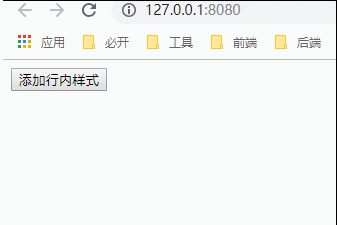

此刻我们分析下页面：

1. **首先**，在上面的 `<button>` 中，我们通过 `@click` 绑定了事件 `addStyle`：

```
<button @click="addStyle">添加行内样式</button>
```

2. **接着**，方法的编写，需要写到与 `data` 同级的 `methods` 中：

```
 methods: { // 方法
  addStyle: function(e) {
    e.toElement.style.background = "red"
  }
}
```

3. **然后**，我们通过传递参数 `e`，可以获取到点击的时候的元素，通过查找，我们发现它的样式所在的目录结构如下：

```
- button
  - toElement
    - style
      - background
```

4. **最后**，我们在用户点击按钮的时候，直接修改了它的背景。

### <a name="chapter-two-seven" id="chapter-two-seven">2.7 组件 - components</a>

> [返回目录](#catalog-chapter-two-seven)

敲黑板！敲黑板！敲黑板！  

组件是 Vue 学习的重点，组件化的 SPA 或者 SSR 页面的制作，使得我们开发起来更加随心应手。

#### <a name="chapter-two-seven-one" id="chapter-two-seven-one">2.7.1 初始组件</a>

> [返回目录](#catalog-chapter-two-seven)

在上面的章节中，我们一直使用 `template: `` ` 的形式，编写 `html` 标签。但是，随着项目的不断扩大，如果全部代码都写在一个 `template` 中，那么我们修改起来就复杂了。所以，我们应该想办法对它进行划分，例如将一个页面划分为 `header`、`content`、`footer` 三部分。这样，我们需要修改 `nav` 的时候，只需要在 `header` 中修改就可以了。  

> 页面结构

```
- app
 - header
 - content
 - footer
```

这样的思想，在 `Vue` 中体现为组件（组合起来的部件）。那么，在 `Vue` 中，需要如何做，才能比较好的做到组件的划分呢？  

**首先**，我们捋捋逻辑：

在前面的章节中，在 Vue 的定义上，我们将首个 `template` 挂载到了 id 为 `app` 的节点上。然后将 `template` 划分为三个块：`header`、`content`、`footer`。

> 在这里，我们将 `#app` 的 `template` 叫做父组件，`header` 等叫子组件，就好比父亲下面有三个儿子一样。

**然后**，我们尝试从 `new Vue` 中抽离单个组件出来：

> index.html

```
<!DOCTYPE html>
<html lang="en">

<head>
  <meta charset="UTF-8">
  <meta name="viewport" content="width=device-width,initial-scale=1.0,maximum-scale=1.0,user-scalable=no">
  <meta http-equiv="X-UA-Compatible" content="ie=edge">
  
  <title>Vue 学习</title>

</head>

<body>

  <!-- 2. Vue 挂载点 - Vue 的虚拟 DOM 在这里操作到实际渲染 -->
  <!-- 简单理解为 jQuery 的拼接字符串（并不全是） -->
  <div id="app"></div>

  <!-- 1. 引用 Vue -->
  <!-- Vue CDN - 提供 Vue 服务 -->
  <script src="https://cdn.bootcss.com/vue/2.5.21/vue.js"></script>
  <!-- Vue Router CDN - 管理路由 -->
  <script src="https://cdn.bootcss.com/vue-router/3.0.2/vue-router.js"></script>
  <!-- Axios CDN - 调用接口 -->
  <script src="https://cdn.bootcss.com/axios/0.18.0/axios.js"></script>
  
  <script>

    // 声明入口组件
    var App = {
      template: `<h1>我是入口组件</h1>`
    }

    new Vue({
      // 3. el - 挂载目标，即渲染在哪个挂载点
      el: document.getElementById('app'),
      // 4. template - 模板，即渲染到挂载点的内容
      // 最外层必须有一层包裹，例如 <div>
      template: '<app/>',
      // 5. data - 数据，即在操作中需要用到的数据
      // 可以理解为在 jQuery 中 var text = "Hello World!"
      // {{ text }} 为数据渲染到 DOM 的方式之一
      data() {
        return {
          // template 中要使用的数据
        }
      },
      // 6. methods - 方法，即我们的页面事件
      // 可以理解为在 jQuery 中定义 Function
      methods: {
        
      },
      // 7. components - 组件名称
      components: {
        // key 是组件名，value 是组件对象
        app: App
      }
    })

  </script>
</body>

</html>
```

这时候页面如下所示：


**接着**，我们分析下进行的三部曲：

1. 在 `component` 中定义并抽离 `App`
2. 在 `new Vue` 外定义 `App`
3. 在 `template` 中使用 `App`

这样，我们就做到了单个组件的抽离，及 `new Vue` 是 `App` 的父组件，`App` 是 `new Vue` 的子组件。

**最后**，既然上面做到了单个组件的抽离，现在我们实现多个组件的抽离：

> index.html

```
<!DOCTYPE html>
<html lang="en">

<head>
  <meta charset="UTF-8">
  <meta name="viewport" content="width=device-width,initial-scale=1.0,maximum-scale=1.0,user-scalable=no">
  <meta http-equiv="X-UA-Compatible" content="ie=edge">
  <title>Vue学习</title>
</head>

<body>
  <div id="app"></div>

  <script src="https://cdn.jsdelivr.net/npm/vue/dist/vue.js"></script>
  <script>
    // 声明头部组件
    var MyHeader = {
      template: `<div>我是头部</div>`
    };
    
    // 声明内容组件
    var MyContent = {
      template: `<div>我是躯体</div>`
    };

    // 声明底部组件
    var myFooter = {
      template: `<div>我是底部</div>`
    }

    new Vue({
      el: document.getElementById('app'),
      components: { // 声明要用的组件们
        // key 是组件名，value 是组件对象
        'my-header': MyHeader,
        'my-content': MyContent,
        'my-footer': myFooter
      },
      template: `
        <div>
          <my-header/>
          <my-content/>
          <my-footer/>
        </div>
      `
    })
  </script>
</body>

</html>
```

这样，我们就做到了组件的抽离。

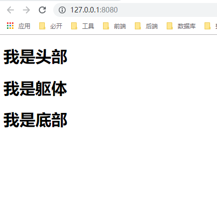

**注意：`template` 有且只有一个根节点，如果没有根节点，Vue 会给你报错。**

```
  template: `
    <my-header/>
    <my-content/>
    <my-footer/>
  `
```

上面那种写法是错误的，谨记。

做到这里，我们又可以愉快玩耍了，而且 `myHeader`、`myContent`、`myFooter` 中是可以跟 `new Vue` 一样写 `data`、`methods` 的哦~

> 例如：

```
var MyHeader = {
  data() {
    return {
      // ... 定义数据
    }
  },
  template: `<h1>我是头部</h1>`,
  methods: {
    // 定义方法
  }
};
```

#### <a name="chapter-two-seven-two" id="chapter-two-seven-two">2.7.2 父子组件通讯</a>

> [返回目录](#catalog-chapter-two-seven)

既然前面章节已经划分了父子组件，那么在这里，我们讲件更有趣的事：父子组件通讯。  

在组件间，我们 `new Vue` 相当于父亲（父组件），他有自己的 `data`。然后，子组件也会有自己的 `data`。

* 假如某天，父亲找到自己的儿子，想告诉他：`“其实你不是我亲生的，你的姓名是***”`。

那么，在 `Vue` 中，我们要怎么做，才能让它的儿子（子组件），知道它的姓究竟是什么呢？我们来看代码：

> index.html

```
<!DOCTYPE html>
<html lang="en">

<head>
  <meta charset="UTF-8">
  <meta name="viewport" content="width=device-width,initial-scale=1.0,maximum-scale=1.0,user-scalable=no">
  <meta http-equiv="X-UA-Compatible" content="ie=edge">
  
  <title>Vue 学习</title>

</head>

<body>

  <!-- 2. Vue 挂载点 - Vue 的虚拟 DOM 在这里操作到实际渲染 -->
  <!-- 简单理解为 jQuery 的拼接字符串（并不全是） -->
  <div id="app"></div>

  <!-- 1. 引用 Vue -->
  <!-- Vue CDN - 提供 Vue 服务 -->
  <script src="https://cdn.bootcss.com/vue/2.5.21/vue.js"></script>
  <!-- Vue Router CDN - 管理路由 -->
  <script src="https://cdn.bootcss.com/vue-router/3.0.2/vue-router.js"></script>
  <!-- Axios CDN - 调用接口 -->
  <script src="https://cdn.bootcss.com/axios/0.18.0/axios.js"></script>
  
  <script>

    // 子组件
    var Son = {
      template: `
        <div>我的名字：{{name}}</div>
      `,
      props: ['name']
    }

    new Vue({
      // 3. el - 挂载目标，即渲染在哪个挂载点
      el: document.getElementById('app'),
      // 4. template - 模板，即渲染到挂载点的内容
      // 最外层必须有一层包裹，例如 <div>
      template: `
        <son :name="name"></son>
      `,
      // 5. data - 数据，即在操作中需要用到的数据
      // 可以理解为在 jQuery 中 var text = "Hello World!"
      // {{ text }} 为数据渲染到 DOM 的方式之一
      data() {
        return {
          // template 中要使用的数据
          name: '皮皮虾'
        }
      },
      // 6. methods - 方法，即我们的页面事件
      // 可以理解为在 jQuery 中定义 Function
      methods: {
        
      },
      // 7. components - 组件名称
      components: {
        // key 是组件名，value 是组件对象
        son: Son
      }
    })

  </script>
</body>

</html>
```

编写完代码后，我们可以在浏览器看到，浏览器显示出了：`我的名字：皮皮虾`，这几个大字。

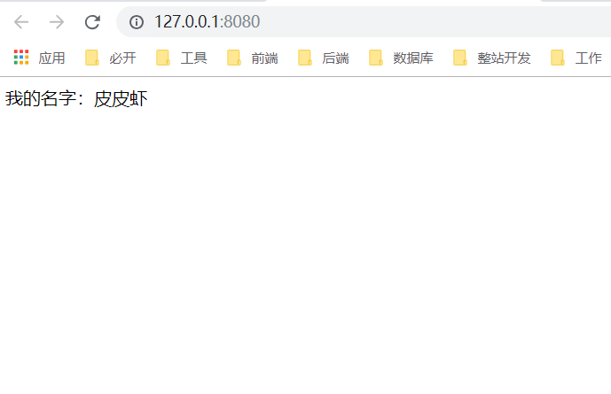

哦了，原来父亲的儿子姓 `皮`。同时，我们也就知道了，在父组件中的数据，通过 `v-bind:***` 的形式，将父组件中的 `data`，发送给子组件。而子组件呢，通过 `props` 的定义，获取到了父亲的数据。  

这样我们就做到了父组件传递数据给子组件。

#### <a name="chapter-two-seven-three" id="chapter-two-seven-three">2.7.3 共用组件</a>

> [返回目录](#catalog-chapter-two-seven)

在上面中，我们提到：

```
- App
 - my-header
 - my-content
 - my-footer
```

在 `App` 这个组件上，我们挂载了三个子组件：`myHeader`、`myContent`、`myFooter`。  

* 但是，如果某天，出现了一个女孩（共有组件），这个女孩的名字叫：`beautifulGirl`。然后不仅三个儿子（子组件）想追求她，就连父亲（父组件）也想追求她（够疯狂）。

那么，在 `Vue` 中，是通过什么方式，使父亲和儿子都有机会接触到这个女孩呢？（父子组件如何能够都可以使用共用组件）

> index.html

```
<!DOCTYPE html>
<html lang="en">

<head>
  <meta charset="UTF-8">
  <meta name="viewport" content="width=device-width,initial-scale=1.0,maximum-scale=1.0,user-scalable=no">
  <meta http-equiv="X-UA-Compatible" content="ie=edge">
  
  <title>Vue 学习</title>

</head>

<body>

  <!-- 2. Vue 挂载点 - Vue 的虚拟 DOM 在这里操作到实际渲染 -->
  <!-- 简单理解为 jQuery 的拼接字符串（并不全是） -->
  <div id="app"></div>

  <!-- 1. 引用 Vue -->
  <!-- Vue CDN - 提供 Vue 服务 -->
  <script src="https://cdn.bootcss.com/vue/2.5.21/vue.js"></script>
  <!-- Vue Router CDN - 管理路由 -->
  <script src="https://cdn.bootcss.com/vue-router/3.0.2/vue-router.js"></script>
  <!-- Axios CDN - 调用接口 -->
  <script src="https://cdn.bootcss.com/axios/0.18.0/axios.js"></script>
  
  <script>

    // 声明头部组件
    var MyHeader = {
      template: `
        <div>我是头部，我想了解<beautiful-girl></beautiful-girl></div>
      `
    };
    
    // 声明内容组件
    var MyContent = {
      template: `
        <div>我是内容区，我想了解<beautiful-girl></beautiful-girl></div>
      `
    };

    // 声明底部组件
    var myFooter = {
      template: `
        <div>我是底部，我想了解<beautiful-girl></beautiful-girl></div>
      `
    }

    // 声明共用组件
    Vue.component('beautiful-girl', {
      template: `<span>—— 美丽女孩 ——</span>`
    })

    new Vue({
      // 3. el - 挂载目标，即渲染在哪个挂载点
      el: document.getElementById('app'),
      // 4. template - 模板，即渲染到挂载点的内容
      // 最外层必须有一层包裹，例如 <div>
      template: `
        <div>
          <my-header/>
          <my-content/>
          <my-footer/>
        </div>
      `,
      // 5. data - 数据，即在操作中需要用到的数据
      // 可以理解为在 jQuery 中 var text = "Hello World!"
      // {{ text }} 为数据渲染到 DOM 的方式之一
      data() {
        return {
          // template 中要使用的数据
        }
      },
      // 6. methods - 方法，即我们的页面事件
      // 可以理解为在 jQuery 中定义 Function
      methods: {
        
      },
      // 7. components - 组件名称
      components: {
        // key 是组件名，value 是组件对象
        'my-header': MyHeader,
        'my-content': MyContent,
        'my-footer': myFooter,
      }
    })

  </script>
</body>

</html>
```

在这里，我们通过 `Vue.component('组件名',{ })` 的形式，注册了个全局组件 `beautiful-girl`，这样，父子组件都可以直接调用该组件，从而在浏览器显示为：

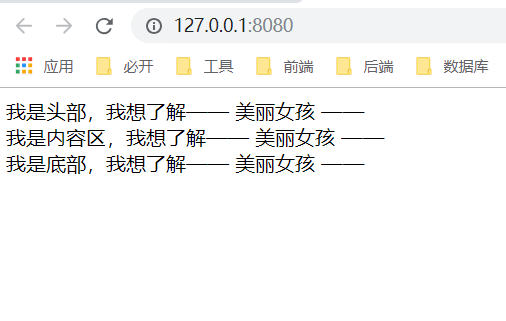

现在，父亲和儿子都可以和漂亮女孩沟通了。究竟是父亲给他们的儿子找了个后妈，还是他们儿子找到自己所爱呢？敬请期待……

### <a name="chapter-two-eight" id="chapter-two-eight">2.8 过滤器 - filter</a>

> [返回目录](#catalog-chapter-two-eight)

在工作中，我们经常需要对一些后端传回来的数据进行过滤。例如：我司 Java 小哥传回来的金钱，就是分进制的，即：1元 = 100分。所以传回个 2000，其实是 20 元。那么，在 Vue 中，我们该如何对数据进行过滤呢？  

#### <a name="chapter-two-eight-one" id="chapter-two-eight-one">2.8.1 局部过滤</a>

> [返回目录](#catalog-chapter-two-eight)

话不多说，先上代码：

> index.html

```
<!DOCTYPE html>
<html lang="en">

<head>
  <meta charset="UTF-8">
  <meta name="viewport" content="width=device-width,initial-scale=1.0,maximum-scale=1.0,user-scalable=no">
  <meta http-equiv="X-UA-Compatible" content="ie=edge">
  
  <title>Vue 学习</title>

</head>

<body>

  <!-- 2. Vue 挂载点 - Vue 的虚拟 DOM 在这里操作到实际渲染 -->
  <!-- 简单理解为 jQuery 的拼接字符串（并不全是） -->
  <div id="app"></div>

  <!-- 1. 引用 Vue -->
  <!-- Vue CDN - 提供 Vue 服务 -->
  <script src="https://cdn.bootcss.com/vue/2.5.21/vue.js"></script>
  <!-- Vue Router CDN - 管理路由 -->
  <script src="https://cdn.bootcss.com/vue-router/3.0.2/vue-router.js"></script>
  <!-- Axios CDN - 调用接口 -->
  <script src="https://cdn.bootcss.com/axios/0.18.0/axios.js"></script>
  
  <script>

    // 声明头部组件
    var MyHeader = {
      template: `
        <div>我是头部，我想了解<beautiful-girl></beautiful-girl></div>
      `
    };
    
    // 声明内容组件
    var MyContent = {
      template: `
        <div>我是内容区，我想了解<beautiful-girl></beautiful-girl></div>
      `
    };

    // 声明底部组件
    var myFooter = {
      template: `
        <div>我是底部，我想了解<beautiful-girl></beautiful-girl></div>
      `
    }

    // 声明共用组件
    Vue.component('beautiful-girl', {
      template: `<span>—— 美丽女孩 ——</span>`
    })

    new Vue({
      // 3. el - 挂载目标，即渲染在哪个挂载点
      el: document.getElementById('app'),
      // 4. template - 模板，即渲染到挂载点的内容
      // 最外层必须有一层包裹，例如 <div>
      template: `
        <p>我是钱多多，我有 {{money}} 多一点： ￥{{money | addDot}}，跟我混有出息~</p>
      `,
      // 5. data - 数据，即在操作中需要用到的数据
      // 可以理解为在 jQuery 中 var text = "Hello World!"
      // {{ text }} 为数据渲染到 DOM 的方式之一
      data() {
        return {
          // template 中要使用的数据
          money: 1000000
        }
      },
      // 6. methods - 方法，即我们的页面事件
      // 可以理解为在 jQuery 中定义 Function
      methods: {
        
      },
      // 7. components - 组件名称
      components: {
        // key 是组件名，value 是组件对象

      },
      // 8. filters - 组件内的过滤器
      filters: {
        addDot(money) {
          return (money / 1000000 + ".000000");
        }
      }
    })

  </script>
</body>

</html>
```

在上面，我们通过 `filters` 中的 `addDot` 方法，对数据进行了过滤，将 `money` 的数据，从 `10000000` 变成了 `1.000000`。

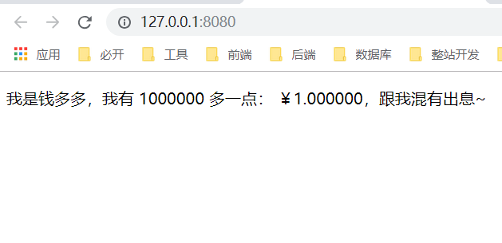

#### <a name="chapter-two-eight-two" id="chapter-two-eight-two">2.8.2 全局过滤</a>

> [返回目录](#catalog-chapter-two-eight)

然后，在尝试了局部 `filters` 的好处之后，我们还可以试试它的全局过滤器写法：

> index.html

```
<!DOCTYPE html>
<html lang="en">

<head>
  <meta charset="UTF-8">
  <meta name="viewport" content="width=device-width,initial-scale=1.0,maximum-scale=1.0,user-scalable=no">
  <meta http-equiv="X-UA-Compatible" content="ie=edge">
  
  <title>Vue 学习</title>

</head>

<body>

  <!-- 2. Vue 挂载点 - Vue 的虚拟 DOM 在这里操作到实际渲染 -->
  <!-- 简单理解为 jQuery 的拼接字符串（并不全是） -->
  <div id="app"></div>

  <!-- 1. 引用 Vue -->
  <!-- Vue CDN - 提供 Vue 服务 -->
  <script src="https://cdn.bootcss.com/vue/2.5.21/vue.js"></script>
  <!-- Vue Router CDN - 管理路由 -->
  <script src="https://cdn.bootcss.com/vue-router/3.0.2/vue-router.js"></script>
  <!-- Axios CDN - 调用接口 -->
  <script src="https://cdn.bootcss.com/axios/0.18.0/axios.js"></script>
  
  <script>

    // 全局过滤器
    Vue.filter('addDot', function(money) {
      return (money / 1000000 + ".000000");
    })
    
    new Vue({
      // 3. el - 挂载目标，即渲染在哪个挂载点
      el: document.getElementById('app'),
      // 4. template - 模板，即渲染到挂载点的内容
      // 最外层必须有一层包裹，例如 <div>
      template: `
        <p>我是钱多多，我有 {{money}} 多一点： ￥{{money | addDot}}，跟我混有出息~</p>
      `,
      // 5. data - 数据，即在操作中需要用到的数据
      // 可以理解为在 jQuery 中 var text = "Hello World!"
      // {{ text }} 为数据渲染到 DOM 的方式之一
      data() {
        return {
          // template 中要使用的数据
          money: 1000000
        }
      },
      // 6. methods - 方法，即我们的页面事件
      // 可以理解为在 jQuery 中定义 Function
      methods: {
        
      },
      // 7. components - 组件名称
      components: {
        // key 是组件名，value 是组件对象

      },
      // 8. filters - 组件内的过滤器
      filters: {
        
      }
    })

  </script>
</body>

</html>
```

最后在页面中显示为：


### <a name="chapter-two-night" id="chapter-two-night">2.9 监听数据</a>

> [返回目录](#catalog-chapter-two-night)

在 `Vue` 中，我们通过 `v-model` 做了双向数据绑定，即在页面的 `<input>` 中输入的值，在我们的 `Vue` 中可以获得数据；在 `Vue` 中定义的数据，也会即时渲染到页面中。  

但是，在代码中，我们怎样才能获取到它即时输入的数据呢？

#### <a name="chapter-two-night-one" id="chapter-two-night-one">2.9.1 侦听属性 - watch</a>

> [返回目录](#catalog-chapter-two-night)

话不多说，先上代码：

> index.html

```
<!DOCTYPE html>
<html lang="en">

<head>
  <meta charset="UTF-8">
  <meta name="viewport" content="width=device-width,initial-scale=1.0,maximum-scale=1.0,user-scalable=no">
  <meta http-equiv="X-UA-Compatible" content="ie=edge">
  
  <title>Vue 学习</title>

</head>

<body>

  <!-- 2. Vue 挂载点 - Vue 的虚拟 DOM 在这里操作到实际渲染 -->
  <!-- 简单理解为 jQuery 的拼接字符串（并不全是） -->
  <div id="app"></div>

  <!-- 1. 引用 Vue -->
  <!-- Vue CDN - 提供 Vue 服务 -->
  <script src="https://cdn.bootcss.com/vue/2.5.21/vue.js"></script>
  <!-- Vue Router CDN - 管理路由 -->
  <script src="https://cdn.bootcss.com/vue-router/3.0.2/vue-router.js"></script>
  <!-- Axios CDN - 调用接口 -->
  <script src="https://cdn.bootcss.com/axios/0.18.0/axios.js"></script>
  
  <script>
    
    new Vue({
      // 3. el - 挂载目标，即渲染在哪个挂载点
      el: document.getElementById('app'),
      // 4. template - 模板，即渲染到挂载点的内容
      // 最外层必须有一层包裹，例如 <div>
      template: `
        <div>
          <input type="text" v-model="money" />
          <span>{{money}}</span>
        </div>
      `,
      // 5. data - 数据，即在操作中需要用到的数据
      // 可以理解为在 jQuery 中 var text = "Hello World!"
      // {{ text }} 为数据渲染到 DOM 的方式之一
      data() {
        return {
          // template 中要使用的数据
          money: ''
        }
      },
      // 6. methods - 方法，即我们的页面事件
      // 可以理解为在 jQuery 中定义 Function
      methods: {
        
      },
      // 7. components - 组件名称
      components: {
        // key 是组件名，value 是组件对象

      },
      // 8. filters - 组件内的过滤器
      filters: {
        
      },
      // 9. watch - 侦听属性
      watch: {
        // key: data 属性的属性名
        money(newVal, oldVal) {
          console.log(newVal, oldVal);
        }
      }
    })

  </script>
</body>

</html>
```

这样，当我们输入 11 个 1 的过程中，浏览器的 `Console` 对应输出为：

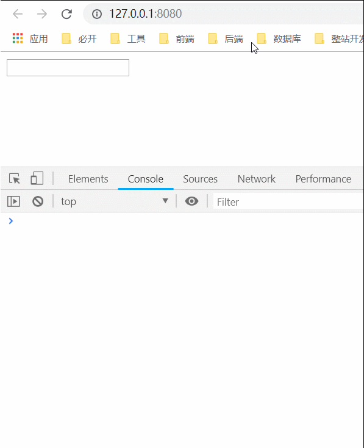

#### <a name="chapter-two-night-two" id="chapter-two-night-two">2.9.2 计算属性 - computed</a>

> [返回目录](#catalog-chapter-two-night)

在上面，我们讲了通过 `watch` 来监听 `data` 中 `number`、`string` 等字段的改变。但是，在 Vue 中，为了方便我们的监听操作，Vue 还定义了个方法：`computed`，我们可以通过 `computed`，监控我们在 `data` 中定义的全部数据。

> index.html

```
<!DOCTYPE html>
<html lang="en">

<head>
  <meta charset="UTF-8">
  <meta name="viewport" content="width=device-width,initial-scale=1.0,maximum-scale=1.0,user-scalable=no">
  <meta http-equiv="X-UA-Compatible" content="ie=edge">
  <title>Vue学习</title>
</head>

<body>
  <div id="app"></div>

  <script src="https://cdn.jsdelivr.net/npm/vue/dist/vue.js"></script>
  <script>

    new Vue({
      el: document.getElementById('app'),
      template: `
        <div>
          <input type="text" v-model="number1" />
          +
          <input type="text" v-model="number2" />
          *
          <input type="text" v-model="number3" />
          =
          {{result}}
        </div>
      `,
      data: {
        number1: 0,
        number2: 0,
        number3: 0,
        result: '',
      },
      computed: {
        // 如果原值不变，缓存不调函数的优化机制
        result: function() {
          // 监视对象，写在了函数内部，
          // 凡是函数内部有 this. 相关属性，改变都会触发当前函数
          let addSum = parseInt(this.number1) + parseInt(this.number2);
          let allSum = addSum * this.number3;
          return allSum;
        }
      }
    })

  </script>
</body>

</html>
```

其结果如下面 GIF 图所示：

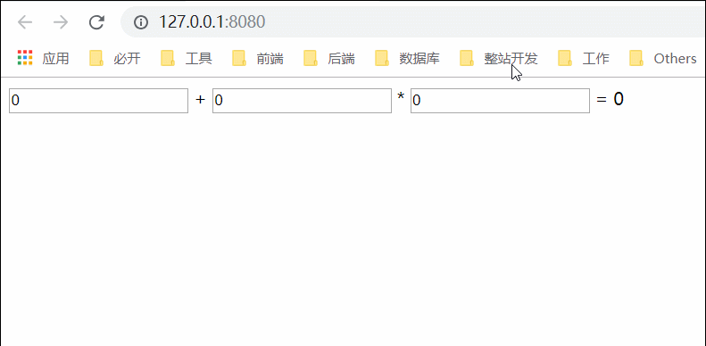

#### <a name="chapter-two-night-three" id="chapter-two-night-three">2.9.3 watch、computed 与 methods 对比</a>

> [返回目录](#catalog-chapter-two-night)

在上面，我们涉及了两个知识点：`watch` 与 `computed`。

那么，又到 “玄学” 的时刻了，都是跟监听数据打交道，我们平时使用 Vue 的时候，什么时候使用 `watch`，什么时候使用 `computed`？然后，如果我们在加上 methods，那么什么时候我们又用 methods 呢？

**首先**，我们对比下 `computed` 与 `methods`：

* `computed` 是根据 `data` 中的数据变化，而进行的操作。即 `this.任意数据` 改变了，那么，`computed` 就会进行改变；而如果 `this.任务数据` 不变，那么 `computed` 就会执行它的缓存策略，不会更新
* `methods` 一般是根据点击之类的事件来触发的，例如用户通过 `@click="方法"` 来进行数据的改变。

**然后**，我们对比下 `computed` 与 `watch`：

如果上面章节的 `computed` 方法换成 `watch`：

> index.html 代码片段

```
// 9. watch - 侦听属性
watch: {
  // key: data 属性的属性名
  result(newVal, oldVal) {
    console.log(newVal, oldVal);
    this.result = this.number1 + this.number2 * this.number3;
  }
},
```

你会发现，`result` 数据不变化了，因为这是 `computed` 才特有的玩意，如果你需要将上面章节的 `computed` 方法换成 `watch`，那么你需要：

> index.html 代码片段

```
// 9. watch - 侦听属性
watch: {
  // key: data 属性的属性名
  number1(val) {
    this.result = parseInt(this.number1) + parseInt(this.number2) * parseInt(this.number3);
  },
  number2(val) {
    this.result = parseInt(this.number1) + parseInt(this.number2) * parseInt(this.number3);
  },
  number3(val) {
    this.result = parseInt(this.number1) + parseInt(this.number2) * parseInt(this.number3);
  }
},
```

如此，小伙伴应该了解到，`watch` 如果需要完成 `computed` 的功能，那么，它需要监听每一个需要改变的属性。

**最后**，在这里，我们大致描述下 `watch` 与 `computed` 的区分：

* `computed` 强调计算，例如 `c = a + b`，`b` 是外界传来不断变化的，因为你只要显示 `c`，所以使用 `computed`。而 `watch` 属性强调自身值的变化前后的动作，如果需要完成 `c = a + b`，那么你需要 `watch` 数据 `a` 与 `b` 的变化，在这两者变化的时候，在方法中执行 `c = a + b`。
* `watch` 在处理异步操作或者开销较大的操作上有优势。
  * 执行异步操作不能串行返回结果，使用 `watch`；
  * 开销较大的操作，避免堵塞主线程，使用 `watch`；
  * 简单且串行返回的，使用 `computed`。
* `computed` 对绑定的值有依赖，如果每次操作的值不变化，则不进行计算，具有缓存特性。watch 会侦听前后变化的状态，无论操作的值是否变化，都会执行定义的函数体，所以会有 data(newVal, oldVal)。

> 如果小伙伴们较真上了，那么请查看官方文档：[计算属性和侦听器](https://cn.vuejs.org/v2/guide/computed.html)

### <a name="chapter-two-ten" id="chapter-two-ten">2.10 传递 DOM - slot</a>

> [返回目录](#catalog-chapter-two-ten)

在日常工作中，我们对一些常用的功能，例如：侧边栏、顶部导航栏等，会进行常用的封装，等我们想用的时候，就可以直接引用。那么，在 Vue 中，想实现这类功能，我们还需要了解什么？

#### <a name="chapter-two-ten-one" id="chapter-two-ten-one">2.10.1 slot 单个传递</a>

> [返回目录](#catalog-chapter-two-ten)

话不多说，先上代码：

> index.html

```
<!DOCTYPE html>
<html lang="en">

<head>
  <meta charset="UTF-8">
  <meta name="viewport" content="width=device-width,initial-scale=1.0,maximum-scale=1.0,user-scalable=no">
  <meta http-equiv="X-UA-Compatible" content="ie=edge">
  
  <title>Vue 学习</title>

</head>

<body>

  <!-- 2. Vue 挂载点 - Vue 的虚拟 DOM 在这里操作到实际渲染 -->
  <!-- 简单理解为 jQuery 的拼接字符串（并不全是） -->
  <div id="app"></div>

  <!-- 1. 引用 Vue -->
  <!-- Vue CDN - 提供 Vue 服务 -->
  <script src="https://cdn.bootcss.com/vue/2.5.21/vue.js"></script>
  <!-- Vue Router CDN - 管理路由 -->
  <script src="https://cdn.bootcss.com/vue-router/3.0.2/vue-router.js"></script>
  <!-- Axios CDN - 调用接口 -->
  <script src="https://cdn.bootcss.com/axios/0.18.0/axios.js"></script>
  
  <script>
    
    var myLi = {
      template: `
        <li><slot></slot></li>
      `
    };

    Vue.component('my-li', myLi);

    var App = {
      template: `
        <div>
          <ul>
            <my-li><button>我是第一行 button 按钮</button></my-li>
            <my-li><h3>我是第二行 h3 标签</h3></my-li>
            <my-li><a href="javascript:void(0)">我是第三行 a 导航</a></my-li>
            <my-li><span>我是第四行 span 标签</span></my-li>
          </ul>
        </div>
      `
    };

    new Vue({
      // 3. el - 挂载目标，即渲染在哪个挂载点
      el: document.getElementById('app'),
      // 4. template - 模板，即渲染到挂载点的内容
      // 最外层必须有一层包裹，例如 <div>
      template: `
        <app/>
      `,
      // 5. data - 数据，即在操作中需要用到的数据
      // 可以理解为在 jQuery 中 var text = "Hello World!"
      // {{ text }} 为数据渲染到 DOM 的方式之一
      data() {
        return {
          // template 中要使用的数据

        }
      },
      // 6. methods - 方法，即我们的页面事件
      // 可以理解为在 jQuery 中定义 Function
      methods: {
        
      },
      // 7. components - 组件名称
      components: {
        // key 是组件名，value 是组件对象
        app: App
      },
      // 8. filters - 组件内的过滤器
      filters: {
        
      },
      // 9. watch - 侦听属性
      watch: {
        // key: data 属性的属性名

      },
      // 10. computed - 计算属性
      computed: {
        // 如果原值不变，computed 会执行缓存，即不调用方法
        
      }
    })

  </script>
</body>

</html>
```

其结果如下图所示：

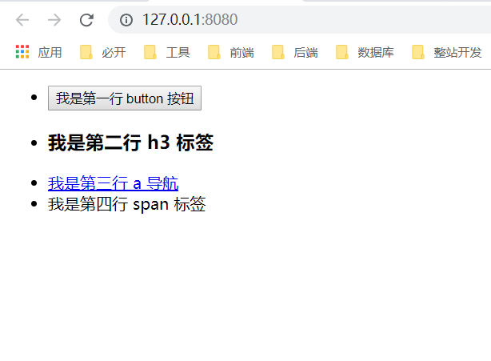

那么，上面代码中，我们干了什么？

**首先**，如上代码及其结果图，我们的 `new Vue` 中挂载了一个组件 `App`。

```
new Vue({
  el: document.getElementById('app'),
  components: {
    app: App
  },
  template: `
    <app/>
  `
})
```

**然后**，该 `App` 的目的，是想动态引用一个 `li` 组件

```
var App = {
  template: `
    <div>
      <ul>
        <li>1</li>
        <li>2</li>
        <li>3</li>
        <li>4</li>
      </ul>
    </div>
  `
};
```

**接着**，我们在全局定义 `myLi` 组件的同时，通过 `<slot></slot>` 插槽，使它能够动态地加载 `dom` 节点。

```
var myLi = {
  template: `
    <li><slot></slot></li>
  `
};

Vue.component('my-li', myLi);
```

**最后**，我们在 `App` 中，传递给它不同的 `dom` 节点，从而动态生成 `App`。

```
var App = {
  template: `
    <div>
      <ul>
        <my-li><button>我是第一行 button 按钮</button></my-li>
        <my-li><h3>我是第二行 h3 标签</h3></my-li>
        <my-li><a href="javascript:void(0)">我是第三行 a 导航</a></my-li>
        <my-li><span>我是第四行 span 标签</span></my-li>
      </ul>
    </div>
  `
};
```

这样，我们就思路清晰地知道，如何通过 `<slot></slot>` 来动态地加载 `dom` 节点，对我们 Vue 开发又有了更好的帮助。

#### <a name="chapter-two-ten-two" id="chapter-two-ten-two">2.10.2 具名 slot</a>

> [返回目录](#catalog-chapter-two-ten)

在上面中，我们谈论到了单个插槽 `slot` 的用法。但是，如果组件想根据父组件是否传递某个变量来存放插槽的数量，要怎么做呢？

> index.html

```
<!DOCTYPE html>
<html lang="en">

<head>
  <meta charset="UTF-8">
  <meta name="viewport" content="width=device-width,initial-scale=1.0,maximum-scale=1.0,user-scalable=no">
  <meta http-equiv="X-UA-Compatible" content="ie=edge">
  
  <title>Vue 学习</title>

</head>

<body>

  <!-- 2. Vue 挂载点 - Vue 的虚拟 DOM 在这里操作到实际渲染 -->
  <!-- 简单理解为 jQuery 的拼接字符串（并不全是） -->
  <div id="app"></div>

  <!-- 1. 引用 Vue -->
  <!-- Vue CDN - 提供 Vue 服务 -->
  <script src="https://cdn.bootcss.com/vue/2.5.21/vue.js"></script>
  <!-- Vue Router CDN - 管理路由 -->
  <script src="https://cdn.bootcss.com/vue-router/3.0.2/vue-router.js"></script>
  <!-- Axios CDN - 调用接口 -->
  <script src="https://cdn.bootcss.com/axios/0.18.0/axios.js"></script>
  
  <script>
    
    var mySlot = {
      template: `
        <ul>
          <li>
            <slot></slot>
          </li>
          <li>
            <slot name="one"></slot>
          </li>
          <li>
            <slot name="two"></slot>
          </li>
          <li>
            <slot name="three"></slot>
          </li>
        </ul>
      `
    };

    Vue.component('my-slot', mySlot);

    var App = {
      template: `
        <div>
          <my-slot>
            <p>Helo World!</p>
            <button slot="one">按钮</button>
            <a href="javascript:void(0)" slot="two">链接</a>
          </my-slot>
        </div>
      `
    };

    new Vue({
      // 3. el - 挂载目标，即渲染在哪个挂载点
      el: document.getElementById('app'),
      // 4. template - 模板，即渲染到挂载点的内容
      // 最外层必须有一层包裹，例如 <div>
      template: `
        <app/>
      `,
      // 5. data - 数据，即在操作中需要用到的数据
      // 可以理解为在 jQuery 中 var text = "Hello World!"
      // {{ text }} 为数据渲染到 DOM 的方式之一
      data() {
        return {
          // template 中要使用的数据

        }
      },
      // 6. methods - 方法，即我们的页面事件
      // 可以理解为在 jQuery 中定义 Function
      methods: {
        
      },
      // 7. components - 组件名称
      components: {
        // key 是组件名，value 是组件对象
        app: App
      },
      // 8. filters - 组件内的过滤器
      filters: {
        
      },
      // 9. watch - 侦听属性
      watch: {
        // key: data 属性的属性名

      },
      // 10. computed - 计算属性
      computed: {
        // 如果原值不变，computed 会执行缓存，即不调用方法
        
      }
    })

  </script>
</body>

</html>
```

效果图如下：

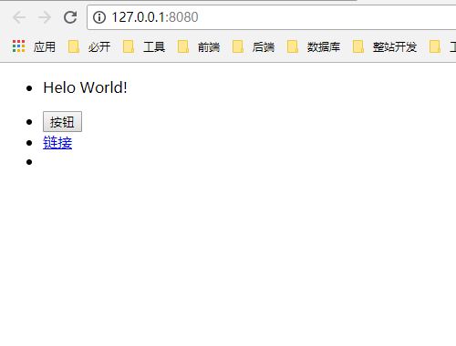

下面我们分析下，我们在代码中做了啥：

**首先**，我们通过下面代码可以知道，第一个 `li` 的 `slot` 是未命名的默认 `slot`，所以它在页面中展示为 `p` 的数据。

```
var mySlot = {
  template: `
    <ul>
      <li>
        <slot></slot>
      </li>
    </ul>
  `
};

var App = {
  template: `
    <div>
      <my-slot>
        <p>Helo World!</p>
        <button slot="one">按钮</button>
        <a href="javascript:void(0)" slot="two">链接</a>
      </my-slot>
    </div>
  `
};
```

**然后**，再观察下 `App` 中的代码 `<button slot="one">按钮</button>` 和 `<a href="javascript:void(0)" slot="two">链接</a>`，发现它们使用了 `slot="***"`，这说明了它指定了要求组件中 `<slot name="***"></slot>` 的代码接收。所以第二行第三行显示为按钮和链接。  

**最后**，由于最后一个 `li` 中 `<slot name="three"></slot>`，这个 `name="three"` 在 `App` 组件中没有用到，所以它表现为空。

### <a name="chapter-two-eleven" id="chapter-two-eleven">2.11 Vue 组件生命周期</a>

> [返回目录](#catalog-chapter-two-eleven)

在 Vue 中，什么时候进行虚拟 `dom` 渲染成 `dom`，或者什么时候销毁代码，都是有对应的钩子的：

---

* beforeCreate
* created

---

* beforeMount
* mounted

---

* beforeUpdate
* updated

---

* activated
* deactivated

---

* beforeDestory
* destory

---

关于生命周期，Vue 官方文档是有相关图示及文档的：[官方文档 - Vue 生命周期](https://cn.vuejs.org/v2/api/#%E9%80%89%E9%A1%B9-%E7%94%9F%E5%91%BD%E5%91%A8%E6%9C%9F%E9%92%A9%E5%AD%90)


下面我们通过代码演示，讲解这 5 组生命周期的用法。

#### <a name="chapter-two-eleven-one" id="chapter-two-eleven-one">2.11.1 beforeCreate & created</a>

> [返回目录](#catalog-chapter-two-eleven)

话不多说，先上代码：

> index.html

```
<!DOCTYPE html>
<html lang="en">

<head>
  <meta charset="UTF-8">
  <meta name="viewport" content="width=device-width,initial-scale=1.0,maximum-scale=1.0,user-scalable=no">
  <meta http-equiv="X-UA-Compatible" content="ie=edge">
  
  <title>Vue 学习</title>

</head>

<body>

  <!-- 2. Vue 挂载点 - Vue 的虚拟 DOM 在这里操作到实际渲染 -->
  <!-- 简单理解为 jQuery 的拼接字符串（并不全是） -->
  <div id="app"></div>

  <!-- 1. 引用 Vue -->
  <!-- Vue CDN - 提供 Vue 服务 -->
  <script src="https://cdn.bootcss.com/vue/2.5.21/vue.js"></script>
  <!-- Vue Router CDN - 管理路由 -->
  <script src="https://cdn.bootcss.com/vue-router/3.0.2/vue-router.js"></script>
  <!-- Axios CDN - 调用接口 -->
  <script src="https://cdn.bootcss.com/axios/0.18.0/axios.js"></script>
  
  <script>
    
    var lifeCycle = {
      template: `
        <div>
          我是生命周期组件
        </div>
      `,
      data: function() {
        return {
          text: 'Hello World!'
        }
      },
      beforeCreate: function() {
        // 组件创建之前
        console.log(this.text); // [Console] undefined
      },
      created: function() {
        // 组件创建之后
        console.log(this.text); // [Console] Hello World!
      }

      /*
        * 使用 lifeCycle 组件，就会触发以上的事件函数（钩子函数）
        * created 中可以操作数据，并且可以实现 Vue -> 页面 的影响
        * 应用：发起 ajax 请求
      */
    }

    var App = {
      components: {
        'life-cycle': lifeCycle
      },
      template: `
        <div>
          <life-cycle></life-cycle>
        </div>
      `
    }

    new Vue({
      el: document.getElementById('app'),
      components: {
        app: App
      },
      template: `
        <app/>
      `
    })
    
  </script>
</body>

</html>
```

在代码中可以看到，我们在 `App` 中引用了 `lifeCycle` 这个组件。  

我们通过钩子函数 `beforeCreate`（组件创建之前） 与 `created`（组件创建之后），结合 `console` 发现，这两个钩子函数对于 `data` 来说，一个在 `data` 挂载前（beforeCreate），所以打印出来的是：`undefined`，而另外一个发生在 `data` 挂载后，所以打印出来的是：`Hello World!`。

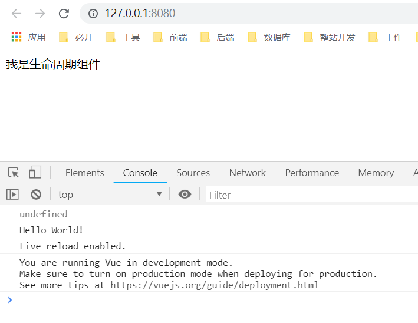

#### <a name="chapter-two-eleven-two" id="chapter-two-eleven-two">2.11.2 beforeMount & mounted</a>

> [返回目录](#catalog-chapter-two-eleven)

话不多说，先上代码：

> index.html

```
<!DOCTYPE html>
<html lang="en">

<head>
  <meta charset="UTF-8">
  <meta name="viewport" content="width=device-width,initial-scale=1.0,maximum-scale=1.0,user-scalable=no">
  <meta http-equiv="X-UA-Compatible" content="ie=edge">
  
  <title>Vue 学习</title>

</head>

<body>

  <!-- 2. Vue 挂载点 - Vue 的虚拟 DOM 在这里操作到实际渲染 -->
  <!-- 简单理解为 jQuery 的拼接字符串（并不全是） -->
  <div id="app"></div>

  <!-- 1. 引用 Vue -->
  <!-- Vue CDN - 提供 Vue 服务 -->
  <script src="https://cdn.bootcss.com/vue/2.5.21/vue.js"></script>
  <!-- Vue Router CDN - 管理路由 -->
  <script src="https://cdn.bootcss.com/vue-router/3.0.2/vue-router.js"></script>
  <!-- Axios CDN - 调用接口 -->
  <script src="https://cdn.bootcss.com/axios/0.18.0/axios.js"></script>
  
  <script>
    
    var lifeCycle = {
      template: `
        <div>
          我是生命周期组件
        </div>
      `,
      data: function() {
        return {
          text: 'Hello World!'
        }
      },
      beforeMount: function() {
        // Vue 起作用之前
        console.log(document.body.innerHTML);
      },
      mounted: function() {
        // Vue 起作用，装载数据到 DOM 之后
        console.log(document.body.innerHTML);
      }
    }

    var App = {
      components: {
        'life-cycle': lifeCycle
      },
      template: `
        <div>
          <life-cycle></life-cycle>
        </div>
      `
    }

    new Vue({
      el: document.getElementById('app'),
      components: {
        app: App
      },
      template: `
        <app/>
      `
    })

  </script>
</body>

</html>
```

那么，虽说它们的作用，一个是 Vue 起作用之前，一个是 Vue 起作用，装载数据到 DOM 之后。  

我们应该怎样才能观察到它的作用？


看到上图的红框，也许你会恍然大悟：“喔，`beforeMount` 就是我装载之前的钩子函数，而 `mounted` 是我装载之后的钩子函数，它是 Vue 作用以后的 DOM”

#### <a name="chapter-two-eleven-three" id="chapter-two-eleven-three">2.11.3 beforeUpdate & updated</a>

> [返回目录](#catalog-chapter-two-eleven)

话不多说，先上代码：

> index.html

```
<!DOCTYPE html>
<html lang="en">

<head>
  <meta charset="UTF-8">
  <meta name="viewport" content="width=device-width,initial-scale=1.0,maximum-scale=1.0,user-scalable=no">
  <meta http-equiv="X-UA-Compatible" content="ie=edge">
  
  <title>Vue 学习</title>

</head>

<body>

  <!-- 2. Vue 挂载点 - Vue 的虚拟 DOM 在这里操作到实际渲染 -->
  <!-- 简单理解为 jQuery 的拼接字符串（并不全是） -->
  <div id="app"></div>

  <!-- 1. 引用 Vue -->
  <!-- Vue CDN - 提供 Vue 服务 -->
  <script src="https://cdn.bootcss.com/vue/2.5.21/vue.js"></script>
  <!-- Vue Router CDN - 管理路由 -->
  <script src="https://cdn.bootcss.com/vue-router/3.0.2/vue-router.js"></script>
  <!-- Axios CDN - 调用接口 -->
  <script src="https://cdn.bootcss.com/axios/0.18.0/axios.js"></script>
  
  <script>
    
    var lifeCycle = {
      template: `
        <div id="update">
          <p>我是生命周期组件</p>
          <p>{{text}}</p>
          <button @click="text = '!dlroW olleH'">点击改变 text</button>
        </div>
      `,
      data: function() {
        return {
          text: 'Hello World!'
        }
      },
      // 基于数据改变，影响页面
      beforeUpdate: function() {
        // 改变前
        console.log(document.getElementById('update').innerHTML);
      },
      updated: function() {
        // 改变后
        console.log(document.getElementById('update').innerHTML);
      }

      /*
        * 在日常工作中，我们可以在事件前后拿到它的 DOM，从而做一些我们想要的操作
      */
    }

    var App = {
      components: {
        'life-cycle': lifeCycle
      },
      template: `
        <div>
          <life-cycle></life-cycle>
        </div>
      `
    }

    new Vue({
      el: document.getElementById('app'),
      components: {
        app: App
      },
      template: `
        <app/>
      `
    })

  </script>
</body>

</html>
```

在解析代码前，我们先查看它的输出：

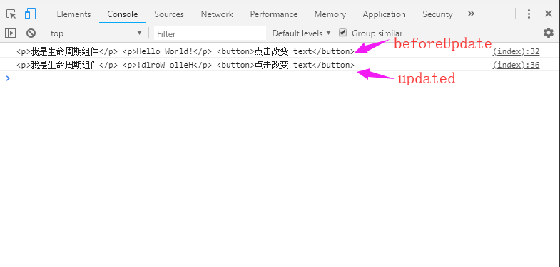

可以看出，`beforeUpdate` 可以获取原 DOM，而 `updated` 可以获取新 DOM。 

它们在上面代码中变现为：获取 `<button>` 按钮触发的事件前后 DOM 的变化，通过这个变化，我们可以在当中做一些操作，从而更好的满足我们的业务需求。

* 小结：（ `beforeMount` & `mounted` ） VS （ `beforeUpdate` & `updated` ） 

那么问题来了，`beforeMount` 这组和 `beforeUpdate` 都能监控到 DOM 的变化，它们有什么区别呢？  

答案是，一般我们如果需要在页面加载的时候，监控 DOM 的变化，那就使用 `beforeMount` 和 `mounted`；但是，如果我们想监控用户的操作（点击事件等），那么，我们就需要使用 `beforeUpdate` 和 `updated`，因为它们不像 `beforeMount` 和 `mounted` 只会在页面挂载初期执行一次，它们可以根据用户的操作被执行多次。

#### <a name="chapter-two-eleven-four" id="chapter-two-eleven-four">2.11.4 beforeDestory & destory</a>

> [返回目录](#catalog-chapter-two-eleven)

话不多说，先上代码：

> index.html

```
<!DOCTYPE html>
<html lang="en">

<head>
  <meta charset="UTF-8">
  <meta name="viewport" content="width=device-width,initial-scale=1.0,maximum-scale=1.0,user-scalable=no">
  <meta http-equiv="X-UA-Compatible" content="ie=edge">
  
  <title>Vue 学习</title>

</head>

<body>

  <!-- 2. Vue 挂载点 - Vue 的虚拟 DOM 在这里操作到实际渲染 -->
  <!-- 简单理解为 jQuery 的拼接字符串（并不全是） -->
  <div id="app"></div>

  <!-- 1. 引用 Vue -->
  <!-- Vue CDN - 提供 Vue 服务 -->
  <script src="https://cdn.bootcss.com/vue/2.5.21/vue.js"></script>
  <!-- Vue Router CDN - 管理路由 -->
  <script src="https://cdn.bootcss.com/vue-router/3.0.2/vue-router.js"></script>
  <!-- Axios CDN - 调用接口 -->
  <script src="https://cdn.bootcss.com/axios/0.18.0/axios.js"></script>
  
  <script>
    
    var lifeCycle = {
      template: `
        <div id="update">
          <p>我是生命周期组件</p>
        </div>
      `,
      // 对应父组件 v-if == false 的时候，就产生下面钩子函数，销毁当前组件
      beforeDestroy: function() { 
        // 销毁之前
        console.log('实例销毁之前调用。在这一步，实例仍然完全可用。');
      },
      destroyed: function() {
        // 销毁之后
        console.log('Vue 实例销毁后调用。调用后，Vue 实例指示的所有东西都会解绑定，所有的事件监听器会被移除，所有的子实例也会被销毁。');
      }
    }

    var App = {
      components: {
        'life-cycle': lifeCycle
      },
      data: function() {
        return {
          isExist: true
        }
      },
      template: `
        <div>
          <life-cycle v-if="isExist"></life-cycle>
          <button @click="isExist = !isExist">点击改变 子组件 状态</button>
        </div>
      `
    }

    new Vue({
      el: document.getElementById('app'),
      components: {
        app: App
      },
      template: `
        <app/>
      `
    })

  </script>
</body>

</html>
```

在这里，我们在点击 `<button>` 的时候，控制台显示为：


可以看出，当我们点击 `<button>` 的时候，我们的 `isExist` 状态（第一次时）被改变为 `false`，从而触发了 `lifeCycle` 的销毁钩子函数，在控制台打印了上面两行话。  

相应的，如果是当 `isExist` 状态变为 `true` 的时候，会触发我们的 `beforeCreate` 和 `created` 这两个钩子函数，有兴趣的小伙伴可以尝试一下，这里不做过多演示。

#### <a name="chapter-two-eleven-five" id="chapter-two-eleven-five">2.11.5 activated & deactivated</a>

> [返回目录](#catalog-chapter-two-eleven)

经过长期的工作，我们知道，如果频繁的操作 DOM，进行影响到钩子函数 `beforeCreate` 和 `created` 及 `beforeDestory` 和 `destory` 的操作，是对我们的性能会产生影响的。我们要如何防止某部分代码的频繁操作 DOM，并且监听到它的操作呢？

> index.html

```
<!DOCTYPE html>
<html lang="en">

<head>
  <meta charset="UTF-8">
  <meta name="viewport" content="width=device-width,initial-scale=1.0,maximum-scale=1.0,user-scalable=no">
  <meta http-equiv="X-UA-Compatible" content="ie=edge">
  
  <title>Vue 学习</title>

</head>

<body>

  <!-- 2. Vue 挂载点 - Vue 的虚拟 DOM 在这里操作到实际渲染 -->
  <!-- 简单理解为 jQuery 的拼接字符串（并不全是） -->
  <div id="app"></div>

  <!-- 1. 引用 Vue -->
  <!-- Vue CDN - 提供 Vue 服务 -->
  <script src="https://cdn.bootcss.com/vue/2.5.21/vue.js"></script>
  <!-- Vue Router CDN - 管理路由 -->
  <script src="https://cdn.bootcss.com/vue-router/3.0.2/vue-router.js"></script>
  <!-- Axios CDN - 调用接口 -->
  <script src="https://cdn.bootcss.com/axios/0.18.0/axios.js"></script>
  
  <script>
    
    var lifeCycle = {
      template: `
        <div id="update">
          <p>我是生命周期组件</p>
        </div>
      `,
      activated: function() {
        console.log("组件被激活了");
      },
      deactivated: function() {
        console.log("组件被停用了");
      }
    }

    var App = {
      components: {
        'life-cycle': lifeCycle
      },
      data: function() {
        return {
          isExist: true
        }
      },
      template: `
        <div>
          <keep-alive>
            <life-cycle v-if="isExist"></life-cycle>
          </keep-alive>
          <button @click="isExist = !isExist">点击改变 子组件 状态</button>
        </div>
      `
    }

    new Vue({
      el: document.getElementById('app'),
      components: {
        app: App
      },
      template: `
        <app/>
      `
    })

  </script>
</body>

</html>
```

在代码中，我们通过 `<keep-alive></keep-alive>` 这个 Vue 的内置组件，对我们子组件进行了包裹。  

然后，当我们进入页面和点击按钮时，做到了 `activated` 和 `deactivated` 这两个钩子函数的触发：

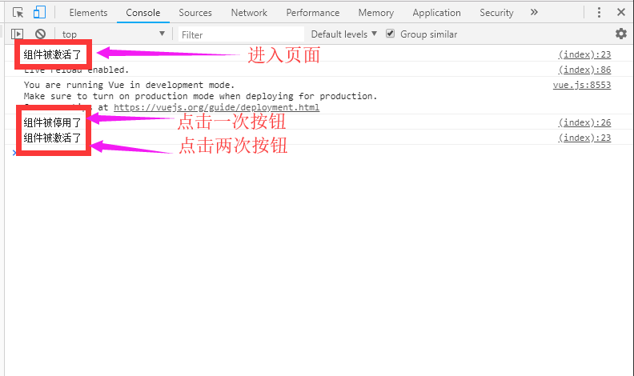

可以看出，当我们进来页面的时候，它就告诉我们，该组件被激活了。当我们第一次点击 `<button>` 按钮的时候，`isExist` 的状态变成了 `false`，即该组件被停用了。最后，我们再次点击了 `<button>`，这时候控制台再次打印 `组件被激活了`。

* 小结：这时候，希望小伙伴回到生命周期章节的开头，看官方关于生命周期的解析图，它将有助于我们更加理解声明周期。如果还是不够清晰，可以点击图片旁边的按钮，进入官方文档，查看官方关于生命周期的解析。[【返回加深学习】](#chapter-two-eleven)

### <a name="chapter-two-twelve" id="chapter-two-twelve">2.12 获取 DOM 元素</a>

> [返回目录](#catalog-chapter-two-twelve)

在日常开发中，可能有小伙伴会想到操作 DOM 元素。如果用原生的 `document.getElementById` 吧，可能太 `low` 了，所以，有没有类似于 jQuery 的 `$("#id")` 之类的呢？

#### <a name="chapter-two-twelve-one" id="chapter-two-twelve-one">2.12.1 单个 DOM 元素获取</a>

> [返回目录](#catalog-chapter-two-twelve)

话不多说，先上代码：

> index.html

```
<!DOCTYPE html>
<html lang="en">

<head>
  <meta charset="UTF-8">
  <meta name="viewport" content="width=device-width,initial-scale=1.0,maximum-scale=1.0,user-scalable=no">
  <meta http-equiv="X-UA-Compatible" content="ie=edge">
  
  <title>Vue 学习</title>

</head>

<body>

  <!-- 2. Vue 挂载点 - Vue 的虚拟 DOM 在这里操作到实际渲染 -->
  <!-- 简单理解为 jQuery 的拼接字符串（并不全是） -->
  <div id="app"></div>

  <!-- 1. 引用 Vue -->
  <!-- Vue CDN - 提供 Vue 服务 -->
  <script src="https://cdn.bootcss.com/vue/2.5.21/vue.js"></script>
  <!-- Vue Router CDN - 管理路由 -->
  <script src="https://cdn.bootcss.com/vue-router/3.0.2/vue-router.js"></script>
  <!-- Axios CDN - 调用接口 -->
  <script src="https://cdn.bootcss.com/axios/0.18.0/axios.js"></script>
  
  <script>
    
    var App = {
      template: `
        <div>
          <button ref="btn">按钮</button>
        </div>
      `,
      beforeCreate: function() {
        // 这里不能操作数据，只是初始化了事件等……
        console.log(this.$refs.btn); // [Console] undefined
      },
      created: function() {
        // 可以操作数据了
        console.log(this.$refs.btn); // [Console] undefined
      },
      beforeMount: function() {
        // new Vue 发生装载，替换 <div id="app"></div> 之前
        console.log(this.$refs.btn); // [Console] undefined
      },
      mounted: function() {
        // 装载数据之后
        console.log(this.$refs.btn.innerHTML); // [Console] 按钮
      }
    }

    new Vue({
      el: document.getElementById('app'),
      components: {
        app: App
      },
      template: `<app/>`
    })

  </script>
</body>

</html>
```

我们先查看下页面：

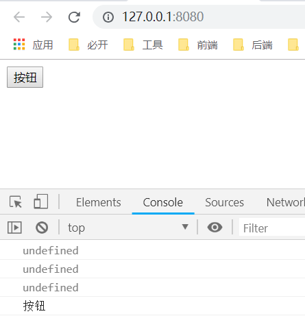

**首先**，我们在组件的 DOM 部分（`<button>`），写上 ref = "btn"。  

**然后**，我们发现只有在 `mounted` 数据装载之后这个钩子函数中，通过组件对象 `this.$refs.btn` 可以获取到元素  

**这样**，我们就知道在一些场景，如何可以方便地通过 Vue 获取到 DOM 元素了。

#### <a name="chapter-two-twelve-two" id="chapter-two-twelve-two">2.12.2 组件 DOM 元素获取</a>

> [返回目录](#catalog-chapter-two-twelve)

在上面，我们获取到了单个 DOM 节点的部分，假如我们需要获取到整个子组件，那么要怎么做呢？

> index.html

```
<!DOCTYPE html>
<html lang="en">

<head>
  <meta charset="UTF-8">
  <meta name="viewport" content="width=device-width,initial-scale=1.0,maximum-scale=1.0,user-scalable=no">
  <meta http-equiv="X-UA-Compatible" content="ie=edge">
  
  <title>Vue 学习</title>

</head>

<body>

  <!-- 2. Vue 挂载点 - Vue 的虚拟 DOM 在这里操作到实际渲染 -->
  <!-- 简单理解为 jQuery 的拼接字符串（并不全是） -->
  <div id="app"></div>

  <!-- 1. 引用 Vue -->
  <!-- Vue CDN - 提供 Vue 服务 -->
  <script src="https://cdn.bootcss.com/vue/2.5.21/vue.js"></script>
  <!-- Vue Router CDN - 管理路由 -->
  <script src="https://cdn.bootcss.com/vue-router/3.0.2/vue-router.js"></script>
  <!-- Axios CDN - 调用接口 -->
  <script src="https://cdn.bootcss.com/axios/0.18.0/axios.js"></script>
  
  <script>
    
    var tempComponent = {
      template: `
        <div>我是临时组件</div>
      `
    }

    Vue.component('temp', tempComponent);

    var App = {
      template: `
        <div>
          <temp ref="temp" />
        </div>
      `,
      mounted: function() {
        // 装载数据之后
        console.log(this.$refs.temp.$el);
      }
    }

    new Vue({
      el: document.getElementById('app'),
      components: {
        app: App
      },
      template: `<app/>`
    })

  </script>
</body>

</html>
```

我们先不急着分析，先看控制台打印出了什么；

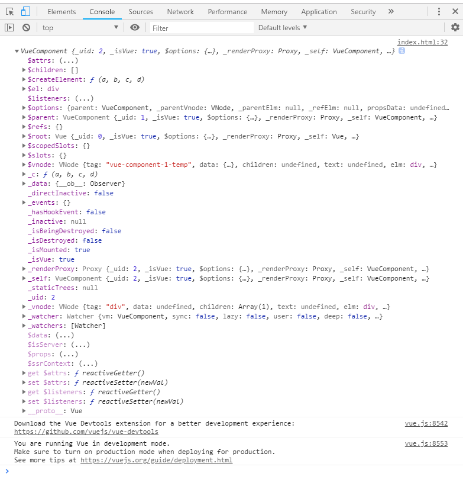

在这里可以看到它打印出了一堆关于该组件的东西，其中

* `$children` - 当前组件的子组件
* `$el` - 当前组件的元素节点
* `$parent` - 当前组件的父组件
* `$root` - 获取 `new Vue` 实例

然后发现元素 `$el`是 DOM 节点的内容，我们尝试打印出来看一下：

```
console.log(this.$refs.temp.$el);
```

> Console

```
<div>我是临时组件</div>
```

通过 Console 可以看出，`$el` 就可以打印出其中的 `<button>` 元素了。

#### <a name="chapter-two-twelve-three" id="chapter-two-twelve-three">2.12.3 Vue.nextTick()</a>

> [返回目录](#catalog-chapter-two-twelve)

当然，我们有时候操作 DOM，是想在 `data` 数据变更的时候进行操作，如果是使用上面方法，有些时候是搞不定的。  

那么，我们应该怎么做呢？

> index.html

```
<!DOCTYPE html>
<html lang="en">

<head>
  <meta charset="UTF-8">
  <meta name="viewport" content="width=device-width,initial-scale=1.0,maximum-scale=1.0,user-scalable=no">
  <meta http-equiv="X-UA-Compatible" content="ie=edge">
  
  <title>Vue 学习</title>

</head>

<body>

  <!-- 2. Vue 挂载点 - Vue 的虚拟 DOM 在这里操作到实际渲染 -->
  <!-- 简单理解为 jQuery 的拼接字符串（并不全是） -->
  <div id="app"></div>

  <!-- 1. 引用 Vue -->
  <!-- Vue CDN - 提供 Vue 服务 -->
  <script src="https://cdn.bootcss.com/vue/2.5.21/vue.js"></script>
  <!-- Vue Router CDN - 管理路由 -->
  <script src="https://cdn.bootcss.com/vue-router/3.0.2/vue-router.js"></script>
  <!-- Axios CDN - 调用接口 -->
  <script src="https://cdn.bootcss.com/axios/0.18.0/axios.js"></script>
  
  <script>
    
    var App = {
      template: `
        <div>
          <input v-if="isShow" ref="input" />
        </div>
      `,
      data: function() {
        return {
          isShow: true
        }
      },
      mounted: function() {
        // 希望在 Vue 真正渲染 DOM 到页面之后进行下面操作
        this.$nextTick(function() {
          this.$refs.input.focus();
        })
      }
    }

    new Vue({
      el: document.getElementById('app'),
      components: {
        app: App
      },
      template: `<app/>`
    })

  </script>
</body>

</html>
```

如上，通过 Vue 的全局 API `Vue.nextTick()`，我们在下次 DOM 更新循环结束之后执行延迟回调。在修改数据之后立即使用这个方法，获取更新后的 DOM。  

这个操作我们可想象下 `Promise` 的执行流程，会获得更好的体验。

## <a name="chapter-three" id="chapter-three">三 实战</a>

> [返回目录](#catalog-chapter-three)

那么，学到这里，我们应该进行一个简单的操练，来回顾我们所学知识了：

* [Vue Todolist - 功成千骨教学文章](https://github.com/LiangJunrong/document-library/blob/master/JavaScript-library/Vue/VueDemoOne.md)

* [Vue Todolist - 功成千骨代码地址](https://github.com/LiangJunrong/achievement-of-thousands-of-bones)

* [Vue Todolist - 功成千骨页面演示](http://vuetodo.jsliang.top/)


## <a name="chapter-four" id="chapter-four">四 总结</a>

> [返回目录](#catalog-chapter-four)

如上，我们入门了基础的 Vue，可能小伙伴们会觉得还是很晕。

但是，没关系，我们接下来在讲解 VueRouter、VueCli 的时候还是会使用 Vue 基础语法的，正如那句话：**万丈高楼平地起，地基还得自己起**。

多实操，多做笔记，总能熟练上去的，加油~

---

> 后记

如果小伙伴需要存放 [jsliang.top](http://jsliang.top/) 这样的纯静态页面或者 [company.jsliang.top](http://company.jsliang.top/) 这样的具有 Node 后端支持的页面，推荐购买云服务器来存放。

如果小伙伴们不知道该怎么选择云服务器，可以查看 [详细介绍](https://github.com/LiangJunrong/document-library/blob/master/other-library/Monologue/%E7%A8%B3%E9%A3%9F%E8%89%B0%E9%9A%BE.md) 或者加 **jsliang** QQ：`1741020489` 咨询。

> [](http://creativecommons.org/licenses/by-nc-sa/4.0/)  
> **jsliang** 的文档库</a> 由 [梁峻荣](https://github.com/LiangJunrong/document-library) 采用 [知识共享 署名-非商业性使用-相同方式共享 4.0 国际 许可协议](http://creativecommons.org/licenses/by-nc-sa/4.0/) 进行许可。  
> 基于 [https://github.om/LiangJunrong/document-library](https://github.om/LiangJunrong/document-library) 上的作品创作。  
> 本许可协议授权之外的使用权限可以从 [https://creativecommons.org/licenses/by-nc-sa/2.5/cn/](https://creativecommons.org/licenses/by-nc-sa/2.5/cn/) 处获得。