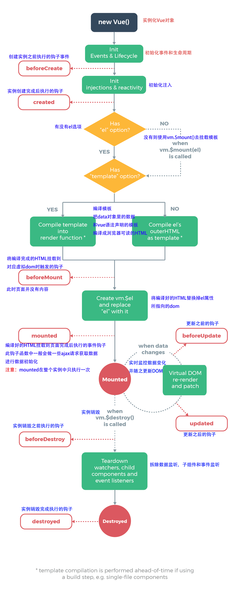

Vue 官方文档二三事
===

> Create by **jsliang** on **2019-1-14 10:40:32**  
> Recently revised in **2019-1-22 08:31:29**

记录在阅读 Vue、VueRouter、VueCli 等官方文档时的一些笔记，仅供参考，不做意见发表。

## <a name="chapter-one" id="chapter-one">一 目录</a>

| 目录 |
| --- |
| <a name="catalog-chapter-one" id="catalog-chapter-one"></a>[一 目录](#chapter-one) |
| <a name="catalog-chapter-two" id="catalog-chapter-two"></a>[二 Vue](#chapter-two) |
| &emsp;[2.1 安装](#chapter-two-one) |
| &emsp;[2.2 指令](#chapter-two-two) |
| &emsp;[2.3 生命周期钩子](#chapter-two-three) |
| &emsp;[2.4 数据监听](#chapter-two-four) |
| &emsp;[2.5 样式](#chapter-two-five) |
| &emsp;[2.6 数组操作](#chapter-two-six) |
| &emsp;[2.7 事件修饰符](#chapter-two-seven) |
| &emsp;[2.8 按键修饰符](#chapter-two-eight) |
| &emsp;[2.9 父子组件及其通讯](#chapter-two-night) |
| &emsp;[2.10 过渡动画](#chapter-two-ten) |
| &emsp;[2.11 混入](#chapter-two-eleven) |
| &emsp;[2.12 自定义指令](#chapter-two-twelve) |
| &emsp;[2.13 过滤器](#chapter-two-thirteen) |
| <a name="catalog-chapter-three" id="catalog-chapter-three"></a>[三 Vue Router](#chapter-three) |
| <a name="catalog-chapter-four" id="catalog-chapter-four"></a>[四 Vue Cli](#chapter-four) |
| <a name="catalog-chapter-five" id="catalog-chapter-five"></a>[五 Vuex](#chapter-five) |
| <a name="catalog-chapter-six" id="catalog-chapter-six"></a>[六 风格规范](#chapter-six) |
| &emsp;[6.1 命名规范](#chapter-six-one) |
| &emsp;[6.2 全局规范](#chapter-six-two) |
| &emsp;[6.3 HTMl 规范](#chapter-six-three) |
| &emsp;[6.4 JS 规范](#chapter-six-four) |
| &emsp;[6.5 CSS 规范](#chapter-six-five) |

## <a name="chapter-two" id="chapter-two">二 Vue</a>

> [返回目录](#catalog-chapter-two)

本章节内容参考自：

* [Vue 教程](https://cn.vuejs.org/v2/guide/)
* [Vue API](https://cn.vuejs.org/v2/api/)

### <a name="chapter-two-one" id="chapter-two-one">2.1 安装</a>

> [返回目录](#catalog-chapter-two)

* 如果是 0 基础，推荐通过 CDN 引用 Vue：[BootCDN](https://www.bootcdn.cn/vue/)。

```
<script src="https://cdn.bootcss.com/vue/2.5.21/vue.js"></script>
```

* 如果有 Node + Webpack 基础，推荐使用命令行工具：[Vue Cli](https://cli.vuejs.org/zh/guide/)

```
npm i @vue/cli -g
```

### <a name="chapter-two-two" id="chapter-two-two">2.2 指令</a>

> [返回目录](#catalog-chapter-two)

* **v-text** —— 将数据解析为纯文本。另外还可以使用 `{{}}`，它也会将数据解析为纯文本，与 `v-text` 的区别就是花括号在网络加载慢的时候会显示 `{{ *** }}`。
* **v-html** —— 输出真正的 HTML，在 `v-html` 中可以使用 HTML 标签，但是请注意防范 XSS 攻击。
* **v-if** —— 通过值 `true` 或者 `false` 来 **添加/删除标签**，一般会结合三元表达式使用。与 `v-show` 的区别是，`v-if` 的标签，如果为 `false` 是直接删掉该节点，而 `v-show` 是通过 `display:none` 来控制标签。同时，`v-if` 与 `v-else-if`、`v-else` 可以配套使用。
* **v-show** —— 通过值 `true` 或者 `false` 来切换 `display` **显示/隐藏标签**，一般会结合三元表达式。
* **v-for** —— 常见形式：`v-for="(item, index) in items`。`item` 是单个元素，`index` 是数组下标。其他形式：`v-for="item of items`。
* **v-bind** —— 可以通过 `v-bind` 或者其简写 `:bind` 绑定到 HTML 的属性字段上，例如 `<a>` 标签动态绑定 `url` 的时候 `:url` 或者自定义属性 `:disabled` 或者动态绑定 `class`、`style` 中使用 `:class`、`style` 等…… 
* **v-on** —— 可以通过 `v-on` 或者其简写 `@` 来绑定到 HTML 事件上，例如点击事件 `@click` 或者鼠标回车事件 `v-on:keyup.enter`。`v-on` 与 `methods` 是一对搭档。
* **v-model** —— 双向数据绑定。通常与 `<input>`、`<textarea>` 及 `<select>` 进行绑定。
* **v-once** —— 只渲染元素和组件一次。之后重新渲染，该元素及其子元素会被视为静态内容忽略。

> 详细介绍：[API - Vue.js](https://cn.vuejs.org/v2/api/#%E6%8C%87%E4%BB%A4)

---

> 小 tips

1. **v-if** 和 **v-show**：一般来说，`v-if` 有更高的切换开销，而 `v-show` 有更高的初始渲染开销。因此，如果需要非常频繁地切换，则使用 `v-show` 较好；如果在运行时条件很少改变，则使用 `v-if` 较好。
2. **v-if** 和 **v-for**：永远不要把 `v-if` 和 `v-for` 同时用在同一个元素上，例如：`v-for="user in users" v-if="user.isActive"` 就是不推荐的。建议可以通过 HTML5 的标签 `<template>` 来分开这两者，其作用类似于微信小程序的 `<block>`。如果你打死都要这么做，那么 `v-for` 具有比 `v-if` 更高的优先级。
3. **v-model**：善用三个修饰符：`v-model.lazy` 将 `input` 更新换为 `change` 更新；`v-model.number` 直接绑定数字，结合 `<input type="number">` 更好使用；`v-model.trim` 自动过滤首尾空白字符。

### <a name="chapter-two-three" id="chapter-two-three">2.3 生命周期钩子</a>

> [返回目录](#catalog-chapter-two)



### <a name="chapter-two-four" id="chapter-two-four">2.4 数据监听</a>

> [返回目录](#catalog-chapter-two)

**watch** 与 **computed**：

1. 对比一：
* `computed` 强调计算。例如 `c = a + b`，因为你只要显示 `c`，所以不需要理会 `a` 与 `b` 的值是否动态传入，只需要使用 `computed` 监察 `c` 即可。
* `watch` 属性强调自身值的变化前后的动作。如果需要完成 `c = a + b`，那么你需要 `watch` 数据 `a` 与 `b` 的变化，在这两者变化的时候，在方法中执行 `c = a + b`。

2. 对比二：
* `watch` 在处理异步操作或者开销较大的操作上有优势。执行异步操作不能串行返回结果、执行开销较大的操作避免堵塞主线程的时候，使用 `watch`。
* 简单且串行返回的，使用 `computed`。

3. 对比三：
* `computed` 对绑定的值有依赖，如果每次操作的值不变化，则不进行计算，具有缓存特性。
* `watch` 会侦听前后变化的状态，无论操作的值是否变化，都会执行定义的函数体，所以会有 `data(newVal, oldVal)`。

### <a name="chapter-two-five" id="chapter-two-five">2.5 样式</a>

> [返回目录](#catalog-chapter-two)

| 类型 | 说明 |
| --- | --- |
| `:class` | 动态绑定 Class，可以通过多分类：`:class="{ a: true, 'b', c: false }`，或者结合计算属性 `:class="computedClass"`，或者通过三元表达式：`:class="{ a ? a == 1 : a == 2 }"` |
| `:style` | 动态绑定行内样式，如果是 `font-size` 之类的，最好通过驼峰式 `fontSize` 来编写。如果采用 `:style="{styleOne, styleTwo}"` 的形式，当遇到 `transform` 时，Vue 会自动添加相应的前缀。 |

### <a name="chapter-two-six" id="chapter-two-six">2.6 数组操作</a>

> [返回目录](#catalog-chapter-two)

1. 改变原数组的方法

* `push()` - 向数组尾部添加元素
* `pop()` - 删除并导出数组最后一个元素
* `shift()` - 删除并导出数组第一个元素
* `unshift()` - 向数组开头添加元素
* `splice()` - 向数组中添加/删除元素并返回新的数组
* `sort()` - 排序
* `reverse()` - 反转数组

2. 不改变原数组的方法

* `filter()` - 过滤数组
* `concat()` - 拼接两至多个数组
* `slice()` - 获取数组指定位置数据

> 不改变原数组的方法比改变原数组的方法高效，至于怎么姿势才爽，那就看个人感受了。

### <a name="chapter-two-seven" id="chapter-two-seven">2.7 事件修饰符</a>

> [返回目录](#catalog-chapter-two)

* `.stop` - 阻止事件冒泡。例如：`@click.stop="say"` 阻止 `say` 方法传递到上一级 DOM。
* `.prevent` - 阻止默认事件。例如：`@click.prevent="say"`，阻止点击事件，然后执行 `say`。
* `.capture` - 给元素添加监听器，在一个 HTML 模块中，如果有 4 层嵌套，前 2 层使用了 `.capture` 修饰符，第 3/4 层未使用，点击第 4 层触发点击事件，则顺序为：1 -> 2 -> 4 -> 3，因为 `.capture` 会先触发。
* `.self` - 只触发该 DOM 本身的事件。相比于 `.stop` 阻止事件冒泡，`.self` 忽略事件冒泡和捕获的影响。
* `.once` - 事件将只会触发一次。例如：`@click.once='doOnce'`，`doOnce` 只会执行一次。
* `.passive` - 不要阻止事件的默认行为。例如：`v-on:scroll.passive="onScroll"`，在进行滚动的时候同时执行 `onScroll`，而不是等 `onScroll` 执行完再滚动。

### <a name="chapter-two-eight" id="chapter-two-eight">2.8 按键修饰符</a>

> [返回目录](#catalog-chapter-two)

> `v-on:keyup.13` = `@click.enter`

* `.enter` - 回车
* `.tab` - Tab 键
* `.delete` - Back Space 或者 Delete
* `.esc` - Esc 键
* `.space` - 空格键
* `.up` - 上箭头
* `.down` - 下箭头
* `.left` - 左箭头
* `.right` - 右箭头
* `.ctrl` - Ctrl 键
* `.alt` - Alt 键
* `.shift` - Shift 键

### <a name="chapter-two-night" id="chapter-two-night">2.9 父子组件及其通讯</a>

> [返回目录](#catalog-chapter-two)

* 基础组件的写法
* 全局组件与局部组件
* 父组件传递数据给子组件
* 子组件传递数据给父组件
* 父子组件的 `v-model` 实现
* `<slot>` - 默认插槽与其具名插槽
* `:is` 的灵活应用
* `<keep-alive>` 缓存状态，避免重新渲染

> 静态赋值 `props`：`title="My name is jsliang"`；动态赋值 `props`：`:title="article.title + ' by ' + article.name`；`props` 可以传入 `String`、`Number`、`Boolean`、`Array`、`Object`、`Date`、`Function`、`Symbol` 并且对其进行以上类型验证。

### <a name="chapter-two-ten" id="chapter-two-ten">2.10 过渡动画</a>

> [返回目录](#catalog-chapter-two)

* 单组件过渡 `<transition>`
* 过渡 6 状态：`v-enter`、`v-enter-active`、`v-enter-to`、`v-leave`、`v-leave-active`、`v-leave-to`
* 过渡系统 + 第三方 CSS 动画库（[Animate.css](https://daneden.github.io/animate.css/)）
* 过渡时间：`:duration`
* 过渡钩子：`@:before-enter`、`@:enter`、`@:after-enter`、`@:enter-cancelled`、`@:before-leave`、`@:leave`、`@:after-leave`、`@:leave-cancelled`
* `key` 在 `<transition>` 的作用
* 过渡模式：`in-out` 与 `out-in`
* 数字过渡
* 颜色过渡

### <a name="chapter-two-eleven" id="chapter-two-eleven">2.11 混入</a>

> [返回目录](#catalog-chapter-two)

在 Vue 中，有一群万金油般存在，高尚的临时工：`mixins`。

> **城管临时工**：干着城管的活，日常冲在第一线，有问题直接背锅。

`mixins`，在官方的称呼是：**混入**。

然而，在个人理解上，更宁愿称呼它为：**模具**。

什么意思呢？就是当你发现 `new Vue()` 中的 `data`、`methods`，在多个页面重复使用的时候，你可以将它们抽取出来，然后跟 **模具** 一样，给需要使用的每个页面，先盖个章，留个某某到此一游的印迹，再在此基础上进行开发。

举个例子：你有一个字段 `pageNo: 1`，在文章列表页、商品页都定义了，你抽取出来，存放到 `mixins.js` 中，然后在这两个页面通过 `mixins: mymixin` 盖个章，让这两个页面初始数据都存有 `pageNo: 1`。

> 以后，你就是我的小弟了~

> 项目目录

```
- src
 - mixins
 - utils
```

> src/mixins/mixins.js

```
export default {
  data() {
    return {
      message: 'hello',
      foo: 'abc'
    }
  }
}
```

> HomeHeader.vue

```
import mymixin from '../src/mixins/mixins'

new Vue({
  mixins: mymixin,
  data: function () {
    return {
      message: 'goodbye',
      bar: 'def'
    }
  },
  created: function () {
    console.log(this.$data)
    // => { message: "goodbye", foo: "abc", bar: "def" }
  }
})
```

* 选项混入
* 全局混入

> 1. extends 类似于 mixins
> 2. extends 支持单个对象，mixins 支持数组
> 3. ~~Vue.extend > Vue.component > extends > mixins，即开发的时候同时使用 extends 和 mixins，注意覆盖顺序~~

> 测试代码.html

```
<!DOCTYPE html>
<html lang="en">

<head>
  <meta charset="UTF-8">
  <meta name="viewport" content="width=device-width,initial-scale=1.0,maximum-scale=1.0,user-scalable=no">
  <meta http-equiv="X-UA-Compatible" content="ie=edge">
  
  <title>Vue 学习</title>

</head>

<body>

  <div id="app"></div>

  <!-- Vue CDN - 提供 Vue 服务 -->
  <script src="https://cdn.bootcss.com/vue/2.5.21/vue.js"></script>
  
  <script>

    var extend = {
      data() {
        return {
          number: 1
        }
      }
    }

    var mixin = {
      data() {
        return {
          number: 2
        }
      }
    }

    new Vue({
      el: '#app',
      data() {
        return {
          number: 3
        }
      },
      extends: extend,
      mixins: [mixin],
      created() {
        // 在这里不推荐同时使用 extends 与 mixins，因为会混淆
        // 如果代码是这样子的，则这里输出的是 3
        // 如果 new Vue 中没定义 number，则输出的是 2（mixins 中的值）
        // 如果 mixins 中没定义 number，则输出的是 1（extend 中的值）
        console.log(this.number); // Console：3
      }
    })

  </script>
</body>

</html>
```

### <a name="chapter-two-twelve" id="chapter-two-twelve">2.12 自定义指令</a>

> [返回目录](#catalog-chapter-two)

* 局部指令：`directives`
* 全局指令：`Vue.directive`
* 自定义指令钩子函数：`bind`、`inserted`、`update`、`componentUpdated`、`unbind`

**作用**：

* `focus` 自动聚焦

### <a name="chapter-two-thirteen" id="chapter-two-thirteen">2.13 过滤器</a>

> [返回目录](#catalog-chapter-two)

使用方法：`{{ message | messageFilter }}`，然后定义 `filters: { messageFilter(value) { // ...代码 } }`

* 局部过滤器
* 全局过滤器
* 串联过滤器

## <a name="chapter-three" id="chapter-three">三 Vue Router</a>

> [返回目录](#catalog-chapter-three)

* Vue Router 的基础使用。
* 动态路由匹配，动态设置匹配路径，动态匹配任意路径。
* 路由可以嵌套匹配，每个页面都可以有自己的 `<router-view></router-view>`。
* 编程式导航：不仅可以通过 `<router-link :to="..."></router-link>` 来定义导航链接，也可以通过 `router.push("...")` 的形式来实现。同时，我们还可以采用 `router.replace("...")` 来实现路由替换，通过 `router.go(n)` 来实现前进或者后退多少步路由。
* 命名路由的两种形式：在 `<router-link>` 中通过 `:to="{name, params}"` 或者在 `router.push()` 中通过 `{name, params}` 来定义。
* 一个页面可以同时存在多个 `<router-view>`，只需要通过给它们命名 `name` 就可以实现。
* 路由可以通过 `redirect` 进行重定向，或者通过 `alias` 取别名，从而自由地将 UI 结构映射到任意的 URL。
* 路由还可以进行传参，通过取代与 `$route` 的耦合或者通过 `props` 解耦。其中有三种模式：布尔模式、对象模式以及函数模式。
* Vue Router 的默认模式是 hash 模式，我们可以通过 `mode`，将其设置为 history 模式。
* 通过 `router.beforeEach((to, from, next) => { ... })` 来注册全局路由守卫，它会在访问某个路由前进行拦截。其中 `to` 为即将进入的目标，`from` 为当前路由即将离开的位置，`next` 类似于 Promise 的 `resolve`。在 2.5+ 版本添加了 `router.beforeResolve`，作用类似于 `router.beforeEach`
* 路由全局后置钩子：`router.afterEach((to, from) => {})`。
* 可以针对某个路由进行守卫，即在 `new VueRouter({})` 中通过 `beforeEnter: (to, from, next) => {}` 进行守卫。
* 可以直接在路由组件中定义：`beforeRouteEnter`、`beforeRouteUpdate` 以及 `beforeRouteLeave`。
* 完整的导航解析流程：
1. 导航被触发。
2. 在失活的组件里调用离开守卫。
3. 调用全局的 `beforeEach` 守卫。
4. 在重用的组件里调用 `beforeRouteUpdate` 守卫。
5. 在路由配置里调用 `beforeEnter`。
6. 解析异步路由组件。
7. 在被激活的组件里调用 `beforeRouteEnter`。
8. 调用全局的 `beforeResolve` 守卫。
9. 导航被确认。
10. 调用全局的 `afterEach` 钩子。
11. 触发 DOM 更新。
12. 用创建好的实例调用 `beforeRouteEnter` 守卫中传给 `next` 的回调函数。

* Vue Router 通过定义 `meta`，可以制定路由鉴权，缓存，标题信息等。
* 通过给 `<router-view>` 添加 `<transition>` 包裹，并给 `<transition>` 设置不同的 `name`，则添加过渡效果。同时，可以根据当前路由与目标路由的关系，动态设置过渡效果。
* Vue Router 的引用，可以让我们动态设置数据是在导航完成之后获取还是在导航完成之前获取。
* 路由可以设置滚动行为，在切换到新路由时，可以滚动到顶部或者保持原先的滚动位置。
* 当路由过多，组件过大的时候，我们应该把不同的路由对应的组件分割成不同的代码块，从而使这些路由被访问的时候才加载对应组件，从而提高加载效率。使用 `const Foo = () => import('./Foo.vue')` 即可。同时，这些组件都可以通过 `/* webpackChunkName: "***" */` 的形式，进行命名 chunk。

## <a name="chapter-four" id="chapter-four">四 Vue Cli</a>

> [返回目录](#catalog-chapter-four)

* 安装：`npm install -g @vue/cli`
* 创建项目：`vue create my-project` 或者 `vue ui`
* 兼容 VueCli 2.0 版本：`npm i @vue/cli-init`，然后就可以使用 `vue init webpack` 了。

## <a name="chapter-five" id="chapter-five">五 Vuex</a>

> [返回目录](#catalog-chapter-five)

* 为什么使用 Vuex ？

1. 数据的综合交错，很容易使代码难以维护。
2. 数据传参非常繁琐，尤其是兄弟组件。

* 什么情况下使用 Vuex ？

1. 开发大型应用
2. 数据庞大且繁杂

## <a name="chapter-six" id="chapter-six">六 风格规范</a>

> [返回目录](#catalog-chapter-six)

下面精简来自 [Vue 风格指南](https://cn.vuejs.org/v2/style-guide) 的条例，如需详细了解请访问 [Vue 风格指南](https://cn.vuejs.org/v2/style-guide)。

> 并不期望你能规规矩矩遵守，只是想让你有一套自己的编写风格，而不是一个项目一套风格，从而害人害己。

### <a name="chapter-six-one" id="chapter-six-one">6.1 命名规范</a>

> [返回目录](#catalog-chapter-six)

1. **组件名应该始终是多个单词的，根组件 App 除外**。这样做可以避免跟现有的以及未来的 HTML 元素相冲突，因为所有的 HTML 元素名称都是单个单词的。例如：`todo-item`、`TodoItem`。

2. **只要有能够拼接文件的构建系统，就把每个组件单独分成文件**。例如：

```
components/
|- TodoList.vue
|- TodoItem.vue
```

3. **单文件组件的文件名应该要么始终是单词大写开头 `PascalCase`，要么始终是横线连接 `kebab-case`**。例如：

```
components/
|- MyComponent.vue

或者

components/
|- my-component.vue
```

4. **基础文件名，即应用特定样式和约定的基础组件 (也就是展示类的、无逻辑的或无状态的组件) 应该全部以一个特定的前缀开头，比如 `Base`、`App` 或 `V`**。例如：

```
components/
|- BaseButton.vue
|- BaseTable.vue
|- BaseIcon.vue

或者

components/
|- VButton.vue
|- VTable.vue
|- VIcon.vue
```

5. **如果某个组件，像菜单栏、左侧菜单一样，全局中只拥有一个，那就以 `The` 前缀命名**。例如：

```
components/
|- TheHeading.vue
|- TheSidebar.vue
```

6. **和父组件紧密耦合的子组件应该以父组件名作为前缀命名**。例如：

```
components/
|- TodoList.vue
|- TodoListItem.vue
|- TodoListItemButton.vue
```

7. **组件名应该以高级别的 (通常是一般化描述的) 单词开头，以描述性的修饰词结尾；并且组件名应该倾向于完整单词而不是缩写**。例如：

```
components/
|- SearchButtonClear.vue
|- SearchButtonRun.vue
|- SearchInputQuery.vue
|- SearchInputExcludeGlob.vue
|- SettingsCheckboxTerms.vue
|- SettingsCheckboxLaunchOnStartup.vue

而不是

components/
|- ClearSearchButton.vue
|- ExcFromSearchInput.vue
|- LaunchOnStartupCheckbox.vue
|- RunSearchButton.vue
|- SearchInput.vue
|- TermsCheckbox.vue
```

### <a name="chapter-six-two" id="chapter-six-two">6.2 全局规范</a>

> [返回目录](#catalog-chapter-six)

1. **尽量别在组件模板中使用 JS 来 bb 套太多话语，毕竟 HTML 就尽量让它做 HTML 该有的事；更好的分类能使代码更加简洁易懂；并且将组件模板中多特性的元素分多行来写，看起来会更舒服点**。例如：

```
|- HTML

{{ normalizedFullName }}


|- JS
// 复杂表达式已经移入一个计算属性
computed: {
  normalizedFullName: function () {
    return this.fullName.split(' ').map(function (word) {
      return word[0].toUpperCase() + word.slice(1)
    }).join(' ')
  }
}

而不是

|- HTML
{{
  fullName.split(' ').map(function (word) {
    return word[0].toUpperCase() + word.slice(1)
  }).join(' ')
}}
```

2.  **尽可能在 HTML、CSS 中使用双引号（"），在 JS 中使用单引号（'）**。例如：

```
<input type="text">

<AppSidebar :style="{ width: sidebarWidth + 'px' }">

而不是

<input type=text>

<AppSidebar :style={width:sidebarWidth+'px'}>
```

### <a name="chapter-six-three" id="chapter-six-three">6.3 HTMl 规范</a>

> [返回目录](#catalog-chapter-six)

1. **在单文件组件、字符串模板和 `JSX` 中没有内容的组件应该是自闭合的，且使用 `PascalCase` 形式命名。然后在 `DOM` 模板中不应该闭合，且使用 `kebab-case` 形式命名**。例如：

```
<!-- 在单文件组件、字符串模板和 JSX 中 -->
<MyComponent/>

<!-- 在 DOM 模板中 -->
<my-component></my-component>
```

2. **尽可能统一指令书写形式，例如统一用简写形式 `@` 及 `:` 或者统一用全拼形式 `v-bind` 及 `v-on`**。

### <a name="chapter-six-four" id="chapter-six-four">6.4 JS 规范</a>

> [返回目录](#catalog-chapter-six)

1. **组件的 `data` 必须是一个函数**。当在组件中使用 `data` 属性的时候 (除了 new Vue 外的任何地方)，它的值必须是返回一个对象的函数。例如：

```
data() {
  return {
    name: 'jsliang'
  }
}
```

2. **`Prop` 的定义应该尽量详细，至少指定其类型。并且在声明的时候采用 `camelCase`，在使用的时候采用 `kekab-case`**。例如：

```
<WelcomeMessage greeting-text="hi"/>

props: {
  status: {
    type: String,
    required: true,
    validator: function (value) {
      return [
        'syncing',
        'synced',
        'version-conflict',
        'error'
      ].indexOf(value) !== -1
    }
  },
  greetingText: String
}
```

3. **总是用 `key` 配合 `v-for`**。`key` 的作用：a.`key` 的特殊属性主要用在 Vue 的虚拟 DOM 算法，在新旧 nodes 对比时辨识 VNodes。b. 在 `v-for` 中使用 `key`，方便 Vue 跟踪每个节点，从而重用和重新排序现有元素。例如：

```
<ul>
  <li v-for="item in items" :key="item.id">...</li>
</ul>

<transition>
  <span :key="text">{{ text }}</span>
</transition>
```

4. **永远不要把 `v-if` 和 `v-for` 同时用在同一个元素上**。例如：

```
<ul v-if="shouldShowUsers">
  <li
    v-for="user in users"
    :key="user.id"
  >
    {{ user.name }}
  </li>
</ul>
```

### <a name="chapter-six-five" id="chapter-six-five">6.5 CSS 规范</a>

> [返回目录](#catalog-chapter-six)

1. **为组件样式设置作用域**。给每个组件的 CSS 使用 `scoped`，避免组件之间的样式互相影响。

```
<style module>
.button {
  border: none;
  border-radius: 2px;
}
</style>
```

> [](http://creativecommons.org/licenses/by-nc-sa/4.0/)  
> **jsliang** 的文档库</a> 由 [梁峻荣](https://github.com/LiangJunrong/document-library) 采用 [知识共享 署名-非商业性使用-相同方式共享 4.0 国际 许可协议](http://creativecommons.org/licenses/by-nc-sa/4.0/) 进行许可。  
> 基于 [https://github.om/LiangJunrong/document-library](https://github.om/LiangJunrong/document-library) 上的作品创作。  
> 本许可协议授权之外的使用权限可以从 [https://creativecommons.org/licenses/by-nc-sa/2.5/cn/](https://creativecommons.org/licenses/by-nc-sa/2.5/cn/) 处获得。