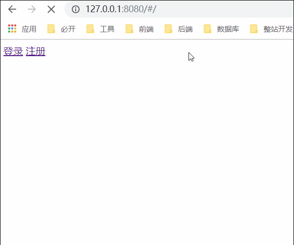
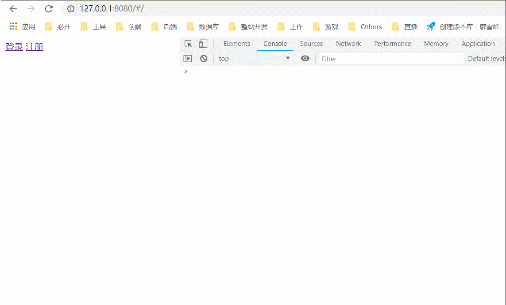
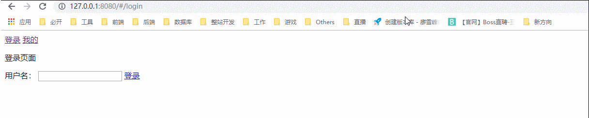

Vue Router
===

> Create by **jsliang** on **2018-11-8 13:39:39**  
> Recently revised in **2019-1-23 08:26:17**

&emsp;**饮水思源：[Vue Router 官方文档](https://router.vuejs.org/zh/)**

&emsp;Vue Router 是 Vue.js 官方的路由管理器。它和 Vue.js 的核心深度集成，让构建单页面应用变得易如反掌。包含的功能有：

* 嵌套的路由/视图表
* 模块化的、基于组件的路由配置
* 路由参数、查询、通配符
* 基于 Vue.js 过渡系统的视图过渡效果
* 细粒度的导航控制
* 带有自动激活的 CSS class 的链接
* HTML5 历史模式或 hash 模式，在 IE9 中自动降级
* 自定义的滚动条行为

## <a name="chapter-one" id="chapter-one">一 目录</a>

| 目录 |
| --- |
| <a name="catalog-chapter-one" id="catalog-chapter-one"></a>[一 目录](#chapter-one) |
| <a name="catalog-chapter-two" id="catalog-chapter-two"></a>[二 正文](#chapter-two) |
| &emsp;<a name="catalog-chapter-two-one" id="catalog-chapter-two-one"></a>[2.1 初识 Vue Router](#chapter-two-one) |
| &emsp;<a name="catalog-chapter-two-two" id="catalog-chapter-two-two"></a>[2.2 路由初定义](#chapter-two-two) |
| &emsp;<a name="catalog-chapter-two-three" id="catalog-chapter-two-three"></a>[2.3 router-view 与 router-link](#chapter-two-three) |
| &emsp;<a name="catalog-chapter-two-four" id="catalog-chapter-two-four"></a>[2.4 路由 name 的使用](#chapter-two-four) |
| &emsp;<a name="catalog-chapter-two-five" id="catalog-chapter-two-five"></a>[2.5 路由传参](#chapter-two-five) |
| &emsp;<a name="catalog-chapter-two-six" id="catalog-chapter-two-six"></a>[2.6 嵌套路由](#chapter-two-six) |
| &emsp;<a name="catalog-chapter-two-seven" id="catalog-chapter-two-seven"></a>[2.7 路由守卫](#chapter-two-seven) |

## <a name="chapter-two-one" id="chapter-two-one">2.1 初识 Vue Router</a>

> [返回目录](#catalog-chapter-two-one)

&emsp;在介绍路由的时候，我们先理清下传统开发方式的路由和 SPA 页面的路由：
* 传统开发方式中，url 改变后，立刻发起请求，响应整个页面，渲染整个页面。
* SPA 锚点值改变后，不会发起立即发起请求。发起 ajax 请求，SPA 应用会局部改变页面数据。

<br>

## <a name="chapter-two-two" id="chapter-two-two">2.2 路由初定义</a>

> [返回目录](#catalog-chapter-two-two)

<br>

&emsp;话不多说，先上代码：

> index.html

```
<!DOCTYPE html>
<html lang="en">

<head>
  <meta charset="UTF-8">
  <meta name="viewport" content="width=device-width,initial-scale=1.0,maximum-scale=1.0,user-scalable=no">
  <meta http-equiv="X-UA-Compatible" content="ie=edge">
  <title>Vue学习</title>
</head>

<body>
  <div id="app"></div>

  <script src="https://cdn.bootcss.com/vue/2.5.17-beta.0/vue.js"></script>
  
  <!-- 1. 引入 vue-router 这个插件 对象 -->
  <script src="https://cdn.bootcss.com/vue-router/3.0.1/vue-router.js"></script>
  
  <script>

    // 2. 使用插件
    Vue.use(VueRouter);

    // 3. 定义路由对象
    var Login = {
      template: `
        <div>
          <p>登录页面</p>
        </div>
      `
    }

    // 4. 创建路由挂载对象
    var router = new VueRouter({
      // 5. 配置路由对象
      routes: [
        {
          path: '/login',
          component: Login
        }
      ]
    });

    // 6. 指定路由改变局部的位置
    var App = {
      template: `
        <div>
          <router-view></router-view>
        </div>
      `
    }

    // 7. 将路由对象关联到 Vue 实例中
    new Vue({
      el: document.getElementById('app'),
      // 注意这里比平时多了个 router，标明我们要开启路由模式
      router: router,
      components: {
        app: App
      },
      template: `<app/>`
    })

  </script>
</body>

</html>
```

<br>

&emsp;在上面代码中，我们先编写第 1 步，引用 `vue-router` 这个插件。  
&emsp;然后，我们通过第 2 步 `Vue.use(VueRouter)` 来使用这个插件。  
&emsp;接着，我们通过第 3 步来定义路由对象，即我们的子组件页面。  
&emsp;再来，我们通过第 4 步创建路由挂载对象后，在第 5 步配置路由对象。  
&emsp;紧接着，我们通过第 6 步的 `<router-view></router-view>` 来挂载我们的路由子组件。  
&emsp;最后，我们通过第 7 步的操作，在 `new Vue` 中使用 `router`，从而做到 SPA 页面路由的使用。  

&emsp;那么，他们是怎么显示的呢？  
&emsp;我们在展示的页面后面敲上 `/login`，页面就会加载 `Login` 子组件。例如 **jsliang** 的就是 `http://127.0.0.1:8080/#/login`。  
&emsp;此刻页面显示为：


<br>

## <a name="chapter-two-three" id="chapter-two-three">2.3 router-view 与 router-link</a>

> [返回目录](#catalog-chapter-two-three)

<br>

&emsp;话不多说，先看代码：

> index.html

```
<!DOCTYPE html>
<html lang="en">

<head>
  <meta charset="UTF-8">
  <meta name="viewport" content="width=device-width,initial-scale=1.0,maximum-scale=1.0,user-scalable=no">
  <meta http-equiv="X-UA-Compatible" content="ie=edge">
  <title>Vue学习</title>
</head>

<body>
  <div id="app"></div>

  <script src="https://cdn.bootcss.com/vue/2.5.17-beta.0/vue.js"></script>
  
  <!-- 1. 引入 vue-router 这个插件 对象 -->
  <script src="https://cdn.bootcss.com/vue-router/3.0.1/vue-router.js"></script>
  
  <script>

    // 2. 使用插件
    Vue.use(VueRouter);

    // 3. 定义路由对象
    var Login = {
      template: `
        <div>
          <p>登录页面</p>
        </div>
      `
    }
    var Register = {
      template: `
        <div>
          <p>注册页面</p>
        </div>
      `
    }

    // 4. 创建路由挂载对象
    var router = new VueRouter({
      // 5. 配置路由对象
      routes: [
        {
          path: '/login',
          component: Login
        },
        {
          path: '/register',
          component: Register
        }
      ]
    });

    // 6. 指定路由改变局部的位置
    var App = {
      template: `
        <div>
          <router-link to="login">登录</router-link>
          <router-link to="register">注册</router-link>
          <router-view></router-view>
        </div>
      `
    }

    // 7. 将路由对象关联到 Vue 实例中
    new Vue({
      el: document.getElementById('app'),
      // 注意这里比平时多了个 router，标明我们要开启路由模式
      router: router,
      components: {
        app: App
      },
      template: `<app/>`
    })

  </script>
</body>

</html>
```

<br>

&emsp;在上一章节理解了路由的使用之后，现在我们要做的很简单，就是在第 3 步中定义 `Register` 组件，并在第 5 步中挂载该组件，最后通过第 6 步的 `<router-link to="***"></router-link>`，从而达到 `<router-view></router-view>` 中展示对应路由组件的目的。  

&emsp;下面我们查看下该代码是否能正确运行：



<br>

## <a name="chapter-two-four" id="chapter-two-four">2.4 路由 name 的使用</a>

> [返回目录](#catalog-chapter-two-four)

<br>

&emsp;在章节 `3.13.1` 和章节 `3.13.2` 中，我们都是通过 `<router-link to="***"></router-link>` 来切换路由的。  
&emsp;假如某天需求改了，产品经理或者项目经理说页面上不能用 `localhost:8080/#/login`，那样子太 `low`（真的 `low` 吗？不见得，但是它们要求就是这样，能咋办啊~ o(╥﹏╥)o），而是用 `localhost:8080/#/mylogin`，所以我们需要修改页面两次（`<router-link>` 和 `path`）……  
&emsp;又到了哪天，它丢你个文档说，我们路由定好了，照着文档写。然后你一看，我天，页面上显示的路径都和你做的不一样……所以有没有更好的方法解决这个问题呢？  
&emsp;有的，那就是给 `routes` 起 `name` 值：

> index.html 

```
<!DOCTYPE html>
<html lang="en">

<head>
  <meta charset="UTF-8">
  <meta name="viewport" content="width=device-width,initial-scale=1.0,maximum-scale=1.0,user-scalable=no">
  <meta http-equiv="X-UA-Compatible" content="ie=edge">
  <title>Vue学习</title>
</head>

<body>
  <div id="app"></div>

  <script src="https://cdn.bootcss.com/vue/2.5.17-beta.0/vue.js"></script>
  
  <!-- 1. 引入 vue-router 这个插件 对象 -->
  <script src="https://cdn.bootcss.com/vue-router/3.0.1/vue-router.js"></script>
  
  <script>

    // 2. 使用插件
    Vue.use(VueRouter);

    // 3. 定义路由对象
    var Login = {
      template: `
        <div>
          <p>登录页面</p>
        </div>
      `
    }
    var Register = {
      template: `
        <div>
          <p>注册页面</p>
        </div>
      `
    }

    // 4. 创建路由挂载对象
    var router = new VueRouter({
      // 5. 配置路由对象
      routes: [
        {
          name: 'login',
          path: '/myLogin',
          component: Login
        },
        {
          name: 'register',
          path: '/myRegister',
          component: Register
        }
      ]
    });

    // 6. 指定路由改变局部的位置
    var App = {
      template: `
        <div>
          <router-link :to="{ name: 'login' }">登录</router-link>
          <router-link :to="{ name: 'register' }">注册</router-link>
          <router-view></router-view>
        </div>
      `
    }

    // 7. 将路由对象关联到 Vue 实例中
    new Vue({
      el: document.getElementById('app'),
      // 注意这里比平时多了个 router，标明我们要开启路由模式
      router: router,
      components: {
        app: App
      },
      template: `<app/>`
    })

  </script>
</body>

</html>
```

<br>

&emsp;首先，在代码方面，我们通过沿用章节 `3.13.2` 中的代码来演示 `name` 的使用。  
&emsp;然后，在第 5 步中，我们分别给两个路由对象起了名字。  
&emsp;最后，我们在第 6 步中，通过 `:to` 来动态绑定了路由值为 `name: '***`，从而达到了我们的目的。

&emsp;这样，当我们上头想修改网址路径的时候，我们只需要到第 5 步的代码中修改即可。

<br>

## <a name="chapter-two-five" id="chapter-two-five">2.5 路由传参</a>

> [返回目录](#catalog-chapter-two-five)

<br>

&emsp;在平时开发中，我们经常给我们的 `url` 传参，那么在 Vue 开发中，Vue 是如何在路径中带参数，并且在对应路由中获取到参数的呢？  
&emsp;先上代码，先睹为快：

> index.html

```
<!DOCTYPE html>
<html lang="en">

<head>
  <meta charset="UTF-8">
  <meta name="viewport" content="width=device-width,initial-scale=1.0,maximum-scale=1.0,user-scalable=no">
  <meta http-equiv="X-UA-Compatible" content="ie=edge">
  <title>Vue学习</title>
</head>

<body>
  <div id="app"></div>

  <script src="https://cdn.bootcss.com/vue/2.5.17-beta.0/vue.js"></script>
  
  <!-- 1. 引入 vue-router 这个插件 对象 -->
  <script src="https://cdn.bootcss.com/vue-router/3.0.1/vue-router.js"></script>
  
  <script>

    // 2. 使用插件
    Vue.use(VueRouter);

    // 3. 定义路由对象
    var Login = {
      template: `
        <div>
          <p>登录页面</p>
        </div>
      `,
      // 输出路径
      created: function() {
        console.log(this.$route);
        console.log(this.$route.query);
      }
    }
    var Register = {
      template: `
        <div>
          <p>注册页面</p>
        </div>
      `,
      // 输出路径
      created: function() {
        console.log(this.$route);
        console.log(this.$route.params);
      }
    }

    // 4. 创建路由挂载对象
    var router = new VueRouter({
      // 5. 配置路由对象
      routes: [
        {
          name: 'login',
          path: '/myLogin',
          component: Login
        },
        {
          name: 'register',
          path: '/myRegister/:name',
          component: Register
        }
      ]
    });

    // 6. 指定路由改变局部的位置
    var App = {
      template: `
        <div>
          <router-link :to="{ name: 'login', query: { id: 1 } }">登录</router-link>
          <router-link :to="{ name: 'register', params:{ name: 'jsliang' } }">注册</router-link>
          <router-view></router-view>
        </div>
      `
    }

    // 7. 将路由对象关联到 Vue 实例中
    new Vue({
      el: document.getElementById('app'),
      // 注意这里比平时多了个 router，标明我们要开启路由模式
      router: router,
      components: {
        app: App
      },
      template: `<app/>`
    })

  </script>
</body>

</html>
```

<br>

&emsp;下面我们先查看其结果：



<br>

&emsp;在这里，我们有两种传参方式：

* query 传参：

&emsp;首先，在第 6 步的 `:to` 中，我们通过 `<router-link :to="{ name: 'login', query: { id: 1 } }">登录</router-link>`，设置传参的值为 `id=1`。  
&emsp;接着，在第 3 步的 `Login` 组件中定义 `created`，打印出它的对象及其参数：

```
{name: "login", meta: {…}, path: "/myLogin", hash: "", query: {…}, …}

{id: 1}
```    

&emsp;最后，在页面中路径显示为显示为：`http://127.0.0.1:8080/#/myLogin?id=1`

* params 传参：

&emsp;首先，在第 6 步的 `:to` 中，我们通过 `<router-link :to="{ name: 'register', params:{ name: 'jsliang' } }">注册</router-link>`，设置传参的值为 `name=jsliang`。  
&emsp;接着，在第 5 步中，给它的 `path` 预留个 `name` 的插槽：` path: '/myRegister/:name'`  
&emsp;然后，在第 3 步的 `Login` 组件中定义 `created`，打印出它的对象及其参数：

```
{name: "register", meta: {…}, path: "/myRegister/jsliang", hash: "", query: {…}, …}

{name: "jsliang"}
```

&emsp;最后，在页面中路径显示为：`http://127.0.0.1:8080/#/myRegister/jsliang`

<br>

&emsp;当然，小伙伴可能会考虑到传多个参数：

> query 传多个参数代码片段：`http://127.0.0.1:8080/#/myLogin?id=1&name=jsliang`

```
<router-link :to="{ name: 'login', query: { id: 1, name: 'jsliang' } }">登录</router-link>
```

<br>

> params 传多个参数代码片段：`http://127.0.0.1:8080/#/myRegister/2/梁峻荣`

```
path: '/myRegister/:id/:name'

<router-link :to="{ name: 'register', params:{ id: 2, name: '梁峻荣' } }">注册</router-link>
```

<br>

## <a name="chapter-two-six" id="chapter-two-six">2.6 嵌套路由</a>

> [返回目录](#catalog-chapter-two-six)

<br>

&emsp;在章节 `3.10 传递 DOM - slot` 中，我们提到了 `slot` 及具名 `slot` 的区分。然后，在 Vue 日常开发中，如果我们的路由只能一个 `<router-view></router-view>` 放整版页面，这是满足不了我们需求的。  
&emsp;所以，你考虑到的，大佬们也考虑到了：嵌套路由！通过不同锚点值，填入不同的组件。

> index.html

```
<!DOCTYPE html>
<html lang="en">

<head>
  <meta charset="UTF-8">
  <meta name="viewport" content="width=device-width,initial-scale=1.0,maximum-scale=1.0,user-scalable=no">
  <meta http-equiv="X-UA-Compatible" content="ie=edge">
  <title>Vue学习</title>
</head>

<body>
  <div id="app"></div>

  <script src="https://cdn.bootcss.com/vue/2.5.17-beta.0/vue.js"></script>
  
  <!-- 1. 引入 vue-router 这个插件 对象 -->
  <script src="https://cdn.bootcss.com/vue-router/3.0.1/vue-router.js"></script>
  
  <script>

    // 2. 使用插件
    Vue.use(VueRouter);

    // 3. 定义路由对象
    var Login = {
      // 8. 插槽。路由对象下中还有 <router-view>
      template: `
        <div>
          <p>登录页面</p>
          <router-link :to="{ name: 'poorManLogin' }">我是屌丝</router-link>
          <router-link :to="{ name: 'richManLogin' }">我是土豪</router-link>
          <router-view></router-view>
        </div>
      `
    }
    // 9. 二级路由子组件
    var poorManLogin = {
      template: `
        <p>屌丝登录页面</p>
      `
    }
    var richManLogin = {
      template: `
        <p>土豪登录页面</p>
      `
    }

    var Register = {
      template: `
        <div>
          <p>注册页面</p>
        </div>
      `
    }

    // 4. 创建路由挂载对象
    var router = new VueRouter({
      // 5. 配置路由对象
      routes: [
        {
          name: 'login',
          path: '/myLogin',
          component: Login,
          // 10. 定义路由下的子路由
          children: [
            {
              name: 'poorManLogin',
              path: 'loginWayOne',
              component: poorManLogin
            }, 
            {
              name: 'richManLogin',
              path: 'loginWayTwo',
              component: richManLogin
            }
          ]
        },
        {
          name: 'register',
          path: '/myRegister',
          component: Register
        }
      ]
    });

    // 6. 指定路由改变局部的位置
    var App = {
      template: `
        <div>
          <router-link :to="{ name: 'login' }">登录</router-link>
          <router-link :to="{ name: 'register' }">注册</router-link>
          <router-view></router-view>
        </div>
      `
    }

    // 7. 将路由对象关联到 Vue 实例中
    new Vue({
      el: document.getElementById('app'),
      // 注意这里比平时多了个 router，标明我们要开启路由模式
      router: router,
      components: {
        app: App
      },
      template: `<app/>`
    })

  </script>
</body>

</html>
```

<br>

&emsp;先看看代码的实现效果：


<br>

&emsp;首先，我们使用章节 `3.13.3 路由 name 的使用` 的代码，在其基础上开发，没有搞懂该章节代码的小伙伴可以先看该章节代码讲解。  
&emsp;然后，我们在第 8 步中，给路由对象再嵌套子路由：

```
// 8. 插槽。路由对象下中还有 <router-view>
template: `
  <div>
    <p>登录页面</p>
    <router-link :to="{ name: 'poorManLogin' }">我是屌丝</router-link>
    <router-link :to="{ name: 'richManLogin' }">我是土豪</router-link>
    <router-view></router-view>
  </div>
`
```

&emsp;接着，我们在第 9 步中定义这两个路由子组件。  
&emsp;最后，我们在第 10 步中，通过 `children` 数组，将这两个子组件配置到路由对象上，我们就可以在 `<router-view>` 的组件中，再定义一层 `<router-view>`，并使用它，从而做到嵌套路由的开发。

&emsp;看到这里，小伙伴们是不是也想到了，可以用嵌套路由来满足用单页应用来开发多页应用的目的~

<br>

## <a name="chapter-two-seven" id="chapter-two-seven">3.7 路由守卫</a>

> [返回目录](#catalog-chapter-two-seven)

<br>

&emsp;话不多说，先上代码：

> index.html

```
<!DOCTYPE html>
<html lang="en">

<head>
  <meta charset="UTF-8">
  <meta name="viewport" content="width=device-width,initial-scale=1.0,maximum-scale=1.0,user-scalable=no">
  <meta http-equiv="X-UA-Compatible" content="ie=edge">
  <title>Vue学习</title>
</head>

<body>
  <div id="app"></div>

  <script src="https://cdn.bootcss.com/vue/2.5.17-beta.0/vue.js"></script>
  
  <!-- 1. 引入 vue-router 这个插件 对象 -->
  <script src="https://cdn.bootcss.com/vue-router/3.0.1/vue-router.js"></script>
  
  <script>

    // 2. 使用插件
    Vue.use(VueRouter);

    // 3. 定义路由对象
    var Login = {
      // 简单的登录页面
      template: `
        <div>
          <p>登录页面</p>
          <span>用户名：</span>
          <input type="text" v-model="userName" />
          <a href="javascript:void(0)" @click="login">登录</a>
        </div>
      `,
      data() {
        return {
          userName: ''
        }
      },
      methods: {
        // 点击登录按钮，将输入框的内容记录为 userName，并存到 localStorage
        login: function(e) {
          localStorage.setItem("userName", this.userName);
          console.log("存储了用户名：" + this.userName);
        }
      }
    }
    var User = {
      template: `
        <div>
          <p>用户页面</p>
        </div>
      `
    }

    // 4. 创建路由挂载对象
    var router = new VueRouter();

    // 5. 动态配置路由对象，设置路由规则
    router.addRoutes([
        {
          path: '/',
          redirect: {
            name: 'login'
          }
        },
        {
          name: 'login',
          path: '/login',
          component: Login
        },
        {
          name: 'user',
          path: '/user',
          component: User,
          // 权限控制，给用户界面定义全局路由守卫
          meta: {
            isChecked: true
          }
        }
    ])

    // 6. 定义路由守卫
    router.beforeEach(function(to, from, next) {
      // 如果是前往登录页或者首页，则直接前往
      if(to.name === "login" || to.path === '/') {
        // 执行下一步，不定义就会卡住
        next();
      } else {
        // 如果是前往用户页，则需要进行判断 localStorage 是否有值
        if(!localStorage.getItem("userName")) {
          alert('请登录~');
          next({
            name: 'login'
          })
        } else {
          // 执行下一步，不定义就会卡住
          next();
        }
      }
    })

    // 7. 指定路由改变局部的位置
    var App = {
      template: `
        <div>
          <router-link :to="{ name: 'login' }">登录</router-link>
          <router-link :to="{ name: 'user' }">我的</router-link>
          <router-view></router-view>
        </div>
      `
    }

    // 8. 将路由对象关联到 Vue 实例中
    new Vue({
      el: document.getElementById('app'),
      // 注意这里比平时多了个 router，标明我们要开启路由模式
      router: router,
      components: {
        app: App
      },
      template: `<app/>`
    })

  </script>
</body>

</html>
```

<br>

&emsp;看下代码成果：



<br>

&emsp;首先，我们做下知识点讲解：

* 路由元数据 `meta`
1. `meta` 是对于路由规则是否需要验证权限的配置。
2. 在路由对象中和 `name` 属性同级的代码上添加 `{ meta: { isChecked: true }}` 即可做标记。

* 路由钩子 
1. 路由钩子发生在权限控制的函数执行时期。在每次路由匹配后，渲染组件到 `router-view` 之前触发。
2. `router.beforeEach(function(to, from, next){  })`
3. `next()` 有三种状态：1.`next()` 为放行，即路由可以正常跳转；2.`next(false)` 为取消用户导航的行为，即不放行；3.`next({name:'***'})` 为重定向到某个页面。

&emsp;然后，在 `index.html` 中，我们在第 3 步中，做了个简单登录页面，将用户输入的信息 `userName`，存储到了 `localStorage`。  
&emsp;接着，在第 5 步中，我们对 `user` 路由，做了 `meta` 判断，进行权限控制。  
&emsp;最后，我们在第 6 步中，定义了路由守卫，先判断是哪个页面登录，如果是登录页或者首页，则直接前往；如果是用户页，则进行 `localStorage` 判断，如果用户输入了并保存了 `userName`，则跳往用户页，否则不给跳转。

&emsp;如此，我们做到了路由守卫。

<br>

> [](http://creativecommons.org/licenses/by-nc-sa/4.0/)  
> **jsliang** 的文档库</a> 由 [梁峻荣](https://github.com/LiangJunrong/document-library) 采用 [知识共享 署名-非商业性使用-相同方式共享 4.0 国际 许可协议](http://creativecommons.org/licenses/by-nc-sa/4.0/) 进行许可。  
> 基于 [https://github.om/LiangJunrong/document-library](https://github.om/LiangJunrong/document-library) 上的作品创作。  
> 本许可协议授权之外的使用权限可以从 [https://creativecommons.org/licenses/by-nc-sa/2.5/cn/](https://creativecommons.org/licenses/by-nc-sa/2.5/cn/) 处获得。