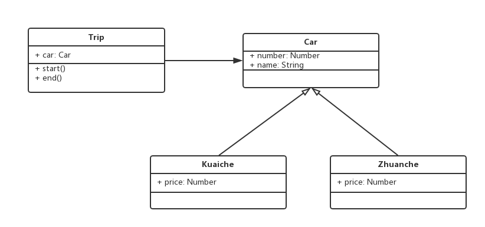
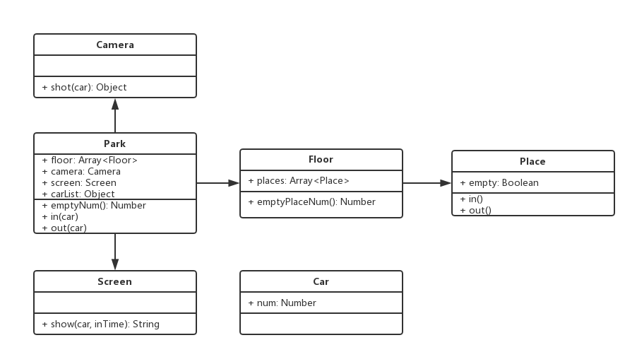

设计模式手册 - 2 - 面向对象
===

> create by **jsliang** on **2018年8月24日08:00:00**  
> Recently revised in **2018-10-28 10:54:44**

> 未完善版，待完善。

## 第二章 面向对象

### 2.1 概念
&emsp;什么是面向对象？大概1000个人有1001个解释。在这里，jsliang也不去做着1001种解释了，你看着烦我写着累，所以咱用大俗话强行解释一通，懂的就过了，不懂的还不查百度/Chrome就是你的过了。  
&emsp;说起面向对象，我们就要结合面向过程来说了。下面我们有一个游戏场景：  

&emsp;**游戏过程：**
1. 皮皮虾打开自己的控制面板，检查了下自己状态；
2. 皮皮虾往画面右边走了两步；
3. 皮皮虾夹了下象拔蚌；
4. 皮皮虾受到了象拔蚌的甩鞭反击；
5. 皮皮虾打开自己的控制面板，检查了下自己状态；
6. 皮皮虾发现状态不对，赶紧逃跑。

&emsp;**面向过程：**
1. 描绘一只皮皮虾，一个象拔蚌，一个战斗场景;
2. 编写弹窗，显示皮皮虾状态;
3. 编写动画，皮皮虾在游戏场景向右移动两步;
4. 编写动画，皮皮虾攻击象拔蚌;
5. 编写动画，象拔蚌攻击皮皮虾;
6. 编写弹窗，弹窗显示皮皮虾状态;
7. 编写动画，皮皮虾退出战斗场景；
8. 编写动画，败北动画。

&emsp;**面向对象：**  
> **准备：**
> * 皮皮虾库。存放了`皮皮虾`的`属性状态`、`动作`……
> * 象拔蚌库。存放了`象拔蚌`的`属性状态`、`动作`……
> * 游戏场景库。存放了`二维坐标`、`移动动画`、`战败场景`、`胜利场景`……
1. 调用了皮皮虾的`属性状态`。
2. 调用了皮皮虾的`属性状态`中的`头像`，调用了游戏场景库中的`移动动画`，传了两个`二位坐标`，皮皮虾从左移到右，顺带调用了皮皮虾的`跑步动作`。
3. 调用了皮皮虾的`攻击动作`，耍出一套降象十八剪。
4. 调用了象拔蚌的`攻击动作`，顺带调用了皮皮虾的`受击动作`。
5. 调用了皮皮虾的`属性状态`。
6. 调用了皮皮虾`败北`的动作，顺带调用了场景库的`战败场景`。

&emsp;你可能会说，不对啊！面向对象还要做准备，这样不是比面向过程更复杂吗？如果你游戏就这么个场景，那么，使用面向对象就得不偿失了，毕竟做准备也要花功夫的。但是，如果你的游戏，还有火影大战海贼王，也是调用同样的游戏场景库，如果你使用面向过程，是不是要复制粘贴或者重新写过，但是面向对象只需要调用已经写好的游戏场景库，从而省下了大笔时间。  
&emsp;这么说你可能还迷糊，说了那么多话，面向对象究竟长啥样？别急，我们代码的世界见：
```
class Person {
    constructor(name, age) {
        this.name = name;
        this.age = age;
    }
    eat() {
        alert(`${this.name} eat something`);
    }
    speak() {
        alert(`My name is ${this.name}, age ${this.age}`)
    }
}

let jsliang = new Person("jsliang");
jsliang.eat();

let JavaScriptLiang = new Person("JavaScriptLiang");
JavaScriptLiang.speak();
```
&emsp;在这段代码中，我们使用了封装了个Person的类（如果小伙伴你仅知道ES5，没见过ES6的语法，建议先去看下ES6），然后，jsliang调用了eat这个吃饭的动作，JavaScriptLiang调用了speak这个说话的动作，下次run()、sleep()这些我们也可以放进去，从而实现每个人都可以有属于自己的一套动作。这就是面向对象写法。  
&emsp;很好，经这么一说，jsliang算是勉强过了一遍什么是面向过程和面向对象了。如果小伙伴还是不懂，嗯，如果你没看到开篇那句话的话，那你还是不懂吧~先跟着jsliang撸一遍面向对象再说！

<br>

### 2.2 三要素
#### 2.2.1 继承
&emsp;继承，简单来说，就是子类继承父类。继承可将公共方法抽离出来，提高复用，减少冗余。
```
//父类： 人类Person
class People {
    constructor(name, age) {
        this.name = name;
        this.age = age;
    }
    eat() {
        alert(`${this.name} eat something`);
    }
    speak() {
        alert(`My name is ${this.name}, age ${this.age}`);
    }
}
//子类： 学生Student
class Student extends People {
    constructor(name, age, id) {
        super(name, age);
        this.id = id;
    }
    study() {
        alert(`${this.name} ID is ${this.id}`);
    }
}

let jsliang = new People("jsliang", 23);
jsliang.speak();

// 在这里，子类学生继承了父类人类，学生既可以调用study()类
// 也可以调用父类中的eat()和speak()
let studentLiang = new Student("jsliang", 18, "003");
studentLiang.study();
studentLiang.eat();
```

<br>

#### 2.2.2 封装
&emsp;封装，简单来说，就是数据的权限和保密。封装的作用有：1、减少耦合，不该外露的不外露；2、利于数据、接口的权限管理  
&emsp;封装有三个关键字：public(完全开放)、protected(对子类开放)、private(对自己开放)。  
&emsp;目前来说，ES6不支持封装，而TypeScript支持。所以，为了做到封装效果，我们可以约定下划线 _ 开头的属性是 private (实际不安全)  
```
//父类： 人类Person
class People {
    public name;
    public age;
    protected weight; // 定义 protected 属性。受保护的，只有自己和其子类能访问，并且只能在类里面访问，外部调用不会成功
    constructor(name, age) {
        this.name = name;
        this.age = age;
        this.weight = 120;
    }
    eat() {
        alert(`${this.name} eat something`);
    }
    speak() {
        alert(`My name is ${this.name}, age ${this.age}`);
    }
}
//子类： 学生Student
class Student extends People {
    public id;
    private girlfriend // 定义private属性
    constructor(name, age, id) {
        super(name, age);
        this.id = id;
        this.girlfriend = 'xiaoli' //由于 girlfriend 字段是私有的，所以 People 无法获取，而且只有在 Student 这个类的内部才能访问，外部是无法知道的。但是会有个 bug ，如果你 New 出无数个学生，然后所有学生的女朋友都会叫 xiaoli ，但是这些学生不知道。
    }
    study() {
        alert(`${this.name} ID is ${this.id}`);
    }
    getWeight() {
        alert(`$this.weight`); // 由于 weight 是受保护的，只有父类和继承它的子类能访问，所以学生类也可以访问体重。
    }
}

let xiaoming = new Student('xiaoming', 10, '001');
xiaoming.getWeight();
alert(xiaoming.girlfriend); // 语法error,因为girlfriend是受保护的
```

<br>

#### 2.2.3 多态
&emsp;多态，同一接口不同实现。在JavaScript中应用极少，因为多态是需要结合后端语言的接口、重写、重载等功能。多态的优点：1、保持子类的开放性和灵活性；2、面向接口编程；3、JavaScript引用极少。  
```
class People {
    constructor(name) {
        this.name = name;
    }
    saySomething() {
        alert(`Hello, my name is ${this.name}`);
    }
}
class A extends People {
    constructor(name) {
        super(name);
    }
    saySomething() {
        alert(`Hello, my name is A.`);
    }
}
class B extends People {
    constructor(name) {
        super(name);
    }
    saySomething() {
        alert(`Hello, my name is B`);
    }
}

let a = new A('a');
a.saySomething();

let b = new B('b');
b.saySomething();
```
&emsp;在上面的例子中，我们可以看出，A 类继承了 People 类，同时，A 类重写了 saySomething() 方法，B 类也是如此，因而，做到了多态效果。

<br>

2.2.4 应用
&emsp;jQuery是使用面向对象编写的。
```
class jQuery {
    constructor(selector) {
        let slice = Array.prototype.slice;
        let dom = slice.call(document.querySelectorAll(selector));
        let len = dom ? dom.length : 0;
        for(let i = 0; i < len; i++) {
            this[i] = dom[i];
        }
        this.length = len;
        this.selector = selector || '';
    }

    append(node) {
        console.log(`I do append.`);
    }

    addClass(name) {
        console.log(`I do addClass`);
    }

    html(data) {
        console.log(`I do html`);
    }
    // 此处省略若干API
}

window.$ = function(selector) {
    // 工厂模式
    return new jQuery(selector);
}

var $p = $('p');
console.log($p); // jQuery { 0:p; length:1; selector:"p" }
console.log($p.addClass("yes")); // I do addClass
```

<br>

### 2.3 设计原则
* 什么是设计？设计即是按照哪一种思路或者标注来实现功能。功能相同的代码，可以有不同设计方案来实现。如果仅仅是几行代码，设计可能会浪费时间。但是，伴随着需求的增加，设计的作用就体现出来了。
* 有哪些设计原则？
  * 准则1：小即是美。在一开始的时候，jQuery仅仅只有90KB左右。然后，到了Vue.js这边，就只剩30KB左右。而现在，听说有个6KB的js文件，能做到非常好的JavaScript性能。所以，将来的JavaScript一定会往小而精的方面发展，在内核小而美的基础上，发展周边生态。同时，我们的周边生态，一定是有意义的，有作用的，从而产生各部分之和大于它们的原集合，要不然我们就不需要对框架进行分离了，我们直接将周边生态内置于框架内就行了。我们不仅要做到JavaScript框架的小而美，在代码中，我们应该也尽量用精炼的单词，编写精简的代码。
  * 准则2：让每个程序只做好一件事。代码不是万能钥匙，能开车，能开锁。我们的代码，最好能指定某某部分代码实现某个功能，做到分工合理。如果有部分代码，既可以画canvas，又可以操作dom，听起来很美好，实际上，当你接替上一任程序猿的时候，你要把它的具体功能实现猜一遍，它是做这件事的？还是那件事？同时，每个程序，如果是进行数字操作的，那么，就不应做弹窗返回个字符串之类的操作，以免造成混淆。
  * 准则3：快速建立原型。编程界有个词，叫做敏捷开发。当客户提出一个需求的时候，如果你不先通过建立原型，满足用户的需求。随着时间迁移，客户可能会根据市场变化，而修改他原本的决定，从而导致你一直跟着客户变动。所以，在客户提出需求的一刻，我们应该快速建立原型，满足客户的基本需求，然后在进行深度开发。
  * 准则4：舍弃高效率而取可移植性。如果你从事于某个具体行业，该行业可能做了大量的重复性工作。那么，你应该考虑，朝可移植性进行开发，虽然前期可能浪费一些效率，但是，后期的效率提升是值得拥有的。同时，我们在进行可移植性设计的时候，应该尽可能满足`绝大多数`用户的需求，避免为了极个别的用户，而抛弃大部队。如果花费20%的成本解决80%的需求，那么我们就是胜利的。如果为了20%的需求，浪费掉80%的成本，那么，我们就是失败的。
  * 准则5：采用纯文本来存储数据。大部分人都知道，计算机只认识010101这个二进制数值，文本是二进制的升级版1，图片是二进制的升级版2，视频是二进制的升级版*……所以，越贴近二进制的东东，越小且越容易被计算机识别，因而我们推荐采用纯文本来实现数据存储。效率快存储方便。
  * 准则6：避免强制性的用户界面。现在是以用户为主的时代。如果是00年以前，计算机流行不普遍的时候，强制用户接受某软件、某网站，可以轻松做到。但是，现在如果你的界面做得不好，你的功能开发地不完美，你又不去修改，那么，客户就会离你而去，因为你的竞争对手已经把你的问题给解决了。所以，我们应该避免强制性的用户界面，实现界面可调整，实现功能可定制化，允许用户定制环境，从而赢取更多的客户。
  * 准则7：让每个程序都称为过滤器。
* 什么是5大设计原则？五大设计原则为：SOLID。
  * __S - 单一职责原则__：1、一个程序只做好一件事；2、如果功能过于复杂就拆分开，让每个部分保持独立。
  * O - 开放封闭原则：1、对扩展开放，对修改封闭；2、增加需求时，扩展新代码，而非修改已有代码；3、这是软件的终极目标。
  * L - 李？里氏替换原则：1、子类能覆盖父类；2、父类能出现的地方子类就能出现。
  * I - 接口独立原则：1、保持接口的单一独立，避免出现“胖接口”；2、JavaScript中没有接口（TypeScript例外），使用较少；3、类似于单一职责原则，这里更关注接口。
  * D - 依赖导致？倒置原则：1、面对接口编程，依赖于抽象而不依赖于具体；2、使用方只关注接口而不关注具体类的实现。  

&emsp;在设计原则中，S O 体现较多，详细介绍；而L I D 体现较少，但是需要了解其用意。

* 有没有具体例子？有的：
```
// 加载图片
function loadImg(src) {
    var promise = new Promise(function (resolve, reject)  {
      var img = document.createElement('img');
      img.onload = function() {
          resolve(img);
      };
      img.onerror = function() {
          reject('图片加载失败');
      };
      img.src = src;
    });
    return promise;
}

var src = 'https://www.imooc.com/static/img/index/logo_new.png';
var result = loadImg(src);

result.then(function(img) {
    // part1
    console.log('ing.width', img.width);
    return img;
}).then(function(img) {
    // part2
    console.log('img.height', img.height);
}).catch(function(ex) {
    // 统一捕获异常
    console.log(ex);
})
```
在这里，实现了单一职责原则和开放封闭原则。
  1. 单一职责原则：每个 then 中的逻辑只做好一件事。
  2. 开放封闭原则：如果新增需求，扩展 then 。
  3. 对扩展开放，对修改封闭。

<br>

### 2.4 设计模式
* 何为设计？
* 何为模式？
* 如何从设计到模式？
* 设计模式分为多少种？23种，大致可以分为创建型、组合型、行为型。
  * 创建型：1、工厂模式（工厂方法模式，抽象工厂模式，建造者模式）；2、单例模式；3、原型模式
  * 结构型：1、适配器模式；2、装饰器模式；3、代理模式；4、外观模式；5、桥接模式；6、组合模式；7、享元模式。
  * 行为型-1：1、策略模式；2、模板方法模式；3、观察者模式；4、迭代器模式；5、职责连模式；6、命令模式。
  * 行为型-2：1、备忘录模式；2、状态模式；3、访问者模式；4、中介者模式；5、解释器模式。
* 如何学习设计模式？
  * 明白每个设计的道理和用意；
  * 通过经典应用体会它的真正使用场景；
  * 编码时多思考，尽量模仿。

<br>

### 2.5 实例
* 题目一：
  * 打车时，可以打专车或者快车。任何车都有车牌号和名称。
  * 不同车价格不同，快车每公里1元，专车每公里2元。
  * 行程开始时，显示车辆信息。
  * 行程结束时，显示打车金额（假定行程就5公里）。  

&emsp;问：1、画出UML类图；2、用ES6语法写出该示例。  
&emsp;答：
1. UML类图


2. ES6代码
```
class Car {
    constructor(number, name) {
        this.number = number;
        this.name = name;
    }
}

class Kuaiche extends Car {
    constructor(number, name) {
        super(number, name);
        this.price = 1;
    }
}

class Zhuanche extends Car {
    constructor(number, name) {
        super(number, name);
        this.price = 2;
    }
}

class Trip {
    constructor(car) {
        this.car = car;
    }
    start() {
        console.log(`行程开始，名称： ${this.car.name}, 车牌号：${this.car.price}`);
    }
    end() {
        console.log(`行程结束，价格：` + (this.car.price * 5));
    }
}

let car = new Kuaiche(100, '桑塔纳');
let trip = new Trip(car);
trip.start(); // 行程开始，名称： 桑塔纳, 车牌号：1
trip.end(); // 行程结束，价格：5
```

* 题目二：
  * 某停车场，分3层，每层100车位
  * 每个车位都能监控到车辆的驶入和离开
  * 车辆进入前，显示每层的空余车位数量
  * 车辆进入时，摄像头可识别车牌号和时间
  * 车辆出来时，出口显示器显示车牌号和停车时长  

&emsp;问：1、画出UML类图；2、用ES6语法写出该示例。  
&emsp;答：
1. UML类图


2. ES6代码
```
// 车辆
class Car {
    constructor(num) {
        this.num = num;
    }
}

// 入口 摄像头
class Camera {
    shot(car) {
        return {
            num: car.num,
            inTime: Date.now()
        }
    }
}

// 出口显示屏
class Screen {
    show(car, inTime) {
        console.log('车牌号', car.num);
        console.log('停车时间', Date.now() - inTime);
    }
}

// 停车场
class Park {
    constructor(floors) {
        this.floors = floors || [];
        this.camera = new Camera();
        this.screen = new Screen();
        this.carList = {}; // 存储摄像头拍摄返回的车辆信息
    }
    in(car) {
        // 通过摄像头获取信息
        const info = this.camera.shot(car);
        // 停到某个停车位
        const i = parseInt(Math.random() * 100 % 100);
        const place = this.floors[0].places[i];
        place.in();
        info.places = place;
        // 记录信息
        this.carList[car.num] = info;
    }
    out(car) {
        // 获取信息
        const info = this.carList[car.num];
        // 将停车位清空
        const place = info.places;
        place.out();
        // 显示时间
        this.screen.show(car, info.inTime);
        // 清空记录
        delete this.carList[car.num];
    }
    emptyNum() {
        return this.floors.map(floor => {
            return `${floor.index} 层还有 ${floor.emptyPlaceNum()} 个空闲车位。`;
        }).join('\n');
    }
}

// 楼层
class Floor {
    constructor(index, places) {
        this.index = index;
        this.places = places || [];
    }
    emptyPlaceNum() {
        let num = 0;
        this.places.forEach(p => {
            if(p.empty) {
                num = num + 1;
            }
        })
        return num;
    }
}

// 车位
class Place {
    constructor() {
        this.empty = true;
    }
    in() {
        this.empty = false;
    }
    out() {
        this.empty = true;
    }
}

// 测试
// 初始化停车场
const floors = [];
for(let i = 0; i < 3; i++) {
    const places = [];
    for(let j = 0; j < 100; j++) {
        places[j] = new Place();
    }
    floors[i] = new Floor(i + 1, places);
}
const park = new Park(floors);

// 初始化车辆
const car1 = new Car(100);
const car2 = new Car(200);
const car3 = new Car(300);

console.log("第一辆车进入");
console.log(park.emptyNum());
park.in(car1);
console.log("第二辆车进入");
console.log(park.emptyNum());
park.in(car2);
console.log("第一辆车离开");
park.out(car1);
console.log("第二辆车离开");
park.out(car2);

console.log(park.emptyNum());
park.in(car3);
console.log("第三辆车进入");
park.in(car3);
console.log("第三辆车离开");
park.out(car3);

/*
 * 打印信息为：
 * 第一辆车进入
 * 1 层还有 100 个空闲车位。
   2 层还有 100 个空闲车位。
   3 层还有 100 个空闲车位。
 * 第二辆车进入
 * 1 层还有 99 个空闲车位。
   2 层还有 100 个空闲车位。
   3 层还有 100 个空闲车位。
 * 第一辆车离开
 * 车牌号 100
 * 停车时间 1
 * 第二辆车离开
 * 车牌号 200
 * 停车时间 2
 * 1 层还有 100 个空闲车位。
   2 层还有 100 个空闲车位。
   3 层还有 100 个空闲车位。
 * 第三辆车进入
 * 第三辆车离开
 * 车牌号 300
 * 停车时间 1
*/
```
 
<br>

> <a rel="license" href="http://creativecommons.org/licenses/by-nc-sa/4.0/"></a><br /><span xmlns:dct="http://purl.org/dc/terms/" property="dct:title">jsliang的文档库</span> 由 <a xmlns:cc="http://creativecommons.org/ns#" href="https://github.com/LiangJunrong/document-library" property="cc:attributionName" rel="cc:attributionURL">梁峻荣</a> 采用 <a rel="license" href="http://creativecommons.org/licenses/by-nc-sa/4.0/">知识共享 署名-非商业性使用-相同方式共享 4.0 国际 许可协议</a>进行许可。<br />基于<a xmlns:dct="http://purl.org/dc/terms/" href="https://github.com/LiangJunrong/document-library" rel="dct:source">https://github.com/LiangJunrong/document-library</a>上的作品创作。<br />本许可协议授权之外的使用权限可以从 <a xmlns:cc="http://creativecommons.org/ns#" href="https://creativecommons.org/licenses/by-nc-sa/2.5/cn/" rel="cc:morePermissions">https://creativecommons.org/licenses/by-nc-sa/2.5/cn/</a> 处获得。
