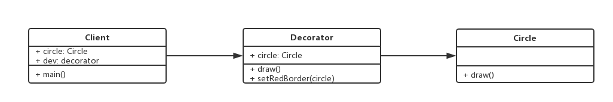

设计模式手册 - 6 - 装饰器模式
===

> create by **jsliang** on **2018年8月30日09:54:33**  
> Recently revised in **2018-10-28 10:54:44**

## 第六章 装饰器模式
* 为对象添加新功能
* 不改变其原有的结构和功能

> 手机壳可以简单的看做是一个装饰器模式

<br>

### 6.1 UML类图


<br>

### 6.2 代码实现
```
class Circle {
    draw() {
        console.log("画一个圆形");
    }
}

class Decorator {
    constructor(circle) {
        this.circle = circle;
    }
    draw() {
        this.circle.draw();
        this.setRedBorder(circle);
    }
    setRedBorder() {
        console.log("设置红色边框");
    }
}

// 测试代码
let circle = new Circle();
circle.draw(); // 画一个圆形

let dec = new Decorator(circle);
dec.draw(); 
// 画一个圆形
// 设置红色边框
```
 
<br>

### 6.3 使用场景
* ES7 装饰器：

&emsp;ES7装饰器的三个步骤：
1. `npm install babel-plugin-transform-decorators-legacy -D`
2. 设置.babelrc配置
```
{
    "presets": [
        "env"
    ],
    "plugins": [
        ["transform-decorators-legacy"]
    ]
}
```
3. 然后测试该配置是否生效：
```
// 一个简单的 demo
// @testDec 对 Demo 这个 class 的装饰，装饰的方法就是使用 testDec() 这个函数
@testDec
class Demo {

}
function testDec(target) {
    target.isDec = true;
}
alert(Demo.isDec); // true
```
&emsp;在这里简化下装饰器语法：
```
// 装饰器的原理

@decorator
class A {}

// 等同于
class A {}
A = decorator(A) || A;
```
* 装饰类

&emsp;在这里，我们还可以传参数：
```
// 一个简单的 demo
// @testDec 对 Demo 这个 class 的装饰，装饰的方法就是使用 testDec() 这个函数
@testDec(false)
class Demo {

}

function testDec(isDec) {
    return function(target) {
        target.isDec = isDec;
    }
}
alert(Demo.isDec); // false
```
&emsp;然后，我们再根据mixin进行一个示例
```
function mixins(...list) {
    return function(target) {
        Object.assign(target.prototype, ...list);
    }
}

const Foo = {
    foo() { 
        alert('foo') 
    }
}

@mixins(Foo)
class MyClass {
    
}

let obj = new MyClass();
obj.foo(); // foo
```
* 装饰方法

&emsp;@readonly 只读属性
```
class Person {
    constructor() {
        this.first = "A";
        this.last = "B";
    }

    // 装饰方法
    @readonly
    name() {
        return `${this.first} ${this.last}`
    }
}

function readonly(target, name, descriptor) {
    /**
     * descriptor 属性描述对象 (Object.defineProperty 中会用到)，原来的值如下：
     * {
     *   value: specifiedFunction,
     *   enumerable: false,
     *   configurable: true,
     *   writable: true
     * }
     */
    descriptor.writable = false;
    return descriptor;
}

var p = new Person();
console.log(p.name()); // A B
// 如果设置 p.name = function() {}; 这样子就会报错，因为 name 被我们设置为只读属性
```
&emsp;例子2：
```
class Math {
    // 装饰方法
    @log
    add(a, b) {
        return a + b;
    }
}

function log(target, name, descriptor) {
    var oldValue = descriptor.value;

    descriptor.value = function() {
        console.log(`Calling ${name} with`, arguments);
        return oldValue.apply(this, arguments);
    };

    return descriptor;
}

const math = new Math();
const result = math.add(2, 4); // 执行 add 时，会自动打印日志，因为有 @log 装饰器
console.log("result", result);
/**
 * Calling add with Arguments(2) [2, 4, callee: (...), Symbol(Symbol.iterator): ƒ]
 * result 6
 */
```

* 其实，上面的方法，都封装到第三方插件里面去了： core-decorators。这个是第三方开源的lib，提供了常用的装饰器。感兴趣的还可以拜读下官方说明：[查看详情](https://github.com/jayphelps/core-decorators)

&emsp;使用 core-decorators 的方式
1. 安装 core-decorators ： npm i core-decorators -S
2. 然后开始编码：
> readonly： 只读
```
import { readonly } from 'core-decorators';

class Person {
    @readonly
    name() {
        return 'zhang';
    }
}

let p = new Person();
alert(p.name()); // zhang
```

<br>

> depercate： 废弃的警告
```
// 废弃的 API
import { deprecate } from 'core-decorators';

class Person {
    @deprecate
    faceplam() {

    }

    @deprecate("We stopped faceplaming")
    faceplamHard() {

    }

    @deprecate("We stopped faceplaming", {url: "http://jsliang.top"})
    faceplamHarder() {

    }
}

let person = new Person();
person.faceplam(); // deprecate.js:31 DEPRECATION Person#faceplam: This function will be removed in future versions.

person.faceplamHard(); // DEPRECATION Person#faceplamHard: We stopped faceplaming

person.faceplamHarder(); 
// deprecate.js:31 DEPRECATION Person#faceplamHarder: We stopped faceplaming
// See http://jsliang.top for more details.****
```

<br>

### 6.4 设计原则验证
* 将现有对象和装饰器进行分离，两者独立存在
* 符合开放封闭原则

<br>

> <a rel="license" href="http://creativecommons.org/licenses/by-nc-sa/4.0/"></a><br /><span xmlns:dct="http://purl.org/dc/terms/" property="dct:title">jsliang的文档库</span> 由 <a xmlns:cc="http://creativecommons.org/ns#" href="https://github.com/LiangJunrong/document-library" property="cc:attributionName" rel="cc:attributionURL">梁峻荣</a> 采用 <a rel="license" href="http://creativecommons.org/licenses/by-nc-sa/4.0/">知识共享 署名-非商业性使用-相同方式共享 4.0 国际 许可协议</a>进行许可。<br />基于<a xmlns:dct="http://purl.org/dc/terms/" href="https://github.com/LiangJunrong/document-library" rel="dct:source">https://github.com/LiangJunrong/document-library</a>上的作品创作。<br />本许可协议授权之外的使用权限可以从 <a xmlns:cc="http://creativecommons.org/ns#" href="https://creativecommons.org/licenses/by-nc-sa/2.5/cn/" rel="cc:morePermissions">https://creativecommons.org/licenses/by-nc-sa/2.5/cn/</a> 处获得。
