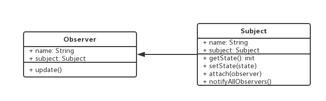

设计模式手册 - 9 - 观察者模式
===

> create by **jsliang** on **2018年8月30日15:47:00**  
> Recently revised in **2019-05-20 17:40:14**

## 第九章 观察者模式
* 发布 & 订阅
* 一对多

### 9.1 实例场景
* 点咖啡，点好之后坐等被叫

<br>

### 9.2 UML类图


<br>

### 9.3 代码场景
* 网页绑定事件
* Promise
* jQuery callbacks
* nodejs 自定义事件

> 网页绑定事件

```html
<button id="btn1">btn</button>
<script>
    // 等待按钮被点击，被点击就触发
    $("#btn1").click(function() {
        console.log(1);
    })
    $("#btn1").click(function() {
        console.log(2);
    })
    $("#btn1").click(function() {
        console.log(3);
    })
</script>
```

<br>

> Promise

```js
function loadImg(src) {
    var promise = new Promise(function(resolve, reject) {
        var img = document.createElement("img");
        img.onload = function() {
            resolve(img);
        }
        img.onerror = function() {
            reject("图片加载失败");
        }
        img.src = src;
    })
    return promise;
}

var src = "http://www.imooc.com/static/img/index/logo_new.png";
var result = loadImg(src);
result.then(function(img) {
    console.log("width", img.width); // width 252
    return img;
}).then(function(img) {
    console.log("height", img.height); // height 144
})
```

<br>

> jQuery callbacks

```js
var callbacks = $.Callbacks(); // 注意大小写
callbacks.add(function(info) {
    console.log("fn1", info);
})
callbacks.add(function(info) {
    console.log("fn2", info);
})
callbacks.add(function(info) {
    console.log("fn3", info);
})
callbacks.fire("gogogo!");
// fn1 gogogo!
// fn2 gogogo!
// fn3 gogogo!
callbacks.fire("fire!");
// fn1 fire!
// fn2 fire!
// fn3 fire!
```

<br>

> nodejs 自定义事件
* 代码1

```js
const EventEmitter = require("events").EventEmitter;
const emitter1 = new EventEmitter();
emitter1.on("some", () => {
    // 监听 some 事件
    console.log("some event is occured 1");
})
emitter1.on("some", () => {
    // 监听 some 事件
    console.log("some event is occured 2");
})
// 触发 some 事件
emitter1.emit("some");
// some event is occured 1
// some event is occured 2
```

* 代码2

```js
const EventEmitter = require("events").EventEmitter;
const emitter = new EventEmitter();
emitter.on("showName", () => {
    // 监听 some 事件
    console.log("event occured", name);
})
emitter.emit("showName", "jsliang"); // emit 时候可以传递参数过去
// event occured 
```

* 代码3

```js
const EventEmitter = require('events').EventEmitter;

// 任何构造函数都可以继承 EventEmitter 的方法 on emit
class Dog extends EventEmitter {
    constructor(name) {
        super();
        this.name = name;
    }
}
var simon = new Dog("simon");
simon.on("bark", function() {
    console.log(this.name, " barked");
})
setInterval(function() {
    simon.emit("bark");
}, 1000)
// simon barked
// simon barked
// simon barked
// ...
```

* 代码4

```js
// Stream 用到了自定义事件
var fs = require("fs");
var readStream = fs.createReadStream("./dist/js/index.js"); // 读取文件的 Stream

var length = 0;
readStream.on("data", function(chunk) {
    length += chunk.toString().length();
})
readStream.on("end", function() {
    console.log(length);
})
```

<br>

### 9.4 设计原则验证
* 主题和观察者分离，不是主动触发而是被动监听，两者解耦
* 符合开放封闭原则

<br>

> <a rel="license" href="http://creativecommons.org/licenses/by-nc-sa/4.0/"></a><br /><span xmlns:dct="http://purl.org/dc/terms/" property="dct:title">jsliang的文档库</span> 由 <a xmlns:cc="http://creativecommons.org/ns#" href="https://github.com/LiangJunrong/document-library" property="cc:attributionName" rel="cc:attributionURL">梁峻荣</a> 采用 <a rel="license" href="http://creativecommons.org/licenses/by-nc-sa/4.0/">知识共享 署名-非商业性使用-相同方式共享 4.0 国际 许可协议</a>进行许可。<br />基于<a xmlns:dct="http://purl.org/dc/terms/" href="https://github.com/LiangJunrong/document-library" rel="dct:source">https://github.com/LiangJunrong/document-library</a>上的作品创作。<br />本许可协议授权之外的使用权限可以从 <a xmlns:cc="http://creativecommons.org/ns#" href="https://creativecommons.org/licenses/by-nc-sa/2.5/cn/" rel="cc:morePermissions">https://creativecommons.org/licenses/by-nc-sa/2.5/cn/</a> 处获得。