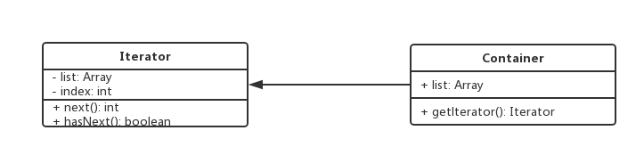
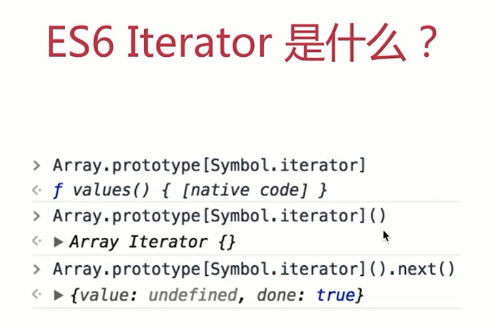
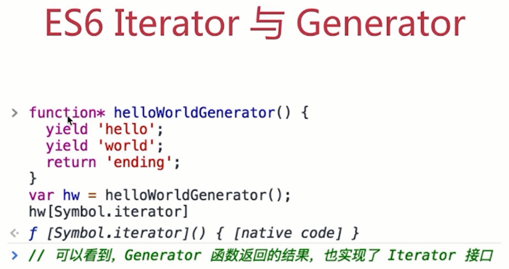

设计模式手册 - 10 - 迭代器模式
===

> create by **jsliang** on **2018年8月30日15:47:00**  
> Recently revised in **2018-10-28 10:54:44**

## 第十章 迭代器模式

* 顺序访问一个集合
* 使用者无需知道集合的内部结构（封装）

### 10.1 代码演示

```
<!DOCTYPE html>
<html lang="en">

<head>
    <meta charset="UTF-8">
    <meta name="viewport" content="width=device-width,initial-scale=1.0,maximum-scale=1.0,user-scalable=no">
    <meta http-equiv="X-UA-Compatible" content="ie=edge">
    <title>HelloWorld</title>
</head>

<body>
    <p>jQuery each</p>
    <p>jQuery each</p>
    <p>jQuery each</p>

    <script src="https://cdn.bootcss.com/jquery/3.3.1/jquery.js"></script>
    <script>
        $(function () {
            var arr = [1, 2, 3];
            var nodeList = document.getElementsByTagName("p");
            var $p = $("p");

            function each(data) {
                var $data = $(data); // 生成迭代器
                $data.each(function (key, val) {
                    console.log(key, val);
                })
            }
            each(arr);
            // 0 1
            // 1 2
            // 2 3
            each(nodeList);
            // 0 <p>​jQuery each​</p>​
            // 1 <p>​jQuery each​</p>​
            // 2 <p>​jQuery each​</p>​
            each($p);
            // 0 <p>​jQuery each​</p>​
            // 1 <p>​jQuery each​</p>​
            // 2 <p>​jQuery each​</p>​
        })
    </script>
</body>

</html>
```

<br>

### 10.2 UML类图


<br>

### 10.3 使用场景
* jQuery each
* ES6 Iterator: 为何存在？`ES6 语法中，有序集合的数据类型已经有很多。Array Map Set String TypedArray arguments NodeList。需要有一个统一的遍历接口来遍历所有数据类型。（注意，object不是有序集合，可以用Map代替）`。是什么？以上数据类型，都有 [Symbol.iterator] 属性。属性值是函数，执行函数返回一个迭代器。这个迭代器就有next方法可顺序迭代子元素。可运行 Array.prototype[Symbol.iterator] 来测试。


> jQuery each
```
<!DOCTYPE html>
<html lang="en">
<head>
    <meta charset="UTF-8">
    <meta name="viewport" content="width=device-width,initial-scale=1.0,maximum-scale=1.0,user-scalable=no">
    <meta http-equiv="X-UA-Compatible" content="ie=edge">
    <title>HelloWorld</title>
</head>
<body>
    <p>jQuery each</p>
    <p>jQuery each</p>
    <p>jQuery each</p>
    
    <script src="https://cdn.bootcss.com/jquery/3.3.1/jquery.js"></script>
    <script>
        $(function() {
            var arr = [1, 2, 3];
            var nodeList = document.getElementsByTagName("p");
            var $p = $("p");

            // 要对这三个变量进行遍历，需要写三个遍历方法
            // 第一
            arr.forEach(function(item) {
                console.log(item);
                // 1
                // 2
                // 3
            })
            // 第二
            var i, length = nodeList.length;
            for(i = 0; i < length; i++) {
                console.log(nodeList[i]);
                // <p>jQuery each</p>
                // <p>jQuery each</p>
                // <p>jQuery each</p>
            }
            // 第三
            $p.each(function(key, p) {
                console.log(key, p);
                // 0 <p>jQuery each</p>
                // 1 <p>jQuery each</p>
                // 2 <p>jQuery each</p>
            })
        })
    </script>
</body>
</html>
```

> ES6 Iterator
```
// 旧写法：
// function each(data) {
//     // 生成遍历器
//     let iterator = data[Symbol.iterator]();
//     // console.log(iterator.next()); // 有数据： {value: "1", done: false}
//     // console.log(iterator.next());
//     // console.log(iterator.next());
//     // console.log(iterator.next()); // 无数据： Cannot read property 'Symbol(Symbol.iterator)' of undefined

//     let item = {done: false};
//     while(!item.done) {
//         item = iterator.next();
//         if(!item.done) {
//             console.log(item.value);
//         }
//     }
// }

// `Symbol.iterator` 并不是每个人斗志
// 也不是每个人都需要封装一个 each方法
// 因此有了 `for...of` 语法， `for...of`是遍历迭代器的
function each(data) {
    // 带有遍历器特性的对象： data[Symbol.iterator] 有值
    for(let item of data) {
        console.log(item);
    }
}

let arr = [1, 2, 3, 4];
let nodeList = document.getElementsByTagName("p");
let m = new Map();
m.set("a", 100);
m.set("b", 200);

each(arr);
// 1
// 2
// 3
// 4
each(nodeList);
// <p>jsliang的设计模式</p>
each(m);
// (2) ["a", 100]
// (2) ["b", 200]
```

<br>

### 10.4 ES6 Iterator 与 Generator
* Iterator 的价值不限于上述几个类型的遍历
* 还有 Generator 函数的使用
* 即只要返回的数据符合 Iterator 接口的要求
* 即可使用 Iterator 语法，这就是迭代器模式
* Generator 应用不是那么广泛了，使用场景比较少



<br>

### 10.5 设计原则验证
* 迭代器对象和目标对象分离
* 迭代器将使用者与目标对象隔离开
* 符合开放封闭原则

<br>

> <a rel="license" href="http://creativecommons.org/licenses/by-nc-sa/4.0/"></a><br /><span xmlns:dct="http://purl.org/dc/terms/" property="dct:title">jsliang的文档库</span> 由 <a xmlns:cc="http://creativecommons.org/ns#" href="https://github.com/LiangJunrong/document-library" property="cc:attributionName" rel="cc:attributionURL">梁峻荣</a> 采用 <a rel="license" href="http://creativecommons.org/licenses/by-nc-sa/4.0/">知识共享 署名-非商业性使用-相同方式共享 4.0 国际 许可协议</a>进行许可。<br />基于<a xmlns:dct="http://purl.org/dc/terms/" href="https://github.com/LiangJunrong/document-library" rel="dct:source">https://github.com/LiangJunrong/document-library</a>上的作品创作。<br />本许可协议授权之外的使用权限可以从 <a xmlns:cc="http://creativecommons.org/ns#" href="https://creativecommons.org/licenses/by-nc-sa/2.5/cn/" rel="cc:morePermissions">https://creativecommons.org/licenses/by-nc-sa/2.5/cn/</a> 处获得。