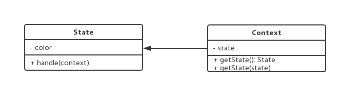

设计模式手册 - 11 - 状态模式
===

> create by **jsliang** on **2018年9月3日10:30:19**  
> Recently revised in **2018-10-28 10:54:44**

## 第十章 状态模式

* 一个对象有状态变化
* 每次状态变化都会触发一个逻辑
* 不能总是用 if...else... 来控制

> 场景：交通信号灯不同颜色的变化

<br>

### 11.1 UML图



<br>
### 11.2 代码演示

```
// 状态：红灯、绿灯、蓝灯
class State {
    constructor(color) {
        this.color = color;
    }
    handle(context) {
        console.log(`turn to ${this.color} light.`); 
        // 设置状态
        context.setState(this);
    }
}

// 主体
class Context {
    constructor() {
        this.state = null;
    }
    // 状态获取
    getState() {
        return this.state;
    }
    setState(state) {
        this.state = state;
    }
}

// test
let context = new Context();
let green = new State("green");
let yellow = new State("yellow");
let red = new State("red");

// 绿灯亮了
green.handle(context);
console.log(context.getState()); // 打印状态
// turn to green light.
// State {color: "green"}


// 黄灯亮了
yellow.handle(context);
console.log(context.getState()); // 打印状态
// turn to yellow light.
// State {color: "yellow"}


// 红灯亮了
red.handle(context);
console.log(context.getState()); // 打印状态
// turn to red light.
// State {color: "red"}
```

<br>

### 11.3 场景
* 有限状态机
* 写一个简单的Promise

> 有限状态机
> * 有限个状态、以及在这些状态之间的变化
> * 如交通信号灯
> 使用开源 lib： javascipt-state-machine: [详情](https://github.com/jakesgordon/javascript-state-machine)

* javascript-state-machine 来做状态模式：
1. 安装：`npm i javascript-state-machine`
2. 代码：es6 webpack 环境下

> index.html
```
<!DOCTYPE html>
<html lang="en">
<head>
    <meta charset="UTF-8">
    <meta name="viewport" content="width=device-width,initial-scale=1.0,maximum-scale=1.0,user-scalable=no">
    <meta http-equiv="X-UA-Compatible" content="ie=edge">
    <title>jsliang的设计模式</title>
</head>
<body>
    <p>jsliang的设计模式</p>
    <button id="btn"></button>
    
    <script src="https://cdn.bootcss.com/jquery/3.3.1/jquery.js"></script>
    <!-- <script src="https://cdn.bootcss.com/vue/2.5.16/vue.js"></script> -->
</body>
</html>
```

> index.js
```
import StateMachine from 'javascript-state-machine'

// 初始化状态机模型
var fsm = new StateMachine({
    init: "收藏", // 初始状态，待收藏
    transitions: [
        {
            name: "doStore",
            from: "收藏",
            to: "取消收藏"
        },
        {
            name: "deleteStore",
            from: "取消收藏",
            to: "收藏"
        }
    ],
    methods: {
        // 监听执行收藏
        onDoStore: function() {
            alert("收藏成功"); // 可以 post 请求
            updateText();
        },
        // 监听取消收藏
        onDeleteStore: function() {
            alert("已取消收藏"); // 可以 post 请求
            updateText();
        }
    }
})

let $btn = $("#btn");

// 点击事件
$btn.click(function() {
    if(fsm.is("收藏")) {
        fsm.doStore();
    } else {
        fsm.deleteStore();
    }
})

// 更新文案
function updateText() {
    $btn.text(fsm.state);
}

// 初始化文案
updateText();
```

> 写一个简单的 Promise
> * 回顾 Promise 的语法
> * 分析：Promise 就是一个有限状态机
> * 写代码
> * 测试验证

```
function loadImg(src) {
    const promise = new Promise(function(resolve, reject) {
        var img = document.createElement("img");
        img.onload = function() {
            resolve(img);
        }
        img.onerror = function() {
            reject();
        }
        img.src = src;
    })
    return promise;
}

var src = "http://www.imooc.com/static/img/index/logo_new.png";
var result = loadImg(src);

result.then(function(img) {
    console.log("success 1");
}, function() {
    console.log("failed 1");
})
// success 1

result.then(function(img) {
    console.log("success 2");
}, function() {
    console.log("failed 2");
})
// success 2

/**
 * 如果地址错误，则：
 * logo_new1.png:1 GET http://www.imooc.com/static/img/index/logo_new1.png 404 (Not Found)
 * failed 1
 * failed 2
 */
```

* Promise 就是有限状态机
1. Promise 三种状态： pending fullfilled rejected
2. pending -> fullfilled 或者 pending -> rejected
3. 不能逆向变化

```
import StateMachine from 'javascript-state-machine';

// 状态机模型
var fsm = new StateMachine({
    init: "pending",
    transitions: [
        {
            name: "resolve",
            from: "pending",
            to: "fullfilled"
        },
        {
            name: "reject",
            from: "pending",
            to: "rejected"
        }
    ],
    methods: {
        // 监听 resolve 成功
        onResolve: function(state, data) {
            // 参数：state - 当前状态示例；data - fsm.resolve(xxx) 执行时传递过来的参数
            data.successList.forEach(fn => fn());
        },
        // 失败
        onReject: function(state, data) {
            // 参数：state - 当前状态示例；data - fsm.reject(xxx) 执行时传递过来的参数
            data.failList.forEach(fn => fn());
        }
    }
})

// 定义 Promise
class MyPromise {
    constructor(fn) {
        this.successList = [];
        this.failList = [];

        fn(() => {
            // resolve 函数
            fms.resolve(this);
        }, () => {
            // reject 函数
            fsm.reject(this);
        })
    }
    then(successFn, failFn) {
        this.successList.push(successFn);
        this.failList.push(failFn);
    }
}

// 测试代码
function loadImg(src) {
    const promise = new Promise(function(resolve, reject) {
        let img = document.createElement("img");
        img.onload = function() {
            resolve(img);
        }
        img.onerror = function() {
            reject();
        }
        img.src = src;
    })
    return promise;
}

let src = "http://www.imooc.com/static/img/index/logo_new.png";
let result = loadImg(src);

result.then(function() {
    console.log("ok1");
}, function() {
    console.log("fail1");
})
// ok1

result.then(function() {
    console.log("ok2");
}, function() {
    console.log("fail2");
})
// ok2
```

<br>

### 11.4 设计原则验证
* 将状态对象和主题对象分离，状态的变化逻辑单独处理
* 符合开放封闭原则

<br>

> <a rel="license" href="http://creativecommons.org/licenses/by-nc-sa/4.0/"></a><br /><span xmlns:dct="http://purl.org/dc/terms/" property="dct:title">jsliang的文档库</span> 由 <a xmlns:cc="http://creativecommons.org/ns#" href="https://github.com/LiangJunrong/document-library" property="cc:attributionName" rel="cc:attributionURL">梁峻荣</a> 采用 <a rel="license" href="http://creativecommons.org/licenses/by-nc-sa/4.0/">知识共享 署名-非商业性使用-相同方式共享 4.0 国际 许可协议</a>进行许可。<br />基于<a xmlns:dct="http://purl.org/dc/terms/" href="https://github.com/LiangJunrong/document-library" rel="dct:source">https://github.com/LiangJunrong/document-library</a>上的作品创作。<br />本许可协议授权之外的使用权限可以从 <a xmlns:cc="http://creativecommons.org/ns#" href="https://creativecommons.org/licenses/by-nc-sa/2.5/cn/" rel="cc:morePermissions">https://creativecommons.org/licenses/by-nc-sa/2.5/cn/</a> 处获得。