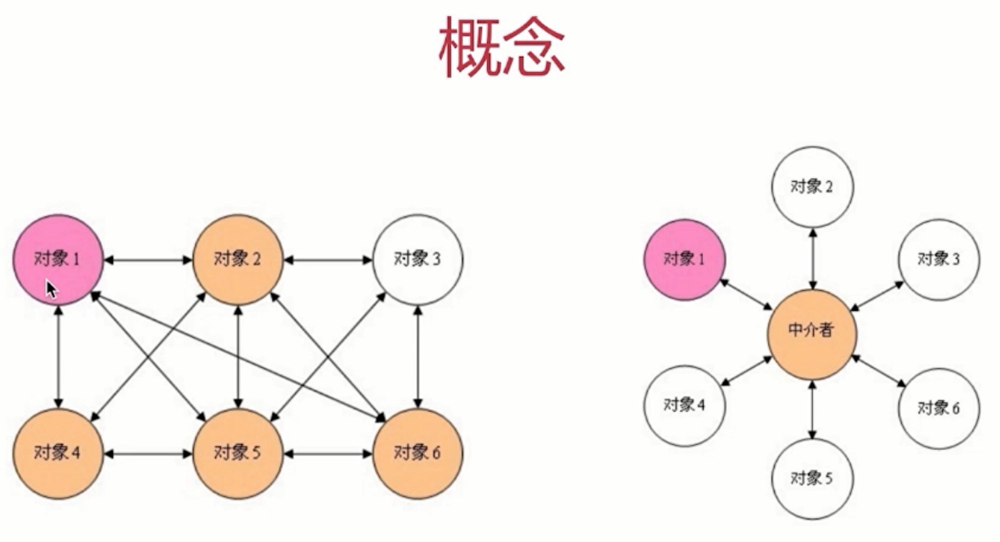

设计模式手册 - 12 - 其他模式
===

> create by **jsliang** on **2018年9月3日11:53:05**  
> Recently revised in **2019-05-20 17:42:42**

## 第十二章 其他模式

&emsp;这里讲解前11章之外，比较少用的模式。

> 原型模式、桥接模式、组合模式、享元模式、策略模式、模板方法模式、职责连模式、命令模式、备忘录模式、中介者模式、访问者模式、解释器模式

<br>

### 12.1 原型模式

* clone 自己，生成一个新对象
* Java 默认有 clone 接口，不用自己实现
* 对比 JS 中的原型 prototype：
1. prototype 可以理解为 ES6 class 的一种底层原理
2. 而 class 是实现面向对象的基础，并不是服务于某个模式
3. 若干年后如果 ES6 全面普及，大家可能会忽略掉 prototype
4. 但是 Object.create 却会长久存在

```js
// `Object.create` 用到了原型模式的思想（虽然不是 java 中的 clone ）
// 基于一个原型创建一个对象
var prototype = {
    getName: function() {
        return this.first + " " + this.last;
    },
    say: function() {
        console.log("hello");
    }
}

// 基于原型创建 x
let x = Object.create(prototype);
x.first = "A";
x.last = "B";
alert(x.getName()); // A B
x.say(); // hello
```

<br>

### 12.2 桥接模式
* 用户把抽象化与实现化解耦
* 使得二者可以独立变化

> 原实例场景

```js
class ColorShape {
    yellowCircle() {
        console.log("yellow circle");
    }
    redCircle() {
        console.log("red circle");
    }
    yellowTriangle() {
        console.log("yellow triangle");
    }
    redTriangle() {
        console.log("red triangle");
    }
}

// 测试
let cs = new ColorShape();
cs.yellowCircle(); // yellow circle
cs.redCircle(); // red circle
cs.yellowTriangle(); // yellow triangle
cs.redTriangle(); // red triangle
```

> 使用桥接模式

```js
class Color {
    constructor(name) {
        this.name = name;
    }
}

class Shape {
    constructor(name, color) {
        this.name = name;
        this.color = color;
    }
    draw() {
        console.log(`${this.color.name} ${this.name}`);
    }
}

// 测试代码
let red = new Color("red");
let yellow = new Color("yellow");
let circle = new Shape("circle", red);
circle.draw(); // red circle

let triangle = new Shape("triangle", yellow);
triangle.draw(); // yellow triangle
```

* 设计原则验证
1. 抽象和实现分离，解耦
2. 符合开放封闭原则

<br>

### 12.3 组合模式
* 生成树形结构，表示“整体-部分”关系
* 让整体和部分都具有一致的操作模式

```js
<div id="div1" class="container">
    <p>123</p>
    <p>456</p>
</div>

{
    tag: "div",
    attr: {
        id: "div1",
        className: "container"
    },
    children: [
        {
            tag: "p",
            attr: {},
            children: ["123"]
        },
        {
            tag: "p",
            attr: {},
            children: ["456"]
        }
    ]
}
```

* 整体和单个节点的操作是一致的
* 整体和单个节点的数据结构也保持一致

* 设计原则验证
1. 将整体和单个节点的操作抽象出来
2. 符合开放封闭原则

<br>

### 12.4 享元模式
* 共享内存（主要考虑内存，而非效率）
* 相同的数据，共享使用

```html
<!-- 无限下拉列表，将事件代理到高层节点上 -->
<!-- 如果都绑定到`<a>`标签，对内存开销太大 -->
<div id="div1">
    <a href="#">a1</a>
    <a href="#">a2</a>
    <a href="#">a3</a>
    <a href="#">a4</a>
    <!-- 无限下拉列表 -->
</div>

<script>
    var div1 = document.getElementById("div1");
    div1.addEventListener("click", function(e) {
        var target = e.target;
        if(e.nodeName === "A") {
            alert(target.innerHTML);
        }
    })
</script>
```

* 设计原则验证
1. 将相同的部分抽象出来
2. 符合开放封闭原则

<br>

### 12.5 策略模式
* 不同策略分开处理
* 避免出现大量 if...else... 或者 switch...case...

> 原代码实现

```js
class User {
    constructor(type) {
        this.type = type;
    }
    buy() {
        if(this.type === "ordinary") {
            console.log("普通用户购买");
        } else if(this.type === "member") {
            console.log("会员用户购买");
        } else if(this.type === "vip") {
            console.log("vip 用户购买");
        }
    }
}
```

> 策略模式代码实现  
> 针对不用的用户，设计不用的类，从而解耦用户等级

```js
class OrdinaryUser {
    buy() {
        console.log("普通用户购买");
    }
}

class MemberList {
    buy() {
        console.log("会员用户购买");
    }
}

class VipUser {
    buy() {
        console.log("vip 用户购买");
    }
}

var u1 = new OrdinaryUser();
u1.buy();

var u2 = new MemberList();
u2.buy();

var u3 = new VipUser();
u3.buy();

// 测试代码
var u1 = new User("ordinary");
u1.buy();  // 普通用户购买
var u2 = new User("member");
u2.buy(); // 会员用户购买
var u3 = new User("vip");
u3.buy(); // vip 用户购买
```

* 设计原则验证
1. 不同策略，分开处理，而不是混合在一起
2. 符合开放封闭原则

<br>

### 12.6 模板方法模式

```js
class Action {
    handle() {
        handle1();
        handle2();
        handle3();
    }
    handle1() {
        console.log("1");
    }
    handle2() {
        console.log("2");
    }
    handle3() {
        console.log("3");
    }
}

let action = new Action();
action.handle();
```

<br>

### 12.7 职责连模式
* 一步操作可能分为多个职责来完成
* 把这些角色都分开，然后用一个链串起来
* 将发起者和各个处理者进行隔离

```js
// 请假审批，需要组长审批、经理审批、最后总监审批
class Action {
    constructor(name) {
        this.name = name;
        this.nextAction = null;
    }
    setNextAction(action) {
        this.nextAction = action;
    }
    handle() {
        console.log(`${this.name} 审批`);
        if(this.nextAction != null) {
            this.nextAction.handle();
        }
    }
}

let a1 = new Action("组长");
let a2 = new Action("经理");
let a3 = new Action("总监");
a1.setNextAction(a2); 
a2.setNextAction(a3); 
a1.handle(); 
// 组长 审批
// 经理 审批
// 总监 审批
```

* 使用场景
1. 职责链模式和业务结合较多，JS 中能联想到链式操作
2. jQuery 的链式操作， Promise.then 的链式操作

* 设计原则验证
1. 发起者于各个处理者进行隔离
2. 符合开放封闭原则

<br>

### 12.8 命令模式模式
* 执行命令时，发布者和执行者分开
* 中间加入命令对象，作为中转站

> 将军发布命令，先告诉副官，由副官进行传达，而不是将军一个一个告诉军队
> 董事长实施战略，先告诉经理，至于各部门如何协调，让经理进行排期。

```js
// 接受者
class Receiver {
    exec() {
        console.log("执行");
    }
}

// 命令者
class Command {
    constructor(receiver) {
        this.receiver = receiver;
    }
    cmd() {
        console.log("触发命令");
        this.receiver.exec();
    }
}

// 触发者
class Invoker {
    constructor(command) {
        this.command = command;
    }
    invoke() {
        console.log("开始");
        this.command.cmd();
    }
}

// 士兵
let soldier = new Receiver();
// 小号手
let trumpeter = new Command(soldier);
// 将军
let general = new Invoker(trumpeter);
general.invoke();

// 开始
// 触发命令
// 执行
```

* JS 中的应用
1. 网页富文本编辑器操作，浏览器封装了一个命令对象
2. document.execCommand("bold")
3. document.execCommand("undo")

* 设计原则验证
1. 命令对象于执行对象分开，解耦
2. 符合开放封闭原则

<br>

### 12.9 备忘录模式
* 随时记录一个对象的状态变化
* 随时可以恢复之前的某个状态（如撤销功能）

```js
// 状态备忘
class Memento {
    constructor(content) {
        this.content = content;
    }
    getContent() {
        return this.content;
    }
}

// 备忘列表
class CareTaker {
    constructor() {
        this.list = [];
    }
    add(memento) {
        this.list.push(memento);
    }
    get(index) {
        return this.list[index];
    }
}

// 编辑器
class Editor {
    constructor() {
        this.content = null;
    }
    setContent(content) {
        this.content = content;
    }
    getContent() {
        return this.content;
    }
    saveContentToMemento() {
        return new Memento(this.content);
    }
    getContentFromMemento(memento) {
        this.content = memento.getContent();
    }
}

// 测试代码
let editor = new Editor();
let careTaker = new CareTaker();
editor.setContent("111");
editor.setContent("222");
careTaker.add(editor.saveContentToMemento()); // 存储备忘录
editor.setContent("333");
careTaker.add(editor.saveContentToMemento()); // 存储备忘录
editor.setContent("444");

console.log(editor.getContent()); // 444
editor.getContentFromMemento(careTaker.get(1)); // 撤销
console.log(editor.getContent()); // 333
editor.getContentFromMemento(careTaker.get(0)); // 撤销
console.log(editor.getContent()); // 222

/**
 * 这里是预知了要撤销的步骤
 * 假如，不知道要存储了多少条备忘录
 * 而我们要一步步回撤，则需要怎么做？
 * 个人想法就是还需要一个计步器
 * 就是你存了多少备忘录，则记起来
 * 当你需要回撤的时候，直接读取最近的备忘条数
 * 即可回撤到最近一步操作
 */
```

* 设计原则验证
1. 状态对象与使用者分开，解耦
2. 符合开放封闭原则

<br>

### 12.10 中介者模式
* 中介者原理


```js
class Mediator {
    constructor(a, b) {
        this.a = a;
        this.b = b;
    }
    setA() {
        let number = this.b.number;
        this.a.setNumber(number * 100);
    }
    setB() {
        let number = this.a.number;
        this.b.setNumber(number / 100);
    }
}

class A {
    constructor() {
        this.number = 0;
    }
    setNumber(num, m) {
        this.number = num;
        if(m) {
            m.setB();
        }
    }
}

class B {
    constructor() {
        this.number = 0;
    }
    setNumber(num, m) {
        this.number = num;
        if(m) {
            m.setA();
        }
    }
}

// 测试
let a = new A();
let b = new B();
let m = new Mediator(a, b);
a.setNumber(100, m);
console.log(a.number, b.number); // 100 1
b.setNumber(100, m);
console.log(a.number, b.number); // 10000 100
```

* 设计原则验证
1. 将各关联对象通过中介者隔离
2. 符合开放封闭原则

<br>

### 12.11 访问者模式
* 将数据操作和数据结构进行分离
* 使用场景不多

<br>

### 12.12 解释器模式
* 描述语言语法如何定义，如何解释和编译
* 用于专业场景

<br>

> <a rel="license" href="http://creativecommons.org/licenses/by-nc-sa/4.0/"></a><br /><span xmlns:dct="http://purl.org/dc/terms/" property="dct:title">jsliang的文档库</span> 由 <a xmlns:cc="http://creativecommons.org/ns#" href="https://github.com/LiangJunrong/document-library" property="cc:attributionName" rel="cc:attributionURL">梁峻荣</a> 采用 <a rel="license" href="http://creativecommons.org/licenses/by-nc-sa/4.0/">知识共享 署名-非商业性使用-相同方式共享 4.0 国际 许可协议</a>进行许可。<br />基于<a xmlns:dct="http://purl.org/dc/terms/" href="https://github.com/LiangJunrong/document-library" rel="dct:source">https://github.com/LiangJunrong/document-library</a>上的作品创作。<br />本许可协议授权之外的使用权限可以从 <a xmlns:cc="http://creativecommons.org/ns#" href="https://creativecommons.org/licenses/by-nc-sa/2.5/cn/" rel="cc:morePermissions">https://creativecommons.org/licenses/by-nc-sa/2.5/cn/</a> 处获得。