设计模式手册 - 13 - 综合应用
===

> create by **jsliang** on **2018年9月4日09:37:55**  
> Recently revised in **2018-10-28 10:54:44**

## 第十三章 综合应用-购物车

&emsp;最后，我们使用 jQuery 做一个模拟购物车的示例。

* 功能如下：
1. 显示购物列表
2. 加入购物车
3. 从购物车删除

* 涉及的设计模式：
1. 工厂模式
2. 单例模式
3. 装饰器模式
4. 观察者模式
5. 状态模式
6. 模板方法模式
7. 代理模式

<br>

### 13.1 UML类图

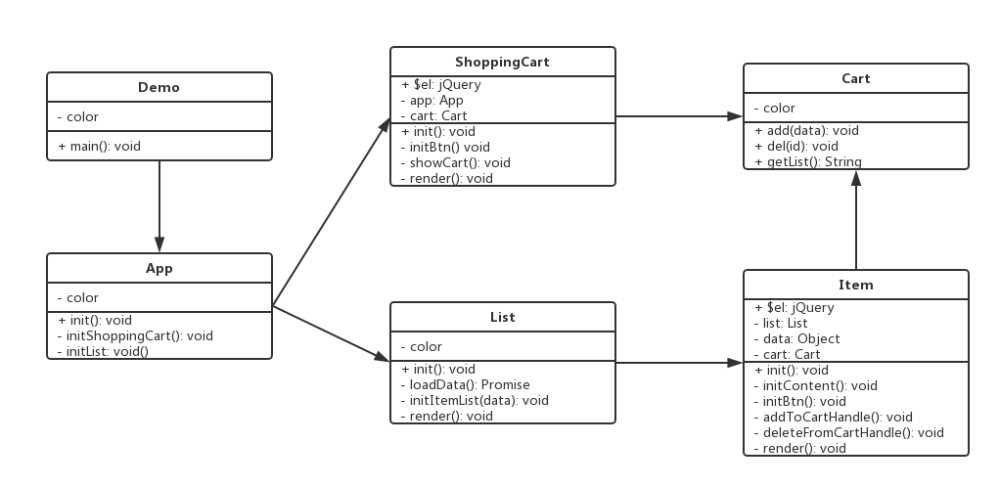

<br>

### 13.2 编程环境搭建
&emsp;如果小伙伴有跟着 **部署开发环境** 搭建了属于自己的设计模式环境，那么，就让我们优化一下直接跑起我们的综合应用就OK了~如果小伙伴没有去做，那么先跟着 **部署开发环境** 先跑一遍，再回来做我们的综合应用吧！前往：[第一章 部署开发环境](./design-pattern-chapter1.md)

&emsp;OK，Here we go!

* 我们目前的目录

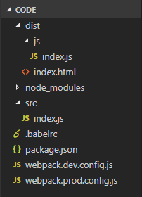 

<br>

1. 目录文件

&emsp;在这里，我们先过一遍我们的文件，没有配置设计模式环境的小伙伴可以照上面的图新建过文件目录，配置好的小伙伴看看代码和 **jsliang** 的代码是否一致：

&emsp;**dist** - 打包后的文件存放地方  

&emsp;**dist/js** - 该文件夹为打包后的 js 文件存储位置，这里的 `index.js` 系自动生成，无需新增该文件  

&emsp;**dist/index.html** - 打包后的 index.html ，一般是依据原有的 index.html ，打包时 webpack 往里面添加 \<script\> ，这里我们需要添加下列代码进去。  
```
<!DOCTYPE html>
<html lang="en">
<head>
    <meta charset="UTF-8">
    <meta name="viewport" content="width=device-width,initial-scale=1.0,maximum-scale=1.0,user-scalable=no">
    <meta http-equiv="X-UA-Compatible" content="ie=edge">
    <title>jsliang的设计模式</title>
</head>
<body>
    <div id="app">Hello 综合应用！</div>
    
    <!-- <script src="https://cdn.bootcss.com/jquery/3.3.1/jquery.js"></script> -->
    <!-- <script src="https://cdn.bootcss.com/vue/2.5.16/vue.js"></script> -->
</body>
</html>
```

&emsp;**node_modules** - npm 安装包，在拷贝了其他文件的代码后，我们 `npm i` 会自动生成  

&emsp;**src/index.js** - 被打包的 js 文件，暂时不需要添加代码

&emsp;**.babelrc** - es6、es7 代码转为 es5 代码所必需的文件
```
{
    "presets": [
        "env"
    ],
    "plugins": [
        ["transform-decorators-legacy"]
    ]
}
```

&emsp;**package.json** - 项目的依据，所依赖的插件都在这里提示
```
{
  "name": "design-pattern",
  "version": "1.0.0",
  "description": "design pattern for javascript",
  "main": "index.js",
  "scripts": {
    "dev": "webpack-dev-server --config ./webpack.dev.config.js",
    "build": "webpack --config ./webpack.dev.config.js"
  },
  "keywords": [
    "javascript",
    "design pattern"
  ],
  "author": "jsliang",
  "license": "ISC",
  "devDependencies": {
    "babel-core": "^6.26.3",
    "babel-loader": "^7.1.5",
    "babel-plugin-transform-decorators-legacy": "^1.3.5",
    "babel-polyfill": "^6.26.0",
    "babel-preset-env": "^1.7.0",
    "html-webpack-plugin": "^3.2.0",
    "webpack": "^4.16.5",
    "webpack-cli": "^3.1.0",
    "webpack-dev-server": "^3.1.5"
  },
  "dependencies": {
    "core-decorators": "^0.20.0",
    "javascript-state-machine": "^3.1.0",
    "jquery": "^3.3.1"
  }
}

```

&emsp;**webpack.dev.config.js** - webpack 开发模式下会使用到的 loader 以及插件等配置
```
const path = require('path'); // 加载node中的path模块
const HtmlWebpackPlugin = require('html-webpack-plugin'); // 加载插件html-webpack-plugin

module.exports = {
    mode: 'development', // 开发模式
    entry: './src/index.js', // 入口文件
    output: { // 出口文件
        path: __dirname + '/dist',
        filename: './js/index.js'
    },
    module: { // 加载模块
        rules: [{ 
            test: /\.js$/, // .js文件加载loader
            include: path.resolve(__dirname, "./src"), // 检查的文件夹
            exclude: path.resolve(__dirname, "./node_modules"), // 不检查的文件夹
            loader: 'babel-loader' // 使用的loader
        }]
    },
    plugins: [ 
        new HtmlWebpackPlugin({ // HTML加载插件
            template: './dist/index.html'
        })
    ],
    devServer: { // 开发服务
        contentBase: path.join(__dirname, './dist'), // 监控的目录
        open: true, // 自动打开浏览器
        port: 9000, // 端口
        // host: "192.168.1.87" // WiFi IPV4地址，打开可共享到手机
    }
}
```

&emsp;**webpack.prod.config.js** - 生产环境，打包文件到 dist 目录，然后发布到服务器上即可生效访问
```
const path = require('path'); // 加载node中的path模块
const HtmlWebpackPlugin = require('html-webpack-plugin'); // 加载插件html-webpack-plugin

module.exports = {
    mode: 'production', // 生产模式
    entry: './src/index.js', // 入口文件
    output: { // 出口文件
        path: __dirname + '/dist',
        filename: './js/index.js'
    },
    module: { // 加载模块
        rules: [{ 
            test: /\.js$/, // .js文件加载loader
            include: path.resolve(__dirname, "./src"), // 检查的文件夹
            exclude: path.resolve(__dirname, "./node_modules"), // 不检查的文件夹
            loader: 'babel-loader' // 使用的loader
        }]
    },
    plugins: [ 
        new HtmlWebpackPlugin({ // HTML加载插件
            template: './dist/index.html'
        })
    ]
}
```

* 复制粘贴完这些代码之后，我们就可以跑起项目来了！
1. 安装 npm 包：`npm i`
2. 进入开发模式：`npm run dev`
3. 生产模式打包：`npm run build`

<br>

&emsp;很好，上面就是我们原有的目录，让我们往里面新增代码，配置综合应用的环境吧：

* 搭建完后的目录

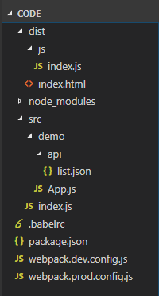 


&emsp;如图，我们需要往 `src` 目录下新增 `api` 文件夹及其 `list.json` 以及 `src` 目录下的 `App.js`。

&emsp;然后，我们需要往 `webpack.dev.config.js` 中的 `devServer` 添加解决跨域的代码，因为我们将采用其他端口作为我们的 API 地址：
```
proxy: {
    "/api/*": { // url 中匹配到 "/api" 之前的东西，将其全部替换成下面 target 中的东西，从而解决跨域问题
        target: "http://localhost:8880"
    }
}
```

&emsp;此刻我们的 `index.js` 、`App.js`  以及 `list.json` 文件内容如下：

> index.js - 启动文件，通过 index.js 访问 App.js 这个主入口
```
import App from './demo/App.js'

let app = new App('app');
app.init();
```

<br>

> App.js - 项目主入口
```
export default class App {
    constructor(id) {

    }
    init() {
        console.log("初始化成功！");
    }
}
```

> list.json - api接口文件，提供书籍清单
```
[
    {
        "id": 1,
        "name": "《JS 基础面试题》",
        "price": 149,
        "discount": 1
    },
    {
        "id": 2,
        "name": "《JS 高级面试题》",
        "price": 366,
        "discount": 1
    },
    {
        "id": 3,
        "name": "《React 模拟大众点评 webapp》",
        "price": 248,
        "discount": 0
    },
    {
        "id": 4,
        "name": "《zepto 设计与源码解读》",
        "price": 0,
        "discount": 0
    }
]
```

<br>

&emsp;到这里，我们一切准备就绪，只需要执行两步即可：  

1. cd 到 demo 目录中，打开接口服务：  
```
    cd src/demo
    http-server -p 8880
```

<br>

> 这时候我们打开下面地址，会发现该 api 接口成功开启：

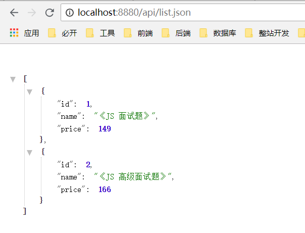 

<br>

2. 打开开发模式：
```
    npm run start
```

<br>

> 这时候浏览器会自动打开 localhost:9000 ，如果没有打开，请在浏览器输入 http://localhost:9000 即可访问到：

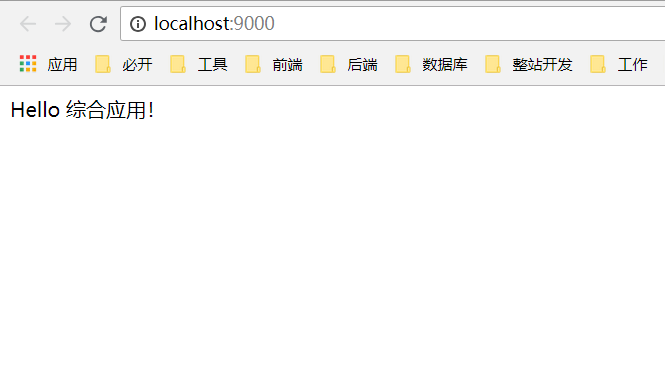 

<br>

&emsp;好的，到此为止，我们已经完美部署了我们综合应用的开发环境，让我们继续前进吧！

<br>

### 13.3 代码剖析
#### 步骤1
> inde.js
```
import App from './demo/App.js'

let app = new App('app');
app.init();
```

> App.js
```
import $ from 'jquery'

export default class App {
    constructor(id) {
        this.$el = $("#" + id);
    }

    // 初始化购物车
    initShoppingCart() {
        console.log("初始化购物车");
    }

    // 初始化列表
    initList() {
        console.log("初始化列表");
    }

    init() {
        this.initShoppingCart();
        this.initList();
    }
}
```

#### 步骤2
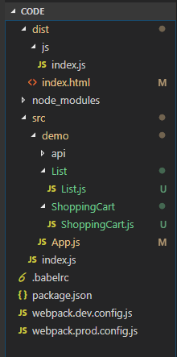 

#### 步骤3
> ShoppingCart.js
```
export default class ShoppingCart {
    constructor(app) {

    }

    init() {
        
    }
}
```

> List.js
```
export default class ShoppingCart {
    constructor(app) {

    }

    init() {
        
    }
}
```

> App.js
```
import $ from 'jquery'
import ShoppingCart from './ShoppingCart/ShoppingCart.js'
import List from './List/List.js'

export default class App {
    constructor(id) {
        this.$el = $("#" + id);
    }

    // 初始化购物车
    initShoppingCart() {
        let shoppingCart = new ShoppingCart(this);
        shoppingCart.init();
    }

    // 初始化列表
    initList() {
        let list = new List(this);
        list.init();
    }

    init() {
        this.initShoppingCart();
        this.initList();
    }
}
```

#### 步骤4
> List.js
```
import $ from 'jquery'

export default class ShoppingCart {
    constructor(app) {
        this.app = app;
        this.$el = $('<div>');
    }

    // 获取数据
    loadData() {
        
    }

    // 生成列表
    initItemList(data) {

    }

    // 渲染
    render() {

    }

    init() {
        
    }
}
```

#### 步骤5
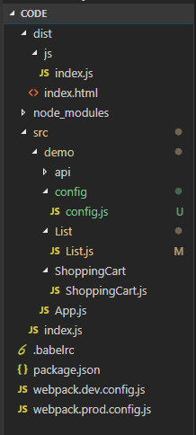 

> config.js
```
export const GET_LIST = '/api/list.json'
```

#### 步骤6
> List.js
```
import $ from 'jquery'
import { GET_LIST } from '../config/config.js'

export default class ShoppingCart {
    constructor(app) {
        this.app = app;
        this.$el = $('<div>');
    }

    // 获取数据
    loadData() {
        // 返回 Promise 实例
        return fetch(GET_LIST).then(result => {
            return result.json();
        });
    }

    // 生成列表
    initItemList(data) {
        data.map(itemData => {
            // 创建一个 Item 然后 init
        })
    }

    // 渲染
    render() {
        this.app.$el.append(this.$el);
    }

    init() {
        this.loadData().then(data => {
            this.initItemList(data);
        }).then(() => {
            // 渲染
            this.render();
        })
    }
}
```

#### 步骤7
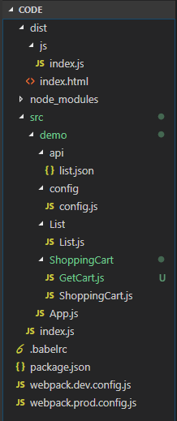 

> GetCart.js
```
class Cart {
    constructor() {
        this.list = [];
    }

    add(data) {
        this.list.push(data);
    }

    del(id) {
        this.list = this.list.filter(item => {
            if(item.id === id) {
                return false;
            }
            return true;
        })
    }

    getList() {
        return this.list.map(item => {
            return item.name;
        }).join('\n');
    }
}

// 返回单例
let getCart = (function() {
    let cart;
    return function() {
        if(!cart) {
            cart = new Cart();
        }
        return cart;
    }
})()

export default getCart;
```

#### 步骤8
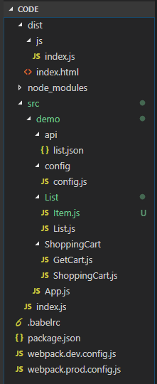 

> Item.js
```
import $ from 'jquery';
import getCart from '../ShoppingCart/GetCart.js';

export default class Item {
    constructor(list, data) {
        this.list = list;
        this.data = data;
        this.$el = $('<div>');
        this.cart = getCart();
    }

    initContent() {
        let $el = this.$el;
        let data = this.data;
        $el.append($(`<p>名称：${data.name}</p>`));
        $el.append($(`<p>价格：${data.name}</p>`));
    }

    initBtn() {
        let $el = this.$el;
        let $btn = $('<button>test</button>');

        $btn.click(() => {
            // 添加到购物车
            // 从购物车移除
        })

        $el.append($btn);
    }

    // 添加到购物车
    addToCartHandle() {
        this.cart.add(this.data);
    }

    // 从购物车删除
    deleteFromCartHandle() {
        this.cart.del(this.data.id);
    }

    render() {
        this.list.$el.append(this.$el);
    }

    init() {
        this.initContent();
        this.initBtn();
        this.render();
    }
}
```

#### 步骤9
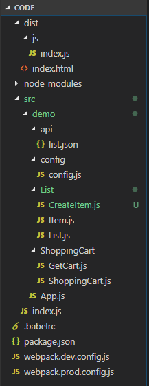 

> CreateItem.js
```
import Item from './Item.js'

// 补充：优惠商品的处理逻辑

// 工厂函数
export default function(list, itemData) {
    return new Item(list, itemData);
}
```

> List.js
```
import $ from 'jquery'
import { GET_LIST } from '../config/config.js'
import createItem from './CreateItem.js'

export default class ShoppingCart {
    constructor(app) {
        this.app = app;
        this.$el = $('<div>');
    }

    // 获取数据
    loadData() {
        // 返回 Promise 实例
        return fetch(GET_LIST).then(result => {
            return result.json();
        });
    }

    // 生成列表
    initItemList(data) {
        // data.map(itemData => {
        //     // 创建一个 Item 然后 init
        //     let item = createItem(this, itemData);
        //     item.init();
        //     return item;
        // })

        data.forEach(itemData => {
            // 创建一个 Item 然后 init
            let item = createItem(this, itemData);
            item.init();
        })
    }

    // 渲染
    render() {
        this.app.$el.append(this.$el);
    }

    init() {
        this.loadData().then(data => {
            this.initItemList(data);
        }).then(() => {
            // 渲染
            this.render();
        })
    }
}
```

#### 步骤10
> Item.js
```
import $ from 'jquery';
import getCart from '../ShoppingCart/GetCart.js';
// 引用第三方插件实现状态模式
import StateMachine from 'javascript-state-machine';

export default class Item {
    constructor(list, data) {
        this.list = list;
        this.data = data;
        this.$el = $('<div>');
        this.cart = getCart();
    }

    initContent() {
        let $el = this.$el;
        let data = this.data;
        $el.append($(`<p>名称：${data.name}</p>`));
        $el.append($(`<p>价格：${data.price}</p>`));
    }

    initBtn() {
        let $el = this.$el;
        let $btn = $('<button>');

        let _this = this;
        let fsm = new StateMachine({
            init: '加入购物车',
            transitions: [
                {
                    name: 'addToCart',
                    from: '加入购物车',
                    to: '从购物车删除'
                },
                {
                    name: 'deleteFromCart',
                    from: '从购物车删除',
                    to: '加入购物车'
                }
            ],
            methods: {
                // 加入购物车
                onAddToCart: function() {
                    _this.addToCartHandle();
                    updateText();
                },
                // 从购物车删除
                onDeleteFromCart: function() {
                    _this.deleteFromCartHandle();
                    updateText();
                }
            }
        })

        function updateText() {
            $btn.text(fsm.state);
        }

        $btn.click(() => {
            if(fsm.is('加入购物车')) {
                fsm.addToCart();
            } else {
                fsm.deleteFromCart();
            }
        })
        updateText();
        $el.append($btn);
    }

    // 添加到购物车
    addToCartHandle() {
        this.cart.add(this.data);
    }

    // 从购物车删除
    deleteFromCartHandle() {
        this.cart.del(this.data.id);
    }

    render() {
        this.list.$el.append(this.$el);
    }

    init() {
        this.initContent();
        this.initBtn();
        this.render();
    }
}
```

#### 步骤11
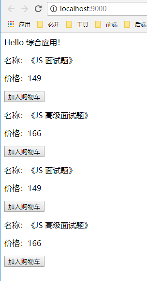 

#### 步骤12
> ShoppingCart.js
```
import $ from 'jquery';
import getCart from './GetCart.js'

export default class ShoppingCart {
    constructor(app) {
        this.app = app;
        this.$el = $('<div>').css({
            'padding-bottom': '10px;',
            'border-bottom': '1px solid #ccc'
        })
        this.cart = getCart();
    }

    initBtn() {
        let $btn = $('<button>购物车</button>');
        $btn.click(() => {
            this.showCart();
        })
        this.$el.append($btn);
    }

    showCart() {
        alert(this.cart.getList());
    }

    render() {
        this.app.$el.append(this.$el);
    }

    init() {
        this.initBtn();
        this.render();
    }
}
```
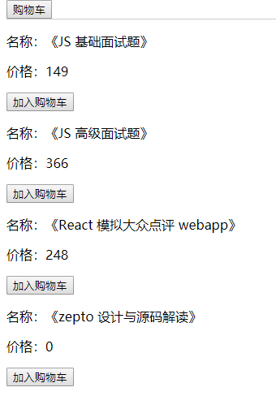 

#### 步骤13
> CreateItem.js
```
import Item from './Item.js'

function createDiscount(itemData) {
    // 用代理做折扣显示
    return new Proxy(itemData, {
        get: function(target, key, receiver) {
            if(key === 'name') {
                return `${target[key]} 【折扣】`;
            }
            if(key === 'price') {
                return target[key] * 0.8;
            }
            return target[key];
        }
    })
}

// 工厂函数
export default function(list, itemData) {
    if(itemData.discount) {
        itemData = createDiscount(itemData);
    }
    return new Item(list, itemData);
}
```

#### 步骤14
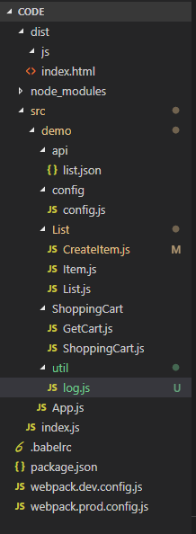 

> log.js
```
export function log(type) {
    return function(target, name, descriptor) {
        let oldValue = descriptor.value;

        descriptor.value = function() {
            // 在此统一打印日志
            console.log(`日志上报 ${type}`);
            // 执行原有的方法
            return oldValue.apply(this, arguments);
        }

        return descriptor;
    }
}
```

> Item.js
```
import $ from 'jquery';
import getCart from '../ShoppingCart/GetCart.js';
// 引用第三方插件实现状态模式
import StateMachine from 'javascript-state-machine';
import { log } from '../util/log.js'

export default class Item {
    constructor(list, data) {
        this.list = list;
        this.data = data;
        this.$el = $('<div>');
        this.cart = getCart();
    }

    initContent() {
        let $el = this.$el;
        let data = this.data;
        $el.append($(`<p>名称：${data.name}</p>`));
        $el.append($(`<p>价格：${data.price}</p>`));
    }

    initBtn() {
        let $el = this.$el;
        let $btn = $('<button>');

        let _this = this;
        let fsm = new StateMachine({
            init: '加入购物车',
            transitions: [
                {
                    name: 'addToCart',
                    from: '加入购物车',
                    to: '从购物车删除'
                },
                {
                    name: 'deleteFromCart',
                    from: '从购物车删除',
                    to: '加入购物车'
                }
            ],
            methods: {
                // 加入购物车
                onAddToCart: function() {
                    _this.addToCartHandle();
                    updateText();
                },
                // 从购物车删除
                onDeleteFromCart: function() {
                    _this.deleteFromCartHandle();
                    updateText();
                }
            }
        })

        function updateText() {
            $btn.text(fsm.state);
        }

        $btn.click(() => {
            if(fsm.is('加入购物车')) {
                fsm.addToCart();
            } else {
                fsm.deleteFromCart();
            }
        })
        updateText();
        $el.append($btn);
    }

    // 添加到购物车
    @log('add') // 装饰器模式
    addToCartHandle() {
        this.cart.add(this.data);
    }

    // 从购物车删除
    @log('del')
    deleteFromCartHandle() {
        this.cart.del(this.data.id);
    }

    render() {
        this.list.$el.append(this.$el);
    }

    init() {
        this.initContent();
        this.initBtn();
        this.render();
    }
}
```

<br>

### 13.4 总结
&emsp;项目中使用到的模式：
* 工厂模式：$('×××')，创建商品
* 单例模式：购物车
* 装饰器模式：打点统计
* 观察者模式：网页事件，Promise
* 状态模式：添加到购物车 & 从购物车删除
* 模板方法模式：渲染有统一的方法，内部包含了各模块渲染
* 代理模式：打折商品信息处理

<br>

> <a rel="license" href="http://creativecommons.org/licenses/by-nc-sa/4.0/"></a><br /><span xmlns:dct="http://purl.org/dc/terms/" property="dct:title">jsliang的文档库</span> 由 <a xmlns:cc="http://creativecommons.org/ns#" href="https://github.com/LiangJunrong/document-library" property="cc:attributionName" rel="cc:attributionURL">梁峻荣</a> 采用 <a rel="license" href="http://creativecommons.org/licenses/by-nc-sa/4.0/">知识共享 署名-非商业性使用-相同方式共享 4.0 国际 许可协议</a>进行许可。<br />基于<a xmlns:dct="http://purl.org/dc/terms/" href="https://github.com/LiangJunrong/document-library" rel="dct:source">https://github.com/LiangJunrong/document-library</a>上的作品创作。<br />本许可协议授权之外的使用权限可以从 <a xmlns:cc="http://creativecommons.org/ns#" href="https://creativecommons.org/licenses/by-nc-sa/2.5/cn/" rel="cc:morePermissions">https://creativecommons.org/licenses/by-nc-sa/2.5/cn/</a> 处获得。