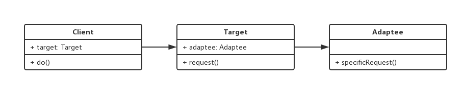

设计模式手册 - 5 - 适配器模式
===

> create by **jsliang** on **2018年8月27日09:15:18**  
> Recently revised in **2018-10-28 10:54:44**

## 第五章 适配器模式
* 旧接口格式和使用者不兼容
* 中间加一个适配转换接口

<br>

### 5.1 UML类图


<br> 

### 5.2 代码实现
```
class Adaptee {
    specificRequest() {
        return "德国标准的插头";
    }
}
class Target {
    constructor() {
        this.adaptee = new Adaptee();
    }
    request() {
        let info = this.adaptee.specificRequest();
        return `${info} -> 转换器 -> 中国标准的插头`;
    }
}

// 测试
let target = new Target();
console.log(target.request()); // 德国标准的插头 -> 转换器 -> 中国标准的插头
```

### 5.3 使用场景
* 封装旧接口
* vue computed

> 封装旧接口
```
// 自己封装的 ajax ，使用方式如下：
ajax({
    url: 'getData',
    type: 'Post',
    dataType: 'json',
    data: {
        id: '123'
    }
}).done(function() {

})

// 由于历史原因，代码中全都是：
// $.ajax({...})

// 做一层适配器
var $ = {
    ajax: function(options) {
        return this.ajax(options);
    }
}
```

> vue computed
```
<!DOCTYPE html>
<html lang="en">
<head>
    <meta charset="UTF-8">
    <meta name="viewport" content="width=device-width,initial-scale=1.0,maximum-scale=1.0,user-scalable=no">
    <meta http-equiv="X-UA-Compatible" content="ie=edge">
    <title>Vue Computed</title>
</head>
<body>
    <div id="app">
        <p>顺序： {{message}}</p>
        <p>逆序： {{reversedMessage}}</p>
    </div>

    <script src="https://cdn.bootcss.com/vue/2.5.16/vue.js"></script>
    <script>
        var vm = new Vue({
            el: "#app",
            data: {
                message: "hello"
            },
            computed: {
                reversedMessage: function() {
                    return this.message.split('').reverse().join('');
                }
            }
        })
    </script>
</body>
</html>
```

<br>

### 5.4 设计原则验证
* 将旧接口和使用者进行分离
* 符合开放封闭原则

<br>

> <a rel="license" href="http://creativecommons.org/licenses/by-nc-sa/4.0/"></a><br /><span xmlns:dct="http://purl.org/dc/terms/" property="dct:title">jsliang的文档库</span> 由 <a xmlns:cc="http://creativecommons.org/ns#" href="https://github.com/LiangJunrong/document-library" property="cc:attributionName" rel="cc:attributionURL">梁峻荣</a> 采用 <a rel="license" href="http://creativecommons.org/licenses/by-nc-sa/4.0/">知识共享 署名-非商业性使用-相同方式共享 4.0 国际 许可协议</a>进行许可。<br />基于<a xmlns:dct="http://purl.org/dc/terms/" href="https://github.com/LiangJunrong/document-library" rel="dct:source">https://github.com/LiangJunrong/document-library</a>上的作品创作。<br />本许可协议授权之外的使用权限可以从 <a xmlns:cc="http://creativecommons.org/ns#" href="https://creativecommons.org/licenses/by-nc-sa/2.5/cn/" rel="cc:morePermissions">https://creativecommons.org/licenses/by-nc-sa/2.5/cn/</a> 处获得。
