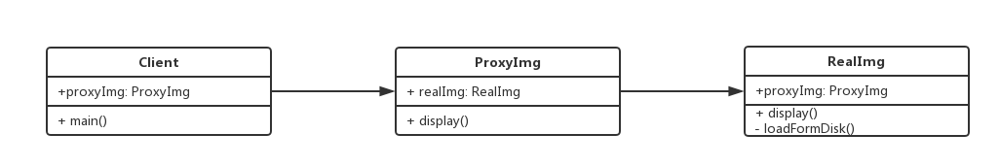

设计模式手册 - 7 - 代理模式
===

> create by **jsliang** on **2018年8月30日15:47:00**  
> Recently revised in **2018-10-28 10:54:44**

## 第七章 代理模式
* 使用者无权访问目标对象
* 中间加代理，通过代理做授权和控制

> 关于代理模式，可以简单理解下
> 1. 国外网站。有些国外网站被墙了的，需要我们通过一些能访问国外站点的代理服务器去访问
> 2. 公司网络。有些公司有自己的内容，如果我们在家要访问，那么就需要通过代理，才能访问到。
> 3. 明星经纪人。如果你要找明星演戏，你是找不到本人的，这时候你需要找它的代理：经纪人。去详谈合作事务，谈妥当后经纪人会帮你转告明星，开始工作。

<br>

### 7.1 UML类图


<br>

### 7.2 代码演示
&emsp;代理模式中，代理的类提供的接口必须跟被代理的类名一样。
```
class ReadImg {
    constructor(fileName) {
        this.fileName = fileName;
        this.loadFromDisk(); // 初始化即从硬盘中加载，模拟
    }
    display() {
        console.log("display... " + this.fileName);
    }
    loadFromDisk() {
        console.log("loading... " + this.fileName);
    }
}

class ProxyImg {
    constructor(fileName) {
        this.realImg = new ReadImg(fileName);
    }
    display() {
        this.realImg.display();
    }
}

// 测试
let proxyImg = new ProxyImg("1.png");
proxyImg.display(); 
// loading... 1.png
// display... 1.png
```

<br>

### 7.3 使用场景
* 网页事件代理
* jQuery $.proxy

> 网页时间代理
```
<!DOCTYPE html>
<html lang="en">
<head>
    <meta charset="UTF-8">
    <meta name="viewport" content="width=device-width,initial-scale=1.0,maximum-scale=1.0,user-scalable=no">
    <meta http-equiv="X-UA-Compatible" content="ie=edge">
    <title>HelloWorld</title>
</head>
<body>
    <div id="div1">
        <a href="javascript:void(0)">a1</a>
        <a href="javascript:void(0)">a2</a>
        <a href="javascript:void(0)">a3</a>
        <a href="javascript:void(0)">a4</a>
        <a href="javascript:void(0)">a5</a>
    </div>
    
    <script src="https://cdn.bootcss.com/jquery/3.3.1/jquery.js"></script>
    <script>
        $(function() {
            var div1 = document.getElementById("div1");
            div1.addEventListener("click", function(e) {
                var target = e.target;
                if(target.nodeName === "A") {
                    alert(target.innerHTML);
                }
            })
        })
    </script>
</body>
</html>
```

<br>

> $.proxy
```
<!DOCTYPE html>
<html lang="en">
<head>
    <meta charset="UTF-8">
    <meta name="viewport" content="width=device-width,initial-scale=1.0,maximum-scale=1.0,user-scalable=no">
    <meta http-equiv="X-UA-Compatible" content="ie=edge">
    <title>HelloWorld</title>
    <style>
        .red {
            color: green;
        }
    </style>
</head>
<body>
    <div id="div1">
        <a href="javascript:void(0)">a1</a>
        <a href="javascript:void(0)">a2</a>
        <a href="javascript:void(0)">a3</a>
        <a href="javascript:void(0)">a4</a>
        <a href="javascript:void(0)">a5</a>
    </div>
    <div id="div2">
        <h1>Hello World!</h1>
    </div>
    
    <script src="https://cdn.bootcss.com/jquery/3.3.1/jquery.js"></script>
    <script>
        $(function() {
            $("#div1").click(function() {
                var _this = this;
                setTimeout(function() {
                    console.log(this);
                    $(_this).css("background-color", "yellow");
                }, 1000)
            })
            // 使用 $.proxy 解决，这样就少定义一个变量
            $("#div2").click(function() {
                // var fn = function() {
                //     $(this).css("background-color", "yellow");
                // }
                // fn = $.proxy(fn, this);
                // setTimeout(fn, 1000);
                // 下面代码等效于上面代码
                setTimeout($.proxy(function() {
                    $(this).css("background-color", "yellow")
                }, this), 1000);
            })
        })
    </script>
</body>
</html>
```

<br>

> ES6 Proxy
```
// 明星
let star = {
    name: "张××",
    age: 25,
    phone: 'star - 13910733521'
}

// 经纪人
let agent = new Proxy(star, {
    get: function(target, key) {
        if(key === "phone") {
            // 返回经纪人自己的手机号
            return 'agent - 18611112222';
        }
        if(key === "price") {
            // 明星不报价，经纪人报价
            return 120000;
        }
        return target[key];
    },
    set: function(target, key, val) {
        if(key === "customPrice") {
            if(val < 100000) {
                // 最低 10w
                throw new Error("价格太低");
            } else {
                target[key] = val;
                return true;
            }
        }
    }
})

// 联系
console.log(agent.name); // 张××
console.log(agent.age); // 25
console.log(agent.phone); // agent - 18611112222
console.log(agent.price); // 120000
console.log(agent.customPrice = 90000); // Uncaught Error: 价格太低
```

<br>

### 7.4 设计原则验证
* 代理类和目标类分离，隔离开目标类和使用者
* 符合开放封闭原则

<br>

### 7.5 代理模式 VS 适配器模式
* 适配器模式：提供一个不同的接口（如不同版本的插头）
* 代理模式：提供一模一样的接口

<br>

### 7.6 代理模式 VS 装饰器模式
* 装饰器模式：扩展功能，原有功能不变且可直接使用
* 代理模式：显示原有功能，但是经过限制或者阉割之后的

<br>

> <a rel="license" href="http://creativecommons.org/licenses/by-nc-sa/4.0/"></a><br /><span xmlns:dct="http://purl.org/dc/terms/" property="dct:title">jsliang的文档库</span> 由 <a xmlns:cc="http://creativecommons.org/ns#" href="https://github.com/LiangJunrong/document-library" property="cc:attributionName" rel="cc:attributionURL">梁峻荣</a> 采用 <a rel="license" href="http://creativecommons.org/licenses/by-nc-sa/4.0/">知识共享 署名-非商业性使用-相同方式共享 4.0 国际 许可协议</a>进行许可。<br />基于<a xmlns:dct="http://purl.org/dc/terms/" href="https://github.com/LiangJunrong/document-library" rel="dct:source">https://github.com/LiangJunrong/document-library</a>上的作品创作。<br />本许可协议授权之外的使用权限可以从 <a xmlns:cc="http://creativecommons.org/ns#" href="https://creativecommons.org/licenses/by-nc-sa/2.5/cn/" rel="cc:morePermissions">https://creativecommons.org/licenses/by-nc-sa/2.5/cn/</a> 处获得。