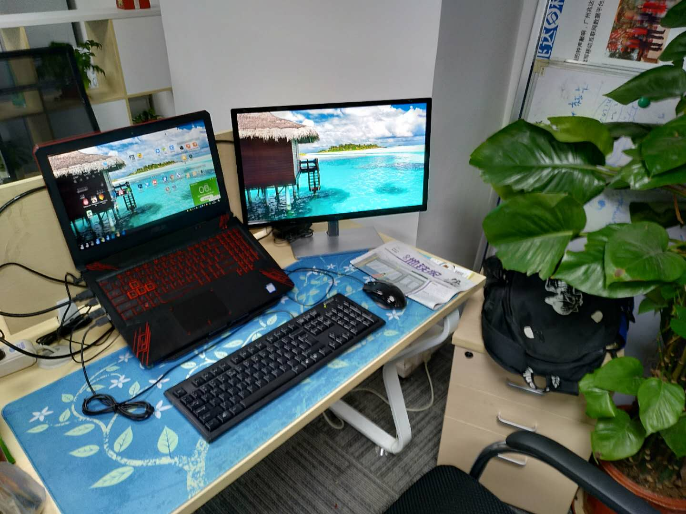
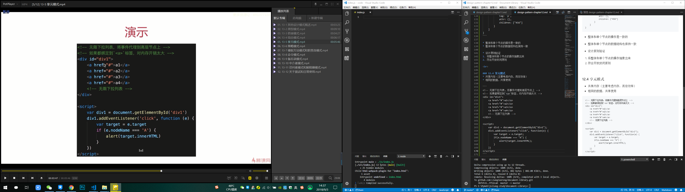

Document Library - 文档库
===

* Here is the jsliang's learning and working experience document on programming. If you have doubts about this, please send an email to 1741020489@qq.com.
* 这里存放了jsliang的学习、工作中关于编程的经验文档。如果你对此有疑惑，请发邮件到1741020489@qq.com。

 

## 一 前言

&emsp;本文档库始建于 `2018-08-20`，开始目的是做学习笔记。  

&emsp;如想知道 **jsliang** 最新学习进度，请前往 **[撰文思路](https://github.com/LiangJunrong/document-library/blob/master/other-library/Monologue/WritingIdeas.md)** 进行查看。  

&emsp;如想知道 **jsliang** 各种新奇玩意，请前往 **[网站清单](https://github.com/LiangJunrong/document-library/blob/master/other-library/Website/README.md)** 进行查看。

&emsp;建文档库的初始目的是记录一下 **jsliang** 的在折腾学习某个黑科技的时候的操作笔记，如果你学习而不写文章、不做笔记，某天你突发奇想，又要用到某个之前你用过的黑科技……那样的话，还需要百度或者 google 一遍，太累了！

&emsp;所以，集一生洪荒之力，写一个编程文档库，存放，我编程生涯的点点滴滴。

&emsp;**不折腾的前端，跟咸鱼有什么区别！** 

 

## 二 文件目录
| 文件名             | 存放内容                          |
| ------------------ | --------------------------------- |
| CSS-library        | CSS 文档仓库                       |
| HTML-library       | HTML 文档仓库                      |
| JavaScript-library | JavaScript 文档仓库                |
| other-library      | 其他文档仓库(整站制作/微信小程序)                      |
| public-repertory   | 文档仓库使用到的图片、CSS文件等…… |

 

## 三 个人网站

| 目录                                                   | 介绍                                       |
| ------------------------------------------------------ | ------------------------------------------ |
| [jsliang.top](http://jsliang.top/)                     | jsliang 的网站列表                         |
| [cv.jsliang.top](http://cv.jsliang.top/#/)             | 通过 ECharts + Vue 打造个人线上简历        |
| [playregex.jsliang.top](http://playregex.jsliang.top/) | 通过游戏来了解正则表达式                   |
| [lucky.jsliang.top](http://lucky.jsliang.top/)         | 悠闲刮刮乐，仅供娱乐                       |
| [deadline.jsliang.top](http://deadline.jsliang.top/)   | jsliang 的工作时间轴                       |
| [webpack.jsliang.top](http://webpack.jsliang.top/)     | Webpack 学习成果，Webpack 多页面配置       |
| [game.jsliang.top](http://game.jsliang.top/)           | 一个小游戏，只兼容 PC，适配移动端失败      |
| [company.jsliang.top](http://company.jsliang.top/)     | Node 打造企业网站，支持注册、登录及留言    |
| [work.jsliang.top](http://work.jsliang.top/)           | jsliang 工作成果，给领导或者工作小伙伴查看 |

 

## 四 反馈 QQ 群

&emsp;如果对该文档库的某篇文章存有疑惑，  
&emsp;如果有些问题想看下 **jsliang** 折腾过没有，  
&emsp;请加 QQ 群：`798961601`。  
&emsp;将第一时间根据小伙伴的疑问进行解答，谢谢~

 

## 五 推荐学习方法
  
&emsp;建议小伙伴们有机会可以给自己配个显示器，也就5/600，用起来也舒服。  
&emsp;**jsliang** 的就是一台手提（ 16G 6核 12线程 7200RMB ） + 一个显示器 （ 21.5寸 1080P 650RMB )。对搞前端的来说，这个价还是用得起的，而且自己的配置，自己用得会比较舒服。  
&emsp;最后，祝小伙伴们在编程生涯中找到自己的节奏，工资步步高升。

> 办公场景

> 学习场景

 

## 六 云服务器推广

&emsp;如果小伙伴需要订购云服务器来存放像 jsliang 个人网站类的静态或者有 Node 后端的网页，但却不知道怎么选择，可以加 **jsliang** QQ：`1741020489` 咨询，下面是一些优惠推广：  

&emsp;**腾讯云推广**：  

&emsp;新用户点这里：  
* [新客户无门槛 2775 元代金券](https://cloud.tencent.com/redirect.php?redirect=1025&cps_key=49f647c99fce1a9f0b4e1eeb1be484c9&from=console)  

&emsp;购买云服务器：  
* [12 月优惠低至 168 元/年](https://cloud.tencent.com/redirect.php?redirect=1014&cps_key=49f647c99fce1a9f0b4e1eeb1be484c9&from=console)

 

&emsp;**阿里云推广**：  

&emsp;新用户点这里：
* [新用户云产品 1888 通用代金券](https://promotion.aliyun.com/ntms/yunparter/invite.html?userCode=w7hismrh)

&emsp;购买云服务器：  
* [高性能云服务器 - 低至 293元/年](https://promotion.aliyun.com/ntms/act/qwbk.html?userCode=w7hismrh) 

&emsp;购买企业级云服务器：  
* [企业级高性能云服务器](https://promotion.aliyun.com/ntms/act/enterprise-discount.html?userCode=w7hismrh)

 

## 七 打赏
  
&emsp;撰文不易，如果文章对小伙伴有帮助，希望小伙伴们给勤劳敲代码、辛苦撰文的 **jsliang** 进行微信/支付宝打赏，你们的每一次打赏都是最好的鼓励，谢谢~

 

## 八 文档协议 
>  document library of jsliang by <a xmlns:cc="http://creativecommons.org/ns#" href="https://github.com/LiangJunrong/document-library" property="cc:attributionName" rel="cc:attributionURL">梁峻荣</a> is licensed under a <a rel="license" href="http://creativecommons.org/licenses/by-nc-sa/4.0/">Creative Commons Attribution-NonCommercial-ShareAlike 4.0 International License</a>. Based on a work at <a xmlns:dct="http://purl.org/dc/terms/" href="https://github.com/LiangJunrong/document-library" rel="dct:source">https://github.com/LiangJunrong/document-library</a>. Permissions beyond the scope of this license may be available at <a xmlns:cc="http://creativecommons.org/ns#" href="https://creativecommons.org/licenses/by-nc-sa/2.5/cn/" rel="cc:morePermissions">https://creativecommons.org/licenses/by-nc-sa/2.5/cn/</a>.

>  jsliang 的文档库 由 <a xmlns:cc="http://creativecommons.org/ns#" href="https://github.com/LiangJunrong/document-library" property="cc:attributionName" rel="cc:attributionURL">梁峻荣</a> 采用 <a rel="license" href="http://creativecommons.org/licenses/by-nc-sa/4.0/">知识共享 署名-非商业性使用-相同方式共享 4.0 国际 许可协议</a>进行许可。 基于<a xmlns:dct="http://purl.org/dc/terms/" href="https://github.com/LiangJunrong/document-library" rel="dct:source">https://github.com/LiangJunrong/document-library</a>上的作品创作。 本许可协议授权之外的使用权限可以从 <a xmlns:cc="http://creativecommons.org/ns#" href="https://creativecommons.org/licenses/by-nc-sa/2.5/cn/" rel="cc:morePermissions">https://creativecommons.org/licenses/by-nc-sa/2.5/cn/</a> 处获得。
