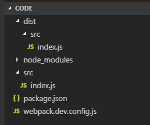
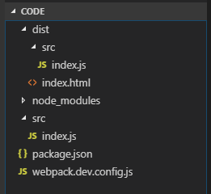

# 设计模式手册
> create by **jsliang** on **2018年8月21日11:30:00**  

<br>

> 知识普及：  
> 1. Webpack
> * **babel-core**：把es6中的新语法（箭头函数、rest参数等）解析成ast这种形式，然后配合各个插件分析语法进行相应的处理。
> * **babel-loader**：一种loader解析器，配合Webpack解析ES6编写的js文件。
> * **babel-preset-\***：babel-reset-2015包含了es6对应的新语法，如果配置了babel-reset-latest，则包含了es2015、es2016、es2017的插件（之后可能包括es2018等）。`注：在安装过程中jsliang发现，官方已不推荐使用babel-preset-*系列了，推荐使用下面介绍的babel-preset-env包。`
> * **babel-polyfill**：实现浏览器对不支持API的兼容（兼容旧环境、填补）。
> * **babel-preset-env**：如果不做任何配置，该loader等同于bable-preset-latest，如果你需要根据不同浏览器或者node版本进行配置，推荐使用babel-preset-env进行配置使用 [详情介绍](https://segmentfault.com/a/1190000011639765)

<br>

## 一. 部署开发环境

> ### 1.1 打包JavaScript
> 首先部署个能打包JavaScript的环境：
1. 执行命令行：`npm init -y`，初始化package.json文件。
2. 执行命令行：`cnpm i webpack webpack-cli -D`，安装webpack及其命令行工具webpack-cli。
3. 在根目录下新建src文件夹，并在里面新建index.js文件，该文件打印了个100。
> index.js
```
console.log(100);
```
4. 在根目录下新建webpack.dev.config.js文件。
> webpack.dev.config.js
```
module.exports = {
    entry: './src/index.js', // 入口文件
    output: { // 出口文件
        path: __dirname,
        filename: './dist/src/index.js'
    },
}
```
> 在webpack.dev.config.js中，我们做了两件事：
> 1. 告知webpack我们的入口文件（需要被解析的ES6文件）在根目录的src下的index.js； 
> 2. 告知webpack我们的出口文件（被解析后的ES5文件）需要打包到的位置是相对于当前目录的dist/src下的index.js。

<br>

5. 修改package.json文件。
> package.json
```
{
  "name": "design-pattern",
  "version": "1.0.0",
  "description": "design pattern for javascript",
  "main": "index.js",
  "scripts": {
    "dev": "webpack --config ./webpack.dev.config.js --mode development"
  },
  "keywords": [
    "javascript",
    "design",
    "pattern"
  ],
  "author": "jsliang",
  "license": "ISC",
  "devDependencies": {
    "webpack": "^4.16.5",
    "webpack-cli": "^3.1.0",
  }
}

```
> 在这里，我们修改了`"scripts"`部分，告知npm在`npm run dev`的时候，记得是使用webpack命令，用开发模式来解析配置文件webpack.dev.config.js。

6. 执行命令行：`npm run dev`，可以查看到在根目录中生成了个dist文件夹，该文件夹下存有一个src文件夹，里面包含了个index.js。
7. 此时目前目录如下：  


<br>

> ### 1.2 动态打包JavaScript

1. 执行命令行：`cnpm i webpack-dev-server html-webpack-plugin -D`，安装Webpack的devServer，这个能启动开发模式实时监控代码的webpack配置。同时，安装html-webpack-plugin，这个能解析HTML的插件。

2. 新建dist/index.html文件，由于这个HTML文件无特殊之处，所以这里不做过多讲解：
> index.html
```
<!DOCTYPE html>
<html lang="en">
<head>
    <meta charset="UTF-8">
    <meta name="viewport" content="width=device-width,initial-scale=1.0,maximum-scale=1.0,user-scalable=no">
    <meta http-equiv="X-UA-Compatible" content="ie=edge">
    <title>jsliang的设计模式</title>
</head>
<body>
    <p>jsliang的设计模式</p>
    
    <script src="https://cdn.bootcss.com/jquery/3.3.1/jquery.js"></script>
</body>
</html>
```

3. 根据我们安装的webpack-dev-server与html-webpack-plugin这两个配置，修改webpack.dev.config.js，使其能解析HTML文件和监控dist目录。
> webpack.dev.config.js
```
const path = require('path'); // 加载node中的path模块
const HtmlWebpackPlugin = require('html-webpack-plugin'); // 加载插件html-webpack-plugin

module.exports = {
    mode: 'development', // 开发模式
    entry: './src/index.js', // 入口文件
    output: { // 出口文件
        path: __dirname,
        filename: './dist/src/index.js'
    },
    plugins: [ 
        new HtmlWebpackPlugin({ // HTML加载插件
            template: './dist/index.html'
        })
    ],
    devServer: { // 开发服务
        contentBase: path.join(__dirname, './dist'), // 根目录
        open: true, // 自动打开浏览器
        port: 8080, // 端口
        //host: "192.168.1.107" // WiFi IPV4地址，打开可共享到手机
    }
}
```

4. 修改package.json，告知npm，我们不用webpack这个比较low的方式了，请给我用webpack-dev-server来启动`npm run dev`。
> package.json
```
{
  "name": "design-pattern",
  "version": "1.0.0",
  "description": "design pattern for javascript",
  "main": "index.js",
  "scripts": {
    "dev": "webpack-dev-server --config ./webpack.dev.config.js"
  },
  "keywords": [
    "javascript",
    "design",
    "pattern"
  ],
  "author": "jsliang",
  "license": "ISC",
  "devDependencies": {
    "html-webpack-plugin": "^3.2.0",
    "webpack": "^4.16.5",
    "webpack-cli": "^3.1.0",
    "webpack-dev-server": "^3.1.5"
  }
}
```
5. 执行命令行：`npm run dev`，发现浏览器自动打开`http://localhost:8080`(启动WiFi的情况下应该是打开类似于`http://192.168.1.107:8080/`)的网址：  


6. 此时文件目录为：  


<br>

> ### 1.3 自动打包ES6
1. 执行命令行：`cnpm i babel-core babel-loader babel-polyfill babel-preset-env -D`，安装ES6对应的解析配置，执行完毕后package.json会自动新增依赖包：
> package.json
```
{
  "name": "design-pattern",
  "version": "1.0.0",
  "description": "design pattern for javascript",
  "main": "index.js",
  "scripts": {
    "dev": "webpack-dev-server --config ./webpack.dev.config.js --mode development"
  },
  "keywords": [
    "javascript",
    "design",
    "pattern"
  ],
  "author": "jsliang",
  "license": "ISC",
  "devDependencies": {
    "babel-core": "^6.26.3",
    "babel-loader": "^7.1.5",
    "babel-polyfill": "^6.26.0",
    "babel-preset-env": "^1.7.0",
    "html-webpack-plugin": "^3.2.0",
    "webpack": "^4.16.5",
    "webpack-cli": "^3.1.0",
    "webpack-dev-server": "^3.1.5"
  }
}
```

2. 新建.babelrc文件，该文件为ES6解析到ES5必须使用的文件（注，现在市面上大部分浏览器还不能完全直接解析ECMA Script2015语法，所以只能将ES6转为ES5，就用到了.babelrc文件）：
> .babelrc
```
{
    "presets": [
        "env"
    ],
    "plugins": [
        
    ]
}
```

3. 修改webpack.dev.config.js，添加module，告知webpack在加载js文件的时候，需要使用babel-loader。
> webpack.dev.config.js
```
const path = require('path'); // 加载node中的path模块
const HtmlWebpackPlugin = require('html-webpack-plugin'); // 加载插件html-webpack-plugin

module.exports = {
    mode: 'development', // 开发模式
    entry: './src/index.js', // 入口文件
    output: { // 出口文件
        path: __dirname,
        filename: './dist/src/index.js'
    },
    module: { // 加载模块
        rules: [{ 
            test: /\.js$/, // .js文件加载loader
            include: path.resolve(__dirname, "./src"), // 检查的文件夹
            exclude: path.resolve(__dirname, "./node_modules"), // 不检查的文件夹
            loader: 'babel-loader' // 使用的loader
        }]
    },
    plugins: [ 
        new HtmlWebpackPlugin({ // HTML加载插件
            template: './dist/index.html'
        })
    ],
    devServer: { // 开发服务
        contentBase: path.join(__dirname, './dist'), // 根目录
        open: true, // 自动打开浏览器
        port: 8080, // 端口
        host: "192.168.1.107" // WiFi IPV4地址，打开可共享到手机
    }
}
```

4. 修改index.js，这里我们换成ES6语法（如果你还没学过ES6，你只需要知道这里弹窗显示了jsliang即可，内容可以忽略）：
> index.js
```
class Person {
    constructor(name) {
        this.name = name;
    }
    getName() {
        return this.name;
    }
}

let person = new Person("jsliang");
alert(person.getName());
```

5. 执行命令行：`npm run dev`，即可看到HTML页面弹窗显示 **jsliang** 。

<br>

> ### 1.4 能用于开发的ES6环境
1. more...