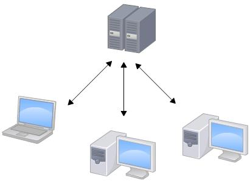
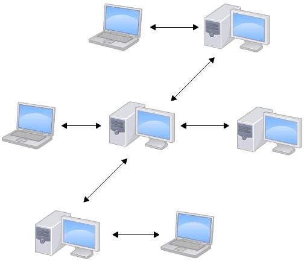

Git
===

> Create by **jsliang** on **2018-10-25 15:14:00**  
> Recently revised in **2019-04-02 21:31:22**

## <a name="chapter-one" id="chapter-one">一 目录</a>

**不折腾的前端，和咸鱼有什么区别**

| 目录 |
| --- | 
| [一 目录](#chapter-one) | 
| <a name="catalog-chapter-two" id="catalog-chapter-two"></a>[二 前言](#chapter-two) |
| <a name="catalog-chapter-three" id="catalog-chapter-three"></a>[三 正文](#chapter-three) |

## <a name="chapter-two" id="chapter-two">二 前言</a>

> [返回目录](#chapter-one)

一直以来，**jsliang** 对 Git 的操作，仅限于：`git add .`、`git commit -m "更新信息"`、`git push` 这三个，偶尔还会创建操作个分支。

但是，仅仅是这些是不够的。所以，跟随 **廖雪峰** 等大神的 Git 教程进行一波自我更新：

* [《Git 教程 - 廖雪峰》](https://www.liaoxuefeng.com/wiki/0013739516305929606dd18361248578c67b8067c8c017b000)

## 什么是 Git

Git 是目前世界上最先进的分布式版本控制系统。

这么说也许你很懵逼，没关系，我们用毕业论文来讲讲：


如上图。写过毕业论文的小伙伴，应该记忆深刻：《毕业论文》《毕业论文完成版》《毕业论文最终版》《毕业论文最最终版》……

令人抓狂无比，当我们需要在 **最最最最终版** 找到之前文件中早早被删除的信息时，我们更加抓狂了：卧槽，我写到哪去了！

这时候，如果有个软件之类的东西帮我们记录就好了：

| 文件名 | 更新信息 | 时间 |
| --- | --- | --- |
| 毕业论文 | 第一版，整体内容搭建 | 2019-3-28 08:41:04 |
| 毕业论文完成版 | 第二版，完成了大部分内容，并进行了排版 | 2019-3-29 08:41:46 |
| 毕业论文最终版 | 第三版，对第二版进行了删减 | 2019-3-30 08:42:21 |
| 毕业论文最最终版 | 第四版，对第三版进行了新增 | 2019-3-31 08:42:42 |
| ... | ... | ... |
| 毕业论文最最最最终版 | 第六版，对整了下格式 | 2019-4-2 08:43:17 |

OK，这时候我们会发觉，我们要找到被删减的内容，只需要去第二版中查找就行了，这就是为何会有版本管理工具的原因。

而 Git，就是目前较盛行的版本管理工具。

## 集中式与分布式

历史总是前进的，在 Git 之前，还是有其他的版本管理系统：

* VSS：最老的版本有锁，需要锁住才能编辑，提交时解锁，独占修改，小规模最好用，大规模最难用。
* CSV：代表协作版本系统或者并发版本系统同，是一种版本控制系统，提交失败时解决冲突比较麻烦。
* SVN：目标是想取代 CSV，相对于 CSV 采用了分支管理系统，配置成 HTTP 服务时比较简单，稳定。
* Git：相对于 SVN 多一个本地库。

> 历史总是被湮没，每次找资料，都找不全

关于版本管理工具的历史推进，咱在此就不做详述，如果有小伙伴找到比较全的资源，可以发出来分享下。

关于 SVN 和 Git，其实涉及两种管理系统的比较，即：**集中式与分布式**。

* 什么是集中式？集中式版本控制系统，版本库是集中存放在中央服务器的，而干活的时候，用的都是自己的电脑，所以要先从中央服务器取得最新的版本，然后开始干活，干完活了，再把自己的活推送给中央服务器。中央服务器就好比一个图书馆，你要改一本书，必须先从图书馆借出来，然后回到家自己改，改完了，再放回图书馆。



* 什么是分布式？区别于集中式版本控制系统，分布式版本控制系统中没有 “中央服务器”，每个人的电脑都是一个完整的版本库。既然你的电脑是一个完整的版本库，假设你改了文件 A，你的同事也改了文件 A，你们需要协作，这时候只需要将各自修改推送给对方，双方就知道对方修改了什么了。这就好比诸葛亮和周瑜在攻打曹操的时候，各自在手心写了一个字，写完之后亮给对方看，相视一笑：嗯，这 b 跟老子想得一样。



而 SVN 和 Git，分别作为集中式与分布式的代表之一。

## Git 安装

对于 Git 安装，2018 年 **jsliang** 入职公司的时候已经安装过，又因为 **廖雪峰** 大佬已经安排的明明白白了，故不多此一举，贴上安装步骤文章：

* [《安装 Git》](https://www.liaoxuefeng.com/wiki/0013739516305929606dd18361248578c67b8067c8c017b000/00137396287703354d8c6c01c904c7d9ff056ae23da865a000)

## Git 新建版本库

什么是版本库？

版本库又名仓库，英文名 repository，可以简单理解为一个目录，这个目录里面的所有文件都可以被 Git 管理起来，用于追踪每个文件的修改、删除。

1. 创建目录：`mkdir learngit`
2. 前进到这个目录：`cd learngit`
3. 显示当前目录：`pwd`
4. 初始化仓库：`git init`
5. 显示 `.git`：`ls -ah`

这时候会出来一个隐藏文件，叫 `.git`，这个目录就是 Git 用来跟踪管理版本库的，请不要手动修改里面的文件。

6. 添加文件，新建 `README.md`：

> README.md

```bash
Git 学习
===
```

7. 将文件添加到仓库：`git add README.md`（`git add .` 是提交当前目录所有文件）
8. 将文件提交到仓库：`git commit -m "Add a README"`

> 此处 `-m` 输入的是本次提交的说明，方便你根据说明查找需要的历史版本

9. 修改文件内容：

> README.md

```bash
Git 学习
===

> Create by **jsliang** on **2019-3-29 09:08:48**  
> Recently revised in **2019-3-29 09:08:53**
```

10. 查看结果：`git status`

```bash
On branch master
Changes not staged for commit:
  (use "git add <file>..." to update what will be committed)
  (use "git checkout -- <file>..." to discard changes in working directory)

        modified:   README.md

no changes added to commit (use "git add" and/or "git commit -a")
```

此刻可以看出，我们查看到了 `README.md` 被修改了。

11. 查看版本差异：`git diff`

```bash
index b379f95..78fb1fe 100644
--- a/README.md
+++ b/README.md
@@ -1,2 +1,5 @@
 Git 学习
-===
\ No newline at end of file
+===
+
+> Create by **jsliang** on **2019-3-29 09:09:03**
+> Recently revised in **2019-3-29 09:09:07**
\ No newline at end of file
```

12. 这时候，我们添加了时间，做了新的更改，所以我们又可以进行新一轮的提交：

* `git add .`
* `git commit -m "添加时间"`

13. 我们再添加下证书并提交：

> README.md

```bash
Git 学习
===

> Create by **jsliang** on **2019-3-29 09:09:03**  
> Recently revised in **2019-3-29 09:09:07**

> <a rel="license" href="http://creativecommons.org/licenses/by-nc-sa/4.0/"></a><br /><span xmlns:dct="http://purl.org/dc/terms/" property="dct:title">jsliang的文档库</span> 由 <a xmlns:cc="http://creativecommons.org/ns#" href="https://github.com/LiangJunrong/document-library" property="cc:attributionName" rel="cc:attributionURL">梁峻荣</a> 采用 <a rel="license" href="http://creativecommons.org/licenses/by-nc-sa/4.0/">知识共享 署名-非商业性使用-相同方式共享 4.0 国际 许可协议</a>进行许可。<br />基于<a xmlns:dct="http://purl.org/dc/terms/" href="https://github.com/LiangJunrong/document-library" rel="dct:source">https://github.com/LiangJunrong/document-library</a>上的作品创作。<br />本许可协议授权之外的使用权限可以从 <a xmlns:cc="http://creativecommons.org/ns#" href="https://creativecommons.org/licenses/by-nc-sa/2.5/cn/" rel="cc:morePermissions">https://creativecommons.org/licenses/by-nc-sa/2.5/cn/</a> 处获得。
```

* `git add .`
* `git commit -m "添加协议"`

14.  当我们做的事儿越多，越不可能记住几个字的更改，所以我们需要查找历史记录，见证我们成长的点滴：`git log`

```bash
commit 7b88d86f3e079e048c3e5444f91616b826f553a0 (HEAD -> master)
Author: jsliang <1741020489@qq.com>
Date:   Fri Mar 29 09:21:35 2019 +0800

    添加协议

commit 05abb578724b7d8cef860aa4280b0e19241c02a8
Author: jsliang <1741020489@qq.com>
Date:   Fri Mar 29 09:14:16 2019 +0800

    添加时间

commit 655433cc64356a8f9dc12e9a94808a25e844c0eb
Author: jsliang <1741020489@qq.com>
Date:   Fri Mar 29 09:03:59 2019 +0800
```

15. 回退到上一个版本：`git reset --hard HEAD^`

```bash
HEAD is now at 05abb57 添加时间
```

> 注意，`git log` 显示的记录中，`commit` 后面的就是 HEAD，Git 通过 HEAD 控制版本

16. **如果误回退了呢？**尝试回退版本号：`git reset --hard 7b88d86`

```bash
HEAD is now at 7b88d86 添加协议
```

OK，现在它又回来了。**记住：如果你操作失误回退了，请不要关闭命令行窗口，还有机会补救！**

17. 找不到版本号，想恢复新版本：`git reflog`

```bash
7b88d86 (HEAD -> master) HEAD@{0}: reset: moving to 7b88d86
05abb57 HEAD@{1}: reset: moving to HEAD^
7b88d86 (HEAD -> master) HEAD@{2}: commit: 添加协议
05abb57 HEAD@{3}: commit: 添加时间
```

可以看到，这里把前面版本的版本号显示出来了。

## Git 命令

### git fetch

从一个或多个其他存储库中获取分支和/或标签(统称为“引用”)以及完成其历史所必需的对象。 远程跟踪分支已更新(Git术语叫做commit)，需要将这些更新取回本地，这时就要用到git fetch命令。

### git 取消忽略文件大小写的更改

在当前项目，输入 `git config core.ignorecase false` 即可关闭 git 忽略文件大小写的配置。

### git 删除文件夹

* 删除 `target` 文件夹：`git rm -r --cached target`
* 提交更改：`git commit -m "删除 target 目录"`
* 确认更改：`git push`

### git 覆盖上一次 commit 提交信息

`git commit -amend -m "New commit"`

### git 分支

* 创建分支：`git branch cheny`
* 切换到分支：`git checkout cheny`
* 添加修改代码到缓存：`git add .`
* 提交：`git commit -m "修改"`
* 提交到分支：`git push origin cheny`/`git push --set-upstream origin cheny`

## 同时配置 GitLab 和 GitHub

* 缘由：公司使用 GitLab，个人使用 GitHub，因此需要配置下 Git，方便上传到公司的 GitLab 项目和个人的 GitHub 项目上。

* 参考文献：

1. [同一台电脑同时使用gitlab和github](https://blog.csdn.net/u014296452/article/details/79984867)
2. [配置同时使用 Gitlab 和 Github 的开发环境](https://www.cnblogs.com/kelsen/archive/2018/01/24/8342239.html)

* Mac 配置步骤

1. CD 到用户根目录下的 `.ssh` 文件夹中：`cd .ssh`
2. 生成 GitLab 秘钥：`ssh-keygen -t rsa -C "注册 gitlab 账户的邮箱"`，提示后输入 `id_rsa_gitlab`，这样就在 `.ssh` 目录下生成了 GitLab 的秘钥。
3. 生成 GitHub 秘钥：`ssh-keygen -t rsa -C "注册 github 账户的邮箱"`，提示后输入 `id_rsa_github`，这样就在 `.ssh` 目录下生成了 GitHub 的秘钥。

> 这时候我们 `.ssh` 目录中有文件：

```shell
id_rsa_github.pub	id_rsa_gitlab.pub
id_rsa_github		id_rsa_gitlab
```

4. 提供公钥给服务器
   1. 复制 ~/.ssh/id_rsa_gitlab.pub文件内容，进入gitlab / profile / SSH Keys，将公钥内容添加至 gitlab 。
   2. 复制 ~/.ssh/id_rsa_github.pub文件内容，进入github / setting / SSH and GPG keys / New SSH key 将公钥内容添加至 github 。
5. 在 `.ssh` 中添加 `config` 文件（文本文件，不存在后缀），内容为：

> config

```shell
Host github.com
  HostName github.com
  User githubuser@xyz.com
  IdentityFile ~/.ssh/id_rsa_github

Host gitlab.com
  HostName gitlab.com
  User gitlabuser@xyz.com
  IdentityFile ~/.ssh/id_rsa_gitlab
```

> 这时候我们 `.ssh` 目录中有文件：

```shell
id_rsa_github.pub	id_rsa_gitlab.pub
id_rsa_github		id_rsa_gitlab		config
```

6. （可选）在 GitHub 或者 GitLab 仓库大目录中使用下面三条命令：

```shell
git init
git config --global user.name "githubuser"
git config --global user.email "githubuser@xyz.com"
```

7. 在项目文件夹中使用以下命令：

```shell
git clone 项目地址
新增/修改文件
git add .
git commit -m "修改配置"
git push
```

8. 在终端输入账号密码信息后，就会提示上传成功了，最终项目目录中有文件：

```shell
config			id_rsa_github.pub	id_rsa_gitlab.pub
id_rsa_github		id_rsa_gitlab		known_hosts
```

## 配置 .gitignore

在我们使用Git的过程中，有时候喜欢建一些文件给自己查看使用而不是给大众使用，或者说像是 node_modules 这些文件不希望上传到代码仓库的，这时候就需要设置响应的忽略规则，来忽略这些文件的提交。

### 全局生效

定义全局 .gitignore 文件，将其放在任意位置即可生效

```bash
git config --global core.excludesfile ~/.gitignore
```

### 忽略规则

1. 忽略掉所有文件名是 test.html 的文件

```bash
test.html
```

2. 忽略掉 node_modules 文件夹

```bash
node_modules
```

3. 忽略掉所有生成的备份文件

```bash
*.*~
```

4. 忽略所有 .o 和 .a 文件

```bash
*.[oa]
```

5. 详细用法看文档：[详情](https://mirrors.edge.kernel.org/pub/software/scm/git/docs/gitignore.html)

### VS Code 隐藏 node_modules

值得一提的就是，我们不仅要忽略它的上传，在 Visio Studio Code 这个编辑器中，如果我们也需要忽略它的话，就需要进行相应的设置，VS Code 隐藏工作区中的 node_modules 文件夹： 主菜单 -> 文件 -> 首选项 -> 用户设置：

```bash
"file.exclude": {
    "node_modules/": true
}
```

---

> **jsliang** 广告推送：  
> 也许小伙伴想了解下云服务器  
> 或者小伙伴想买一台云服务器  
> 或者小伙伴需要续费云服务器  
> 欢迎点击 **[云服务器推广](https://github.com/LiangJunrong/document-library/blob/master/other-library/Monologue/%E7%A8%B3%E9%A3%9F%E8%89%B0%E9%9A%BE.md)** 查看！

[](https://promotion.aliyun.com/ntms/act/qwbk.html?userCode=w7hismrh)
[](https://cloud.tencent.com/redirect.php?redirect=1014&cps_key=49f647c99fce1a9f0b4e1eeb1be484c9&from=console)

> <a rel="license" href="http://creativecommons.org/licenses/by-nc-sa/4.0/"></a><br /><span xmlns:dct="http://purl.org/dc/terms/" property="dct:title">jsliang的文档库</span> 由 <a xmlns:cc="http://creativecommons.org/ns#" href="https://github.com/LiangJunrong/document-library" property="cc:attributionName" rel="cc:attributionURL">梁峻荣</a> 采用 <a rel="license" href="http://creativecommons.org/licenses/by-nc-sa/4.0/">知识共享 署名-非商业性使用-相同方式共享 4.0 国际 许可协议</a>进行许可。<br />基于<a xmlns:dct="http://purl.org/dc/terms/" href="https://github.com/LiangJunrong/document-library" rel="dct:source">https://github.com/LiangJunrong/document-library</a>上的作品创作。<br />本许可协议授权之外的使用权限可以从 <a xmlns:cc="http://creativecommons.org/ns#" href="https://creativecommons.org/licenses/by-nc-sa/2.5/cn/" rel="cc:morePermissions">https://creativecommons.org/licenses/by-nc-sa/2.5/cn/</a> 处获得。