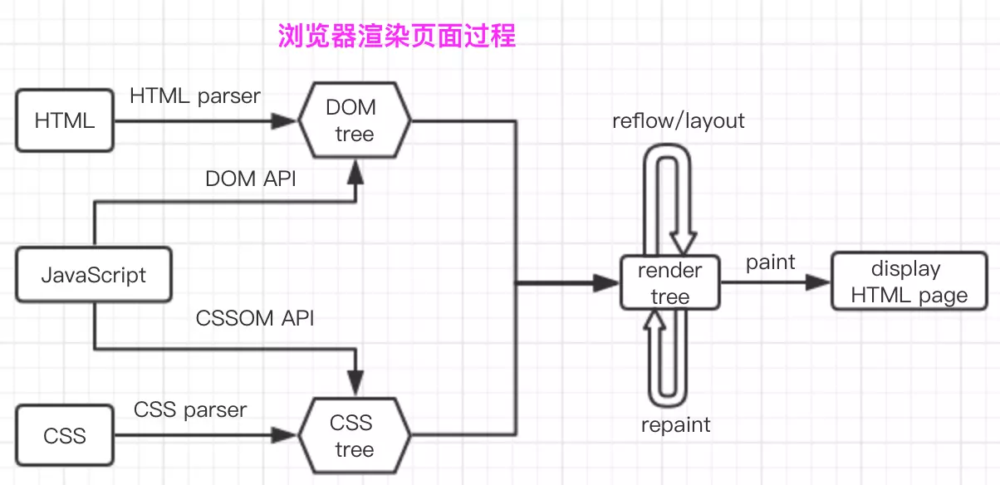

jsliang 的 2019 面试准备
===

> Create by **jsliang** on **2018-12-23 20:53:34**  
> Recently revised in **2019-2-15 08:32:41**

**时刻准备好自己的简历，不管是互联网经济不佳面临裁员，还是因为内部斗争严重想挪窝，只有随时更新自己，把自己的简历准备好，你才知道哪一刻跑路是最佳选择。**

本文的知识点将涉及 HTML、CSS、JS、HTTP、Vue、Webpack、打包工具、性能优化等，没有前置条件，看得懂可以瞅瞅复习下，看不懂可以瞅瞅学习下。

关于面试，在这记下慕课网视频看到的，个人非常认同的三个问答：

* 问：拿到一个面试题，第一时间看到什么？ 答：考点
* 问：如何看待网上搜出来的永远看不完的题海？ 答：不变应万变
* 问：如何对待面试题？ 答：题目到知识再到题目

> 参考1：[《一位前端 2018 绝地求生记》](https://juejin.im/post/5c36fe50518825253b5e94f4)

## <a name="chapter-one" id="chapter-one">一 目录</a>

**不折腾的前端，和咸鱼有什么区别**

| 目录 |
| --- | 
| [一 目录](#chapter-one) | 
| <a name="catalog-chapter-two" id="catalog-chapter-two"></a>[二 前言](#chapter-two) |
| <a name="catalog-chapter-three" id="catalog-chapter-three"></a>[三 HTML](#chapter-three) |
| <a name="catalog-chapter-four" id="catalog-chapter-four"></a>[四 CSS](#chapter-four) |
| <a name="catalog-chapter-five" id="catalog-chapter-five"></a>[五 JavaScript](#chapter-five) |
| <a name="catalog-chapter-six" id="catalog-chapter-six"></a>[六  其他](#chapter-six) |

## <a name="chapter-two" id="chapter-two">二 前言</a>

> [返回目录](#catalog-chapter-two)

跳槽的两个原因：

1. 钱没给到位。
2. 心被委屈了。

如果非要给 **jsliang** 我自己的跳槽定个位，首先是钱没给到位，劳动与产出不成正比：在我 2018 年 5 月入职前，与人事的交谈是转正 5.5K，一年中 8 月和 2 月可以提薪，当初的技术栈是：HTML、CSS、ES5。

然后，2018 年 6 月到 2019 年 1 月，学习并应用到工作中的技术有：

1. jQuery
2. Webpack
3. JSP
4. 微信小程序
5. Vue
6. ECharts

其中 2018 年 8 月刚转正，也不敢说自己技术值得提薪，然后 2019 年 1 月底跟人事交谈的时候，说的是年终述职演讲得好的给提薪，2 月表示提薪名单没我份……

enm...所以心也委屈了。

> 关于 2018 的努力：  
> GitHub 见证：[点击查看](https://github.com/LiangJunrong)  
> 掘金见证：[点击查看](https://juejin.im/user/584613ba128fe10058b3cf68)

## <a name="chapter-three" id="chapter-three">三 HTML</a>

> [返回目录](#catalog-chapter-three)

HTML 内容

## <a name="chapter-four" id="chapter-four">四 CSS</a>

> [返回目录](#catalog-chapter-four)

### CSS 书籍

* 《CSS 权威指南》
* 《CSS 揭秘》
* 《CSS 世界》

## <a name="chapter-five" id="chapter-five">五 JavaScript</a>

> [返回目录](#catalog-chapter-five)

### JavaScript 书籍

* 《JavaScript 高级程序（第三版）》
* 《你不知道的 JavaScript》
* 《JavaScript 忍者秘籍》
* 《ES6 标准入门》——阮一峰
* 《JavaScript 设计模式》——张容铭
* 《JavaScript 设计模式与开发实践》——曾探

### 面向对象与面向过程

1. 什么是面向过程与面向对象？

* 面向过程就是做围墙的时候，由你本身操作，叠第一层的时候：放砖头，糊水泥，放砖头，糊水泥；然后第二层的时候，继续放砖头，糊水泥，放砖头，糊水泥……
* 面向对象就是做围墙的时候，由他人帮你完成，将做第一层的做法抽取出来，就是放砖头是第一个动作，糊水泥是第二个动作，然后给这两个动作加上步数，最后告诉机器人有 n 层，交给机器人帮你工作就行了。

2. 为什么需要面向对象写法？

* 更方便
* 可以复用，减少代码冗余度
* 高内聚低耦合

3. 手写个面向对象代码？

```
function Person(name, phone) {
  this.name = name;
  this.phone = phone;
  this.eat = function() {
    console.log(name + " 吃饭");
  }

  return this;
}

let p1 = new Person("jsliang", "18818881888");
console.log(p1.name); // jsliang
p1.eat(); // jsliang 吃饭
```

### 原型与原型链

* 实例的 `__proto__` 属性（原型）等于其构造函数的 `prototype` 属性。

```
// 首先记住三条公式
Object.__proto__=== Function.prototype
Function.prototype.__proto__=== Object.prototype
Object.prototype.__proto__ === null


// 然后理解下面的题目
function Person(name) {
    this.name = name
}
let p = new Person('Tom');

// 问：1. p.__proto__等于什么？
// 答：Person.prototype

// 问：2. Person.__proto__等于什么？
// 答：Function.prototype


// 最后思考为什么下面题目是这个答案？
var foo = {},
    F = function(){};
Object.prototype.a = 'value a';
Function.prototype.b = 'value b';

console.log(foo.a); // value a
console.log(foo.b); // undefined
console.log(F.a); // value a
console.log(F.b); // value b
```

### Vue

* 对 MVVM 的理解

在 MVVM 架构下，View 和 Model 之间并没有直接的联系，而是通过 ViewModel 进行交互，Model 和 ViewModel 之间的交互时双向的，因此 View 数据会同步到 Model 中，而 Model 数据的变化也会立即反应到 View 上。

ViewModel 通过双向数据绑定把 View 层和 Model 层连接了起来，而 View 和 Model 之间的同步工作完全是自动的，无需人为干涉，因此开发者只需要关注业务逻辑，不需要手动操作 DOM，不需要关注数据状态的同步问题，复杂的数据状态维护完全由 MVVM 来统一管理。

1. M - Model。Model 代表数据模型，也可以在 Model 中定义数据修改和操作的业务逻辑。
2. V - View。View 代表 UI 组件，它负责将数据模型转化为 UI 展现出来。
3. VM - ViewModel。ViewModel 监听模型数据的改变和控制视图行为、处理用户交互，简单理解就是一个同步 View 和 Model 的对象，连接 Model 和 View。

* Vue 的生命周期

1. 创建前/后：在 **beforeCreated** 阶段，Vue 实例的挂载元素 `$el` 和数据对象 data 以及事件还未初始化。在 **created** 阶段，Vue 实例的数据对象 data 以及方法的运算有了，`$el` 还没有。
2. 载入前/后：在 **beforeMount** 阶段，`render` 函数首次被调用，Vue 实例的 $el 和 data 都初始化了，但还是挂载在虚拟的 DOM 节点上。在 **mounted** 阶段，Vue 实例挂载到实际的 DOM 操作完成，一般在该过程进行 Ajax 交互。
3. 更新前/后：在数据更新之前调用，即发生在虚拟 DOM 重新渲染和打补丁之前，调用 **beforeUpdate**。在虚拟 DOM 重新渲染和打补丁之后，会触发 **updated** 方法。
4. 销毁前/后：在执行实例销毁之前调用 **beforeDestory**，此时实例仍然可以调用。在执行 **destroy** 方法后，对 data 的改变不会再触发周期函数，说明此时 Vue 实例已经解除了事件监听以及和 DOM 的绑定，但是 DOM 结构依然存在。

Vue 生命周期问题系列

> 1. 什么是 Vue 生命周期  
> 答：Vue 实例从创建到销毁的过程，就是生命周期。从开始创建、初始化数据、编译模板、挂载 DOM -> 渲染、更新 -> 渲染、销毁等一系列过程，称之为 Vue 的生命周期。

> 2. Vue 有几个生命周期，它们的作用主要是什么？  
> 答：8 个，创建前/创建后、挂载前/挂载后、更新前/更新后、销毁前/销毁后。Vue 生命周期的作用是方便我们通过它的生命周期，在业务代码中更好地操作数据，实现相关功能。

> 3. 第一次页面加载会触发 Vue 哪几个钩子？  
> 答：会触发 4 个生命钩子：创建前/创建后、挂载前/挂载后

> 4. DOM 渲染在哪个周期就已经完成？  
> 答：在 `beforeMounted` 时它执行了 `render` 函数，对 $el 和 data 进行了初始化，但此时还是挂载到虚拟的 DOM 节点，然后它在 `mounted` 时就完成了 DOM 渲染，这时候我们一般还进行 Ajax 交互，

* 对 Vue 双向数据绑定原理的理解

Vue 采用 **数据劫持** 结合 **发布者-订阅者** 模式的方式，通过 `Object.defineProperty()` 来劫持各个属性的 setter 以及 getter，在数据变动时发布消息给订阅者，触发相应的监听回调。

1. 第一步：需要 Observe 的数据对象进行递归遍历，包括子属性对象的属性，都加上 setter 和 getter。这样的话，给这个对象的某个值赋值，就会触发 setter，那么就能监听到了数据变化。
2. 第二步：Compile 解析模板指令，将模板中的变量替换成数据，然后初始化渲染页面视图，并将每个指令对应的节点绑定更新函数，添加监听数据的订阅者，一旦数据有变动，收到通知，更新数据。
3. 第三步：Watcher 订阅者是 Observer 和 Compile 之间通信的桥梁，主要做的事情有：
   1. 在自身实例化时往属性订阅器（dep）里面添加自己。
   2. 自身必须有一个 update() 方法
   3. 待属性变动 `dep.notice()` 通知时，能调用自身的 `update()` 方法，并触发 Compile 中绑定的回调，则功成身退。
4. 第四步：MVVM 作为数据绑定的入口，整合 Observer、Compile 和 Watcher 三者，通过 Observer 来监听自己的 model 数据变化，通过 Compile 来解析编译模板指令，最终利用 Watcher 搭起 Observer 和 Compile 之间的桥梁，达到数据变化 -> 视图更新；视图交互变化（input） -> 数据 model 变更的双向绑定效果。

> js 实现简单的双向绑定

```
<body>
  <div id="app">
    <input type="text" id="txt">
    <p id="show"></p>
  </div>
  
  <script>
    window.onload = function() {
      let obj = {};
      Object.defineProperty(obj, "txt", {
        get: function() {
          return obj;
        },
        set: function(newValue) {
          document.getElementById("txt").value = newValue;
          document.getElementById("show").innerHTML  = newValue;
        }
      })
      document.addEventListener("keyup", function(e) {
        obj.txt = e.target.value;
      })
    }
  </script>
</body>
```

* Vue template 编译的理解

Vue 中 template 就是先转化成 AST 树，再得到 render 函数返回 VNode（Vue 的虚拟 DOM 节点）。

1. 通过 compile 编译器把 template 编译成 AST 语法树（abstract syntax tree - 源代码的抽象语法结构的树状表现形式），compile 是 createCompiler 的返回值，createCompiler 是用以创建编译器的。另外 compile 还负责合并 option。
2. AST 会经过 generate（将 AST 语法树转换成 render function 字符串的过程）得到 render 函数，render 的返回值是 VNode，VNode 是 Vue 的虚拟 DOM 节点，里面有标签名、子节点、文本等待。

* event & v-model: 事件和v-model的实现原理
* slot & keep-alive: 内置组件的实现原理
* transition: 过渡的实现原理
* vue-router: 官方路由的实现原理
* vuex: 官方状态管理的实现原理

* 虚拟 DOM

Vue 在 `render` 中 `createElement` 的时候，并不是产生真实的 DOM 元素，实际上 `createElement` 描述为 `createNodeDescription`，因为它所包含的信息会告诉 Vue 页面上需要渲染什么样的节点。因此，我们将这样的节点描述为 “虚拟节点”（Virtual Node），简称 VNode。“虚拟 DOM” 是我们对由 Vue 组件树建立的整个 VNode 树的称呼。

* 零碎知识点

1. 父子组件通讯：父组件使用 `props` 将数据传给子组件；然后子组件通过 `$emit` 触发父元素的自定义事件。[最佳阐释](https://blog.csdn.net/sllailcp/article/details/78595077)
2. 

## <a name="chapter-six" id="chapter-six">六 其他</a>

> [返回目录](#catalog-chapter-six)

### 推荐

1. 技术胖
2. 慕课网

### 大纲整理

1. 闭包
2. this 指向问题
3. 原型和原型链
4. 面向对象与设计模式
5. Flex 布局
6. macrotask 和 microtask
7. http 协议，例如 keep-alive，例如状态码，例如三次握手四次挥手
8. 字符串操作
9. 从输入 URL 到页面加载发生了什么
10. 网页具体是如何渲染的
11. 前端性能优化（[地址1](https://csspod.com/frontend-performance-best-practices/)、[地址2](https://juejin.im/post/5bbaa549e51d450e827b6b13)）

### 网络知识

#### DNS

* 当用户在浏览器输入 `http://jsliang.top` 时，DNS 经历了以下步骤：

1. 浏览器根据地址，在自身缓存中查找 DNS（域名服务器） 中的解析记录。如果存在，则直接返回 IP 地址；如果不存在，则查找操作系统中的 hosts 文件是否有该域名的 DNS 解析记录，如果有就返回。
2. 在条件 1 中的浏览器缓存或者操作系统的 hosts 文件中都没有这个域名的 DNS 解析记录，或者已经过期，则向域名服务器发起请求解析这个域名。
3. 先向本地域名服务器中请求，让它解析这个域名，如果解析不了，则向根域名服务器请求解析。
4. 根服务器给本地域名服务器返回一个主域名服务器。
5. 本地域名服务器向主域名服务器发起解析请求。
6. 主域名服务器接收到解析请求后，查找并返回域名对应的域名服务器的地址。
7. 域名服务器会查询存储的域名和 IP 的映射关系表，返回目标 IP 记录以及一个 TTL（Time To Live）值。
8. 本地域名服务器接收到 IP 和 TTL 值，进行缓存，缓存的时间由 TTL 值控制。
9. 将解析的结果返回给用户，用户根据 TTL 值缓存在本地系统缓存中，域名解析过程结束。

#### 浏览器解析 URL

* 当用户输入 URL，到浏览器呈现给用户页面，经历了一下过程：

1. 用户输入 URL，浏览器获取到 URL。
2. 浏览器（应用层）进行 DNS 解析（如果输入的是 IP 地址，此步骤省略）
3. 根据解析出的 IP 地址 + 端口，浏览器（应用层）发起 HTTP 请求，请求中携带请求头（header）和请求体（body）。
4. 请求到达传输层，TCP 协议为传输报文提供可靠的字节流传输服务，它通过三次握手等手段来保证传输过程的安全可靠，通过将大块数据的分割成一个个报文段的方式提供给大量数据的便携传输。
5. 到网络层，网络层通过 ARP 寻址得到接受方的 Mac 地址，IP 协议把在传输层被分割成一个个数据包传送接受方。
6. 数据到达数据链路层，请求阶段完成。
7. 接收方在数据链路层收到数据包之后，层层传递到应用层，接受方应用程序就得到请求报文。
8. 接收方收到发送方的 HTPP 请求之后，进行请求文件资源（如 HTML 文件）的寻找并响应报文。
9. 发送方收到响应报文后，如果报文中的状态码表示请求成功，则接受返回的资源（如 HTML 文件），进行页面渲染。

#### 浏览器渲染页面

* 浏览器渲染页面的过程 - [详细讲解](https://juejin.im/post/5bbaa549e51d450e827b6b13)：

1. 浏览器通过 HTMLParser 根据深度遍历的原则把 HTML 解析成 DOM Tree。
2. 浏览器通过 CSSParser 将 CSS 解析成 CSS Rule Tree（CSSOM Tree）。
3. 浏览器将 JavaScript 通过 DOM API 或者 CSSOM API 将 JS 代码解析并应用到布局中，按要求呈现响应的结果。
4. 根据 DOM 树和 CSSOMG 树来构造 render Tree。
5. layout：重排，当 render tree 中任一节点的几何尺寸发生改变，render tree 就会重新布局，重新来计算所有节点在屏幕的位置。
6. repaint：重绘，当 render tree 中任一元素样式属性（几何尺寸没改变）发生改变时，render tree 都会重新画，比如字体颜色，背景等变化。
7. paint：遍历 render tree，并调动硬件图形 API 来绘制每个节点。



### 性能优化

性能优化：

#### CSS 部分

1. 优化选择器路径：使用 `.c {}` 而不是 `.a .b .c {}`。
2. 选择器合并：共同的属性内容提起出来，压缩空间和资源开销。
3. 精准样式：使用 `padding-left: 10px` 而不是 `padding: 0 0 0 10px`。
4. 雪碧图：将小的图标合并到一张图中，这样所有的图片只需要请求一次。
5. 避免通配符：`.a .b * {}` 这样的选择器，根据从右到左的解析顺序在解析过程中遇到通配符 `* {}` 会遍历整个 DOM，性能大大损耗。
6. 少用 float：`float` 在渲染时计算量比较大，可以使用 flex 布局。
7. 为 0 值去单位：增加兼容性。
8. 压缩文件大小，减少资源下载负担。

#### JavaScript 部分

1. 尽可能把 `<script>` 标签放在 `body` 之后，避免 JS 的执行卡住 DOM 的渲染，最大程度保证页面尽快地展示出来。
2. 尽可能合并 JS 代码：提取公共方法，进行面向对象设计等……
3. CSS 能做的事情，尽量不用 JS 来做，毕竟 JS 的解析执行比较粗暴，而 CSS 效率更高。
4. 尽可能逐条操作 DOM，并预定好 CSs 样式，从而减少 reflow 或者 repaint 的次数。
5. 尽可能少地创建 DOM，而是在 HTML 和 CSS 中使用 `display: none` 来隐藏，按需显示。
6. 压缩文件大小，减少资源下载负担。

#### HTML 部分

1. 避免 HTML 中书写 CSS 代码，因为这样难以维护。
2. 使用 Viewport 加速页面的渲染。
3. 使用语义化标签，减少 CSS 代码，增加可读性和 SEO。
4. 减少标签的使用，DOM 解析是一个大量遍历的过程，减少不必要的标签，能降低遍历的次数。
5. 避免 src、href 等的值为空，因为即时它们为空，浏览器也会发起 HTTP 请求。
6. 减少 DNS 查询的次数。

### 快速记忆知识点

1. 三次握手：① 客户机 -> SYN -> 服务器；② 客户机 <- SYN + ACK <- 服务器；③ 客户机 -> ACK -> 服务器。
2. URL 的组成：协议 + 服务器地址（域名 或 IP + 端口） + 路径 + 文件名

> <a rel="license" href="http://creativecommons.org/licenses/by-nc-sa/4.0/"></a><br /><span xmlns:dct="http://purl.org/dc/terms/" property="dct:title">jsliang 的文档库</span> 由 <a xmlns:cc="http://creativecommons.org/ns#" href="https://github.com/LiangJunrong/document-library" property="cc:attributionName" rel="cc:attributionURL">梁峻荣</a> 采用 <a rel="license" href="http://creativecommons.org/licenses/by-nc-sa/4.0/">知识共享 署名-非商业性使用-相同方式共享 4.0 国际 许可协议</a>进行许可。<br />基于<a xmlns:dct="http://purl.org/dc/terms/" href="https://github.com/LiangJunrong/document-library" rel="dct:source">https://github.com/LiangJunrong/document-library</a>上的作品创作。<br />本许可协议授权之外的使用权限可以从 <a xmlns:cc="http://creativecommons.org/ns#" href="https://creativecommons.org/licenses/by-nc-sa/2.5/cn/" rel="cc:morePermissions">https://creativecommons.org/licenses/by-nc-sa/2.5/cn/</a> 处获得。