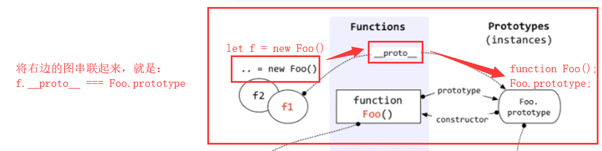

2019 面试准备 - JS 原型与原型链
===

> Create by **jsliang** on **2019-2-21 08:42:02**  
> Recently revised in **2019-2-23 09:44:08**

**Hello 小伙伴们，如果觉得本文还不错，记得给个 **star** ， 你们的 **star** 是我学习的动力！[GitHub 地址](https://github.com/LiangJunrong/document-library/blob/master/other-library/Interview/KnowledgePoints/JS-%E5%8E%9F%E5%9E%8B%E4%B8%8E%E5%8E%9F%E5%9E%8B%E9%93%BE.md)**

**本文涉及知识点**：

* `prototype`
* `__proto__`
* `new`
* `call()`/`apply()`/`bind()`
* `this`

**在本文中，jsliang 会讲解通过自我探索后关于上述知识点的个人理解，如有纰漏、疏忽或者误解，欢迎各位小伙伴留言指出。**

> 如果小伙伴对文章存有疑问，想快速得到回复。  
> 或者小伙伴对 jsliang 个人的前端文档库感兴趣，也想将自己的前端知识整理出来。  
> 欢迎加 QQ 群一起探讨：`798961601`。

## <a name="chapter-one" id="chapter-one">一 目录</a>

**不折腾的前端，和咸鱼有什么区别**

| 目录 |
| --- | 
| [一 目录](#chapter-one) | 
| <a name="catalog-chapter-two" id="catalog-chapter-two"></a>[二 前言](#chapter-two) |
| <a name="catalog-chapter-three" id="catalog-chapter-three"></a>[三 题目](#chapter-three) |
| <a name="catalog-chapter-four" id="catalog-chapter-four"></a>[四 解题](#chapter-four) |
| <a name="catalog-chapter-five" id="catalog-chapter-five"></a>[五 知识拓展](#chapter-five) |
| &emsp;<a name="catalog-chapter-five-one" id="catalog-chapter-five-one"></a>[5.1 问题少年：旅途开始](#chapter-five-one) |
| &emsp;<a name="catalog-chapter-five-two" id="catalog-chapter-five-two"></a>[5.2 原型及原型链](#chapter-five-two) |
| &emsp;<a name="catalog-chapter-five-three" id="catalog-chapter-five-three"></a>[5.3 new 为何物](#chapter-five-three) |
| &emsp;<a name="catalog-chapter-five-four" id="catalog-chapter-five-four"></a>[5.4 call() 又是啥](#chapter-five-four) |
| &emsp;<a name="catalog-chapter-five-five" id="catalog-chapter-five-five"></a>[5.5 this 指向哪](#chapter-five-five) |
| <a name="catalog-chapter-six" id="catalog-chapter-six"></a>[六  总结](#chapter-six) |
| <a name="catalog-chapter-seven" id="catalog-chapter-seven"></a>[七 参考文献](#chapter-seven) |
| <a name="catalog-chapter-eight" id="catalog-chapter-eight"></a>[八 工具](#chapter-eight) |

## <a name="chapter-two" id="chapter-two">二 前言</a>

> [返回目录](#chapter-one)

广州小伙伴在帮我进行面试摸底的时候，提出了问题：**能否谈谈 this 的作用？**

题目的目的：

1. 了解 this，说一下 this 的作用。
2. Vue 的 this.变量，this 指向 Vue 的哪里。（指 Vue 的实例）
3. Vue 里写个 setTimeout，发现 this 改变（`call()`、`apply()`、`=>`）
4. ……大致如此……

但是，我发现了我走了一条不归路，无意间我看了下 `prototype`！

然后，我爬上了一座高山……

## <a name="chapter-three" id="chapter-three">三 题目</a>

> [返回目录](#chapter-one)

相信有的小伙伴能自信地做出下面这些题~

* 题目 1

```js
var A = function() {};
A.prototype.n = 1;
var b = new A();
A.prototype = {
  n: 2,
  m: 3
}
var c = new A();

console.log(b.n);
console.log(b.m);

console.log(c.n);
console.log(c.m);
```

请写出上面编程的输出结果是什么？

* 题目 2

```js
var F = function() {};

Object.prototype.a = function() {
  console.log('a');
};

Function.prototype.b = function() {
  console.log('b');
}

var f = new F();

f.a();
f.b();

F.a();
F.b();
```

请写出上面编程的输出结果是什么？

* 题目 3

```js
function Person(name) {
    this.name = name
}
let p = new Person('Tom');
```

问题1：1. p.__proto__等于什么？

问题2：Person.__proto__等于什么？

* 题目 4

```js
var foo = {},
    F = function(){};
Object.prototype.a = 'value a';
Function.prototype.b = 'value b';

console.log(foo.a);
console.log(foo.b);

console.log(F.a);
console.log(F.b);
```

请写出上面编程的输出结果是什么？

## <a name="chapter-four" id="chapter-four">四 解题</a>

> [返回目录](#chapter-one)

* 题目 1 答案：

```js
b.n -> 1
b.m -> undefined;

c.n -> 2;
c.m -> 3;
```

* 题目 2 答案：

```js
f.a() -> a
f.b() -> f.b is not a function

F.a() -> a
F.b() -> b
```

* 题目 3 答案

答案1：Person.prototype

答案2：Function.prototype

* 题目 4 答案

```js
foo.a => value a
foo.b => undefined
F.a => value a
F.b => value b
```

如果小伙伴们查看完答案，仍不知道怎么回事，那么，我们扩展下自己的知识点，畅快了解更多地知识吧！

## <a name="chapter-five" id="chapter-five">五 知识拓展</a>

> [返回目录](#chapter-one)

原型和原型链估计是老生常谈的话题了，但是还是有很多小白（例如 **jsliang** 自己）就时常懵逼在这里。


> 首图祭祖，让暴风雨来得更猛烈些吧！

### <a name="chapter-five-one" id="chapter-five-one">5.1 问题少年：旅途开始</a>

> [返回目录](#chapter-one)

因为爱（了解来龙去脉），所以 **jsliang** 开始学习（百度）之旅，了解原型和原型链。

**首先**，**jsliang** 去了解查看原型链 `prototype`。

**然后**，在了解途中看到了 `new`，于是百度查看 JS 的 `new` 理念。

**接着**，接触 `new` 会了解还有 `call()`，而 `call()`、`apply()` 以及箭头函数 `=>` 又是相似的东西。

**最后**，当我们查找 `call()` 的时候，它又涉及到了 `this`，所以我们 “顺便” 查阅 `this` 吧。

### <a name="chapter-five-two" id="chapter-five-two">5.2 原型及原型链</a>

> [返回目录](#chapter-one)

**首先**，为什么需要原型及原型链？

我们查看一个例子：

```js
function Person(name, age) {
  this.name = name;
  this.age = age;
  this.eat = function() {
    console.log(age + "岁的" + name + "在吃饭。");
  }
}

let p1 = new Person("jsliang", 24);
let p2 = new Person("jsliang", 24);

console.log(p1.eat === p2.eat); // false
```

可以看到，对于同一个函数，我们通过 `new` 生成出来的实例，都会开出新的一块堆区，所以上面代码中 person 1 和 person 2 的吃饭是不同的。

拥有属于自己的东西（例如房子、汽车），这样很好。但它也有不好，毕竟总共就那么点地儿（内存），你不停地建房子，到最后是不是没有空地了？（内存不足）

所以，咱要想个法子，建个类似于共享库的对象（例如把楼房建高），这样就可以在需要的时候，调用一个类似共享库的对象（社区），让实例能够沿着某个线索去找到自己归处。

而这个线索，在前端中就是原型链 `prototype`。

```js
function Person(name) {
  this.name = name;
}

// 通过构造函数的 Person 的 prototype 属性找到 Person 的原型对象
Person.prototype.eat = function() {
  console.log("吃饭");
}

let p1 = new Person("jsliang", 24);
let p2 = new Person("梁峻荣", 24);

console.log(p1.eat === p2.eat); // true
```

看！这样我们就通过分享的形式，让这两个实例对象指向相同的位置了（社区）。

**然后**，说到这里，我们就兴趣来了，`prototype` 是什么玩意？居然这么神奇！

孩子没娘，说来话长。首先我们要从 JavaScript 这玩意的诞生说起，但是放这里的话，故事主线就太长了，所以这里有个本文的剧场版[《JavaScript 世界万物诞生记》](https://zhuanlan.zhihu.com/p/22989691)，感兴趣的小伙伴可以去了解一下。这里我们还是看图，并回归本话题：



* JS 说，我好寂寞。因为 JS 的本源是空的，即：null。
* JS 说，要有神。所以它通过万能术 `__proto__` 产生了 No1 这号神，即：`No1.__proto__ == null`。
* JS 说，神你要有自己的想法啊。所以神自己想了个方法，根据自己的原型 `prototype` 创建了对象 `Object`，即：`Object.prototype == No1; No1.__proto__ == null`。于是我们把 `prototype` 叫做原型，就好比 `Object` 的原型是神，男人的原型是人类一样，同时 `__proto__` 叫做原型链，毕竟有了 `__proto__`，对象、神、JS 之间才有联系。这时候 `Object.prototype.__proto__ == null`。
* JS 说，神你要有更多的想法啊，我把万能术 `__proto__` 借你用了。所以神根据 `Object`，使用 `__proto__` 做了个机器 No2，即 `No2.__proto__ == No1`，并规定所有的东西，通过 `__proto__` 可以连接机器，再找到自己，包括 `Object` 也是，于是 **Object 成为所有对象的原型**，`Object.__proto__.__proto__ == No1`，然后 `String`、`Number`、`Boolean`、 `Array` 这些物种也是如此。
* JS 说，神你的机器好厉害喔！你的机器能不能做出更多的机器啊？神咧嘴一笑：你通过万能术创造了我，我通过自己原型创造了对象。如此，那我造个机器 Function，`Function.prototype == No2, Function.__proto__ == No2`，即 `Function.prototype == Function.__proto__` 吧！这样 No2 就成了造机器的机器，它负责管理 Object、Function、String、Number、Boolean、Array 这几个。

**最后**，说到这里，我们应该很了解开局祭祖的那副图，并有点豁然开朗的感觉，能清楚地了解下面几条公式了：

```
Object.__proto__ === Function.prototype;
Function.prototype.__proto__ === Object.prototype;
Object.prototype.__proto__ === null;
```

### <a name="chapter-five-three" id="chapter-five-three">5.3 new 为何物</a>

> [返回目录](#chapter-one)

这时候，我们知道 `prototype` 以及 `__proto__` 是啥了，让我们回归之前的代码：

```js
function Person(name) {
  this.name = name;
}

// 通过构造函数的 Person 的 prototype 属性找到 Person 的原型对象
Person.prototype.eat = function() {
  console.log("吃饭");
}

let p1 = new Person("jsliang", 24);
let p2 = new Person("梁峻荣", 24);

console.log(p1.eat === p2.eat); // true
```

可以看出，这里有个点，我们还不清楚，就是：**new 为何物？**

**首先**，我们来讲讲函数：**函数分为构造函数和普通函数**。

怎么回事呢？**No2 始机器** 在创造机器 Function 的过程中，创造了过多的机器，为了方便区分这些机器，**No1 神** 将机器分为两类：**创造物种类的 Function 叫做构造函数（通常面向对象），创造动作类的 Function 叫做普通函数（通常面向过程）**。打个比喻：`function Birl() {}` 、`function Person() {}` 这类以首字母大写形式来定义的，用来定义某个类型物种的，就叫做 **构造函数**。而 `function fly() {}`、`function eat() {}` 这类以首字母小写形式来定义的，用来定义某个动作的，就叫做普通函数。

> 注意，它们本质还是 Function 中出来的，只是为了方便区分，我们如此命名

**然后**，我们尝试制作一个会飞的鸟：

```js
// 定义鸟类
function Bird(color) {
  this.color = color;
}

// 定义飞的动作
function fly(bird) {
  console.log(bird + " 飞起来了！");
}
```

**接着**，我们要使用鸟类这个机器创造一只鸟啊，**No1 神** 挠挠头，折腾了下（**注意它折腾了下**），跟我们说使用 `new` 吧，于是：

```js
// 定义鸟类
function Bird(color) {
  this.color = color;
}

// 创造一只鸟
let bird1 = new Bird('蓝色');

// 定义飞的动作
function fly(bird) {
  console.log(bird.color + "的鸟飞起来了！");
}

fly(bird1); // 蓝色的鸟飞起来了！
```

说到这里，我们知道如何使用类型创造机器和动作创造机器了。

**最后**，我们如果有兴趣，还可以观察下 **No1 神** 在 `new` 内部折腾了啥：

假如我们使用的是：`let bird1 = new Bird('蓝色');`

```js
// 1. 首先有个类型机器
function ClassMachine() {
  console.log("类型创造机器");
}
// 2. 然后我们定义一个对象物品
let thingOne = {};
// 3. 对象物品通过万能术 __proto__ 指向了类型机器的原型（即 No 2 始机器）
thingOne.__proto__ = ClassMachine.prototype;
// 4. ？？？
ClassMachine.call(thingOne);
// 5. 定义了类型机器的动作
ClassMachine.prototype.action = function(){
  console.log("动作创造机器");
}
// 6. 这个对象物品执行了动作
thingOne.action();
/*
 * Console：
 * 类型创造机器
 * 动作创造机器
*/
```

OK，`new` 做了啥，**No 1** 神安排地明明白白了。

那么下面这个例子，我们也就清楚了：

```js
function Person(name){
    this.name = name
}

Person.prototype = {
  eat:function(){
    console.log('吃饭')
  },
  sleep:function(){
    console.log('睡觉')
  }
};

let p = new Person('梁峻荣',28);

// 访问原型对象
console.log(Person.prototype);
console.log(p.__proto__); // __proto__仅用于测试，不能写在正式代码中

/* Console
  * {eat: ƒ, sleep: ƒ}
  * {eat: ƒ, sleep: ƒ}
*/
```

所以很多人会给出一条公式：

**实例的 `__proto__` 属性（原型）等于其构造函数的 `prototype` 属性。**

现在理解地妥妥的了吧！

但是，你注意到 `new` 过程中的点 4 了吗？！！！

### <a name="chapter-five-four" id="chapter-five-four">5.4 call() 又是啥</a>

> [返回目录](#chapter-one)

在点 4 中，我们使用了 `call()` 这个方法。

那么，`call()` 又是啥？

**首先**，我们要知道 `call()` 方法是存在于 `Funciton` 中的，`Function.prototype.call` 是 `ƒ call() { [native code] }`，小伙伴可以去控制台打印一下。

**然后**，我们观察下面的代码：

```js
function fn1() {
  console.log(1);
  this.num = 111;
  this.sayHey = function() {
    console.log("say hey.");
  }
}
function fn2() {
  console.log(2);
  this.num = 222;
  this.sayHello = function() {
    console.log("say hello.");
  }
}
fn1.call(fn2); // 1

fn1(); // 1
fn1.num; // undefined
fn1.sayHey(); // fn1.sayHey is not a function

fn2(); // 2
fn2.num; // 111
fn2.sayHello(); // fn2.sayHello is not a function

fn2.sayHey(); //say hey.
```

通过 `fn1.call(fn2)`，我们发现 `fn1`、`fn2` 都被改变了，`call()` 就好比一个小三，破坏了 `fn1` 和 `fn2` 和睦的家庭。

现在，`fn1` 除了打印自己的 console，其他的一无所有。而 `fn2` 拥有了 `fn1` console 之外的所有东西：`num` 以及 `sayHello`。

> 记住：在这里，`call()` 改变了 this 的指向。

**然后**，我们应该顺势看下它源码，搞懂它究竟怎么实现的，但是 **jsliang** 太菜，看不懂网上关于它源码流程的文章，所以咱们还是多上几个例子，搞懂 `call()` 能做啥吧~

* 例子 1：

```js
function Product(name, price) {
  this.name = name;
  this.price = price;
}

function Food(name, price) {
  Product.call(this, name, price);
  this.category = 'food';
}

let food1 = new Food('chees', 5);

food1; // Food {name: "chees", price: 5, category: "food"}
```

可以看出，通过在 `Food` 构造方法里面调用 `call()`，成功使 `Food` 拓展了 `name` 以及 `price` 这两个字段。所以：

**准则一：可以使用 `call()` 方法调用父构造函数。**

* 例子 2：

```js
var animals = [
  {
    species: 'Lion',
    name: 'King'
  },
  {
    species: 'Whale',
    name: 'Fail'
  }
]

for(var i = 0; i < animals.length; i++) {
  (function(i) {
    this.print = function() {
      console.log('#' + i + ' ' + this.species + ": " + this.name);
    }
    this.print();
  }).call(animals[i], i);
}

// #0 Lion: King
// #1 Whale: Fail
```

可以看到，在匿名函数中，我们通过 `call()`，成功将 `animals`中的 `this` 指向到了匿名函数中，从而循环打印出了值。

**准则二：使用 `call()` 方法调用匿名函数。**

* 例子 3：

```js
function greet() {
  var reply = [this.animal, 'typically sleep between', this.sleepDuration].join(' ');
  console.log(reply);
}

var obj = {
  animal: 'cats',
  sleepDuration: '12 and 16 hours'
};

greet.call(obj);  // cats typically sleep between 12 and 16 hours
```

**准则三：使用 `call()` 方法调用函数并且指定上下文的 `this`。**

**最后**，讲到这里，小伙伴们应该知道 `call()` 的一些用途了。

说到 `call()`，我们还要讲讲跟它相似的 `apply()`，其实这两者都是相似的，只是 `apply()` 调用的方式不同，例如：

```js
function add(a, b){
  return a + b;  
}
function sub(a, b){
  return a - b;  
}

// apply() 的用法
var a1 = add.apply(sub, [4, 2]); // sub 调用 add 的方法
var a2 = sub.apply(add, [4, 2]);

a1; // 6     
a2; // 2

// call() 的用法
var a1 = add.call(sub, 4, 2);
```

是的，`apply()` 只能调用两个参数：新 `this` 对象和一个数组 `argArray`。即：`function.call(thisObj, [arg1, arg2]);`

以上，**我们知道 `apply()` 和 `call()` 都是为了改变某个函数运行时的上下文而存在的（就是为了改变函数内部的 `this` 指向）**。然后，因为这两个方法会立即调用，所以为了弥补它们的缺失，还有个方法 `bind()`，它不会立即调用：

```html
<!DOCTYPE html>
<html lang="en">
<head>
  <meta charset="UTF-8">
  <meta name="viewport" content="width=device-width,initial-scale=1.0,maximum-scale=1.0,user-scalable=no">
  <meta http-equiv="X-UA-Compatible" content="ie=edge">
  <title>call()、apply() 以及 bind()</title>
</head>
<body>
  <div id="box">我是一个盒子！</div>
  
  <script>
    window.onload = function() {
      var fn = {
        num: 2,
        fun: function() {
          document.getElementById("box").onclick = (function() {
            console.log(this.num);
          }).bind(this);
          // }).call(this);
          // }).apply(this);
        }
        /*
         * 这里的 this 是 fun，所以可以正确地访问 num,
         * 如果使用 bind()，会在点击之后打印 2；
         * 如果使用 call() 或者 apply()，那么在刷新网页的时候就会打印 2
        */
      }
      fn.fun();
    }
  </script>
</body>
</html>
```

再回想下，为什么会有 `call()`、`apply()` 呢，我们还会发现它牵扯上了 `this` 以及箭头函数（`=>`），所以下面我们来了解了解吧~

### <a name="chapter-five-five" id="chapter-five-five">5.5 this 指向哪</a>

> [返回目录](#chapter-one)

* **在绝大多数情况下，函数的调用方式决定了 `this` 的值。它在全局执行环境中 `this` 都指向全局对象**

怎么理解呢，我们举个例子：

```js
// 在浏览器中， window 对象同时也是全局对象
conosle.log(this === window); // true

a = 'apple';
conosle.log(window.a); // apple

this.b = "banana";
console.log(window.b); // banana
console.log(b); // banana
```

但是，日常工作中，大多数的 `this`，都是在函数内部被调用的，而：

* **在函数内部，`this` 的值取决于函数被调用的方式。**

```js
function showAge(age) {
  this.newAge = age;
  console.log(newAge);
}
showAge("24"); // 24
```

然而，问题总会有的：

* **一般 `this` 指向问题，会发生在回调函数中。所以我们在写回调函数时，要注意一下 `this` 的指向问题。**

```js
var obj = {
  birth: 1995,
  getAge: function() {
    var b = this.birth; // 1995;
    var fn = function() {
      return this.birth; 
      // this 指向被改变了！
      // 因为这里重新定义了个 function，
      // 假设它内部有属于自己的 this1，
      // 然后 getAge 的 this 为 this2，
      // 那么，fn 当然奉行就近原则，使用自己的 this，即：this1
    };
    return fn();
  }
}

obj.getAge(); // undefined
```

在这里我们可以看到， `fn` 中的 `this` 指向变成 `undefined` 了。

当然，我们是有补救措施的。

**首先**，我们使用上面提及的 `call()` ：

```js
var obj = {
  birth: 1995,
  getAge: function() {
    var b = this.birth; // 1995
    var fn = function() {
      return this.birth; 
    };
    return fn.call(obj); // 通过 call()，将 obj 的 this 指向了 fn 中
  }
}

obj.getAge(); // 1995
```

**然后**，我们使用 `that` 来接盘 `this`：

```js
var obj = {
  birth: 1995,
  getAge: function() {
    var b = this.birth; // 1995
    var that = this; // 将 this 指向丢给 that
    var fn = function() {
      return that.birth; // 通过 that 来寻找到 birth
    };
    return fn();
  }
}

obj.getAge(); // 1995
```

我们通过了 `var that = this`，成功在 `fn` 中引用到了 `obj` 的 `birth`。

**最后**，我们还可以使用箭头函数 `=>`：

```js
var obj = {
  birth: 1995,
  getAge: function() {
    var b = this.birth; // 1995
    var fn = () => this.birth;
    return fn();
  }
}
obj.getAge(); // 1995
```

讲到这里，我们再回首 `new` 那块我们不懂的代码：

```js
// 1. 首先有个类型机器
function ClassMachine() {
  console.log("类型创造机器");
}
// 2. 然后我们定义一个对象物品
let thingOne = {};
// 3. 对象物品通过万能术 __proto__ 指向了类型机器的原型（即 No 2 始机器）
thingOne.__proto__ = ClassMachine.prototype;
// 4. ？？？
ClassMachine.call(thingOne);
// 5. 定义了类型机器的动作
ClassMachine.prototype.action = function(){
  console.log("动作创造机器");
}
// 6. 这个对象物品执行了动作
thingOne.action();
/*
 * Console：
 * 类型创造机器
 * 动作创造机器
*/
```

很容易理解啊，在第四步中，我们将 `ClassMachine` 的 `this` 变成了 `thingOne` 的 `this` 了！

以上，是不是感觉鬼门关走了一遭，终于成功见到了曙光！！！

## <a name="chapter-six" id="chapter-six">六 总结</a>

> [返回目录](#chapter-one)

在开始的时候，也许有的小伙伴，看着看着会迷晕了自己！

不要紧，我也是！

当我跟着自己的思路，一步一步敲下来之后，我才发觉自己仿佛打通了任督二脉，对一些题目有了自己的理解。

所以，最重要的还是 **折腾** 啦！

毕竟：

**不折腾的前端，和咸鱼有什么区别！**

## <a name="chapter-seven" id="chapter-seven">七 参考资料</a>

> [返回目录](#chapter-one)

下面列举本文精选参考文章，其中一些不重要的零零散散 30 来篇文章已被刷选。

* [《JavaScript 世界万物诞生记》](https://zhuanlan.zhihu.com/p/22989691)
* [《小邵教你玩转JS面向对象》](https://juejin.im/post/5b8a8724f265da435450c591)
* [《js中的new()到底做了些什么？？》](https://www.cnblogs.com/faith3/p/6209741.html)
* [《MDN Function.prototype.call()》](https://developer.mozilla.org/zh-CN/docs/Web/JavaScript/Reference/Global_Objects/Function/call)
* [《JavaScript中的call、apply、bind深入理解》](https://www.jianshu.com/p/00dc4ad9b83f)
* [《箭头函数 - 廖雪峰》](https://www.liaoxuefeng.com/wiki/001434446689867b27157e896e74d51a89c25cc8b43bdb3000/001438565969057627e5435793645b7acaee3b6869d1374000)

## <a name="chapter-eight" id="chapter-eight">八 工具</a>

> [返回目录](#chapter-one)

* [在线作图 Process On](https://www.processon.com)

---

> **jsliang** 广告推送：  
> 也许小伙伴想了解下云服务器  
> 或者小伙伴想买一台云服务器  
> 或者小伙伴需要续费云服务器  
> 欢迎点击 **[云服务器推广](https://github.com/LiangJunrong/document-library/blob/master/other-library/Monologue/%E7%A8%B3%E9%A3%9F%E8%89%B0%E9%9A%BE.md)** 查看！

[](https://promotion.aliyun.com/ntms/act/qwbk.html?userCode=w7hismrh)
[](https://cloud.tencent.com/redirect.php?redirect=1014&cps_key=49f647c99fce1a9f0b4e1eeb1be484c9&from=console)

> <a rel="license" href="http://creativecommons.org/licenses/by-nc-sa/4.0/"></a><br /><span xmlns:dct="http://purl.org/dc/terms/" property="dct:title">jsliang 的文档库</span> 由 <a xmlns:cc="http://creativecommons.org/ns#" href="https://github.com/LiangJunrong/document-library" property="cc:attributionName" rel="cc:attributionURL">梁峻荣</a> 采用 <a rel="license" href="http://creativecommons.org/licenses/by-nc-sa/4.0/">知识共享 署名-非商业性使用-相同方式共享 4.0 国际 许可协议</a>进行许可。<br />基于<a xmlns:dct="http://purl.org/dc/terms/" href="https://github.com/LiangJunrong/document-library" rel="dct:source">https://github.com/LiangJunrong/document-library</a>上的作品创作。<br />本许可协议授权之外的使用权限可以从 <a xmlns:cc="http://creativecommons.org/ns#" href="https://creativecommons.org/licenses/by-nc-sa/2.5/cn/" rel="cc:morePermissions">https://creativecommons.org/licenses/by-nc-sa/2.5/cn/</a> 处获得。