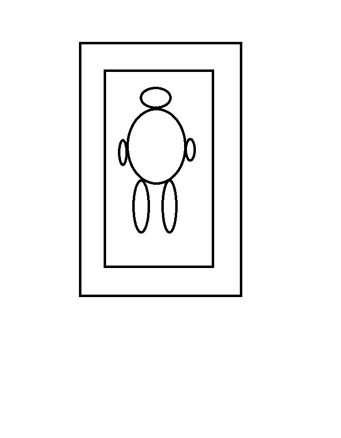

2019 面试实战 - Round Two
===

> Create by **jsliang** on **2019-3-7 22:26:08**  
> Recently revised in **2019-3-10 16:22:59**

**Hello 小伙伴们，如果觉得本文还不错，记得给 jsliang 的文档库点个 **star** ， 你们的 **star** 是我学习折腾的动力！[GitHub 地址](https://github.com/LiangJunrong/document-library/blob/master/other-library/Interview/KnowledgePoints/%E9%9D%A2%E8%AF%95-RoundTwo.md)**

并不是只有特定的季节才能跑路，只因为人跑得多了，这条路就定下来了。

金三银四跑路季，**jsliang** 进行了第二回合的面试，并写下这篇文章。

## <a name="chapter-one" id="chapter-one">一 目录</a>

**不折腾的前端，和咸鱼有什么区别**

| 目录 |
| --- | 
| [一 目录](#chapter-one) | 
| <a name="catalog-chapter-two" id="catalog-chapter-two"></a>[二 前言](#chapter-two) |
| <a name="catalog-chapter-three" id="catalog-chapter-three"></a>[三 早上 09:30](#chapter-three) |
| &emsp;[3.1 Job Description](#chapter-three-one) |
| &emsp;[3.2 技术一面 - 机密试题考查](#chapter-three-two) |
| &emsp;[3.3 技术二面 - 男女混合双打](#chapter-three-three) |
| &emsp;[3.4 个人三面 - 研发总监考查](#chapter-three-four) |
| &emsp;[3.5 个人四面 - 撩人事小姐姐](#chapter-three-five) |
| &emsp;[3.6 个人五面 - 惊人智商考查](#chapter-three-six) |
| <a name="catalog-chapter-four" id="catalog-chapter-four"></a>[四 下午 15:00](#chapter-four) |
| &emsp;[4.1 Job Description](#chapter-four-one) |
| &emsp;[4.2 Block chain](#chapter-four-two) |
| &emsp;[4.3 Just chat](#chapter-four-three) |
| <a name="catalog-chapter-five" id="catalog-chapter-five"></a>[五 总结](#chapter-five) |

## <a name="chapter-two" id="chapter-two">二 前言</a>

> [返回目录](#chapter-one)

**请时刻准备好自己的简历，不管是互联网经济不佳面临裁员，还是因为公司内部斗争严重想换份工作，还是因为厌倦了目前的一切……只有随时更新自己，把自己的简历准备好，你才知道哪一刻跑路是最佳选择。**

* **时间**：2019-3-7
* **地点**：广州
* **年限**：一年工作经验
* **薪酬要求**：9K - 15K
* **场次**：上午一场，下午一场
* **感想**：背着电脑负重 10 斤前行 13000 步，进入办公室放下电脑那一刻，轻松上阵！没人能在我的 BGM 里……

## <a name="chapter-three" id="chapter-three">三 早上 09:30</a>

> [返回目录](#chapter-one)

1. **公司规模**：员工 3000 +
2. **行业**：计算机软件
3. **面试前**：人生最可怕的噩梦，就是面对广州死亡三号线 + 中途会被要求下站的六号线！**jsliang** 于 7:15 分出发，在漫长的等地铁之后，终于在 8:15 分抵达目的地。出地铁一瞅，好家伙：山清水秀鸟语花香（黑云压城城欲摧）。撑开伞，雨中漫步一会，走了一个地铁站左右，去大门登记，进入并等待面试。

### <a name="chapter-three-one" id="chapter-three-one">3.1 Job Description</a>

> [返回目录](#chapter-one)

```
岗位职责： 
1、负责前端页面开发和维护，并根据需求优化产品性能、用户体验、交互效果及各种主流浏览器的兼容适配工作； 
2、对Web前端新技术进行预研，掌握业内主流技术，保持公司前端开发技术的先进性； 
3、优化与重构前端代码，并整理出可重用的代码模块； 
4、配合产品经理和UI设计师，通过各种前端技术手段，提高用户体验并满足性能要求。 

岗位要求： 
1、2年以上前端开发工作经验。 
2、精通JavaScript、JQuery、AJAX、HTML5、DIV+CSS等Web前端开发技术
3、至少熟悉主流JS库或框架如:Bootstrap、AngularJS、backbone、React、Vue等中的一种； 
4、熟悉Grunt，Gulp，Webpack等前端自动化构建工具； 
5、熟悉模块化开发（Requirejs、Seajs、Commonjs），并具有相关项目经验；
6、熟悉Web Components 标准，并能够独立设计、开发web组件；
7、熟悉各种Web前端技术、深刻理解Web标准，对浏览器兼容性问题有丰富经验； 
8、对用户体验、交互操作流程、及用户需求有深入理解；
9、热爱前端，热爱设计，对新鲜事物充满好奇心。
10、主动了解最新前端技术动态，对HTML5技术领域、Web发展趋势具有良好的洞察力和关注度，求知欲强。
```

### <a name="chapter-three-two" id="chapter-three-two">3.2 技术一面 - 笔试题考查</a>

> [返回目录](#chapter-one)

人事小姐姐将我带到了一个空旷的厅子，交给我一份 【机密】 试卷，吓得我正襟危坐，拿起笔来开始答题：

---

一、选择题：

1. 下面哪些属性不会让 div 脱离文档流？

```
A. position: absolute;
B. position: fixed;
C. position: relative;
D. float: left;
```

2. 下面有关 HTML 的 Doctype 和严格模式与混杂模式的描述，错误的是？

```
A. 声明位于文档中的最前面，处于 <html> 标签之前。告诉浏览器的解析器，用什么文档类型规范来解析这个文档。
B. 在标准模式下，浏览器根据规范呈现页面，在混合模式中，页面以一种比较宽松的向后兼容的形式解析这个文档。
C. DOCTYPE 不存在或格式不正确会导致文档以标准模式呈现。
D. 浏览器根据 DOCTYPE 是否存在以及使用哪种 DTD 来选择要使用的呈现方法。
```

3. 元素的 alt 和 title 有什么异同，选出正确的说法？

```
A. 不同的浏览器，表现一样。
B. alt 和 title 同时设置的时候，alt 作为图片的替代文字出现，title 是图片的解释文字。
C. alt 和 title 同时设置的时候，title 作为图片的替代文字出现，alt 是图片的解释文字。
D. 以上说法都不正确。
```

4. 下面可以让 div 水平居中的 css 设置是？

```
A. { margin: 0 auto; }
B. { margin: auto auto; }
C. { margin: auto 0; }
D. { margin: 0 0; }
```

5. 以下全部属于行内元素的是？

```
A. <div><p><input><span>
B. <div><h1><p><dl>
C. <select><button><label><a>
D. <div><p><form><ul><li>
```

6. 下述有关 CSS 属性 postion 的属性值的描述，说法错误的是？

```
……………………
……………………
……………………
……………………
```

**选择题就到此结束了。**

因为 **jsliang** 就坐在一个毫无屏障的大厅上答题。人来人往的，并且试题标明需要关闭电子设备，为了不被赶出去，为了能进入之后的环节，所以俺怂了~只在答完题假装拿手机找人事小姐姐的时候，乘机拍了前五题的，哈哈。不过下面的问答题还好我记得，下面咱一起瞅瞅！

二、问答题

1. 请看下面代码：

```js
function foo() {
  var i = 1;
  return function() {
    i++;
    console.log(i);
  }
}

var a = foo(), b = foo();
a();
a();
b();
```

请写出上面代码的输出结果。

> 这题考查的是闭包，小伙伴可以先自己想想答案，然后复制代码到控制台看看结果。

2. 请看下面代码：

`<div></div>`

请按照上面代码的格式，实现该图片的近似垂直居中和完全垂直居中。

> 一开始表示 **jsliang** 是懵逼的，不按套路出牌啊，不都是水平垂直居中么？不管了，我直接用 less 格式写下了 position 和 flex 的垂直居中方式，然后备注下如果要加上水平居中要怎么搞。

3. 下面有个页面，左边块宽 100px，高 120px，中间 10px 缝隙，右边宽度占剩余页面的 100%，高度占整个页面高度的 100%，请写出相关代码（HTML + CSS）。


> 很经典的一个布局，注意右边高度 100% 要设置好喔~

---

**总结**：

面试题要求 45 分钟写完，**jsliang** 30 分钟左右搞定了。总体来说在 **jsliang** 的面经文章上（即将发布）都有出现，个人觉得难度 5 颗星是最高难度的话，那这份题卷顶多 2 颗半星，当然后面知道 15 道选择题我还是错了 2 道。

不过，看到我的字，enm...我是觉得……**程序猿写的字不好看就不好看了吧！I dont care!**……安慰一波受伤的心灵。

这里不会给答案的哈，毕竟 **jsliang** 觉得，如果给了答案，小伙伴们的思维就被我的思路限制住了，或者我给出的是错误答案，就更引导错误了，然后评论区“大神”一堆分析，我体无完肤~所以还不如让小伙伴们自己敲一遍体验更深刻！

### <a name="chapter-three-three" id="chapter-three-three">3.3 技术二面 - 男女混合双打</a>

> [返回目录](#chapter-one)

笔试题做完之后，微信上呼叫人事小姐姐收了卷，然后坐等 5 分钟左右，便来了两个人 —— 一男一女。

一开始我还以为那个女的是人事小姐姐，男的就是接下来我要应付的面试官了。但是当他们自我介绍完，我才知道，卧槽那个姐姐也是前端的啊，接下来就更有趣了……

---

* **前端小姐姐**：“你好，我叫 A，旁边这位叫 B。”
* **短发小哥**：“你好。”
* **我**：“你好。”
* **前端小姐姐**：“你先自我介绍一下。”
* **我**：噼里啪啦介绍一通……**①**

> **①**：如果小伙伴对我的经历感兴趣，请关注下一篇文章：《jsliang 的 2019 面试准备》(尚未发布)

* **前端小姐姐**：“介绍了下对三大框架的理解，并让我对比了下 Vue 和 微信小程序 以及 Vue 和 jQuery。”**②**

> **②**：这点在我之前的文章有提及，详情可见：[《2018 前端开发分享》](https://github.com/LiangJunrong/document-library/blob/master/other-library/shortArticle/share/November2018.md)，在此不进行额外累述。

* **前端小姐姐**：“能讲下 Vue 实现双向数据绑定的原理吗？”
* **我**：“Vue 2.0 通过 `Object.defineProperty()` 进行数据劫持。而 Vue 3.0 使用的是 `Proxy`。”
* **前端小姐姐**：“能讲讲具体的实现思路吗？”
* **我**：（囧）（忘记具体实现了）“不好意思，我就听过，但是具体的没看过。”
* **前端小姐姐**：（沉默）有没有用 Node 写过后台。
* **我**：“我用了 Node + Vue + MongoDB 写过毕设，用了原生 Node 写过一个仿企业建站，提供简单的增删改查 API 给 jQuery 使用。”
* **前端小姐姐**：（翻简历）“你这工作项目还挺多的啊！”
* **我**：“是的。”
* **前端小姐姐**：“开发周期长不长？”
* **我**：“像微信小程序的话就两个月，jQuery + jQueryUI 打造的那个可视化拖拽系统就一个半月左右。”
* **前端小姐姐**：“你这些项目是独立开发还是团队开发？”
* **我**：“独立开发，毕竟前端就我一个幸运儿。”
* **前端小姐姐**：“你这还有个 Angular + ECharts？”
* **我**：“Angular + ECharts 这个没写完，因为折腾到一半的时候，我被流放到电信驻点去了。”
* **前端小姐姐**：“那你把你做的项目里面，比较有成就感的拿出来讲讲。”
* **我**：“整个微信小程序的开发过程是最有成就感的。因为我被安排到电信驻点的时候，还不知道电信需要开发微信小程序，然后我就拿了一套 PSD 图，边看官方文档边折腾，最终在自己说的两个月期限内写完了。”
* **前端小姐姐**：“那你觉得项目模块中，哪个比较复杂？”
* **我**：“在微信小程序中有个通讯录模块，这个通讯录模块就跟我们手机的通讯录一样。其中有个新增和修改功能，就像我们手机的新增和修改，当我们新增后，页面会滚动到相应的位置，修改也是。然后，我在自己做通讯录模块的时候，想了一下，想用二分法来实现这查找功能。不过后来因为时间不够的缘故，就没有具体写完了。”**③**

> **③**：详情可见我的文章：[《微信小程序之奇技淫巧》](https://github.com/LiangJunrong/document-library/blob/master/other-library/WeChatApplet/WeChatAppletFunctionList.md)

* **前端小姐姐**：“你说你搞过 ES6 这方面的知识，那你知道 ES6 这方面的兼容性吗？”
* **我**：“没有。”
* **前端小姐姐**：“那你面向的用户是哪些人群？”
* **我**：“第一是电信内部人员吧，第二就是 H5 活动页会通过短信形式发送到电信用户手上，所以要考虑手机端的兼容，常见的就是 IPhone 和微信的兼容。”
* **前端小姐姐**：“好的，了解了。enm...那我出道题吧。”**④**

> **④**：震惊！前端小姐姐开始手写代码了！

1. 题目：一个机构树的快速定位，快速找到目标树的 Id：

```js
var tree = [
  {
    parentTreeId: 1,
    nodeOne: **,
    nodeTwo: **
  },
  {
    parentTreeId: 2,
    nodeOne: **,
    nodeTwo: **,
    childNode: 1
  }, 
  {
    childTreeId: 1
    parentId: 2
    childNodeOne: **
  }
  ……
]
```

请问我要如何快速找到某 Id 对应的节点。**⑤**

> **⑤**：由于记忆不太清晰，这里 **jsliang** 尽力模仿了小姐姐的代码。

> **jsliang** 使用了 for in + 递归 的形式进行了查找，不过因为 **jsliang** 也不确定，所以感兴趣的小伙伴，赶紧行动起来，查找一番吧~

* （经过一段时间的写代码以及和前端小姐姐的讨论……）
* **前端小姐姐**：“好的，树节点问题咱就讨论到这，下面我再问一个问题，有关定位的。”

2. 题目：假设我有一个页面，页面上有一张图，大致就是：



> 代码结构如下：

```html
<body>
  
</body>
```

当我点击这张图片中的某个位置（不仅是人身体，其他空白地方也可以），就会显示一个 input 框，输入一些信息后，点击其他地方会关闭，然后当你鼠标移动过去后，就会显示刚才输入的信息，请问这你会怎么实现？

> **jsliang** 觉得这是个有趣的问题，小伙伴们可以自己试试哈~

> tips：获取设备宽高，获取相对于图片的点击位置，定位新 input 的位置，定义 input 的 hover……

* （又经过一段时间的写代码以及和前端小姐姐的讨论……）
* **前端小姐姐**：“好的，我们接着下一个问题。”

3. 题目：现在，我有四个接口：A、B、C、D，首先我要查询 A 接口，查询 A 接口之后才能根据 A 接口返回的数据查询 B、C、D 三个接口，请问有没有比较好点的做法？

> **jsliang** 的思路是链式调用 + 异步调用，回答问题的时候用了 Promise，小伙伴们可以想想自己会怎么解决吧~

* （又又经过一段时间的写代码以及和前端小姐姐的讨论……）
* **前端小姐姐**：“好的，大致清楚了，那么你能讲讲你离职的原因和对下一家公司的期望么？”
* **我**：“是的，因为我觉得平台太小，个人提升有限，因为电信这边一直使用 jQuery 开发的；同时，因为一个人开发，总感觉缺少点什么，可能我比较希望找个团队一起折腾，共同分享，共同进步。**⑥**”

> **⑥**：关于离职原因，钱当然是个原因，但是你不能这么说，要不然你面试的公司会觉得你市侩。当然，我这里说平台小也是个原因，因为之前公司，不管是总部，还是驻点电信，都是一个人开发项目，这样子你代码写起来是随意了，但是总想和别人合作的，毕竟大的项目，都不是一人搞定的。

* **前端小姐姐**：“好的，那你对我们这边还有什么问题要问的吗？”
* **我**：“我想知道如果我进来这公司，大概是做什么？”
* **前端小姐姐**：“如果你进来的话，大概是做 ……**⑦**。然后，平时开发的话，是采用组件化开发形式，分工合作的。接着，我们需要进行兼容到 IE8，以及我们使用的技术是 Angular 1，团队是 30 多个人，前端 10 多个。最后，我们可能会涉及的有 ECharts 报表以及地图之类的开发。”

> **⑦**：这部分就不能讲了，因为跟某些地方牵扯上关系的，**jsliang** 还是有所顾忌的。

* **我**：“好的，谢谢，我大致了解了。”
* （前端小姐姐询问特短发大哥还有啥需要询问的。）
* **特短发大哥**：“你是觉得自己基础部分比较好还是应用部分比较好？”
* **我**：“我觉得我应用部分用的比较多，但是我更希望自己能补充下我的基础部分，因为我 18 年 8 月的时候开始写文档库，就是想查漏补缺，将自己的知识体系进行完善。当你的知识体系完善的时候，你的综合水平就上去了。”
* **特短发大哥**：“你觉得你的文档库中，哪个部分比较容易写？”
* **我**：“我觉得我的文档库中，比较容易写的地方，就是那些直接调用 API 的地方，这些地方很少考虑基础，直接调用 API 即可，完全靠你的使用次数和熟练度。”
* **特短发大哥**：“好的，那最后你给我写个 1 分钟倒计时吧。”
* **我**：（拿起纸笔写了起来）
* **特短发大哥**：“好的，那你稍等下，我们合计下并找下人事。”
* **我**：“好的，谢谢。”

---

**总结**：

这一面大概是总体面试流程中较有难度，并且比较有趣的环节了，毕竟手写代码还是挺好（刺）玩（激）的，虽然短发大哥不咋说话，但是咋看大哥就是传说中的背后 Boss，全程观看我跟姐姐的对话，而且接下来他的举动，可以看出他还是个有趣的人。

### <a name="chapter-three-four" id="chapter-three-four">3.4 个人三面 - 研发总监考查</a>

> [返回目录](#chapter-one)

再次经过 5 分钟的等待后，短发大哥带我去办公室，路上很嗨皮地跟我聊了下，询问我平时玩不玩游戏，还是平时有其他活动啥的……最后将我带到了研发总监的办公室。

> 深刻记住他这句话！因为他可能知道我会走到五面，然后他知道五面是啥玩意，特此调侃下我！

---

* **研发总监**：“你好。”
* **我**：“你好。”
* **研发总监**：“能说下最近工作项目么？”
* **我**：“在开发一个 Vue + ElementUI 的后台管理项目。”
* **研发总监**：“噢噢，能讲下 JavaScript 的闭包么？”
* **我**：“简单来说，有个函数 A 以及一个函数 B，函数 A 里面包含了 函数 B，而 函数 B 里面使用了 函数 A 的变量，那么 函数 B 被称为闭包。”
* **研发总监**：“那闭包会产生什么问题？”
* **我**：“闭包会造成大量的局部变量，会造成内存消耗过大，从而造成网页的性能问题。不过我特地就闭包询问了一些前端前辈，他们说目前浏览器引擎都基于 V8，而 V8 引擎有个 gc 回收机制，不用太过担心变量不会被回收。”
* **研发总监**：“那你有遇到过这种内存泄漏的问题吗？能举个例子吗？”
* **我**：“记得我有次在 for 循环里面，写了个 setTimeout，然后因为数据量过大，从而导致页面卡住，最后浏览器都崩溃了。”
* **研发总监**：“那你是怎么解决这个问题的？”
* **我**：“一般在 for 中使用 let 变量了，因为 let 会产生块级作用域，从而减少产生闭包的可能。”
* **研发总监**：“能讲讲谷歌的盒子模型和 IE 的盒子模型的区别吗？”
* **我**：（尴尬）“这个具体不太清楚，但我可以给你讲个类似的，叫 `box-sizing`。”
* **研发总监**：“那你讲讲这个。”
* **我**：“在 `box-sizing` 中，大致有两种情况，一种是：`box-sizing: border-box`，这种情况下，实际宽 = 盒子宽 + padding + border + margin；还有一种情况是 `box-sizing: content-box`，这种情况下，实际宽不包括这些，最终可能因为 实际宽 = 盒子宽 + border + margin 从而冲破页面。”
* **研发总监**：“能讲讲 Vue 和 jQuery 的区别？”
* **我**：（这里就不罗列了，上面面试问答提到过了）
* **研发总监**：“能讲讲 Vue 的数据绑定原理吗？”
* **我**：“不能。但是我知道 Vue 2.0 版本使用的是 ` Object.defineProperty()` 进行数据劫持。而 Vue 3.0 使用的是 `Proxy`。”
* **研发总监**：“知道为什么 3.0 使用 `Proxy`，而 2.0 使用 `Object.defineProperty()` 吗？”
* **我**：“不知道，看文章介绍说是 `Object.defineProperty()` 有的功能 `Proxy` 都有，而且比它更丰富。”
* **研发总监**：“你离职的原因是什么？”
* **我**：（还能是什么，跟二面一样再吐槽一遍呗~）
* **研发总监**：“对于薪资你有什么要求？”
* **我**：（这里省略啦~没啥好说的，小伙伴面试想要多少就直接提多少，市场讨价还价还是要有的）
* （最后聊了下其他杂七杂八的东西，例如调薪啦，培训啦，工作时间啦，加班啦，加班怎么算啦等等……）

---

**总结**：

看过我第一回合面试文章的小伙伴都知道，到了这个环节，只要你不作死，一般都没什么问题的了，毕竟这面面的不全是技术，主要是看你在将来工作上可能有的表现，以及跟人的沟通能力。

### <a name="chapter-three-five" id="chapter-three-five">3.5 个人四面 - 撩人事小姐姐</a>

> [返回目录](#chapter-one)

又又经过 5 分钟的等待后，人事小姐姐带我去了会议室，跟我聊了一下：

---

* **人事小姐姐**：“经过两轮面试，感觉如何？”
* **我**：“还好吧~”
* **人事小姐姐**：“住哪啊？”
* **我**：……
* **人事小姐姐**：“哇，那你过来就有点早了~”
* **我**：……
* **人事小姐姐**：“感觉这边如何？”
* **我**：……
* **人事小姐姐**：……
* **我**：…………
* **人事小姐姐**：“嗯，因为我们公司机制，今晚你可能还需要做两套题，一套呢，是岗位匹配度的题目；另一套呢，是智商测试题。你做完这两套，合格的话第二天我就可以给你发 offer 了。”
* **我**：（呆）“能不能不做？”
* **人事小姐姐**：（笑）“不能。”
* **我**：（囧）“好的吧。”
* **人事小姐姐**：“嗯嗯，好的，也到饭点了，你要不要跟我下去吃个饭，你也可以体验下未来的饭堂。”
* **我**：（愣）“不了不了，我还有事。”
* **人事小姐姐**：“嗯，好的吧，那我送你到电梯口。”
* **我**：“好地，谢谢~”

---

**总结**：

日常到了这环节，要不就是人事小姐姐会让你回去静等消息，要不就是人事小姐姐会让你回去等 offer 邮件，要不就是……人事小姐姐让你回去做职位匹配与智商测试题！过了才给 offer ！！！

### <a name="chapter-three-six" id="chapter-three-six">3.6 个人五面 - 惊人智商考查</a>

> [返回目录](#chapter-one)

在人事小姐姐的告知下，想要 offer 还要做两份测试题，然后晚上回去我真的收到了两份邮件，开始了痛苦的五面。

---

* **岗位匹配度测试**

|  | 研发类岗位匹配度测试 |  |
| --- | --- | --- |
| 第一部分 | 题量 114 题 | 不限时（约需 11 分钟） |
| 第二部分 | 题量 51 题 | 不限时（约需 9 分钟） |
| 第三部分 | 题量 6 题 | 6 分钟 |
| 第四部分 | 题量 6 题 | 6 分钟 |
| 第五部分 | 题量 6 题 | 6 分钟 |
| 第六部分 | 题量 13 题 | 10 分钟 |

* **智商题测试**

|  | 能力倾向 CATA 测评 |  |
| --- | --- | --- |
| 第一部分 | 题量约 10 题 | 限时（约需 10 分钟） |
| 第二部分 | 题量约 10 题 | 限时（约需 10 分钟） |
| 第三部分 | 题量约 10 题 | 限时（约需 10 分钟） |

---

**总结**：

1. 感觉自从高中毕业后，对于考试题类没感情，尤其是像岗位匹配度测试这种，是考情商的吧？不是哪个好就选哪个或者选对自己影响较好的那个么，没有老老实实根据实际情况真实选答的吧？
2. 我的智商可能真不过关，那些看图演示答出下一个图，找规律啥的搞得我懵懵的。答题完后第二天，人事小姐姐就电话通知我，我的智商题测试差了 3 分及格，并说已经重发邮件给我了，让我再做一遍……

还好不是再让我做一遍 **岗位匹配度测试**，要不然我真的会崩溃，至此上午的面试就完结啦！

## <a name="chapter-four" id="chapter-four">四 下午 15:00</a>

> [返回目录](#chapter-one)

1. **公司规模**：员工 1-20 人
2. **行业**：区块链
3. **面试前**：在经过上午的折腾过后，中午吃了个“特贵”的“营养蒸饭”，看下时间还有一个钟，等不急了，早点搞定早点回去休息。又是一番折腾下（讲真要进个大厦还是挺麻烦的，可能为了大厦安全着想），终于进入面试等待状态。

### <a name="chapter-four-one" id="chapter-four-one">4.1 Job Description</a>

> [返回目录](#chapter-one)

```
岗位职责： 
1.负责互联网产品的前端开发工作，不断优化用户体验，提升产品的兼容性和易用性； 
2.根据产品需求，分析并给出最优的页面前端架构解决方案； 
3.与产品经理，设计师和后端工程师紧密合作，实现产品交互流程和视觉界面的开发需求； 
4.把控代码质量，定期维护并更新前端开发规范； 
5.创新能力强，善于学习并总结、分享新技术；
6.具备良好的服务意识、责任心、较强的学习能力、团队沟通与协作能力；
需要掌握技能 

岗位要求： 
1.熟练掌握JS、HTML5、CSS3等前端技术
2.熟练使用jQuery等主流Javascript库/框架
3.熟练使用Ajax进行交互开发
4.熟练使用Photoshop对设计图进行切割和导出
5.熟悉各种浏览器兼容处理
```

### <a name="chapter-four-two" id="chapter-four-two">4.2 Block chain</a>

> [返回目录](#chapter-one)

在介绍这份工作的面试之前，咱们还是讲讲区块链吧，毕竟一开始 **jsliang** 也不是很懂区块链这块，面试的时候没跟面试官勾搭到一块，面试完回去后，特地咨询了下在区块链公司工作的大佬 **[邵威儒](https://juejin.im/user/5a84f871f265da4e82634f2d)**，并查了下相关资料，同样不懂的小伙伴可以跟着一起了解了解。

* 什么是区块链？

区块链是分布式数据存储、点对点传输、共识机制、加密算法等计算机技术的新型应用模式。

区块链（Blockchain），是比特币的一个重要概念，它本质上是一个去中心化的数据库，同时作为比特币的底层技术，是一串使用密码学方法相关联产生的数据块，每一个数据块中包含了一批次比特币网络交易的信息，用于验证其信息的有效性（防伪）和生成下一个区块。

……以上来自百度百科……

好的，说人话。

区块链本质上是解决信任问题，降低信任成本的技术方案，它是比特币的底层技术。

咱们先从比特币交易来看区块链具体操作：

1. **首先**，A 和 B 交易，将每笔交易在全网广播，让全网承认有效，必须广播给每个节点。
2. **然后**，吃瓜观众矿工节点在接收到交易信息后，都会拿出账簿本记载该次交易。一旦记录，就不可撤销，不可随意销毁。
3. **接着**，矿工节点是通过电脑运行的比特币软件对交易进行确认的，所以为了鼓励矿工的服务，对它所记录和确认的交易，系统为矿工提供比特币作为奖励。

> n 个矿工都记录了，比特币归谁呢？当然是系统会出一道运算题，谁算的最快，谁就能获取记录入账权利，赢得奖励啦~

4. **最后**，获得该记账的矿工将向全网广播这笔交易，账簿公开，其他矿工进行核对确认，交易达到 6 个以上确认就被记录在案。都确认无误后，记录就会合法，从而进行下一个记录的争夺战啦~

在这些步骤中，矿工的每个记录，就是一个区块（block），会盖上时间戳，每个新产生的区块会严格按照时间线顺序推进，形成不可逆的链条，所以叫做区块链（Block Chain)。

> 参考文献：[《几张图看懂区块链技术到底是什么？》](https://www.cnblogs.com/behindman/p/8873191.html)

* 区块链特点？

1. 去中心化。颠覆性特点，没有中间商赚差价！不存在任何中心机构和中心服务器，所有交易都发生在每个人电脑或手机上安装的客户端应用程序中。实现点对点直接交互，既节约资源，使交易自主化、简易化，又排除被中心化代理控制的风险。
2. 开放性。公共记账的技术方案，系统完全开放透明，账簿对所有人公开，实现数据共享，任何人都可以查账。
3. 不可撤销、不可篡改和加密安全性。区块链采用单向哈希算法，每个新产生的区块严格按照时间线形顺序推进，时间的不可逆性、不可撤销导致任何试图入侵篡改区块链内数据信息的行为易被追溯，从而导致被其他节点排斥，造假成本极高，从而可以限制相关不法行为。

* 区块链现状及预测？

1. **各国反应**：

**美国**：大多数数字货币交易发生在法律灰色地带，美国证券交易委员会正逐步加强对数字货币市场的监管。

**英国**：英国金融市场行为监管局（FCA）针对 ICO 和数字货币风险发布警告。FCA 表示，ICO 是高风险、投机性强的投资活动。若 ICO 落入 FCA 的监管范围，将具体情况具体分析。

**韩国**：韩国是对数字化货币态度最严格的国家之一。韩国民众对数字货币非常狂热，也催生了一些黑暗交易，韩国政府对数字货币的态度从暧昧转向成全面干预，甚至准备进行全面封杀，近期韩国接二连三的下发政策，禁止开放匿名加密货币。

**日本**：日本是对数字货币态度最开放的国家之一，刚刚向 11 个交易所颁发了牌照，即在日本进行数字货币投资交易是获得允许的。

**中国**：出台了很多管制措施，如取缔数字资产交易所和 ICO，禁止在线访问海外交易平台。在香港地区，管理者采取了更加宽松的策略，但是它禁止交易平台在未被官方允许的情况下把数字货币像证券那样进行任何交易。台湾地区正在观望。

> ICO：ICO（是Initial Coin Offering缩写），首次币发行，源自股票市场的首次公开发行（IPO）概念，是区块链项目首次发行代币，募集比特币、以太坊等通用数字货币的行为。

> 参考文献：[《2018年区块链现状报告：发展情况如何?》](https://www.wstimes.cn/article/46363.htm)

2. **国内环境**：中国区块链市场充斥大量三无项目，无应用技术、无技术团队、无业务逻辑。ICO 被监管机构叫停，但泡沫没有破裂迹象。所以总结就是相关政府严厉监管，技术团队努力攻关完善区块链，国人驻足观望。

### <a name="chapter-four-three" id="chapter-four-three">4.3 Just chat</a>

> [返回目录](#chapter-one)

最后就是面试场景啦~

……-_ -||

……-_ -|| …… -_ -||

…… -_ -|| …… -_ -|| …… -_ -||

这里真的就没什么好讲的了，毕竟两位面试官都不懂技术，然后让我过来面试的主要原因，是因为：

1. 我的参与项目比较多，尤其是 PC 端、手机端、ECharts、微信小程序等都有所涉及。
2. 我是计算机相关专业毕业。
3. 我是比较活跃的，了解过我的小伙伴都知道，我 GitHub 快破 800 star 了，然后掘金也是挺活跃的。

所以，enm...碰上不懂技术的面试官，就尽大可能谈心咯：**我工作最怕的不是不能做出来，是你给我的时间不够~**

最后的最后，面试官在 Boss 直聘上给了 offer 以及详细薪酬，让我回去考虑要不要过去。

## <a name="chapter-five" id="chapter-five">五 总结</a>

> [返回目录](#chapter-one)

至此，**jsliang** 的第二轮面试就结束啦~

**首先**，还是那句话，面试不一定造火箭，有可能是人家项目中真实存在这个情况，就好比上午二面的小姐姐的问题，你说她是自己想出来的，我看不尽然，说不定就是真实上线的案例中抽取出来的。

**然后**，面试可以给你更多的 idea，从而根据面试过程中出现的一些点，去扩宽自己知识面。面试第一目的肯定是拿到 offer，但是每次面试请尝试记住面试过程及面试题目，面试后总结出来，针对自己的不足进行知识拓展。

**最后**，**jsliang** 在这里祝小伙伴们面试成功，在金三银四的季节找到更适合自己的职位！

---

> **jsliang** 广告推送：  
> 也许小伙伴想了解下云服务器  
> 或者小伙伴想买一台云服务器  
> 或者小伙伴需要续费云服务器  
> 欢迎点击 **[云服务器推广](https://github.com/LiangJunrong/document-library/blob/master/other-library/Monologue/%E7%A8%B3%E9%A3%9F%E8%89%B0%E9%9A%BE.md)** 查看！

[](https://promotion.aliyun.com/ntms/act/qwbk.html?userCode=w7hismrh)
[](https://cloud.tencent.com/redirect.php?redirect=1014&cps_key=49f647c99fce1a9f0b4e1eeb1be484c9&from=console)

> <a rel="license" href="http://creativecommons.org/licenses/by-nc-sa/4.0/"></a><br /><span xmlns:dct="http://purl.org/dc/terms/" property="dct:title">jsliang 的文档库</span> 由 <a xmlns:cc="http://creativecommons.org/ns#" href="https://github.com/LiangJunrong/document-library" property="cc:attributionName" rel="cc:attributionURL">梁峻荣</a> 采用 <a rel="license" href="http://creativecommons.org/licenses/by-nc-sa/4.0/">知识共享 署名-非商业性使用-相同方式共享 4.0 国际 许可协议</a>进行许可。<br />基于<a xmlns:dct="http://purl.org/dc/terms/" href="https://github.com/LiangJunrong/document-library" rel="dct:source">https://github.com/LiangJunrong/document-library</a>上的作品创作。<br />本许可协议授权之外的使用权限可以从 <a xmlns:cc="http://creativecommons.org/ns#" href="https://creativecommons.org/licenses/by-nc-sa/2.5/cn/" rel="cc:morePermissions">https://creativecommons.org/licenses/by-nc-sa/2.5/cn/</a> 处获得。