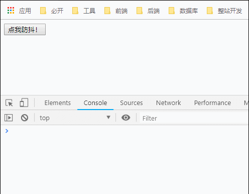
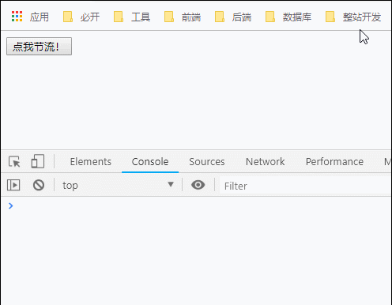
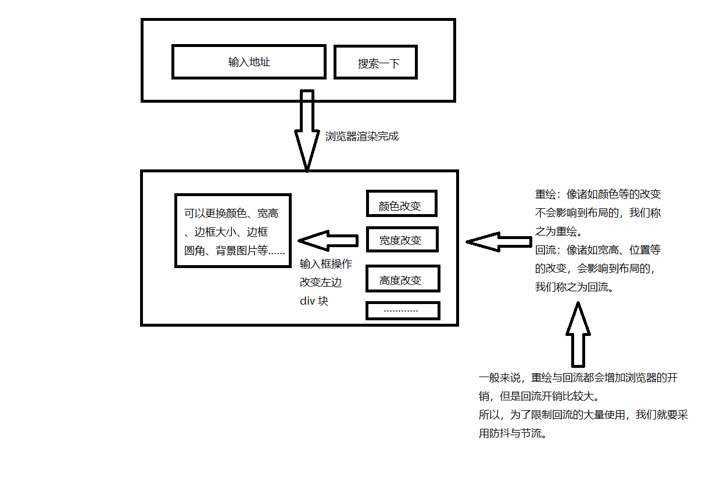
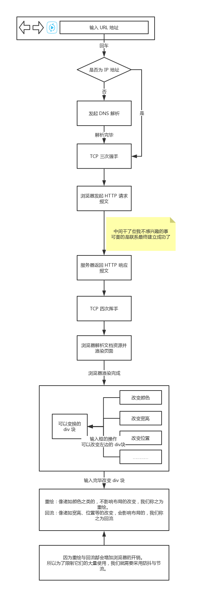
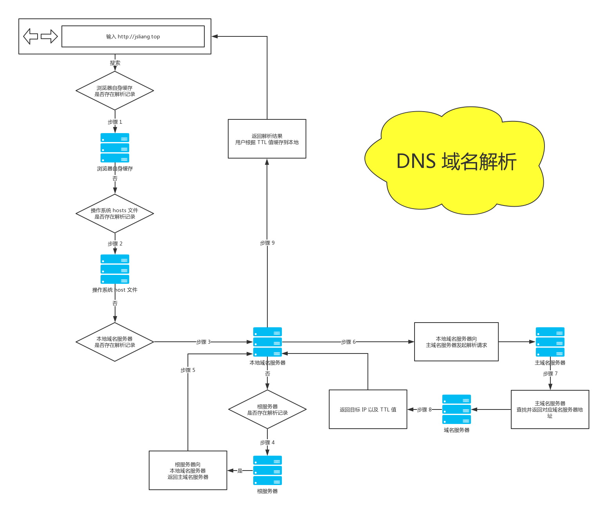
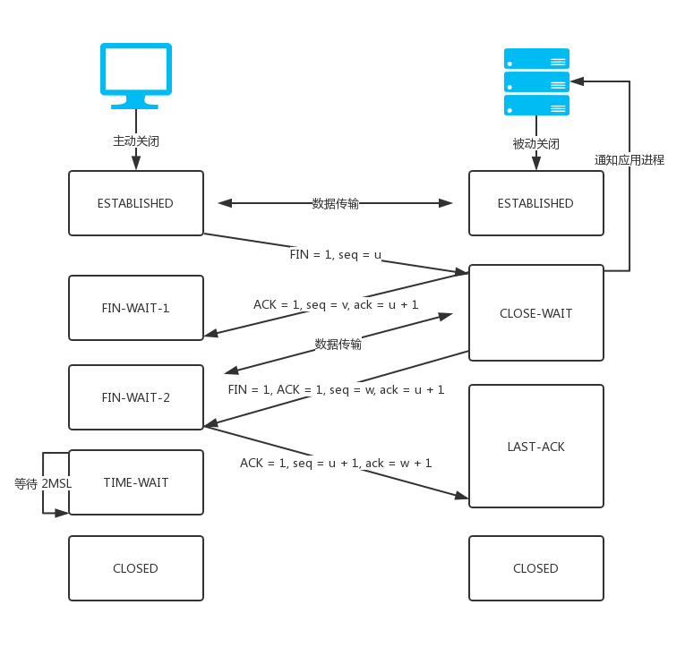

面试知识点 - JS 防抖与节流
===

> Create by **jsliang** on **2019-2-23 20:55:34**  
> Recently revised in **2019-3-12 22:46:04**

**Hello 小伙伴们，如果觉得本文还不错，记得给个 **star** ， 你们的 **star** 是我学习的动力！[GitHub 地址](https://github.com/LiangJunrong/document-library/blob/master/other-library/Interview/KnowledgePoints/JS-%E9%98%B2%E6%8A%96%E4%B8%8E%E8%8A%82%E6%B5%81.md)**

**本文涉及知识点**：

* **防抖与节流**
* **重绘与回流**
* **浏览器解析 URL**
* **DNS 域名解析**
* **TCP 三次握手与四次挥手**
* **浏览器渲染页面**

**在本文中，jsliang 会讲解通过自我探索后关于上述知识点的个人理解，如有纰漏、疏忽或者误解，欢迎各位小伙伴留言指出。**

> 如果小伙伴对文章存有疑问，想快速得到回复。  
> 或者小伙伴对 jsliang 个人的前端文档库感兴趣，也想将自己的前端知识整理出来。  
> 欢迎加 QQ 群一起探讨：`798961601`。

## <a name="chapter-one" id="chapter-one">一 目录</a>

**不折腾的前端，和咸鱼有什么区别**

| 目录 |
| --- | 
| [一 目录](#chapter-one) | 
| <a name="catalog-chapter-two" id="catalog-chapter-two"></a>[二 前言](#chapter-two) |
| <a name="catalog-chapter-three" id="catalog-chapter-three"></a>[三 防抖与节流](#chapter-three) |
| &emsp;[3.1 防抖](#chapter-three-one) |
| &emsp;[3.2 节流](#chapter-three-two) |
| <a name="catalog-chapter-four" id="catalog-chapter-four"></a>[四 重绘与回流](#chapter-four) |
| <a name="catalog-chapter-five" id="catalog-chapter-five"></a>[五 浏览器解析 URL](#chapter-five) |
| <a name="catalog-chapter-six" id="catalog-chapter-six"></a>[六  DNS 域名解析](#chapter-six) |
| <a name="catalog-chapter-seven" id="catalog-chapter-seven"></a>[七 TCP 三次握手与四次挥手](#chapter-seven) |
| <a name="catalog-chapter-eight" id="catalog-chapter-eight"></a>[八 浏览器渲染页面](#chapter-eight) |
| <a name="catalog-chapter-night" id="catalog-chapter-night"></a>[九 总结](#chapter-night) |
| <a name="catalog-chapter-ten" id="catalog-chapter-ten"></a>[十 参考文献](#chapter-ten) |

## <a name="chapter-two" id="chapter-two">二 前言</a>

> [返回目录](#chapter-one)

在工作中，我们可能碰到这样的问题：

* 用户在搜索的时候，在不停敲字，如果每敲一个字我们就要调一次接口，接口调用太频繁，给卡住了。
* 用户在阅读文章的时候，我们需要监听用户滚动到了哪个标题，但是每滚动一下就监听，那样会太过频繁从而占内存，如果再加上其他的业务代码，就卡住了。

所以，这时候，我们就要用到 **防抖与节流** 了。

那么，讲到 **防抖与节流**，我们可以顺带探秘下 **重绘与回流**。

说起 **重绘与回流**，我们就顺带把 **浏览器输入 URL 后发生的事情** 也关注一下，从而引出 **DNS**、**TCP** 等知识点，最终串起来构成本文的轮廓，方便 **jsliang** 和小伙伴们对这块知识的整理与记忆。

## <a name="chapter-three" id="chapter-three">三 防抖与节流</a>

> [返回目录](#chapter-one)

**通过代码去了解某样事物，往往是了解某个知识点最快的形式。**

### <a name="chapter-three-one" id="chapter-three-one">3.1 防抖</a>

> [返回目录](#chapter-one)

下面我们有段防抖小案例代码。

如果小伙伴们手头有电脑，并感兴趣想先自己思考下什么是防抖。可以将代码复制到浏览器，尝试点击按钮，并关注下控制台，看看 Console 是如何打印的。

如果小伙伴们手头没有电脑，那么咱一起先瞅瞅代码实现，再看看下面 GIF 演示。（这样效果没有自己敲的直白有效）

```html
<!DOCTYPE html>
<html lang="en">
<head>
  <meta charset="UTF-8">
  <meta name="viewport" content="width=device-width,initial-scale=1.0,maximum-scale=1.0,user-scalable=no">
  <meta http-equiv="X-UA-Compatible" content="ie=edge">
  <title>防抖</title>
</head>
<body>
  <button id="debounce">点我防抖！</button>

  <script>
    window.onload = function() {
      // 1、获取这个按钮，并绑定事件
      var myDebounce = document.getElementById("debounce");
      myDebounce.addEventListener("click", debounce(sayDebounce));
    }

    // 2、防抖功能函数，接受传参
    function debounce(fn) {
      // 4、创建一个标记用来存放定时器的返回值
      let timeout = null;
      return function() {
        // 5、每次当用户点击/输入的时候，把前一个定时器清除
        clearTimeout(timeout);
        // 6、然后创建一个新的 setTimeout，
        // 这样就能保证点击按钮后的 interval 间隔内
        // 如果用户还点击了的话，就不会执行 fn 函数
        timeout = setTimeout(() => {
          fn.call(this, arguments);
        }, 1000);
      };
    }

    // 3、需要进行防抖的事件处理
    function sayDebounce() {
      // ... 有些需要防抖的工作，在这里执行
      console.log("防抖成功！");
    }

  </script>
</body>
</html>
```

很好，相信小伙伴们已经看完了代码，下面我们看看它的演示：



这时候，我们可以抛出防抖的概念了：

* **防抖**：**任务频繁触发的情况下，只有任务触发的间隔超过指定间隔的时候，任务才会执行。**

结合上面的代码，我们可以了解到，在触发点击事件后，如果用户再次点击了，我们会清空之前的定时器，重新生成一个定时器。意思就是：这件事儿需要等待，如果你反复催促，我就重新计时！

空讲无益，show you 场景：

* 有个输入框，输入之后会调用接口，获取联想词。但是，因为频繁调用接口不太好，所以我们在代码中使用防抖功能，只有在用户输入完毕的一段时间后，才会调用接口，出现联想词。

小伙伴们可以尝试看着上面的案例，先自己实现一遍这个场景的解决，如果感觉不行，那就看：[《防抖和节流的应用场景和实现》](https://www.codercto.com/a/35263.html)

> 知识点补充：何为 `arguments`？  
> **首先**，后端转前端的同学，可以将 `arguments` 理解为能实现重载函数功能的工具。  
> **然后**，我们举个例子：在 `function test()` 这个方法中，由于我们不确定变量有多少，比如 `test("jsliang", 24)`，又或者 `test("LiangJunrong", "jsliang", "24")`，这时候只需要在函数 `test` 中用 `arguments` 接收就行了。  
> **最后**，在 `function test() { let arr1 = argument[0] }` 中，`arr1` 就可以获取到传进来的第一个变量。  
> **所以**，`fn.call(this, arguments)` 其实是将不确定变量替换到函数中了。  

> 参考资料 1：[《闲聊 JS 中的 apply 和 call》](https://www.cnblogs.com/alai88/p/5518441.html)  
> 参考资料 2：[《js 中 arguments 的用法》](https://www.cnblogs.com/LMJBlogs/p/6024148.html)

### <a name="chapter-three-two" id="chapter-three-two">3.2 节流</a>

> [返回目录](#chapter-one)

说完防抖，下面我们讲讲节流，规矩就不说了，先上代码：

```html
<!DOCTYPE html>
<html lang="en">
<head>
  <meta charset="UTF-8">
  <meta name="viewport" content="width=device-width,initial-scale=1.0,maximum-scale=1.0,user-scalable=no">
  <meta http-equiv="X-UA-Compatible" content="ie=edge">
  <title>节流</title>
</head>
<body>

  <button id="throttle">点我节流！</button>

  <script>
    window.onload = function() {
      // 1、获取按钮，绑定点击事件
      var myThrottle = document.getElementById("throttle");
      myThrottle.addEventListener("click", throttle(sayThrottle));
    }

    // 2、节流函数体
    function throttle(fn) {
      // 4、通过闭包保存一个标记
      let canRun = true;
      return function() {
        // 5、在函数开头判断标志是否为 true，不为 true 则中断函数
        if(!canRun) {
          return;
        }
        // 6、将 canRun 设置为 false，防止执行之前再被执行
        canRun = false;
        // 7、定时器
        setTimeout( () => {
          fn.call(this, arguments);
          // 8、执行完事件（比如调用完接口）之后，重新将这个标志设置为 true
          canRun = true;
        }, 1000);
      };
    }

    // 3、需要节流的事件
    function sayThrottle() {
      console.log("节流成功！");
    }

  </script>
</body>
</html>
```

很好，看完代码的小伙伴应该大致清楚是怎么回事了，下面我们看 GIF 实现：



看完代码和 GIF 实现，我们可以明白，节流即是：

* **节流**：**指定时间间隔内只会执行一次任务。**

那么，节流在工作中的应用？

1. 懒加载要监听计算滚动条的位置，使用节流按一定时间的频率获取。
2. 用户点击提交按钮，假设我们知道接口大致的返回时间的情况下，我们使用节流，只允许一定时间内点击一次。

这样，在某些特定的工作场景，我们就可以使用防抖与节流来减少不必要的损耗。

那么问题来了，假设面试官听到你这句话，是不是会接着问一句：“为什么说上面的场景不节制会造成过多损耗呢？”

OK，这就涉及到浏览器渲染页面的机制了……

## <a name="chapter-four" id="chapter-four">四 重绘与回流</a>

> [返回目录](#chapter-one)

在说浏览器渲染页面之前，我们需要先了解两个点，一个叫 **浏览器解析 URL**，另一个就是本章节将涉及的 **重绘与回流**：

* **重绘(repaint)**：当元素样式的改变不影响布局时，浏览器将使用重绘对元素进行更新，此时由于只需要 UI 层面的重新像素绘制，因此**损耗较少**。

常见的**重绘**操作有：

1. 改变元素颜色
2. 改变元素背景色
3. more ……

* **回流(reflow)**：又叫重排（layout）。当元素的尺寸、结构或者触发某些属性时，浏览器会重新渲染页面，称为回流。此时，浏览器需要重新经过计算，计算后还需要重新页面布局，因此是较重的操作。
  
常见的**回流**操作有：

1. 页面初次渲染
2. 浏览器窗口大小改变
3. 元素尺寸/位置/内容发生改变
4. 元素字体大小变化
5. 添加或者删除可见的 DOM 元素
6. 激活 CSS 伪类（:hover……）
7. more ……

* **重点**：**回流必定会触发重绘，重绘不一定会触发回流。重绘的开销较小，回流的代价较高。**

看到这里，小伙伴们可能有点懵逼，你刚刚还跟我讲着 **防抖与节流** ，怎么一下子跳到 **重绘与回流** 了？

OK，卖个关子，先看下面场景：

* 界面上有个 div 框，用户可以在 input 框中输入 div 框的一些信息，例如宽、高等，输入完毕立即改变属性。但是，因为改变之后还要随时存储到数据库中，所以需要调用接口。如果不加限制……

看到这里，小伙伴们可以将一些字眼结合起来了：为什么需要 **节流**，因为有些事情会造成浏览器的 **回流**，而 **回流** 会使浏览器开销增大，所以我们通过 **节流** 来防止这种增大浏览器开销的事情。

形象地用图来说明：



这样，我们就可以形象的将 **防抖与节流** 与 **重绘与回流** 结合起来记忆起来。

那么，在工作中我们要如何避免大量使用重绘与回流呢？：

1. 避免频繁操作样式，可汇总后统一一次修改
2. 尽量使用 class 进行样式修改，而不是直接操作样式
3. 减少 DOM 的操作，可使用字符串一次性插入

OK，至此我们就讲完两个部分了，那么问题又来了：“浏览器渲染过程中，是不是也有重绘与回流？”“从浏览器输入 URL 到渲染成功的过程中，究竟发生了什么？”

我们，继续深入探索……

## <a name="chapter-five" id="chapter-five">五 浏览器解析 URL</a>

> [返回目录](#chapter-one)

为了能让我们的知识层面看起来更有深度，我们应该考虑下面两个问题了：

* 从浏览器输入 URL 到渲染成功的过程中，究竟发生了什么？
* 浏览器渲染过程中，发生了什么，是不是也有重绘与回流？

OK，兴致来了，我们就先从 **浏览器解析 URL** 看起，先来看看当用户输入 URL，到浏览器呈现给用户页面，经历了以下过程：

* **版本 A**：

1. 用户输入 URL 地址。
2. 对 URL 地址进行 DNS 域名解析。
3. 建立 TCP 连接（三次握手）。
4. 浏览器发起 HTTP 请求报文。
5. 服务器返回 HTTP 响应报文。
6. 关闭 TCP 连接（四次挥手）。
7. 浏览器解析文档资源并渲染页面。

讲到这里，突然想起一个对话：

**学生**：“老师，这门课的考试重点是什么？”

**老师**：“全都是重点！”

enm...老师会不会被打我不知道，但是 **jsliang** 这样写会被怼我就清楚，所以，咱还是结合上面的图，进一步勾勒我们的结构：



很好，**jsliang** 感觉自己的画图技术又进了一步~

> ①：虽然很感激网上有那么多的文章可以参考，但是在我查了二十来篇文章后，**jsliang** 觉得这部分十有八九有问题撒，问了些小伙伴，它们有的说对，有的说错。不过，不妨碍小伙伴们继续往下看哈。  
> ②：为了避免出篓子，下面贴出另外一个版本，小伙伴们可以在评论区说出你支持哪个版本哈：  
> * **版本 B**
> 1. 用户输入 URL 地址。  
> 2. 对 URL 地址进行 DNS 域名解析。
> 3. 进行 TCP 连接。  
> 4. 进行 HTTP 报文的请求与响应。  
> 5. 浏览器解析文档资源并渲染页面。

在这里我们可以清晰的了解到从 **用户输入 URL，到浏览器呈现给用户页面，经历了哪些过程**。

那么剩下的就简单了：

1. 什么是 DNS 解析，它是怎么个流程？
2. 什么是 TCP 三次握手，什么是 TCP 四次挥手，它们的流程是怎样的？
3. 浏览器解析文档资源并渲染页面是个怎样的流程？

Let's go~ 逐步完成下面三个知识点！

> 参考文献 1：[《网页解析的全过程(输入url到展示页面)》](https://www.cnblogs.com/wpshan/p/6282061.html)  
> 参考文献 2：[《浏览器渲染页面过程剖析》](https://www.jianshu.com/p/32ca5f1c0768)

## <a name="chapter-six" id="chapter-six">六 DNS 域名解析</a>

> [返回目录](#chapter-one)

**首先**，我们解决第一个问题：

* 什么是 DNS 解析，它是怎么个流程？

DNS（Domain Name System）是 **域名系统** 的英文缩写，提供的服务是用于将主机名和域名转换为 IP 地址的工作：

域名：`http://jsliang.top` <---> DNS <---> IPV4：`119.147.15.13`

> IPV4 是造假的，仅用来说明 DNS 解析后能返回 IP 地址

所以，当用户在浏览器输入 `http://jsliang.top` 时，DNS 经历了以下步骤：

1. 浏览器根据地址，在自身缓存中查找 DNS（域名服务器） 中的解析记录。如果存在，则直接返回 IP 地址；如果不存在，则查找操作系统中的 hosts 文件是否有该域名的 DNS 解析记录，如果有就返回。
2. 在条件 1 中的浏览器缓存或者操作系统的 hosts 文件中都没有这个域名的 DNS 解析记录，或者已经过期，则向域名服务器发起请求解析这个域名。
3. 先向本地域名服务器中请求，让它解析这个域名，如果解析不了，则向根域名服务器请求解析。
4. 根服务器给本地域名服务器返回一个主域名服务器。
5. 本地域名服务器向主域名服务器发起解析请求。
6. 主域名服务器接收到解析请求后，查找并返回域名对应的域名服务器的地址。
7. 域名服务器会查询存储的域名和 IP 的映射关系表，返回目标 IP 记录以及一个 TTL（Time To Live）值。
8. 本地域名服务器接收到 IP 和 TTL 值，进行缓存，缓存的时间由 TTL 值控制。
9. 将解析的结果返回给用户，用户根据 TTL 值缓存在本地系统缓存中，域名解析过程结束。

看文字总是难以理解的，跟着 **jsliang** 画张图过一遍，就感觉清晰了：



## <a name="chapter-seven" id="chapter-seven">七 TCP 三次握手与四次挥手</a>

> [返回目录](#chapter-one)

**然后**，我们解决第二个问题：

* 什么是 TCP 三次握手，什么是 TCP 四次挥手，它们的流程是怎样的？

什么是 TCP 呢？TCP（Transmission Control Protocol 传输控制协议）是一种面向连接的、可靠的、基于字节流的传输层通信协议。

简单来说，它的作用就是将数据流从一台主机可靠地传输到另一台主机。

至于具体的工作原理，这里暂时涉及不到，我们目前只想知道两个点：**三次握手与四次挥手**。

* **三次握手**：

1. **第一次握手**：起初两端都处于 CLOSED 关闭状态，Client 将标志位 SYN 置为 1，随机产生一个值 `seq = x`，并将该数据包发送给 Server，Client 进入 SYN-SENT 状态，等待 Server 确认。
2. **第二次握手**：Server 收到数据包后由标志位 `SYN = 1` 得知 Client 请求建立连接，Server 将标志位 SYN 和 ACK 都置为 1，`ack = x + 1`，随机产生一个值 `seq = y`，并将该数据包发送给Client以确认连接请求，Server 进入 `SYN-RCVD` 状态，此时操作系统为该 TCP 连接分配 TCP 缓存和变量。
3. **第三次握手**：Client 收到确认后，检查 seq 是否为 `x + 1`，ACK 是否为 1，如果正确则将标志位 ACK 置为 1，`ack = y + 1`，并且此时操作系统为该 TCP 连接分配 TCP 缓存和变量，并将该数据包发送给 Server，Server 检查 ack 是否为 `y + 1`，ACK 是否为 1，如果正确则连接建立成功，Client 和 Server 进入 established 状态，完成三次握手，随后 Client 和 Server 就可以开始传输数据。

文字太乱，show you picture：


* **四次挥手**：

1. **第一次挥手**：Client 的应用进程先向其 TCP 发出连接释放报文段（`FIN = 1`，序号 `seq = u`），并停止再发送数据，主动关闭 TCP 连接，进入 FIN-WAIT-1（终止等待1）状态，等待 Server 的确认。
2. **第二次挥手**：Server 收到连接释放报文段后即发出确认报文段，（`ACK = 1`，确认号 `ack = u + 1`，序号 `seq = v`），Server 进入 CLOSE-WAIT（关闭等待）状态，此时的 TCP 处于半关闭状态，Client 到 Server 的连接释放。


> 注：Client 收到 Server 的确认后，进入 FIN-WAIT-2（终止等待2）状态，等待 Server 发出的连接释放报文段。

3. **第三次挥手**：Server 已经没有要向 Client 发出的数据了，Server 发出连接释放报文段（`FIN = 1`，`ACK = 1`，序号 `seq = w`，确认号 `ack = u + 1`），Server 进入 LAST-ACK（最后确认）状态，等待 Client 的确认。
4. **第四次挥手**：Client 收到 Server 的连接释放报文段后，对此发出确认报文段（`ACK = 1`，`seq = u + 1`，`ack = w + 1`），Client 进入 TIME-WAIT（时间等待）状态。此时 TCP 未释放掉，需要经过时间等待计时器设置的时间 2MSL 后，Client 才进入 CLOSED 状态。

文字太乱，show you picture：



OK，至此我们就理解了 **TCP 及其三次握手和四次挥手过程**，为了方便小伙伴们形象记忆，**jsliang** 搞了个小故事，希望小伙伴们能加深印象：

* **三次握手 + 四次挥手形象记忆**：

1. **jsliang**：（对妹子发起微信好友申请）“你好，我可以加你好友吗？” —— **第一次握手**
2. **妹子**：（通过审核）“你好，很高兴认识你~” —— **第二次握手**
3. **jsliang**：“你好，我叫梁峻荣，前端折腾小能手……” —— **第三次握手**
4. ……（聊天内容）
5. …………（聊天内容）
6. ………………（聊天内容）
7. …………（聊天内容）
8. ……（聊天内容）
9. **jsliang**：（感冒拍了张纸篓都是纸巾的图）“啊，好难受今天。” —— **第一次挥手**
10. **妹子**：“卧槽，你好恶心！” —— **第二次挥手**
11. **妹子**：“咱还是当不认识吧，互删了，谢谢！” —— **第三次挥手**
12. **jsliang**：（呆）“不是，你听我说！” —— **第四次挥手**
13. **妹子**：（果断删除好友） —— **CLOSED**
14. **jsliang**：（！“我今天感冒了。” 妹子开启了好友验证，你还不是她好友。请先发送好友验证请求，对方验证通过后，才能聊天。） ——— **CLOSED**

OK，成功出糗，相信小伙伴们有了个很好的了解了。

那么，我们继续前行探索。

> 参考文献 1：[《TCP三次握手和四次挥手过程》](https://www.cnblogs.com/Andya/p/7272462.html)  
> 参考文献 2：[《TCP的三次握手与四次挥手（详解+动图）》](https://blog.csdn.net/qzcsu/article/details/72861891)  

## <a name="chapter-eight" id="chapter-eight">八 浏览器渲染页面</a>

> [返回目录](#chapter-one)

**最后**，我们解决第三个问题：

* 浏览器解析文档资源并渲染页面是个怎样的流程？

话不多说，一起来看：

1. 浏览器通过 HTMLParser 根据深度遍历的原则把 HTML 解析成 DOM Tree。
2. 浏览器通过 CSSParser 将 CSS 解析成 CSS Rule Tree（CSSOM Tree）。
3. 浏览器将 JavaScript 通过 DOM API 或者 CSSOM API 将 JS 代码解析并应用到布局中，按要求呈现响应的结果。
4. 根据 DOM 树和 CSSOM 树来构造 render Tree。
5. layout：重排（也可以叫回流），当 render tree 中任一节点的几何尺寸发生改变，render tree 就会重新布局，重新来计算所有节点在屏幕的位置。
6. repaint：重绘，当 render tree 中任一元素样式属性（几何尺寸没改变）发生改变时，render tree 都会重新画，比如字体颜色，背景等变化。
7. paint：遍历 render tree，并调动硬件图形 API 来绘制每个节点。

文字讲解肯定还是不够清晰的，但是 **jsliang** 画了几张图也累了，所以咱们 **盗** 来了一张图：


这样，我们就对 **浏览器渲染页面过程** 一清二楚啦~

> 参考文献：[《一篇文章搞定前端面试》](https://juejin.im/post/5bbaa549e51d450e827b6b13)

## <a name="chapter-night" id="chapter-night">九 总结</a>

> [返回目录](#chapter-one)

至此，我们回顾下自己做了什么？

1. 我们在工作中碰到一些问题，这些问题会卡住页面，于是我们查资料，知道想要减少浏览器的开销，我们就需要使用 **防抖与节流**。
2. 使用 **防抖与节流** 解决完问题后，我们好奇为什么会有这样的操作，于是我们深入了解了下 **重绘与回流**。
3. **重绘与回流** 只告诉了我们浏览器在 CSS 上的渲染，我们需要进一步了解 **浏览器渲染页面** 的详细过程，但洋葱还是要一层一层剥开的，所以我们需要从 **浏览器解析 URL** 开始了解。
4. 在 **浏览器解析 URL** 中，我们顺带了解下 **DNS 域名解析**、**TCP 三次握手与四次挥手** 这两个知识点。
5. 最后，我们终于知道了 **浏览器渲染页面** 是怎么一回事。

综上，如果我们仅仅是需要关注面试的一个点，我们很可能因为不知头尾，而被面试官问得哑口无言。

但是，如果我们知道一个知识点，并对其进行思路发散，深入学习，相信面试官问起来的时候，小伙伴们就可以侃侃而谈，而不会被问地体无完肤了！

最后祝小伙伴们找到合适的满意的工作~

## <a name="chapter-ten" id="chapter-ten">十 参考文献</a>

> [返回目录](#chapter-one)

1. [《函数防抖和节流》](https://www.jianshu.com/p/c8b86b09daf0)
2. [《节流 & 防抖》](https://qishaoxuan.github.io/blog/js/throttleDebounce.html?tdsourcetag=s_pctim_aiomsg)
3. [《JS奇淫巧技：防抖函数与节流函数》](https://www.cnblogs.com/chenqf/p/7986725.html)
4. [《闲聊 JS 中的 apply 和 call》](https://www.cnblogs.com/alai88/p/5518441.html)
5. [《js 中 arguments 的用法》](https://www.cnblogs.com/LMJBlogs/p/6024148.html)
6. [《防抖和节流的应用场景和实现》](https://www.codercto.com/a/35263.html)
7. [《网页解析的全过程(输入url到展示页面)》](https://www.cnblogs.com/wpshan/p/6282061.html)
8. [《浏览器渲染页面过程剖析》](https://www.jianshu.com/p/32ca5f1c0768)
9. [《一篇文章搞定前端面试》](https://juejin.im/post/5bbaa549e51d450e827b6b13)

---

> **jsliang** 广告推送：  
> 也许小伙伴想了解下云服务器  
> 或者小伙伴想买一台云服务器  
> 或者小伙伴需要续费云服务器  
> 欢迎点击 **[云服务器推广](https://github.com/LiangJunrong/document-library/blob/master/other-library/Monologue/%E7%A8%B3%E9%A3%9F%E8%89%B0%E9%9A%BE.md)** 查看！

[](https://promotion.aliyun.com/ntms/act/qwbk.html?userCode=w7hismrh)
[](https://cloud.tencent.com/redirect.php?redirect=1014&cps_key=49f647c99fce1a9f0b4e1eeb1be484c9&from=console)

> <a rel="license" href="http://creativecommons.org/licenses/by-nc-sa/4.0/"></a><br /><span xmlns:dct="http://purl.org/dc/terms/" property="dct:title">jsliang 的文档库</span> 由 <a xmlns:cc="http://creativecommons.org/ns#" href="https://github.com/LiangJunrong/document-library" property="cc:attributionName" rel="cc:attributionURL">梁峻荣</a> 采用 <a rel="license" href="http://creativecommons.org/licenses/by-nc-sa/4.0/">知识共享 署名-非商业性使用-相同方式共享 4.0 国际 许可协议</a>进行许可。<br />基于<a xmlns:dct="http://purl.org/dc/terms/" href="https://github.com/LiangJunrong/document-library" rel="dct:source">https://github.com/LiangJunrong/document-library</a>上的作品创作。<br />本许可协议授权之外的使用权限可以从 <a xmlns:cc="http://creativecommons.org/ns#" href="https://creativecommons.org/licenses/by-nc-sa/2.5/cn/" rel="cc:morePermissions">https://creativecommons.org/licenses/by-nc-sa/2.5/cn/</a> 处获得。