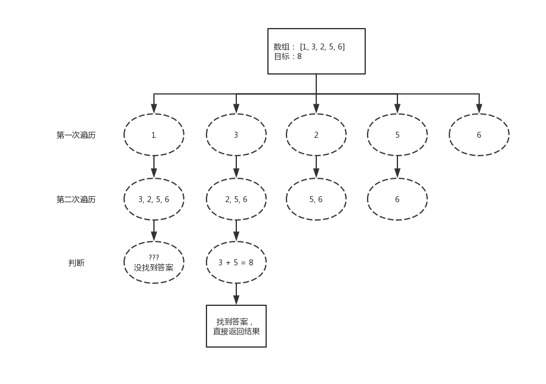
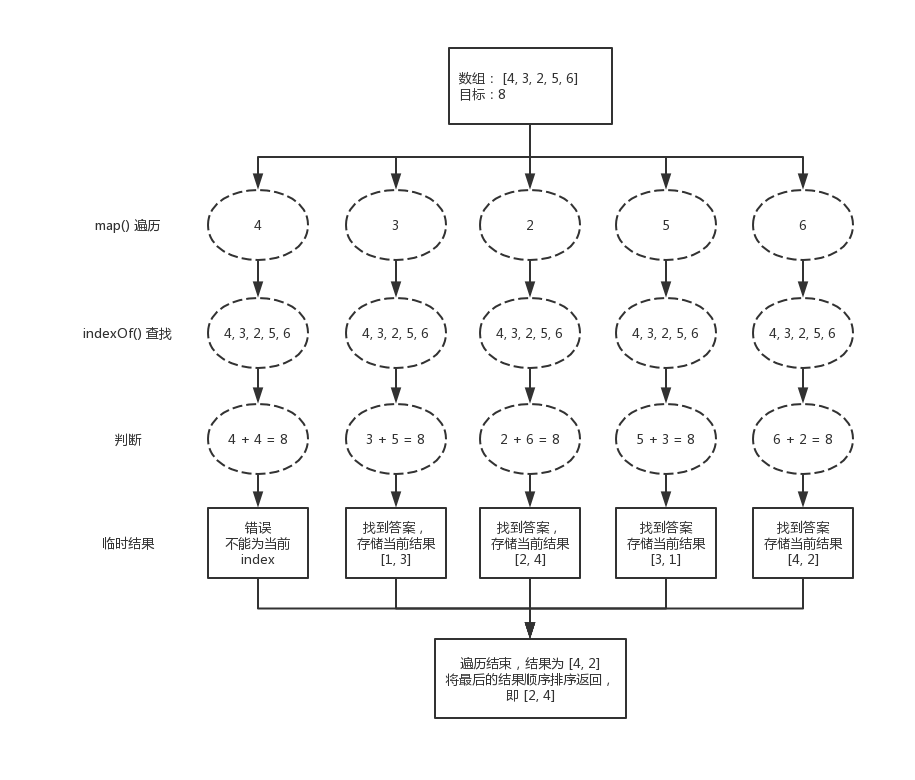
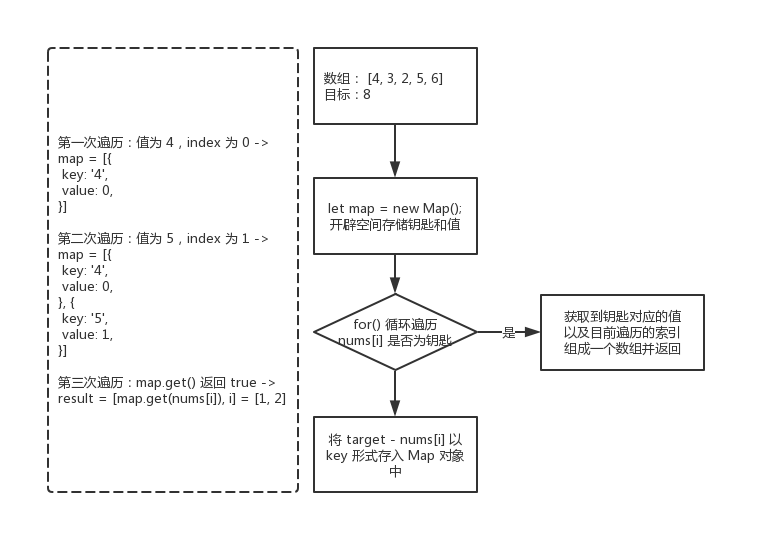

001 - 两数之和（two-sum）
===

> Create by **jsliang** on **2019-5-16 22:19:13**  
> Recently revised in **2019-05-17 14:19:09**

## <a name="chapter-one" id="chapter-one">一 目录</a>

**不折腾的前端，和咸鱼有什么区别**

| 目录 |
| --- | 
| [一 目录](#chapter-one) | 
| <a name="catalog-chapter-two" id="catalog-chapter-two"></a>[二 前言](#chapter-two) |
| <a name="catalog-chapter-three" id="catalog-chapter-three"></a>[三 解题](#chapter-three) |
| &emsp;[3.1 解法 - for()](#chapter-three-one) |
| &emsp;[3.2 解法 - indexOf()](#chapter-three-two) |
| &emsp;[3.3 解法 - Map](#chapter-three-three) |

## <a name="chapter-two" id="chapter-two">二 前言</a>

> [返回目录](#chapter-one)

* **难度**：简单
* **涉及知识**：数组、哈希表
* **题目地址**：https://leetcode-cn.com/problems/two-sum/
* **题目内容**：

```
给定一个整数数组 nums 和一个目标值 target，请你在该数组中找出和为目标值的那 两个 整数，并返回他们的数组下标。

你可以假设每种输入只会对应一个答案。但是，你不能重复利用这个数组中同样的元素。

示例:

给定 nums = [2, 7, 11, 15], target = 9

因为 nums[0] + nums[1] = 2 + 7 = 9
所以返回 [0, 1]
```

## <a name="chapter-three" id="chapter-threed">三 解题</a>

> [返回目录](#chapter-one)

* **官方题解**：https://leetcode-cn.com/problems/two-sum/solution/liang-shu-zhi-he-by-leetcode-2/

解题千千万，官方独一家，上面是官方使用 Java 进行的题解。

小伙伴可以先自己在本地尝试解题，再看看官方解题，最后再回来看看 **jsliang** 讲解下使用 JavaScript 的解题思路。

### <a name="chapter-three-one" id="chapter-three-one">3.1 解法 - for()</a>

> [返回目录](#chapter-one)

* **解题代码**：

```js
var twoSum = function(nums, target) {
  for (let i = 0; i < nums.length; i++) {
    for (let j = i + 1; j < nums.length; j++) {
      if (nums[j] === target - nums[i]) {
        return [i, j];
      }
    }
  }
};
```

* **执行测试**：

1. `nums`：`[1, 3, 2, 5, 6]`
2. `target`: `8`
3. `return`：

```js
[1, 3]
```

* **解题思路**：使用双重 `for` 循环破解。



1. 第一遍过滤 `nums` 数组，标记为 `i`
2. 第二遍再次过滤 `nums` 数组，标记为 `i + 1`，因为我们是对数组中的两个数字相加，所以不能重复使用同一个数字。
3. 判断第二次遍历的数字中，它是否等于 `target - nums[i]`，如果成立就返回两个数字的索引。（并不考虑后面还有可成立的答案）。

### <a name="chapter-three-two" id="chapter-three-two">3.2 解法 - indexOf()</a>

> [返回目录](#chapter-one)

* **解题代码**：

```js
var twoSum = function(nums, target) {
  let result = [];
  nums.map((item, index) => {
    if (nums.indexOf(target - item) > -1 && nums.indexOf(target - item) != index) {
      result = [index, nums.indexOf(target - item)].sort((a, b) => a > b);
    }
  });
  return result;
};
```

* **执行测试**：

1. `nums`：`[4, 3, 2, 5, 6]`
2. `target`: `8`
3. `return`：

```js
[2, 4]
```

* **知识点**：

1. `map()`：遍历数组，`item` 返回遍历项，`index` 返回当前索引。[`map()` 详细介绍](https://github.com/LiangJunrong/document-library/blob/master/JavaScript-library/JavaScript/Function/map().md)
2. `indexOf()`：判断数组中是否存在判断条件中的值。如果存在，则返回第一次出现的索引；如果不存在，则返回 -1。[`indexOf()` 详细介绍](https://github.com/LiangJunrong/document-library/blob/master/JavaScript-library/JavaScript/Function/indexOf().md)
3. `sort()`：排序，保持返回数组的数字为顺序排列。[`sort()` 详细介绍](https://github.com/LiangJunrong/document-library/blob/master/JavaScript-library/JavaScript/Function/sort().md)

* **解题思路**：



**首先**，我们开辟一块内存 `result`。

**然后**，我们通过 `map()` 遍历 `nums`，并使用 `indexOf()` 寻找除当前 `item` 的 `index` 之外和 `item` 相加之和为 `target` 的结果。

**最后**，我们返回查找的最新结果，该结果进行了排序（`[4, 2]` 的返回通过 `sort()` 排序变成 `[2, 4]`）

**例如**，在上面测试 `twoSum([1, 3, 2, 5, 6], 8)` 的结果就有：

```js
[1, 3]
[2, 4]
[3, 1]
[4, 2]
```

我们取最后一次的结果并排序返回，即：`[2, 4]`

* **进一步思考**：如果我们将 `map()` 换成 `for()`，你知道该如何操作么？

### <a name="chapter-three-three" id="chapter-three-three">3.3 解法 - Map</a>

> [返回目录](#chapter-one)

* **解题代码**：

```js
var twoSum = function(nums, target) {
  let map = new Map();
  for (let i = 0; i < nums.length; i++) {
    if (map.has(nums[i])) {
      return [map.get(nums[i]), i];
    } else {
      map.set(target - nums[i], i);
    }
  }
};
```

* **执行测试**：

1. `nums`：`[4, 3, 2, 5, 6]`
2. `target`: `8`
3. `return`：

```js
[1, 3]
```

* **知识点**：

1. `Map`：保存键值对。任何值(对象或者原始值) 都可以作为一个键或一个值。[`Map` 详细介绍](https://github.com/LiangJunrong/document-library/blob/master/JavaScript-library/JavaScript/Object/Map.md)

* **解题思路**：



**首先**，我们需要了解 `Map` 这个对象。

1. 它可以通过 `set()` 的形式，以 `[key, value]` 的形式保存一组数据。（题目中对应 `key` 就是存入的 `target - nums[i]` 值，`value` 就是索引）
2. 它可以通过 `get()` 的形式，获取到传入 `key` 值对应的 `value`。
3. 它可以通过 `has()` 的形式，判断 `Map` 对象里面是否存储了传入 `key` 对应的 `value`。

**然后**，我们遍历 `nums` 数组。

**最后**，我们判断 `nums[i]` 是否存在于 `Map` 对象中。没有的话，就存入 `target - nums[i]` 到 `Map` 中。有的话，因为上次存入的是 `target- nums[i]`，有点类似于解题的钥匙，既然我们看到 `nums[i]` 存在于 `Map` 中，它是解题的钥匙，所以我们只需要返回 `[map.get(nums[i]), i]` 这组值即可。

---

> **jsliang** 广告推送：  
> 也许小伙伴想了解下云服务器  
> 或者小伙伴想买一台云服务器  
> 或者小伙伴需要续费云服务器  
> 欢迎点击 **[云服务器推广](https://github.com/LiangJunrong/document-library/blob/master/other-library/Monologue/%E7%A8%B3%E9%A3%9F%E8%89%B0%E9%9A%BE.md)** 查看！

[](https://promotion.aliyun.com/ntms/act/qwbk.html?userCode=w7hismrh)
[](https://cloud.tencent.com/redirect.php?redirect=1014&cps_key=49f647c99fce1a9f0b4e1eeb1be484c9&from=console)

> <a rel="license" href="http://creativecommons.org/licenses/by-nc-sa/4.0/"></a><br /><span xmlns:dct="http://purl.org/dc/terms/" property="dct:title">jsliang 的文档库</span> 由 <a xmlns:cc="http://creativecommons.org/ns#" href="https://github.com/LiangJunrong/document-library" property="cc:attributionName" rel="cc:attributionURL">梁峻荣</a> 采用 <a rel="license" href="http://creativecommons.org/licenses/by-nc-sa/4.0/">知识共享 署名-非商业性使用-相同方式共享 4.0 国际 许可协议</a>进行许可。<br />基于<a xmlns:dct="http://purl.org/dc/terms/" href="https://github.com/LiangJunrong/document-library" rel="dct:source">https://github.com/LiangJunrong/document-library</a>上的作品创作。<br />本许可协议授权之外的使用权限可以从 <a xmlns:cc="http://creativecommons.org/ns#" href="https://creativecommons.org/licenses/by-nc-sa/2.5/cn/" rel="cc:morePermissions">https://creativecommons.org/licenses/by-nc-sa/2.5/cn/</a> 处获得。