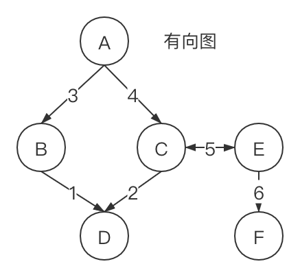

数据结构 - 图
===

> Create by **jsliang** on **2019-09-05 11:10:09**  
> Recently revised in **2020-4-4 17:55:26**

## <a name="chapter-one" id="chapter-one">一 目录</a>

**不折腾的前端，和咸鱼有什么区别**

| 目录 |
| --- | 
| [一 目录](#chapter-one) | 
| [二 前言](#chapter-two) |

## <a name="chapter-two" id="chapter-two">二 前言</a>

> [返回目录](#chapter-one)

图是一个庞大的主题，深入探索图的奇妙世界，足够写一本书。

所以这里，**jsliang** 也怂，但是做一些了解还是有必要的。

在本篇中，将通过讲解以下内容和大家一起学习进步：

* ……
* ……
* ……

## <a name="chapter-three" id="chapter-three">三 图相关术语</a>

> [返回目录](#chapter-one)

说起图，我们首先会想起地图，因为这个太常用了：

> 地图路线

* 广州-深圳
* 广州-上海
* 广州-杭州

其中，广州、深圳、上海以及杭州，就是**点**。

而它们的直线路径，就是**边**。

下面我们看一个正经点的图：

学习了解下图的相关知识点：

* **相邻顶点**：由一条边连接在一起的定点称为相邻顶点。比如 4 和 2，1 和 3，5 和 6 都是相邻顶点。
* **度**：度就是一个定点相邻顶点的数量。例如：4 的度是 2，3 的度是 3。
* **路径**：路径是顶点 V1, V2, ..., Vk 的一个连续序列，其中 Vi 和 Vi+1 是相邻的。在上面图中，路径可以是 `4 -> 3 -> 5 -> 6`，也可以是 `4 -> 2 -> 1`等。
* **简单路径**：简单路径要求不包含重复的顶点。例如 `4 -> 2 -> 1`，**环**也可以是一个简单路径，例如无向图的 `4 -> 3 -> 1 -> 2`。
* **无环图**：如果图中不存在环，则是无环图。
* **有向图**：存在箭头。
* **无向图**：不存在箭头。

然后在有向图，还有两个知识点：

* **强连通的**：在点 C 和 E 中，它们有箭头互相指向，所以它们是强连通的。
* **加权的**：在这个图中，我们看到它们的边被赋予了权值，所以是加权的。而如果像一开始那种没有赋值的，就是未加权的。

更多的我们就不一一介绍了，后面如果发现一些知识点特别有用，我们再将它加进来。

## <a name="chapter-four" id="chapter-four">四 图的表示</a>

> [返回目录](#chapter-one)

从数据结构的角度来说，我们有多种方式来表示图。

在所有的表示法中，不存在绝对正确的方式。

图的正确表示法取决于待解决的问题和图的类型。

### <a name="chapter-four-one" id="chapter-four-one">4.1 邻接矩阵</a>

> [返回目录](#chapter-one)

邻接矩阵：0 表示不相通，1 表示相通。

可以看到，邻接矩阵我们可以用二维数组来表示。

但是它有个缺点，就是矩阵中有很多 0，意味着我们浪费计算机存储空间来表示根本不存在的边。

当我们顶点变化的时候，二维数组也不够灵活。

### <a name="chapter-four-two" id="chapter-four-two">4.2 邻接表</a>

> [返回目录](#chapter-one)

邻接表：由图中每个顶点的相邻顶点列表组成。可以用数组、链表、散列表、字典等来表示相邻顶点列表。

邻接表对于大多数问题来说是更好的选择。

但是在实际过程中，如我们章节开头所描述的一样：不存在绝对正确的方式。

我们不能局限于单单使用邻接矩阵或者邻接表，例如需要查找两个顶点是否相邻，用邻接矩阵会更快。

### <a name="chapter-four-three" id="chapter-four-three">4.3 关联矩阵</a>

> [返回目录](#chapter-one)

关联矩阵：用点和边的关系，来描述图的情况。

这也是一种图的表示法，但是当 **jsliang** 查找对应的资料时，已经跑去查找 **数学** 领域了，可能在图的使用中，邻接表比较多点。

但是这并不妨碍我们的学习热情，根据上图，我们可得信息：

1. 对于关联矩阵，我们的 1 和 -1 都是相等的个数。在上图中有 5 条边，所以 1 和 -1 的个数都是 5。
2. 每一条边，都会存在出口点 1 和进口点 -1，从而能快速判断两个顶点是否相邻。
3. ……

## <a name="chapter-five" id="chapter-five">五 设计图</a>

> [返回目录](#chapter-one)

## <a name="chapter-night" id="chapter-night">n 参考文献</a>

> [返回目录](#chapter-one)

1. [【百度文库】《关联矩阵、回路矩阵、割集矩阵》](https://wenku.baidu.com/view/21ce5c0f814d2b160b4e767f5acfa1c7ab008266.html)
2. [【CSDN】hukai7190《邻接矩阵与关联矩阵》](https://blog.csdn.net/Hanging_Gardens/article/details/55670356)

---

**不折腾的前端，和咸鱼有什么区别！**

**jsliang** 会每天更新一道 LeetCode 题解，从而帮助小伙伴们夯实原生 JS 基础，了解与学习算法与数据结构。

**浪子神剑** 会每天更新面试题，以面试题为驱动来带动大家学习，坚持每天学习与思考，每天进步一点！

扫描上方二维码，关注 **jsliang** 的公众号（左）和 **浪子神剑** 的公众号（右），让我们一起折腾！

>  jsliang 的文档库 由 <a xmlns:cc="http://creativecommons.org/ns#" href="https://github.com/LiangJunrong/document-library" property="cc:attributionName" rel="cc:attributionURL">梁峻荣</a> 采用 <a rel="license" href="http://creativecommons.org/licenses/by-nc-sa/4.0/">知识共享 署名-非商业性使用-相同方式共享 4.0 国际 许可协议</a>进行许可。 基于<a xmlns:dct="http://purl.org/dc/terms/" href="https://github.com/LiangJunrong/document-library" rel="dct:source">https://github.com/LiangJunrong/document-library</a>上的作品创作。 本许可协议授权之外的使用权限可以从 <a xmlns:cc="http://creativecommons.org/ns#" href="https://creativecommons.org/licenses/by-nc-sa/2.5/cn/" rel="cc:morePermissions">https://creativecommons.org/licenses/by-nc-sa/2.5/cn/</a> 处获得。