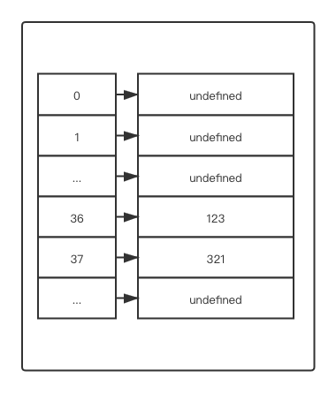
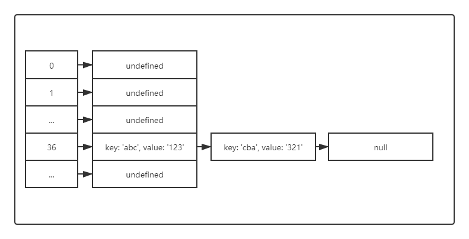

数据结构 - 字典和散列表
===

> Create by **jsliang** on **2019-09-05 11:09:30**  
> Recently revised in **2020-3-25 09:04:33**

## <a name="chapter-one" id="chapter-one">一 目录</a>

**不折腾的前端，和咸鱼有什么区别**

| 目录 |
| --- | 
| [一 目录](#chapter-one) | 
| <a name="catalog-chapter-two" id="catalog-chapter-two"></a>[二 前言](#chapter-two) |

## <a name="chapter-two" id="chapter-two">二 前言</a>

> [返回目录](#chapter-one)

集合、字典和散列表可以存储不重复的值。

在字典中，我们用[键, 值]的形式来存储数据，散列表也是一样。

但是两者数据结构的实现方式略有不同，在这里会详细介绍。

相比较于集合的 [值, 值] 的存储方式，字典是通过 [键, 值] 的形式来存储数据的，其中键名是用来查询特定元素的。

字典也称作映射。

如果小伙伴是中规中矩按照上面流程看的话，那么应该知道 `Set` 的实现方式。同理，现在我们实现一个 `Map`。

```js
const Dictionary = function() {
  let items = {};

  // has(key)：如果某个键值存在于这个字典中，则返回 true，否则返回 false
  this.has = function(key) {
    // return key in items;
    return items.hasOwnProperty(key);
  };

  // set(key, value)：向字典中添加新元素
  this.set = function(key, value) {
    items[key] = value;
  };

  // delete(key)：通过使用键值来从字典中移除键值对应的数据值
  this.delete = function(key) {
    if (this.has(key)) {
      delete items[key];
      return true;
    }
    return false;
  };

  // get(key)：通过键查找对应的数值并返回
  this.get = function(key) {
    return this.has(key) ? items[key] : undefined;
  };

  // values()：将字典所包含的所有数值以数组形式返回
  this.values = function() {
    let values = [];
    for (let i in items) {
      if (this.has(i)) {
        values.push(items[i]);
      }
    }
    return values;
  };

  // clear()：将这个字典中的所有元素全部删除
  this.clear = function() {
    items = {};
  };

  // size()：返回字典所包含的元素的数量，与 length 类似
  this.size = function() {
    let length = 0;
    for (let i in items) {
      if (this.has(i)) {
        length++;
      }
    }
    return length;
  };

  // keys()：将字典所包含的所有键名以数组形式返回
  this.keys = function() {
    return Object.keys(items);
  };

  // print()：打印 items
  this.print = function() {
    console.log(items);
  }
};

const dictionary = new Dictionary();

dictionary.print(); // {}

dictionary.set('name', 'jsliang');
dictionary.set('age', 25);

dictionary.print(); // { name: 'jsliang', age: 25 }
console.log(dictionary.get('name')); // jsliang
console.log(dictionary.values()); // [ 'jsliang', 25 ]
console.log(dictionary.size()); // 2
console.log(dictionary.keys()); // [ 'name', 'age' ]

dictionary.delete('name');
dictionary.print(); // { age: 25 }

dictionary.clear();
dictionary.print(); // {}
```

`HashTable` 类或者 `HashMap` 类，是 `Dictionary` 类的一种散列表实现方式。

散列算法的作用是尽可能快地在数据结构中找到一个值。

如果我们需要查找的元素在对象的最末尾，那么我们需要遍历整个对象。

而如果使用散列函数，就知道值的具体位置，因此能够快速检索到该值。

散列函数的作用是给定一个键值，然后返回值在表中的地址。

散列表的实现代码如下所示：

```js
const HashTable = function() {
  let table = [];

  // 散列函数：HashTable 的私有方法
  const loseloseHashCode = function(key) {
    let hash = 0;
    for (let i = 0; i < key.length; i++) {
      hash += key.charCodeAt(i);
    }
    return hash % 37;
  }

  // put(key, value)：向散列表增加一个新的项（也能更新散列表）
  this.put = function(key, value) {
    const position = loseloseHashCode(key);
    console.log(position + ' - ' + key);
    table[position] = value;
  };

  // remove(key)：根据键值从散列表中移除值
  this.remove = function(key) {
    table[loseloseHashCode(key)] = undefined;
  };

  // get(key)：返回根据键值检索到的特定的值
  this.get = function(key) {
    return table[loseloseHashCode(key)];
  };

  // print：打印
  this.print = function() {
    console.log(table);
  }
};

const hashTable = new HashTable();

hashTable.put('name', 'jsliang'); // 10 - name
hashTable.put('age', 25); // 5 - age
hashTable.print(); // [ <5 empty items>, 25, <4 empty items>, 'jsliang' ]

console.log(hashTable.get('name')); // jsliang

hashTable.remove('name');
hashTable.print(); // [ <5 empty items>, 25, <4 empty items>, undefined ]
```

那么，我们需要验证下，它是否真的比普通的字典快：

```js
const dictionary = new Dictionary();

console.time('哈希表新增');
for (let i = 0; i < 1000000; i++) {
  dictionary.set(i, i);
}
console.timeEnd('哈希表新增'); // 哈希表新增: 31.028ms

console.time('哈希表查找末尾');
dictionary.get(1000000);
console.timeEnd('哈希表查找末尾'); // 哈希表查找末尾: 0.035ms

const hashTable = new HashTable();

console.time('散列表新增');
for (let i = 0; i < 1000000; i++) {
  hashTable.put(i, i);
}
console.timeEnd('散列表新增'); // 散列表新增: 3.438ms

console.time('散列表查找末尾');
hashTable.get(1000000);
console.timeEnd('散列表查找末尾'); // 散列表查找末尾: 0.029ms
```

我们将其列到表格上：

| 方法 | 新增 | 查找末尾 |
| --- | --- | --- |
| 哈希表 | 31.028ms | 0.035ms |
| 散列表 | 3.438ms | 0.029ms |

咦，都 100 万的数据了，好像，除了发现新增方面优势真的挺高，查找末尾元素上好像不会相差太多（即便的确快那么一点点）

然后，我们再试试下面的代码：

```js
const hashTable = new HashTable();

hashTable.put('abc', 123);
hashTable.put('cba', 321);

hashTable.print();
```

先不贴答案，小伙伴们会觉得输出啥？

```js
[ <35 empty items>, 321 ]
```

也就是说，我们再通过 `hashTable.get('abc')` 的时候，获取到的是 `321`，因为我们存储了两次：

* 'abc' -> 36 -> 123
* 'cba' -> 36 -> 321

第二次和第一次存储的位置都是 35，对于它们的冲突，JavaScript 的解决方法是用第二次的值将第一次覆盖掉。

这样的存储，分明不符合我们的期望。

使用一个数据结构来保存数据的目的显然不是丢失这些数据，而是通过某种方法将它们全部保存起来。

所以这时候，我们就引入新的概念：**散列集合**。

所谓的散列集合，是由一个集合构成，但是插入、移除或者获取元素时，使用的是散列函数。

和集合相似，散列集合只存储唯一的不重复的值，我们不再添加键值对，而是只插入值而没有键。

而实现 **散列集合**，解决这些冲突的方法有三种：**分离链接**、**线性探查** 以及 **双散列法**。

分离链接的法子，就是让散列表加上链表，对于存储位置相同的元素，我们则让它通过链表的形式进行存储：



如上图，我们知道散列表会存储两次：

* 'abc' -> 36 -> 123
* 'cba' -> 36 -> 321

而如果不做处理，那么 `cba` 会覆盖 `abc`，所以我们将 `36` 的位置打造为链表，这样我们就可以让它通过链表不断地逐个添加。

只是这样一来，我们的散列表就变得有些臃肿了。

> 分离链接

```js
function LinkedList() {

  let Node = function(element) {
    this.element = element;
    this.next = null;
  }

  let length = 0;
  let head = null;

  // 尾部添加
  this.append = function(element) {
    let node = new Node(element),
      current;
    if (head === null) {
      head = node;
    } else {
      current = head;
      while (current.next) {
        current = current.next;
      }
      current.next = node;
    }
    length++;
  };

  // 向链表的指定位置插入一个新的项
  this.insert = function(position, element) {
    if (position >= 0 && position <= length) {
      let node = new Node(element),
        current = head,
        previous,
        index = 0;
      if (position === 0) {
        node.next = current;
        head = node;
      } else {
        while (index++ < position) {
          previous = current;
          current = current.next;
        }
        node.next = current;
        previous.next = node;
      }
      length++;
      return true;
    } else {
      return null;
    }
  };

  // 根据传入的位置从链表的指定位置移除一项
  this.removeAt = function(position) {
    if (position > -1 && position < length) {
      let current = head,
        previous,
        index = 0;
      if (position === 0) {
        head = current.next;
      } else {
        while (index++ < position) {
          previous = current;
          current = current.next;
        }
        previous.next = current.next;
      }
      length--;
      return current.element;
    } else {
      return null;
    }
  };

  // 根据传入的值从链表移除一项
  this.remove = function(element) {
    return this.removeAt(this.indexOf(element));
  };
  
  // 返回元素在链表中的索引，如果链表中没有该元素则返回 -1
  this.indexOf = function(element) {
    let current = head,
      index = 0;
    while (current) {
      if (current.element === element) {
        return index;
      }
      current = current.next;
      index++;
    }
    return -1;
  };
  
  // 如果链表中不包含任何元素，返回 true，如果链表长度大于 0 则返回 false
  this.isEmpty = function() {
    return length === 0;
  };
  
  // 返回链表包含的元素个数，与数组的 length 属性类似
  this.size = function() {
    return length;
  };
  
  // 返回头部
  this.getHead = function() {
    return head;
  };
  
  // 重写继承自 JavaScript 对象默认的 toString() 方法，让其只输出元素的值
  this.toString = function() {
    let current = head,
      string = '';
    while (current) {
      string += current.element + (current.next ? '#' : '');
      current = current.next;
    }
    return string;
  };
  
  // 查看当前链表
  this.print = function() {
    console.log(head);
  };
}

const HashTable = function() {
  let table = [];

  // 分离链接辅助类
  const ValuePair = function(key, value) {
    this.key = key;
    this.value = value;
    this.toString = function() {
      return '[' + this.key + ' - ' + this.value + ']';
    }
  }

  // 散列函数：HashTable 的私有方法
  const loseloseHashCode = function(key) {
    let hash = 0;
    for (let i = 0; i < key.length; i++) {
      hash += key.charCodeAt(i);
    }
    return hash % 37;
  }

  // put(key, value)：向散列表增加一个新的项（也能更新散列表）
  this.put = function(key, value) {
    const position = loseloseHashCode(key);

    if (table[position] === undefined) {
      table[position] = new LinkedList();
    }

    table[position].append(new ValuePair(key, value));
  };

  // get(key)：返回根据键值检索到的特定的值
  this.get = function(key) {
    var position = loseloseHashCode(key);

    if (table[position] !== undefined) {
      // 遍历链表来寻找键/值
      let current = table[position].getHead();

      while(current.next) {
        if (current.element.key === key) {
          return current.element.value;
        }
        current = current.next;
      }

      // 检查元素在链表第一个或最后一个节点的情况
      if (current.element.key === key) {
        return current.element.value;
      }
    }
    return undefined;
  };

  // remove(key)：根据键值从散列表中移除值
  this.remove = function(key) {
    let position = loseloseHashCode(key);

    if (table[position] !== undefined) {
      let current = table[position].getHead();

      while(current.next) {
        if (current.element.key === key) {
          table[position].remove(current.element);
          if (table[position].isEmpty()) {
            table[position] = undefined;
          }
          return true;
        }
        current = current.next;
      }

      // 检查是否为第一个或者最后一个元素
      if (current.element.key === key) {
        table[position].remove(current.element);
        if (table[position].isEmpty()) {
          table[position] = undefined;
        }
        return true;
      }
    }

    return false;
  };

  // print：打印
  this.print = function() {
    console.log(table);
  }

  // 打印 key 对应的链表或者 undefined
  this.printList = function(key) {
    const position = loseloseHashCode(key);
    table[position].print();
  }
};

const hashTable = new HashTable();

hashTable.put('abc', 123);
hashTable.put('cba', 321);
hashTable.print();
/*
[ <35 empty items>,    
  LinkedList {
    append: [Function],
    insert: [Function],
    removeAt: [Function],
    remove: [Function],
    indexOf: [Function],
    isEmpty: [Function],
    size: [Function],
    getHead: [Function],
    toString: [Function],
    print: [Function] } ]
*/

console.log(hashTable.get('abc')); // 123
console.log(hashTable.get('cba')); // 321

hashTable.printList('abc');
/*
Node {
  element: ValuePair { key: 'abc', value: 123, toString: [Function] },
  next:
   Node {
     element: ValuePair { key: 'cba', value: 321, toString: [Function] },
     next: null } }
*/
```

所谓的线性探查，就是当 `a` 位置存在内容的时候，我们让它存储到 `a + 1` 的位置，即：

* 'abc' -> 36 -> 123
* 'cba' -> 36 -> 321

那么 `cba` 就存储到 37 的位置去：



> 线性探查

```js
const HashTable = function() {
  let table = [];

  // 分离链接辅助类
  const ValuePair = function(key, value) {
    this.key = key;
    this.value = value;
    this.toString = function() {
      return '[' + this.key + ' - ' + this.value + ']';
    }
  }

  // 散列函数：HashTable 的私有方法
  const loseloseHashCode = function(key) {
    let hash = 0;
    for (let i = 0; i < key.length; i++) {
      hash += key.charCodeAt(i);
    }
    return hash % 37;
  }

  // put(key, value)：向散列表增加一个新的项（也能更新散列表）
  this.put = function(key, value) {
    const position = loseloseHashCode(key);

    if (table[position] === undefined) {
      table[position] = new ValuePair(key, value);
    } else {
      let index = position + 1;
      while (table[index] !== undefined) {
        index++;
      }
      table[index] = new ValuePair(key, value);
    }
  };

  // get(key)：返回根据键值检索到的特定的值
  this.get = function(key) {
    const position = loseloseHashCode(key);

    if (table[position] !== undefined) {
      if (table[position].key === key) {
        return table[position].value;
      } else {
        let index = position + 1;
        while (table[index] === undefined || table[index].key !== key) {
          index++;
        }
        if (table[index].key === key) {
          return table[index].value;
        }
      }
    }
    return undefined;
  };

  // remove(key)：根据键值从散列表中移除值
  this.remove = function(key) {
    const position = loseloseHashCode(key);

    if (table[position] !== undefined) {
      if (table[position].key === key) {
        table[position] = undefined;
      } else {
        let index = position + 1;
        while (table[index] === undefined || table[index].key !== key) {
          index++;
        }
        if (table[index].key === key) {
          table[index] = undefined;
        }
      }
    }
    return undefined;
  };

  // print：打印
  this.print = function() {
    console.log(table);
  }
};

const hashTable = new HashTable();

hashTable.put('abc', 123);
hashTable.put('cba', 321);
hashTable.print();
/*
[ <35 empty items>,
  ValuePair { key: 'abc', value: 123, toString: [Function] },
  ValuePair { key: 'cba', value: 321, toString: [Function] } ]
*/

console.log(hashTable.get('abc')); // 123
console.log(hashTable.get('cba')); // 321

hashTable.remove('abc');
hashTable.print();
/*
[ <35 empty items>,
  undefined,
  ValuePair { key: 'cba', value: 321, toString: [Function] } ]
*/
```

双散列法这里暂未提及

> 双散列法

```js

```

一个良好的散列函数由几个方面构成：

1. 插入和检索元素的时间（即性能）
2. 较低的冲突可能性。

所以，我们的 `loseloseHashCode` 并不是一个表现良好的散列函数，因为它会产生太多的冲突。

因此，我们找到一个更好的散列函数：`djb2`：

```js
const HashTable = function() {
  let table = [];

  // 散列函数：HashTable 的私有方法
  const loseloseHashCode = function(key) {
    let hash = 5381;
    for (let i = 0; i < key.length; i++) {
      hash = hash * 33 + key.charCodeAt(i);
    }
    return hash % 1013;
  }

  // put(key, value)：向散列表增加一个新的项（也能更新散列表）
  this.put = function(key, value) {
    const position = loseloseHashCode(key);
    console.log(position + ' - ' + key);
    table[position] = value;
  };

  // remove(key)：根据键值从散列表中移除值
  this.remove = function(key) {
    table[loseloseHashCode(key)] = undefined;
  };

  // get(key)：返回根据键值检索到的特定的值
  this.get = function(key) {
    return table[loseloseHashCode(key)];
  };

  // print：打印
  this.print = function() {
    console.log(table);
  }
};

const hashTable = new HashTable();

hashTable.put('abc', 123); // 937 - abc
hashTable.put('cba', 321); // 74 - cba
hashTable.print(); // [ <74 empty items>, 321, <862 empty items>, 123 ]

console.log(hashTable.get('abc')); // 123
```

可以看到，通过 `djb2` 方法，我们成功将这两个冲突的键值分开了：

```js
[ <74 empty items>, 321, <862 empty items>, 123 ]
```

虽然这不是最好的散列函数，但这是最受社区推崇的散列函数之一。

---

当然，上面的内容，我们仅做了解，因为在实战中，我们不会写这样花里胡哨的内容，而是直接使用 ES6 的 `Map` 类：

```js
const map = new Map();

map.set('abc', 123);
map.set('cba', 321);

console.log(map.values()); // [Map Iterator] { 123, 321 }
```

可以看到 `Map` 已经帮我们解决了该有的问题，我们能做的就是信任它，然后用它攻克各种问题~

> 实在不行的时候再构造一个散列表吧！

---

扩展：WeakMap 和 WeakSet 类

ES6 除了含有 `Map` 和 `Set` 两种方法，还增加了它们的弱化版本：`WeakMap` 和 `WeakSet`。

`Map` 和 `Set` 与其弱化版本的区别是：

* `WeakSet` 或者 `WeakMap` 类没有 `entries`、`keys` 和 `values` 等方法；
* 只能用对象作为键。

---

**不折腾的前端，和咸鱼有什么区别！**


**jsliang** 会每天更新一道 LeetCode 题解，从而帮助小伙伴们夯实原生 JS 基础，了解与学习算法与数据结构。

**浪子神剑** 会每天更新面试题，以面试题为驱动来带动大家学习，坚持每天学习与思考，每天进步一点！

扫描上方二维码，关注 **jsliang** 的公众号（左）和 **浪子神剑** 的公众号（右），让我们一起折腾！

> <a rel="license" href="http://creativecommons.org/licenses/by-nc-sa/4.0/"></a><br /><span xmlns:dct="http://purl.org/dc/terms/" property="dct:title">jsliang 的文档库</span> 由 <a xmlns:cc="http://creativecommons.org/ns#" href="https://github.com/LiangJunrong/document-library" property="cc:attributionName" rel="cc:attributionURL">梁峻荣</a> 采用 <a rel="license" href="http://creativecommons.org/licenses/by-nc-sa/4.0/">知识共享 署名-非商业性使用-相同方式共享 4.0 国际 许可协议</a>进行许可。<br />基于<a xmlns:dct="http://purl.org/dc/terms/" href="https://github.com/LiangJunrong/document-library" rel="dct:source">https://github.com/LiangJunrong/document-library</a>上的作品创作。<br />本许可协议授权之外的使用权限可以从 <a xmlns:cc="http://creativecommons.org/ns#" href="https://creativecommons.org/licenses/by-nc-sa/2.5/cn/" rel="cc:morePermissions">https://creativecommons.org/licenses/by-nc-sa/2.5/cn/</a> 处获得。