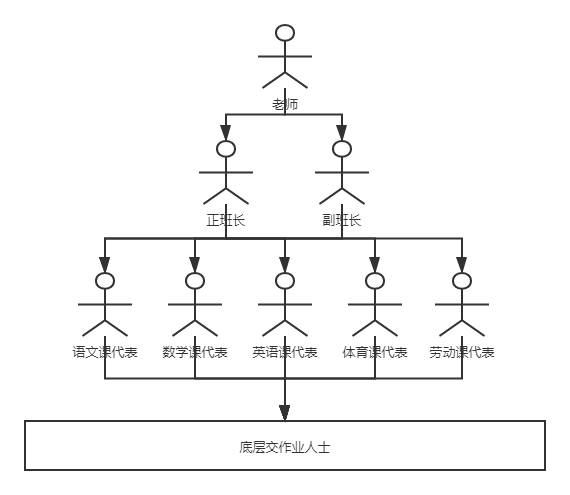
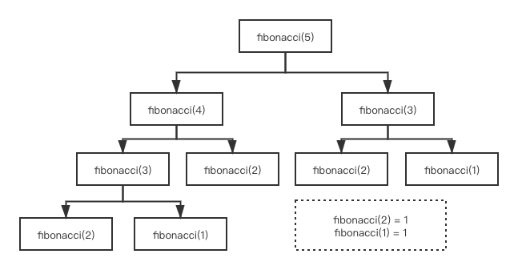
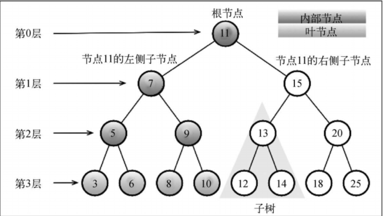

数据结构 - 树
===

> Create by **jsliang** on **2019-6-13 09:02:12**  
> Recently revised in **2020-04-03 13:37:04**

* AVL 树分章节以及补充完善

## <a name="chapter-one" id="chapter-one">一 目录</a>

**不折腾的前端，和咸鱼有什么区别**

| 目录 |
| --- | 
| [一 目录](#chapter-one) | 
| <a name="catalog-chapter-two" id="catalog-chapter-two"></a>[二 前言](#chapter-two) |
| <a name="catalog-chapter-three" id="catalog-chapter-three"></a>[三 初识树](#chapter-three) |
| <a name="catalog-chapter-four" id="catalog-chapter-four"></a>[四 【前置】递归](#chapter-four) |
| <a name="catalog-chapter-five" id="catalog-chapter-five"></a>[五 树相关术语](#chapter-five) |
| <a name="catalog-chapter-six" id="catalog-chapter-six"></a>[六 二叉树和二叉搜索树](#chapter-six) |
| &emsp;[6.1 完整代码](#chapter-six-one) |
| &emsp;[6.2 插入键：insert()](#chapter-six-two) |
| &emsp;[6.3 先序遍历：prevOrderTranverse()](#chapter-six-three) |
| &emsp;[6.4 中序遍历：inOrderTraverse()](#chapter-six-four) |
| &emsp;[6.5 后序遍历：postOrderTraverse()](#chapter-six-five) |
| &emsp;[6.6 层序遍历：levelTraverse()](#chapter-six-six) |
| &emsp;[6.7 搜索 search()、最小值 min() 和 最大值 max()](#chapter-six-seven) |
| &emsp;[6.8 移除键：remove()](#chapter-six-eight) |
| <a name="catalog-chapter-seven" id="catalog-chapter-seven"></a>[七 【进阶】自平衡树：AVL 树](#chapter-seven) |
| &emsp;[7.1 AVL 完整代码](#chapter-seven-one) |
| &emsp;[7.2 平衡策略](#chapter-seven-two) |
| &emsp;[7.3 计算高度](#chapter-seven-three) |
| &emsp;[7.4 插入节点](#chapter-seven-four) |
| &emsp;&emsp;[7.4.1 右-右（RR）：向左的单旋转](#chapter-seven-four-one) |
| &emsp;&emsp;[7.4.2 左-左（LL）：向右的单旋转](#chapter-seven-four-two) |
| &emsp;&emsp;[7.4.3 左-右（LR）：向右的双旋转](#chapter-seven-four-three) |
| &emsp;&emsp;[7.4.4 右-左（RL）：向左的双旋转](#chapter-seven-four-four) |
| &emsp;[7.5 删除节点](#chapter-seven-five) |
| &emsp;[7.6 AVL 树小结](#chapter-seven-six) |
| <a name="catalog-chapter-eight" id="catalog-chapter-eight"></a>[八 【进阶】自平衡树：红黑树](#chapter-eight) |
| <a name="catalog-chapter-night" id="catalog-chapter-night"></a>[九 总结](#chapter-night) |
| <a name="catalog-chapter-ten" id="catalog-chapter-ten"></a>[十 题集](#chapter-ten) |
| <a name="catalog-chapter-eleven" id="catalog-chapter-eleven"></a>[十一 参考文献](#chapter-eleven) |

## <a name="chapter-two" id="chapter-two"></a>二 前言

> [返回目录](#chapter-one)

**jsliang** 每次解 LeetCode，都会先自己尝试破解，Submit 通过后，会查看下 LeetCode 社区其他小伙伴的破解思路，最后再看别人的代码，以此作为比较，吸取大神们的经验。

第一次解树题目的时候，抱着虚心的心态，前往题解区/评论区观摩（抄作业），结果还真碰到了个不错的讲解：

* [写树算法的套路框架](https://leetcode-cn.com/problems/same-tree/solution/xie-shu-suan-fa-de-tao-lu-kuang-jia-by-wei-lai-bu-/)

> 推荐查看其 GitHub：[labuladong/fucking-algorithm](https://github.com/labuladong/fucking-algorithm)，16.8k 的 star，看了不亏

> 由于原文采用 C++ 的编程风格，**jsliang** 引入的时候会自动转换成 JavaScript

以下是其内容：

* 二叉树算法的设计的总路线：明确一个节点要做的事情，然后剩下的事抛给框架。

```js
let traverse = function(root) {
  // root 需要做什么？在这做。
  // 其他的不用 root 操心，抛给实现功能的函数
  traverse(root.left);
  traverse(root.right);
}
```

举两个简单的例子体会一下这个思路，热热身。

* 如何把二叉树所有的节点中的值加一？

```js
let plusOne = function(root) {
  if (!root) {
    return;
  }
  root.val += 1;
  plusOne(root.left);
  plusOne(root.right);
}
```

* 如何判断两棵二叉树是否完全相同？

```js
let isSameTree = function(root1, root2) {
  // 都为空的话，显然相同
  if (root1 == null && root2 == null) {
    return true;
  }
  // 一个为空，一个非空，显然不同
  if (root1 == null || root2 == null) {
    return false;
  }
  // 两个都非空，但 val 不一样也不行
  if (root1.val != root2.val) {
    return false;
  }
  // root1 和 root2 该比的都比完了，进行节点比较
  return isSameTree(root1.left, root2.left)
    && isSameTree(root1.right, root2.right);
}
```

大佬的解题套路如上，**jsliang** 觉得貌似有点道理，于是给记录下来，然后再之后碰到的树的题目中，不断尝试总结，终于能够挑战几乎 99% 以上的简单类型的 LeetCode 题！

最近系统学习整理二叉树的知识点，果然还是觉得先学习再刷题才是正确的攻略（**jsliang** 是彻底的反面例子）。

## <a name="chapter-three" id="chapter-three"></a>三 初识树

> [返回目录](#chapter-one)

和散列表一样，树也是一种非顺序数据结构，它对于存储需要快速查找的数据非常有用。

树是一种分层数据的抽象模型。



正如上图的班级结构图，就是一种树结构，它由食物链顶端：老师，分层控制各个学生。

> 灵机一动想起班级结构图，那就画了个班级结构图，看起来似乎有点丑了……

联想一下，你就会想起各种树结构：公司、班级、学校……

那么，树是一种怎样的结构呢？

```
    4
   / \
  3   5
 / \   \
1   2   6
```

如上图，就是一个常见的树表示图，如果你觉得不够清晰了解，咱们再看看树代码：

> 此处使用的是 Object 仿树结构，下面讲解树的各个知识点不会这样写，但是 LeetCode 刷题你可以这么用！

```js
const root = {
  val: 4,
  left: {
    val: 3,
    left: { val: 1, left: null, right: null },
    right: { val: 2, left: null, right: null },
  },
  right: {
    val: 5,
    left: null,
    right: { val: 6, left: null, right: null },
  },
};
```

很好，看完上面，你就是熟知树的一员了，咱们来道题热热身吧：

* [【LeetCode】100. 相同的树](https://leetcode-cn.com/problems/same-tree/)

```
给定两个二叉树，编写一个函数来检验它们是否相同。

如果两个树在结构上相同，并且节点具有相同的值，则认为它们是相同的。

示例 1:

输入: 
   1         1
  / \       / \
 2   3     2   3

[1,2,3],   [1,2,3]

输出: true

示例 2:

输入:     
   1         1
  /           \
 2             2

[1,2],     [1,null,2]

输出: false

来源：力扣（LeetCode）
链接：https://leetcode-cn.com/problems/same-tree
著作权归领扣网络所有。
商业转载请联系官方授权，
非商业转载请注明出处。
```

给出函数体，请小伙伴先尝试作答：

```js
/**
 * Definition for a binary tree node.
 * function TreeNode(val) {
 *     this.val = val;
 *     this.left = this.right = null;
 * }
 */
/**
 * @param {TreeNode} p
 * @param {TreeNode} q
 * @return {boolean}
 */
var isSameTree = function(p, q) {

};
```

---

看完小伙伴们有没有跃跃欲试的感觉，尝试过后可以看下 **jsliang** 的题解：

> 解法一：递归

```js
const root1 = {
  val: 1,
  left: { val: 2, left: null, right: null },
  right: { val: 3, left: null, right: null },
};
const root2 = {
  val: 1,
  left: { val: 2, left: null, right: null },
  right: { val: 4, left: null, right: null },
};

const isSameTree = (root1, root2) => {
  const ergodic = (root) => {
    if (|root) {
      return '|#';
    }
    return '|' + root.val + ergodic(root.left) + ergodic(root.right);
  }
  console.log(ergodic(root1));
  console.log(ergodic(root2));
  return ergodic(root1) === ergodic(root2);
};

isSameTree(root1, root2);
// |1|2|#|#|3|#|#
// |1|2|#|#|4|#|#
```

在树的破解中，你会经常性地接触一个方法：**递归**，下面我们会花点篇幅讲解它，先看题解：

1. 有两棵树，一棵是：`1->2->3`，一棵是：`1->2->4`，明眼人就知道这两个是不一样的，但是我们要让机器知道不一样啊。
2. 将 `root1` 转化为字符串，即：`|1|2|#|#|3|#|#`。
3. 将 `root2` 转化为字符串，即：`|1|2|#|#|4|#|#`。
4. 比较两者字符串，返回 `true/false`。

这样，就完成了题解，是不是觉得 so easy~

的确，既然是转字符串，然后你的数据结构类似于 `Object`，那么我可以直接上 `JSON.stringify()` 啊：

> 解法二：`JSON.stringify()`

```js
const isSameTree = (root1, root2) => {
  return JSON.stringify(root1) === JSON.stringify(root2);
};

isSameTree(root1, root2);
```

不管是本地的尝试还是直接在 LeetCode 点击提交，都可以看到我们的代码是成功的~

这样，树，小伙伴就入门了！

> 想起来一把辛酸泪，**jsliang** 是自己通过刷题逐渐明白的

## <a name="chapter-four" id="chapter-four"></a>四 【前置】递归

> [返回目录](#chapter-one)

乘我们刚热身完，将该了解的内容先了解下：

* 递归

递归是什么：函数自身调用自身，直到海枯石烂（递归终止）。

较为出名的可以用递归破解的就是 **斐波那契数列**。

* [【百度百科】斐波那契数列](https://baike.baidu.com/item/%E6%96%90%E6%B3%A2%E9%82%A3%E5%A5%91%E6%95%B0%E5%88%97/99145?fr=aladdin)

什么是 **斐波那契数列**？

斐波那契数列（Fibonacci sequence），又称黄金分割数列、因数学家列昂纳多·斐波那契（Leonardoda Fibonacci）以兔子繁殖为例子而引入，故又称为“兔子数列”。

它指的是这样一个数列：1、1、2、3、5、8、13、21、34……

即：第 3 项开始，每一项都是前两项之和，用 `for()` 来计算就是：

> 斐波那契数列 - for() 循环破解

```js
const fibonacci = (num) => {
  const arr = [1, 1];
  for (let i = 2; i < num; i++) {
    arr[i] = arr[i - 1] + arr[i - 2];
  }
  return arr;
};

console.log(fibonacci(10));
// [ 1, 1, 2, 3, 5, 8, 13, 21, 34, 55 ]
```

OK，相信 `for()` 这份代码小伙伴都看得懂，那么我们先将递归的代码贴上来，看下小伙伴们能不能理解：

> 斐波那契数列 - 递归破解

```js
const fibonacci = (index) => {
  if (index === 1 || index === 2) {
    return 1;
  }
  return fibonacci(index - 1) + fibonacci(index - 2);
};

console.log(fibonacci(10)); // 55
```

1. 调用 `fibonacci(index)`，这里的 `index` 是需要查找第几项。
2. 判断终止条件：`index === 1 || index === 2`，因为第一项和第二项都是 `1`。
3. 如果是第 3 项及以上的，就计算它前两项的和。

这么说小伙伴可能会有点懵圈，咱们看图：

> 最好是有视频调试，但是现在没想好怎么录视频或者做数据演示



顺着图，我们可以看到：

* `fibonacci(5) = fibonacci(4) + fibonacci(3)`
* `fibonacci(4) = fibonacci(3) + fibonacci(2)`
* `fibonacci(3) = fibonacci(2) + fibonacci(1)`
* `fibonacci(2) = 1`
* `fibonacci(1) = 1`

然后，我们再反推数据：

* `fibonacci(1) = 1`
* `fibonacci(2) = 1`
* `fibonacci(3) = 2`
* `fibonacci(4) = 3`
* `fibonacci(5) = 5`

所以最终结果是 `5`。

这样的逐步演进过程，就是递归。

那么我们做件有意思的事情，`for()` 和 `ergodic()` 哪个比较快？

```js
const fibonacciByFor = (num) => {
  const arr = [1, 1];
  for (let i = 2; i < num; i++) {
    arr[i] = arr[i - 1] + arr[i - 2];
  }
  return arr[arr.length - 1];
};

console.time('for 计算');
fibonacciByFor(20); // for 计算: 0.191ms
console.timeEnd('for 计算');

const fibonacciByErgodic = (index) => {
  if (index === 1 || index === 2) {
    return 1;
  }
  return fibonacciByErgodic(index - 1) + fibonacciByErgodic(index - 2);
};

console.time('ergodic 计算');
fibonacciByErgodic(20); // ergodic 计算: 1.655ms
console.timeEnd('ergodic 计算');
```

看表：

| 方法 | 耗时 |
| --- | --- |
| 线性遍历 | 0.191ms |
| 递归遍历 | 1.655ms |

如果小伙伴输入 30、50，甚至 100，会发现递归越来越慢返回结果，甚至你在浏览器上查看，会发现页面卡住了。

这就是递归的局限性。

OK，到这里小伙伴可能会有点兴奋：我知道啥是递归，啥是斐波那契数列了，有没有题目给我先练习下？！

有的：

| 顺序 | 题目 | 解题攻略 |
| --- | --- | --- |
| 待补充 | 509 - 斐波那契数列（fibonacci-number） | [#509 解题](./509-斐波那契数列（fibonacci-number）.md) |
| 待补充 | 待补充 | 待补充 |

这样，我们就进一步学习到了递归，并进行了题目练习。

## <a name="chapter-five" id="chapter-five"></a>五 树相关术语

> [返回目录](#chapter-one)

话归正题，我们讲清楚了递归，是时候看看树的一些相关术语，然后开始树的构造玩耍了。

> 虽然本小节可能有点无聊，但是了解树的相关术语有助于你进一步了解树。



> 图来自于《学习 JavaScript 数据结构与算法》

如上图：

* **根节点**：即 4。位于顶端，没有父节点，整棵树都是它的弟弟。
* **父节点**：`4` 是 `2` 的父节点，`2` 是 `1` 的父节点。
* **子节点**：`2` 是 `4` 的子节点，`1` 是 `2` 的子节点。
* **后代**：`4` 的子节点有 `2` 和 `5`，孙子节点有 `1`、`3`、`6`，曾孙节点有 ……
* **祖先**：`1` 的父节点为 `2`，祖父节点有 `4`，曾祖父节点这里没有……
* **子树**：`2 & 1 & 3` 构成一颗子树，`5 & 6` 也构成一颗子树。
* **深度**：按照数组的逻辑，万物从 0 开始，所以根节点的深度为 0，然后第 1 层、第 2 层……
* **左侧子节点**：`2` 是 `4` 的左侧子节点。
* **右侧子节点**：`5` 是 `4` 的右侧子节点。

掌握了这些前置知识，我们在下面进行二叉树的设计的时候，能更好地沟通学习~

## <a name="chapter-six" id="chapter-six"></a>六 二叉树和二叉搜索树

> [返回目录](#chapter-one)

很好，了解完树的相关术语之后，我们开始了解二叉树以及二叉树的种类之一：二叉搜索树。

* 什么是二叉树？

很简单，一儿一女，一左一右，即为二叉。

> 二叉树

```
  1
 / \
2   3
```

二叉树最多只有两个子节点：一个左侧子节点，一个右侧子节点。

这些定义有助于我们写出更高效的从树中插入、查找和删除节点的算法。

> 如果这棵树有 n 个分支呢？n 叉树？

* 什么是二叉搜索树？

二叉搜索树（BST）是二叉树的一种，但是它遵循一个原则：左小右大。

不同于古时候男左女右，左为尊的规则，二叉搜索树符合现代的读书，从左往右看，故而左小右大。

> 二叉搜索树

```
     4
   /   \
  2     6
 / \   / \
1   3 5   7
```

1. 以 4 为分界，左边 1/2/3 小于 4，右边 5/6/7 大于 4。
2. 以 2 为分界，左边 1 小于 2，右边 3 大于 2。
3. 以 6 为分界，左边 5 小于 6，右边 7 大于 6。

在设计二叉搜索树的时候，需要注意一个问题，即所有父节点（包括根节点），都符合左小右大的规则，往往很多时候设计树或者做二叉搜索树的题目时，这点是容易忽略的（包括 **jsliang**）。

再来就是，我们需要了解一些 **术语**，方便和一些 **专家** 沟通：

* **边**：由 4 到 2，或者 2 到 1 的箭头，称为边。
* **键**：将二叉树的节点本身称为键，例如 4、2、1 等。

那么下面我们开始设计二叉搜索树：

```js
const BinarySearchTree = function {
  const Node = function(key) {
    this.key = key;
    this.left = null;
    this.right = null;
  };

  const root = null;

  // 向树中插入一个新的键
  this.insert = function(value) {};

  // 通过先序遍历方式遍历所有节点
  this.prevOrderTranverse = function() {};

  // 通过中序遍历方式遍历所有节点
  this.inOrderTraverse = function() {};
  
  // 通过后序遍历方式遍历所有节点
  this.postOrderTranverse = function() {};

  // 返回树中最小的值/键
  this.min = function() {};

  // 返回树中最大的值/键
  this.max = function() {};

  // 在树中查找一个键，如果节点存在，则返回 true，否则返回 false
  this.search = function(value) {};
  
  // 从树中移除某个键
  this.remove = function(value) {};
}
```

* `insert(value)`：向树中插入一个新的键
* `prevOrderTranverse()`：通过先序遍历方式遍历所有节点
* `inOrderTraverse()`：通过中序遍历方式遍历所有节点
* `postOrderTranverse()`：通过后序遍历方式遍历所有节点
* `search(value)`：在树中查找一个键，如果节点存在，则返回 true，否则返回 false
* `min()`：返回树中最小的值/键
* `max()`：返回树中最大的值/键
* `remove(value)`：从树中移除某个键

### <a name="chapter-six-one" id="chapter-six-one"></a>6.1 完整代码

> [返回目录](#chapter-one)

在编写实现二叉搜索树之前，我们将它的完整代码放在这里，方便我们回顾学习：

```js
const BinarySearchTree = function() {
  const Node = function(value) {
    this.value = value;
    this.left = null;
    this.right = null;
  };

  let root = null;

  // 1. 树插入节点
  const insertNode = (node, newNode) => {
    if (newNode.value < node.value) {
      if (!node.left) {
        node.left = newNode;
      } else {
        insertNode(node.left, newNode);
      }
    } else if (newNode.value >= node.value) {
      if (!node.right) {
        node.right = newNode;
      } else {
        insertNode(node.right, newNode);
      }
    }
  }
  this.insert = function(value) {
    const newNode = new Node(value);
    if (!root) {
      root = newNode;
    } else {
      insertNode(root, newNode);
    }
    return this;
  };

  // 2. 先序遍历
  this.prevOrderTranverse = function() {
    const ergodic = (node) => {
      if (!node) {
        return '|#';
      }
      return '|' + node.value + ergodic(node.left) + ergodic(node.right);
    }
    console.log(ergodic(root));
  };

  // 3. 中序遍历
  this.inOrderTraverse = function() {
    const ergodic = (node) => {
      if (!node) {
        return '|#';
      }
      return ergodic(node.left) + '|' + node.value + ergodic(node.right);
    }
    console.log(ergodic(root));
  };

  // 4. 后序遍历
  this.postOrderTranverse = function() {
    const ergodic = (node) => {
      if (!node) {
        return '|#';
      }
      return ergodic(node.left) + ergodic(node.right) + '|' + node.value;
    }
    console.log(ergodic(root));
  };

  // 5. 查找最小值
  this.min = function() {
    let tempRoot = root;
    if (!root) {
      console.log('最小值：', null);
    }
    while (tempRoot.left) {
      tempRoot = tempRoot.left;
    }
    console.log('最小值：', tempRoot.value);
  };

  // 6. 查找最大值
  this.max = function() {
    let tempRoot = root;
    if (!root) {
      console.log('最大值：', null);
    }
    while (tempRoot.right) {
      tempRoot = tempRoot.right;
    }
    console.log('最大值：', tempRoot.value);
  };

  // 7. 查找指定值
  this.search = function(value) {
    const ergodic = (node) => {
      if (!node) {
        console.log('键不存在');
        return;
      }
      if (value < node.value) {
        ergodic(node.left);
      } else if (value > node.value) {
        ergodic(node.right);
      } else if (value === node.value) {
        console.log('键值存在');
        return;
      }
    }
    ergodic(root);
  };

  // 8. 删除元素
  this.findMinNode = function(node) {
    while(node && node.left) {
      node = node.left;
    }
    return node;
  };
  const removeNode = (node, value) => {
    if (!node) {
      return null;
    }
    if (value < node.value) {
      node.left = removeNode(node.left, value);
      return node;
    } else if (value > node.value) {
      node.right = removeNode(node.right, value);
      return node;
    } else {
      if (!node.left && !node.right) {
        node = null;
        return node;
      }
      if (!node.left) {
        node = node.right;
        return node;
      } else if (!node.right) {
        node = node.left;
        return node;
      }
      const tempNode = this.findMinNode(node.right);
      node.value = tempNode.value;
      node.right = removeNode(node.right, tempNode.value);
      return node;
    }
  };
  this.remove = function(value) {
    root = removeNode(root, value);
  };

  // 9. 打印节点
  this.print = function() {
    console.log(root);
  };
}

const tree = new BinarySearchTree();

tree.insert(2).insert(1).insert(3).insert(4);
tree.print();
/*
Node {
  value: 2,
  left: Node { value: 1, left: null, right: null },
  right: Node {
    value: 3,
    left: null,
    right: Node { value: 4, left: null, right: null },
  },
}
  2
 / \
1   3
     \
      4
*/

// 先序遍历
tree.prevOrderTranverse(); // |2|1|#|#|3|#|4|#|#

// 中序遍历
tree.inOrderTraverse(); // |#|1|#|2|#|3|#|4|#

// 后序遍历
tree.postOrderTranverse(); // |#|#|1|#|#|#|4|3|2

// 获取最小、最大以及指定值
tree.min(); // 最小值： 1
tree.max(); // 最大值： 4
tree.search(3); // 键值存在
tree.search(5); // 键不存在

// 删除
tree.remove(3);
tree.print();
/*
Node {
  value: 2,
  left: Node { value: 1, left: null, right: null },
  right: Node { value: 4, left: null, right: null },
}
*/
```

### <a name="chapter-six-two" id="chapter-six-two"></a>6.2 插入键：insert()

> [返回目录](#chapter-one)

假设我们希望生成树：

```
  2
 / \
1   3
     \
      4
```

那么，这 4 个节点如何一一添加进来呢？

* 2：`node = { value: 2, left: null, right: null }`
* 1：`node.left = { value: 1, left: null, right: null }`
* 3：`node.right = { value: 3, left: null, right: null }`
* 4：`node3.right = { value: 4, left: null, right: null }`

代码上如何实现？

```js
const BinarySearchTree = function() {
  // 一、构造函数 Node，用来生成新节点
  const Node = function(value) {
    this.value = value;
    this.left = null;
    this.right = null;
  };

  // 二、root 不需要使用 const，因为下面会改变它
  let root = null;

  // 三、插入方法 insert 辅助
  const insertNode = (node, newNode) => {
    // 3.1 值应该插入到左边
    if (newNode.value < node.value) {
      // 3.1.1 空节点直接插入
      if (node.left === null) {
        node.left = newNode;
      } else { // 3.1.2 否则递归直到能插入到尾部
        insertNode(node.left, newNode);
      }
    } else if (newNode.value >= node.value) { // 3.2 值应该插入到右边（不用 else 方便观察）
      // 3.2.1 空节点直接插入
      if (node.right === null) {
        node.right = newNode;
      } else { // 3.2.2 否则递归直到能插入到尾部
        insertNode(node.right, newNode);
      }
    }
  }

  // 四、向树中插入一个新的键
  this.insert = function(value) {
    // 4.1 构造新节点
    const newNode = new Node(value);

    if (root === null) { // 4.2 空节点直接插入
      root = newNode;
    } else { // 4.3 非空节点通过辅助方法插入
      insertNode(root, newNode);
    }

    // 4.4 支持链式调用
    return this;
  };

  // 五、打印 root
  this.print = function() {
    console.log(root);
  };
}

const tree = new BinarySearchTree();

tree.insert(2).insert(1).insert(3).insert(4);
tree.print();
/*
Node {
  value: 2,
  left: Node { value: 1, left: null, right: null },
  right: Node {
    value: 3,
    left: null,
    right: Node { value: 4, left: null, right: null },
  },
}
  2
 / \
1   3
     \
      4
*/
```

> 欠缺一个视频或者代码演示

这样，我们就完成了树的插入操作，其实挺简单的：

1. 判断是否空节点，是的话直接插入，不是的话执行步骤二。
2. 判断这个键值比左大还是比右大，层层演进（递归），直到找到能插入的位置。

---

* 额外场景 1：二叉搜索树是不是合理

在这里留个悬疑：

```js
tree.insert(2).insert(1).insert(3).insert(4).insert(5).insert(6).insert(7);
```

这行代码产生的树会变成这个：

```
  2
 / \
1   3
     \
      4
       \
        5
         \
          6
           \
            7
```

这样的树虽然也是搜索二叉树，但是它是我们想要的吗？如果不是，我们有没有更好的法子让它更好呢？例如下面：

```
     4
   /   \
  2     6
 / \   / \
1   3 5   7
```

答案在第 7 节 AVL 树和第 8 节红黑树可以得到解答。

---

* 额外场景 2：代码如何体现你的优秀？

在设计树的过程中，一不小心我们很容易直接来：

* `root === null`

其实这样的判断，在工作中也有很多，例如：

* `val === undefined`
* `val === ''`
* `val === 0`
* `val === null`

它们都是可以省略的，即：

* `!root`

这样，我们写起来就方便很多。

那么，这时候考点来了：

```js
const v1 = 0, v2 = '0', v3 = '';

console.log(!v1);
console.log(!v2);
console.log(!v3);
console.log(v2 == false);
```

分别输出什么？为什么？

答案：

* `console.log(!v1)`：`true`
* `console.log(!v2)`：`false`
* `console.log(!v3)`：`true`
* `console.log(v2 == false)`：`true`

### <a name="chapter-six-three" id="chapter-six-three"></a>6.3 先序遍历：prevOrderTranverse()

> [返回目录](#chapter-one)

* 什么是先序遍历？

假设我们有树：

```
     4
   /   \
  2     6
 / \   / \
1   3 5   7
```

那么，先序遍历的顺序为：

`4 -> 2 -> 1 -> 3 -> 6 -> 5 -> 7`

即：先序遍历先访问根节点，然后遍历左子树，最后遍历右子树。

另：先序遍历也叫作先根遍历、前序遍历

> 示例 1

```
  4
 / \
2   6
   / \
  5   7
```

这棵树的先序遍历为：`4 -> 2 -> 6 -> 5 -> 7`

> 示例 2

```
  4
 / \
2   8
   / \
  6   9
 / \
5   7
```

这棵树的先序遍历为：`4 -> 2 -> 8 -> 6 -> 5 -> 7 -> 9`

这样，我们就了解了什么是先序遍历，那么它的遍历代码如何实现呢？

```js
const BinarySearchTree = function() {
  const Node = function(value) {
    this.value = value;
    this.left = null;
    this.right = null;
  };

  let root = null;

  // 插入节点
  const insertNode = (node, newNode) => {
    if (newNode.value < node.value) {
      if (!node.left) {
        node.left = newNode;
      } else {
        insertNode(node.left, newNode);
      }
    } else if (newNode.value >= node.value) {
      if (!node.right) {
        node.right = newNode;
      } else {
        insertNode(node.right, newNode);
      }
    }
  }
  this.insert = function(value) {
    const newNode = new Node(value);
    if (!root) {
      root = newNode;
    } else {
      insertNode(root, newNode);
    }
    return this;
  };

  // 通过先序遍历方式遍历所有节点
  this.prevOrderTranverse = function() {
    const ergodic = (root) => {
      if (!root) {
        return '|#';
      }
      return '|' + root.value + ergodic(root.left) + ergodic(root.right);
    }
    console.log(ergodic(root));
  };
}

const tree = new BinarySearchTree();

tree.insert(2).insert(1).insert(3).insert(4);
/*
  2
 / \
1   3
     \
      4
*/

tree.prevOrderTranverse(); // |2|1|#|#|3|#|4|#|#
```

> 欠缺一个视频或者代码演示

这样，我们就完成了先序遍历，是不是觉得非常简单！

### <a name="chapter-six-four" id="chapter-six-four"></a>6.4 中序遍历：inOrderTraverse()

> [返回目录](#chapter-one)

* 什么是中序遍历、先序遍历以及后续遍历？

在了解这个之前我们讲下这个 **遍历**，遍历是对一棵树所有节点做访问的形式，即我们所说的中序/先序/后续遍历都是通过不同的顺序，对一棵树的所有节点进行访问。

* 什么是中序遍历？

假设我们有树：

```
     4
   /   \
  2     6
 / \   / \
1   3 5   7
```

那么，中序遍历的顺序为：

`1 -> 2 -> 3 -> 4 -> 5 -> 6 -> 7`

即：中序遍历先遍历左子树，然后访问根节点，最后遍历右子树。

另：中序遍历也叫中根遍历、中序周游。

> 示例 1

```
  4
 / \
2   6
   / \
  5   7
```

这棵树的中序遍历为：`2 -> 4 -> 5 -> 6 -> 7`

> 示例 2

```
  4
 / \
2   8
   / \
  6   9
 / \
5   7
```

这棵树的中序遍历为：`2 -> 4 -> 5 -> 6 -> 7 -> 8 -> 9`

当然，上面都是二叉搜索树，给小伙伴的感觉可能是从小到大排列，但是有时候非二叉搜索树的时候希望小伙伴们能按照前面的定义进行排序，避免慌乱。

下面我们实现中序遍历：

```js
const BinarySearchTree = function() {
  const Node = function(value) {
    this.value = value;
    this.left = null;
    this.right = null;
  };

  let root = null;

  // 插入节点
  const insertNode = (node, newNode) => {
    if (newNode.value < node.value) {
      if (!node.left) {
        node.left = newNode;
      } else {
        insertNode(node.left, newNode);
      }
    } else if (newNode.value >= node.value) {
      if (!node.right) {
        node.right = newNode;
      } else {
        insertNode(node.right, newNode);
      }
    }
  }
  this.insert = function(value) {
    const newNode = new Node(value);
    if (!root) {
      root = newNode;
    } else {
      insertNode(root, newNode);
    }
    return this;
  };

  // 通过中序遍历方式遍历所有节点
  this.inOrderTraverse = function() {
    const ergodic = (root) => {
      if (!root) {
        return '|#';
      }
      return ergodic(root.left) + '|' + root.value + ergodic(root.right);
    }
    console.log(ergodic(root));
  };
}

const tree = new BinarySearchTree();

tree.insert(2).insert(1).insert(3).insert(4);
/*
  2
 / \
1   3
     \
      4
*/

// 中序遍历
tree.inOrderTraverse(); // |#|1|#|2|#|3|#|4|#
```

> 欠缺一个视频或者代码演示

话说回来，中序遍历和先序遍历是 **jsliang** 根据它演示逻辑写出来的，那么相信小伙伴们应该看完后，也能自己写一种遍历顺序了，挑战下下面的 **后序遍历** 吧！

### <a name="chapter-six-five" id="chapter-six-five"></a>6.5 后序遍历：postOrderTraverse()

> [返回目录](#chapter-one)

* 什么是后序遍历？

假设我们有树：

```
     4
   /   \
  2     6
 / \   / \
1   3 5   7
```

那么，后序遍历的顺序为：

`1 -> 3 -> 2 -> 5 -> 7 -> 6 -> 4`

即：后序遍历先遍历左子树，然后遍历右子树，最后访问根节点

另：后序遍历也叫后根遍历、后序周游

> 示例 1

```
  4
 / \
2   6
   / \
  5   7
```

这棵树的后序遍历为：`2 -> 5 -> 7 -> 6 -> 4`

> 示例 2

```
  4
 / \
2   8
   / \
  6   9
 / \
5   7
```

这棵树的后序遍历为：`2 -> 5 -> 7 -> 6 -> 9 -> 8 -> 4`

那么，经过前面两种的遍历方式，小伙伴们应该能写出来后序遍历了，尝试一下吧！

如果实在不行那就看代码：

```js
const BinarySearchTree = function() {
  const Node = function(value) {
    this.value = value;
    this.left = null;
    this.right = null;
  };

  let root = null;

  // 插入节点
  const insertNode = (node, newNode) => {
    if (newNode.value < node.value) {
      if (!node.left) {
        node.left = newNode;
      } else {
        insertNode(node.left, newNode);
      }
    } else if (newNode.value >= node.value) {
      if (!node.right) {
        node.right = newNode;
      } else {
        insertNode(node.right, newNode);
      }
    }
  }
  this.insert = function(value) {
    const newNode = new Node(value);
    if (!root) {
      root = newNode;
    } else {
      insertNode(root, newNode);
    }
    return this;
  };

  // 通过后序遍历方式遍历所有节点
  this.postOrderTranverse = function() {
    const ergodic = (root) => {
      if (!root) {
        return '|#';
      }
      return ergodic(root.left) + ergodic(root.right) + '|' + root.value;
    }
    console.log(ergodic(root));
  };
}

const tree = new BinarySearchTree();

tree.insert(2).insert(1).insert(3).insert(4);
/*
  2
 / \
1   3
     \
      4
*/

// 后序遍历
tree.postOrderTranverse(); // |#|#|1|#|#|#|4|3|2
```

那么，到此为止，我们看下树的内容：

对于树：

```
  2
 / \
1   3
     \
      4
```

* **先序遍历**：`|2|1|#|#|3|#|4|#|#`。先访问根节点，然后遍历左子树，最后遍历右子树。
* **中序遍历**：`|#|1|#|2|#|3|#|4|#`。先遍历左子树，然后访问根节点，最后遍历右子树。
* **后序遍历**：`|#|#|1|#|#|#|4|3|2`。先遍历左子树，然后遍历右子树，最后访问根节点。

记忆一下这三种遍历方法，对我们后面刷题非常有帮助~

> 欠缺一个视频或者代码演示

### <a name="chapter-six-six" id="chapter-six-six"></a>6.6 层序遍历：levelTraverse()

> [返回目录](#chapter-one)

粉丝群提议加个层序遍历，回头补充下

### <a name="chapter-six-seven" id="chapter-six-seven"></a>6.7 搜索 search()、最小值 min() 和 最大值 max()

> [返回目录](#chapter-one)

那么，在本节，我们将学习：

* 搜索指定值：`search()`
* 查找最小值：`min()`
* 查找最大值：`max()`

话不多说，Here we go ~

```js
const BinarySearchTree = function() {
  const Node = function(value) {
    this.value = value;
    this.left = null;
    this.right = null;
  };

  let root = null;

  // 插入节点
  const insertNode = (node, newNode) => {
    if (newNode.value < node.value) {
      if (!node.left) {
        node.left = newNode;
      } else {
        insertNode(node.left, newNode);
      }
    } else if (newNode.value >= node.value) {
      if (!node.right) {
        node.right = newNode;
      } else {
        insertNode(node.right, newNode);
      }
    }
  }
  this.insert = function(value) {
    const newNode = new Node(value);
    if (!root) {
      root = newNode;
    } else {
      insertNode(root, newNode);
    }
    return this;
  };

  // 返回树中最小的值/键
  this.min = function() {
    let tempRoot = root;
    if (!root) {
      console.log('最小值：', null);
    }
    while (tempRoot.left) {
      tempRoot = tempRoot.left;
    }
    console.log('最小值：', tempRoot.value);
  };

  // 返回树中最大的值/键
  this.max = function() {
    let tempRoot = root;
    if (!root) {
      console.log('最大值：', null);
    }
    while (tempRoot.right) {
      tempRoot = tempRoot.right;
    }
    console.log('最大值：', tempRoot.value);
  };

  // 在树中查找一个键，如果节点存在，则返回 true，否则返回 false
  this.search = function(value) {
    const ergodic = (node) => {
      if (!node) {
        console.log('键不存在');
        return;
      }
      if (value < node.value) {
        ergodic(node.left);
      } else if (value > node.value) {
        ergodic(node.right);
      } else if (value === node.value) {
        console.log('键值存在');
        return;
      }
    }
    ergodic(root);
  };

  // 打印 root
  this.print = function() {
    console.log(root);
  };
}

const tree = new BinarySearchTree();

tree.insert(2).insert(1).insert(3).insert(4);
/*
  2
 / \
1   3
     \
      4
*/

// 获取最小、最大以及指定值
tree.min(); // 最小值： 1
tree.max(); // 最大值： 4
tree.search(3); // 键值存在
tree.search(5); // 键不存在
```

> 欠缺一个视频或者代码演示

这样，我们就完成了二叉搜索树的查找，可以看到它们并不难~

### <a name="chapter-six-eight" id="chapter-six-eight"></a>6.8 移除键：remove()

> [返回目录](#chapter-one)

那么，到了最关键的时候了，如何删除一个节点？

```js
const BinarySearchTree = function() {
  const Node = function(value) {
    this.value = value;
    this.left = null;
    this.right = null;
  };

  let root = null;

  // 插入节点
  const insertNode = (node, newNode) => {
    if (newNode.value < node.value) {
      if (!node.left) {
        node.left = newNode;
      } else {
        insertNode(node.left, newNode);
      }
    } else if (newNode.value >= node.value) {
      if (!node.right) {
        node.right = newNode;
      } else {
        insertNode(node.right, newNode);
      }
    }
  }
  this.insert = function(value) {
    const newNode = new Node(value);
    if (!root) {
      root = newNode;
    } else {
      insertNode(root, newNode);
    }
    return this;
  };

  // 删除方法
  // 三、找到指定最小元素
  this.findMinNode = function(node) {
    while(node && node.left) {
      node = node.left;
    }
    return node;
  };

  // 二、删除辅助方法
  const removeNode = (node, value) => {
    // 2.1 如果是空节点，返回 null
    if (!node) {
      return null;
    }
    if (value < node.value) { // 2.2 如果删除的值比当前节点的值小
      node.left = removeNode(node.left, value);
      return node;
    } else if (value > node.value) { // 2.3 如果删除的值比当前节点的值大
      node.right = removeNode(node.right, value);
      return node;
    } else { // 2.3 如果删除的值为当前节点的值
      // 2.3.1 只有根节点
      if (!node.left && !node.right) {
        node = null;
        return node;
      }
      // 2.3.2 只有一个子节点的节点
      if (!node.left) {
        node = node.right;
        return node;
      } else if (!node.right) {
        node = node.left;
        return node;
      }
      // 2.3.3 有两个子节点
      const tempNode = this.findMinNode(node.right);
      node.value = tempNode.value;
      node.right = removeNode(node.right, tempNode.value);
      return node;
    }
  };

  // 一、从树中移除某个键
  this.remove = function(value) {
    root = removeNode(root, value);
  };

  // 打印 root
  this.print = function() {
    console.log(root);
  };
}

const tree = new BinarySearchTree();

tree.insert(2).insert(1).insert(3).insert(4);
tree.print();
/*
Node {
  value: 2,
  left: Node { value: 1, left: null, right: null },
  right: Node {
    value: 3,
    left: null,
    right: Node { value: 4, left: null, right: null },
  },
}
  2
 / \
1   3
     \
      4
*/

// 删除
tree.remove(3);
tree.print();
/*
Node {
  value: 2,
  left: Node { value: 1, left: null, right: null },
  right: Node { value: 4, left: null, right: null },
}
  2
 / \
1   4
*/
```

可以看到，删除一个节点有 3 种情况：

1. 只有根节点
2. 只有一个子节点的节点
3. 有两个子节点

* 只有根节点

这种情况表明这个节点是叶子节点，它的情况可能是：

`{ value: 4, left: null, right: null }`

```
  2
 / \
1   3
     \
      4
```

即删除 4 这个键。

这时候，我们仅需要将这个位置置为 `null` 即可（即清空了该节点）。

* 只有一个子节点的节点

这种情况可能是：

```
  2
 / \
1   3
     \
      4
```

假设我们需要删除 3 这个键，那么 3 就是只有一个子节点的节点。

这时候，我们是不是只需要将 4 替换到 3 即可？

所以就有了代码：

```js
// 只有一个子节点的节点
if (!node.left) {
  node = node.right;
  return node;
} else if (!node.right) {
  node = node.left;
  return node;
}
```

* 有两个子节点

这种情况比较复杂，需要请出示意图：

```
       5
     /   \
    /     \
   /       \
  2         8
 / \       / \
1   3     7   9
     \   /
      4 6
```

1. 如果我们需要删除键 2，那么我们只需要找到键 2 的右分支中最小的节点，并将它放到键 2 的位置上，然后右分支剩余的部分不动（此时右分支已删除那个最小节点）。
2. 如果我们需要删除键 8，那么我们只需要找到键 8 的右分支中最小的节点，并将它放到键 8 的位置上，然后右分支剩余的部分不动（此时右分支已删除那个最小节点）。

```js
// 找到指定最小元素
this.findMinNode = function(node) {
  while(node && node.left) {
    node = node.left;
  }
  return node;
};
// 有两个子节点
const tempNode = this.findMinNode(node.right);
node.value = tempNode.value;
node.right = removeNode(node.right, tempNode.value);
return node;
```

> 欠缺一个视频或者代码演示

这样，我们就完成了树节点的删除。

## <a name="chapter-seven" id="chapter-seven"></a>七 【进阶】自平衡树：AVL 树

> [返回目录](#chapter-one)

在上文，我们通过构建搜索二叉树，做了一些好玩的事情：增加、移除、前序/中序/后序遍历、查找。

其中有个很有意思的场景：

```js
const tree = new BinarySearchTree();

tree
.insert(2)
.insert(1)
.insert(3)
.insert(4)
.insert(5)
.insert(6)
.insert(7);

tree.print();
/*
  2
 / \
1   3
     \
      4
       \
        5
         \
          6
           \
            7
*/
```

这就是葫芦娃救爷爷吗？爱了爱了。

意思就是说：如果我添加的键比现有的任意节点都大，那么我们会得到一颗不安分的二叉树，它有一条腿特别长！

而我们实际希望的应该是：

```
     4
   /   \
  2     6
 / \   / \
1   3 5   7
```

同时，我们都知道，三足鼎立，一条腿发展是走不长的。

如果一棵树的某个位置（左分支/右分支）特别长，那么对于我们的搜索来说是非常不利的。

> 假设你使用递归搜索，在上面我们进行递归和 `for()` 比较的时候知道，递归次数越多，运算时间越慢

所以我们应该将它 **平衡** 一下，这时候就要请出我们的主角：

* Adelson-Velskii-Landi 树（AVL 树）

AVL 树是一种自平衡二叉搜索树，它定义任何一个节点左右两侧的高度之差最多为 1。

也就是说，我们本节的目标，就是在树添加或者移除节点的时候，尽可能地让它成为一颗完全树。

### <a name="chapter-seven-one" id="chapter-seven-one"></a>7.1 AVL 完整代码

> [返回目录](#chapter-one)

AVL 树完整实现：

> 暂不完整，还缺删除方法

```js
const BinarySearchTree = function() {
  const Node = function(value) {
    this.value = value;
    this.left = null;
    this.right = null;
  };

  let root = null;

  // AVL 树插入方法辅助
  const insertNode = (node, element) => {
    if (!node) {
      node = new Node(element);
    } else if (element < node.value) {
      node.left = insertNode(node.left, element);
      if (node.left) {
        if (getHeight(node.left) - getHeight(node.right) > 1) {
          if (element < node.left.value) {
            node = rotationLL(node);
          } else {
            node = rotationLR(node);
          }
        }
      }
    } else if (element > node.value) {
      node.right = insertNode(node.right, element);
      if (node.right) {
        if (getHeight(node.right) - getHeight(node.left) > 1) {
          if (element > node.right.value) {
            node = rotationRR(node);
          } else {
            node = rotationRL(node);
          }
        }
      }
    }
    return node;
  };
  // 计算节点高度
  const getHeight = (node) => {
    if (!node) {
      return -1;
    }
    return Math.max(getHeight(node.left), getHeight(node.right)) + 1;
  }
  // 右-右（RR）：向左的单旋转
  const rotationRR = (node) => {
    const tempNode = node.right;
    node.right = tempNode.left;
    tempNode.left = node;
    return tempNode;
  };
  // 左-左（LL）：向右的单旋转
  const rotationLL = (node) => {
    const tempNode = node.left;
    node.left = tempNode.right;
    tempNode.right = node;
    return tempNode;
  };
  // 左-右（LR）：向右的双旋转
  const rotationLR = (node) => {
    node.left = rotationRR(node.left);
    return rotationLL(node);
  };
  // 右-左（RL）：向左的双旋转
  const rotationRL = (node) => {
    node.right = rotationLL(node.right);
    return rotationRR(node);
  };

  // 向树中插入一个新的键
  this.insert = function(value) {
    root = insertNode(root, value);
    return this;
  };

  // 通过先序遍历方式遍历所有节点
  this.prevOrderTranverse = function() {
    const ergodic = (node) => {
      if (!node) {
        return '|#';
      }
      return '|' + node.value + ergodic(node.left) + ergodic(node.right);
    }
    console.log(ergodic(root));
  };

  // 通过中序遍历方式遍历所有节点
  this.inOrderTraverse = function() {
    const ergodic = (node) => {
      if (!node) {
        return '|#';
      }
      return ergodic(node.left) + '|' + node.value + ergodic(node.right);
    }
    console.log(ergodic(root));
  };
  
  // 通过后序遍历方式遍历所有节点
  this.postOrderTranverse = function() {
    const ergodic = (node) => {
      if (!node) {
        return '|#';
      }
      return ergodic(node.left) + ergodic(node.right) + '|' + node.value;
    }
    console.log(ergodic(root));
  };

  // 返回树中最小的值/键
  this.min = function() {
    let tempRoot = root;
    if (!root) {
      console.log('最小值：', null);
    }
    while (tempRoot.left) {
      tempRoot = tempRoot.left;
    }
    console.log('最小值：', tempRoot.value);
  };

  // 返回树中最大的值/键
  this.max = function() {
    let tempRoot = root;
    if (!root) {
      console.log('最大值：', null);
    }
    while (tempRoot.right) {
      tempRoot = tempRoot.right;
    }
    console.log('最大值：', tempRoot.value);
  };

  // 在树中查找一个键，如果节点存在，则返回 true，否则返回 false
  this.search = function(value) {
    const ergodic = (node) => {
      if (!node) {
        console.log('键不存在');
        return;
      }
      if (value < node.value) {
        ergodic(node.left);
      } else if (value > node.value) {
        ergodic(node.right);
      } else if (value === node.value) {
        console.log('键值存在');
        return;
      }
    }
    ergodic(root);
  };

  // 找到指定最小元素
  this.findMinNode = function(node) {
    while(node && node.left) {
      node = node.left;
    }
    return node;
  };

  // 删除辅助方法
  const removeNode = (node, value) => {
    if (!node) {
      return null;
    }
    if (value < node.value) {
      node.left = removeNode(node.left, value);
      return node;
    } else if (value > node.value) {
      node.right = removeNode(node.right, value);
      return node;
    } else {
      // 1. 只有根节点
      if (!node.left && !node.right) {
        node = null;
        return node;
      }
      // 2. 只有一个子节点的节点
      if (!node.left) {
        node = node.right;
        return node;
      } else if (!node.right) {
        node = node.left;
        return node;
      }
      // 3. 有两个子节点
      const tempNode = this.findMinNode(node.right);
      node.value = tempNode.value;
      node.right = removeNode(node.right, tempNode.value);
      return node;
    }
  };

  // 从树中移除某个键
  this.remove = function(value) {
    root = removeNode(root, value);
  };

  // 打印 root
  this.print = function() {
    console.log(root);
  };
}

const tree = new BinarySearchTree();

tree.insert(2).insert(1).insert(3).insert(4).insert(5).insert(6).insert(7);
tree.print();
/*
Node {
  value: 4,
  left: Node {
    value: 2,
    left: Node { value: 1, left: null, right: null },
    right: Node { value: 3, left: null, right: null },
  },
  right: Node {
    value: 6,
    left: Node { value: 5, left: null, right: null },
    right: Node { value: 7, left: null, right: null },
  },
}
    4
   / \
  2   5
 / \   \
1   3   6
*/

// 先序遍历
tree.prevOrderTranverse(); // |4|2|1|#|#|3|#|#|6|5|#|#|7|#|#

// 中序遍历
tree.inOrderTraverse(); // |#|1|#|2|#|3|#|4|#|5|#|6|#|7|#

// 后序遍历
tree.postOrderTranverse(); // |#|#|1|#|#|3|2|#|#|5|#|#|7|6|4

// 获取最小、最大以及指定值
tree.min(); // 最小值： 1
tree.max(); // 最大值： 7
tree.search(3); // 键值存在
tree.search(8); // 键不存在

// 删除
tree.remove(3);
tree.print();
/*
Node {
  value: 4,
  left: Node {
    value: 2,
    left: Node { value: 1, left: null, right: null },
    right: null,
  },
  right: Node {
    value: 6,
    left: Node { value: 5, left: null, right: null },
    right: Node { value: 7, left: null, right: null },
  },
}
*/
```

### <a name="chapter-seven-two" id="chapter-seven-two"></a>7.2 平衡策略

> [返回目录](#chapter-one)

在 AVL 树添加或者删除节点的时候，AVL 树会尝试自平衡。

任何一个节点（不论深度）的左子树和右子树高度最多相差 1。

添加或者移除节点时，AVL 树会尽可能尝试转换为完全树。

咱们以插入节点为例，先看下面代码：

```js
this.insert = function(value) {
  root = insertNode(root, value);
  return this;
};
const insertNode = (node, element) => {
  if (!node) {
    node = new Node(element);
  } else if (element < node.value) {
    node.left = insertNode(node.left, element);
    if (node.left) {
      // ① 确认是否需要平衡
      if (getHeight(node.left) - getHeight(node.right) > 1) {
        
      }
    }
  } else if (element > node.value) {
    node.right = insertNode(node.right, element);
    if (node.right) {
      // ① 确认是否需要平衡
      if (getHeight(node.right) - getHeight(node.left) > 1) {
        
      }
    }
  }
  return node;
};
```

在上面我们做了什么？

1. 调整了 `insert()` 插入方法，将 `root` 直接赋值为 `insertNode()` 后得到的新树。
2. 调整了 `insertNode()`，使其能更好的添加节点。

那么，`insertNode()` 方法做了什么呢？

1. 判断是否为空节点，是的话直接新生成一个节点。（注意递归往树添加节点的操作，和之前普通二叉搜索树添加的套路是一致的）
2. 判断是否应该添加到左子树（`element < node.value`）。
3. 判断是否应该添加到右子树（`element > node.value`）。

这时候，在步骤 2 或步骤 3 中，我们便需要计算平衡因子。

啥是平衡因子，为啥要计算它？

在 AVL 树中，我们需要对每个节点计算右子树高度（rightHeight）和左子树高度（leftHeight）的差值，即 `rightHeight - leftHeight = [0, 1, -1]`。

如果得出的结果不是这三者中的一个，那么就需要平衡 AVL 树。

例如：

> 添加键 1。左为添加前，右为平衡后

```
      5               3
     / \             / \
    3   6           2   5
   / \             /   / \
  2   4           1   4   6
 /
1
```

又或者：

> 添加键 6。左为添加前，右为平衡后

```
  2                   4
 / \                 / \
1   4               2   5
   / \             / \   \
  3   5           1   3   6
       \
        6
```

依次，我们会发现有 4 种情况：

1. 右-右（RR）：向左的单旋转
2. 左-左（LL）：向右的单旋转
3. 左-右（LR）：向右的双旋转
4. 右-左（RL）：向左的双旋转

> 右-右（RR）：向左旋转

```
1                 2
 \               / \
  2     ——>     1   3
   \
    3
```

> 左-左（LL）：向右旋转

```
    1           2
   /           / \
  2     ——>   1   3
 /
3
```

> 左-右（LR）：对左分支做右右操作，再对整个分支做左左操作

```
  3             3           2
 /             /           / \
1      ——>    2     ——>   1   3
 \           /
  2         1
```

> 右-左（RL）：对右分支做左左操作，再对整个分支做右右操作

```
1           1              2
 \           \            / \
  3    ——>    2    ——>   1   3
 /             \
2               3
```

到了这里，我们就明白上面代码的意思了，顺带进一步进行了补全：

```js
this.insert = function(value) {
  root = insertNode(root, value);
  return this;
};
const insertNode = (node, element) => {
  if (!node) {
    node = new Node(element);
  } else if (element < node.value) {
    node.left = insertNode(node.left, element);
    if (node.left) {
      // ① 确认是否需要平衡
      if (getHeight(node.left) - getHeight(node.right) > 1) {
        // ② 旋转
        if (element < node.left.value) {
          node = rotationLL(node);
        } else {
          node = rotationLR(node);
        }
      }
    }
  } else if (element > node.value) {
    node.right = insertNode(node.right, element);
    if (node.right) {
      // ① 确认是否需要平衡
      if (getHeight(node.right) - getHeight(node.left) > 1) {
        // ② 旋转
        if (element > node.right.value) {
          node = rotationRR(node);
        } else {
          node = rotationRL(node);
        }
      }
    }
  }
  return node;
};
```

这部分代码是整个 AVL 插入的灵魂核心，小伙伴可以仔细品品。

如果想不明白也没事情，这里 **jsliang** 进行分析下：

> 欠缺一个视频或者代码演示

* 聚焦 `if (!node) { ... }`

这个 `if (!node)` 有点万物归一的感觉，它指我们在递归的最末尾，就是新增一个节点，即 `new Node()`。表明我们需要插入的元素。

* 聚焦 `else if (element < node.value) { ... }`

先看代码：`node.left = insertNode(node.left, element)`，假设我们如下图所示，需要插入键 2：

```
  1
 /
2
```

那么，`insertNode()` 执行的递归，就会跑到 `if (!node)` 那里，生成一个新的节点 1，然后 `node2.left = node1`，就是这么个逻辑。

of course，如果它出现上面我们讲的不平衡操作，是不是就需要进一步平衡？

所以就有了：`if (getHeight(node.left) - getHeight(node.right) > 1) { ... }`

咦，为什么是判断 `node.left` 的高度 > `node.right` 的高度？

因为我们现在在左分支上添加，唯一能出现的必定是左分支大于右分支啊！

```
      4
     / \
    3   5
   /
  2
 /
1
```

就像上图所示，当我们插入 1 的时候，4 的左分支是不是就大于右分支了？所以才有了上面的判断。

OK，最后就是如何确定用哪种旋转：

```js
if (element < node.left.value) {
  node = rotationLL(node);
} else {
  node = rotationLR(node);
}
```

如果我们需要插入的元素在最左侧，是不是就做左-左 LL 操作了？

```
      4
     / \
    3   5
   /
  2
 /
1
```

其他的不就是左-右 LR 操作了？

```
      4
     / \
    3   5
   /
  1
   \
    2
```

OK，这样我们就明白了左分支插入的部分了，这样的话右分支插入的部分，相比小伙伴们也能理解了！

* 聚焦 `else if (element > node.value) { ... }`

这个就不哆嗦了，留点悬念~

这样子的话，我们就搞通了整棵树插入节点的逻辑，所以我们需要实现：

* 计算高度：`getHeight()`
* 执行右-右（RR）操作：`rotationRR()`
* 执行左-左（LL）操作：`rotationLL()`
* 执行左-右（LR）操作：`rotationLR()`
* 执行右-左（RL）操作：`rotationRL()`

OK, Let's go~

### <a name="chapter-seven-three" id="chapter-seven-three"></a>7.3 计算高度

> [返回目录](#chapter-one)

如何计算一棵树的高度？

**划重点，LeetCode 题目真有考这个的！**

> 计算树的高度

```js
const root = {
  value: 2,
  left: { value: 1, left: null, right: null },
  right: {
    value: 3,
    left: null,
    right: { val: 4, left: null, right: null },
  },
};

const ergodic = (node) => {
  if (!node) {
    return -1;
  }
  return Math.max(ergodic(node.left), ergodic(node.right)) + 1;
}

console.log(ergodic(root)); // 2
```

这里就偷懒了，用 Object 模拟树，关键看 `ergodic()`：

1. 如果到了 `!node`，即传入的节点为 `null`，那么返回 `-1`。
2. 否则我们就返回 左分支 和 右分支 中的最高节点 + 1。

> 欠缺一个视频或者代码演示

文字描述不清楚，小伙伴先自行理解，后面再补全视频或者代码演示吧~

这样，我们就获取到了树的高度，可以判断是否需要平衡两棵树了。

### <a name="chapter-seven-four" id="chapter-seven-four"></a>7.4 插入节点

> [返回目录](#chapter-one)

在 AVL 树插入节点时，可以执行单旋转或双旋转两种平衡操作，分别对应四种场景：

1. 右-右（RR）：向左的单旋转
2. 左-左（LL）：向右的单旋转
3. 左-右（LR）：向右的双旋转
4. 右-左（RL）：向左的双旋转

我们在上面已经清楚地讲解了为什么需要这 4 种场景，下面我们讲解这 4 种场景的实现代码！

#### <a name="chapter-seven-four-one" id="chapter-seven-four-one"></a>7.4.1 右-右（RR）：向左的单旋转

> [返回目录](#chapter-one)

* 右-右（RR）：向左的单旋转

```
  2                      4
 / \                    / \
1   4                  2   5
   / \       ——>      / \   \
  3   5              1   3   6
       \
        6
```

假设上面的树，插入了键 6，这时候 AVL 树需要怎么变化？

1. 此时 `node` 所处的键为 2。
2. 将键 2 的右子树拆到 `tempNode` 上去，即 `tempNode = node.right`。（`tempNode` 为子树 4 及其所属所有节点）
3. 将 `tempNode`（即子树 4 及其所属所有节点）的左子树移到 `node` 的右边去，即 `node.right = tempNode.left`。
4. 将 `tempNode` 的左子树（经过步骤 3 这个左子树已经被使用掉了），变成 `node`。

`tempNode` 和 `node` 变化过程：

> 步骤 2：`tempNode`

```
  4
 / \
3   5
     \
      6
```

> 步骤 3：`node`

```
  2
 / \
1   3
```

> 步骤 4：`tempNode`

```
    4
   / \
  2   5
 / \   \
1   3   6
```

这样，就完成了 RR（右-右）的向左的单旋转。

代码为：

```js
const rotationRR = (node) => {
  const tempNode = node.right;
  node.right = tempNode.left;
  tempNode.left = node;
  return tempNode;
};
```

#### <a name="chapter-seven-four-two" id="chapter-seven-four-two"></a>7.4.2 左-左（LL）：向右的单旋转

> [返回目录](#chapter-one)

* 左-左（LL）：向右的单旋转

完成了右-右，我们可以先看下前后变化：

```
      5                  3
     / \                / \
    3   6              2   5
   / \         ——>    /   / \
  2   4              1   4   6
 /
1
```

可以看到，如果要插入键 1，此时我们的树也会被破坏掉平衡，这时候我们需要怎么操作，才能得到右边的树呢？

小伙伴们可以先行思考下，毕竟这个和右-右（RR）的操作极为类似：

> LL 代码实现

> **jsliang** 第一次接触 LL，就是看着 RR 的代码和实现的，所以小伙伴们可以动动手指试试看

```js
const rotationLL = (node) => {
  const tempNode = node.left;
  node.left = tempNode.right;
  tempNode.right = node;
  return tempNode;
};
```

讲解啪啦啪啦……

> 就是说我懒得讲解了

#### <a name="chapter-seven-four-three" id="chapter-seven-four-three"></a>7.4.3 左-右（LR）：向右的双旋转

> [返回目录](#chapter-one)

* 左-右（LR）：向右的双旋转

```
    5                4
   / \              / \
  2   6            2   5
 / \        ——>   / \   \
1   4            1   3   6
   /
  3
```

> 代码：可以不用理会，下面有更好的

```js
const rotationLR = (node) => {
  // 先对树的左节点做 RR 操作
  const nowLeft = node.left;
  const tempNode1 = nowLeft.right;
  nowLeft.right = tempNode1.left;
  temoNode1.left = nowLeft;
  node.left = tempNode1;
  // 再执行 LL 操作
  const tempNode2 = node.left;
  node.left = tempNode2.right;
  tempNode2.right = node;
  return tempNode2;
};
```

写上面代码是为了小伙伴再理解一次 RR 和 LL 操作，我们可以简化掉：

```js
const rotationLR = (node) => {
  node.left = rotationRR(node.left);
  return rotationLL(node);
};
```

变化过程：

```
    5                 5              4
   / \               / \            / \
  2   6             4   6          2   5
 / \        ——>    /       ——>    / \   \
1   4             2              1   3   6
   /             / \
  3             1   3
```


#### <a name="chapter-seven-four-four" id="chapter-seven-four-four"></a>7.4.4 右-左（RL）：向左的双旋转

> [返回目录](#chapter-one)

* 右-左（RL）：向左的双旋转

既然 左-右（LR）的操作是 RR-LL，那么小伙伴应该知道右-左（RL）的操作是什么了！

```js
const rotationRL = (node) => {
  node.right = rotationLL(node.right);
  return rotationRR(node);
};
```

这里就不画图演示了，相信你们都懂的。

> 其实还是我想偷懒

### <a name="chapter-seven-five" id="chapter-seven-five"></a>7.5 删除节点

> [返回目录](#chapter-one)

在上面，我们懂了平衡策略以及平衡操作（RR、LL、RL、LR），我们知道了新增的法子，那么，删除的法子我们自然也能进行改造。

> 由于时间问题，暂时先不改造删除节点操作

### <a name="chapter-seven-six" id="chapter-seven-six"></a>7.6 AVL 树小结

> [返回目录](#chapter-one)

到此，我们就比较 *基础* 地学习了 AVL 树，相信看到这里的小伙伴，心里都会有满满的成就感，因为这属于进阶内容了，懂了这块内容的小伙伴，可以尝试挑战【中等】或者【困难】难度的的 LeetCode 题目了。

## <a name="chapter-eight" id="chapter-eight"></a>八 【进阶】自平衡树：红黑树

> [返回目录](#chapter-one)

如何解决一棵树的平衡，让它均衡发展，这是一个有趣并且有意义的问题。

尽管在上面我们讨论了 AVL 树，它是自平衡的，但是它插入和移除节点的性能并不总是最好的，更好的选择是红黑树。

和 AVL 树一样，红黑树一样也是平衡二叉搜索树，也是工业界最主要使用的二叉搜素平衡树：

* 著名的 Linux 进程调度 Completely Fair Scheduler，用红黑树管理进度控制块
* Epoll 在内核中的实现，用红黑树管理事件快
* Nginx 中，用红黑树管理 Timer
* Java 的 TreeMap 实现
* ……

——急着投胎，暂无下文——

## <a name="chapter-night" id="chapter-night"></a>九 总结

> [返回目录](#chapter-one)

在树的章节学习中，我们着重了解了二叉树的模式之一：二叉搜索树。

然后通过二叉搜索树的设计以及实现，了解了递归的常用方法。

接着通过更优的 AVL 树和红黑树，了解了这个世界是多么有趣（令人绝望）。

最后就是：

* 尽管前端不一定用到 AVL 树和红黑树，但是了解怎么设计和实现它们，让你在面对一些高级面试场所，可以畅谈自己的了解。

那么，我们有机会，再更深层次地探讨树的知识吧！

## <a name="chapter-ten" id="chapter-ten"></a>十 题集

> [返回目录](#chapter-one)

——急着投胎，暂无题集——

## <a name="chapter-eleven" id="chapter-eleven"></a>十一 参考文献

> [返回目录](#chapter-one)

*  [【LeetCode 题解区】写树算法的套路框架](https://leetcode-cn.com/problems/same-tree/solution/xie-shu-suan-fa-de-tao-lu-kuang-jia-by-wei-lai-bu-/)
* [【百度百科】斐波那契数列](https://baike.baidu.com/item/%E6%96%90%E6%B3%A2%E9%82%A3%E5%A5%91%E6%95%B0%E5%88%97/99145?fr=aladdin)
* [【百度*百家号】漫画：什么是红黑树](https://baijiahao.baidu.com/s?id=1641940303518144126&wfr=spider&for=pc)
* [【简书】執著我們的執著《8. 红黑树与AVL树，各自的优缺点总结》](https://www.jianshu.com/p/37436ed14cc6)
* [【百度百科】红黑树](https://baike.baidu.com/item/%E7%BA%A2%E9%BB%91%E6%A0%91/2413209?fr=aladdin)
* [【漫画】以后在有面试官问你AVL树，你就把这篇文章扔给他。](https://www.sohu.com/a/270452030_478315)
* [【CSDN】李四老师《树：二叉树的层序遍历算法（超简洁实现及详细分析）》](https://blog.csdn.net/qq_29542611/article/details/79372678?%3E)

---

**不折腾的前端，和咸鱼有什么区别！**


**jsliang** 会每天更新一道 LeetCode 题解，从而帮助小伙伴们夯实原生 JS 基础，了解与学习算法与数据结构。

**浪子神剑** 会每天更新面试题，以面试题为驱动来带动大家学习，坚持每天学习与思考，每天进步一点！

扫描上方二维码，关注 **jsliang** 的公众号（左）和 **浪子神剑** 的公众号（右），让我们一起折腾！

> <a rel="license" href="http://creativecommons.org/licenses/by-nc-sa/4.0/"></a><br /><span xmlns:dct="http://purl.org/dc/terms/" property="dct:title">jsliang 的文档库</span> 由 <a xmlns:cc="http://creativecommons.org/ns#" href="https://github.com/LiangJunrong/document-library" property="cc:attributionName" rel="cc:attributionURL">梁峻荣</a> 采用 <a rel="license" href="http://creativecommons.org/licenses/by-nc-sa/4.0/">知识共享 署名-非商业性使用-相同方式共享 4.0 国际 许可协议</a>进行许可。<br />基于<a xmlns:dct="http://purl.org/dc/terms/" href="https://github.com/LiangJunrong/document-library" rel="dct:source">https://github.com/LiangJunrong/document-library</a>上的作品创作。<br />本许可协议授权之外的使用权限可以从 <a xmlns:cc="http://creativecommons.org/ns#" href="https://creativecommons.org/licenses/by-nc-sa/2.5/cn/" rel="cc:morePermissions">https://creativecommons.org/licenses/by-nc-sa/2.5/cn/</a> 处获得。