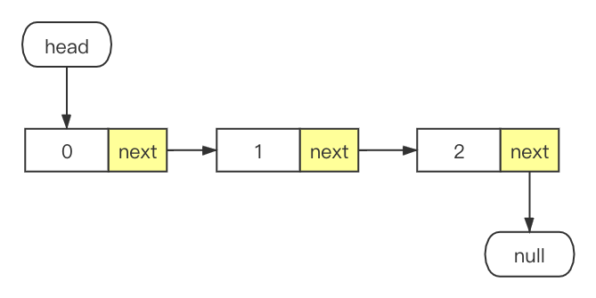

数据结构 - 链表
===

> Create by **jsliang** on **2019-09-05 11:06:43**  
> Recently revised in **2020-03-18 15:06:06**

* 关键词：未完待续
* 早上学习：

1. https://www.zhihu.com/question/350289336/answer/910970733
2. https://mp.weixin.qq.com/s/IzUG8J_DO7BiKkExJESERA
3. https://mp.weixin.qq.com/s/er_VLNWXR48yTB2VsSBd-g
4. https://www.baidu.com/s?ie=UTF-8&wd=%E5%8F%8C%E5%90%91%E9%93%BE%E8%A1%A8%E7%9A%84%E4%BD%9C%E7%94%A8

## <a name="chapter-one" id="chapter-one"></a>一 目录

**不折腾的前端，和咸鱼有什么区别**

| 目录 |
| --- | 
| [一 目录](#chapter-one) | 
| <a name="catalog-chapter-two" id="catalog-chapter-two"></a>[二 前言](#chapter-two) |
| <a name="catalog-chapter-three" id="catalog-chapter-three"></a>[三 简单链表](#chapter-three) |
| &emsp;[3.1 简单链表完整实现](#chapter-three-one) |
| &emsp;[3.2 初识链表结构](#chapter-three-two) |
| &emsp;[3.3 尾部追加：append()](#chapter-three-three) |
| &emsp;[3.4 检查链表：isEmpty()、size()、getHead()、toString()](#chapter-three-four) |
| &emsp;[3.5 定位删除：removeAt()](#chapter-three-five) |
| &emsp;[3.6 定位新增：insert()](#chapter-three-six) |
| &emsp;[3.7 查找位置：indexOf()](#chapter-three-seven) |
| &emsp;[3.8 指定删除：remove()](#chapter-three-eight) |
| <a name="catalog-chapter-four" id="catalog-chapter-four"></a>[四 链表具体实现](#chapter-four) |
| <a name="catalog-chapter-five" id="catalog-chapter-five"></a>[五 双向链表](#chapter-five) |
| <a name="catalog-chapter-six" id="catalog-chapter-six"></a>[六 循环链表（环）](#chapter-six) |
| <a name="catalog-chapter-seven" id="catalog-chapter-seven"></a>[七 总结](#chapter-seven) |
| <a name="catalog-chapter-eight" id="catalog-chapter-eight"></a>[八 参考文献](#chapter-eight) |

## <a name="chapter-two" id="chapter-two"></a>二 前言

> [返回目录](#chapter-one)

* **问**：为什么需要链表？

* **答**：

JavaScript 的 Array（数组）是个万能的数据结构，它有许多的功能作用：

1、当成普通数组来使用：

```js
const array = [10, 20, 30];
console.log(array[0]); // 10
```

2、当成栈来使用：

```js
const stack = [10, 20, 30];
stack.push(40);
stack.pop();
console.log(stack); // [10, 20, 30]
```

3、当成队列来使用：

```js
const queue = [10, 20, 30];
queue.push(40);
queue.shift();
console.log(queue); // [20, 30, 40]
```

4、当做哈希表：

```js
const map = [];
map['id'] = '1';
map['name'] = 'jsliang';
console.log(map); // [ id: '1', name: 'jsliang']
```

它提供了非常 nice 的便利，这样你就不需要关心数据结构了。

所以很多前端刚开始的时候也不需要了解栈、队列、哈希、树等……

你可以用 Array（数组）做非常多的工作，像 **jsliang** 就经常在做 LeetCode 题目的时候，对于树、链表等就直接用 Array（数组）定义。

当然，人总是要成长的，我们肯定要推翻陈旧认知，学习新的观点：

* **我们在使用数组（`[]`）的时候，往中间等地方插入或者移除项的成本很高。**

喔，怎么体现？我们举例 `unshift` 的实现：

> C 源码

```C
int insertion_index = add_position == AT_START ? 0 : length;
// Copy the arguments to the start.
Subclass::CopyArguments(args, backing_store, add_size, 1, insertion_index);
// Set the length.
receiver->set_length(Smi::FromInt(new_length));
```

关于它操作的描述是：

1. `unshift` 的功能是往数组的开始位置插入元素；
2. 首先判断数组容量是否足够存放，如果不够，将容量扩展为老容量的 1.5 倍再加上 16；
3. 然后把老元素移到新的内部空间偏移为 `unshift` 元素个数的位置（即腾出起始的空间放 `unshift` 传进来的元素）；
4. 如果空间足够，那么执行 `memmove` 移动内存空间；
5. 最后再把 `unshift` 传进来的参数 `copy` 到开始的位子。

下面，我们通过实现一个链表和数组进行比较。

> List 的实现与 Array 的比较

```js
function LinkedList() {
  let Node = function(element) {
    this.element = element;
    this.next = null;
  }
  let length = 0;
  let head = null;

  // 向链表尾部添加一个新的项
  this.append = function(element) {
    let node = new Node(element);
    let current;
    if (!head) {
      head = node;
    } else {
      current = head;
      // 循环链表，直到找到最后一项
      while (current.next) {
        current = current.next;
      }
      // 找到最后一项，将其 next 赋为 node，建立链接
      current.next = node;
    }
    length ++;
  };
  // 向链表任意位置插入元素
  this.insert = function(position, element) {
    // 检查越界值
    if (position >= 0 && position <= length) {
      let node = new Node(element),
        current = head,
        previous,
        index = 0;
      if (position === 0) {
        node.next = current;
        head = node;
      } else {
        while (index++ < position) {
          previous = current;
          current = current.next;
        }
        node.next = current;
        previous.next = node;
      }
      length++; // 更新链表的长度
      return;
    } else {
      return false;
    }
  }
}

const linkHeadInsert1 = new LinkedList(); // 链表 1
const arrayHeadInsert1 = []; // 数组 1

console.time('链表头部插入');
for (let i = 0; i < 10000; i++) {
  linkHeadInsert1.insert(0, i);
}
console.timeEnd('链表头部插入');

console.time('数组头部插入');
for (let i = 0; i < 10000; i++) {
  arrayHeadInsert1.unshift(i);
}
console.timeEnd('数组头部插入');

// 对比：
// 链表头部插入: 3.174ms
// 数组头部插入: 7.809ms
// 以上数据为大致数据，并非一层不变

const linkHeadInsert2 = new LinkedList(); // 链表 2
const arrayHeadInsert2 = []; // 数组 2

console.time('链表尾部插入');
for (let i = 0; i < 10000; i++) {
  linkHeadInsert2.append(i);
}
console.timeEnd('链表尾部插入');

console.time('数组尾部插入');
for (let i = 0; i < 10000; i++) {
  arrayHeadInsert2.push(i);
}
console.timeEnd('数组尾部插入');

// 对比
// 链表尾部插入: 153.941ms
// 数组尾部插入: 0.491ms
// 以上数据为大致数据，并非一层不变
```

* 插入时间比较

| 方法 | 位置 | 时间 |
| --- | --- | --- |
| 链表 | 头部 | 3.174ms |
| 数组 | 头部 | 7.809ms |
| 链表 | 尾部 | 153.941ms |
| 数组 | 尾部 | 0.491ms |

看到这里你可能有点懵：哦？你介绍链表不是想说明链表比数组好么？为什么头部插入的时间仅仅比尾部插入快几毫秒，但是尾部插入的时间就慢了上百毫秒？

不可否认，每个事物有其优点必定也有其缺点。

**jsliang** 不会强行解释说后面的双向链表能解决上面尾部插入时间的问题，只是希望小伙伴们看到任何事物的两面性。

就好比没有结论的问题 **Vue 和 React 谁更好** 一样，链表和数组各有千秋，只要这两种事物没有灭绝，那就说明它有存在的必要性。

所以，抱着对新事物的好奇，去探索它，了解它，折腾它。

Here we go~

## <a name="chapter-three" id="chapter-three"></a>三 简单链表

> [返回目录](#chapter-one)

在本章节中，**jsliang** 会通过下面知识点逐步介绍简单链表，让小伙伴能够熟练的使用链表：

1. 初始化链表，`new/this` 的作用
2. 往链表尾部追加元素：`append()`
3. 判断链表状态：`isEmpty()`、`size()`、`getHead()`、`toString()`
4. 删除链表指定位置的元素：`removeAt()`
5. 往链表指定位置新增元素：`insert()`
6. 查找元素在链表中的索引：`indexOf()`
7. 删除链表中指定的元素：`remove()`

在这些内容中，**jsliang** 会挑选一些 LeetCode 题目进行相应的实战演练，让小伙伴不会过于枯燥无聊~

### <a name="chapter-three-one" id="chapter-three-one"></a>3.1 简单链表完整实现

> [返回目录](#chapter-one)

在这之前，我们先在本小节做个标记，方便后面的小伙伴观看复习，或者 “劝退” 一些萌新小伙伴 /手动滑稽 ^_^

> 简单链表完整实现

```js
function LinkedList() {

  let Node = function(element) {
    this.element = element;
    this.next = null;
  }

  let length = 0;
  let head = null;

  // 尾部添加
  this.append = function(element) {
    let node = new Node(element),
      current;
    if (head === null) {
      head = node;
    } else {
      current = head;
      while (current.next) {
        current = current.next;
      }
      current.next = node;
    }
    length++;
  };

  // 向链表的指定位置插入一个新的项
  this.insert = function(position, element) {
    if (position >= 0 && position <= length) {
      let node = new Node(element),
        current = head,
        previous,
        index = 0;
      if (position === 0) {
        node.next = current;
        head = node;
      } else {
        while (index++ < position) {
          previous = current;
          current = current.next;
        }
        node.next = current;
        previous.next = node;
      }
      length++;
      return true;
    } else {
      return null;
    }
  };

  // 根据传入的位置从链表的指定位置移除一项
  this.removeAt = function(position) {
    if (position > -1 && position < length) {
      let current = head,
        previous,
        index = 0;
      if (position === 0) {
        head = current.next;
      } else {
        while (index++ < position) {
          previous = current;
          current = current.next;
        }
        previous.next = current.next;
      }
      length--;
      return current.element;
    } else {
      return null;
    }
  };

  // 根据传入的值从链表移除一项
  this.remove = function(element) {
    return this.removeAt(this.indexOf(element));
  };
  
  // 返回元素在链表中的索引，如果链表中没有该元素则返回 -1
  this.indexOf = function(element) {
    let current = head,
      index = 0;
    while (current) {
      if (current.element === element) {
        return index;
      }
      current = current.next;
      index++;
    }
    return -1;
  };
  
  // 如果链表中不包含任何元素，返回 true，如果链表长度大于 0 则返回 false
  this.isEmpty = function() {
    return length === 0;
  };
  
  // 返回链表包含的元素个数，与数组的 length 属性类似
  this.size = function() {
    return length;
  };
  
  // 返回头部
  this.getHead = function() {
    return head;
  };
  
  // 重写继承自 JavaScript 对象默认的 toString() 方法，让其只输出元素的值
  this.toString = function() {
    let current = head,
      string = '';
    while (current) {
      string += current.element + (current.next ? '#' : '');
      current = current.next;
    }
    return string;
  };
  
  // 查看当前链表
  this.print = function() {
    console.log(head);
  };
}

const link = new LinkedList();

link.append(0);
link.print(); // Node { element: 0, next: null }
```

请牢记一句话：如果坚持学下来了，你会发现这些内容真的没想象的那么难。—— 来自跟着教程敲完代码的 **jsliang**。

> 同为普通人，谁先受不住谁先离开，欲带皇冠必受其重

### <a name="chapter-three-two" id="chapter-three-two"></a>3.2 初识链表结构

> [返回目录](#chapter-one)

下面 **jsliang** 会通过 *自以为* 比较详细的说法来阐述链表，如果小伙伴已经具备一些基础，可以快速阅览或者直接跳到下一小节阅读。

---

众所周知，JavaScript 中有传值和传址一说法。

在这里先简单讲一下 **jsliang** 对传值和传址的理解：

* `String`、`Number` 等是单身汉。假设张三它兜里有钱为 `1`，李四说 “俺也一样”，然后 `李四 = 张三`；接着张三的钱被偷了，这时候李四这二货就回 “俺不一样”。

```js
let zhangsanMoney = 1;
let lisiMoney = zhangsanMoney;

zhangsanMoney = 0; // 被偷了
console.log(lisiMoney === zhangsanMoney); // false
```

* `Array`、`Object` 为家庭。假设张三和李四是一家，金库为 `[1]`，这时候张三挣了 2 块钱，家里金库变成了：`[1, 2]`，李四这二货就会无耻地来一句 “俺也一样”，因为你家就是我家，我家也是 `[1, 2]` 了。

```js
// 一家人的地址相同
let zhangsanMoney = [1];
let lisiMoney = zhangsanMoney;
zhangsanMoney.push(2);

console.log(zhangsanMoney); // [1, 2]
console.log(lisiMoney); // [1, 2]
```

这时候，如果张三受不了李四，要出去打工，那就要更换地址（更换家）。

如果张三拿到第三桶金，那么张三的金库就为：`[1, 2, 3]`，而李四还是：`[1, 2]`

```js
// 一家人的地址相同
let zhangsanMoney = [1];
lisiMoney = zhangsanMoney;
zhangsanMoney.push(2);

// 更换地址
zhangsanMoney = [1, 2, 3];

console.log(zhangsanMoney); // [1, 2, 3]
console.log(lisiMoney); // [1, 2]
```

当然，不排除李四跟着张三跑到同一个地方打工，然后……（感觉 **jsliang** 可以据此写一部小说了，哈哈）

---

OK，了解传值和传址，那么我们看下链表：

> Object 模拟链表

```js
const linkedList = {
  element: 0,
  next: {
    element: 1,
    next: {
      element: 2,
      next: null,
    },
  },
};
```

用图表示就是：



通过上面的代码和图，我们应该可以产生一个大致的形象：

* 链表就是通过 `next` 不断指向下一个节点，并且最终点为 `null` 的数据结构。

> 仅仅是简单链表，循环链表的终点

那么，我们可以根据这个印象，开始接触如何构造一个链表的基础：

> index.js

```js
function LinkedList() {
  /**
   * @name Node
   * @description 要加入链表的项，通过 Node 类实现
   * @param {any} element 生成新节点的元素
   * @return
   *  element：要添加到链表的值
   *  next：指向链表下一个节点项的指针
   */
  let Node = function(element) {
    this.element = element;
    this.next = null;
  }

  let length = 0; // 存储链表长度
  let head = null; // 存储链表第一个节点的引用

  // 方法：向链表尾部添加一个新的项
  // 这里仅仅是缩略版，只能有一个长度
  this.append = function(element) {
    let node = new Node(element);
    head = node;
  }

  // 方法：打印链表
  this.print = function(element) {
    console.log(head);
  }
}

const linkedList = new LinkedList();

linkedList.append(1);
linkedList.print();
```

在我们实现链表的过程中，我们需要先了解到它做了什么：

* 首先，定义一个 `Node` 类。
* 然后，它有两个元素：`element` 和 `next`。
* 其中，`element` 指向传入的元素，这个元素可以是字符串、数字、数组等；
* 其中，`next` 表示新节点指向的下一个元素，默认设置为 `null` 表示它的下一个节点是空。这在我们初始化链表的时候尤为重要。
* 最后，我们在 `append()` 等方法中通过 `new Node(element)` 的方式生成新的节点，并通过 `print()` 将链表打印了出来。

通过 `node index.js`，我们查看下控制台会输出什么？

```js
// head
Node {
  element: 1,
  next: null,
}
```

很好，这很符合我们的预期：

* 我们先将它打造出来，然后用它来解决各种问题。

当然，再继续下面话题之前，希望你对下面两个问题不存在疑惑：

1. `new 的作用？`
2. `this 的指向？`

### <a name="chapter-three-three" id="chapter-three-three"></a>3.3 尾部追加：append()

> [返回目录](#chapter-one)

```js
function LinkedList() {
  /**
   * @name Node类
   * @description 要加入链表的项，通过 Node 类实现
   * @param {any} element 需要添加的元素
   * @return
   * element：要添加到链表的值
   * next：指向链表下一个节点项的指针
   */
  let Node = function(element) {
    this.element = element;
    this.next = null;
  }

  let length = 0; // 存储链表长度
  let head = null; // 存储链表第一个节点的引用

  /**
   * @name append()
   * @description 向链表尾部添加一个新的项
   */
  this.append = function(element) {
    let node = new Node(element),
      current;

    // 链表中第一个节点
    if (head === null) {
      head = node;
    } else {
      current = head;

      // 循环链表，直到找到最后一项
      while (current.next) {
        current = current.next;
      }

      // 找到最后一项，将其 next 赋为 node，建立链接
      current.next = node;
    }

    // 更新链表的长度
    length++;

    console.log(head);
  };
}

const link = new LinkedList();
link.append('1');
link.append('2');
```

在这份代码中，我们大致分为 个步骤：

1. 首先设定两个变量：`node` 和 `current`。其中 `node` 用来初始化新添加的节点，`current` 用来表示当前的链表。（为什么不选择直接使用 `head` 进行操作？因为下面我们会对 `current` 进行迭代，重新赋值，如果使用 `head` 则会让它变形）
2. 判断：如果 `head` 是 `null`，表示它一个节点都没有，这时候我们直接将初始化的新节点赋值给 `head` 即可。
3. 判断：如果 `head` 不是 `null`，我们则进一步操作。
   1. 设置 `current` 为 `head`，我们将其当成一个工具人（过渡者）。
   2. 不停迭代 `current`，找到它的最后一项。（千万别忘记我们设置的 `head` 最后的节点必定是 `null`）
   3. 将 `current` 的 `next` 指向新生成的 `node`，这样新节点就添加到了链表尾部。
4. 最后，将链表的长度更新，并且打印出 `head` 让用户更清晰了解。

在这个方法中，**jsliang** 估计较有难度的应该是第 3 步，在这个步骤中，最难的应该是 `current` 的追逐，你会发现它不断跑啊跑，跑到最后添加了个节点，然后 `head` 就加了个尾节点。

但是这也仅仅是 “稍微” 复杂，如果不甚理解，下面我们会通过几道 LeetCode 简单难度题目，快速了解这种迭代式方法。

* 题目地址：【LeetCode】https://leetcode-cn.com/problems/reverse-linked-list/
* 题目内容：

```
反转一个单链表。

示例:

输入: 1->2->3->4->5->NULL
输出: 5->4->3->2->1->NULL

进阶:
你可以迭代或递归地反转链表。你能否用两种方法解决这道题？
```

* 题解：

碰到问题不要慌，要相信我们是有操作的，来，跟着我把编辑器打开~

> index.js

```js
function LinkedList() {
  let Node = function(element) {
    this.element = element;
    this.next = null;
  }

  let length = 0;
  let head = null;

  this.append = function(element) {
    let node = new Node(element),
      current;
    if (head === null) {
      head = node;
    } else {
      current = head;
      while (current.next) {
        current = current.next;
      }
      current.next = node;
    }
    length++;
  };

  this.getHead = function() {
    return head;
  }
}

const link = new LinkedList();

for (let i = 0; i <= 5; i++) {
  link.append(i);
}

console.log(link.getHead());

// LeetCode 给定函数体
// var reverseList = function(head) {
  
// };
```

在上面代码中，我们实现了一个链表：`1->2->3->4->5->NULL`，如果你通过 `node inex.js` 上面的代码可以看到：

```js
Node {
  element: 1,
  next: Node {
    element: 2,
    next: Node {
      element: 3,
      next: Node {
        element: 4,
        next: Node {
          element: 5,
          next: null,
        },
      },
    },
  },
}
```

此时你根据浏览器或者编译器的返回，对照代码，好好看几遍，应该就清楚 `append` 的作用了。

> 实在不行你可以通过代码断点调试来查看数据

OK 我们继续解题：

> LeetCode 给定函数体

```js
/**
 * Definition for singly-linked list.
 * function ListNode(val) {
 *     this.val = val;
 *     this.next = null;
 * }
 */
/**
 * @param {ListNode} head
 * @return {ListNode}
 */
var reverseList = function(head) {

};
```

在 LeetCode 给出的内容上我们可以看出，它已经帮我们实现了链表（这篇文章上我们自己实现了，所以知道实现的方式）。

并且，LeetCode 已经将 `head` 传入给我们了，所以我们仅仅需要将其反转功能实现出来就行了：

> 迭代

```js
const head = link.getHead();

var reverseList = function(head) {
  // 1. 为空或者仅有一个节点，直接返回 head
  if (head === null || head.next === null) {
    return head;
  }
  // 2. 设置 current 和 previous
  var current = head,
    previous = null,
    next;
  // 3. 迭代遍历
  while (current !== null) {
    next = current.next;
    current.next = previous;
    previous = current;
    current = next;
  }
  return previous;
};

console.log(reverseList(head));
```

然后你会发现它打印出来结果：

> Console

```
Node {
  element: 5,
  next: Node {
    element: 4,
    next: Node {
      element: 3,
      next: Node {
        element: 2,
        next: Node {
          element: 1,
          next: null,
        },
      },
    },
  },
}
```

> 注意：这时候你应该将代码贴到控制台，尝试断点或者通过 `console.log` 打印查看数据流向。

也许你看到这里，你有点想点击【X】关闭文章了，但是，请忽略此时的懵圈继续往下看，因为这有可能是 **jsliang** 距离不当，下面会尝试通过不同题目进行逐一讲解。

### <a name="chapter-three-four" id="chapter-three-four"></a>3.4 检查链表：isEmpty()、size()、getHead()、toString()

> [返回目录](#chapter-one)

```js
function LinkedList() {
  /**
   * @name Node类
   * @description 要加入链表的项，通过 Node 类实现
   * @param {any} element 需要添加的元素
   * @return
   *  element：要添加到链表的值
   *  next：指向链表下一个节点项的指针
   */
  let Node = function(element) {
    this.element = element;
    this.next = null;
  }

  let length = 0; // 存储链表长度
  let head = null; // 存储链表第一个节点的引用

  /**
   * @name append()
   * @description 向链表尾部添加一个新的项
   */
  this.append = function(element) {
    let node = new Node(element),
      current;

    // 链表中第一个节点
    if (head === null) {
      head = node;
    } else {
      current = head;

      // 循环链表，直到找到最后一项
      while (current.next) {
        current = current.next;
      }

      // 找到最后一项，将其 next 赋为 node，建立链接
      current.next = node;
    }

    // 更新链表的长度
    length++;
  };

  /**
   * @name insert()
   * @description 向链表的指定位置插入一个新的项
   */
  this.insert = function(position, element) {
    // 判定界限 [0, length]
    if (position >= 0 && position <= length) {
      let node = new Node(element),
        current = head,
        previous,
        index = 0;

      // 在第一个位置添加
      if (position === 0) {
        node.next = current;
        head = node;
      } else {
        while (index++ < position) {
          previous = current;
          current = current.next;
        }
        // 设置链表
        node.next = current;
        previous.next = node;
      }
      length++; // 更新链表的长度
      return true;
    } else {
      return null;
    }
  };

  /**
   * @name removeAt()
   * @description 根据传入的位置从链表的指定位置移除一项
   */
  this.removeAt = function(position) {

    // 检查越界值
    if (position > -1 && position < length) {

      let current = head,
        previous,
        index = 0;
      
      // 移除第一项
      if (position === 0) {
        head = current.next;
      } else {
        while (index++ < position) {
          previous = current;
          current = current.next;
        }

        // 将 previous 与 current 的下一项结合起来
        // 因为它们事实上还是 head 的代言人（传址）
        // 所以可以跳过 current，从而移除它
        previous.next = current.next;
      }

      length--;

      return current.element;
    } else {
      return null;
    }
  };

  /**
   * @name remove()
   * @description 根据传入的值从链表移除一项
   */
  this.remove = function(element) {

  };
  
  /**
   * @name indexOf()
   * @description 返回元素在链表中的索引，如果链表中没有该元素则返回 -1
   */
  this.indexOf = function(element) {

  };
  
  /**
   * @name isEmpty()
   * @description 如果链表中不包含任何元素，返回 true，如果链表长度大于 0 则返回 false
   */
  this.isEmpty = function() {

  };
  
  /**
   * @name size()
   * @description 返回链表包含的元素个数，与数组的 length 属性类似
   */
  this.size = function() {

  };
  
  /**
   * @name getHead()
   * @description 返回头部
   */
  this.getHead = function() {
    return head;
  };
  
  /**
   * @name toString()
   * @description 重写继承自 JavaScript 对象默认的 toString() 方法，让其只输出元素的值
   */
  this.toString = function() {
    let current = head,
      string = '';

    while (current) {
      string += current.element + (current.next ? '#' : '');
      current = current.next;
    }

    return string;
  };
  
  /**
   * @name print()
   * @description 查看当前链表
   */
  this.print = function() {
    console.log(head);
  };
}

const link = new LinkedList();

// 添加链表内容
link.append(0);
link.append(1);
link.append(2);
link.print();
/*
Node {
  element: 0,
  next:
    Node {
      element: 1,
      next: Node {
        element: 2,
        next: null,
      },
    },
  }
*/

// 移除链表
link.removeAt(1);
link.print();
/*
Node {
  element: 0,
  next: Node {
    element: 2,
    next: null,
  },
}
*/

// 插入元素
link.insert(1, 1);
link.print();
/*
Node {
  element: 0,
  next:
    Node {
      element: 1,
      next: Node {
        element: 2,
        next: null,
      },
    },
  }
*/

// 将 List 转为字符串
console.log(link.toString());
```

### <a name="chapter-three-five" id="chapter-three-five"></a>3.5 定位删除：removeAt()

> [返回目录](#chapter-one)

```js
function LinkedList() {
  /**
   * @name Node类
   * @description 要加入链表的项，通过 Node 类实现
   * @param {any} element 需要添加的元素
   * @return
   *  element：要添加到链表的值
   *  next：指向链表下一个节点项的指针
   */
  let Node = function(element) {
    this.element = element;
    this.next = null;
  }

  let length = 0; // 存储链表长度
  let head = null; // 存储链表第一个节点的引用

  /**
   * @name append()
   * @description 向链表尾部添加一个新的项
   */
  this.append = function(element) {
    let node = new Node(element),
      current;

    // 链表中第一个节点
    if (head === null) {
      head = node;
    } else {
      current = head;

      // 循环链表，直到找到最后一项
      while (current.next) {
        current = current.next;
      }

      // 找到最后一项，将其 next 赋为 node，建立链接
      current.next = node;
    }

    // 更新链表的长度
    length++;
  };

  /**
   * @name insert()
   * @description 向链表的指定位置插入一个新的项
   * @param {number} 需要插入的位置
   * @param {any} 需要插入的元素
   */
  this.insert = function(position, element) {

  };

  /**
   * @name removeAt()
   * @description 根据传入的位置从链表的指定位置移除一项
   */
  this.removeAt = function(position) {

    // 检查越界值
    if (position > -1 && position < length) {

      let current = head,
        previous,
        index = 0;
      
      // 移除第一项
      if (position === 0) {
        head = current.next;
      } else {
        while (index++ < position) {
          previous = current;
          current = current.next;
        }

        // 将 previous 与 current 的下一项结合起来
        // 因为它们事实上还是 head 的代言人（传址）
        // 所以可以跳过 current，从而移除它
        previous.next = current.next;
      }

      length--;

      return current.element;
    } else {
      return null;
    }
  };

  /**
   * @name remove()
   * @description 根据传入的值从链表移除一项
   */
  this.remove = function(element) {

  };
  
  /**
   * @name indexOf()
   * @description 返回元素在链表中的索引，如果链表中没有该元素则返回 -1
   */
  this.indexOf = function(element) {

  };
  
  /**
   * @name isEmpty()
   * @description 如果链表中不包含任何元素，返回 true，如果链表长度大于 0 则返回 false
   */
  this.isEmpty = function() {

  };
  
  /**
   * @name size()
   * @description 返回链表包含的元素个数，与数组的 length 属性类似
   */
  this.size = function() {

  };
  
  /**
   * @name getHead()
   * @description 返回头部
   */
  this.getHead = function() {
    return head;
  };
  
  /**
   * @name toString()
   * @description 重写继承自 JavaScript 对象默认的 toString() 方法，让其只输出元素的值
   */
  this.toString = function() {
    
  };
  
  /**
   * @name print()
   * @description 查看当前链表
   */
  this.print = function() {
    console.log(head);
  };
}

const link = new LinkedList();

// 添加链表内容
link.append('1');
link.append('2');
link.append('3');
link.print();
/*
Node {
  element: '1',
  next:
    Node {
      element: '2',
      next: Node {
        element: '3',
        next: null,
      },
    },
  }
*/

// 移除链表
link.removeAt(1);
link.print();
/*
Node {
  element: '1',
  next: Node {
    element: '3',
    next: null,
  },
}
*/
```

> `index++` 和 `++index` 的区别，希望小伙伴能自行查找下。简单来说，`index++ < position` 的时候，此时拿的是自增前的值和 `position` 进行比较；当 `++index < position` 的时候，此时拿的是自增后的值和 `position` 进行比较。

删除步骤：

1. 判断是否越界，删除的范围在 `[0, length)` 之间。
2. 设置两个指针 `current` 和 `previous` 来进行链表前进的模拟，`index` 来表示挪动的位置。
3. 假设存在链表为：`0->1->2->Null`。
4. 当我们需要删除第 0 项的时候，我们直接设置 `head = current.next` 即可。
5. 当我们需要删除第 1 项的时候，实际上我们应该建立 `0` 和 `2` 的链接，所以我们先执行一步 `while`，进行指针的移动，执行完毕后 `index === 1`，所以下一次 `while (index++ < position) {}` 不成立，跳转到 `previous.next = current.next` 执行语句，直接建立 `0` 和 `2` 的链接。

如果步骤 5 小伙伴看蒙圈了，咱们可以直接查看原数据的改变：

> 数据变化流程 1 - 原数据

```js
{
  index: 0,
  current: Node {
    element: 0,
    next: Node {
      element: 1,
      next: Node {
        element: 2,
        next: null,
      },
    },
  },
  previous: undefined
}
```
> 数据变化流程 2 - 执行第一次后

```js
{
  index: 1,
  current: Node {
    element: 1,
    next: Node {
      element: 2,
      next: null,
    },
  },
  previous: Node {
    element: 0,
    next: Node {
      element: 1,
      next: Node {
        element: 2,
        next: null,
      },
    },
  },
}
```

> 数据变化流程 3 - 退出 while 后

```js
// previous.next = current.next;
{
  index: 1,
  current: Node {
    element: 1,
    next: Node {
      element: 2,
      next: null,
    },
  },
  previous: Node {
    element: 0,
    next: Node {
      element: 2,
      next: null,
    },
  },
}
```

当然，实际上这时候应该进行调试，方便小伙伴们查看数据的变化（欠你们一个调试视频）。

### <a name="chapter-three-six" id="chapter-three-six"></a>3.6 定位新增：insert()

> [返回目录](#chapter-one)

当小伙伴耐着性子看到这一节的时候，希望小伙伴能跟着 **jsliang** 的步伐将 `insert` 方法实现：

> insert()

```js
  /**
   * @name insert()
   * @description 向链表的指定位置插入一个新的项
   * @param {number} 需要插入的位置
   * @param {any} 需要插入的元素
   */
  this.insert = function(position, element) {

  }
```

```js
function LinkedList() {
  /**
   * @name Node类
   * @description 要加入链表的项，通过 Node 类实现
   * @param {any} element 需要添加的元素
   * @return
   *  element：要添加到链表的值
   *  next：指向链表下一个节点项的指针
   */
  let Node = function(element) {
    this.element = element;
    this.next = null;
  }

  let length = 0; // 存储链表长度
  let head = null; // 存储链表第一个节点的引用

  /**
   * @name append()
   * @description 向链表尾部添加一个新的项
   */
  this.append = function(element) {
    let node = new Node(element),
      current;

    // 链表中第一个节点
    if (head === null) {
      head = node;
    } else {
      current = head;

      // 循环链表，直到找到最后一项
      while (current.next) {
        current = current.next;
      }

      // 找到最后一项，将其 next 赋为 node，建立链接
      current.next = node;
    }

    // 更新链表的长度
    length++;
  };

  /**
   * @name insert()
   * @description 向链表的指定位置插入一个新的项
   * @param {number} 需要插入的位置
   * @param {any} 需要插入的元素
   */
  this.insert = function(position, element) {
    // 判定界限 [0, length]
    if (position >= 0 && position <= length) {
      let node = new Node(element),
        current = head,
        previous,
        index = 0;

      // 在第一个位置添加
      if (position === 0) {
        node.next = current;
        head = node;
      } else {
        while (index++ < position) {
          previous = current;
          current = current.next;
        }
        // 设置链表
        node.next = current;
        previous.next = node;
      }
      length++; // 更新链表的长度
      return true;
    } else {
      return null;
    }
  };

  /**
   * @name removeAt()
   * @description 根据传入的位置从链表的指定位置移除一项
   */
  this.removeAt = function(position) {

    // 检查越界值
    if (position > -1 && position < length) {

      let current = head,
        previous,
        index = 0;
      
      // 移除第一项
      if (position === 0) {
        head = current.next;
      } else {
        while (index++ < position) {
          previous = current;
          current = current.next;
        }

        // 将 previous 与 current 的下一项结合起来
        // 因为它们事实上还是 head 的代言人（传址）
        // 所以可以跳过 current，从而移除它
        previous.next = current.next;
      }

      length--;

      return current.element;
    } else {
      return null;
    }
  };

  /**
   * @name remove()
   * @description 根据传入的值从链表移除一项
   */
  this.remove = function(element) {

  };
  
  /**
   * @name indexOf()
   * @description 返回元素在链表中的索引，如果链表中没有该元素则返回 -1
   */
  this.indexOf = function(element) {

  };
  
  /**
   * @name isEmpty()
   * @description 如果链表中不包含任何元素，返回 true，如果链表长度大于 0 则返回 false
   */
  this.isEmpty = function() {

  };
  
  /**
   * @name size()
   * @description 返回链表包含的元素个数，与数组的 length 属性类似
   */
  this.size = function() {

  };
  
  /**
   * @name getHead()
   * @description 返回头部
   */
  this.getHead = function() {
    return head;
  };
  
  /**
   * @name toString()
   * @description 重写继承自 JavaScript 对象默认的 toString() 方法，让其只输出元素的值
   */
  this.toString = function() {
    
  };
  
  /**
   * @name print()
   * @description 查看当前链表
   */
  this.print = function() {
    console.log(head);
  };
}

const link = new LinkedList();

// 添加链表内容
link.append(0);
link.append(1);
link.append(2);
link.print();
/*
Node {
  element: 0,
  next:
    Node {
      element: 1,
      next: Node {
        element: 2,
        next: null,
      },
    },
  }
*/

// 移除链表
link.removeAt(1);
link.print();
/*
Node {
  element: 0,
  next: Node {
    element: 2,
    next: null,
  },
}
*/

// 插入元素
link.insert(1, 1);
link.print();
/*
Node {
  element: 0,
  next:
    Node {
      element: 1,
      next: Node {
        element: 2,
        next: null,
      },
    },
  }
*/
```

如果小伙伴搞通了删除的逻辑，那么新增也不会头晕：

1. 设置边界值 `[0, length]`。
2. 设置 `node = new Node(element)` 来表示需要添加的元素。
3. 设置双指针 `current` 以及 `previous`，以及起始索引值 `index = 0`。
4. 如果需要在第一个位置添加，那么设置 `node` 节点的下一项为 `current`，并且将 `head` 重新指向到 `node` 即可。
5. 如果需要在其他位置添加，那么让 `previous` 和 `current` 分别设置为链表的前后节点，在我们跑到新的 `index` 位置的时候，我们将 `node` 的 `next` 指向 `current`，将 `previous` 的 `next` 指向 `node`，即：`previous -> node -> current`，从而拼装出一个新的链表。

### <a name="chapter-three-seven" id="chapter-three-seven"></a>3.7 查找位置：indexOf()

> [返回目录](#chapter-one)

### <a name="chapter-three-eight" id="chapter-three-eight"></a>3.8 指定删除：remove()

> [返回目录](#chapter-one)

## <a name="chapter-five" id="chapter-five"></a>五 双向链表

> [返回目录](#chapter-one)

```js
function DoubleLinkedList() {
  let Node = function(element) {
    this.element = element;
    this.next = null;
    this.prev = null;
  };

  let length = 0;
  let head = null;
  let tail = null;

  // 插入元素
  this.insert = function(position, element) {

    // 检查边界值
    if (position >= 0 && position <= length) {
      let node = new Node(element),
        current = head,
        previous,
        index = 0;
      
      // 在第一个位置添加
      if (position === 0) {
        if (!head) {
          head = node;
          tail = node;
        } else {
          node.next = current;
          current.prev = node;
          head = node;
        }
      } else if (position === length) { // 最后一项
        current = tail;
        current.next = node;
        node.prev = current;
        tail = node;
      } else {
        while (index++ < position) {
          previous = current;
          current = current.next;
        }
        node.next = current;
        previous.next = node;
        
        current.prev = node;
        node.prev = previous;
      }

      length++; // 更新链表的长度

      return true;
    } else {
      return false;
    }
  }

  // 移除元素
  this.removeAt = function(position) {
    
    // 检查边界值
    if (position >= 0 && position < length) {
      
      let current = head,
        previous,
        index = 0;
      
      // 移除第一项
      if (position === 0) {
        head = current.next;

        // 如果只有一项，更新 tail
        if (length === 1) {
          tail = null;
        } else {
          head.prev = null;
        }
      } else if (position === length - 1) { // 最后一项
        current = tail;
        tail = current.prev;
        tail.next = null;
      } else {
        while (index++ < position) {
          previous = current;
          current = current.next;
        }

        // 将 previous 与 current 的下一项链接起来，从而跳过 current
        previous.next = current.next;
        current.next.prev = previous;
      }

      length--; // 更新链表长度
      return current.element;
    } else {
      return null;
    }
  }

  // 查看元素
  this.print = function() {
    console.log(head);
  }
}

let doubleLinked = new DoubleLinkedList();

// 新增
doubleLinked.insert(0, '0');
doubleLinked.insert(1, '1');
doubleLinked.insert(2, '2');
doubleLinked.print();
/*
Node {
  element: '0',
  next:
   Node {
     element: '1',
     next: Node { element: '2', next: null, prev: [Circular] },
     prev: [Circular] },
  prev: null }
*/

// 删除
doubleLinked.removeAt(1);
doubleLinked.print();
/*
Node {
  element: '0',
  next: Node { element: '2', next: null, prev: [Circular] },
  prev: null }
*/
```

## <a name="chapter-six" id="chapter-six"></a>六 循环链表（环）

> [返回目录](#chapter-one)

```js
let Ring = function() {
  let Node = function(element) {
    this.element = element;
    this.next = null;
  }

  let head = null,
    current = head,
    index = 0,
    length = 0;
  
  // 添加元素
  this.append = function(element) {
    let node = new Node(element);

    if (!head) {
      current = node;
      current.next = node;
      head = current;
    } else {
      while (index++ < length) {
        current = current.next;
      }
      node.next = head;
      current.next = node;
    }

    length++; // 更新环的长度
    index = length - 1;
  }

  // 打印元素
  this.print = function() {
    console.log(head);
  }
}

const ring = new Ring();

ring.append('0');
ring.append('1');
ring.append('2');
ring.print();
```

## <a name="chapter-seven" id="chapter-seven"></a>七 总结

> [返回目录](#chapter-one)

现在，学完上面的简单链表、双向链表以及循环链表（环），你会不会大吼一声：“还有谁！”

enm...还真有：双向循环链表……彭，**jsliang** 被小伙伴群殴成饼~

当然，这里咱就不吱声了好吧，相信有上面 3 个链表的知识点，足于支撑小伙伴自己造一个双向循环链表了。

在 **jsliang** 看来，探索学习完上面的内容是丰富且含有乐趣的，在了解简单链表的 `append()` 和 `removeAt()` 之后，下面的内容 **jsliang** 是尝试自己敲出来的（在知道需要实现功能的前提下），因为它的确不难（基于我的 200 多道 LeetCode 题经验来说）。

那么，如果小伙伴兴致勃勃，尚未过瘾，可以和 **jsliang** 一样挑战下下面的题目，完善下自己关于链表的知识点：

> 内容太多就不列举在这篇文章中，而是写在 LeetCode 题解库中，可以点击查看 **jsliang** 的题解。

1. ……
2. ……
3. ……
4. ……
5. ……
6. ……
7. ……
8. ……
9. ……
10. ……

那么，链表内容到此为止，我们挑战的题目会逐渐增多，如果小伙伴发现一些题目不懂或者对 **jsliang** 在题目上的讲解不清楚，欢迎评论留言或者私聊。

* GitHub：仓库首页可以找到微信号
* 掘金：可以找到 GitHub
* 公众号；请点击【查看原文】找到 GitHub

## <a name="chapter-eight" id="chapter-eight"></a>八 参考文献

> [返回目录](#chapter-one)

* [从 Chrome 源码看 JS Array 的实现](https://zhuanlan.zhihu.com/p/26388217)

---

**不折腾的前端，和咸鱼有什么区别！**


**jsliang** 会每天更新一道 LeetCode 题解，从而帮助小伙伴们夯实原生 JS 基础，了解与学习算法与数据结构。

**浪子神剑** 会每天更新面试题，以面试题为驱动来带动大家学习，坚持每天学习与思考，每天进步一点！

扫描上方二维码，关注 **jsliang** 的公众号（左）和 **浪子神剑** 的公众号（右），让我们一起折腾！

> <a rel="license" href="http://creativecommons.org/licenses/by-nc-sa/4.0/"></a><br /><span xmlns:dct="http://purl.org/dc/terms/" property="dct:title">jsliang 的文档库</span> 由 <a xmlns:cc="http://creativecommons.org/ns#" href="https://github.com/LiangJunrong/document-library" property="cc:attributionName" rel="cc:attributionURL">梁峻荣</a> 采用 <a rel="license" href="http://creativecommons.org/licenses/by-nc-sa/4.0/">知识共享 署名-非商业性使用-相同方式共享 4.0 国际 许可协议</a>进行许可。<br />基于<a xmlns:dct="http://purl.org/dc/terms/" href="https://github.com/LiangJunrong/document-library" rel="dct:source">https://github.com/LiangJunrong/document-library</a>上的作品创作。<br />本许可协议授权之外的使用权限可以从 <a xmlns:cc="http://creativecommons.org/ns#" href="https://creativecommons.org/licenses/by-nc-sa/2.5/cn/" rel="cc:morePermissions">https://creativecommons.org/licenses/by-nc-sa/2.5/cn/</a> 处获得。