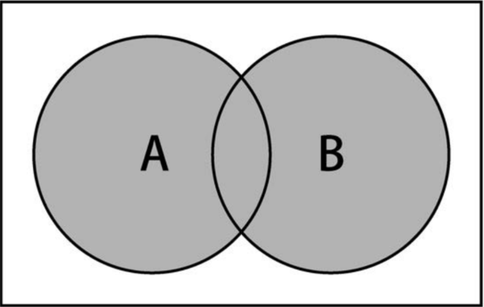
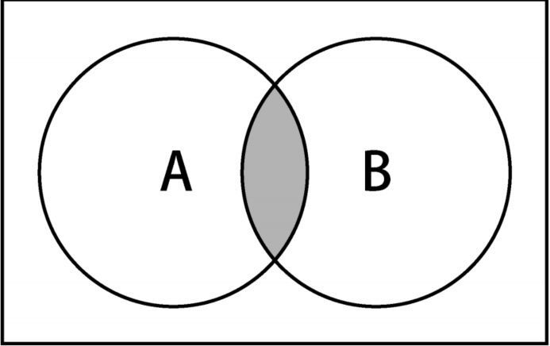
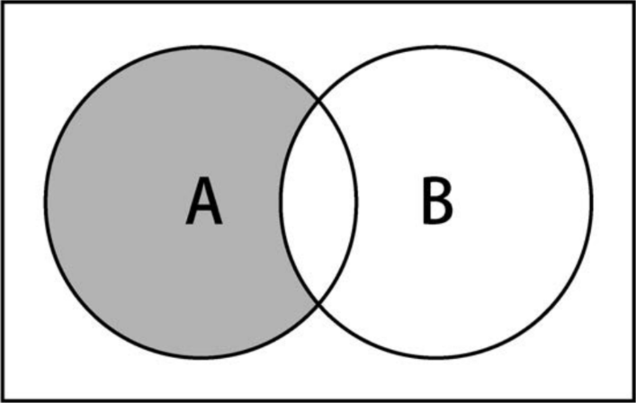
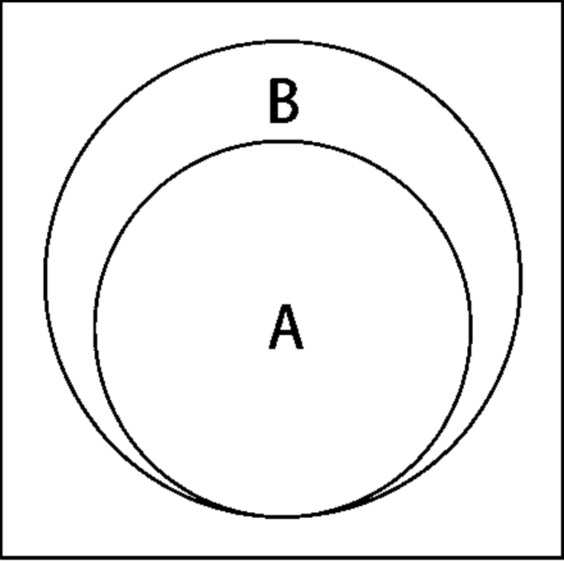

数据结构 - 集合
===

> Create by **jsliang** on **2019-09-05 11:07:17**  
> Recently revised in **2020-3-22 17:35:55**

## <a name="chapter-one" id="chapter-one"></a>一 目录

**不折腾的前端，和咸鱼有什么区别**

| 目录 |
| --- | 
| [一 目录](#chapter-one) | 
| <a name="catalog-chapter-two" id="catalog-chapter-two"></a>[二 前言](#chapter-two) |
| <a name="catalog-chapter-three" id="catalog-chapter-three"></a>[三 JS 仿造 Set](#chapter-three) |
| &emsp;[3.1 仿造 Set 完整实现](#chapter-three-one) |
| &emsp;[3.2 has()](#chapter-three-two) |
| &emsp;[3.3 add()、remove()](#chapter-three-three) |
| &emsp;[3.4 clear()、size()、values()](#chapter-three-four) |
| &emsp;[3.5 union()](#chapter-three-five) |
| &emsp;[3.6 intersection()](#chapter-three-six) |
| &emsp;[3.7 difference()](#chapter-three-seven) |
| &emsp;[3.8 subset()](#chapter-three-eight) |
| &emsp;[3.9 symmetricDifference()](#chapter-three-night) |
| <a name="catalog-chapter-four" id="catalog-chapter-four"></a>[四 ES6 扩展 Set](#chapter-four) |
| <a name="catalog-chapter-five" id="catalog-chapter-five"></a>[五 LeetCode 刷题](#chapter-five) |
| <a name="catalog-chapter-six" id="catalog-chapter-six"></a>[六 总结](#chapter-six) |
| <a name="catalog-chapter-seven" id="catalog-chapter-seven"></a>[七 参考文献](#chapter-seven) |

## <a name="chapter-two" id="chapter-two"></a>二 前言

> [返回目录](#chapter-one)

无论是在 LeetCode 的刷题过程中，异或是工作过程中，我们都会使用到 ES6 的 `Set`，这个关于集合操作的数据结构。

谈起集合，我们应该会想到：

* 班级
* 种类
* ……

在集合中，它的特点就是 **不允许值重复**。

在班级里，每一个个体都是不同的；在种类中，每个种类有各自的特点……

所以，在 JavaScript 中：

* **集合是一种不允许值重复存在的顺序数据结构**。

在这里，我们会学到各种操作：

* 创建集合
* 给集合添加值
* 移除集合中的值
* 搜索集合值是否存在
* 操作集合：并集、交集、差集等

那么，Here we go~

## <a name="chapter-three" id="chapter-three"></a>三 JS 仿造 Set

> [返回目录](#chapter-one)

什么是集合？

集合是由一组无序且唯一（即不能重复）的项组成的。

这个数据结构使用了与有限集合相同的数学概念，但应用到计算机科学的数据结构中。

* 自然数集合：`N = {0, 1, 2, 3, 4, 5, ...}`
* 空集：`N = {}`

像上面，我们就看到两种集合。

### <a name="chapter-three-one" id="chapter-three-one"></a>3.1 仿造 Set 完整实现

> [返回目录](#chapter-one)

如果我们在 Chrome 浏览器控制台中敲下：

```js
const set = new Set();
set.add(1);
```

然后就会看到弹出：

```js
Set() {
  size: 1,
  __proto: Set {
    add: f add()
    clear: f clear()
    constructro(): f Set()
    delete: f delete()
    entries: f entries()
    forEach: f forEach()
    has: f has()
    keys: f values()
    size: 1
    values: f values()
    ...
  }
  [[Entries]]: Array(1)
}
```

可以看到它所拥有的方法还是挺全面的，下面我们将一一实现：

* 包含元素：`has()`
* 新增删除：`add()`、`remove()`
* 清空、查看长度、查看元素：`clear()`、`size()`、`values()`
* 并集：`union()`
* 交集：`intersection()`
* 差集：`difference()`
* 子集：`subset()`
* 对等差分：`symmerticDifference()`

这里可以先一览总体代码：

> 集合实现 - Object 版

```js
const jsliangSet = function() {
  // 通过对象设置 Set
  const items = {};

  // 包含元素：如果值在集合中，返回 true，否则返回 false
  this.has = function(value) {
    return items.hasOwnProperty(value);
  };

  // 新增：向集合添加一个新的项
  // 考虑到链式调用 set.add()，返回 this
  this.add = function(value) {
    if (!this.has(value)) {
      items[value] = value;
    }
    return this;
  };

  // 删除：从集合移除一个值
  this.delete = function(value) {
    if (this.has(value)) {
      delete items[value];
      return true;
    }
    return false;
  };

  // 清空：移除集合中的所有项
  this.clear = function() {
    items = {};
  };

  // 查看长度：返回集合所包含的元素的数量（length）
  this.size = function() {
    // return Object.keys(items).length; // 兼容性问题
    let count = 0;
    for (let key in items) {
      if (items.hasOwnProperty(key)) {
        count++;
      }
    }
    return count;
  };

  // 查看元素：返回一个包含集合中所有值的数组
  this.values = function() {
    const values = [];
    for (let key in items) {
      if (items.hasOwnProperty(key)) {
        values.push(items[key]);
      }
    }
    return values;
  };

  // 打印：直接查看集合
  this.print = function() {
    console.log(items);
  }

  // 取并集
  this.union = function(otherSet) {
    let unionSet = new jsliangSet();

    let values = this.values();
    for (let i = 0; i < values.length; i++) {
      unionSet.add(values[i]);
    }

    values = otherSet.values();
    for (let i = 0; i < values.length; i++) {
      unionSet.add(values[i]);
    }

    return unionSet;
  }

  // 取交集
  this.intersection = function(otherSet) {
    let intersectionSet = new jsliangSet();

    let values = this.values();
    for (let i = 0; i < values.length; i++) {
      if (otherSet.has(values[i])) {
        intersectionSet.add(values[i]);
      }
    }

    return intersectionSet;
  }

  // 取差集
  this.difference = function(otherSet) {
    let differenceSet = new jsliangSet();

    let values = this.values();
    for (let i = 0; i < values.length; i++) {
      if (!otherSet.has(values[i])) {
        differenceSet.add(values[i]);
      }
    }

    return differenceSet;
  }

  // 判断子集
  this.subset = function(otherSet) {
    if (this.size() > otherSet.size()) {
      return false;
    } else {
      let values = this.values();
      for (let i = 0; i < values.length; i++) {
        if (!otherSet.has(values[i])) {
          return false;
        }
      }
      return true;
    }
  }

    // 对等差分
  this.symmerticDifference = function(otherSet) {
    let symmerticDifferenceSet = new jsliangSet();

    let values = this.values();
    for (let i = 0; i < values.length; i++) {
      if (!otherSet.has(values[i])) {
        symmerticDifferenceSet.add(values[i]);
      }
    }
    let otherValues = otherSet.values();
    for (let j = 0; j < otherValues.length; j++) {
      if (!this.has(otherValues[j])) {
        symmerticDifferenceSet.add(otherValues[j]);
      }
    }
    return symmerticDifferenceSet;
  }
}

const A = new jsliangSet();

A.add(1);

A.print();
```

当然，我们也可以通过 数组（Array）的方式实现集合

> 集合实现 - Array 版

```js
const jsliangSet = function() {
  // 通过数组设置 Set
  const items = [];

  // 包含元素：如果值在集合中，返回 true，否则返回 false
  this.has = function(value) {
    return items.includes(value);
  };

  // 新增：向集合添加一个新的项
  // 考虑到链式调用 set.add()，返回 this
  this.add = function(value) {
    if (!this.has(value)) {
      items.push(value);
    }
    return this;
  };

  // 删除：从集合移除一个值
  this.delete = function(value) {
    if (this.has(value)) {
      items.splice(items.indexOf(value), 1);
      console.log('true');
      return true;
    }
    console.log('false');
    return false;
  };

  // 清空：移除集合中的所有项
  this.clear = function() {
    items = [];
  };

  // 查看长度：返回集合所包含的元素的数量（length）
  this.size = function() {
    return items.length;
  };

  // 获取：将 items 返回出去
  this.getItems = function() {
    return items;
  }

  // 打印：直接查看集合
  this.print = function() {
    console.log(items);
  }

  // 取并集
  this.union = function(otherSet) {
    const unionSet = new jsliangSet();

    const now = this.getItems();
    for (let i = 0; i < now.length; i++) {
      unionSet.add(now[i]);
    }
    
    const other = otherSet.getItems();
    for (let j = 0; j < other.length; j++) {
      unionSet.add(other[j]);
    }

    return unionSet;
  }

  // 取交集
  this.intersection = function(otherSet) {
    const intersectionSet = new jsliangSet();

    const now = this.getItems();
    for (let i = 0; i < now.length; i++) {
      if (otherSet.has(now[i])) {
        intersectionSet.add(now[i]);
      }
    }

    return intersectionSet;
  }

  // 取差集
  this.difference = function(otherSet) {
    const differenceSet = new jsliangSet();

    const now = this.getItems();
    for (let i = 0; i < now.length; i++) {
      if (!otherSet.has(now[i])) {
        differenceSet.add(now[i]);
      }
    }

    return differenceSet;
  }

  // 判断子集
  this.subset = function(otherSet) {
    if (this.size() > otherSet.size()) {
      return false;
    } else {
      const now = this.getItems();
      for (let i = 0; i < now.length; i++) {
        if (!otherSet.has(now[i])) {
          return false;
        }
      }
      return true;
    }
  }

  // 对等差分
  this.symmerticDifference = function(otherSet) {
    const symmerticDifferenceSet = new jsliangSet();

    const now = this.getItems();
    for (let i = 0; i < now.length; i++) {
      if (!otherSet.has(now[i])) {
        symmerticDifferenceSet.add(now[i]);
      }
    }

    const other = otherSet.getItems();
    for (let j = 0; j < other.length; j++) {
      if (!this.has(other[j])) {
        symmerticDifferenceSet.add(other[j]);
      }
    }

    return symmerticDifferenceSet;
  }
}

const set = new jsliangSet();

console.log('---基本操作---');

set.add(1).add(1).add(2).add(3);

set.print();

console.log(set.has(1));

set.delete(2); // true
set.delete(4); // false

set.print();

const A = new jsliangSet();

A.add(1);
A.add(2);
A.add(3);

const B = new jsliangSet();

B.add(2);
B.add(3);
B.add(4);

console.log('---取并集---');
const unionAB = A.union(B);
console.log(unionAB.getItems());

console.log('---取交集---');
const intersectionAB = A.intersection(B);
console.log(intersectionAB.getItems());

console.log('---取差集---');
const differenceAB = A.difference(B);
console.log(differenceAB.getItems());

console.log('---判断子集---');
const subsetAB = B.subset(A);
console.log(subsetAB);

console.log('---对等差分---');
const symmerticDifferenceAB = A.symmerticDifference(B);
console.log(symmerticDifferenceAB.getItems());
```

### <a name="chapter-three-two" id="chapter-three-two"></a>3.2 has()

> [返回目录](#chapter-one)

### <a name="chapter-three-three" id="chapter-three-three"></a>3.3 add()、remove()

> [返回目录](#chapter-one)

### <a name="chapter-three-four" id="chapter-three-four"></a>3.4 clear()、size()、values()

> [返回目录](#chapter-one)

### <a name="chapter-three-five" id="chapter-three-five"></a>3.5 union()

> [返回目录](#chapter-one)

* **并集**：对于给定的两个集合，返回一个包含两个集合中所有元素的新集合。
* **交集**：对于给定的两个集合，返回一个包含两个集合中共有元素的新集合。
* **差集**：对于给定的两个集合，返回一个包含所有存在于第一个集合且不存在于第二个集合的元素的新集合。
* **子集**：验证一个给定集合是否是另一个集合的子集。









### <a name="chapter-three-six" id="chapter-three-six"></a>3.6 intersection()

> [返回目录](#chapter-one)


### <a name="chapter-three-seven" id="chapter-three-seven"></a>3.7 difference()

> [返回目录](#chapter-one)

### <a name="chapter-three-eight" id="chapter-three-eight"></a>3.8 subset()

> [返回目录](#chapter-one)

### <a name="chapter-three-night" id="chapter-three-night"></a>3.9 symmetricDifference()

> [返回目录](#chapter-one)

## <a name="chapter-four" id="chapter-four"></a>四 ES6 扩展 Set

> [返回目录](#chapter-one)

## <a name="chapter-five" id="chapter-five"></a>五 LeetCode 刷题

> [返回目录](#chapter-one)

## <a name="chapter-six" id="chapter-six"></a>六 总结

> [返回目录](#chapter-one)

## <a name="chapter-seven" id="chapter-seven"></a>七 参考文献

> [返回目录](#chapter-one)

---

**不折腾的前端，和咸鱼有什么区别！**


**jsliang** 会每天更新一道 LeetCode 题解，从而帮助小伙伴们夯实原生 JS 基础，了解与学习算法与数据结构。

**浪子神剑** 会每天更新面试题，以面试题为驱动来带动大家学习，坚持每天学习与思考，每天进步一点！

扫描上方二维码，关注 **jsliang** 的公众号（左）和 **浪子神剑** 的公众号（右），让我们一起折腾！

> <a rel="license" href="http://creativecommons.org/licenses/by-nc-sa/4.0/"></a><br /><span xmlns:dct="http://purl.org/dc/terms/" property="dct:title">jsliang 的文档库</span> 由 <a xmlns:cc="http://creativecommons.org/ns#" href="https://github.com/LiangJunrong/document-library" property="cc:attributionName" rel="cc:attributionURL">梁峻荣</a> 采用 <a rel="license" href="http://creativecommons.org/licenses/by-nc-sa/4.0/">知识共享 署名-非商业性使用-相同方式共享 4.0 国际 许可协议</a>进行许可。<br />基于<a xmlns:dct="http://purl.org/dc/terms/" href="https://github.com/LiangJunrong/document-library" rel="dct:source">https://github.com/LiangJunrong/document-library</a>上的作品创作。<br />本许可协议授权之外的使用权限可以从 <a xmlns:cc="http://creativecommons.org/ns#" href="https://creativecommons.org/licenses/by-nc-sa/2.5/cn/" rel="cc:morePermissions">https://creativecommons.org/licenses/by-nc-sa/2.5/cn/</a> 处获得。