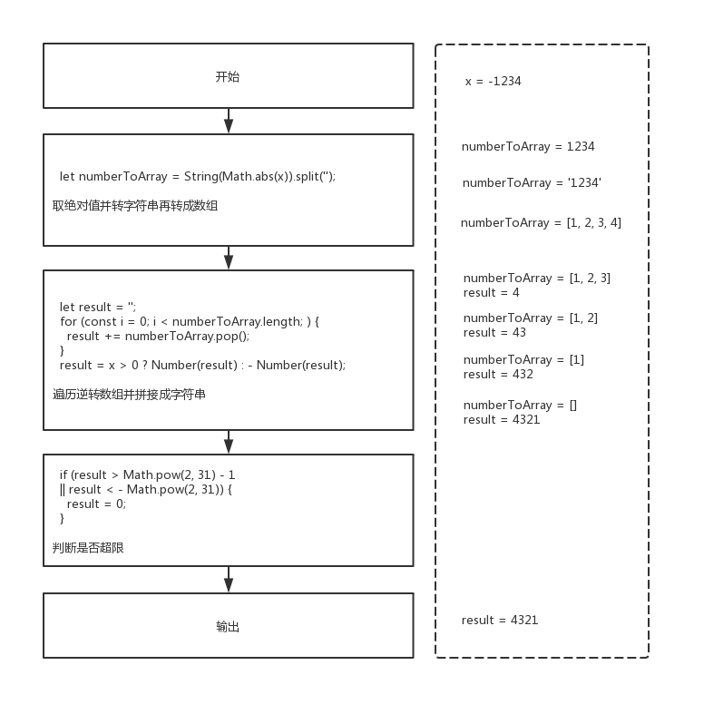
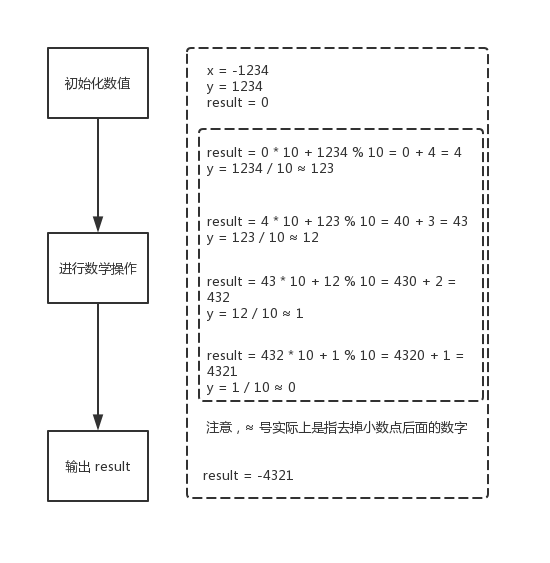

007 - 整数反转（reverse-integer）
===

> Create by **jsliang** on **2019-05-19 09:42:39**  
> Recently revised in **2019-05-24 11:35:47**

**Hello 小伙伴们，如果觉得本文还不错，记得给个 **star** ， 小伙伴们的 **star** 是我持续更新的动力！[GitHub 地址](https://github.com/LiangJunrong/document-library)**

* [LeetCode 攻略地址](https://github.com/LiangJunrong/document-library/tree/master/other-library/LeetCode)

## <a name="chapter-one" id="chapter-one">一 目录</a>

**不折腾的前端，和咸鱼有什么区别**

| 目录 |
| --- | 
| [一 目录](#chapter-one) | 
| <a name="catalog-chapter-two" id="catalog-chapter-two"></a>[二 前言](#chapter-two) |
| <a name="catalog-chapter-three" id="catalog-chapter-three"></a>[三 解题](#chapter-three) |
| &emsp;[3.1 解法 - 转字符串](#chapter-three-one) |
| &emsp;[3.2 解法 - 数学算法](#chapter-three-two) |

## <a name="chapter-two" id="chapter-two">二 前言</a>

> [返回目录](#chapter-one)

* **难度**：简单
* **涉及知识**：数组、数学
* **题目地址**：https://leetcode-cn.com/problems/reverse-integer/
* **题目内容**：

```
给出一个 32 位的有符号整数，你需要将这个整数中每位上的数字进行反转。

示例 1:

输入: 123
输出: 321
 示例 2:

输入: -123
输出: -321
示例 3:

输入: 120
输出: 21
注意:

假设我们的环境只能存储得下 32 位的有符号整数，则其数值范围为 [−231,  231 − 1]。请根据这个假设，如果反转后整数溢出那么就返回 0。
```

## <a name="chapter-three" id="chapter-three">三 解题</a>

> [返回目录](#chapter-one)

* **官方题解**：https://leetcode-cn.com/problems/reverse-integer/solution/zheng-shu-fan-zhuan-by-leetcode/

解题千千万，官方独一家，上面是官方使用 C++ / Java 进行的题解。

小伙伴可以先自己在本地尝试解题，再看看官方解题，最后再回来看看 **jsliang** 讲解下使用 JavaScript 的解题思路。

### <a name="chapter-three-one" id="chapter-three-one">3.1 解法 - 转字符串</a>

> [返回目录](#chapter-one)

* **解题代码**：

```js
var reverse = function(x) {
  // 转数组
  let numberToArray = String(Math.abs(x)).split('');
  
  // 转字符串
  let result = '';
  for (const i = 0; i < numberToArray.length; ) {
    result += numberToArray.pop();
  }
  result = x > 0 ? Number(result) : - Number(result);
  
  // 超 [-Math.pow(2, 31), Math.pow(2, 31) - 1] 判断
  if (result > Math.pow(2, 31) - 1
  || result < - Math.pow(2, 31)) {
    result = 0;
  }
  
  return result;
};
```

* **执行测试**：

1. `x`：`-1234`
2. `return`：

```js
-4321
```

* **LeetCode Submit**：

```js
✔ Accepted
  ✔ 1032/1032 cases passed (88 ms)
  ✔ Your runtime beats 99.53 % of javascript submissions
  ✔ Your memory usage beats 46.01 % of javascript submissions (35.8 MB)
```

* **知识点**：

1. `String`：将其他值转成字符串。[`String` 详细介绍](https://github.com/LiangJunrong/document-library/blob/master/JavaScript-library/JavaScript/Object/String.md)
2. `Number`：将其他值转成数字值。[`Number` 详细介绍](https://github.com/LiangJunrong/document-library/blob/master/JavaScript-library/JavaScript/Object/Number.md)
3. `pop()`：`pop()` 方法从数组中删除最后一个元素，并返回该元素的值。此方法更改数组的长度。[`pop()` 详细介绍](https://github.com/LiangJunrong/document-library/blob/master/JavaScript-library/JavaScript/Function/pop.md)
4. `Math`：JS 中的内置对象，具有数学常数和函数的属性和方法。[`Math` 详细介绍](https://github.com/LiangJunrong/document-library/blob/master/JavaScript-library/JavaScript/Object/Math.md)

* **解题思路**：



**首先**，将传入的数字 `x` 转换成字符串，并分割成数组。

**然后**，遍历该数组，将最后一个取出来放到 `result` 中。

**最后**，判断这个 `result` 是否超过题目限制，如果超过则变成 0 。

* **进一步思考**：

### <a name="chapter-three-two" id="chapter-three-two">3.2 解法 - 数学算法</a>

> [返回目录](#chapter-one)

* **解题代码**：

```js
var reverse = function(x) {
  let result = 0;
  let y = Math.abs(x);
  while (y != 0) {
    result = result * 10 + y % 10;
    y = Math.floor(y / 10);
    if (result > Math.pow(2, 31) - 1
    || result < -Math.pow(2, 31)) {
      result = 0;
      y = 0;
    }
  }
  return x > 0 ? result : -result;
};
```

* **执行测试**：

1. `x`：`-1234`
2. `return`：

```js
-4321
```

* **LeetCode Submit**：

```js
✔ Accepted
  ✔ 1032/1032 cases passed (108 ms)
  ✔ Your runtime beats 97.4 % of javascript submissions
  ✔ Your memory usage beats 23.63 % of javascript submissions (36 MB)
```

* **知识点**：

1. `Math`：JS 中的内置对象，具有数学常数和函数的属性和方法。[`Math` 详细介绍](https://github.com/LiangJunrong/document-library/blob/master/JavaScript-library/JavaScript/Object/Math.md)

* **解题思路**：



**首先**，我们初始化数值。

**然后**，我们需要知道的是，一个数对 10 取余，可以得到这个数的个位数；一个数乘于 10 并加上一个个位数，可以将这个数字放到末尾。

**最后**，我们判断一开始传入的数值正负，再返回对应结果即可。

---

**不折腾的前端，和咸鱼有什么区别！**


**jsliang** 会每天更新一道 LeetCode 题解，或者发表最新前端攻略，扫描上方二维码，关注 **jsliang** 的公众号，让我们一起折腾！

> <a rel="license" href="http://creativecommons.org/licenses/by-nc-sa/4.0/"></a><br /><span xmlns:dct="http://purl.org/dc/terms/" property="dct:title">jsliang 的文档库</span> 由 <a xmlns:cc="http://creativecommons.org/ns#" href="https://github.com/LiangJunrong/document-library" property="cc:attributionName" rel="cc:attributionURL">梁峻荣</a> 采用 <a rel="license" href="http://creativecommons.org/licenses/by-nc-sa/4.0/">知识共享 署名-非商业性使用-相同方式共享 4.0 国际 许可协议</a>进行许可。<br />基于<a xmlns:dct="http://purl.org/dc/terms/" href="https://github.com/LiangJunrong/document-library" rel="dct:source">https://github.com/LiangJunrong/document-library</a>上的作品创作。<br />本许可协议授权之外的使用权限可以从 <a xmlns:cc="http://creativecommons.org/ns#" href="https://creativecommons.org/licenses/by-nc-sa/2.5/cn/" rel="cc:morePermissions">https://creativecommons.org/licenses/by-nc-sa/2.5/cn/</a> 处获得。