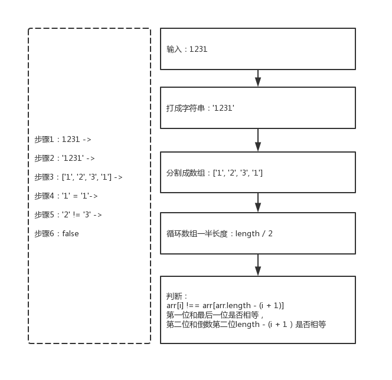
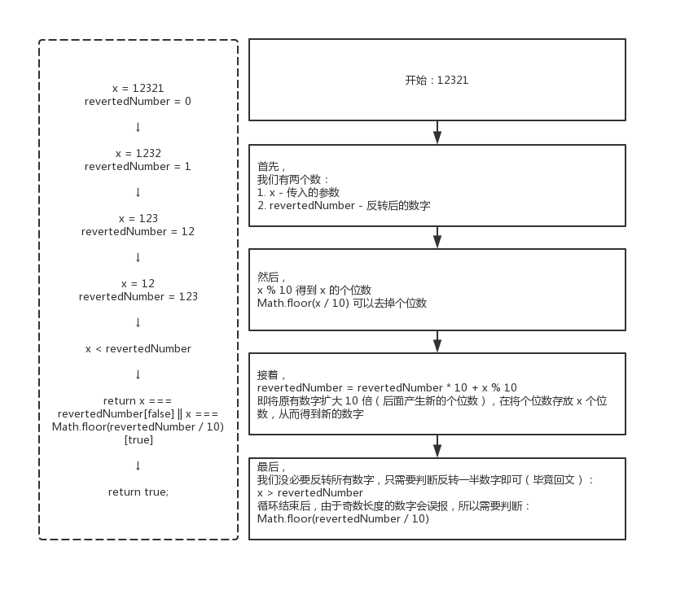

009 - 回文数（palindrome-number）
===

> Create by **jsliang** on **2019-05-22 19:30:42**  
> Recently revised in **2019-05-24 11:36:11**

## <a name="chapter-one" id="chapter-one">一 目录</a>

**不折腾的前端，和咸鱼有什么区别**

| 目录 |
| --- | 
| [一 目录](#chapter-one) | 
| <a name="catalog-chapter-two" id="catalog-chapter-two"></a>[二 前言](#chapter-two) |
| <a name="catalog-chapter-three" id="catalog-chapter-three"></a>[三 解题](#chapter-three) |
| &emsp;[3.1 解题 - 数组操作](#chapter-three-one) |
| &emsp;[3.1 解题 - 数学算法](#chapter-three-two) |

## <a name="chapter-two" id="chapter-two">二 前言</a>

> [返回目录](#chapter-one)

* **难度**：简单
* **涉及知识**：数学
* **题目地址**：https://leetcode-cn.com/problems/palindrome-number/
* **题目内容**：

```
判断一个整数是否是回文数。回文数是指正序（从左向右）和倒序（从右向左）读都是一样的整数。

示例 1:
输入: 121
输出: true

示例 2:
输入: -121
输出: false
解释: 从左向右读, 为 -121 。 从右向左读, 为 121- 。因此它不是一个回文数。

示例 3:
输入: 10
输出: false
解释: 从右向左读, 为 01 。因此它不是一个回文数。

进阶:
你能不将整数转为字符串来解决这个问题吗？
```

## <a name="chapter-three" id="chapter-threed">三 解题</a>

> [返回目录](#chapter-one)

* **官方题解**：https://leetcode-cn.com/problems/palindrome-number/solution/hui-wen-shu-by-leetcode/

解题千千万，官方独一家，上面是官方使用 C# 进行的题解。

小伙伴可以先自己在本地尝试解题，再看看官方解题，最后再回来看看 **jsliang** 讲解下使用 JavaScript 的解题思路。

### <a name="chapter-three-one" id="chapter-three-one">3.1 解法 - 数组操作</a>

> [返回目录](#chapter-one)

* **解题代码**：

```js
var isPalindrome = function(x) {
  const arr = String(x).split('');
  for (let i = 0; i < arr.length / 2; i++) {
    if (arr[i] !== arr[arr.length - (i + 1)]) {
      return false;
    }
  }
  return true;
};
```

* **执行测试**：

1. `x`：`1231`
2. `return`：

```js
false
```

* **LeetCode Submit**：

```js
✔ Accepted
  ✔ 11509/11509 cases passed (316 ms)
  ✔ Your runtime beats 97.12 % of javascript submissions
  ✔ Your memory usage beats 67.78 % of javascript submissions (45.5 MB)
```

* **知识点**：

1. `split()`：`split()` 方法使用指定的分隔符字符串将一个 String 对象分割成字符串数组，以将字符串分隔为子字符串，以确定每个拆分的位置。[`split()` 详细介绍](https://github.com/LiangJunrong/document-library/blob/master/JavaScript-library/JavaScript/Function/split.md)

* **解题思路**：



将数字转为数组来判断，是比较简单的一种方法：

**首先**，我们将数字转成字符串，再转成数组。

**然后**，我们循环遍历这个数组。

**接着**，判断第 `i` 位和第 `length - (i + 1)` 位（例如 `1231`，第 `0` 位对应的是第 `length - 1` 位，第 `1` 位对应的是第 `length - 2` 位）。

**最后**，如果循环判断没问题，就返回 `true`；如果循环判断有问题，直接在循环中 `return false`。

### <a name="chapter-three-two" id="chapter-three-two">3.2 解法 - 数学算法</a>

> [返回目录](#chapter-one)

* **解题代码**：

```js
var isPalindrome = function(x) {
  if(x < 0 || (x % 10 == 0 && x != 0)) {
    return false;
  }
  let revertedNumber = 0;
  while(x > revertedNumber) {
    revertedNumber = revertedNumber * 10 + x % 10;
    x = Math.floor(x / 10);
  }
  return x === revertedNumber || x === Math.floor(revertedNumber / 10);
};
```

* **执行测试**：

1. `x`：`12321`
2. `return`：

```js
true
```

* **LeetCode Submit**：

```js
✔ Accepted
  ✔ 11509/11509 cases passed (316 ms)
  ✔ Your runtime beats 97.12 % of javascript submissions
  ✔ Your memory usage beats 67.78 % of javascript submissions (45.5 MB)
```

* **知识点**：

1. `Math`：JS 中的内置对象，具有数学常数和函数的属性和方法。[`Math` 详细介绍](https://github.com/LiangJunrong/document-library/blob/master/JavaScript-library/JavaScript/Object/Math.md)

* **解题思路**：



**首先**，我们可以想象：当一个数的长度为偶数，那么它对折过来应该是相等的；当一个数的长度是奇数，那么它对折过来后，有一个的长度需要去掉一位数（除以 10 并取整），因为奇数长度的那个数，我们不需要判断它中间的数字。

> 我们定义传递过来的参数为：`x`，对折的数字为：`z`，而 `y` 为 `x` 目前的个位数。

**然后**，我们需要知道如何获取到一个数的个位数：`y = x % 10`，我们也需要知道如何将单个数字不断添加到一个数的末尾：`z = z * 10 + y`，例如：`z = 1 * 10 + 2 = 12`。

**接着**，我们只需要判断 `x` 是不是小于 `z` 了，毕竟当它小于的时候，说明数字已经对半或者过半了。

**最后**，我们判断一开始的两种情况，并返回 `true` 或者 `false` 即可。

---

> **jsliang** 广告推送：  
> 也许小伙伴想了解下云服务器  
> 或者小伙伴想买一台云服务器  
> 或者小伙伴需要续费云服务器  
> 欢迎点击 **[云服务器推广](https://github.com/LiangJunrong/document-library/blob/master/other-library/Monologue/%E7%A8%B3%E9%A3%9F%E8%89%B0%E9%9A%BE.md)** 查看！

[](https://promotion.aliyun.com/ntms/act/qwbk.html?userCode=w7hismrh)
[](https://cloud.tencent.com/redirect.php?redirect=1014&cps_key=49f647c99fce1a9f0b4e1eeb1be484c9&from=console)

> <a rel="license" href="http://creativecommons.org/licenses/by-nc-sa/4.0/"></a><br /><span xmlns:dct="http://purl.org/dc/terms/" property="dct:title">jsliang 的文档库</span> 由 <a xmlns:cc="http://creativecommons.org/ns#" href="https://github.com/LiangJunrong/document-library" property="cc:attributionName" rel="cc:attributionURL">梁峻荣</a> 采用 <a rel="license" href="http://creativecommons.org/licenses/by-nc-sa/4.0/">知识共享 署名-非商业性使用-相同方式共享 4.0 国际 许可协议</a>进行许可。<br />基于<a xmlns:dct="http://purl.org/dc/terms/" href="https://github.com/LiangJunrong/document-library" rel="dct:source">https://github.com/LiangJunrong/document-library</a>上的作品创作。<br />本许可协议授权之外的使用权限可以从 <a xmlns:cc="http://creativecommons.org/ns#" href="https://creativecommons.org/licenses/by-nc-sa/2.5/cn/" rel="cc:morePermissions">https://creativecommons.org/licenses/by-nc-sa/2.5/cn/</a> 处获得。