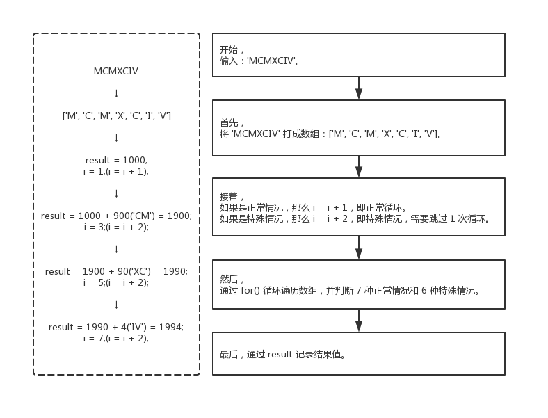
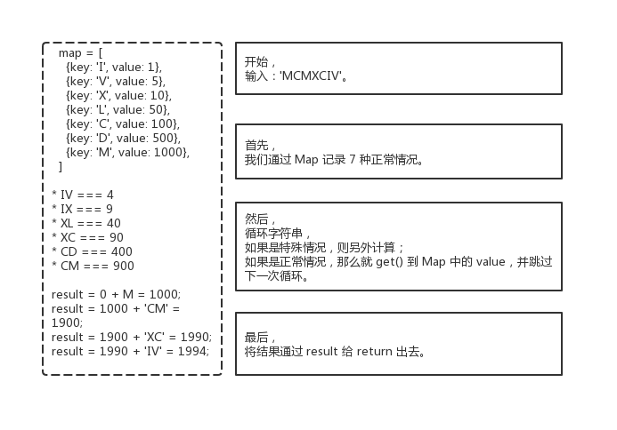

013 - 罗马数字转整数（roman-to-integer）
===

> Create by **jsliang** on **2019-05-23 13:24:24**  
> Recently revised in **2019-05-24 11:36:30**

## <a name="chapter-one" id="chapter-one">一 目录</a>

**不折腾的前端，和咸鱼有什么区别**

| 目录 |
| --- | 
| [一 目录](#chapter-one) | 
| <a name="catalog-chapter-two" id="catalog-chapter-two"></a>[二 前言](#chapter-two) |
| <a name="catalog-chapter-three" id="catalog-chapter-three"></a>[三 解题](#chapter-three) |
| &emsp;[3.1 解题 - for()](#chapter-three-one) |
| &emsp;[3.2 解题 - Map](#chapter-three-two) |

## <a name="chapter-two" id="chapter-two">二 前言</a>

> [返回目录](#chapter-one)

* **难度**：简单
* **涉及知识**：数学、字符串
* **题目地址**：https://leetcode-cn.com/problems/roman-to-integer/
* **题目内容**：

```
罗马数字包含以下七种字符: I， V， X， L，C，D 和 M。

字符          数值
I             1
V             5
X             10
L             50
C             100
D             500
M             1000

例如， 罗马数字 2 写做 II ，即为两个并列的 1。12 写做 XII ，即为 X + II 。 27 写做  XXVII, 即为 XX + V + II 。

通常情况下，罗马数字中小的数字在大的数字的右边。但也存在特例，例如 4 不写做 IIII，而是 IV。数字 1 在数字 5 的左边，所表示的数等于大数 5 减小数 1 得到的数值 4 。同样地，数字 9 表示为 IX。这个特殊的规则只适用于以下六种情况：

I 可以放在 V (5) 和 X (10) 的左边，来表示 4 和 9。
X 可以放在 L (50) 和 C (100) 的左边，来表示 40 和 90。 
C 可以放在 D (500) 和 M (1000) 的左边，来表示 400 和 900。
给定一个罗马数字，将其转换成整数。输入确保在 1 到 3999 的范围内。

示例 1:
输入: "III"
输出: 3

示例 2:
输入: "IV"
输出: 4

示例 3:
输入: "IX"
输出: 9

示例 4:
输入: "LVIII"
输出: 58
解释: L = 50, V= 5, III = 3.

示例 5:
输入: "MCMXCIV"
输出: 1994
解释: M = 1000, CM = 900, XC = 90, IV = 4.
```

## <a name="chapter-three" id="chapter-threed">三 解题</a>

> [返回目录](#chapter-one)

* **官方题解**：无

~~解题千千万，官方独一家，上面是官方使用 * 进行的题解。~~

小伙伴可以先自己在本地尝试解题，~~再看看官方解题，最后~~再回来看看 **jsliang** 讲解下使用 JavaScript 的解题思路。

### <a name="chapter-three-one" id="chapter-three-one">3.1 解法 - for()</a>

> [返回目录](#chapter-one)

* **解题代码**：

```js
var romanToInt = function(s) {
  /**
   * 特殊情况
   * IV === 4
   * IX === 9
   * XL === 40
   * XC === 90
   * CD === 400
   * CM === 900
   * 正常情况
   * I === 1
   * V === 5
   * X === 10
   * L === 50
   * C === 100
   * D === 500
   * M === 1000
   */
  const arr = s.split('');
  let result = 0;
  
  for (let i = 0; i < arr.length; ) {
    if (arr[i] === 'I' && arr[i+1] === 'V') {
      result += 4;
      i = i + 2;
    } else if(arr[i] === 'I' && arr[i+1] === 'X') {
      result += 9;
      i = i + 2;
    } else if(arr[i] === 'X' && arr[i+1] === 'L') {
      result += 40;
      i = i + 2;
    } else if(arr[i] === 'X' && arr[i+1] === 'C') {
      result += 90;
      i = i + 2;
    } else if(arr[i] === 'C' && arr[i+1] === 'D') {
      result += 400
      i = i + 2;
    } else if(arr[i] === 'C' && arr[i+1] === 'M') {
      result += 900;
      i = i + 2;
    } else if (arr[i] === 'I') {
      result += 1;
      i = i + 1;
    } else if (arr[i] === 'V') {
      result += 5;
      i = i + 1;
    } else if (arr[i] === 'X') {
      result += 10;
      i = i + 1;
    } else if (arr[i] === 'L') {
      result += 50;
      i = i + 1;
    } else if (arr[i] === 'C') {
      result += 100;
      i = i + 1;
    } else if (arr[i] === 'D') {
      result += 500;
      i = i + 1;
    } else if (arr[i] === 'M') {
      result += 1000;
      i = i + 1;
    }
  }

  return result;
};
```

* **执行测试**：

1. `s`：`MCMXCIV`
2. `return`：

```js
1994
```

* **LeetCode Submit**：

```js
✔ Accepted
  ✔ 3999/3999 cases passed (248 ms)
  ✔ Your runtime beats 88.79 % of javascript submissions
  ✔ Your memory usage beats 52.85 % of javascript submissions (40.2 MB)
```

* **知识点**：

1. `split()`：`split()` 方法使用指定的分隔符字符串将一个 String 对象分割成字符串数组，以将字符串分隔为子字符串，以确定每个拆分的位置。[`split()` 详细介绍](https://github.com/LiangJunrong/document-library/blob/master/JavaScript-library/JavaScript/Function/split.md)

* **解题思路**：



通过 `for()` 来进行暴力破解是最快的。

就像有句话：“暴力一时爽，一直暴力一直爽 —— **jsliang**”。

**首先**，我们只需要将参数打成数组（或者不打成数组，在 JavaScript 中，String 也有 `length` 和 `string[i]`）。

**然后**，通过 `for()` 暴力循环。如果是正常情况，那么 `i` 就 `+ 1`，如果是特殊情况，那么需要跳过下一次循环，即 `i = i + 2`。

**最后**，通过 `result` 的相加，即可以获取到最终结果。

### <a name="chapter-three-two" id="chapter-three-two">3.2 解法 - Map</a>

> [返回目录](#chapter-one)

* **解题代码**：

```js
var romanToInt = function(s) {
  /**
   * 特殊情况
   * IV === 4
   * IX === 9
   * XL === 40
   * XC === 90
   * CD === 400
   * CM === 900
   * 正常情况
   * I === 1
   * V === 5
   * X === 10
   * L === 50
   * C === 100
   * D === 500
   * M === 1000
   */
  let map = new Map();
  map.set('I', 1);
  map.set('V', 5);
  map.set('X', 10);
  map.set('L', 50);
  map.set('C', 100);
  map.set('D', 500);
  map.set('M', 1000)
  
  let result = 0;
  for (let i = 0; i < s.length; i++) {
    if (s[i] + s[i+1] === 'IV') {
      result += 4;
      i = i + 1;
    } else if(s[i] + s[i+1] === 'IX') {
      result += 9;
      i = i + 1;
    } else if(s[i] + s[i+1] === 'XL') {
      result += 40;
      i = i + 1;
    } else if(s[i] + s[i+1] === 'XC') {
      result += 90;
      i = i + 1;
    } else if(s[i] + s[i+1] === 'CD') {
      result += 400
      i = i + 1;
    } else if(s[i] + s[i+1] === 'CM') {
      result += 900;
      i = i + 1;
    } else {
      result += map.get(s[i]);
    }
  }
  
  return result;
};
```

* **执行测试**：

1. `s`：`MCMXCIV`
2. `return`：

```js
1994
```

* **LeetCode Submit**：

```js
✔ Accepted
  ✔ 3999/3999 cases passed (208 ms)
  ✔ Your runtime beats 99.08 % of javascript submissions
  ✔ Your memory usage beats 6.84 % of javascript submissions (43.5 MB)
```

* **知识点**：

1. `Map`：保存键值对。任何值(对象或者原始值) 都可以作为一个键或一个值。[`Map` 详细介绍](https://github.com/LiangJunrong/document-library/blob/master/JavaScript-library/JavaScript/Object/Map.md)

* **解题思路**：



**个人感觉，该方法有点像脱裤子放屁 ——多此一举**

**首先**，设置 `Map`，将正常情况存下来。

**然后**，遍历字符串，判断特殊情况，如果是特殊情况，需要跳过下一次循环，否则直接获取 `Map` 中对应的值。

**最后**，将结果通过 `result` 给 `return` 出去。 

---

> **jsliang** 广告推送：  
> 也许小伙伴想了解下云服务器  
> 或者小伙伴想买一台云服务器  
> 或者小伙伴需要续费云服务器  
> 欢迎点击 **[云服务器推广](https://github.com/LiangJunrong/document-library/blob/master/other-library/Monologue/%E7%A8%B3%E9%A3%9F%E8%89%B0%E9%9A%BE.md)** 查看！

[](https://promotion.aliyun.com/ntms/act/qwbk.html?userCode=w7hismrh)
[](https://cloud.tencent.com/redirect.php?redirect=1014&cps_key=49f647c99fce1a9f0b4e1eeb1be484c9&from=console)

> <a rel="license" href="http://creativecommons.org/licenses/by-nc-sa/4.0/"></a><br /><span xmlns:dct="http://purl.org/dc/terms/" property="dct:title">jsliang 的文档库</span> 由 <a xmlns:cc="http://creativecommons.org/ns#" href="https://github.com/LiangJunrong/document-library" property="cc:attributionName" rel="cc:attributionURL">梁峻荣</a> 采用 <a rel="license" href="http://creativecommons.org/licenses/by-nc-sa/4.0/">知识共享 署名-非商业性使用-相同方式共享 4.0 国际 许可协议</a>进行许可。<br />基于<a xmlns:dct="http://purl.org/dc/terms/" href="https://github.com/LiangJunrong/document-library" rel="dct:source">https://github.com/LiangJunrong/document-library</a>上的作品创作。<br />本许可协议授权之外的使用权限可以从 <a xmlns:cc="http://creativecommons.org/ns#" href="https://creativecommons.org/licenses/by-nc-sa/2.5/cn/" rel="cc:morePermissions">https://creativecommons.org/licenses/by-nc-sa/2.5/cn/</a> 处获得。