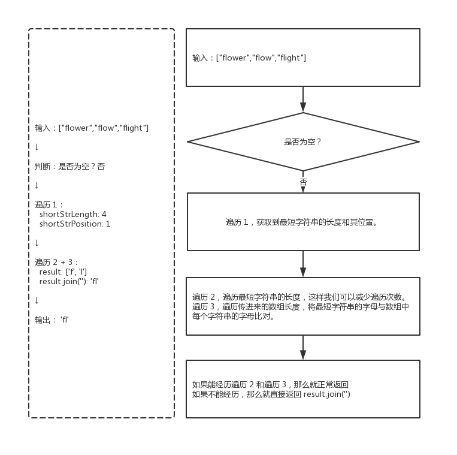
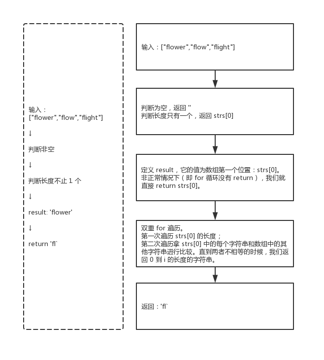

014 - 最长公共前缀（longest-common-prefix）
===

> Create by **jsliang** on **2019-06-03 10:13:01**  
> Recently revised in **2019-06-03 15:18:19**

## <a name="chapter-one" id="chapter-one">一 目录</a>

**不折腾的前端，和咸鱼有什么区别**

| 目录 |
| --- | 
| [一 目录](#chapter-one) | 
| <a name="catalog-chapter-two" id="catalog-chapter-two"></a>[二 前言](#chapter-two) |
| <a name="catalog-chapter-three" id="catalog-chapter-three"></a>[三 解题](#chapter-three) |
| &emsp;[3.1 解题 - 转数组](#chapter-three) |

## <a name="chapter-two" id="chapter-two">二 前言</a>

> [返回目录](#chapter-one)

* **难度**：简单
* **涉及知识**：字符串
* **题目地址**：https://leetcode-cn.com/problems/longest-common-prefix/
* **题目内容**：

```
编写一个函数来查找字符串数组中的最长公共前缀。

如果不存在公共前缀，返回空字符串 ""。

示例 1:

输入: ["flower","flow","flight"]
输出: "fl"
示例 2:

输入: ["dog","racecar","car"]
输出: ""
解释: 输入不存在公共前缀。

说明:
所有输入只包含小写字母 a-z 。
```

## <a name="chapter-three" id="chapter-threed">三 解题</a>

> [返回目录](#chapter-one)

* **官方题解**：https://leetcode-cn.com/problems/longest-common-prefix/solution/zui-chang-gong-gong-qian-zhui-by-leetcode/

解题千千万，官方独一家，上面是官方使用 Java 进行的题解。

小伙伴可以先自己在本地尝试解题，再看看官方解题，最后再回来看看 **jsliang** 讲解下使用 JavaScript 的解题思路。

### <a name="chapter-three-one" id="chapter-three-one">3.1 解法 - 暴力破解</a>

> [返回目录](#chapter-one)

* **解题代码**：

```js
var longestCommonPrefix = function(strs) {
  if (!strs.length) {
    return '';
  }
  let shortStrLength = strs[0].length; // 最短字符串的长度
  let shortStrPosition = 0; // 最短字符串的位置
  for (let i = 0; i < strs.length; i++){
    if (strs[i].length < shortStrLength) {
      shortStrLength = strs[i].length;
      shortStrPosition = i;
    }
  }
  let result = [];
  for (let i = 0; i < shortStrLength; i++) {
    for (let j = 0; j < strs.length; j++) {
      if (strs[shortStrPosition][i] != strs[j][i]) {
        return result.join('');
      }
      if (j === strs.length - 1) {
        result[i] = strs[shortStrPosition][i];
      }
    }
  }
  return result.join('');
};
```

* **执行测试 1**：

1. `strs`：`["flower","flow","flight"]`
2. `return`：

```js
"fl"
```

* **执行测试 2**：

1. `strs`：`["dog","racecar","car"]`
2. `return`：

```js
""
```

* **LeetCode Submit**：

```js
✔ Accepted
  ✔ 118/118 cases passed (92 ms)
  ✔ Your runtime beats 86.97 % of javascript submissions
  ✔ Your memory usage beats 36.33 % of javascript submissions (35.1 MB)
```

* **知识点**：

1. `join()`：`join()` 方法将一个数组（或一个类数组对象）的所有元素连接成一个字符串并返回这个字符串。[`join()` 详细介绍](https://github.com/LiangJunrong/document-library/blob/master/JavaScript-library/JavaScript/Function/join.md)

* **解题思路**：



**首先**，我们进行非空判断，当它是 `['']` 这样子时，我们直接返回 `''`。

**然后**，我们进行第一次遍历，我们需要获取到最短字符串，因为这样我们就可以进行最短的 `for` 遍历；我们顺带存储下位置，方便获取这个字符串。

**接着**，我们进行双重遍历（第二/第三次遍历），将最短字符串的每个字符和其他字符串进行比对，正常情况下，我们找到不相同后，就返回结果。

**最后**，如果我们第二/第三次遍历没有做到执行，我们返回空字符串即可。

### <a name="chapter-three-two" id="chapter-three-two">3.2 解法 - 水平扫描</a>

> [返回目录](#chapter-one)

* **解题代码**：

```js
var longestCommonPrefix = function(strs) {
  if (strs.length < 2) {
    return !strs.length ? '' : strs[0];
  }
  
  var result = strs[0];
  
  for(let i = 0; i < result.length; i++) {
    for(let j = 1; j < strs.length; j++) {
      if (result[i] !== strs[j][i]) {
        return result.substring(0, i);
      }
    }
  }
  return result;
};
```

* **执行测试 1**：

1. `strs`：`["flower","flow","flight"]`
2. `return`：

```js
"fl"
```

* **执行测试 2**：

1. `strs`：`["dog","racecar","car"]`
2. `return`：

```js
""
```

* **LeetCode Submit**：

```js
✔ Accepted
  ✔ 118/118 cases passed (88 ms)
  ✔ Your runtime beats 91.9 % of javascript submissions
  ✔ Your memory usage beats 46.38 % of javascript submissions (34.9 MB)
```

* **知识点**：

1. `substring()`：`substring()` 方法将一个数组（或一个类数组对象）的所有元素连接成一个字符串并返回这个字符串。[`substring()` 详细介绍](https://github.com/LiangJunrong/document-library/blob/master/JavaScript-library/JavaScript/Function/substring.md)

* **解题思路**：



该思路和 3.1 解法相似，理解了上面，看这幅图就是 OK 的了。

### <a name="chapter-three-three" id="chapter-three-three">3.3 解法 - 正则表达式</a>

> [返回目录](#chapter-one)

* **解题代码**：

```js
var longestCommonPrefix = function(strs) {
  if (strs.length < 2) {
    return !strs.length ? '' : strs[0];
  }
  
  let base = strs.shift(),
    joinStrs = '@' + strs.join('@'),
    regx = '@',
    res = '';

  for(let i = 0; i < base.length; i++){
    regx += base.substring(i, i + 1);
    let matchArr = joinStrs.match(new RegExp(`${regx}`,"g")) || [];
    if(matchArr.length === strs.length){
      res += base.substring(i, i+1);
    }
  }
  return res;
};
```

* **执行测试 1**：

1. `strs`：`["flower","flow","flight"]`
2. `return`：

```js
"fl"
```

* **执行测试 2**：

1. `strs`：`["dog","racecar","car"]`
2. `return`：

```js
""
```

* **LeetCode Submit**：

```js
✔ Accepted
  ✔ 118/118 cases passed (108 ms)
  ✔ Your runtime beats 45.03 % of javascript submissions
  ✔ Your memory usage beats 16.23 % of javascript submissions (35.9 MB)
```

* **知识点**：

1. `join()`：`join()` 方法将一个数组（或一个类数组对象）的所有元素连接成一个字符串并返回这个字符串。[`join()` 详细介绍](https://github.com/LiangJunrong/document-library/blob/master/JavaScript-library/JavaScript/Function/join.md)
2. `substring()`：`substring()` 方法将一个数组（或一个类数组对象）的所有元素连接成一个字符串并返回这个字符串。[`substring()` 详细介绍](https://github.com/LiangJunrong/document-library/blob/master/JavaScript-library/JavaScript/Function/substring.md)
3. `RegExp`：构造函数的原型对象。常用语一些便捷操作。[`RegExp` 详细介绍](https://github.com/LiangJunrong/document-library/blob/master/JavaScript-library/JavaScript/Object/RegExp.md)

* **解题思路**：


**首先**，我们跟前两种方法一样进行空数组和数组长度为 1 时的判断。

**然后**，我们将数组第一个字符串通过 `shift()` 的形式给裁剪出来。

**接着**，我们将数组以 `@` 的形式拼接成字符串。因为下面我们将通过 `@` 的形式来判断代码是否符合正则校验。

**再然后**，通过 `for` 循环和正则表达式判断，如果成立了，下次再判断的时候，就通过字符串拼接的形式，拓展校验规则字段 `regx`。

**最后**，如果匹配返回的长度和数组总长度相等的情况下，我们就通过字符串拼接的形式修改返回值。

### <a name="chapter-three-four" id="chapter-three-four">3.4 解法 - 水平扫描</a>

> [返回目录](#chapter-one)

* **解题代码**：

```js
var longestCommonPrefix = function(strs) {
  if (strs.length < 2) {
    return !strs.length ? '' : strs[0];
  }
  
  return strs.reduce((prev, next) => {
    let i = 0;
    while (prev[i] && next[i] && prev[i] === next[i]) {
      i++;
    };
    return prev.slice(0, i);
  });
};
```

* **执行测试 1**：

1. `strs`：`["flower","flow","flight"]`
2. `return`：

```js
"fl"
```

* **执行测试 2**：

1. `strs`：`["dog","racecar","car"]`
2. `return`：

```js
""
```

* **LeetCode Submit**：

```js
✔ Accepted
  ✔ 118/118 cases passed (80 ms)
  ✔ Your runtime beats 96.32 % of javascript submissions
  ✔ Your memory usage beats 21.06 % of javascript submissions (35.5 MB)
```

* **知识点**：

1. `reduce()`

* **解题思路**：

[图]

**首先**，这无疑是这四种思路中，写法看起来最简洁的。

**然后**，通过 `reduce()`，我们可以进行一项累加操作：先比较第一项和第二项，然后找到它们共通值后，剪切并 `return`；再比较的时候，使用 `return` 出来的值和第三项进行比较……依次类推

**最后**，返回最后一次 `return` 的值。

---

> **jsliang** 广告推送：  
> 也许小伙伴想了解下云服务器  
> 或者小伙伴想买一台云服务器  
> 或者小伙伴需要续费云服务器  
> 欢迎点击 **[云服务器推广](https://github.com/LiangJunrong/document-library/blob/master/other-library/Monologue/%E7%A8%B3%E9%A3%9F%E8%89%B0%E9%9A%BE.md)** 查看！

[](https://promotion.aliyun.com/ntms/act/qwbk.html?userCode=w7hismrh)
[](https://cloud.tencent.com/redirect.php?redirect=1014&cps_key=49f647c99fce1a9f0b4e1eeb1be484c9&from=console)

> <a rel="license" href="http://creativecommons.org/licenses/by-nc-sa/4.0/"></a><br /><span xmlns:dct="http://purl.org/dc/terms/" property="dct:title">jsliang 的文档库</span> 由 <a xmlns:cc="http://creativecommons.org/ns#" href="https://github.com/LiangJunrong/document-library" property="cc:attributionName" rel="cc:attributionURL">梁峻荣</a> 采用 <a rel="license" href="http://creativecommons.org/licenses/by-nc-sa/4.0/">知识共享 署名-非商业性使用-相同方式共享 4.0 国际 许可协议</a>进行许可。<br />基于<a xmlns:dct="http://purl.org/dc/terms/" href="https://github.com/LiangJunrong/document-library" rel="dct:source">https://github.com/LiangJunrong/document-library</a>上的作品创作。<br />本许可协议授权之外的使用权限可以从 <a xmlns:cc="http://creativecommons.org/ns#" href="https://creativecommons.org/licenses/by-nc-sa/2.5/cn/" rel="cc:morePermissions">https://creativecommons.org/licenses/by-nc-sa/2.5/cn/</a> 处获得。