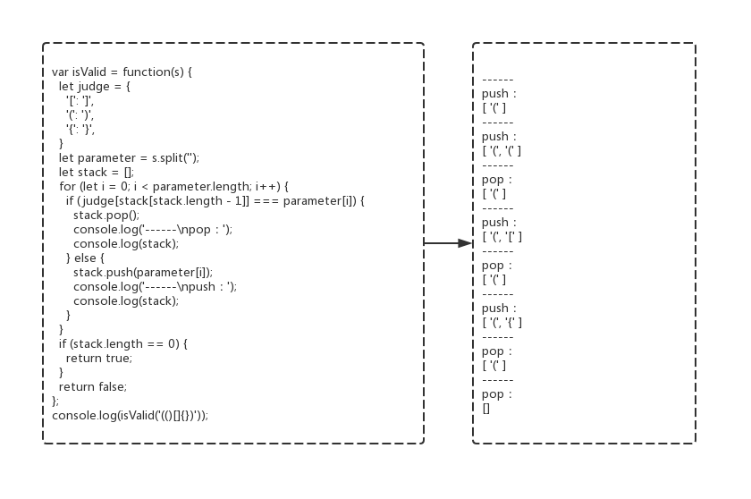

020 - 有效的括号（valid-parentheses）
===

> Create by **jsliang** on **2019-06-04 11:39:30**  
> Recently revised in **2019-09-18 09:55:03**

## <a name="chapter-one" id="chapter-one">一 目录</a>

**不折腾的前端，和咸鱼有什么区别**

| 目录 |
| --- | 
| [一 目录](#chapter-one) | 
| <a name="catalog-chapter-two" id="catalog-chapter-two"></a>[二 前言](#chapter-two) |
| <a name="catalog-chapter-three" id="catalog-chapter-three"></a>[三 解题](#chapter-three) |

## <a name="chapter-two" id="chapter-two">二 前言</a>

> [返回目录](#chapter-one)

* **难度**：简单
* **涉及知识**：栈、字符串
* **题目地址**：https://leetcode-cn.com/problems/valid-parentheses/
* **题目内容**：

```
给定一个只包括 '('，')'，'{'，'}'，'['，']' 的字符串，判断字符串是否有效。

有效字符串需满足：

左括号必须用相同类型的右括号闭合。
左括号必须以正确的顺序闭合。
注意空字符串可被认为是有效字符串。

示例 1:
输入: "()"
输出: true

示例 2:
输入: "()[]{}"
输出: true

示例 3:
输入: "(]"
输出: false

示例 4:
输入: "([)]"
输出: false

示例 5:
输入: "{[]}"
输出: true
```

## <a name="chapter-three" id="chapter-three">三 解题</a>

> [返回目录](#chapter-one)

* **官方题解**：https://leetcode-cn.com/problems/valid-parentheses/solution/you-xiao-de-gua-hao-by-leetcode/

解题千千万，官方独一家，上面是官方使用 Java 进行的题解。

小伙伴可以先自己在本地尝试解题，再看看官方解题，最后再回来看看 **jsliang** 讲解下使用 JavaScript 的解题思路。

* **解题代码**：

```js
var isValid = function(s) {
  let judge = {
    '[': ']',
    '(': ')',
    '{': '}',
  }
  let parameter = s.split('');
  let stack = [];
  for (let i = 0; i < parameter.length; i++) {
    if (judge[stack[stack.length - 1]] === parameter[i]) {
      stack.pop();
    } else {
      stack.push(parameter[i]);
    }
  }
  if (stack.length == 0) {
    return true;
  }
  return false;
};
```

* **执行测试**：

1. `s`：`()[]{}`
2. `return`：`true`

* **LeetCode Submit**：

```js
✔ Accepted
  ✔ 76/76 cases passed (76 ms)
  ✔ Your runtime beats 96.48 % of javascript submissions
  ✔ Your memory usage beats 66.23 % of javascript submissions (33.8 MB)
```

* **知识点**：

1. `split()`：`split()` 方法使用指定的分隔符字符串将一个 String 对象分割成字符串数组，以将字符串分隔为子字符串，以确定每个拆分的位置。[`split()` 详细介绍](https://github.com/LiangJunrong/document-library/blob/master/JavaScript-library/JavaScript/%E5%86%85%E7%BD%AE%E5%AF%B9%E8%B1%A1/String/split.md)
2. `push()`：`push()` 方法将一个或多个元素添加到数组的末尾，并返回该数组的新长度。[`push()` 详细介绍](https://github.com/LiangJunrong/document-library/blob/master/JavaScript-library/JavaScript/%E5%86%85%E7%BD%AE%E5%AF%B9%E8%B1%A1/Array/push.md)
3. `pop()`：`pop()` 方法从数组中删除最后一个元素，并返回该元素的值。此方法更改数组的长度。[`pop()` 详细介绍](https://github.com/LiangJunrong/document-library/blob/master/JavaScript-library/JavaScript/%E5%86%85%E7%BD%AE%E5%AF%B9%E8%B1%A1/Array/pop.md)

* **解题思路**：

**首先**，我们来想下平时玩的翻牌游戏：

游戏屏幕中有 4 * 4 共 16 张牌。

如果在同一个回合中（一个回合能翻 2 次牌），我们翻出来相同的两张牌，就把它摊开（消掉）；

如果在同一个回合中翻到两张不同的牌，我们就要把它覆盖回去。


这时候，机智如你，有没有想过要一个作弊器，用来记录我们翻过的牌？！

就好比：我们先翻到红包，再翻到炸弹，下一次翻到红包的时候，我们就打开一开始翻到红包的地方……

OK，这么讲，小伙伴们大致清楚了。

**现在**，我们有一个字符串：`(()[]{})`，我们要判断它是否是有效的括号，怎么判断呢：

1. 这些括号必须成对出现，例如：`()`、`[]`、`{}`。
2. 这些括号出现的情况不能乱序，例如：`([)]`、`{[}]`

**同时**，我们初始化下数据：

* `judge`: 

```
{
  '[': ']',
  '(': ')',
  '{': '}',
}
```

* `parameter`：`[ '(', '(', ')', '[', ']', '{', '}', ')' ]`
* `stack`：`[]`

**然后**，我们是不是该开始使用我们的作弊器了：



在这个作弊器中，我们将碰到的括号记录起来。

如果碰到下一个括号，是我们想要的类型，那么就消掉最上层的括号；

如果碰到下一个括号，不是我们想要的类型，那么就把它放到数组的最上层。

1. 遍历第一次，`stack` 末尾是空的，所以我们执行 `push()` 操作，`stack`：`['(']`
2. 遍历第二次，`stack` 末尾是 `'('`，通过 `judge` 转换就是 `')'`，而在这个位置的 `parameter[i]` 是 `'('`，两者不相同，所以我们还是执行 `push()` 操作，`stack`：`['(', '(']`
3. 遍历第三次，`stack` 末尾是 `'('`，通过 `judge` 转换就是 `')'`，而在这个位置的 `parameter[i]` 是 `')'`，两者相同，所以我们执行 `pop()` 操作，将数组的末尾给删掉，`stack`：`['(']`
4. ……以此类推，最后我们的 `stack` 变成 `[]` 空数组。

**最后**，我们根据 `stack` 是否为空数组，来进行判断这个字符串是不是有效数组。

---

**不折腾的前端，和咸鱼有什么区别！**


**jsliang** 会每天更新一道 LeetCode 题解，从而帮助小伙伴们夯实原生 JS 基础，了解与学习算法与数据结构。

扫描上方二维码，关注 **jsliang** 的公众号，让我们一起折腾！

> <a rel="license" href="http://creativecommons.org/licenses/by-nc-sa/4.0/"></a><br /><span xmlns:dct="http://purl.org/dc/terms/" property="dct:title">jsliang 的文档库</span> 由 <a xmlns:cc="http://creativecommons.org/ns#" href="https://github.com/LiangJunrong/document-library" property="cc:attributionName" rel="cc:attributionURL">梁峻荣</a> 采用 <a rel="license" href="http://creativecommons.org/licenses/by-nc-sa/4.0/">知识共享 署名-非商业性使用-相同方式共享 4.0 国际 许可协议</a>进行许可。<br />基于<a xmlns:dct="http://purl.org/dc/terms/" href="https://github.com/LiangJunrong/document-library" rel="dct:source">https://github.com/LiangJunrong/document-library</a>上的作品创作。<br />本许可协议授权之外的使用权限可以从 <a xmlns:cc="http://creativecommons.org/ns#" href="https://creativecommons.org/licenses/by-nc-sa/2.5/cn/" rel="cc:morePermissions">https://creativecommons.org/licenses/by-nc-sa/2.5/cn/</a> 处获得。