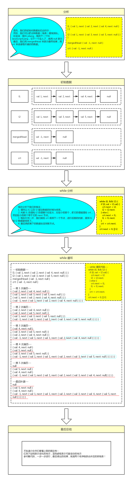

021 - 合并两个有序链表（merge-two-sorted-lists）
===

> Create by **jsliang** on **2019-06-05 08:37:00**  
> Recently revised in **2019-06-05 17:31:37**

## <a name="chapter-one" id="chapter-one">一 目录</a>

**不折腾的前端，和咸鱼有什么区别**

| 目录 |
| --- | 
| [一 目录](#chapter-one) | 
| <a name="catalog-chapter-two" id="catalog-chapter-two"></a>[二 前言](#chapter-two) |
| <a name="catalog-chapter-three" id="catalog-chapter-three"></a>[三 解题](#chapter-three) |
| &emsp;[3.1 官方题解](#chapter-three-one) |
| &emsp;[3.2 解题代码](#chapter-three-two) |
| &emsp;[3.3 执行测试](#chapter-three-three) |
| &emsp;[3.4 LeetCode Submit](#chapter-three-four) |
| &emsp;[3.5 知识补充](#chapter-three-five) |
| &emsp;[3.6 解题思路](#chapter-three-six) |
| <a name="catalog-chapter-four" id="catalog-chapter-four"></a>[四 总结](#chapter-four) |

## <a name="chapter-two" id="chapter-two">二 前言</a>

> [返回目录](#chapter-one)

* **难度**：简单
* **涉及知识**：链表
* **题目地址**：https://leetcode-cn.com/problems/merge-two-sorted-lists/
* **题目内容**：

```
将两个有序链表合并为一个新的有序链表并返回。

新链表是通过拼接给定的两个链表的所有节点组成的。 

示例：
输入：1->2->4, 1->3->4
输出：1->1->2->3->4->4
```

## <a name="chapter-three" id="chapter-three">三 解题</a>

> [返回目录](#chapter-one)

### <a name="chapter-three-one" id="chapter-three-one">3.1 官方题解</a>

> [返回目录](#chapter-one)

https://leetcode-cn.com/problems/merge-two-sorted-lists/solution/he-bing-liang-ge-you-xu-lian-biao-by-leetcode/

解题千千万，官方独一家，上面是官方使用 Java 进行的题解。

小伙伴可以先自己在本地尝试解题，再看看官方解题，最后再回来看看 **jsliang** 讲解下使用 JavaScript 的解题思路。

### <a name="chapter-three-two" id="chapter-three-two">3.2 解题代码</a>

> [返回目录](#chapter-one)

```js
var mergeTwoLists = function (l1, l2) {
  var mergedHead = {
      val: -1,
      next: null
    },
    crt = mergedHead;
  while (l1 && l2) {
    if (l1.val > l2.val) {
      crt.next = l2;
      l2 = l2.next;
    } else {
      crt.next = l1;
      l1 = l1.next;
    }
    crt = crt.next;
  }
  crt.next = l1 || l2;

  return mergedHead.next;
};
```

### <a name="chapter-three-three" id="chapter-three-three">3.3 执行测试</a>

> [返回目录](#chapter-one)

* **参数 1**：

```js
l1 = {
  val: 1,
  next: {
    val: 2,
    next: {
      val: 4,
      next: null
    }
  }
}
```

* **参数 2**：

```js
l2 = {
  val: 1,
  next: {
    val: 3,
    next: {
      val: 5,
      next: null
    }
  }
}
```

* **返回值**：

```js
{
  val: 1,
  next: {
    val: 1,
    next: {
      val: 2,
      next: {
        val: 3,
        next: {
          val: 4,
          next: {
            val:5,
            next: null,
          }
        }
      }
    }
  }
}
```

### <a name="chapter-three-four" id="chapter-three-four">3.4 LeetCode Submit</a>

> [返回目录](#chapter-one)

```js
✔ Accepted
  ✔ 208/208 cases passed (84 ms)
  ✔ Your runtime beats 98.22 % of javascript submissions
  ✔ Your memory usage beats 87.2 % of javascript submissions (35 MB)
```

### <a name="chapter-three-five" id="chapter-three-five">3.5 知识补充</a>

> [返回目录](#chapter-one)

在这道题的解题知识中，存在一个知识点：链表。

然后因为 **jsliang** 跟小伙伴们一样，也是 **算法与数据结构** 的菜鸟，所以网上找了篇文章：

js实现链表： https://www.cnblogs.com/EganZhang/p/6594830.html

**jsliang** 碰到这种结构的时候，也是挠头抓耳，然后百度找到这篇文章，基本的结构看懂了，所以在这推荐给小伙伴们。

当然，**jsliang** 立马下单了一本书 《学习 JavaScript 数据结构与算法》，有没用不知道，先买了再说，后面 **jsliang** 会补上相关的知识点，小伙伴们先看下上面大佬写的文章咯~

### <a name="chapter-three-six" id="chapter-three-six">3.6 解题思路</a>

> [返回目录](#chapter-one)



## <a name="chapter-four" id="chapter-four">四 总结</a>

> [返回目录](#chapter-one)

这样，我们就完成了 21 题的题解，感觉理解出来的话，其实是挺容易实现的。

如果小伙伴们还是有点懵，最好多打印几个 `console.log`，就清楚它是怎么运行的了！

---

> **jsliang** 广告推送：  
> 也许小伙伴想了解下云服务器  
> 或者小伙伴想买一台云服务器  
> 或者小伙伴需要续费云服务器  
> 欢迎点击 **[云服务器推广](https://github.com/LiangJunrong/document-library/blob/master/other-library/Monologue/%E7%A8%B3%E9%A3%9F%E8%89%B0%E9%9A%BE.md)** 查看！

[](https://promotion.aliyun.com/ntms/act/qwbk.html?userCode=w7hismrh)
[](https://cloud.tencent.com/redirect.php?redirect=1014&cps_key=49f647c99fce1a9f0b4e1eeb1be484c9&from=console)

> <a rel="license" href="http://creativecommons.org/licenses/by-nc-sa/4.0/"></a><br /><span xmlns:dct="http://purl.org/dc/terms/" property="dct:title">jsliang 的文档库</span> 由 <a xmlns:cc="http://creativecommons.org/ns#" href="https://github.com/LiangJunrong/document-library" property="cc:attributionName" rel="cc:attributionURL">梁峻荣</a> 采用 <a rel="license" href="http://creativecommons.org/licenses/by-nc-sa/4.0/">知识共享 署名-非商业性使用-相同方式共享 4.0 国际 许可协议</a>进行许可。<br />基于<a xmlns:dct="http://purl.org/dc/terms/" href="https://github.com/LiangJunrong/document-library" rel="dct:source">https://github.com/LiangJunrong/document-library</a>上的作品创作。<br />本许可协议授权之外的使用权限可以从 <a xmlns:cc="http://creativecommons.org/ns#" href="https://creativecommons.org/licenses/by-nc-sa/2.5/cn/" rel="cc:morePermissions">https://creativecommons.org/licenses/by-nc-sa/2.5/cn/</a> 处获得。