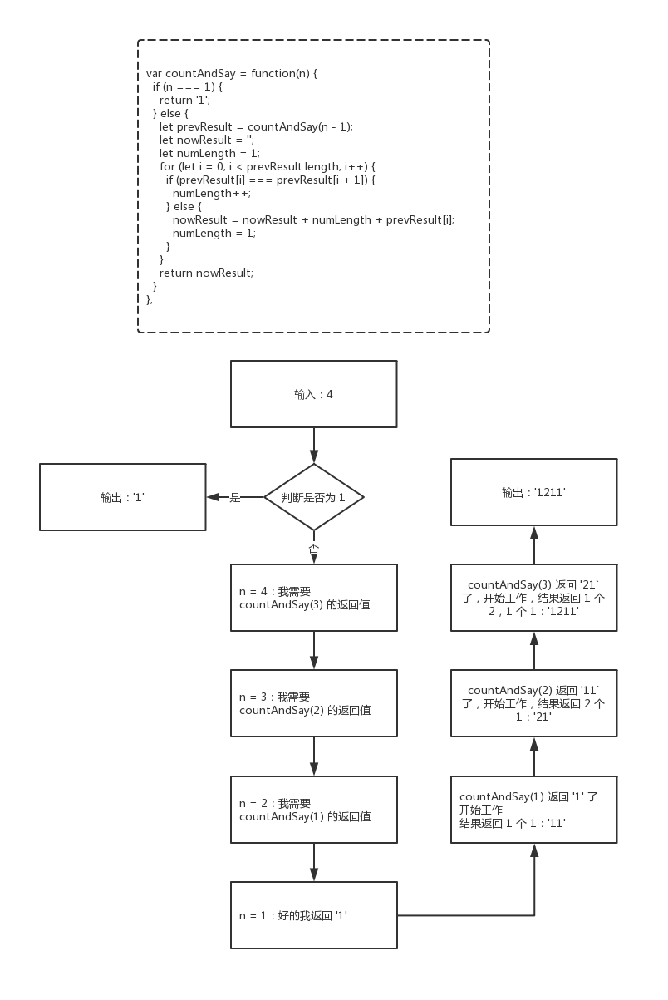

038 - 报数（count-and-say）
===

> Create by **jsliang** on **2019-06-10 13:58:42**  
> Recently revised in **2019-06-10 15:06:56**

## <a name="chapter-one" id="chapter-one">一 目录</a>

**不折腾的前端，和咸鱼有什么区别**

| 目录 |
| --- | 
| [一 目录](#chapter-one) | 
| <a name="catalog-chapter-two" id="catalog-chapter-two"></a>[二 前言](#chapter-two) |
| <a name="catalog-chapter-three" id="catalog-chapter-three"></a>[三 解题](#chapter-three) |
| &emsp;[3.1 解法 - 暴力破解](#chapter-three-one) |
| &emsp;[3.2 解法 - 递归调用](#chapter-three-two) |

## <a name="chapter-two" id="chapter-two">二 前言</a>

> [返回目录](#chapter-one)

* **难度**：简单
* **涉及知识**：字符串
* **题目地址**：https://leetcode-cn.com/problems/count-and-say/
* **题目内容**：

```
报数序列是一个整数序列，按照其中的整数的顺序进行报数，得到下一个数。其前五项如下：

1.     1
2.     11
3.     21
4.     1211
5.     111221
1 被读作  "one 1"  ("一个一") , 即 11。
11 被读作 "two 1s" ("两个一"）, 即 21。
21 被读作 "one 2",  "one 1" （"一个二" ,  "一个一") , 即 1211。

给定一个正整数 n（1 ≤ n ≤ 30），输出报数序列的第 n 项。

注意：整数顺序将表示为一个字符串。

 

示例 1:
输入: 1
输出: "1"

示例 2:
输入: 4
输出: "1211"
```

* **题意解读**：

这道题的思路是有点绕 rap 的，所以在这里给小伙伴们解读下。

* 1：当它是 `1` 的时候，我们就返回字符串 `'1'`（`1`）
* 2：当它是 `2` 的时候，我们就对 `1` 报数，即 `1` 个 `1`（`11`）
* 3：当它是 `3` 的时候，我们就对 `2` 报数，即 `2` 个 `1`（`21`）
* 4：当它是 `4` 的时候，我们就对 `3` 报数，即 `1` 个 `2` 加上 `1` 个 `1`（`1211`）
* 5：当它是 `5` 的时候，我们就对 `4` 报数，即 `1` 个 `1` 加上 `1` 个 `2` 加上 `2` 个 `1`（`111221`）
* 以此类推……

## <a name="chapter-three" id="chapter-three">三 解题</a>

> [返回目录](#chapter-one)

小伙伴可以先自己在本地尝试解题，再回来看看 **jsliang** 讲解下使用 JavaScript 的解题思路。

### <a name="chapter-three-one" id="chapter-three-one">3.1 解法 - 暴力破解</a>

> [返回目录](#chapter-one)

* **解题代码**：

```js
var countAndSay = function(n) {
  switch (n) {
    case 1:
      return '1';
    case 2:
      return '11';
    case 3:
      return '21';
    case 4:
      return '1211';
    case 5:
      return '111221';
    case 6:
      return '312211';
    case 7:
      return '13112221';
    case 8:
      return '1113213211';
    case 9:
      return '31131211131221';
    case 10:
      return '13211311123113112211';
    case 11:
      return '11131221133112132113212221';
    case 12:
      return '3113112221232112111312211312113211';
    case 13:
      return '1321132132111213122112311311222113111221131221';
    case 14:
      return '11131221131211131231121113112221121321132132211331222113112211';
    case 15:
      return '311311222113111231131112132112311321322112111312211312111322212311322113212221';
    case 16:
      return '132113213221133112132113311211131221121321131211132221123113112221131112311332111213211322211312113211';
    case 17:
      return '11131221131211132221232112111312212321123113112221121113122113111231133221121321132132211331121321231231121113122113322113111221131221';
    case 18:
      return '31131122211311123113321112131221123113112211121312211213211321322112311311222113311213212322211211131221131211132221232112111312111213111213211231131122212322211331222113112211';
    case 19:
      return '1321132132211331121321231231121113112221121321132122311211131122211211131221131211132221121321132132212321121113121112133221123113112221131112311332111213122112311311123112111331121113122112132113213211121332212311322113212221';
    case 20:
      return '11131221131211132221232112111312111213111213211231132132211211131221131211221321123113213221123113112221131112311332211211131221131211132211121312211231131112311211232221121321132132211331121321231231121113112221121321133112132112312321123113112221121113122113121113123112112322111213211322211312113211';
    case 21:
      return '311311222113111231133211121312211231131112311211133112111312211213211312111322211231131122211311122122111312211213211312111322211213211321322113311213212322211231131122211311123113223112111311222112132113311213211221121332211211131221131211132221232112111312111213111213211231132132211211131221232112111312211213111213122112132113213221123113112221131112311311121321122112132231121113122113322113111221131221';
    case 22:
      return '132113213221133112132123123112111311222112132113311213211231232112311311222112111312211311123113322112132113213221133122112231131122211211131221131112311332211211131221131211132221232112111312111213322112132113213221133112132113221321123113213221121113122123211211131221222112112322211231131122211311123113321112131221123113111231121113311211131221121321131211132221123113112211121312211231131122211211133112111311222112111312211312111322211213211321322113311213211331121113122122211211132213211231131122212322211331222113112211';
    case 23:
      return '111312211312111322212321121113121112131112132112311321322112111312212321121113122112131112131221121321132132211231131122211331121321232221121113122113121113222123112221221321132132211231131122211331121321232221123113112221131112311332111213122112311311123112112322211211131221131211132221232112111312211322111312211213211312111322211231131122111213122112311311221132211221121332211213211321322113311213212312311211131122211213211331121321123123211231131122211211131221131112311332211213211321223112111311222112132113213221123123211231132132211231131122211311123113322112111312211312111322212321121113122123211231131122113221123113221113122112132113213211121332212311322113212221';
    case 24:
      return '3113112221131112311332111213122112311311123112111331121113122112132113121113222112311311221112131221123113112221121113311211131122211211131221131211132221121321132132212321121113121112133221123113112221131112311332111213213211221113122113121113222112132113213221232112111312111213322112132113213221133112132123123112111311222112132113311213211221121332211231131122211311123113321112131221123113112221132231131122211211131221131112311332211213211321223112111311222112132113212221132221222112112322211211131221131211132221232112111312111213111213211231132132211211131221232112111312211213111213122112132113213221123113112221133112132123222112111312211312112213211231132132211211131221131211132221121311121312211213211312111322211213211321322113311213212322211231131122211311123113321112131221123113112211121312211213211321222113222112132113223113112221121113122113121113123112112322111213211322211312113211';
    case 25:
      return '132113213221133112132123123112111311222112132113311213211231232112311311222112111312211311123113322112132113212231121113112221121321132132211231232112311321322112311311222113111231133221121113122113121113221112131221123113111231121123222112132113213221133112132123123112111312111312212231131122211311123113322112111312211312111322111213122112311311123112112322211211131221131211132221232112111312111213111213211231132132211211131221232112111312212221121123222112132113213221133112132123123112111311222112132113213221132213211321322112311311222113311213212322211211131221131211221321123113213221121113122113121132211332113221122112133221123113112221131112311332111213122112311311123112111331121113122112132113121113222112311311221112131221123113112221121113311211131122211211131221131211132221121321132132212321121113121112133221123113112221131112212211131221121321131211132221123113112221131112311332211211133112111311222112111312211311123113322112111312211312111322212321121113121112133221121321132132211331121321231231121113112221121321132122311211131122211211131221131211322113322112111312211322132113213221123113112221131112311311121321122112132231121113122113322113111221131221';
    case 26:
      return '1113122113121113222123211211131211121311121321123113213221121113122123211211131221121311121312211213211321322112311311222113311213212322211211131221131211221321123113213221121113122113121113222112131112131221121321131211132221121321132132211331121321232221123113112221131112311322311211131122211213211331121321122112133221121113122113121113222123211211131211121311121321123113111231131122112213211321322113311213212322211231131122211311123113223112111311222112132113311213211221121332211231131122211311123113321112131221123113111231121113311211131221121321131211132221123113112211121312211231131122113221122112133221121113122113121113222123211211131211121311121321123113213221121113122113121113222113221113122113121113222112132113213221232112111312111213322112311311222113111221221113122112132113121113222112311311222113111221132221231221132221222112112322211213211321322113311213212312311211131122211213211331121321123123211231131122211211131221131112311332211213211321223112111311222112132113213221123123211231132132211231131122211311123113322112111312211312111322111213122112311311123112112322211213211321322113312211223113112221121113122113111231133221121321132132211331121321232221123123211231132132211231131122211331121321232221123113112221131112311332111213122112311311123112112322211211131221131211132221232112111312111213111213211231132132211211131221131211221321123113213221123113112221131112211322212322211231131122211322111312211312111322211213211321322113311213211331121113122122211211132213211231131122212322211331222113112211';
    case 27:
      return '31131122211311123113321112131221123113111231121113311211131221121321131211132221123113112211121312211231131122211211133112111311222112111312211312111322211213211321322123211211131211121332211231131122211311122122111312211213211312111322211231131122211311123113322112111331121113112221121113122113111231133221121113122113121113222123211211131211121332211213211321322113311213211322132112311321322112111312212321121113122122211211232221123113112221131112311332111213122112311311123112111331121113122112132113311213211321222122111312211312111322212321121113121112133221121321132132211331121321132213211231132132211211131221232112111312212221121123222112132113213221133112132123123112111311222112132113311213211231232112311311222112111312211311123113322112132113212231121113112221121321132122211322212221121123222112311311222113111231133211121312211231131112311211133112111312211213211312111322211231131122211311123113322113223113112221131112311332211211131221131211132211121312211231131112311211232221121321132132211331221122311311222112111312211311123113322112132113213221133122211332111213112221133211322112211213322112111312211312111322212321121113121112131112132112311321322112111312212321121113122112131112131221121321132132211231131122211331121321232221121113122113121122132112311321322112111312211312111322211213111213122112132113121113222112132113213221133112132123222112311311222113111231132231121113112221121321133112132112211213322112111312211312111322212311222122132113213221123113112221133112132123222112111312211312111322212321121113121112133221121311121312211213211312111322211213211321322123211211131211121332211213211321322113311213212312311211131122211213211331121321122112133221123113112221131112311332111213122112311311123112111331121113122112132113121113222112311311222113111221221113122112132113121113222112132113213221133122211332111213322112132113213221132231131122211311123113322112111312211312111322212321121113122123211231131122113221123113221113122112132113213211121332212311322113212221';
    case 28:
      return '13211321322113311213212312311211131122211213211331121321123123211231131122211211131221131112311332211213211321223112111311222112132113213221123123211231132132211231131122211311123113322112111312211312111322111213122112311311123112112322211213211321322113312211223113112221121113122113111231133221121321132132211331121321232221123123211231132132211231131122211331121321232221123113112221131112311332111213122112311311123112112322211211131221131211132221232112111312211322111312211213211312111322211231131122111213122112311311221132211221121332211213211321322113311213212312311211131122211213211331121321123123211231131122211211131221232112111312211312113211223113112221131112311332111213122112311311123112112322211211131221131211132221232112111312211322111312211213211312111322211231131122111213122112311311221132211221121332211211131221131211132221232112111312111213111213211231132132211211131221232112111312211213111213122112132113213221123113112221133112132123222112111312211312112213211231132132211211131221131211322113321132211221121332211213211321322113311213212312311211131122211213211331121321123123211231131122211211131221131112311332211213211321322113311213212322211322132113213221133112132123222112311311222113111231132231121113112221121321133112132112211213322112111312211312111322212311222122132113213221123113112221133112132123222112111312211312111322212311322123123112111321322123122113222122211211232221123113112221131112311332111213122112311311123112111331121113122112132113121113222112311311221112131221123113112221121113311211131122211211131221131211132221121321132132212321121113121112133221123113112221131112212211131221121321131211132221123113112221131112311332211211133112111311222112111312211311123113322112111312211312111322212321121113121112133221121321132132211331121321132213211231132132211211131221232112111312212221121123222112311311222113111231133211121321321122111312211312111322211213211321322123211211131211121332211231131122211311123113321112131221123113111231121123222112111331121113112221121113122113111231133221121113122113121113221112131221123113111231121123222112111312211312111322212321121113121112131112132112311321322112111312212321121113122122211211232221121321132132211331121321231231121113112221121321133112132112312321123113112221121113122113111231133221121321132132211331221122311311222112111312211311123113322112111312211312111322212311322123123112112322211211131221131211132221132213211321322113311213212322211231131122211311123113321112131221123113112211121312211213211321222113222112132113223113112221121113122113121113123112112322111213211322211312113211';
    case 29:
      return '11131221131211132221232112111312111213111213211231132132211211131221232112111312211213111213122112132113213221123113112221133112132123222112111312211312112213211231132132211211131221131211132221121311121312211213211312111322211213211321322113311213212322211231131122211311123113223112111311222112132113311213211221121332211211131221131211132221231122212213211321322112311311222113311213212322211211131221131211132221232112111312111213322112131112131221121321131211132221121321132132212321121113121112133221121321132132211331121321231231121113112221121321133112132112211213322112311311222113111231133211121312211231131122211322311311222112111312211311123113322112132113212231121113112221121321132122211322212221121123222112111312211312111322212321121113121112131112132112311321322112111312212321121113122112131112131221121321132132211231131122111213122112311311222113111221131221221321132132211331121321231231121113112221121321133112132112211213322112311311222113111231133211121312211231131122211322311311222112111312211311123113322112132113212231121113112221121321132122211322212221121123222112311311222113111231133211121312211231131112311211133112111312211213211312111322211231131122111213122112311311222112111331121113112221121113122113121113222112132113213221232112111312111213322112311311222113111221221113122112132113121113222112311311222113111221132221231221132221222112112322211211131221131211132221232112111312111213111213211231132132211211131221232112111312211213111213122112132113213221123113112221133112132123222112111312211312111322212321121113121112133221132211131221131211132221232112111312111213322112132113213221133112132113221321123113213221121113122123211211131221222112112322211231131122211311123113321112132132112211131221131211132221121321132132212321121113121112133221123113112221131112311332111213211322111213111213211231131211132211121311222113321132211221121332211213211321322113311213212312311211131122211213211331121321123123211231131122211211131221131112311332211213211321223112111311222112132113213221123123211231132132211231131122211311123113322112111312211312111322111213122112311311123112112322211213211321322113312211223113112221121113122113111231133221121321132132211331121321232221123123211231132132211231131122211331121321232221123113112221131112311332111213122112311311123112112322211211131221131211132221232112111312211322111312211213211312111322211231131122111213122112311311221132211221121332211213211321322113311213212312311211131211131221223113112221131112311332211211131221131211132211121312211231131112311211232221121321132132211331121321231231121113112221121321133112132112211213322112312321123113213221123113112221133112132123222112311311222113111231132231121113112221121321133112132112211213322112311311222113111231133211121312211231131112311211133112111312211213211312111322211231131122111213122112311311221132211221121332211211131221131211132221232112111312111213111213211231132132211211131221232112111312211213111213122112132113213221123113112221133112132123222112111312211312111322212311222122132113213221123113112221133112132123222112311311222113111231133211121321132211121311121321122112133221123113112221131112311332211322111312211312111322212321121113121112133221121321132132211331121321231231121113112221121321132122311211131122211211131221131211322113322112111312211322132113213221123113112221131112311311121321122112132231121113122113322113111221131221';
    case 30:
      return '3113112221131112311332111213122112311311123112111331121113122112132113121113222112311311221112131221123113112221121113311211131122211211131221131211132221121321132132212321121113121112133221123113112221131112212211131221121321131211132221123113112221131112311332211211133112111311222112111312211311123113322112111312211312111322212321121113121112133221121321132132211331121321132213211231132132211211131221232112111312212221121123222112311311222113111231133211121321321122111312211312111322211213211321322123211211131211121332211231131122211311123113321112131221123113111231121123222112111331121113112221121113122113111231133221121113122113121113221112131221123113111231121123222112111312211312111322212321121113121112131112132112311321322112111312212321121113122122211211232221121321132132211331121321231231121113112221121321132132211322132113213221123113112221133112132123222112111312211312112213211231132132211211131221131211322113321132211221121332211231131122211311123113321112131221123113111231121113311211131221121321131211132221123113112211121312211231131122211211133112111311222112111312211312111322211213211321223112111311222112132113213221133122211311221122111312211312111322212321121113121112131112132112311321322112111312212321121113122122211211232221121321132132211331121321231231121113112221121321132132211322132113213221123113112221133112132123222112111312211312112213211231132132211211131221131211322113321132211221121332211213211321322113311213212312311211131122211213211331121321123123211231131122211211131221131112311332211213211321223112111311222112132113213221123123211231132132211231131122211311123113322112111312211312111322111213122112311311123112112322211213211321322113312211223113112221121113122113111231133221121321132132211331222113321112131122211332113221122112133221123113112221131112311332111213122112311311123112111331121113122112132113121113222112311311221112131221123113112221121113311211131122211211131221131211132221121321132132212321121113121112133221123113112221131112311332111213122112311311123112112322211322311311222113111231133211121312211231131112311211232221121113122113121113222123211211131221132211131221121321131211132221123113112211121312211231131122113221122112133221121321132132211331121321231231121113121113122122311311222113111231133221121113122113121113221112131221123113111231121123222112132113213221133112132123123112111312211322311211133112111312211213211311123113223112111321322123122113222122211211232221121113122113121113222123211211131211121311121321123113213221121113122123211211131221121311121312211213211321322112311311222113311213212322211211131221131211221321123113213221121113122113121113222112131112131221121321131211132221121321132132211331121321232221123113112221131112311322311211131122211213211331121321122112133221121113122113121113222123112221221321132132211231131122211331121321232221121113122113121113222123211211131211121332211213111213122112132113121113222112132113213221232112111312111213322112132113213221133112132123123112111311222112132113311213211221121332211231131122211311123113321112131221123113112221132231131122211211131221131112311332211213211321223112111311222112132113212221132221222112112322211211131221131211132221232112111312111213111213211231131112311311221122132113213221133112132123222112311311222113111231132231121113112221121321133112132112211213322112111312211312111322212321121113121112131112132112311321322112111312212321121113122122211211232221121311121312211213211312111322211213211321322123211211131211121332211213211321322113311213211322132112311321322112111312212321121113122122211211232221121321132132211331121321231231121113112221121321133112132112312321123113112221121113122113111231133221121321132122311211131122211213211321222113222122211211232221123113112221131112311332111213122112311311123112111331121113122112132113121113222112311311221112131221123113112221121113311211131122211211131221131211132221121321132132212321121113121112133221123113112221131112311332111213213211221113122113121113222112132113213221232112111312111213322112132113213221133112132123123112111312211322311211133112111312212221121123222112132113213221133112132123222113223113112221131112311332111213122112311311123112112322211211131221131211132221232112111312111213111213211231132132211211131221131211221321123113213221123113112221131112211322212322211231131122211322111312211312111322211213211321322113311213211331121113122122211211132213211231131122212322211331222113112211';
  }
};
```

* **执行测试**：

1. `n`：`4`
2. `return`：

```js
1211
```

* **LeetCode Submit**：

```js
✔ Accepted
  ✔ 18/18 cases passed (72 ms)
  ✔ Your runtime beats 97.8 % of javascript submissions
  ✔ Your memory usage beats 91.4 % of javascript submissions (34.2 MB)
```

* **解题思路**：

这是 **jsliang** 看到最炫的解题方法了，帅得嘛就不谈了，总共 30 种情况，直接上暴力破解，省时省力。

### <a name="chapter-three-two" id="chapter-three-two">3.2 解法 - 递归调用</a>

> [返回目录](#chapter-one)

* **解题代码**：

```js
var countAndSay = function(n) {
  if (n === 1) {
    return '1';
  } else {
    let prevResult = countAndSay(n - 1);
    let nowResult = '';
    let numLength = 1;

    for (let i = 0; i < prevResult.length; i++) {
      if (prevResult[i] === prevResult[i + 1]) {
        numLength++;
      } else {
        nowResult = nowResult + numLength + prevResult[i];
        numLength = 1;
      }
    }

    return nowResult;
  }
};
```

* **执行测试**：

1. `n`：`4`
2. `return`：

```js
1211
```

* **LeetCode Submit**：

```js
✔ Accepted
  ✔ 18/18 cases passed (112 ms)
  ✔ Your runtime beats 37.95 % of javascript submissions
  ✔ Your memory usage beats 65.8 % of javascript submissions (35.2 MB)
```

* **解题思路**：

**首先**，如果你看懂了 **jsliang** 在前言中写的 **题意解读**，并且有点递归的知识，那么这道题的解法你基本就懂了，看了一眼上面的代码就通了。

**然后**，如果你不懂，OK，咱们讲讲：



**最后**，我们直接把结果返回出来就 OK 了。

---

**不折腾的前端，和咸鱼有什么区别！**


**jsliang** 会每天更新一道 LeetCode 题解，或者发表最新前端攻略，扫描上方二维码，关注 **jsliang** 的公众号，让我们一起折腾！

> <a rel="license" href="http://creativecommons.org/licenses/by-nc-sa/4.0/"></a><br /><span xmlns:dct="http://purl.org/dc/terms/" property="dct:title">jsliang 的文档库</span> 由 <a xmlns:cc="http://creativecommons.org/ns#" href="https://github.com/LiangJunrong/document-library" property="cc:attributionName" rel="cc:attributionURL">梁峻荣</a> 采用 <a rel="license" href="http://creativecommons.org/licenses/by-nc-sa/4.0/">知识共享 署名-非商业性使用-相同方式共享 4.0 国际 许可协议</a>进行许可。<br />基于<a xmlns:dct="http://purl.org/dc/terms/" href="https://github.com/LiangJunrong/document-library" rel="dct:source">https://github.com/LiangJunrong/document-library</a>上的作品创作。<br />本许可协议授权之外的使用权限可以从 <a xmlns:cc="http://creativecommons.org/ns#" href="https://creativecommons.org/licenses/by-nc-sa/2.5/cn/" rel="cc:morePermissions">https://creativecommons.org/licenses/by-nc-sa/2.5/cn/</a> 处获得。