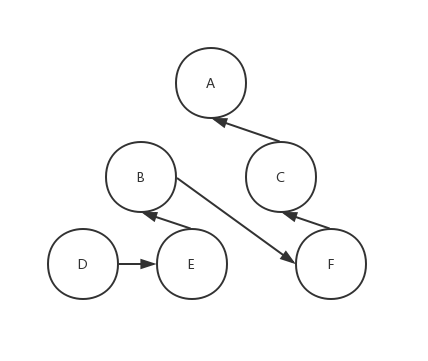

108 - 将有序数组转换为二叉搜索树（convert-sorted-array-to-binary-search-tree）
===

> Create by **jsliang** on **2019-06-17 08:57:03**  
> Recently revised in **2019-6-22 07:41:48**

## <a name="chapter-one" id="chapter-one">一 目录</a>

**不折腾的前端，和咸鱼有什么区别**

| 目录 |
| --- | 
| [一 目录](#chapter-one) | 
| <a name="catalog-chapter-two" id="catalog-chapter-two"></a>[二 前言](#chapter-two) |
| <a name="catalog-chapter-three" id="catalog-chapter-three"></a>[三 解题](#chapter-three) |
| &emsp;[3.1 解法 - 后序遍历](#chapter-three-one) |
| &emsp;[3.2 解法 - 后序遍历（简化）](#chapter-three-two) |

## <a name="chapter-two" id="chapter-two">二 前言</a>

> [返回目录](#chapter-one)

* **难度**：简单
* **涉及知识**：树、深度优先搜索
* **题目地址**：https://leetcode-cn.com/problems/convert-sorted-array-to-binary-search-tree/
* **题目内容**：

```
将一个按照升序排列的有序数组，转换为一棵高度平衡二叉搜索树。

本题中，一个高度平衡二叉树是指一个二叉树每个节点 的左右两个子树的高度差的绝对值不超过 1。

示例:

给定有序数组: [-10,-3,0,5,9],

一个可能的答案是：[0,-3,9,-10,null,5]，它可以表示下面这个高度平衡二叉搜索树：

      0
     / \
   -3   9
   /   /
 -10  5
```

## <a name="chapter-three" id="chapter-three">三 解题</a>

> [返回目录](#chapter-one)

小伙伴可以先自己在本地尝试解题，再回来看看 **jsliang** 的解题思路。

### <a name="chapter-three-one" id="chapter-three-one">3.1 解法 - 后序遍历</a>

> [返回目录](#chapter-one)

* **解题代码**：

```js
var sortedArrayToBST = function(nums) {
  let sort = (left, right) => {
    if (left > right) {
      return null;
    }
    let m = left + Math.floor((right - left) / 2);
    let node = {
      val: nums[m],
      left: sort(left, m - 1),
      right: sort(m + 1, right),
    }
    return node;
  };
  return sort(0, nums.length - 1);
};
```

* **执行测试**：

1. `nums`：`[-10, -3, 0, 1, 5, 9]`
2. `return`：

```js
{ val: 0,
  left:
   { val: -10,
     left: null,
     right: { val: -3, left: null, right: null } },
  right:
   { val: 5,
     left: { val: 1, left: null, right: null },
     right: { val: 9, left: null, right: null } } }
```

* **LeetCode Submit**：

```js
√ Accepted
  √ 32/32 cases passed (100 ms)
  √ Your runtime beats 92.7 % of javascript submissions
  √ Your memory usage beats 25.53 % of javascript submissions (37.8 MB)
```

* **知识点**：

1. `Math`：JS 中的内置对象，具有数学常数和函数的属性和方法。[`Math` 详细介绍](https://github.com/LiangJunrong/document-library/blob/master/JavaScript-library/JavaScript/Object/Math.md)

* **解题思路**：

**首先**，这次解题涉及到一个名词，叫 **后序遍历**，希望了解更多的小伙伴，可以百度了解更多，这里仅做简单介绍。

* **后序遍历**：**后序遍历**（LRD）是二叉树遍历的一种，也叫作后根遍历、后序周游。在 **后序遍历** 中，它会先访问左节点，再访问右节点，最后访问根节点。

话再多还不如上图：


现在，有这样一棵树如上所示，那么，它怎么通过后序遍历来访问节点的呢？



按照我们所说的，遍历步骤是：D -> E -> B -> F -> C -> A。

很好，看到这里，你应该对后续遍历有个大致的映像了，如果你还没通，别急，咱们看代码：

```js
var sortedArrayToBST = function(nums) {
  let sort = (left, right) => {
    if (left > right) {
      return null;
    }
    let m = left + Math.floor((right - left) / 2);
    let node = {
      val: nums[m],
      left: sort(left, m - 1),
      right: sort(m + 1, right),
    }
    console.log("------");
    console.log(`${left} ${right}`);
    console.log(node);
    return node;
  };
  return sort(0, nums.length - 1);
};

sortedArrayToBST([-10, -3, 0, 1, 5, 9]);
```

在这里，我们进行了 `console` 打印，那么小伙伴可以先想下，它会打印出什么来：

```js
------
1 1
{ val: -3, left: null, right: null }
------
0 1
{ val: -10,
  left: null,
  right: { val: -3, left: null, right: null } }
------
3 3
{ val: 1, left: null, right: null }
------
5 5
{ val: 9, left: null, right: null }
------
3 5
{ val: 5,
  left: { val: 1, left: null, right: null },
  right: { val: 9, left: null, right: null } }
------
0 5
{ val: 0,
  left:
   { val: -10,
     left: null,
     right: { val: -3, left: null, right: null } },
  right:
   { val: 5,
     left: { val: 1, left: null, right: null },
     right: { val: 9, left: null, right: null } } }
```

OK，看到这里，小伙伴们应该有谱了，是怎么跑起来的。

那么，回归这道题本质，我们还能不能找到其他方法呢？

### <a name="chapter-three-two" id="chapter-three-two">3.2 解法 - 后序遍历（简化）</a>

> [返回目录](#chapter-one)

* **解题代码**：

```js
var sortedArrayToBST = function(nums) {
  if (!nums.length) return null;
  let mid = Math.floor(nums.length / 2);
  let root = {
    val: nums[mid],
    left: sortedArrayToBST(nums.slice(0, mid)),
    right: sortedArrayToBST(nums.slice(mid + 1)),
  }
  return root;
};
```

* **执行测试**：

1. `nums`：`[-10, -3, 0, 1, 5, 9]`
2. `return`：

```js
{ val: 1,
  left:
   { val: -3,
     left: { val: -10, left: null, right: null },
     right: { val: 0, left: null, right: null } },
  right:
   { val: 9,
     left: { val: 5, left: null, right: null },
     right: null } }
```

* **LeetCode Submit**：

```js
✔ Accepted
  ✔ 32/32 cases passed (108 ms)
  ✔ Your runtime beats 84.88 % of javascript submissions
  ✔ Your memory usage beats 66.67 % of javascript submissions (37.5 MB)
```

* **知识点**：

1. `Math`：JS 中的内置对象，具有数学常数和函数的属性和方法。[`Math` 详细介绍](https://github.com/LiangJunrong/document-library/blob/master/JavaScript-library/JavaScript/Object/Math.md)

* **解题思路**：

经过上面一节的提示，这节小伙伴们可能就需要自己思考了：

```js
var sortedArrayToBST = function(nums) {
  if (!nums.length) return null;
  let mid = Math.floor(nums.length / 2);
  let root = {
    val: nums[mid],
    left: sortedArrayToBST(nums.slice(0, mid)),
    right: sortedArrayToBST(nums.slice(mid + 1)),
  }
  console.log('------');
  console.log(root);
  return root;
};

sortedArrayToBST([-10, -3, 0, 1, 5, 9]);
```

这次打印会输出什么？

```js
------
{ val: -10, left: null, right: null }
------
{ val: 0, left: null, right: null }
------
{ val: -3,
  left: { val: -10, left: null, right: null },
  right: { val: 0, left: null, right: null } }
------
{ val: 5, left: null, right: null }
------
{ val: 9,
  left: { val: 5, left: null, right: null },
  right: null }
------
{ val: 1,
  left:
   { val: -3,
     left: { val: -10, left: null, right: null },
     right: { val: 0, left: null, right: null } },
  right:
   { val: 9,
     left: { val: 5, left: null, right: null },
     right: null } }
```

这样，我们就完成了本次的解题，下期再会~

---

**不折腾的前端，和咸鱼有什么区别！**


**jsliang** 会每天更新一道 LeetCode 题解，从而帮助小伙伴们夯实原生 JS 基础，了解与学习算法与数据结构。

扫描上方二维码，关注 **jsliang** 的公众号，让我们一起折腾！

> <a rel="license" href="http://creativecommons.org/licenses/by-nc-sa/4.0/"></a><br /><span xmlns:dct="http://purl.org/dc/terms/" property="dct:title">jsliang 的文档库</span> 由 <a xmlns:cc="http://creativecommons.org/ns#" href="https://github.com/LiangJunrong/document-library" property="cc:attributionName" rel="cc:attributionURL">梁峻荣</a> 采用 <a rel="license" href="http://creativecommons.org/licenses/by-nc-sa/4.0/">知识共享 署名-非商业性使用-相同方式共享 4.0 国际 许可协议</a>进行许可。<br />基于<a xmlns:dct="http://purl.org/dc/terms/" href="https://github.com/LiangJunrong/document-library" rel="dct:source">https://github.com/LiangJunrong/document-library</a>上的作品创作。<br />本许可协议授权之外的使用权限可以从 <a xmlns:cc="http://creativecommons.org/ns#" href="https://creativecommons.org/licenses/by-nc-sa/2.5/cn/" rel="cc:morePermissions">https://creativecommons.org/licenses/by-nc-sa/2.5/cn/</a> 处获得。