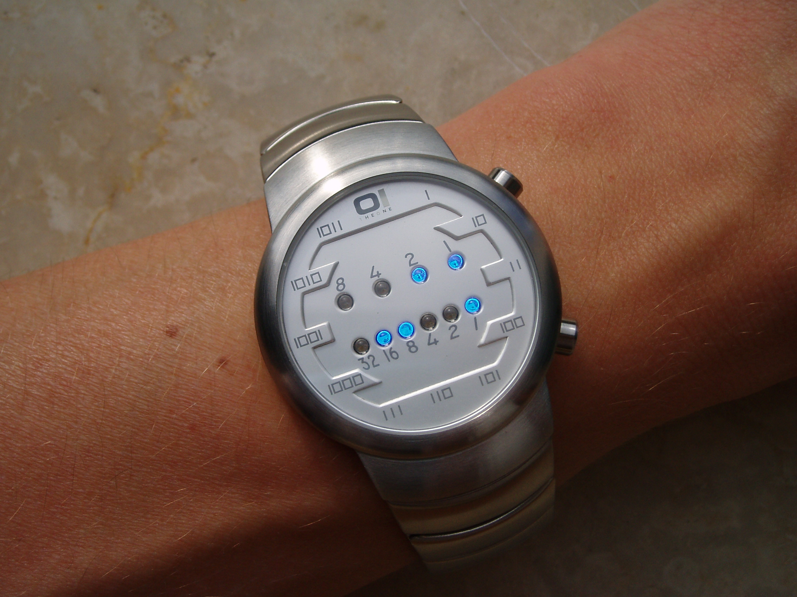

401 - 二进制手表（binary-watch）
===

> Create by **jsliang** on **2019-7-24 08:26:47**  
> Recently revised in **2019-07-24 19:55:14**

## <a name="chapter-one" id="chapter-one">一 目录</a>

**不折腾的前端，和咸鱼有什么区别**

| 目录 |
| --- | 
| [一 目录](#chapter-one) | 
| <a name="catalog-chapter-two" id="catalog-chapter-two"></a>[二 前言](#chapter-two) |
| <a name="catalog-chapter-three" id="catalog-chapter-three"></a>[三 解题](#chapter-three) |
| <a name="catalog-chapter-four" id="catalog-chapter-four"></a>[四 执行测试](#chapter-four) |
| <a name="catalog-chapter-five" id="catalog-chapter-five"></a>[五 LeetCode Submit](#chapter-five) |
| <a name="catalog-chapter-six" id="catalog-chapter-six"></a>[六 知识点](#chapter-six) |
| <a name="catalog-chapter-seven" id="catalog-chapter-seven"></a>[七 解题思路](#chapter-seven) |
| <a name="catalog-chapter-eight" id="catalog-chapter-eight"></a>[八 进一步思考](#chapter-eight) |

## <a name="chapter-two" id="chapter-two">二 前言</a>

> [返回目录](#chapter-one)

* **难度**：简单
* **涉及知识**：位运算、回溯算法
* **题目地址**：https://leetcode-cn.com/problems/binary-watch/
* **题目内容**：

二进制手表顶部有 4 个 LED 代表小时（0-11），底部的 6 个 LED 代表分钟（0-59）。

每个 LED 代表一个 0 或 1，最低位在右侧。



例如，上面的二进制手表读取 “3:25”。

给定一个非负整数 n 代表当前 LED 亮着的数量，返回所有可能的时间。

案例:

输入: n = 1

返回: ["1:00", "2:00", "4:00", "8:00", "0:01", "0:02", "0:04", "0:08", "0:16", "0:32"]
 

注意事项:

输出的顺序没有要求。

小时不会以零开头，比如 “01:00” 是不允许的，应为 “1:00”。

分钟必须由两位数组成，可能会以零开头，比如 “10:2” 是无效的，应为 “10:02”。

## <a name="chapter-three" id="chapter-three">三 解题</a>

> [返回目录](#chapter-one)

小伙伴可以先自己在本地尝试解题，再回来看看 **jsliang** 的解题思路。

* **解题代码**：

```js

```

## <a name="chapter-four" id="chapter-four">四 执行测试</a>

> [返回目录](#chapter-one)

1. 形参 1
2. 形参 2
3. `return`：

```js

```

## <a name="chapter-five" id="chapter-five">五 LeetCode Submit</a>

> [返回目录](#chapter-one)

```js

```

## <a name="chapter-six" id="chapter-six">六 知识点</a>

> [返回目录](#chapter-one)

1. 

## <a name="chapter-seven" id="chapter-seven">七 解题思路</a>

> [返回目录](#chapter-one)

**有趣的人不管在哪都会让人身心愉悦，有趣的题会让你忍不住解析它。**

**首先**，这是道非常有意思的题目，让人忍不住想解析题目：

```js
var readBinaryWatch = function(num) {
  const hour = [1, 2, 4, 8];
  const minute = [1, 2, 4, 8, 16, 32];
};
```

第一步先拆分，它的时钟和分钟分解为代码如上所示。

**然后**，我们要清楚它的灯数限制：

1. 最小为 0 个灯，表明为 `0:00`。
2. 最多为 8 个灯，即 `hour = 1 + 2 + 8`，`minute = 1 + 2 + 8 + 16 + 32`，为 `11:59`。

那么当中会发生什么情况呢，我们一一分析。

开始毫无思路，我们尝试下如果 `num` 为 `1`，怎么编写：

```js
var readBinaryWatch = function(num) {
  const hour = [1, 2, 4, 8];
  const minute = [1, 2, 4, 8, 16, 32];
  let result = [];
  for (let i = 0; i < num; i++) {
    result.push(hour[0] + ':00');
    result.push(hour[1] + ':00');
    result.push(hour[2] + ':00');
    result.push(hour[3] + ':00');
    result.push('0:0' + minute[0]);
    result.push('0:0' + minute[1]);
    result.push('0:0' + minute[2]);
    result.push('0:0' + minute[3]);
    result.push('0:' + minute[4]);
    result.push('0:' + minute[5]);
  }
  return result;
};
```

输出为：

```js
[ '1:00',
  '2:00',
  '4:00',
  '8:00',
  '0:01',
  '0:02',
  '0:04',
  '0:08',
  '0:16',
  '0:32' ]
```

很好，那么考虑 `num` 为 2 及以上的情况。

> 下面过程为分析，可以往下跳

1. `num === 1`：`hour` 有 4 种情况，`minute` 有 6 种情况，`hour + minute` 为 0 种情况。
2. `num === 2`：`hour` 有 3 + 2 + 1 - 1 种情况（不能为 4 + 8），`minute` 有 5 + 4 + 3 + 2 + 1 种情况，`hour + minute` 有 4 * 6 种情况。
3. `num === 3`：`hour` 有 2 + 1 - 1 种情况（不能为 2 + 4 + 8），`minute` 有 4 + 3 + 2 + 1 种情况，`hour + minute` 有 (4 + (3 + 2 + 1 - 1)) + (6 + (5 + 4 + 3 + 2 + 1)) 种情况。
4. `num === 4`：`hour` 有 1 - 1 种情况（不能为 1 + 2 + 4 + 8），`minute` 有 3 + 2 + 1 - 1 种情况（不能为 4 + 8 + 16 + 32），`hour + minute` 有 (4) * （4 + 3 + 2 + 1） + (3 + 2 + 1 - 1) * (5 + 4 + 3 + 2 + 1) + (2 + 1 - 1 ) * (6) 种情况。
5. `num === 5`：`hour` 有 0 种情况，`minute` 有 2 + 1 - 1 种情况（不能为 2 + 4 + 8 + 16 + 32），`hour + minute` 有 (4) * (3 + 2 + 1 - 1) + (3 + 2 + 1 - 1) * (4 + 3 + 2 + 1) + (2 + 1 - 1) * (5 + 4 + 3 + 2 + 1) + (1 - 1) * (6) 种情况。
6. `num === 6`：`hour` 有 0 种情况，`minute` 有 1 - 1 种情况，`hour + minute` 有 (4) * (2 + 1 - 1) + (3 + 2 + 1 - 1) * (3 + 2 + 1 - 1) + (2 + 1 - 1) * (4 + 3 + 2 + 1) + (1 - 1) * (5 + 4 + 3 + 2 + 1) + (0) * (6) 种情况。
7. `num === 7`：`hour` 有 0 种情况，`minute` 有 0 种情况，`hour + minute` 有 (4) * (1 - 1) + (3 + 2 + 1 - 1) * (2 + 1 - 1) + (2 + 1 - 1) * (3 + 2 + 1 - 1) + (1 - 1) * (4 + 3 + 2 + 1) + (0) * (5 + 4 + 3 + 2 + 1) + (0) * (6) 种情况。
8. `num === 8`：……
9.  `num === 9`：这时候，最小的 `hour + minute` 的情况都不符合，所以最大为 8，过 9 不行（实际测试用例为 1 - 8）。

> 下面过程为总结，可以详细瞅瞅

总结：

* `readBinaryWatch(1)`：
  * `hour(1)`：4
  * `minute(1)`：6
  * `hour+minute(1)`：0
* `readBinaryWatch(2)`：
  * `hour(2)`：5
  * `minute(2)`：15
  * `hour+minute(2)`：`hour(1)` * `minute(1)`
* `readBinaryWatch(3)`：
  * `hour(3)`：2
  * `minute(3)`：10
  * `hour+minute(3)`：`hour(1)` * `minute(1)` + `hour(2)` * `minute(2)`
* ……

以上，即是我们研究的一种规律，话不多说，先尝试暴力破解：

```js
var readBinaryWatch = function (num) {
  switch (num) {
    case 0:
      return ['0:00'];
    case 1:
      return ['0:01', '0:02', '0:04', '0:08', '0:16', '0:32', '1:00', '2:00', '4:00', '8:00'];
    case 2:
      return ['0:03', '0:05', '0:06', '0:09', '0:10', '0:12', '0:17', '0:18', '0:20', '0:24', '0:33', '0:34', '0:36', '0:40', '0:48', '1:01', '1:02', '1:04', '1:08', '1:16', '1:32', '2:01', '2:02', '2:04', '2:08', '2:16', '2:32', '3:00', '4:01', '4:02', '4:04', '4:08', '4:16', '4:32', '5:00', '6:00', '8:01', '8:02', '8:04', '8:08', '8:16', '8:32', '9:00', '10:00'];
    case 3:
      return ['0:07', '0:11', '0:13', '0:14', '0:19', '0:21', '0:22', '0:25', '0:26', '0:28', '0:35', '0:37', '0:38', '0:41', '0:42', '0:44', '0:49', '0:50', '0:52', '0:56', '1:03', '1:05', '1:06', '1:09', '1:10', '1:12', '1:17', '1:18', '1:20', '1:24', '1:33', '1:34', '1:36', '1:40', '1:48', '2:03', '2:05', '2:06', '2:09', '2:10', '2:12', '2:17', '2:18', '2:20', '2:24', '2:33', '2:34', '2:36', '2:40', '2:48', '3:01', '3:02', '3:04', '3:08', '3:16', '3:32', '4:03', '4:05', '4:06', '4:09', '4:10', '4:12', '4:17', '4:18', '4:20', '4:24', '4:33', '4:34', '4:36', '4:40', '4:48', '5:01', '5:02', '5:04', '5:08', '5:16', '5:32', '6:01', '6:02', '6:04', '6:08', '6:16', '6:32', '7:00', '8:03', '8:05', '8:06', '8:09', '8:10', '8:12', '8:17', '8:18', '8:20', '8:24', '8:33', '8:34', '8:36', '8:40', '8:48', '9:01', '9:02', '9:04', '9:08', '9:16', '9:32', '10:01', '10:02', '10:04', '10:08', '10:16', '10:32', '11:00'];
    case 4:
      return ['0:15', '0:23', '0:27', '0:29', '0:30', '0:39', '0:43', '0:45', '0:46', '0:51', '0:53', '0:54', '0:57', '0:58', '1:07', '1:11', '1:13', '1:14', '1:19', '1:21', '1:22', '1:25', '1:26', '1:28', '1:35', '1:37', '1:38', '1:41', '1:42', '1:44', '1:49', '1:50', '1:52', '1:56', '2:07', '2:11', '2:13', '2:14', '2:19', '2:21', '2:22', '2:25', '2:26', '2:28', '2:35', '2:37', '2:38', '2:41', '2:42', '2:44', '2:49', '2:50', '2:52', '2:56', '3:03', '3:05', '3:06', '3:09', '3:10', '3:12', '3:17', '3:18', '3:20', '3:24', '3:33', '3:34', '3:36', '3:40', '3:48', '4:07', '4:11', '4:13', '4:14', '4:19', '4:21', '4:22', '4:25', '4:26', '4:28', '4:35', '4:37', '4:38', '4:41', '4:42', '4:44', '4:49', '4:50', '4:52', '4:56', '5:03', '5:05', '5:06', '5:09', '5:10', '5:12', '5:17', '5:18', '5:20', '5:24', '5:33', '5:34', '5:36', '5:40', '5:48', '6:03', '6:05', '6:06', '6:09', '6:10', '6:12', '6:17', '6:18', '6:20', '6:24', '6:33', '6:34', '6:36', '6:40', '6:48', '7:01', '7:02', '7:04', '7:08', '7:16', '7:32', '8:07', '8:11', '8:13', '8:14', '8:19', '8:21', '8:22', '8:25', '8:26', '8:28', '8:35', '8:37', '8:38', '8:41', '8:42', '8:44', '8:49', '8:50', '8:52', '8:56', '9:03', '9:05', '9:06', '9:09', '9:10', '9:12', '9:17', '9:18', '9:20', '9:24', '9:33', '9:34', '9:36', '9:40', '9:48', '10:03', '10:05', '10:06', '10:09', '10:10', '10:12', '10:17', '10:18', '10:20', '10:24', '10:33', '10:34', '10:36', '10:40', '10:48', '11:01', '11:02', '11:04', '11:08', '11:16', '11:32'];
    case 5:
      return ['0:31', '0:47', '0:55', '0:59', '1:15', '1:23', '1:27', '1:29', '1:30', '1:39', '1:43', '1:45', '1:46', '1:51', '1:53', '1:54', '1:57', '1:58', '2:15', '2:23', '2:27', '2:29', '2:30', '2:39', '2:43', '2:45', '2:46', '2:51', '2:53', '2:54', '2:57', '2:58', '3:07', '3:11', '3:13', '3:14', '3:19', '3:21', '3:22', '3:25', '3:26', '3:28', '3:35', '3:37', '3:38', '3:41', '3:42', '3:44', '3:49', '3:50', '3:52', '3:56', '4:15', '4:23', '4:27', '4:29', '4:30', '4:39', '4:43', '4:45', '4:46', '4:51', '4:53', '4:54', '4:57', '4:58', '5:07', '5:11', '5:13', '5:14', '5:19', '5:21', '5:22', '5:25', '5:26', '5:28', '5:35', '5:37', '5:38', '5:41', '5:42', '5:44', '5:49', '5:50', '5:52', '5:56', '6:07', '6:11', '6:13', '6:14', '6:19', '6:21', '6:22', '6:25', '6:26', '6:28', '6:35', '6:37', '6:38', '6:41', '6:42', '6:44', '6:49', '6:50', '6:52', '6:56', '7:03', '7:05', '7:06', '7:09', '7:10', '7:12', '7:17', '7:18', '7:20', '7:24', '7:33', '7:34', '7:36', '7:40', '7:48', '8:15', '8:23', '8:27', '8:29', '8:30', '8:39', '8:43', '8:45', '8:46', '8:51', '8:53', '8:54', '8:57', '8:58', '9:07', '9:11', '9:13', '9:14', '9:19', '9:21', '9:22', '9:25', '9:26', '9:28', '9:35', '9:37', '9:38', '9:41', '9:42', '9:44', '9:49', '9:50', '9:52', '9:56', '10:07', '10:11', '10:13', '10:14', '10:19', '10:21', '10:22', '10:25', '10:26', '10:28', '10:35', '10:37', '10:38', '10:41', '10:42', '10:44', '10:49', '10:50', '10:52', '10:56', '11:03', '11:05', '11:06', '11:09', '11:10', '11:12', '11:17', '11:18', '11:20', '11:24', '11:33', '11:34', '11:36', '11:40', '11:48'];
    case 6:
      return ['1:31', '1:47', '1:55', '1:59', '2:31', '2:47', '2:55', '2:59', '3:15', '3:23', '3:27', '3:29', '3:30', '3:39', '3:43', '3:45', '3:46', '3:51', '3:53', '3:54', '3:57', '3:58', '4:31', '4:47', '4:55', '4:59', '5:15', '5:23', '5:27', '5:29', '5:30', '5:39', '5:43', '5:45', '5:46', '5:51', '5:53', '5:54', '5:57', '5:58', '6:15', '6:23', '6:27', '6:29', '6:30', '6:39', '6:43', '6:45', '6:46', '6:51', '6:53', '6:54', '6:57', '6:58', '7:07', '7:11', '7:13', '7:14', '7:19', '7:21', '7:22', '7:25', '7:26', '7:28', '7:35', '7:37', '7:38', '7:41', '7:42', '7:44', '7:49', '7:50', '7:52', '7:56', '8:31', '8:47', '8:55', '8:59', '9:15', '9:23', '9:27', '9:29', '9:30', '9:39', '9:43', '9:45', '9:46', '9:51', '9:53', '9:54', '9:57', '9:58', '10:15', '10:23', '10:27', '10:29', '10:30', '10:39', '10:43', '10:45', '10:46', '10:51', '10:53', '10:54', '10:57', '10:58', '11:07', '11:11', '11:13', '11:14', '11:19', '11:21', '11:22', '11:25', '11:26', '11:28', '11:35', '11:37', '11:38', '11:41', '11:42', '11:44', '11:49', '11:50', '11:52', '11:56'];
    case 7:
      return ['3:31', '3:47', '3:55', '3:59', '5:31', '5:47', '5:55', '5:59', '6:31', '6:47', '6:55', '6:59', '7:15', '7:23', '7:27', '7:29', '7:30', '7:39', '7:43', '7:45', '7:46', '7:51', '7:53', '7:54', '7:57', '7:58', '9:31', '9:47', '9:55', '9:59', '10:31', '10:47', '10:55', '10:59', '11:15', '11:23', '11:27', '11:29', '11:30', '11:39', '11:43', '11:45', '11:46', '11:51', '11:53', '11:54', '11:57', '11:58'];
    case 8:
      return ['7:31', '7:47', '7:55', '7:59', '11:31', '11:47', '11:55', '11:59'];
    default:
      break;
  }
};
```

Submit 尝试看看：

```js
✔ Accepted
  ✔ 10/10 cases passed (76 ms)
  ✔ Your runtime beats 93.62 % of javascript submissions
  ✔ Your memory usage beats 94.44 % of javascript submissions (33.4 MB)
```

相信时间空间都完爆 100% 其他提交者，但是因为网络原因，会出现稍微浮动~

> 这就是面向测试用例编程~

## <a name="chapter-eight" id="chapter-eight">八 进一步思考</a>

> [返回目录](#chapter-one)


---

**不折腾的前端，和咸鱼有什么区别！**


**jsliang** 会每天更新一道 LeetCode 题解，从而帮助小伙伴们夯实原生 JS 基础，了解与学习算法与数据结构。

扫描上方二维码，关注 **jsliang** 的公众号，让我们一起折腾！

> <a rel="license" href="http://creativecommons.org/licenses/by-nc-sa/4.0/"></a><br /><span xmlns:dct="http://purl.org/dc/terms/" property="dct:title">jsliang 的文档库</span> 由 <a xmlns:cc="http://creativecommons.org/ns#" href="https://github.com/LiangJunrong/document-library" property="cc:attributionName" rel="cc:attributionURL">梁峻荣</a> 采用 <a rel="license" href="http://creativecommons.org/licenses/by-nc-sa/4.0/">知识共享 署名-非商业性使用-相同方式共享 4.0 国际 许可协议</a>进行许可。<br />基于<a xmlns:dct="http://purl.org/dc/terms/" href="https://github.com/LiangJunrong/document-library" rel="dct:source">https://github.com/LiangJunrong/document-library</a>上的作品创作。<br />本许可协议授权之外的使用权限可以从 <a xmlns:cc="http://creativecommons.org/ns#" href="https://creativecommons.org/licenses/by-nc-sa/2.5/cn/" rel="cc:morePermissions">https://creativecommons.org/licenses/by-nc-sa/2.5/cn/</a> 处获得。