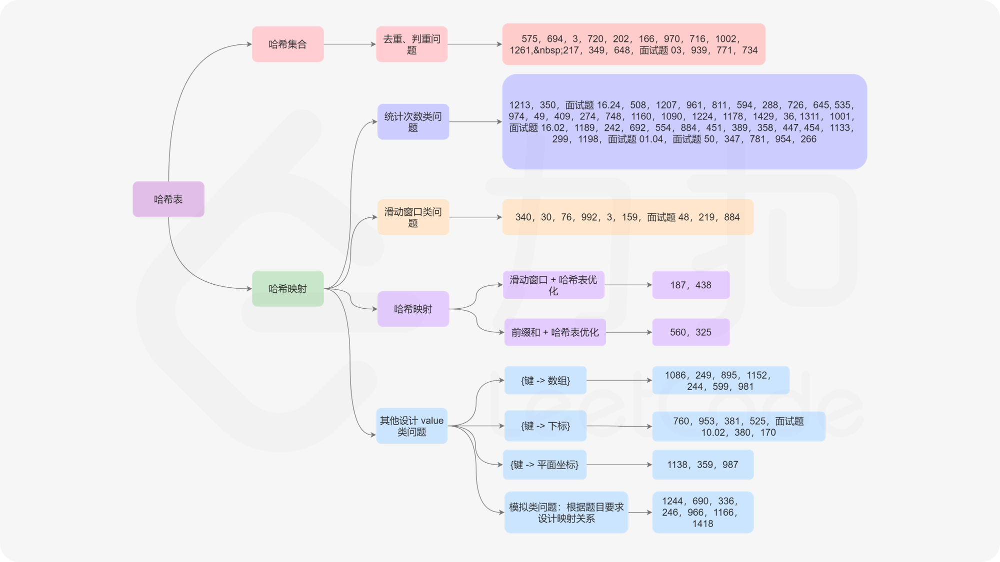

标签划分 - 哈希表
===

> Create by **jsliang** on **2020-08-14 10:45:58**  
> Recently revised in **2020-09-04 15:19:52**

## 一 理论知识

```
作者：力扣 (LeetCode)
链接：https://leetcode-cn.com/leetbook/read/hash-table-plus/k080e/
来源：力扣（LeetCode）
著作权归作者所有。商业转载请联系作者获得授权，非商业转载请注明出处。
```

### 1.1 哈希表概念

**哈希表** 是一种使用哈希函数组织数据的数据结构，它支持快速插入和搜索。

什么时候需要构造哈希表？

当我们需要 同时得到关联信息 时，可以使用哈希表建立 `key` 与 `value` 的映射关系。

例如两数之和就可以通过哈希表来实现：

> 两数之和：给定一个整数数组，返回两个元素的 索引，使这两个元素之和为 `target`。

假设我们遍历数组 `nums` 中的每一个 `x`，我们根据 `{index, target - x}` 来存储对应的哈希表。

当我们找到一个 `target - x` 的值时，我们就可以读取到对应的 `index`。

常用的构造方式：

1. {键:频次}：使用频率最高，将元素出现的次数作为值；
2. {键:数组}：如果一个键对应的信息是一组元素，可使用数组或链表存储。
3. {键:平面坐标}：某些矩阵类习题可能会存储坐标；
4. {键:其他}：一般出现在模拟题中，根据实际需要设计哈希表。

### 1.2 哈希函数和桶

哈希表（又称散列表）的原理为：借助 **哈希函数**，将键映射到存储桶地址。

更确切地说：

* 首先开辟一定长度的，具有连续物理地址的桶数组；
* 当我们插入一个新的键时，哈希函数将决定该键应该分配到哪个桶中，并将该键存储在相应的桶中；
* 当我们想要搜索一个键时，哈希表将使用哈希函数来找到对应的桶，并在该桶中进行搜索。

### 1.3 哈希冲突

已有桶：`[0, 1, 2, 3, 4]`

然后我们想存进数字：`[0, 1987, 24, 2]`，存入的方法是将它 `% 5`，即它们对应的存放是：`[0, 2, 4, 2]`。

> 这里 `y = x % 5` 就是散列函数，其中 `x` 是键值，`y` 是映射之后对应的桶的索引。

这时候，`1987` 和 `2` 就映射到同一个桶了，这种称之为 **哈希冲突**。

### 1.4 负载因子

**负载因子** 又叫装填因子，是哈希表的一个重要参数，它反映了哈希表的装满程度。

在上面的哈希冲突中，因为我们的桶过少，所以导致产生哈希冲突的几率增加。

因此，如果我们增加桶的数量，再采用合适的哈希函数，可以使发生冲突的可能性大大减少。

但是，桶过多就会造成空间浪费，就好比我们需要存储 7 个数字，如果我们划分 10000 个桶，这无疑是相当浪费的。

* **实际利用桶的个数 与 桶的总数 的比值，称为负载因子。**

比较合理的负载因子是 `0.7`，所以如果我们存储 7 个数字，那么应该创建 `7 / 0.7 = 10` 个桶。

以此类推，随着插入的数据量的增加，计算机会逐渐增加桶的个数，并选择合适的哈希函数，使得数据经过映射之后能均匀地分布在桶中。

### 1.5 优秀的哈希函数特点

1. 哈希函数的键与桶的对应关系具有确定性。也就是说，对于 key 所映射的桶地址，只由 key 键本身决定，而不由其他因素决定；
2. 哈希函数不应太过复杂。太过于复杂的哈希函数将导致计算桶地址不能快速完成，从而无法快速定位桶；
3. 映射结果的分布应具有均匀性。对于特定的桶空间，我们应尽量保证数据经过哈希函数映射之后，能够均匀地分布在桶的整个地址空间中。

### 1.6 解决哈希冲突的方法

#### 1.6.1 线性试探

线性试探法属于开放定址法的一种，除此之外，开放定址法还包括二次探测法、双重哈希法等。

所谓线性试探法，就是当插入键 key 时，如果发现桶单元 `bucket[hash(key)]` 已经被占用，则向下线性寻找，直到找到可以使用的空桶。

还是以上面的 `[0, 1987, 24, 2]` 举例，这次它们存放的桶为：

* `[0, 2, 4, 3]`

因为 `1987` 已经存放了 `2` 号桶，所以到 `2` 的时候，就往后线性试探，看到 `3` 是空的，那就占据 `3` 的位置。

同样，如果这时候再添加一个 `3`，那么它就会插入到 `5` 的位置去，即：

* `[0, 1987, 24, 2, 3]` 对应的存放为 `[0, 2, 4, 3, 5]`

#### 1.6.2 链地址法

解决冲突的另一种办法是将桶内产生冲突的键串联成一个链表。

还是拿 `[0, 1987, 2, 24]` 举例：

```js
const hash = [
  { id: 0, link: { val: 0, next: null }},
  { id: 1, link: null },
  { id: 2, link: { val: 1987, next: { val: 2, next: null }}},
  { id: 4, link: { val: 24, next: null }},
]
```

发现冲突时，通过往链表尾部添加即可，但是它会导致查找和删除/修改的成本增加。

#### 1.6.3 再哈希法

再哈希法比较典型的应用是双重哈希法，即发生冲突时，通过使用另一个哈希函数来避免冲突。不难想到，另一个哈希函数在构造时，需要具备一些约束条件才能避免再次冲突。

然而，双重哈希法同样存在一些问题：

1. 与线性试探法相比，双重哈希法会消耗较多的时间。
2. 在双重哈希法中，删除会使问题变复杂，如果逻辑删除数量太多，则应重新构造哈希表。

#### 1.6.4 公共溢出区法

顾名思义，公共溢出区法就是建立另一个哈希表 `dict_overflow` 作为公共溢出区，当发成冲突时则将该键保存在该哈希表中。

还是上面的 `[0, 1987, 2, 24]`，它的表现即为：

```js
const value = [0, 1987, 2, 24];
const hash = [
  { id: 0, value: 0 },
  { id: 2, value: 1987 },
  { id: 4, value: 24 },
];
const dict_overflow = [2];
```

如上所示，若查找的键发生冲突，则在公共溢出区进行线性查找。

#### 1.6.5 其他

1. 单独链接法：对于相同的散列值，我们将它们放到一个桶中，每个桶是相互独立的。
2. 双散列法：使用两个哈希函数计算散列值，选择碰撞更少的地址。

## 练习题分布



## 入门

* 【简单】[575-分糖果](https://leetcode-cn.com/problems/distribute-candies/)
* 【简单】[771-宝石与石头](https://leetcode-cn.com/problems/jewels-and-stones/)
* 【简单】[3-无重复字符的最长子串](https://leetcode-cn.com/problems/longest-substring-without-repeating-characters/)
* 【简单】[170-两数之和 III - 数据结构设计](https://leetcode-cn.com/problems/two-sum-iii-data-structure-design/)

## 熟练

* 【中等】[454-四数相加 II](https://leetcode-cn.com/problems/4sum-ii/)
* 【中等】[36-有效的数独](https://leetcode-cn.com/problems/valid-sudoku/)
* 【中等】[49-字母异位词分组](https://leetcode-cn.com/problems/group-anagrams/)
* 【中等】[249-移位字符串分组](https://leetcode-cn.com/problems/group-shifted-strings/)
* 【中等】[652-寻找重复的子树](https://leetcode-cn.com/problems/find-duplicate-subtrees/)
* 【中等】[347-前 K 个高频元素](https://leetcode-cn.com/problems/top-k-frequent-elements/)

## 精通

* 【中等】[311-稀疏矩阵的乘法](https://leetcode-cn.com/problems/sparse-matrix-multiplication/)

## Map - 哈希映射

* 【简单】【入门】[706-设计哈希映射](https://leetcode-cn.com/problems/design-hashmap/)
* 【简单】【入门】[001-两数之和](https://leetcode-cn.com/problems/two-sum/)
* 【简单】【入门】[205-同构字符串](https://leetcode-cn.com/problems/isomorphic-strings/)
* 【简单】【入门】[599-两个列表的最小索引总和](https://leetcode-cn.com/problems/minimum-index-sum-of-two-lists/)

## Set - 哈希集合

* 【简单】【入门】[705-设计哈希集合](https://leetcode-cn.com/problems/design-hashset)
* 【简单】【入门】[217-存在重复元素](https://leetcode-cn.com/problems/contains-duplicate/)
* 【简单】【入门】[136-只出现一次的数字](https://leetcode-cn.com/problems/single-number/)
* 【简单】【入门】[349-两个数组的交集](https://leetcode-cn.com/problems/intersection-of-two-arrays/)
* 【简答】【入门】[202-快乐数](https://leetcode-cn.com/problems/happy-number/)